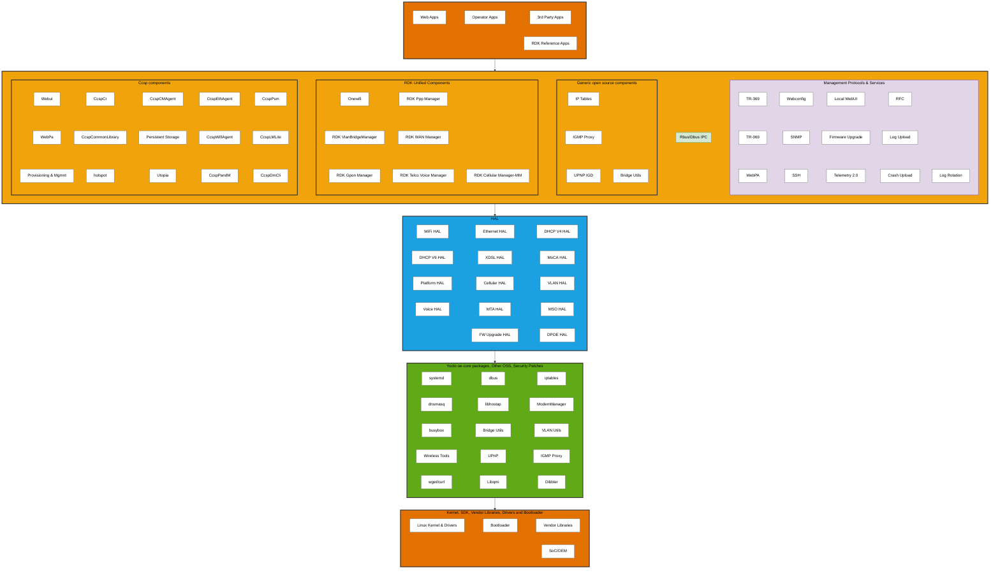
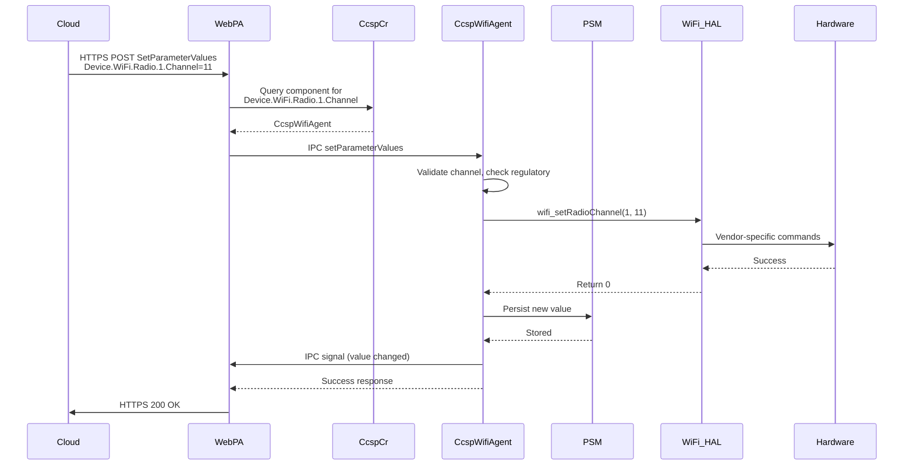
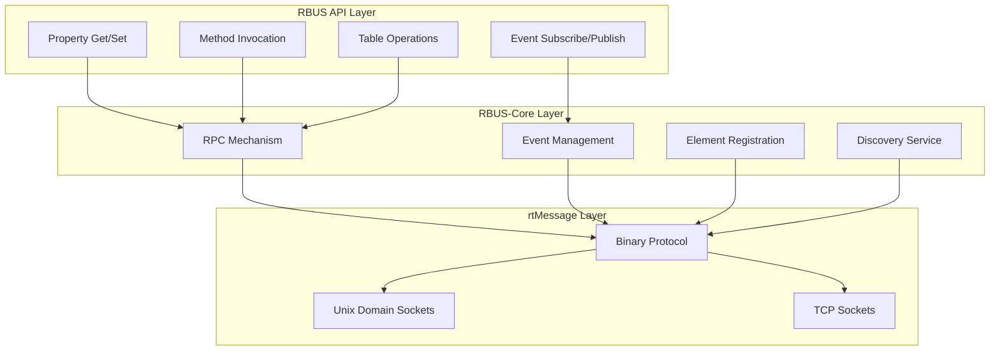
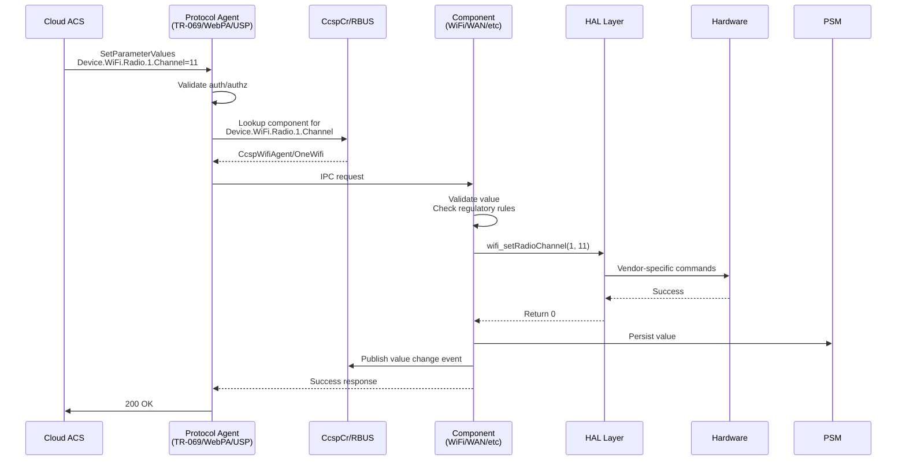
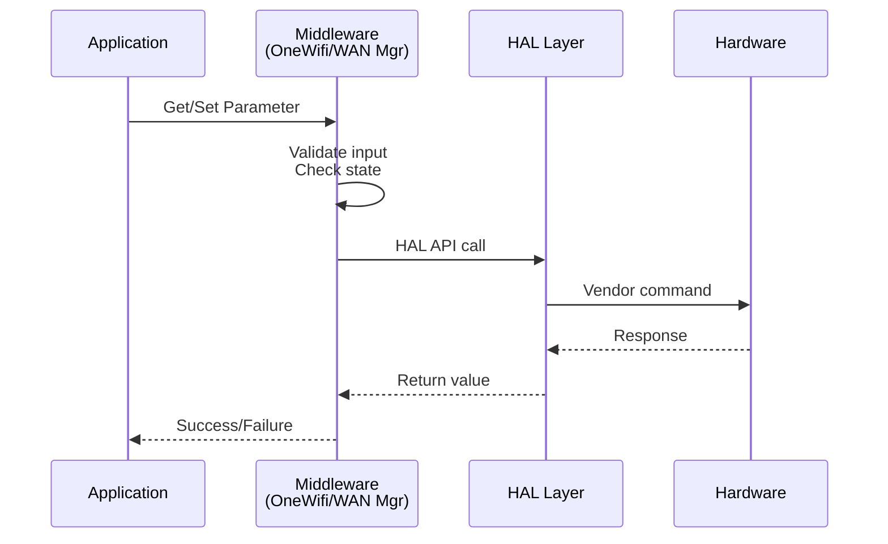
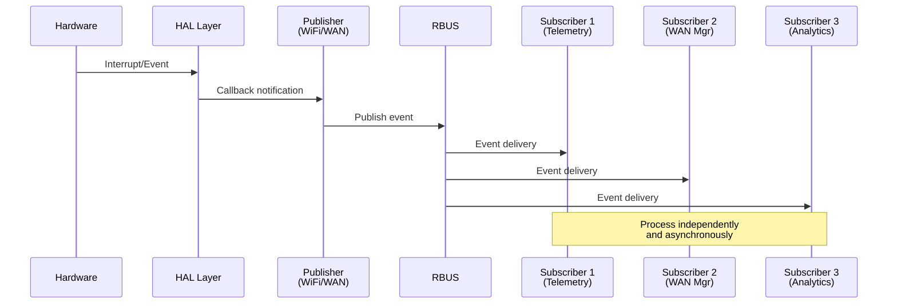
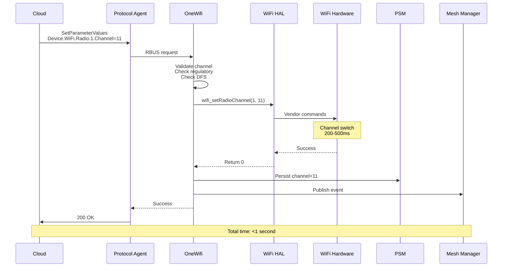
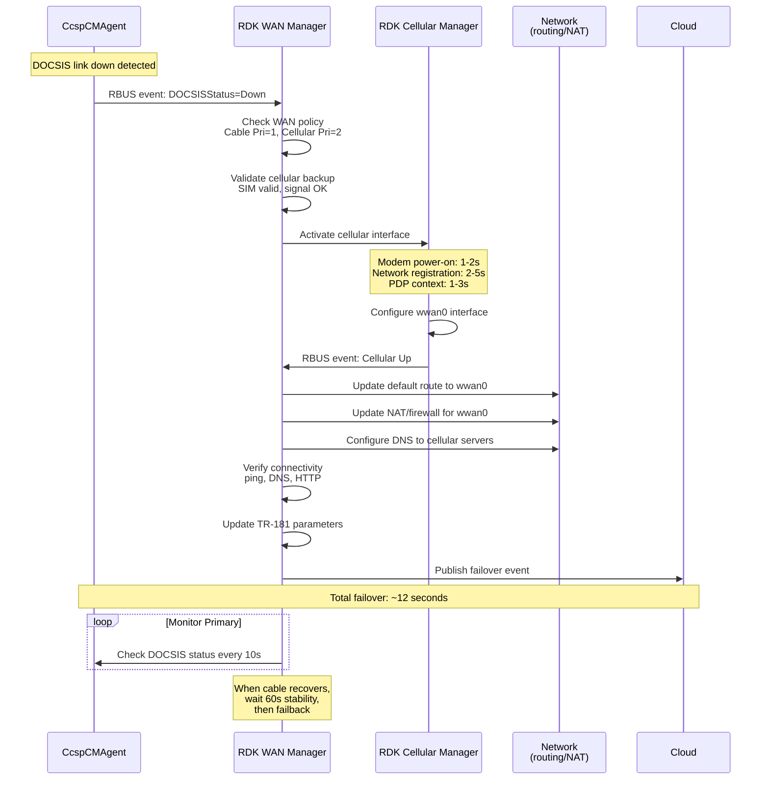

# RDK-B Architecture
RDK-B (Reference Design Kit for Broadband) follows a layered architecture that separates application logic from hardware implementation through well-defined interfaces. The stack consists of five primary layers: Application, Middleware, Hardware Abstraction Layer (HAL), OSS Core, and Platform. This modular approach enables RDK-B to be WAN-agnostic, supporting various access technologies (DOCSIS, DSL, GPON, LTE, etc.) through standardized managers and HAL interfaces, allowing the same middleware stack to operate across diverse hardware platforms.

### Key Characteristics

- **WAN-Agnostic Architecture**: Supports multiple WAN technologies (DOCSIS, DSL, GPON, LTE, Ethernet) through standardized managers. The same middleware stack works with any WAN hardware provided the respective manager and HAL implementation are available.
- **Component-Based Design**: Independent middleware components handle specific functional domains (WiFi, WAN, Voice, etc.), enabling selective deployment and customization based on device capabilities.
- **Hardware Abstraction**: Standardized HAL interfaces isolate middleware from vendor-specific implementations, allowing portability across different chipsets and SoC vendors.
- **Standards Compliance**: Built on TR-181 data model and management protocols (TR-069, TR-369, WebPA), ensuring interoperability and consistent device management.

### Design Principles

- **Layered Responsibility**: Each architectural layer has well-defined responsibilities with clear interfaces between layers.
- **Hardware Independence**: HAL layer shields middleware from hardware variations, enabling the same business logic to run on different platforms.
- **Interoperability**: Standards-based interfaces (TR-181, HAL APIs) enable component substitution and multi-vendor ecosystem.
- **Extensibility**: Modular architecture allows adding new capabilities (e.g., new WAN technology, cellular backup) without modifying core components.

## Architecture Organization

RDK-B organizes components based on their functionality and abstraction level. Components are grouped into functional categories with defined responsibilities to facilitate development and maintenance. Communication follows the layered architecture where application and middleware components interact through IPC mechanisms, middleware components access hardware through HAL interfaces, and HAL implementations translate to platform-specific operations.

#### **Application Layer**

The Application Layer provides the execution environment where various applications can reside. Web applications offer browser-based interfaces for device configuration and monitoring, including local web UI for customer self-service with responsive designs for mobile and desktop access. Operator-specific applications for network management, diagnostics, and CPE provisioning can be deployed at this layer. Third-party applications from external developers can extend device functionality with features like parental controls, security services, and smart home integration.

#### **Middleware Layer**

The Middleware Layer forms the core of RDK-B, containing business logic and management components organized into functional blocks:

**CCSP Components**: Legacy framework providing foundational services, backward compatibility with existing deployments, TR-181 data model implementation, and interoperability with legacy systems. CCSP remains actively used in many deployments.

**RDK Unified Components**: Next-generation components designed for improved performance, reduced complexity, and native RBUS support. These components are progressively replacing CCSP components, representing the ongoing evolution of RDK-B architecture.

**Generic Open Source Components**: Standard Linux networking utilities integrated into middleware for specific RDK-B use cases, including IP Tables for firewall rules, IGMP Proxy for multicast forwarding, UPnP IGD for port mapping, and Bridge Utils for Ethernet bridging.

**RBUS/D-Bus IPC**: Communication backbone enabling component interaction. **RBUS** is the modern, high-performance message bus (preferred for new components), while **D-Bus** is maintained for legacy CCSP compatibility.

**Management Protocols and Device Services**:

- **Remote Management Protocols**: TR-369 (USP), TR-069 (CWMP), WebPA, Webconfig, SNMP, SSH, and local WebUI providing device configuration and monitoring interfaces.
- **Device Management Services**: Firmware upgrades, Telemetry 2.0, RFC (Remote Feature Control), log upload, crash upload, and log rotation enabling device lifecycle management and diagnostics.

#### **Hardware Abstraction Layer (HAL)**

The Hardware Abstraction Layer provides standardized, vendor-neutral interfaces enabling portability where the same middleware code runs on different chipsets, facilitating vendor competition by making it easy to switch hardware vendors, supporting parallel development where middleware and HAL teams work independently, and enabling testing through mock HAL implementations. Major HAL interfaces include **WiFi HAL**, **Ethernet HAL**, **DHCP V4/V6 HAL**, **XDSL HAL**, **MoCA HAL**, **Platform HAL**, **Cellular HAL**, **VLAN HAL**, **Voice HAL**, **MTA HAL**, **MSO HAL**, **FW Upgrade HAL**, and **DPOE HAL**. Hardware-dependent capabilities such as MAP-T, 6GHz support, multicast handling, and secure boot vary based on vendor hardware and chipset features.

#### **OSS Core Layer**

Built on the Yocto/OpenEmbedded Linux ecosystem, the OSS Core Layer provides foundational open-source packages that RDK-B middleware utilizes. This layer includes system management tools (systemd, dbus, busybox), networking components (iptables, dnsmasq, Bridge Utils, VLAN Utils, Wireless Tools), and application services (libhostap, ModemManager, UPnP, IGMP Proxy, wget/curl, Libqmi, Dibbler). These components provide the underlying OS-level functionality that RDK-B middleware builds upon.

#### **Platform Layer**

The Platform Layer represents the hardware foundation providing kernel, drivers, bootloader, and vendor-specific implementations. The Linux kernel includes network device drivers for WiFi, Ethernet, and cellular modems, USB drivers for peripheral connectivity, flash storage drivers (MTD, UBI) for firmware and configuration storage, and hardware cryptographic accelerators for encryption offload. Bootloaders use U-Boot or vendor-specific implementations that handle hardware initialization, load kernel and device tree, and perform secure boot verification through cryptographic signature checking. Vendor libraries include SoC-specific implementations for hardware features, acceleration libraries for video codec and cryptographic operations, and WiFi drivers (proprietary or open-source depending on vendor). SoC support spans multiple vendors including Broadcom, Qualcomm, Intel, and MediaTek with Board Support Packages and reference designs provided by manufacturers.

### Detailed Architecture Diagram

The following diagram provides a detailed view of the RDK-B architecture, showing all components and their relationships:

---

## CCSP

**CCSP (Common Component Software Platform)** is a comprehensive framework developed as part of the RDK-B initiative to provide a standardized, component-based approach to implementing broadband device functionality. The framework provides standardized component interfaces, reference implementations, common libraries and utilities, and unified message bus communication.

### Design Approach

CCSP implements a component-based architecture where each functional domain (WiFi, Ethernet, provisioning, management) runs as an independent process with its own address space and lifecycle.

**Benefits of Process Isolation**:
- **Fault Isolation**: When a component crashes (e.g., WiFi agent segfault), other components continue operating. The system can restart the failed component without full reboot, maintaining services like WAN connectivity and remote management.
- **Independent Updates**: Components can be upgraded separately without recompiling the entire stack. Operators can deploy WiFi improvements without touching WAN or voice components, reducing regression risk and testing burden.
- **Resource Distribution**: In multi-core SoCs, the Linux scheduler distributes component processes across CPU cores. High-traffic components like WiFi or WAN can utilize separate cores, preventing CPU bottlenecks that would occur in a monolithic design.
- **Vendor Flexibility**: Service providers can replace specific components with proprietary implementations while keeping standard RDK components for other functions. For example, using a vendor-specific WiFi component while retaining standard TR-069 and provisioning components.

**Key Characteristics**:
- **TR-181 Data Model**: Every manageable parameter follows Device:2 data model naming. Components expose parameters like Device.WiFi.Radio.{i}.Channel, enabling standardized access regardless of which component implements the functionality.
- **Component Communication**: Components communicate through IPC mechanisms for parameter get/set operations and event notifications.
- **Interface Separation**: Components separate data model interface (TR-181 parameter handlers) from business logic (actual WiFi configuration, packet processing). This allows changing internal implementation without affecting external API contracts.
- **Dynamic Registration**: Components register their supported TR-181 namespaces with CcspCr at startup, enabling runtime discovery and allowing flexible deployment where optional components can be included or omitted based on device capabilities.

---

### CCSP Architecture

#### Core Components

The CCSP framework relies on several foundational components that provide infrastructure services used by all other components. These core components handle component registration and discovery, parameter persistence, common library functions, and device-level management. Without these core services, functional components like WiFi or WAN agents cannot operate.

**CcspCr (Component Registrar)**: Acts as the central registry where components announce their presence and capabilities at startup. CcspCr maintains a mapping of TR-181 namespaces to component names (e.g., Device.WiFi.* → CcspWifiAgent), performs health monitoring through periodic heartbeat checks, provides discovery services allowing components to locate each other without hardcoded dependencies, and supports namespace conflict resolution when multiple components claim the same parameters.

**CcspPandM (Protocol and Management)**: Manages device-level operations including device provisioning (first boot configuration, factory reset handling), parameter management for Device.DeviceInfo.* (manufacturer, model, serial number), Device.Time.* (NTP configuration, timezone), and Device.UserInterface.* (web UI settings). CcspPandM acts as the TR-181 gateway receiving requests from TR-069 client or WebPA agent and routing them to appropriate components based on CcspCr lookups.

**CcspPsm (Persistent Storage Manager)**: Provides database services using XML files or SQLite for parameter storage with in-memory cache for fast access. PSM handles parameter persistence ensuring configuration survives reboots, backup and restore operations for disaster recovery, and transaction support for atomic multi-parameter updates.

**CcspCommonLibrary**: Offers shared libraries that simplify IPC operations, providing wrapper functions that hide IPC complexity, data model framework with TR-181 type conversions, component infrastructure for registration and message handling, and utility functions for logging, memory management, and string operations.

#### Key Components

Key components implement specific functional domains, handling dedicated areas like WiFi, Ethernet, cable modem, and network management.

**CcspWifiAgent**: Manages Device.WiFi.* namespace covering radio configuration (channel, bandwidth, transmit power), SSID management supporting up to 16 SSIDs per radio, security settings (WPA2/WPA3, encryption), and client management (association, steering, statistics).

**CcspEthAgent**: Handles Device.Ethernet.* for wired interfaces including link state monitoring, statistics collection (bytes, packets, errors), port configuration, and VLAN tagging.

**CcspCMAgent**: Manages cable modem functionality (Device.X_CISCO_COM_CableModem.*) providing DOCSIS status, downstream/upstream channel information, signal quality metrics (SNR, power levels), and cable diagnostics.

**CcspLMLite**: Implements Device.Hosts.* for LAN device discovery through ARP and DHCP monitoring, device tracking with MAC and IP addresses, and network topology mapping.

**CcspDmCli**: Command-line tool for TR-181 operations enabling parameter get/set, table operations, component discovery, and debugging during development.

#### Message Flow Example

When changing a WiFi channel through WebPA, the cloud server sends an HTTPS POST to WebPA Agent with parameter name and value. WebPA Agent queries CcspCr to find the owner (CcspWifiAgent), then sends an IPC setParameterValues request. CcspWifiAgent validates the channel against regulatory rules and radio state, invokes wifi_setRadioChannel() in WiFi HAL which translates to vendor commands, persists the value through PSM, publishes an IPC event, and returns success.

---

## RDK Unified Components

To address CCSP's limitations and modernize the RDK-B architecture, RDK Unified Components were developed as next-generation middleware designed for better performance, simpler design, and native RBUS support. These components are progressively replacing CCSP components in an ongoing transition, with both architectures coexisting in current deployments. Unified Components provide direct HAL access reducing layers between component and hardware, RBUS optimization delivering faster performance for many operations, asynchronous design with non-blocking I/O preventing stalls, and efficient memory usage through shared libraries instead of separate processes where appropriate.

The architecture emphasizes simplicity through fewer components via consolidation, cleaner APIs using modern C++ interfaces with less boilerplate, better documentation with comprehensive API docs and examples, and easier debugging through streamlined code paths. Modularity is achieved through plugin architecture where features can be added as loadable modules, runtime configuration to enable/disable features without recompilation, clear dependency management, and version compatibility with backward compatibility layers.

### Core Components

Core unified components provide foundational services that other unified components depend on.

**RDK WAN Manager**: Central orchestrator for WAN connectivity managing multiple WAN interfaces (Ethernet, DOCSIS, DSL, GPON, LTE, PPPoE) with multi-WAN support. Implements automatic failover using ping/HTTP/DNS health checks, load balancing across connections, and policy-based routing for application-aware decisions.

**RDK VLAN Bridge Manager**: Configures VLANs and bridges for service segmentation (IPTV, VoIP, data, guest networks, IoT). Supports 802.1Q tagging, QinQ nested VLANs, dynamic creation, and service-to-VLAN mapping.

### Key Components

Key unified components implement specific functional domains.

**OneWifi**: Replaces CcspWifiAgent, CcspHotspot, and vendor WiFi managers with single unified component. Manages all radios and SSIDs from one process, supports WiFi 6/6E features (OFDMA, TWT, BSS coloring, WPA3), implements client steering across 2.4GHz/5GHz/6GHz bands, and provides mesh networking.

**RDK GPON Manager**: Controls GPON/EPON optical interfaces for fiber broadband. Manages ONU/ONT operations (optical signal monitoring, ranging, registration, power control), OMCI protocol, and service provisioning from OLT.

**RDK PPP Manager**: Establishes PPPoE/PPPoA connections with PAP/CHAP/MS-CHAP authentication, dynamic IP and DNS configuration, automatic reconnection on failure, and support for VLAN-tagged sessions.

**RDK Telco Voice Manager**: Manages VoIP services including SIP registration, codec handling (G.711, G.729, G.722), call features (waiting, forwarding, caller ID), RTP/SRTP media with QoS, and FXS/FXO port control.

**RDK Cellular Manager-MM**: Controls LTE/5G modems for WAN connectivity. Handles modem power and firmware, SIM operations (PIN/PUK, eSIM), network registration (2G/3G/LTE/5G), PDP context activation, and data usage tracking.

---

## Inter-Process Communication - RBUS

RBUS is RDK's modern IPC solution designed for embedded broadband devices, addressing performance and complexity issues of legacy IPC mechanisms. RBUS uses a three-layer architecture: the RBUS API Layer provides TR-181-aligned APIs for properties, methods, events, and table operations; the RBUS-Core Layer handles RPC, event publish/subscribe, registration, and discovery; and the rtMessage Layer provides lightweight binary protocol over Unix domain sockets or TCP.

The protocol uses direct point-to-point communication with optimized binary protocol, enabling faster operations compared to legacy mechanisms. RBUS provides event-driven communication where value change notifications automatically update subscribers when parameters change, eliminating polling. Wildcard subscriptions support patterns ("Device.WiFi.Radio.*.Enable") and namespace matching ("Device.WiFi.**"), with event filtering to deliver only events matching specified criteria.

**RBUS CLI (rbuscli)**: Interactive tool for testing and debugging with operations for property get/set, event subscription, method invocation, element discovery, and event logging.

---

## TR-181 Data Model Integration

TR-181 is the Broadband Forum specification defining a standardized, hierarchical data model for broadband devices. RDK-B uses TR-181 as the common data model across all management protocols and interfaces, providing vendor interoperability through consistent parameter naming and enabling operational efficiency with common tools across device fleets.

**Structure**:
- **Objects**: Containers grouping related parameters (Device.WiFi., Device.WiFi.Radio.{i}.)
- **Parameters**: Individual data values with types (Device.WiFi.Radio.1.Channel as int, Device.WiFi.Radio.1.Enable as boolean)
- **Multi-instance Objects**: Tables denoted by {i} with numbered instances (Device.WiFi.SSID.{i}. → Device.WiFi.SSID.1., Device.WiFi.SSID.2.)
- **Commands**: Executable operations (Device.WiFi.Radio.1.Reset(), Device.Reboot())

**Component Ownership** in RDK-B:
- CcspPandM: Device.DeviceInfo.*, Device.Time.*, Device.UserInterface.*, Device.Users.*
- OneWifi/CcspWifiAgent: Device.WiFi.*
- CcspEthAgent: Device.Ethernet.*
- RDK WAN Manager: Device.X_RDK_WanManager.*, coordinates WAN interfaces
- RDK VLAN Bridge Manager: Device.X_RDK_Vlan.*
- RDK GPON Manager: Device.X_RDK_PON.*
- RDK Cellular Manager: Device.Cellular.*

### TR-181 Request Flow

**Flow Steps**:
1. **Request Initiation**: Cloud ACS sends RPC via TR-069 (SOAP/HTTP), TR-369 (USP/MQTT), or WebPA (HTTPS)
2. **Protocol Agent**: Receives request, validates authentication and authorization, extracts parameter path and value
3. **Namespace Resolution**: For CCSP, CcspCr queries component ownership; RBUS has built-in discovery
4. **IPC Communication**: Marshal parameter and value, route to owning component via IPC
5. **Component Processing**: Validate input against state and regulatory rules, prepare HAL call
6. **HAL Invocation**: Execute standardized vendor-neutral API, translate to chipset-specific commands
7. **Hardware Execution**: Driver sends commands to chip, firmware executes changes
8. **Response**: Component receives HAL confirmation, updates state, publishes event, persists via PSM, returns success to agent, agent confirms to cloud

---

## Component Interactions

RDK-B components interact using patterns that balance performance, maintainability, and system complexity. Three primary patterns govern component communication.

### Request-Response Pattern

Synchronous, top-down pattern for simple get/set operations. Requests flow from application through middleware (business logic, validation) to HAL (hardware abstraction) to platform (vendor implementation). Caller blocks waiting for response.

**Use Cases**: Configuration queries, single parameter updates, status reads that complete in <100ms

### Event-Driven Pattern

Asynchronous publish/subscribe pattern where producers publish events and multiple consumers react independently. Hardware events flow from driver through HAL to middleware, which publishes RBUS events received by subscribers (Telemetry, WAN Manager, Analytics).

**Use Cases**: WiFi client association/disassociation, WAN link up/down events, DHCP lease changes, system alarms, real-time telemetry

---

## Practical Use Cases

### WiFi Channel Change via Cloud

When operators detect interference affecting customer devices, they remotely change WiFi channels through cloud management. The cloud sends a SetParameterValues request via protocol agent (TR-069, TR-369, or WebPA) with the new channel (Device.WiFi.Radio.1.Channel = 11). The **Protocol Agent** routes the request via **RBUS** to **OneWifi** (or **CcspWifiAgent** in legacy systems). OneWifi validates channel validity for the frequency band, regulatory compliance, radio state, and DFS restrictions.

After validation, OneWifi calls wifi_setRadioChannel() in WiFi HAL, translating to vendor-specific commands for chipsets from vendors like Broadcom, Qualcomm, Intel, or MediaTek. The driver and firmware perform the channel switch in 200-500ms with 100-300ms for client reassociation, totaling under 1 second interruption. OneWifi persists the configuration through **PSM**, publishes RBUS events (e.g., to **Mesh Manager** for mesh node coordination), then returns success to the Protocol Agent which confirms to cloud.

### WAN Interface Failover

When a primary DOCSIS connection fails, the RDK-B gateway automatically switches to LTE backup. **CcspCMAgent** detects DOCSIS link down within 2 seconds and publishes RBUS event (Device.X_CISCO_COM_CableModem.DOCSISStatus = "Down"). **RDK WAN Manager** receives the event, retrieves WAN policy from PSM (Cable Priority 1, Cellular Priority 2 with AUTO failover), and validates cellular backup (SIM validity, signal strength, regulatory status, data plan).

WAN Manager invokes **RDK Cellular Manager** via RBUS to activate cellular. Cellular Manager powers on modem (1-2s), performs network registration with LTE band scanning (2-5s), and establishes PDP context with carrier gateway (1-3s), totaling 4-10 seconds. After receiving IP configuration (carrier-grade NAT IP, gateway, DNS, MTU), Cellular Manager configures wwan0 interface and publishes "Cellular Up" event.

WAN Manager reconfigures the system: updates routing (default route to wwan0), updates NAT/firewall rules (MASQUERADE for wwan0), and configures DNS forwarder for cellular servers. After connectivity verification (ping, DNS, HTTP), WAN Manager updates TR-181 parameters, persists configuration via PSM, and publishes failover events to cloud for monitoring. Total failover time: ~12 seconds.

WAN Manager monitors primary cable every 10 seconds. On recovery, it verifies 60-second stability before automatic failback to the preferred lower-cost, higher-speed cable connection.

---
