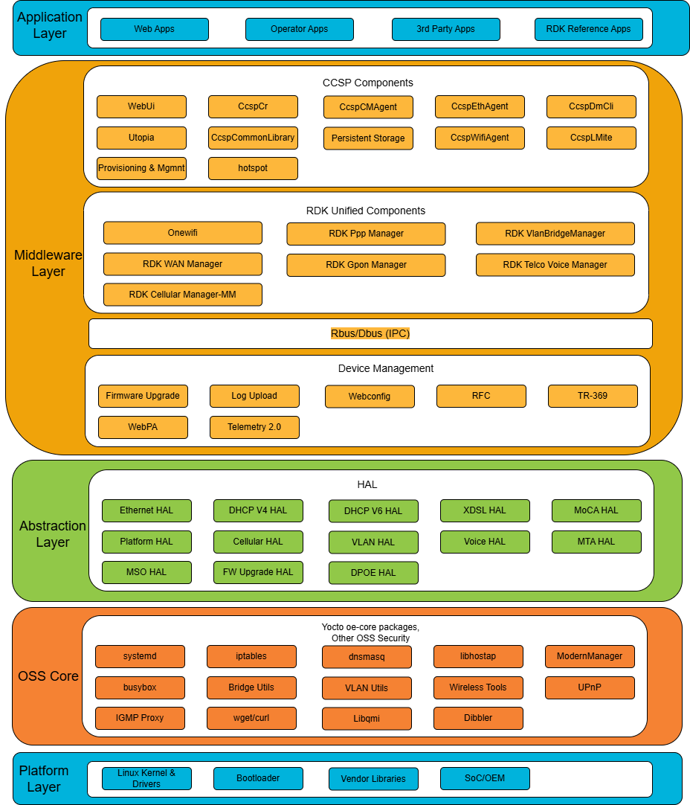
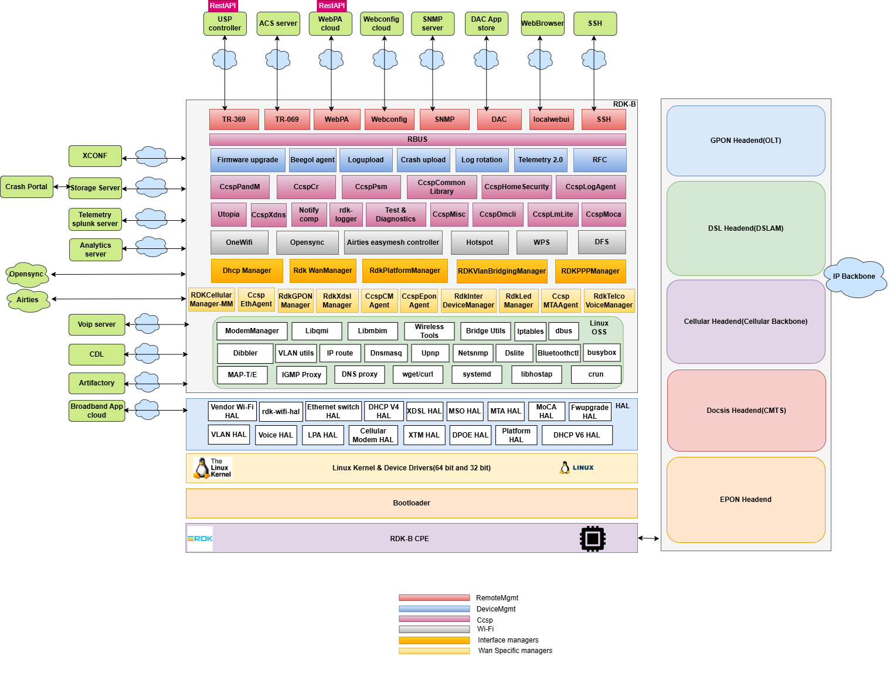
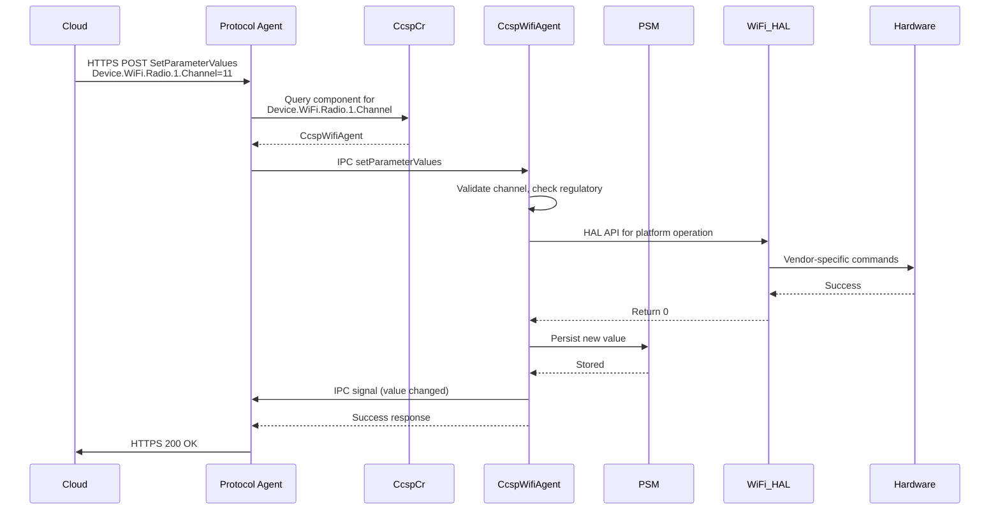
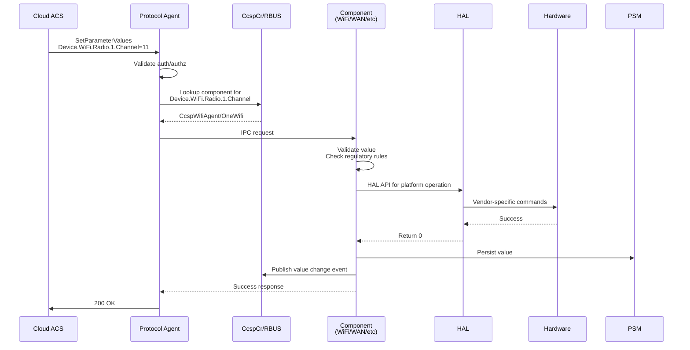
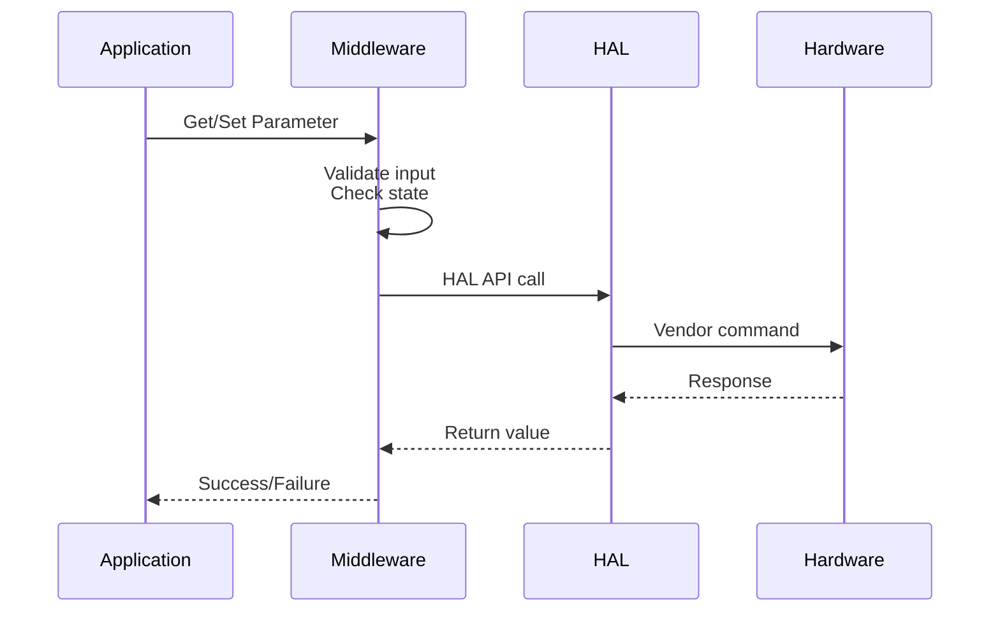
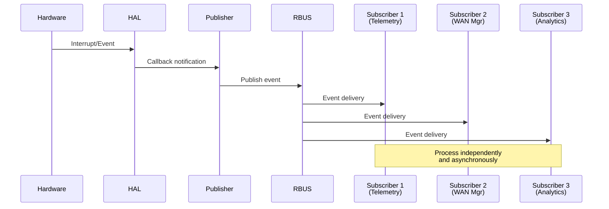
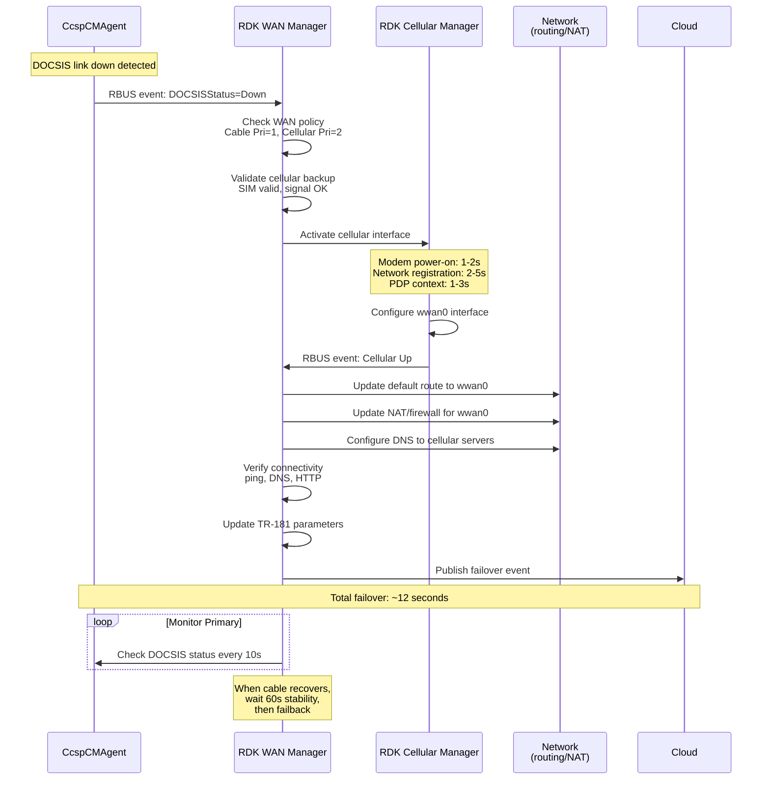

# RDK-B Architecture
RDK-B follows a layered architecture that cleanly separates application logic from hardware-specific implementation through well-defined interfaces. The architecture is organized into multiple layers, including Application, Middleware, and Hardware Abstraction Layer, enabling clear separation of responsibilities and reducing cross-layer dependencies. This modular structure allows RDK-B to remain WAN-agnostic by supporting multiple access technologies such as DOCSIS, DSL, GPON, and LTE through standardized managers and HAL interfaces, while allowing the same core middleware stack to operate consistently across different hardware platforms.

The RDK-B middleware is designed as a collection of largely independent, componentized services, each responsible for a specific functional domain such as WiFi, WAN, or Voice. These components communicate through defined interfaces and data models, minimizing tight coupling and enabling selective inclusion based on target device requirements. As a result, middleware components can be added, removed, or replaced without impacting unrelated functionality, making it straightforward to tailor builds for devices with different capabilities or feature sets. This design approach improves portability, simplifies customization, and supports long-term extensibility without requiring changes to the overall architecture.

## Architecture Organisation

RDK-B organizes components based on functionality and level of abstraction, with each group having clearly defined responsibilities. Within the middleware layer, components are largely independent and communicate with each other using IPC mechanisms, enabling modularity and selective inclusion based on device requirements. Hardware access is performed through HAL interfaces, with platform-specific implementations translating these interactions to the underlying system.

### Application Layer

The Application Layer serves as the primary interface through which CPE consumers interact with the device, including support for third-party applications. This layer hosts web-based applications that provide browser-accessible interfaces for device configuration and monitoring, including local web UI capabilities for customer self-service with responsive designs for desktop and mobile access. It also supports operator-specific applications for network management, diagnostics, and CPE provisioning, as well as third-party applications that extend device functionality with capabilities such as parental controls, security services, and smart home integration.
.
### Middleware Layer

The RDK-B Middleware can be logically organized into multiple subsections based on functionality and architectural role.

*   **CCSP Components**: Legacy framework components that provide foundational services, maintain backward compatibility with existing deployments, and implement the TR-181 data model to ensure interoperability with legacy systems.

*   **RDK Unified Components**: Next-generation components designed to improve performance and reduce architectural complexity, with native RBUS support. These components represent the ongoing evolution of the RDK-B architecture and are progressively replacing CCSP components.

*   **RBUS and D-Bus IPC**: The inter-component communication backbone for the middleware. RBUS serves as the modern, high-performance message bus and is the preferred choice for new components, while D-Bus is retained to support legacy CCSP-based implementations.

*   **Device Management**: Protocol agents and device services that enable remote device management and lifecycle operations.
    - **TR-369 (USP)**: Next-generation management protocol supporting MQTT, WebSocket, and STOMP bindings with improved security and flexibility
    - **WebPA**: HTTP/WebSocket-based protocol for real-time device management and configuration
    - **Webconfig**: Centralized configuration management allowing bulk device provisioning and policy enforcement
    - **RFC (Remote Feature Control)**: Dynamic feature enablement and A/B testing framework for controlled rollouts
    - **Telemetry 2.0**: Telemetry collection with configurable profiles, event-driven reporting, and data aggregation
    - **Firmware Upgrade**: Secure firmware download, verification, installation, and rollback capabilities
    - **Log Upload**: Automated collection and upload of device logs for troubleshooting and diagnostics

### Hardware Abstraction Layer (HAL)

The HAL provides standardized, vendor-neutral interfaces that enable middleware portability across different chipsets, allowing the same middleware codebase to run on multiple hardware platforms and simplifying the ability to switch hardware vendors. By isolating hardware-specific details behind well-defined HAL interfaces—such as WiFi, Ethernet, DHCP V4/V6, XDSL, Platform, Cellular, and VLAN—the architecture promotes flexibility and vendor competition. Hardware-dependent capabilities, including MAP-T support, 6 GHz operation, multicast handling, and secure boot, are determined by the underlying chipset and vendor-specific implementations.

### OSS Core Layer

Built on the Yocto/OpenEmbedded Linux ecosystem, the OSS Core Layer provides foundational open-source packages that RDK-B middleware utilizes. This layer includes system management tools (systemd, dbus, busybox), networking components (iptables, dnsmasq, Bridge Utils, VLAN Utils, Wireless Tools), and application services (libhostap, ModemManager, UPnP, IGMP Proxy, wget/curl, Libqmi, Dibbler). These components provide the underlying OS-level functionality that RDK-B middleware builds upon.

### Platform Layer

The Platform Layer represents the hardware foundation providing kernel, drivers, bootloader, and vendor-specific implementations. The Linux kernel includes network device drivers for WiFi, Ethernet, and cellular modems, USB drivers for peripheral connectivity, flash storage drivers (MTD, UBI) for firmware and configuration storage, and hardware cryptographic accelerators for encryption offload. Bootloaders use U-Boot or vendor-specific implementations that handle hardware initialization, load kernel and device tree, and perform secure boot verification through cryptographic signature checking. Vendor libraries include SoC-specific implementations for hardware features, acceleration libraries for video codec and cryptographic operations, and WiFi drivers (proprietary or open-source depending on vendor). SoC support spans multiple vendors including Broadcom, Qualcomm, Intel, and MediaTek with Board Support Packages and reference designs provided by manufacturers.

## Architectural Deep dive

The following diagram provides a detailed view of the RDK-B architecture, showing all components and their relationships:

---

## CCSP

CCSP (Common Component Software Platform) is a framework developed as part of the RDK-B initiative to provide a standardized, component-based approach to implementing broadband device functionality. The framework provides standardized component interfaces, reference implementations, common libraries and utilities, and unified message bus communication.

### Design Approach

CCSP implements a component-based architecture where each functional domain (WiFi, Ethernet, provisioning, management) runs as an independent process with its own address space and lifecycle.

**Benefits of Decoupled Components**:
- **Fault Isolation**: When a component crashes (e.g., WiFi agent segfault), other components continue operating. The system can restart the failed component without full reboot, maintaining services like WAN connectivity and remote management.
- **Resource Distribution**: In multi-core SoCs, the Linux scheduler distributes component processes across CPU cores. High-traffic components like WiFi or WAN can utilize separate cores, preventing CPU bottlenecks that would occur in a monolithic design.

**Key Characteristics**:
- **TR-181 Data Model**: Every manageable parameter follows Device:2 data model naming. Components expose parameters like Device.WiFi.Radio.{i}.Channel, enabling standardized access regardless of which component implements the functionality.
- **Interface Separation**: Components separate data model interface (TR-181 parameter handlers) from business logic (actual WiFi configuration, packet processing). This allows changing internal implementation without affecting external API contracts.
- **Dynamic Registration**: Components register their supported TR-181 namespaces with CcspCr at startup, enabling runtime discovery and allowing flexible deployment where optional components can be included or omitted based on device capabilities.

---

### CCSP Architecture

#### Core Components

The CCSP framework relies on several foundational components that provide infrastructure services used by all other components. These core components handle component registration and discovery, parameter persistence, common library functions, and device-level management. Without these core services, functional components like WiFi or WAN agents cannot operate.

**CcspCr (Component Registrar)**: Acts as the central registry where components announce their presence and capabilities at startup. CcspCr maintains a mapping of TR-181 namespaces to component names (e.g., Device.WiFi.* → CcspWifiAgent), performs health monitoring through periodic heartbeat checks, provides discovery services allowing components to locate each other without hardcoded dependencies, and supports namespace conflict resolution when multiple components claim the same parameters.

**CcspPandM (Protocol and Management)**: Manages device-level operations including device provisioning (first boot configuration, factory reset handling), parameter management for Device.DeviceInfo.* (manufacturer, model, serial number), Device.Time.* (NTP configuration, timezone), and Device.UserInterface.* (web UI settings). CcspPandM acts as the TR-181 gateway receiving requests from TR-069 client or WebPA agent and routing them to appropriate components based on CcspCr lookups.

**CcspPsm (Persistent Storage Manager)**: Provides database services using XML files or SQLite for parameter storage with in-memory cache for fast access. PSM handles parameter persistence ensuring configuration survives reboots, backup and restore operations for disaster recovery, and transaction support for atomic multi-parameter updates.

**CcspCommonLibrary**: Offers shared libraries that simplify IPC operations, providing wrapper functions that hide IPC complexity, data model framework with TR-181 type conversions, component infrastructure for registration and message handling, and utility functions for logging, memory management, and string operations.

#### Key Components

Key components implement specific functional domains, handling dedicated areas like WiFi, Ethernet, cable modem, and network management.

**CcspWifiAgent**: Controls all WiFi operations including radio management, SSID configuration, and client connectivity. It manages wireless radios across 2.4GHz, 5GHz, and 6GHz bands, supports multiple SSIDs per radio with independent security policies, and handles client association, authentication, and steering. Owns the Device.WiFi.* namespace covering Device.WiFi.Radio.{i}.* for radio configuration (channel, bandwidth, transmit power), Device.WiFi.SSID.{i}.* for SSID management, and Device.WiFi.AccessPoint.{i}.* for security settings and client statistics.

**CcspEthAgent**: Manages all Ethernet wired networking operations including physical port configuration, link state management, and statistics collection. It monitors interface status, tracks traffic metrics, and configures port-level parameters such as duplex mode and speed. Owns the Device.Ethernet.* namespace covering Device.Ethernet.Interface.{i}.* for interface parameters and Device.Ethernet.Link.{i}.* for link-level configuration.

**CcspCMAgent**: Interfaces with the cable modem hardware to monitor DOCSIS WAN connectivity and provide access to modem diagnostics. It tracks signal quality metrics, channel bonding status, and modem operational state, providing visibility into downstream/upstream channels and performing cable network diagnostics. Owns the Device.X_CISCO_COM_CableModem.* namespace for DOCSIS-specific parameters including signal levels (SNR, power), channel information, and modem status.

**CcspLMLite**: Discovers and tracks devices connected to the LAN through active monitoring of ARP tables and DHCP lease information. It maintains an inventory of connected hosts with their MAC addresses, IP addresses, hostnames, and connection timestamps, building a real-time network topology map. Owns the Device.Hosts.* namespace including Device.Hosts.Host.{i}.* for discovered device information and connection details.

**CcspDmCli**: Command-line tool for TR-181 operations enabling parameter get/set, table operations, component discovery, and debugging during development.

#### Message Flow Example

When changing a WiFi channel through a protocol agent (TR-369, WebPA, etc.), the cloud server sends an HTTPS POST to the Protocol Agent with parameter name and value. Protocol Agent queries CcspCr to find the owner (CcspWifiAgent), then sends an IPC setParameterValues request. CcspWifiAgent validates the channel against regulatory rules and radio state, invokes the HAL API for platform operation in WiFi HAL which translates to vendor commands, persists the value through PSM, publishes an IPC event, and returns success.

---

## RDK Unified Components

To address CCSP's limitations and modernize the RDK-B architecture, RDK Unified Components were developed as next-generation middleware designed for better performance, simpler design, and native RBUS support. These components are progressively replacing CCSP components in an ongoing transition, with both architectures coexisting in current deployments. Unified Components provide direct HAL access reducing layers between component and hardware, RBUS optimization delivering faster performance for many operations, asynchronous design with non-blocking I/O preventing stalls, and efficient memory usage through shared libraries instead of separate processes where appropriate.

The architecture emphasizes simplicity through fewer components via consolidation, cleaner APIs using modern C++ interfaces with less boilerplate, better documentation with detailed API docs and examples, and easier debugging with simplified code paths. Modularity is achieved through plugin architecture where features can be added as loadable modules, runtime configuration to enable/disable features without recompilation, clear dependency management, and version compatibility with backward compatibility layers.

### Core Components

Core unified components provide foundational services that other unified components depend on.

**RDK WAN Manager**: Central orchestrator for WAN connectivity managing multiple WAN interfaces (Ethernet, DOCSIS, DSL, GPON, LTE, PPPoE) with multi-WAN support. Implements automatic failover using ping/HTTP/DNS health checks, load balancing across connections, and policy-based routing for application-aware decisions.

**RDK VLAN Bridge Manager**: Configures VLANs and bridges for service segmentation (IPTV, VoIP, data, guest networks, IoT). Supports 802.1Q tagging, QinQ nested VLANs, dynamic creation, and service-to-VLAN mapping.

### Key Components

Key unified components implement specific functional domains.

**OneWifi**: Replaces CcspWifiAgent, CcspHotspot, and vendor WiFi managers with single unified component. Manages all radios and SSIDs from one process, supports WiFi 6/6E features (OFDMA, TWT, BSS coloring, WPA3), implements client steering across 2.4GHz/5GHz/6GHz bands, and provides mesh networking.

**RDK GPON Manager**: Controls GPON/EPON optical interfaces for fiber broadband. Manages ONU/ONT operations (optical signal monitoring, ranging, registration, power control), OMCI protocol, and service provisioning from OLT.

**RDK PPP Manager**: Establishes PPPoE/PPPoA connections with PAP/CHAP/MS-CHAP authentication, dynamic IP and DNS configuration, automatic reconnection on failure, and support for VLAN-tagged sessions.

**RDK Telco Voice Manager**: Manages VoIP services including SIP registration, codec handling (G.711, G.729, G.722), call features (waiting, forwarding, caller ID), RTP/SRTP media with QoS, and FXS/FXO port control.

**RDK Cellular Manager-MM**: Controls LTE/5G modems for WAN connectivity. Handles modem power and firmware, SIM operations (PIN/PUK, eSIM), network registration (2G/3G/LTE/5G), PDP context activation, and data usage tracking.

---

## Inter-Process Communication - RBUS

RBUS is RDK's modern IPC solution designed for embedded broadband devices, addressing performance and complexity issues of legacy IPC mechanisms. RBUS uses a three-layer architecture: the RBUS API Layer provides TR-181-aligned APIs for properties, methods, events, and table operations; the RBUS-Core Layer handles RPC, event publish/subscribe, registration, and discovery; and the rtMessage Layer provides lightweight binary protocol over Unix domain sockets or TCP.

The protocol uses direct point-to-point communication with binary protocol, enabling faster operations compared to legacy mechanisms. RBUS provides event-driven communication where value change notifications automatically update subscribers when parameters change, eliminating polling. Wildcard subscriptions support patterns ("Device.WiFi.Radio.*.Enable") and namespace matching ("Device.WiFi.**"), with event filtering to deliver only events matching specified criteria.

---

## TR-181 Data Model Integration

TR-181 is the Broadband Forum specification defining a standardized, hierarchical data model for broadband devices. RDK-B uses TR-181 as the common data model across all management protocols and interfaces, providing vendor interoperability through consistent parameter naming and enabling operational efficiency with common tools across device fleets.

**Structure**:
- **Objects**: Containers grouping related parameters (Device.WiFi., Device.WiFi.Radio.{i}.)
- **Parameters**: Individual data values with types (Device.WiFi.Radio.1.Channel as int, Device.WiFi.Radio.1.Enable as boolean)
- **Multi-instance Objects**: Tables denoted by {i} with numbered instances (Device.WiFi.SSID.{i}. → Device.WiFi.SSID.1., Device.WiFi.SSID.2.)
- **Commands**: Executable operations (Device.WiFi.Radio.1.Reset(), Device.Reboot())

**Component Ownership** in RDK-B:
- CcspPandM: Device.DeviceInfo.*, Device.Time.*, Device.UserInterface.*, Device.Users.*
- OneWifi/CcspWifiAgent: Device.WiFi.*
- CcspEthAgent: Device.Ethernet.*
- RDK WAN Manager: Device.X_RDK_WanManager.*, coordinates WAN interfaces
- RDK VLAN Bridge Manager: Device.X_RDK_Vlan.*
- RDK GPON Manager: Device.X_RDK_PON.*
- RDK Cellular Manager: Device.Cellular.*

### TR-181 Request Flow

**Flow Steps**:
1. **Request Initiation**: Cloud ACS sends RPC via TR-069 (SOAP/HTTP), TR-369 (USP/MQTT), or WebPA (HTTPS)
2. **Protocol Agent**: Receives request, validates authentication and authorization, extracts parameter path and value
3. **Namespace Resolution**: For CCSP, CcspCr queries component ownership; RBUS has built-in discovery
4. **IPC Communication**: Marshal parameter and value, route to owning component via IPC
5. **Component Processing**: Validate input against state and regulatory rules, prepare HAL call
6. **HAL Invocation**: Execute standardized vendor-neutral API, translate to chipset-specific commands
7. **Hardware Execution**: Driver sends commands to chip, firmware executes changes
8. **Response**: Component receives HAL confirmation, updates state, publishes event, persists via PSM, returns success to agent, agent confirms to cloud

---

## Component Interactions

RDK-B components interact using patterns that balance performance, maintainability, and system complexity. Three primary patterns govern component communication.

### Request-Response Pattern

Synchronous, top-down pattern for simple get/set operations. Requests flow from application through middleware (business logic, validation) to HAL (hardware abstraction) to platform (vendor implementation). Caller blocks waiting for response.

**Use Cases**: Configuration queries, single parameter updates, status reads that complete in <100ms

### Event-Driven Pattern

Asynchronous publish/subscribe pattern where producers publish events and multiple consumers react independently. Hardware events flow from driver through HAL to middleware, which publishes RBUS events received by subscribers (Telemetry, WAN Manager, Analytics).

**Use Cases**: WiFi client association/disassociation, WAN link up/down events, DHCP lease changes, system alarms, real-time telemetry

---

## Practical Use Cases

### WAN Interface Failover

When a primary DOCSIS connection fails, the RDK-B gateway automatically switches to LTE backup. **CcspCMAgent** detects DOCSIS link down within 2 seconds and publishes RBUS event (Device.X_CISCO_COM_CableModem.DOCSISStatus = "Down"). **RDK WAN Manager** receives the event, retrieves WAN policy from PSM (Cable Priority 1, Cellular Priority 2 with AUTO failover), and validates cellular backup (SIM validity, signal strength, regulatory status, data plan).

WAN Manager invokes **RDK Cellular Manager** via RBUS to activate cellular. Cellular Manager powers on modem (1-2s), performs network registration with LTE band scanning (2-5s), and establishes PDP context with carrier gateway (1-3s), totaling 4-10 seconds. After receiving IP configuration (carrier-grade NAT IP, gateway, DNS, MTU), Cellular Manager configures wwan0 interface and publishes "Cellular Up" event.

WAN Manager reconfigures the system: updates routing (default route to wwan0), updates NAT/firewall rules (MASQUERADE for wwan0), and configures DNS forwarder for cellular servers. After connectivity verification (ping, DNS, HTTP), WAN Manager updates TR-181 parameters, persists configuration via PSM, and publishes failover events to cloud for monitoring. Total failover time: ~12 seconds.

WAN Manager monitors primary cable every 10 seconds. On recovery, it verifies 60-second stability before automatic failback to the preferred lower-cost, higher-speed cable connection.

---
