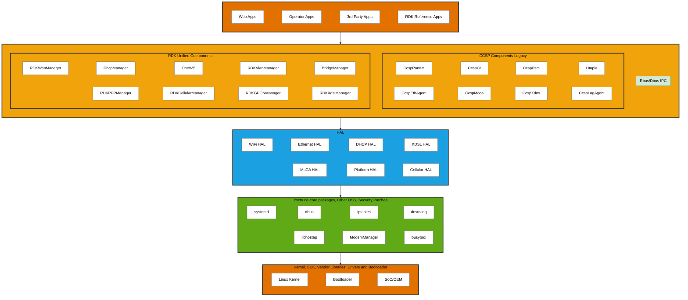

# RDK-B Architecture - Expanded Diagram

## Architecture Overview

This diagram shows the expanded RDK-B architecture with detailed components from the reference specification, organized into 5 main layers:

- **Application Layer** - Web Apps, Operator Apps, 3rd Party Apps, and RDK Reference Apps
- **Middleware Layer** - IPC, CCSP Components (Legacy), and RDK Unified Components
- **HAL Layer** - Hardware Abstraction Layer interfaces
- **OSS Core** - Yocto oe-core packages and open source components
- **Platform Layer** - Linux Kernel, Bootloader, and SoC/OEM components

### Sample 1:


### Sample 2:
```mermiad
flowchart TB
    %% Application Layer
    subgraph APP[" "]
        A1[Web Apps]
        A2[Operator Apps]
        A3[3rd Party Apps]
        A4[RDK Reference Apps]
        A1 ~~~ A2 ~~~ A3 ~~~ A4
    end
    
    %% Middleware Layer
    subgraph MIDDLEWARE[" "]
        direction TB
        
        subgraph IPC[Rbus/Dbus IPC]
        end
        
        subgraph REMOTE[Remote Management]
            R1[TR-369]
            R2[TR-069]
            R3[WebPA]
            R1 ~~~ R2 ~~~ R3
            R4[Webconfig]
            R5[SNMP]
            R6[SSH]
            R4 ~~~ R5 ~~~ R6
            R7[Local WebUI]
        end
        
        subgraph DEVICE[Device Management]
            D1[Firmware Upgrade]
            D2[Telemetry 2.0]
            D3[RFC]
            D1 ~~~ D2 ~~~ D3
            D4[Log Upload]
            D5[Crash Upload]
            D6[Log Rotation]
            D4 ~~~ D5 ~~~ D6
        end
        
        subgraph CCSP[CCSP Components Legacy]
            C1[CcspPandM]
            C2[CcspCr]
            C3[CcspPsm]
            C4[Utopia]
            C1 ~~~ C2 ~~~ C3 ~~~ C4
            C5[CcspCommonLib]
            C6[CcspEthAgent]
            C7[CcspMoca]
            C8[CcspXdns]
            C5 ~~~ C6 ~~~ C7 ~~~ C8
            C9[CcspLogAgent]
            C10[CcspLmLite]
            C11[CcspDmcli]
            C12[Test & Diag]
            C9 ~~~ C10 ~~~ C11 ~~~ C12
            C13[CcspHomeSec]
        end
        
        subgraph UNIFIED[RDK Unified Components]
            U1[RDKWanManager]
            U2[DhcpManager]
            U3[OneWifi]
            U4[RDKVlanManager]
            U1 ~~~ U2 ~~~ U3 ~~~ U4
            U5[BridgeManager]
            U6[RDKPPPManager]
            U7[RDKCellularManager]
            U8[RDKGPONManager]
            U5 ~~~ U6 ~~~ U7 ~~~ U8
            U9[RDKXdslManager]
            U10[RDKPlatformMgr]
            U11[Opensync]
            U12[Hotspot]
            U9 ~~~ U10 ~~~ U11 ~~~ U12
            U13[RDKTelcoVoiceMgr]
            U14[RDKLedManager]
            U13 ~~~ U14
        end
    end
    
    %% HAL Layer
    subgraph HAL[HAL]
        H1[WiFi HAL]
        H2[Ethernet HAL]
        H3[DHCP V4 HAL]
        H4[DHCP V6 HAL]
        H1 ~~~ H2 ~~~ H3 ~~~ H4
        H5[XDSL HAL]
        H6[MoCA HAL]
        H7[Platform HAL]
        H8[Cellular HAL]
        H5 ~~~ H6 ~~~ H7 ~~~ H8
        H9[VLAN HAL]
        H10[Voice HAL]
        H11[MTA HAL]
        H12[MSO HAL]
        H9 ~~~ H10 ~~~ H11 ~~~ H12
        H13[FW Upgrade HAL]
        H14[DPOE HAL]
        H13 ~~~ H14
    end
    
    %% OSS Core
    subgraph OSS[Yocto oe-core packages, Other OSS, Security Patches]
        O1[systemd]
        O2[dbus]
        O3[iptables]
        O4[dnsmasq]
        O1 ~~~ O2 ~~~ O3 ~~~ O4
        O5[libhostap]
        O6[ModemManager]
        O7[busybox]
        O8[Bridge Utils]
        O5 ~~~ O6 ~~~ O7 ~~~ O8
        O9[VLAN Utils]
        O10[Wireless Tools]
        O11[UPnP]
        O12[IGMP Proxy]
        O9 ~~~ O10 ~~~ O11 ~~~ O12
        O13[wget/curl]
        O14[Libqmi]
        O15[Dibbler]
        O13 ~~~ O14 ~~~ O15
    end
    
    %% Platform Layer
    subgraph PLATFORM[Kernel, SDK, Vendor Libraries, Drivers and Bootloader]
        P1[Linux Kernel & Drivers]
        P2[Bootloader]
        P1 ~~~ P2
        P3[Vendor Libraries]
        P4[SoC/OEM]
        P3 ~~~ P4
    end
    
    %% Connections
    APP --> MIDDLEWARE
    MIDDLEWARE --> HAL
    HAL --> OSS
    OSS --> PLATFORM
    
    %% Styling
    classDef appStyle fill:#E27100,stroke:#333,stroke-width:3px,color:#000
    classDef middlewareStyle fill:#F0A30A,stroke:#333,stroke-width:3px,color:#000
    classDef remoteStyle fill:#f8cecc,stroke:#b85450,stroke-width:2px,color:#000
    classDef deviceStyle fill:#dae8fc,stroke:#6c8ebf,stroke-width:2px,color:#000
    classDef halStyle fill:#1BA1E2,stroke:#333,stroke-width:3px,color:#000
    classDef ossStyle fill:#60A917,stroke:#333,stroke-width:3px,color:#000
    classDef platformStyle fill:#E27100,stroke:#333,stroke-width:3px,color:#000
    classDef ipcStyle fill:#d5e8d4,stroke:#82b366,stroke-width:2px,color:#000
    classDef compStyle fill:#fff,stroke:#666,stroke-width:1px,color:#000
    
    class APP appStyle
    class MIDDLEWARE middlewareStyle
    class REMOTE remoteStyle
    class DEVICE deviceStyle
    class HAL halStyle
    class OSS ossStyle
    class PLATFORM platformStyle
    class IPC ipcStyle
    class CCSP,UNIFIED middlewareStyle
    class A1,A2,A3,A4 compStyle
    class R1,R2,R3,R4,R5,R6,R7 compStyle
    class D1,D2,D3,D4,D5,D6 compStyle
    class C1,C2,C3,C4,C5,C6,C7,C8,C9,C10,C11,C12,C13 compStyle
    class U1,U2,U3,U4,U5,U6,U7,U8,U9,U10,U11,U12,U13,U14 compStyle
    class H1,H2,H3,H4,H5,H6,H7,H8,H9,H10,H11,H12,H13,H14 compStyle
    class O1,O2,O3,O4,O5,O6,O7,O8,O9,O10,O11,O12,O13,O14,O15 compStyle
    class P1,P2,P3,P4 compStyle
```

## Layer Details

### Application Layer (Orange)
Contains various application types that run on the RDK-B platform.

### Middleware Layer (Orange/Yellow)
- **Rbus/Dbus IPC**: Inter-process communication layer
- **CCSP Components**: Legacy Common Component Software Platform components
- **RDK Unified Components**: Modern RDK components for network management

### HAL Layer (Blue)
Hardware abstraction layer providing standardized interfaces to hardware components.

### OSS Core Layer (Green)
Open source software packages and utilities from Yocto/Linux ecosystem.

### Platform Layer (Orange)
Low-level system components including kernel, bootloader, and vendor-specific implementations.

