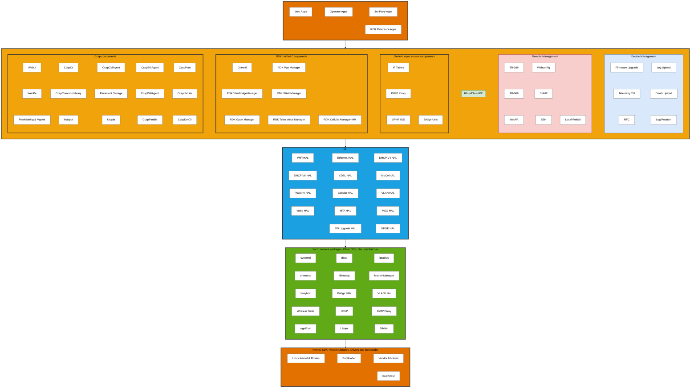

# RDK-B Architecture

## Architecture Overview

RDK-B (Reference Design Kit for Broadband) is a standardized software stack for broadband devices such as cable modems, routers, and gateways. The architecture is organized into five distinct layers, each serving a specific purpose in the device operation.

### High-Level Architecture

The RDK-B stack follows a layered architecture pattern that promotes modularity, maintainability, and vendor independence:




### Architecture Layers Explained

#### 1. **Application Layer (Orange)**
The topmost layer hosts applications that end users and operators interact with:
- **Web Apps**: Browser-based interfaces for device configuration and monitoring
- **Operator Apps**: Service provider-specific applications for network management
- **3rd Party Apps**: Applications from third-party developers extending device functionality
- **RDK Reference Apps**: Standard applications provided by RDK community

#### 2. **Middleware Layer (Yellow/Orange)**
The core of RDK-B, containing business logic and management components organized into six functional blocks:

**CCSP Components**: Legacy framework providing foundational services
**RDK Unified Components**: Modern, streamlined components for network management
**Generic Open Source Components**: Standard Linux networking tools
**Rbus/Dbus IPC**: Inter-process communication infrastructure
**Remote Management**: Protocols for remote device administration
**Device Management**: Services for firmware, logging, and telemetry

#### 3. **HAL Layer (Blue)**
Hardware Abstraction Layer provides standardized interfaces to hardware-specific implementations:
- Isolates upper layers from hardware variations
- Enables portability across different SoC vendors
- Provides consistent APIs for WiFi, Ethernet, cellular, voice, and other subsystems

#### 4. **OSS Core Layer (Green)**
Open Source Software foundation built on Yocto/Linux ecosystem:
- System services (systemd, dbus)
- Network utilities (iptables, dnsmasq, bridge-utils)
- Core libraries and tools

#### 5. **Platform Layer (Orange)**
Hardware and low-level software specific to the device:
- Linux kernel and device drivers
- Bootloader
- Vendor-specific libraries
- SoC/OEM implementations

---

## Understanding CCSP

### What is CCSP?

**CCSP (Common Component Software Platform)** is a framework originally developed to provide a standardized approach to implementing TR-181 data model on broadband devices. It served as the foundation for RDK-B architecture for many years.

### CCSP Architecture Philosophy

CCSP was designed with these core principles:

1. **Component-Based Architecture**: Each functional area (WiFi, Ethernet, provisioning) is implemented as a separate process
2. **TR-181 Compliance**: Strict adherence to Broadband Forum's TR-181 data model
3. **Message Bus Communication**: Components communicate via D-Bus message bus
4. **Data Model Abstraction**: Separation between data model and implementation

### Key CCSP Components in the Diagram

#### **CcspCr (Component Registrar)**
The central registry and discovery service for all CCSP components. It maintains:
- Component registration database
- Namespace ownership mapping
- Component health monitoring

#### **CcspPandM (Protocol and Management)**
Core component managing:
- Device provisioning
- Parameter management
- System configuration
- TR-181 Device.X hierarchy

#### **CcspPsm (Persistent Storage Manager)**
Manages persistent storage of configuration parameters:
- Database for device settings
- Transaction support
- Backup and restore capabilities

#### **CcspCommonLibrary**
Shared libraries providing:
- TR-181 data model APIs
- Message bus wrappers
- Utility functions
- Component framework

#### **Webui/WebPa**
- **Webui**: Local web interface for device configuration
- **WebPa**: Web Protocol Adapter for cloud-based management via HTTPS

#### **CcspWifiAgent**
Manages WiFi subsystem:
- Access point configuration
- Client connections
- Radio settings
- Security parameters

#### **CcspEthAgent**
Handles Ethernet interfaces:
- Link status
- Port configuration
- Statistics collection

#### **CcspCMAgent**
Cable Modem Agent (for cable devices):
- DOCSIS management
- Cable interface control
- Upstream/downstream channel management

#### **CcspLMLite (LAN Manager Lite)**
Lightweight LAN management:
- Connected device tracking
- DHCP lease monitoring
- Network topology

#### **CcspDmCli (Data Model CLI)**
Command-line interface for TR-181 data model:
- Query/set parameters
- Testing and debugging
- Scripting support

#### **Utopia**
Legacy configuration framework providing:
- System events handling
- Service orchestration
- Configuration file management

#### **Persistent Storage**
Backend storage mechanisms for configuration data

---

## RDK Unified Components

The RDK community developed a new generation of components to address limitations in the CCSP architecture. These **RDK Unified Components** offer:

- **Simplified Architecture**: Reduced complexity and dependencies
- **Better Performance**: Optimized for speed and resource usage
- **Modern Design Patterns**: Asynchronous processing, event-driven architecture
- **Rbus Support**: Native support for Rbus (RDK message bus)

### Key Unified Components

#### **Onewifi**
Unified WiFi management component replacing multiple legacy WiFi modules:
- Single binary for all WiFi operations
- Multi-AP support
- Advanced features (mesh, steering, analytics)
- Better resource efficiency

#### **RDK WAN Manager**
Intelligent WAN interface management:
- Multi-WAN support (Ethernet, DSL, PON, Cellular, PPP)
- Automatic failover between WAN interfaces
- Load balancing
- Connection quality monitoring
- Policy-based routing

#### **RDK VlanBridgeManager**
Dynamic VLAN and bridge configuration:
- Runtime VLAN creation/deletion
- Bridge interface management
- VLAN tagging/untagging
- Service-based network segmentation

#### **RDK Gpon Manager**
GPON (Gigabit Passive Optical Network) interface management:
- ONU/ONT operations
- OMCI protocol handling
- Service provisioning
- Performance monitoring

#### **RDK Ppp Manager**
PPP (Point-to-Point Protocol) connection management:
- PPPoE/PPPoA sessions
- Authentication (PAP/CHAP)
- Connection establishment and monitoring
- IPv4/IPv6 support

#### **RDK Telco Voice Manager**
Voice services management:
- VoIP/SIP configuration
- Call control
- Codec management
- FXS/FXO port handling

#### **RDK Cellular Manager-MM (ModemManager)**
Cellular WAN connectivity:
- LTE/5G modem control
- SIM management
- Network registration
- Data session management
- Signal quality monitoring

---

## Inter-Process Communication (IPC)

### The Evolution: D-Bus to Rbus

RDK-B employs two IPC mechanisms:

#### **D-Bus (Legacy)**
- Standard Linux IPC mechanism
- Used by CCSP components
- Message-based communication
- XML-based introspection
- System-wide and session buses

**Limitations**:
- Performance overhead
- Complex API
- Limited to local system
- Synchronous blocking calls cause delays

#### **Rbus (Modern)**
RDK's proprietary message bus designed specifically for RDK components:

**Key Features**:
- **High Performance**: Optimized for embedded devices
- **Event-Driven**: Asynchronous notification support
- **Simplified API**: Easier to use than D-Bus
- **Direct Method Calls**: RPC-style invocations
- **Wildcard Subscriptions**: Subscribe to parameter patterns
- **Property-Based**: Aligned with TR-181 parameter model

**Rbus Architecture**:
```
Component A          Rbus Broker          Component B
    |                     |                     |
    |--- register() ----->|                     |
    |                     |<--- subscribe() ----|
    |                     |                     |
    |--- set(param) ----->|--- notify() ------->|
    |                     |                     |
    |<--- get(param) -----|<--- request() ------|
```

### Generic Open Source Components

These standard Linux tools complement RDK components:

#### **IP Tables**
Linux firewall and packet filtering:
- NAT (Network Address Translation)
- Port forwarding
- Traffic filtering
- Security policies

#### **IGMP Proxy**
Multicast traffic management:
- IPTV stream routing
- Multicast group membership
- Upstream/downstream interface bridging

#### **UPNP IGD (Internet Gateway Device)**
UPnP protocol implementation:
- Automatic port mapping
- Device discovery
- NAT traversal for applications

#### **Bridge Utils**
Linux bridging utilities:
- Layer 2 bridging
- STP (Spanning Tree Protocol)
- Port management

---

## TR-181 Data Model Integration

### Understanding TR-181

TR-181 is the Broadband Forum's **Device Data Model** specification. It defines a hierarchical structure for representing all manageable aspects of a broadband device.

### TR-181 Hierarchy Example
```
Device.
├── DeviceInfo.
│   ├── Manufacturer
│   ├── ModelName
│   └── SoftwareVersion
├── Ethernet.
│   └── Interface.{i}.
│       ├── Enable
│       ├── Status
│       └── MACAddress
├── WiFi.
│   ├── Radio.{i}.
│   │   ├── Enable
│   │   ├── Channel
│   │   └── OperatingFrequencyBand
│   └── SSID.{i}.
│       ├── Enable
│       ├── SSID
│       └── SecurityMode
└── IP.
    └── Interface.{i}.
        ├── IPAddress
        ├── SubnetMask
        └── DefaultGateway
```

### How Components Implement TR-181

Each component "owns" a portion of the TR-181 namespace:

| Component | TR-181 Namespace |
|-----------|------------------|
| CcspPandM | Device.DeviceInfo, Device.Time, Device.UserInterface |
| CcspWifiAgent | Device.WiFi.* |
| CcspEthAgent | Device.Ethernet.* |
| RDK WAN Manager | Device.X_RDK_WanManager.* |
| Onewifi | Device.WiFi.* |

### Parameter Access Flow

**Example: Setting WiFi Channel**

1. **Request Initiation**
   - TR-069/WebPA/Local UI requests: `Device.WiFi.Radio.1.Channel = 6`

2. **Message Routing**
   - Request goes through IPC (Rbus/D-Bus)
   - CcspCr resolves namespace owner: CcspWifiAgent or Onewifi

3. **Component Processing**
   - WiFi component validates parameter
   - Calls HAL: `wifi_hal_setRadioChannel(1, 6)`

4. **HAL Execution**
   - HAL translates to vendor-specific API
   - Vendor library configures hardware

5. **Response**
   - Success/failure propagates back through layers
   - Event notification sent to subscribers

### Remote Management Integration

#### **TR-069 (CWMP)**
Traditional auto-configuration protocol:
- ACS (Auto-Configuration Server) connection
- RPC methods (GetParameterValues, SetParameterValues)
- Firmware management
- Diagnostics

#### **TR-369 (USP)**
Modern protocol using MQTT/WebSockets:
- Service-oriented architecture
- Event subscription model
- Bulk data collection
- Multi-controller support

#### **WebPA**
Lightweight cloud protocol:
- RESTful API over HTTPS
- JWT authentication
- Real-time notifications via WebSockets
- JSON payload

**Flow Example**:
```
Cloud ACS → WebPA Agent → Rbus/D-Bus → Component → HAL → Hardware
```

---

## Practical Use Cases

### Use Case 1: WiFi Configuration Change

**Scenario**: Service provider wants to remotely change WiFi channel from cloud to avoid interference.

**Step-by-Step Flow**:

1. **Cloud Initiation**
   ```
   ACS/Cloud sends TR-181 command:
   SET Device.WiFi.Radio.1.Channel = 11
   ```

2. **WebPA Processing**
   - WebPA agent receives HTTPS request
   - Authenticates request
   - Parses TR-181 parameter path

3. **IPC Communication**
   - WebPA uses Rbus to communicate with Onewifi
   ```c
   rbusValue_t value;
   rbusValue_SetInt32(value, 11);
   rbus_set("Device.WiFi.Radio.1.Channel", value);
   ```

4. **Onewifi Processing**
   - Validates channel (valid range, regulatory compliance)
   - Checks if radio is enabled
   - Prepares HAL call

5. **HAL Invocation**
   ```c
   wifi_setRadioChannel(1, 11);
   ```

6. **Vendor Implementation**
   - HAL translates to chipset-specific command
   - Broadcom: `wl -i wl0 channel 11`
   - Qualcomm: `iwpriv ath0 channel 11`

7. **Notification**
   - Onewifi publishes event on Rbus
   - Telemetry component records change
   - WebPA sends confirmation to cloud

8. **Persistence**
   - New channel value saved to PSM
   - Survives reboot

**Components Involved**:
- WebPA (Remote Management)
- Onewifi (RDK Unified Component)
- WiFi HAL
- PSM (Persistent Storage)
- Telemetry 2.0

---

### Use Case 2: WAN Interface Failover

**Scenario**: Primary cable WAN fails, device automatically switches to LTE backup.

**Step-by-Step Flow**:

1. **Failure Detection**
   - CcspCMAgent detects DOCSIS link down
   - Publishes event: `Device.X_CISCO_COM_CableModem.DOCSISStatus = "Down"`

2. **WAN Manager Response**
   - RDK WAN Manager subscribes to WAN interface events
   - Receives notification via Rbus
   ```c
   rbus_subscribe("Device.X_CISCO_COM_CableModem.DOCSISStatus", 
                  callback_function);
   ```

3. **Policy Evaluation**
   - WAN Manager checks configured policies:
     - Primary: Cable (DOCSIS)
     - Backup: Cellular (LTE)
   - Initiates failover sequence

4. **Cellular Activation**
   - WAN Manager communicates with RDK Cellular Manager
   - Cellular Manager activates LTE modem via HAL
   ```c
   cellular_hal_init_modem();
   cellular_hal_connect_network();
   ```

5. **IP Configuration**
   - DHCP client obtains IP from cellular network
   - Default route updated:
   ```bash
   ip route del default
   ip route add default via <cellular-gateway> dev wwan0
   ```

6. **Firewall Update**
   - IP Tables rules updated for new WAN interface
   - NAT configured on cellular interface

7. **Service Continuity**
   - Active connections migrate to new interface
   - DNS updated
   - TR-181 parameters updated:
   ```
   Device.IP.Interface.1.Status = "Up"
   Device.IP.Interface.1.Type = "Cellular"
   ```

8. **Monitoring & Telemetry**
   - Telemetry 2.0 logs failover event
   - Log uploaded to cloud
   - Alert sent to operator

9. **Primary Link Recovery**
   - When cable link restored, WAN Manager detects
   - Waits for stability period
   - Fails back to primary cable interface
   - Cellular interface remains standby

**Components Involved**:
- CcspCMAgent (CCSP Component)
- RDK WAN Manager (Unified Component)
- RDK Cellular Manager-MM (Unified Component)
- Cellular HAL
- DHCP Manager
- IP Tables (Generic OSS)
- Telemetry 2.0
- Rbus (IPC)

---

## Component Interaction Patterns

### Pattern 1: Hierarchical Delegation
```
Application Layer (WebUI)
        ↓
Middleware (CcspPandM) - Validates & Routes
        ↓
Middleware (CcspWifiAgent) - Business Logic
        ↓
HAL (WiFi HAL) - Abstraction
        ↓
Platform (Vendor Driver) - Hardware Control
```

### Pattern 2: Event-Driven Processing
```
Hardware Event → Driver → HAL → Component → Rbus Event → Subscribers
                                                  ↓
                                          [Telemetry, WAN Manager, etc.]
```

### Pattern 3: Coordinated Services
```
User Request → Web UI → CcspPandM
                            ↓
                     [Orchestration]
                     ↓      ↓      ↓
              WiFi Agent  Firewall  DHCP
                     ↓      ↓      ↓
                  [Synchronized Execution]
```

---

## Best Practices & Recommendations

### For Component Development

1. **Use Rbus for New Components**: Better performance and cleaner API
2. **Follow TR-181 Standards**: Ensures interoperability
3. **Implement Proper Error Handling**: Return meaningful status codes
4. **Support Event Subscriptions**: Enable reactive programming
5. **Validate Input Parameters**: Security and stability
6. **Use HAL Abstraction**: Never call vendor APIs directly from middleware

### For Integration

1. **Test Multi-Vendor HALs**: Ensure portability
2. **Monitor IPC Performance**: Use Rbus profiling tools
3. **Implement Comprehensive Logging**: Essential for debugging
4. **Design for Failure**: Components should handle peer failures gracefully
5. **Security First**: Validate all external inputs, encrypt sensitive data

---

## Conclusion

RDK-B architecture represents a mature, modular approach to broadband device software. The transition from CCSP to RDK Unified Components shows the platform's evolution toward better performance and maintainability while preserving compatibility with industry standards like TR-181.

Understanding the interaction between layers—from applications through middleware and HAL down to hardware—is crucial for developers working on RDK-B devices. The use of standardized IPC mechanisms (Rbus/D-Bus) and adherence to TR-181 data model ensures interoperability across different vendors and deployments.

---

## Layer Details

### Application Layer (Orange)
Contains various application types that run on the RDK-B platform.

### Middleware Layer (Orange/Yellow)
- **Rbus/Dbus IPC**: Inter-process communication layer
- **CCSP Components**: Common Component Software Platform components
- **RDK Unified Components**: Modern RDK components for network management

### HAL Layer (Blue)
Hardware abstraction layer providing standardized interfaces to hardware components.

### OSS Core Layer (Green)
Open source software packages and utilities from Yocto/Linux ecosystem.

### Platform Layer (Orange)
Low-level system components including kernel, bootloader, and vendor-specific implementations.


