# RDK Logger Documentation

RDK Logger is a comprehensive logging framework that serves as the cornerstone logging mechanism for all RDK-B middleware components. It provides centralized, configurable, and runtime-controllable logging capabilities across the entire RDK-B ecosystem. The component abstracts the complexity of underlying logging utilities while offering fine-grained control over log levels, formatting, and output destinations for different modules and components.

RDK Logger serves three critical functions in the RDK-B middleware: First, it provides a unified logging interface that standardizes how all RDK-B components generate and manage log messages, ensuring consistency across the entire platform. Second, it enables dynamic runtime control of logging behavior, allowing operators to adjust logging levels and verbosity without requiring system restarts or service interruptions. Third, it optimizes system performance by providing efficient filtering mechanisms that minimize logging overhead when verbose logging is disabled.

At the module level, RDK Logger implements a sophisticated configuration-driven architecture that allows each component to maintain its own logging context while participating in a centralized logging ecosystem. The framework handles log message formatting, filtering, routing, and output management, while providing thread-safe operations and minimal performance impact on the host applications.

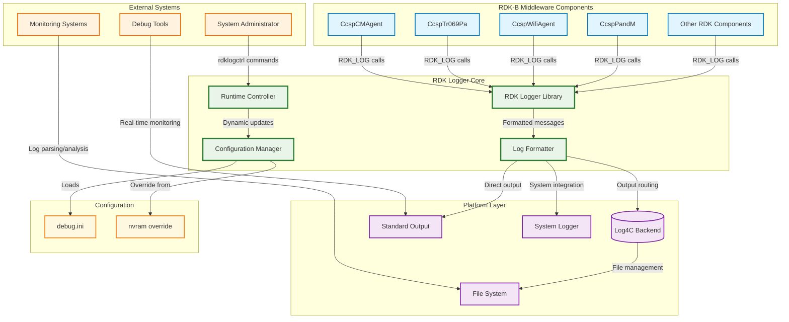

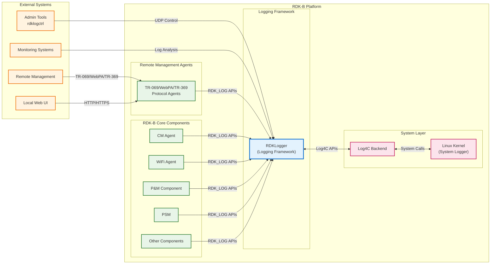

**Key Features & Responsibilities**: 

- **Centralized Logging Framework**: Provides a unified logging API and configuration system for all RDK-B middleware components, ensuring consistent logging behavior across the entire platform
- **Dynamic Runtime Control**: Enables real-time adjustment of log levels and verbosity for individual modules through the `rdklogctrl` utility without requiring service restarts
- **Module-Specific Configuration**: Supports independent log level configuration for each component through the `debug.ini` file, allowing fine-grained control over logging behavior
- **Performance Optimization**: Implements efficient filtering mechanisms that minimize CPU and memory overhead when verbose logging is disabled, crucial for resource-constrained embedded systems
- **Multi-Level Logging Support**: Provides comprehensive log level hierarchy (TRACE, DEBUG, INFO, NOTICE, WARN, ERROR, FATAL) with configurable verbosity control
- **Thread-Safe Operations**: Ensures safe concurrent access to logging functions across multi-threaded RDK-B components without requiring external synchronization
- **Configuration Management**: Handles automatic detection of configuration file overrides (`/nvram/debug.ini` vs `/etc/debug.ini`) and runtime configuration updates
- **Log Format Standardization**: Enforces consistent timestamp, module identification, and message formatting across all RDK-B components for improved log analysis and monitoring

## Design

RDK Logger is architected as a lightweight, efficient logging abstraction layer that sits between RDK-B applications and the underlying Log4C logging infrastructure. The design follows a modular approach where the core logging functionality is separated from configuration management, runtime control, and output formatting. This separation enables independent evolution of each subsystem while maintaining backward compatibility and minimizing performance impact on client applications.

The architecture emphasizes configuration-driven behavior where all logging policies are externalized to the `debug.ini` configuration file. This design choice enables system administrators and developers to adjust logging behavior without code changes or application restarts. The framework implements a two-tier configuration system: default system-wide settings in `/etc/debug.ini` and optional overrides in `/nvram/debug.ini`, providing flexibility for both development and production environments.

Northbound interactions with RDK-B middleware components are handled through a simple, high-performance C API that provides printf-style logging functions. The API design minimizes function call overhead and includes compile-time optimizations for disabled log levels. Southbound interactions with the Log4C library and system logging facilities are abstracted through a pluggable backend architecture that allows for future extensibility to alternative logging systems.

The IPC mechanism design leverages UDP sockets for runtime log level control, enabling the `rdklogctrl` utility to communicate with running processes without requiring complex IPC infrastructure. This lightweight approach ensures that runtime control operations have minimal impact on system performance and can function reliably even under high system load conditions.

Data persistence and storage management are handled through a combination of in-memory configuration caching and file-based persistence. The framework loads configuration at startup, caches it in memory for performance, and provides mechanisms for runtime updates. Log output persistence is delegated to the underlying Log4C system, which handles file rotation, compression, and storage management according to its own configuration.

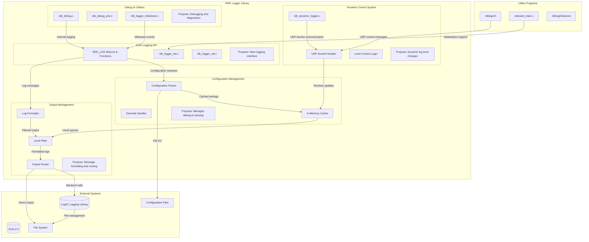

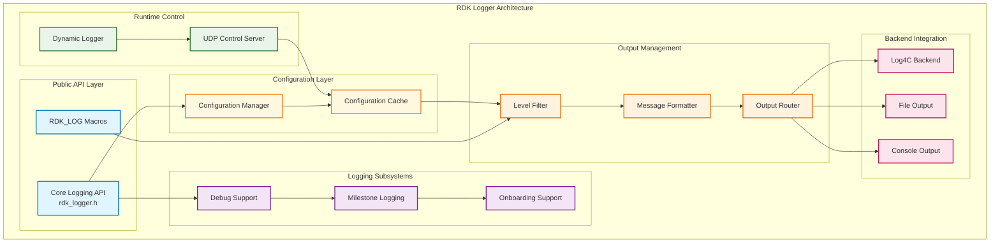

### Prerequisites and Dependencies

**Build-Time Flags and Configuration:**

| Configure Option | DISTRO Feature | Build Flag | Purpose | Default |
|------------------|----------------|------------|---------|---------|
| `--enable-milestone` | N/A | `LOGMILESTONE` | Enable milestone logging for system events and boot tracking | Enabled |
| `--enable-onboardlog` | N/A | `IS_ONBOARDLOG_ENABLED` | Enable onboard logging utilities and support | Disabled |
| `--enable-systemd-syslog-helper` | N/A | `SYSTEMD_SYSLOG_HELPER` | Enable systemd syslog helper integration | Disabled |
| `--enable-journal` | N/A | `SYSTEMD_JOURNAL` | Enable systemd journal logging support | Disabled |
| N/A | `safec` | `SAFEC_DUMMY_API` | Safe C library integration for secure string operations | Auto-detected |

**RDK-B Platform and Integration Requirements**

- **RDK-B Components**: 
  - No mandatory RDK-B middleware dependencies (RDK Logger is a foundational component)
  - Integration with `systemd` for service management in systemd-enabled builds
  - Coordination with `rdk-logger` recipe in Yocto build system
- **HAL Dependencies**: No direct HAL interface dependencies (operates at middleware layer)
- **Systemd Services**: No specific systemd service dependencies, but integrates with systemd journal when available
- **Message Bus**: No RBus registration required (RDK Logger operates below the message bus layer)
- **Configuration Files**: 
  - `/etc/debug.ini` (primary configuration file, must exist)
  - `/nvram/debug.ini` (optional override configuration)
  - Proper file system permissions for configuration file access
- **Startup Order**: Must initialize before any RDK-B component that uses logging (typically first in startup sequence)

 

**Threading Model:**

RDK Logger implements a library-based architecture with minimal threading, designed for high-performance integration into multi-threaded RDK-B applications. Unlike service-based components, RDK Logger operates as a shared library that provides thread-safe logging APIs to client applications.

| Thread & Function | Purpose | Cycle/Timeout | Synchronization |
|-------------------|---------|----------------|------------------|
| **Client Application Thread** `RDK_LOG()` calls | Primary logging interface for client applications | Event-driven API calls, immediate log processing, thread-safe Log4C integration | Thread-safe Log4C backend, atomic log level checks |
| **UDP Control Listener** `rdk_dyn_log_process_pending_request()` | Runtime log level control via rdklogctrl utility | Non-blocking UDP socket polling, immediate configuration updates | Socket-based IPC, configuration cache updates |
| **Configuration Manager** `rdk_logger_init()` / `rdk_logger_deinit()` | Library initialization and cleanup operations | One-time initialization per process, configuration file parsing | File system synchronization, memory management |

### Component State Flow

**Initialization to Active State**

RDK Logger follows a well-defined initialization sequence that ensures proper configuration loading, backend initialization, and runtime control setup before becoming available for client applications.

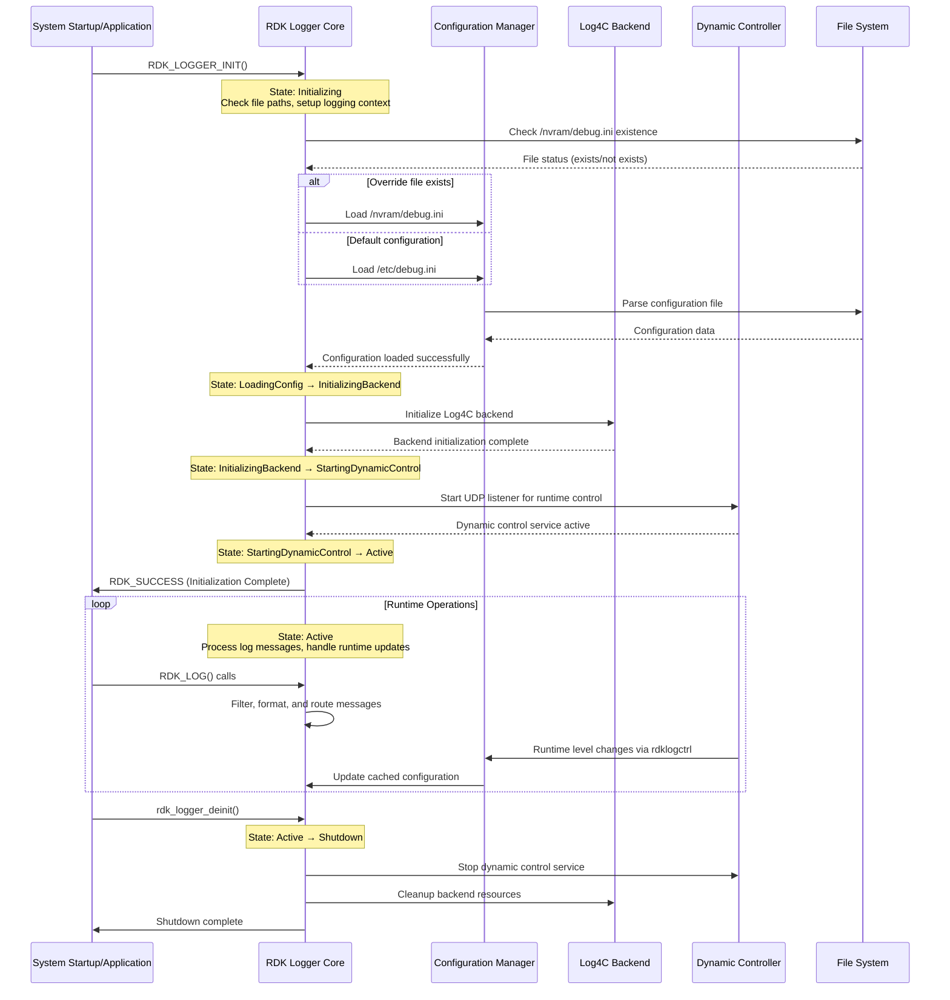

**Runtime State Changes and Context Switching**

RDK Logger maintains several operational contexts that can change during runtime based on external events and configuration updates.

**State Change Triggers:**

- **Configuration File Updates**: Detection of changes to debug.ini files triggers configuration reload and cache updates
- **Dynamic Log Level Changes**: Runtime commands via `rdklogctrl` trigger immediate log level updates for specific modules
- **Backend Failures**: Log4C backend errors trigger fallback to direct stdout/stderr output to maintain logging availability
- **Memory Pressure**: High memory usage can trigger log message queuing and batch processing optimizations

**Context Switching Scenarios:**

- **Configuration Override Detection**: Switch between `/etc/debug.ini` and `/nvram/debug.ini` based on file availability and modification times
- **Output Destination Switching**: Automatic fallback from file output to console output when log files become unavailable
- **Debug Mode Activation**: Enhanced logging and diagnostic output when debug flags are enabled through configuration or runtime commands

### Call Flow

**Initialization Call Flow:**

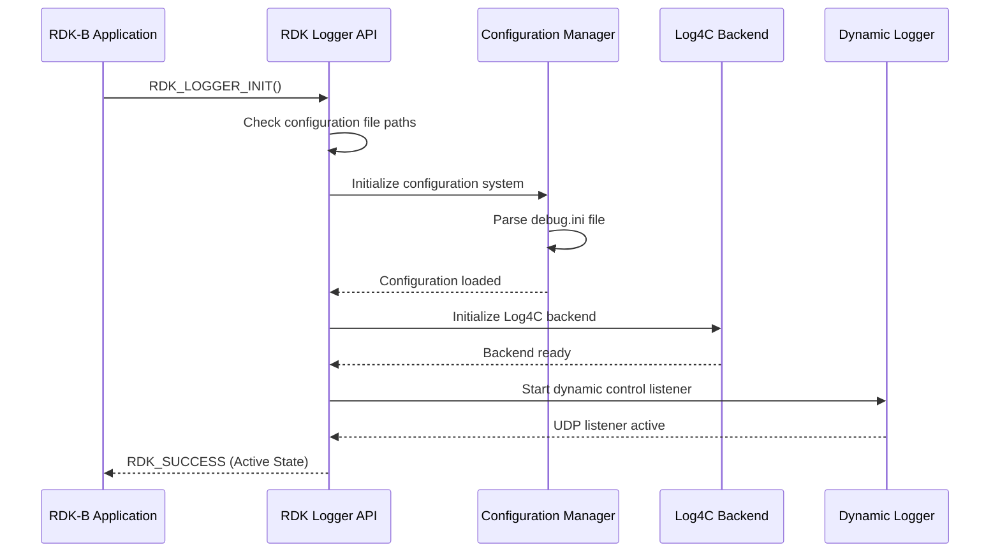

**Request Processing Call Flow:**

The most critical flow is the standard log message processing, which must be highly optimized for performance:

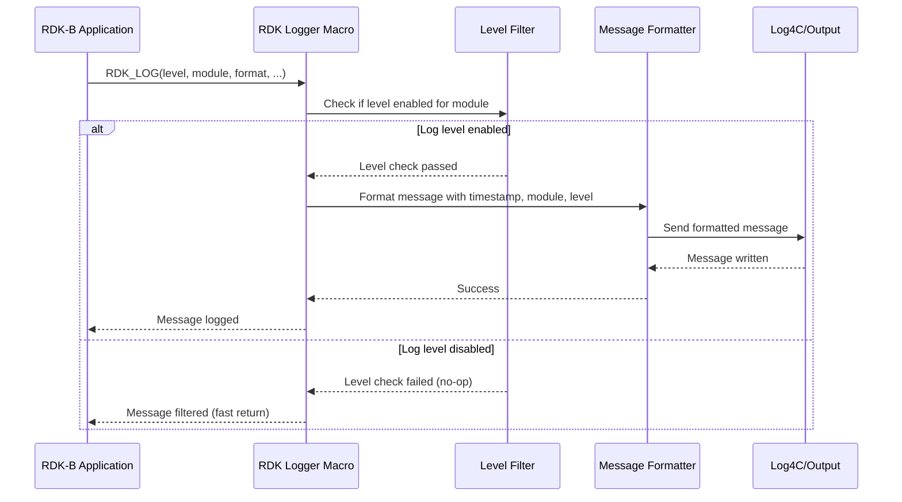

**Dynamic Control Call Flow:**

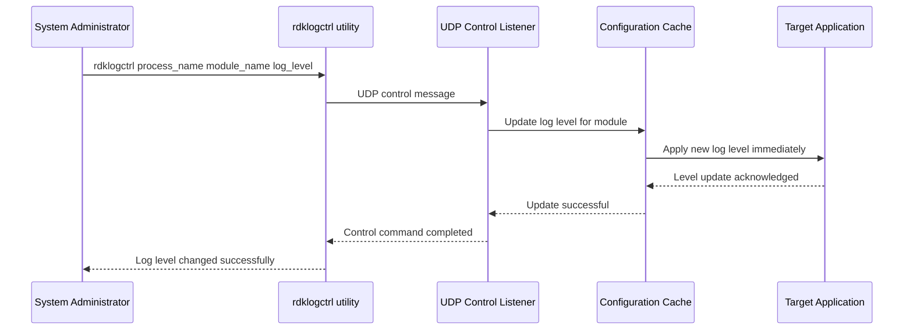

## Internal Modules

RDK Logger is composed of several specialized modules, each responsible for specific aspects of the logging functionality. The modular design enables maintainability and allows for independent testing and optimization of each component.

| Module/Class | Description | Key Files |
|-------------|------------|-----------|
| **Core Logging API** | Main application interface providing RDK_LOG macros and initialization functions | `include/rdk_logger.h`, `src/rdk_logger_init.c`, `src/rdk_logger_util.c` |
| **Configuration Manager** | Handles parsing, caching, and management of debug.ini configuration files | `src/rdk_logger_init.c`, configuration parsing logic embedded |
| **Dynamic Logger** | Runtime control system for changing log levels via UDP socket communication | `src/rdk_dynamic_logger.c`, `include/rdk_dynamic_logger.h` |
| **Debug Support** | Enhanced debugging capabilities, internal diagnostics, and development tools | `src/rdk_debug.c`, `src/rdk_debug_priv.c`, `include/rdk_debug.h` |
| **Milestone Logging** | Special-purpose logging for system milestones and significant events | `src/rdk_logger_milestone.c`, `include/rdk_logger_milestone.h`, `scripts/logMilestone.sh` |
| **Onboarding Support** | Utilities for component integration and initialization assistance | `src/rdk_logger_onboard.c`, `utils/rdk_logger_onboard_main.c` |
| **Runtime Control Utilities** | Command-line tools for log level management and system interaction | `utils/rdklogctrl.c`, `utils/rdklogmilestone.c` |

## Component Interactions

RDK Logger serves as a foundational component that interfaces with multiple layers of the RDK-B architecture, from application-level middleware components down to system-level services and external administrative tools.

### Interaction Matrix

| Target Component/Layer | Interaction Purpose | Key APIs/Endpoints |
|------------------------|-------------------|------------------|
| **RDK-B Middleware Components** |
| CcspCMAgent | Cable modem status and configuration logging | `RDK_LOG()`, module: `LOG.RDK.CM` |
| CcspTr069Pa | TR-069 protocol events and diagnostic logging | `RDK_LOG()`, module: `LOG.RDK.TR069` |
| CcspWifiAgent | WiFi operations, connection events, security logging | `RDK_LOG()`, module: `LOG.RDK.WIFI` |
| CcspPandM | Platform and management events, system status | `RDK_LOG()`, module: `LOG.RDK.PAM` |
| CcspPsm | Parameter storage and retrieval operations | `RDK_LOG()`, module: `LOG.RDK.PSM` |
| WAN Manager | WAN interface management and failover events | `RDK_LOG()`, module: `LOG.RDK.WANMGR` |
| **System & Platform Layers** |
| Log4C Library | Backend log message formatting and file management | `log4c_init()`, `log4c_category_log()`, configuration via log4crc |
| System Logger (syslog) | System-wide log integration and kernel message coordination | Direct syslog API calls, facility LOG_USER |
| File System | Configuration file access and log file storage | `/etc/debug.ini`, `/nvram/debug.ini`, `/var/log/*` |
| systemd Journal | Modern Linux logging integration | Journal API integration when available |
| Network Services | UDP socket communication for runtime control | UDP port 12035, localhost interface |

**Events Published by RDK Logger:**

| Event Name | Event Topic/Path | Trigger Condition | Subscriber Components |
|------------|-----------------|-------------------|---------------------|
| Log Level Change | UDP control message | Dynamic log level modification via rdklogctrl | All RDK-B components using affected module |
| Configuration Reload | Internal event | debug.ini file modification detection | Internal configuration cache, all active loggers |
| Backend Failure | Internal diagnostic | Log4C backend initialization or runtime failure | Internal fallback mechanisms, system administrators |
| Milestone Event | Log message | System milestone reached (boot, configuration, etc.) | Log monitoring systems, diagnostic tools |

### IPC Flow Patterns

**Primary IPC Flow - Standard Logging:**

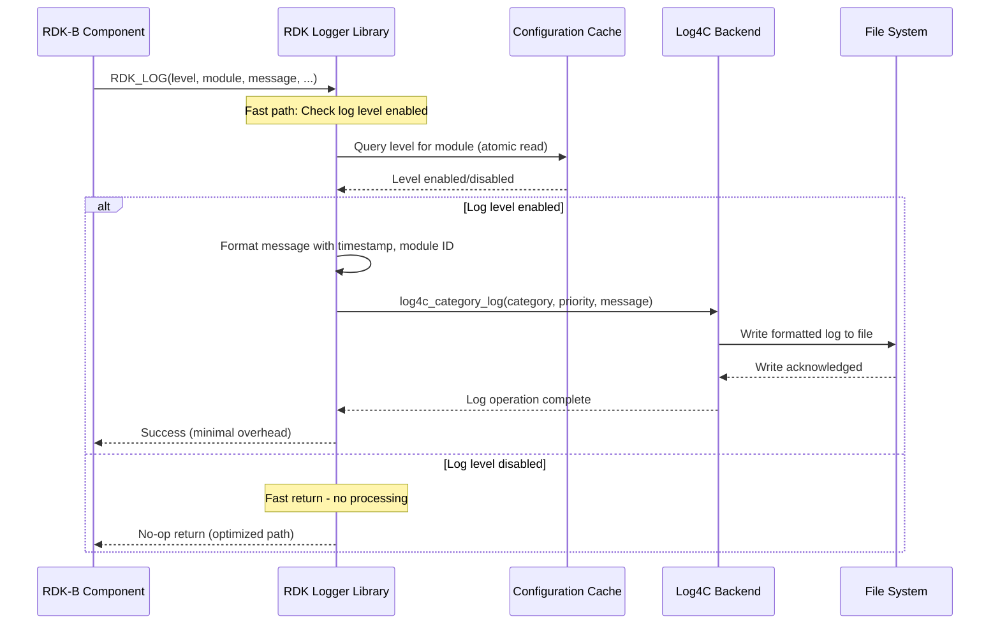

**Dynamic Control Flow - Runtime Log Level Changes:**

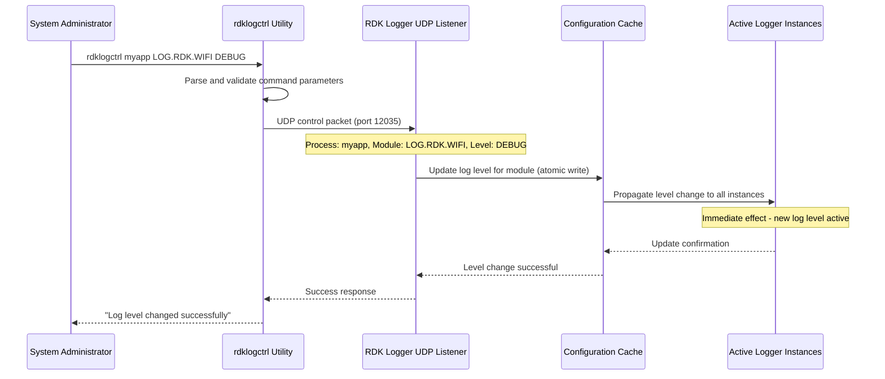

**Configuration Loading Flow:**

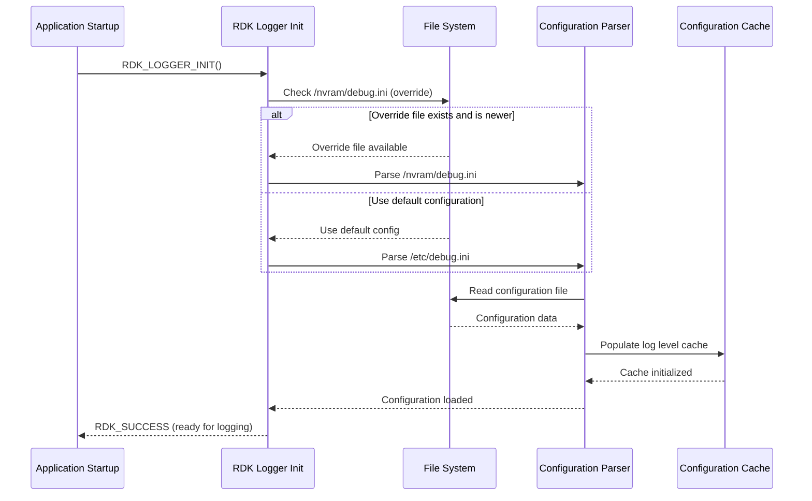

## Implementation Details

### Major HAL APIs Integration

RDK Logger operates at the middleware layer and does not directly interface with Hardware Abstraction Layer (HAL) APIs. Instead, it provides logging services to RDK-B components that do interact with HAL layers. However, RDK Logger does integrate with system-level APIs for file access, network communication, and process management.

**Core System APIs:**

| System API | Purpose | Implementation File |
|---------|---------|-------------------|
| `socket()`, `bind()`, `recvfrom()` | UDP socket communication for runtime control via rdklogctrl | `src/rdk_dynamic_logger.c` |
| `fopen()`, `fread()`, `stat()` | Configuration file reading and monitoring | `src/rdk_logger_init.c` |
| `log4c_init()`, `log4c_category_log()` | Log4C backend initialization and message output | `src/rdk_logger_init.c`, `src/rdk_logger_util.c` |
| `gettimeofday()`, `localtime_r()` | Timestamp generation for log message formatting | `src/rdk_logger_util.c` |
| `pthread_mutex_*()` | Thread synchronization for configuration updates | `src/rdk_dynamic_logger.c` |

### Key Implementation Logic

- **Configuration Management Engine**: Core configuration system implemented in `src/rdk_logger_init.c` handles parsing of debug.ini files, detection of configuration overrides, and maintenance of in-memory configuration cache. The system supports both default configuration (`/etc/debug.ini`) and runtime overrides (`/nvram/debug.ini`) with automatic fallback mechanisms.
     - Main configuration parsing logic in `rdk_logger_init()` function 
     - Configuration override detection and file priority handling
     - In-memory cache management with atomic updates for thread safety

- **Dynamic Runtime Control**: Real-time log level modification system implemented in `src/rdk_dynamic_logger.c` provides UDP-based communication mechanism for the `rdklogctrl` utility. The system enables immediate log level changes without application restart.
     - UDP server implementation for control message reception
     - Message parsing and validation for security and stability 
     - Atomic configuration updates with immediate effect propagation

- **Performance Optimization Strategy**: High-performance logging implementation optimizes the critical path for log message processing to minimize impact on client applications.
     - Fast-path log level checking using atomic memory operations
     - Compile-time optimization for disabled log levels through macro expansion
     - Minimal function call overhead with inline level checks
     - Efficient message formatting with pre-allocated buffers

- **Error Handling and Resilience**: Comprehensive error handling ensures logging system availability even under adverse conditions.
     - Configuration file parsing error recovery with fallback to default settings
     - Log4C backend failure handling with automatic fallback to stdout/stderr
     - Network communication error handling for runtime control operations
     - Memory allocation failure handling with graceful degradation

- **Logging & Debugging**: Multi-level internal diagnostics and debugging support for troubleshooting logging system issues.
     - Internal debug logging with separate debug levels for RDK Logger itself
     - Configuration validation and reporting mechanisms
     - Runtime state monitoring and diagnostic output
     - Performance metrics collection for optimization analysis

### Key Configuration Files

| Configuration File | Purpose | Override Mechanisms |
|--------------------|---------|--------------------|
| `/etc/debug.ini` | Primary system-wide logging configuration with default log levels for all RDK-B components | Environment variable `RDK_LOGGER_CONFIG_PATH`, `/nvram/debug.ini` override |
| `/nvram/debug.ini` | Runtime configuration override file for temporary or persistent log level changes | Takes precedence when present and readable, automatic detection |
| `log4crc` | Log4C backend configuration for output formatting, file rotation, and destination control | Log4C environment variables, application-specific log4crc files |
| `/var/log/messages` | Default log output destination for system-wide RDK-B component logs | Log4C configuration, syslog configuration, systemd journal settings |
