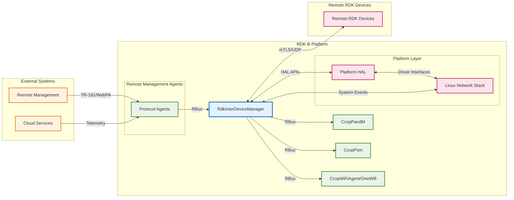
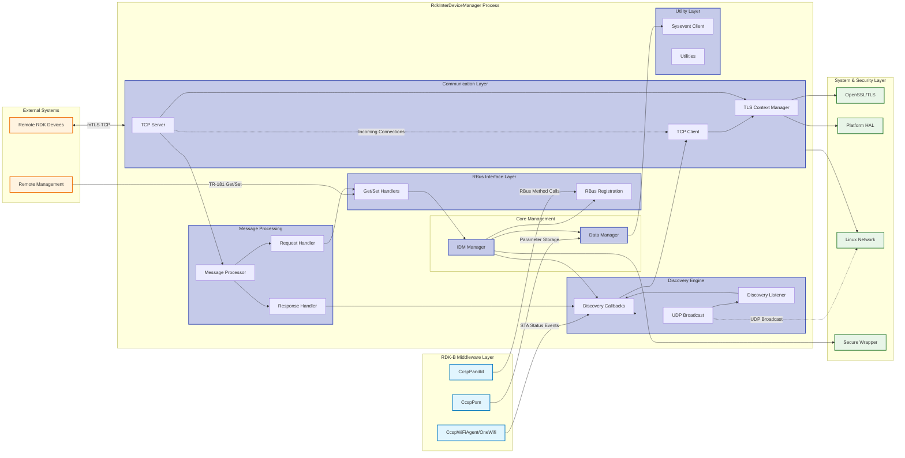
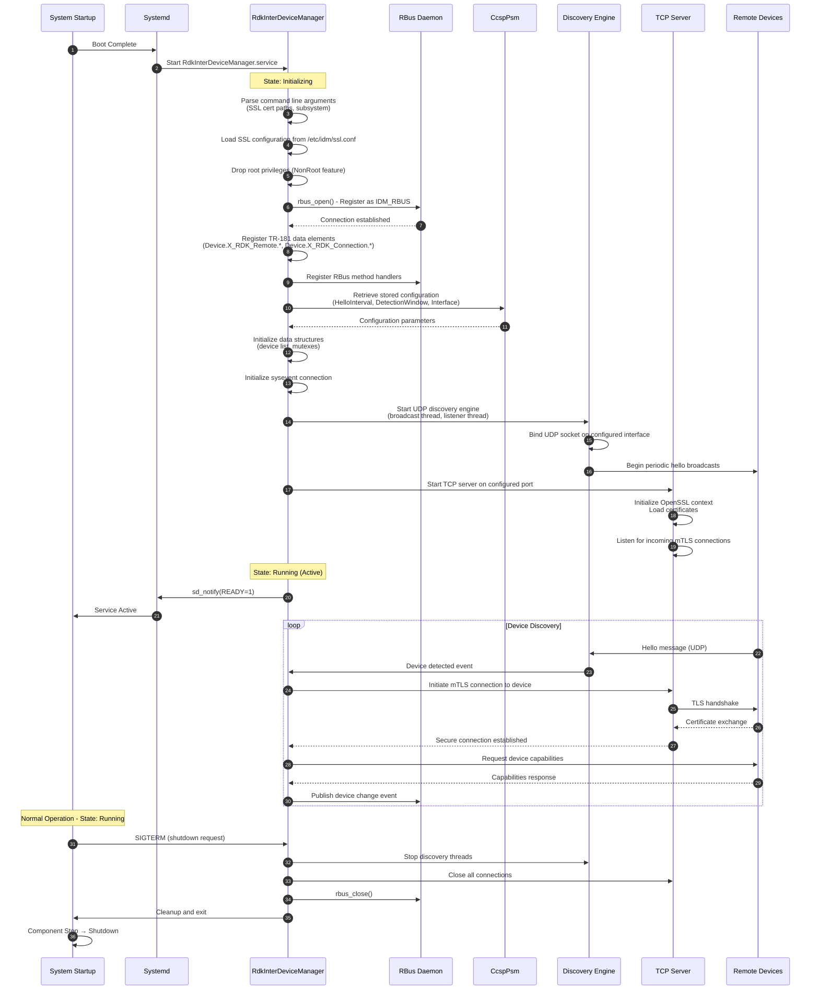
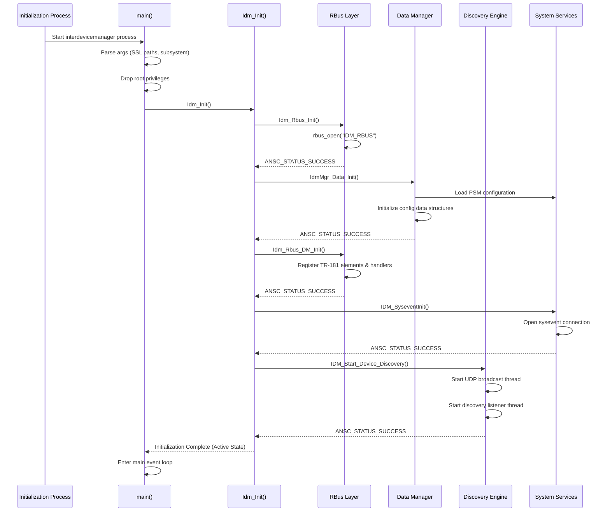
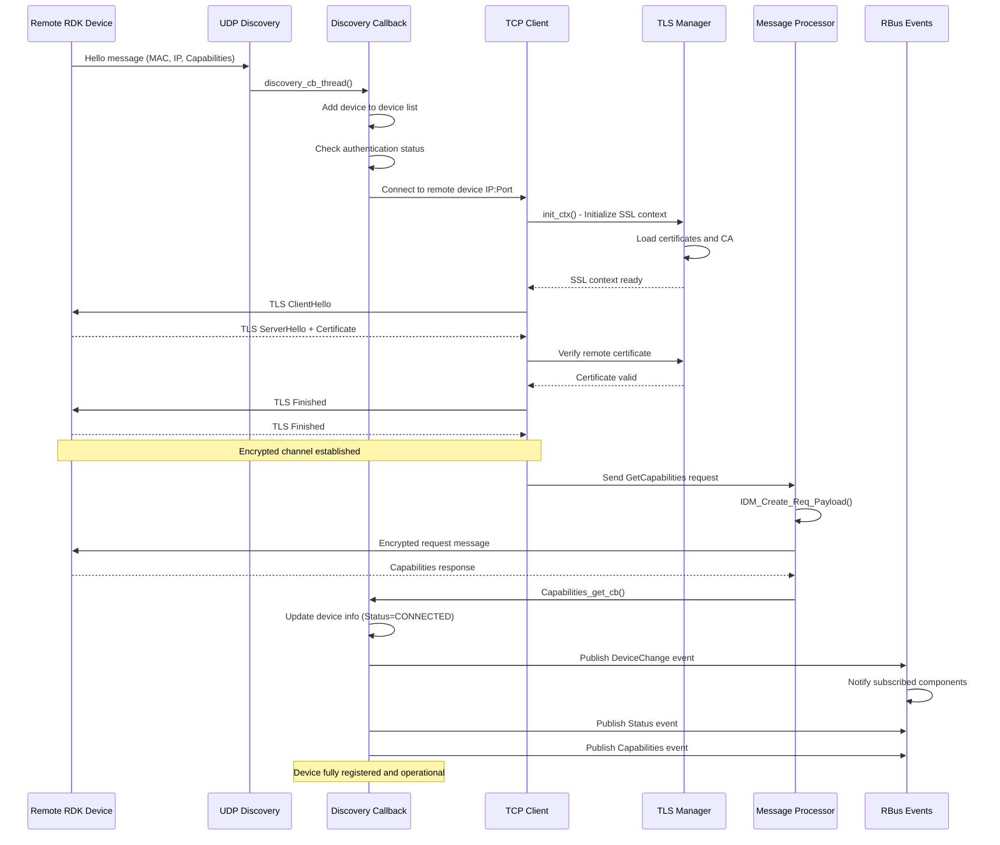
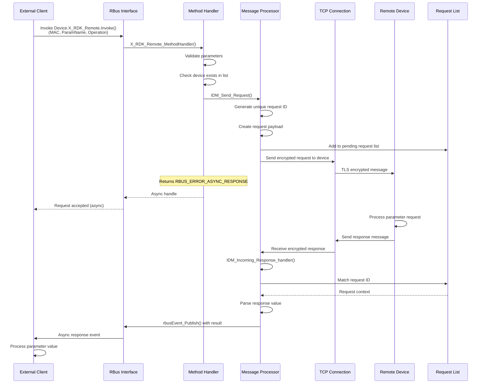
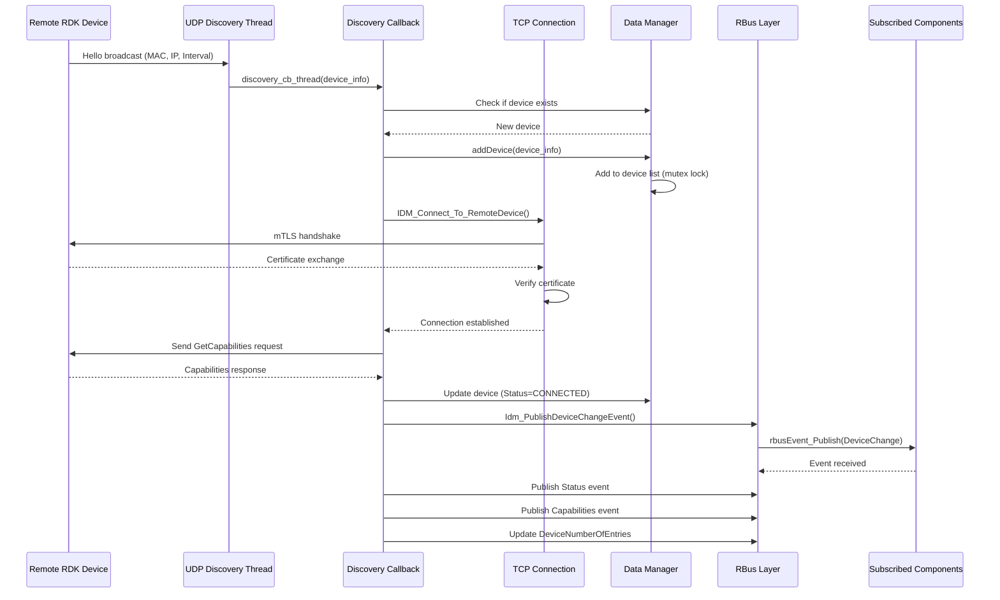
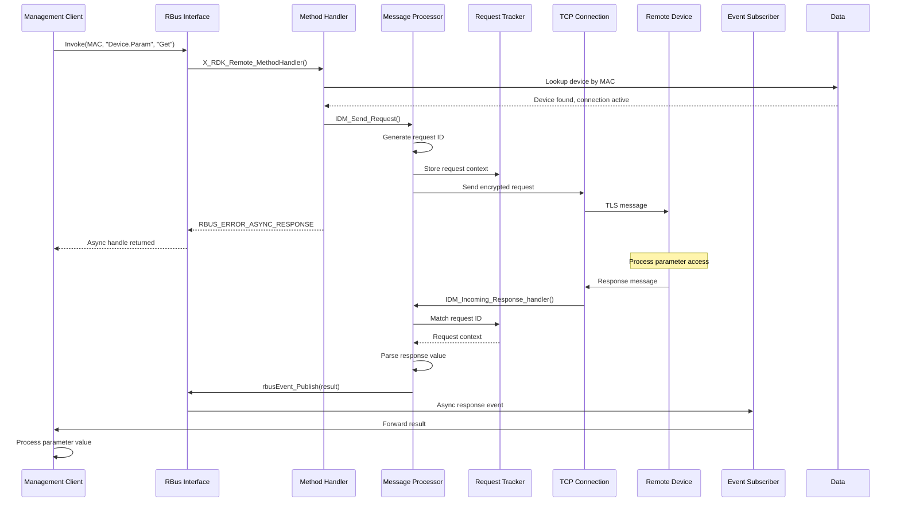
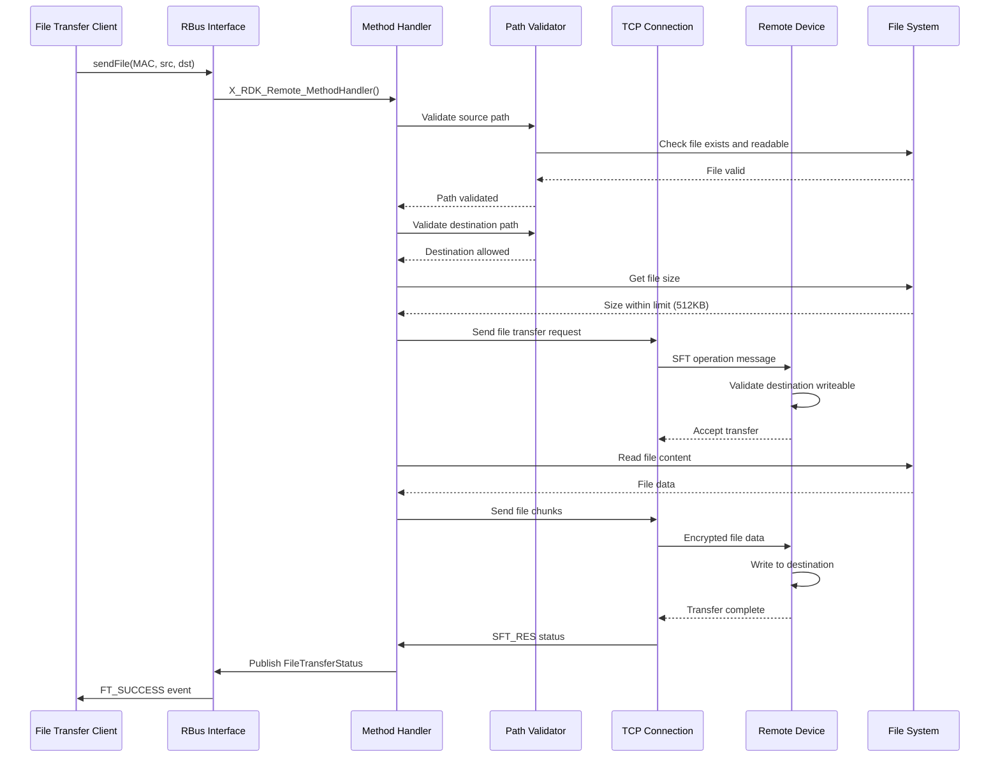

# RdkInterDeviceManager Documentation

RdkInterDeviceManager is the RDK-B component that provides mechanisms to discover, advertise device capabilities, and manage RDK LAN devices within a home network. This component serves as the primary interface for inter-device communication between RDK routers and LAN devices, enabling secure device discovery, authentication, and data exchange capabilities. RdkInterDeviceManager implements robust security protocols using mTLS (mutual Transport Layer Security) to establish encrypted communication channels between devices, ensuring secure data transmission across the local network.

The component enables RDK gateways to discover and manage connected RDK devices on the LAN, exchange device capabilities, and facilitate remote parameter access and method invocation across devices. It provides TR-181 compliant interfaces for device management and integrates with RBus for efficient inter-component communication. RdkInterDeviceManager acts as a bridge between heterogeneous RDK devices, enabling distributed system architectures where gateway devices can coordinate with and manage functionality on connected LAN devices.



**Key Features & Responsibilities**: 

- **Secure Device Discovery**: Implements UDP-based device discovery mechanism with configurable broadcast intervals and detection windows for automatic detection of RDK devices on the local network
- **mTLS Authentication**: Establishes mutual TLS authentication between gateway and LAN devices using X.509 certificates with support for hardware-backed certificates for enhanced security
- **Remote Device Management**: Provides TR-181 compliant interface for discovering, tracking, and managing remote RDK device status, capabilities, and network information
- **Secure Communication Channel**: Maintains persistent TLS-encrypted TCP connections between devices for secure command execution, parameter access, and data exchange
- **File Transfer Capability**: Supports secure file transfer between devices with configurable size limits and path validation for controlled data exchange
- **Capability Advertisement**: Enables devices to advertise and query supported capabilities allowing dynamic feature discovery and interoperability between heterogeneous RDK devices

## Design

RdkInterDeviceManager follows a multi-threaded, event-driven architecture designed to handle concurrent device discovery, secure communication, and remote device management operations. The design emphasizes security, scalability, and real-time responsiveness while maintaining minimal resource utilization. The architecture separates concerns between device discovery, TLS connection management, message processing, and TR-181 data model implementation through well-defined module boundaries and interfaces.

The component operates as a hybrid server-client system, implementing both UDP-based device discovery and TCP-based secure messaging. The discovery subsystem broadcasts periodic hello messages to advertise local device presence and listens for hello messages from remote devices. Upon device discovery, the component initiates mTLS handshake to authenticate and establish secure communication channels. The design implements intelligent connection management with automatic reconnection, timeout handling, and stale device detection to maintain accurate device state information.

The northbound interface provides TR-181 compliant access through RBus messaging, enabling seamless integration with other RDK-B components for remote device management and monitoring. The southbound interface leverages OpenSSL for TLS connections, platform HAL APIs for hardware certificate access, and standard Linux networking for UDP discovery. Configuration persistence is achieved through integration with PSM (Persistent Storage Manager) via RBus parameter access, ensuring device discovery settings survive system reboots. The component integrates with sysevent for system-level event notifications including network interface changes and firewall updates.



### Prerequisites and Dependencies

**Build-Time Flags and Configuration:**

| Configure Option | DISTRO Feature | Build Flag | Purpose | Default |
|------------------|----------------|------------|---------|---------|
| `--enable-gtestapp` | N/A | `GTEST_ENABLE` | Enable Google Test framework for unit testing | Disabled |
| `--enable-notify` | N/A | `ENABLE_SD_NOTIFY` | Enable systemd notification for service readiness signaling | Disabled |
| `--enable-dropearly` | N/A | `DROP_ROOT_EARLY` | Drop root privileges immediately after initialization for security | Disabled |
| `--with-ccsp-arch` | N/A | `CCSP_ARCH` | Specify target CPU architecture (arm, atom, pc, mips) | No default |
| `--with-ccsp-platform` | N/A | `CCSP_PLATFORM` | Specify target platform device (intel_usg, pc, bcm) | No default |
| N/A | `safec` | `SAFEC_DUMMY_API` | Define when safec library not available, enables dummy API stubs | Enabled when safec absent |
| N/A | `IDM_DEBUG` | `IDM_DEBUG` | Enable debug logging and verbose trace output | Disabled |
| Vendor-specific | N/A | `ENABLE_HW_CERT_USAGE` | Enable hardware-backed certificate usage via secure element | Disabled |
| Vendor-specific | N/A | `INCLUDE_BREAKPAD` | Enable Google Breakpad crash reporting and minidump generation | Disabled |
| Vendor-specific | N/A | `FEATURE_SUPPORT_RDKLOG` | Enable RDK Logger framework integration | Enabled |

<br>

**RDK-B Platform and Integration Requirements:**

* **Build Dependencies**: ccsp-common-library, rdk-logger, utopia, libunpriv, libupnpidm, OpenSSL, RBus
* **RDK-B Components**: CcspCommonLibrary, CcspPsm, CcspCrSsp (Component Registrar)
* **HAL Dependencies**: platform_hal for base MAC address retrieval and hardware certificate access
* **Systemd Services**: `PsmSsp.service`, `CcspCrSsp.service`, `rbus.service`, `network-online.target`, `utopia.service`, `rdkssainit.service` must be active before `RdkInterDeviceManager.service` starts
* **Hardware Requirements**: Network interface for LAN connectivity, optional secure element for hardware certificate storage
* **Message Bus**: RBus registration under `IDM_RBUS` component name for inter-component communication
* **TR-181 Data Model**: Implementation of `Device.X_RDK_Remote.*` and `Device.X_RDK_Connection.*` custom vendor extensions
* **Configuration Files**: `/etc/idm/ssl.conf` for SSL certificate paths, debug.ini for logging configuration
* **Startup Order**: Initialize after network interfaces are active, PSM services running, and RBus daemon available
* **Resource Constraints**: Persistent TLS connections require sufficient file descriptors, certificate files must be accessible with proper permissions

<br>

**Threading Model:** 

RdkInterDeviceManager implements a multi-threaded architecture to handle concurrent device discovery, secure communications, and message processing without blocking operations.

- **Threading Architecture**: Multi-threaded with main event loop and specialized worker threads for different operational domains
- **Main Thread**: Handles RBus message processing, TR-181 parameter requests, component initialization, and lifecycle management
- **Main worker Threads**: 
  - **UDP Discovery Thread**: Manages periodic broadcast of hello messages and listens for device discovery packets
  - **TCP Server Thread**: Accepts incoming mTLS connections from remote devices and spawns connection handler threads
  - **TCP Client Thread**: Initiates outbound mTLS connections to discovered devices for bidirectional communication
  - **Connection Handler Threads**: Created per TCP connection to handle TLS handshake, message reception, and request processing
  - **Discovery Callback Thread**: Processes device discovery events, initiates capability exchange, and updates device status
- **Synchronization**: Uses mutex locks (`pthread_mutex_t`) for shared device list access, connection state management, and configuration data protection

### Component State Flow

**Initialization to Active State**

RdkInterDeviceManager follows a structured initialization sequence ensuring all dependencies are properly established before entering active device discovery and management mode. The component performs privilege management, SSL configuration loading, RBus registration, data initialization, and discovery engine startup in a predetermined order to guarantee system stability and secure operation.



**Runtime State Changes and Context Switching**

During normal operation, RdkInterDeviceManager responds to various network events, configuration changes, and device state transitions that affect its operational context and device management behavior.

**State Change Triggers:**

- Network interface status changes causing restart of discovery engine on new interface
- Remote device hello timeout triggering device offline detection and connection teardown
- SSL certificate file updates requiring TLS context reinitialization and active connection reestablishment
- Configuration parameter changes via TR-181 affecting HelloInterval, DetectionWindow, or broadcast interface selection
- WiFi STA connection status changes impacting discovery interface availability and mesh backhaul transitions

**Context Switching Scenarios:**

- Interface switching when primary broadcast interface becomes unavailable, triggering discovery restart on backup interface
- Connection mode transitions between gateway-initiated and device-initiated connections based on discovery order
- Security context switches when hardware certificate becomes available, requiring migration from software certificates to secure element
- File transfer mode activation when sendFile() or getFile() methods invoked, allocating dedicated connection resources

### Call Flow

**Initialization Call Flow:**



**Device Discovery and Connection Call Flow:**



**Remote Parameter Access Call Flow:**



## TR‑181 Data Models

### Supported TR-181 Parameters

RdkInterDeviceManager implements custom vendor-specific TR-181 extensions under the `Device.X_RDK_Remote` and `Device.X_RDK_Connection` namespaces for inter-device management capabilities. These extensions enable discovery, monitoring, and control of remote RDK devices within the local network, providing standardized access to distributed device management features not covered by standard BBF TR-181 specifications.

### Object Hierarchy

```
Device.
├── X_RDK_Connection.
│   ├── HelloInterval (unsignedInt, R/W)
│   ├── HelloIPv4SubnetList (string, R)
│   ├── HelloIPv6SubnetList (string, R)
│   ├── DetectionWindow (unsignedInt, R/W)
│   ├── Interface (string, R/W)
│   ├── Port (unsignedInt, R/W)
│   └── Restart() (method)
│
└── X_RDK_Remote.
    ├── DeviceNumberOfEntries (unsignedInt, R)
    ├── Port (unsignedInt, R/W)
    ├── FileTransferMaxSize() (method)
    ├── FileTransferStatus() (method)
    ├── AddDeviceCapabilities() (method)
    ├── RemoveDeviceCapabilities() (method)
    ├── ResetDeviceCapabilities() (method)
    ├── Invoke() (method)
    ├── getFile() (method)
    ├── sendFile() (method)
    ├── DeviceChange (event)
    │
    └── Device.{i}.
        ├── Status (string, R)
        ├── MAC (string, R)
        ├── HelloInterval (unsignedInt, R)
        ├── IPv4 (string, R)
        ├── IPv6 (string, R)
        ├── Capabilities (string, R)
        └── ModelNumber (string, R)
```

### Parameter Definitions

**Device.X_RDK_Connection Parameters:**

| Parameter Path | Data Type | Access | Default Value | Description | Compliance |
|----------------|-----------|--------|---------------|-------------|-----------|
| `Device.X_RDK_Connection.HelloInterval` | unsignedInt | R/W | `10000` | Interval in milliseconds for broadcasting device discovery hello messages. Valid range: 1000-60000. Controls discovery responsiveness versus network overhead. | Vendor Extension |
| `Device.X_RDK_Connection.HelloIPv4SubnetList` | string | R | `"255.255.255.0"` | Comma-separated list of IPv4 subnet masks used for hello message broadcast. Determines which network segments receive discovery broadcasts. | Vendor Extension |
| `Device.X_RDK_Connection.HelloIPv6SubnetList` | string | R | `""` | Comma-separated list of IPv6 subnet prefixes for hello message multicast. Currently not implemented. | Vendor Extension |
| `Device.X_RDK_Connection.DetectionWindow` | unsignedInt | R/W | `30000` | Timeout in milliseconds for considering a device offline when no hello received. Valid range: 5000-300000. Affects stale device removal timing. | Vendor Extension |
| `Device.X_RDK_Connection.Interface` | string | R/W | `"br403"` | Network interface name used for broadcasting discovery messages. Must be valid and active interface. Changes require discovery restart. | Vendor Extension |
| `Device.X_RDK_Connection.Port` | unsignedInt | R/W | `50765` | UDP port number for device discovery broadcast and listener. Changes require discovery restart to rebind socket. | Vendor Extension |

**Device.X_RDK_Remote Parameters:**

| Parameter Path | Data Type | Access | Default Value | Description | Compliance |
|----------------|-----------|--------|---------------|-------------|-----------|
| `Device.X_RDK_Remote.DeviceNumberOfEntries` | unsignedInt | R | `0` | Total number of discovered remote devices in Device table. Automatically updated on device discovery and removal. | Vendor Extension |
| `Device.X_RDK_Remote.Port` | unsignedInt | R/W | `4444` | TCP port number for secure messaging connections to remote devices. Used for mTLS connection establishment. | Vendor Extension |
| `Device.X_RDK_Remote.Device.{i}.Status` | string | R | `"NotDetected"` | Current connection status of remote device. Enumerated values: `NotDetected`, `Detected`, `Authenticated`, `Connected`. Publishes event on change. | Vendor Extension |
| `Device.X_RDK_Remote.Device.{i}.MAC` | string | R | `""` | MAC address of remote device in colon-separated format (AA:BB:CC:DD:EE:FF). Unique identifier for device instances. Publishes event on discovery. | Vendor Extension |
| `Device.X_RDK_Remote.Device.{i}.HelloInterval` | unsignedInt | R | `0` | Hello interval reported by remote device in milliseconds. Retrieved during capability exchange after connection establishment. | Vendor Extension |
| `Device.X_RDK_Remote.Device.{i}.IPv4` | string | R | `""` | IPv4 address of remote device in dotted-decimal notation. Obtained from discovery hello message. Used for connection establishment. | Vendor Extension |
| `Device.X_RDK_Remote.Device.{i}.IPv6` | string | R | `""` | IPv6 address of remote device if available. Currently not fully implemented for IPv6 discovery. | Vendor Extension |
| `Device.X_RDK_Remote.Device.{i}.Capabilities` | string | R | `""` | Comma-separated list of capabilities supported by remote device. Retrieved via secure channel after authentication. Publishes event on change. | Vendor Extension |
| `Device.X_RDK_Remote.Device.{i}.ModelNumber` | string | R | `""` | Model number string reported by remote device. Retrieved during initial capability exchange for device identification. | Vendor Extension |

**Method Definitions:**

| Method Path | Input Parameters | Output Parameters | Description |
|-------------|------------------|-------------------|-------------|
| `Device.X_RDK_Connection.Restart()` | None | Status (int) | Restarts discovery engine, rebinding UDP socket and restarting broadcast threads. Used when interface or port configuration changes. |
| `Device.X_RDK_Remote.FileTransferMaxSize()` | None | MaxSize (unsignedInt) | Returns maximum file size in bytes allowed for file transfer operations. Default 512000 bytes (512KB). |
| `Device.X_RDK_Remote.FileTransferStatus()` | None | Status (string) | Returns current file transfer operation status. Values: `FT_SUCCESS`, `FT_ERROR`, `FT_INVALID_SRC_PATH`, `FT_INVALID_DST_PATH`, `FT_NOT_WRITABLE_PATH`, `FT_INVALID_FILE_SIZE`. |
| `Device.X_RDK_Remote.AddDeviceCapabilities()` | MAC (string), Capabilities (string) | Status (int) | Adds capabilities to local device advertisement for specified remote device discovery. |
| `Device.X_RDK_Remote.RemoveDeviceCapabilities()` | MAC (string), Capabilities (string) | Status (int) | Removes specified capabilities from local device advertisement. |
| `Device.X_RDK_Remote.ResetDeviceCapabilities()` | MAC (string) | Status (int) | Resets capabilities to default set for specified device. |
| `Device.X_RDK_Remote.Invoke()` | MAC (string), ParamName (string), Operation (string), ParamValue (string) | Result (async event) | Invokes TR-181 operation (Get/Set) on remote device parameter. Returns asynchronously via RBus event. |
| `Device.X_RDK_Remote.getFile()` | MAC (string), SourcePath (string), DestinationPath (string) | Status (async event) | Retrieves file from remote device to local path via secure channel. Validates paths and size limits. |
| `Device.X_RDK_Remote.sendFile()` | MAC (string), SourcePath (string), DestinationPath (string) | Status (async event) | Sends file to remote device from local path via secure channel. Validates writeable destination and size. |

**Event Definitions:**

| Event Name | Event Path | Trigger Condition | Published Data |
|------------|-----------|-------------------|----------------|
| DeviceChange | `Device.X_RDK_Remote.DeviceChange` | Remote device discovered or availability changed | deviceIndex (uint), capability (string), mac_addr (string), available (bool) |
| StatusChange | `Device.X_RDK_Remote.Device.{i}.Status` | Device connection status transition | Status enumeration value |
| CapabilitiesChange | `Device.X_RDK_Remote.Device.{i}.Capabilities` | Device capabilities updated | Capabilities string |
| MACDiscovered | `Device.X_RDK_Remote.Device.{i}.MAC` | New device MAC address discovered | MAC address string |

### Parameter Registration and Access

- **Implemented Parameters**: All `Device.X_RDK_Remote.*` and `Device.X_RDK_Connection.*` parameters are implemented by RdkInterDeviceManager with full Get/Set handler support where applicable
- **Parameter Registration**: Parameters registered with RBus during `Idm_Rbus_DM_Init()` using `rbusDataElement_t` array definitions mapping parameter paths to handler functions
- **Access Mechanism**: External components access parameters via RBus `rbusMethod_InvokeAsync()` for methods and `rbus_get()`/`rbus_set()` for properties with automatic handler invocation
- **Event Subscription**: Components subscribe to device events using `rbusEvent_Subscribe()` with automatic notification on parameter changes via `rbusEvent_Publish()`
- **Validation Rules**: String parameters validated for buffer overflow, numeric parameters checked against valid ranges, MAC addresses validated for format, file paths validated against whitelist directories

## Internal Modules

RdkInterDeviceManager is organized into specialized modules responsible for different aspects of secure device management, discovery, communication, and TR-181 implementation. Each module encapsulates specific functionality with clear interfaces for inter-module communication and data sharing.

| Module/Class | Description | Key Files |
|-------------|------------|-----------|
| **IDM Manager** | Main orchestration engine managing component lifecycle, initialization sequence, and coordination between discovery, communication, and data management subsystems | `Idm_mgr.c`, `inter_device_manager_main.c` |
| **RBus Interface Layer** | TR-181 data model implementation providing RBus registration, Get/Set handlers, method handlers, and event publishing for Device.X_RDK_Remote and Device.X_RDK_Connection parameters | `Idm_rbus.c`, `Idm_rbus.h` |
| **Discovery Engine** | UDP-based device discovery implementing periodic hello broadcasts, discovery listener, device detection, and authentication initiation with configurable intervals | `Idm_call_back_apis.c`, discovery thread functions in `Idm_TCP_apis.c` |
| **TCP/TLS Communication** | Secure communication layer managing mTLS server and client connections, OpenSSL context initialization, certificate loading, connection handling, and encrypted message transmission | `Idm_TCP_apis.c`, `Idm_TCP_apis.h` |
| **Message Processor** | Request and response message handling implementing message encoding/decoding, request tracking, asynchronous response correlation, and operation dispatching for remote parameter access | `Idm_msg_process.c`, `Idm_msg_process.h` |
| **Data Manager** | Configuration data management and persistence implementing PSM integration, device list management, configuration retrieval/storage, and default value handling | `Idm_data.c`, `Idm_data.h` |
| **Utility Layer** | Supporting utilities providing sysevent integration, device list operations, WiFi STA monitoring, interface validation, and common helper functions | `Idm_utils.c`, `Idm_utils.h` |

## Component Interactions

RdkInterDeviceManager maintains interactions with RDK-B middleware components, system services, remote devices, and external management systems to provide comprehensive inter-device management and secure communication capabilities. These interactions span multiple protocols including RBus messaging, mTLS over TCP, UDP broadcasts, and system-level IPC mechanisms.

### Interaction Matrix

| Target Component/Layer | Interaction Purpose | Key APIs/Endpoints |
|------------------------|-------------------|------------------|
| **RDK-B Middleware Components** |
| CcspPandM | TR-181 parameter forwarding, component registry, remote management command relay | RBus method invocation, `Device.X_RDK_Remote.Invoke()` |
| CcspPsm | Configuration persistence for discovery settings, device capabilities, network parameters | `PSM_Get_Record_Value2()`, `PSM_Set_Record_Value2()` with dmsb.interdevicemanager.* namespace |
| CcspWiFiAgent/OneWifi | WiFi STA interface status monitoring for mesh backhaul detection, connection state events | RBus parameter subscription to `Device.WiFi.STA.*.Connection.Status` |
| CcspMeshAgent | Ethernet backhaul status monitoring for interface selection | RBus parameter get `Device.X_RDK_MeshAgent.EthernetBhaulUplink.Status` |
| **System & HAL Layers** |
| Platform HAL | Base MAC address retrieval for device identification | `platform_hal_GetBaseMacAddress()` |
| Secure Wrapper | Privilege management for non-root execution, secure file operations | `v_secure_popen()`, `v_secure_pclose()` |
| OpenSSL | TLS context creation, certificate loading, encrypted connection establishment | `SSL_CTX_new()`, `SSL_connect()`, `SSL_accept()`, `SSL_read()`, `SSL_write()` |
| Sysevent | System event notifications for firewall restart signaling | `sysevent_open()`, `sysevent_set()`, `sysevent_close()` |
| Linux Network Stack | UDP socket creation for discovery, TCP socket for secure messaging, network interface enumeration | `socket()`, `bind()`, `sendto()`, `recvfrom()`, `connect()`, `accept()`, `ioctl(SIOCGIFADDR)` |
| **Remote RDK Devices** |
| Remote IDM Instance | Device discovery via UDP broadcasts, secure parameter access via mTLS, file transfer | UDP hello messages, TLS encrypted request/response messages, file transfer protocol |

**Events Published by RdkInterDeviceManager:**

| Event Name | Event Topic/Path | Trigger Condition | Subscriber Components |
|------------|-----------------|-------------------|---------------------|
| DeviceChange | `Device.X_RDK_Remote.DeviceChange` | New device discovered or device availability changed (connected/disconnected) | CcspPandM, WebPA, Management Applications |
| DeviceNumberOfEntriesChange | `Device.X_RDK_Remote.DeviceNumberOfEntries` | Remote device count changed due to discovery or timeout removal | Monitoring Services, Telemetry |
| DeviceStatusChange | `Device.X_RDK_Remote.Device.{i}.Status` | Individual device connection status transition (NotDetected→Detected→Authenticated→Connected) | Device Management Applications |
| DeviceCapabilitiesChange | `Device.X_RDK_Remote.Device.{i}.Capabilities` | Device capabilities updated after capability exchange or refresh | Feature Discovery Services |
| DeviceMACChange | `Device.X_RDK_Remote.Device.{i}.MAC` | New device MAC address discovered and added to device table | Security Services, ACL Management |
| FileTransferStatus | `Device.X_RDK_Remote.FileTransferStatus()` | File transfer operation completed or failed | File Management Applications |
| InterfaceChange | `Device.X_RDK_Connection.Interface` | Discovery interface configuration changed | Network Monitoring |
| PortChange | `Device.X_RDK_Connection.Port` | Discovery or messaging port configuration changed | Firewall Configuration |

### IPC Flow Patterns

**Primary IPC Flow - Device Discovery and Registration:**



**Event Notification Flow - Remote Parameter Access:**



**Secure Communication Flow - File Transfer:**



## Implementation Details

### Major HAL APIs Integration

RdkInterDeviceManager integrates with platform HAL interfaces for device identification and hardware certificate access when available. The component abstracts platform-specific implementations through standardized HAL APIs.

**Core HAL APIs:**

| HAL API | Purpose | Implementation File |
|---------|---------|-------------------|
| `platform_hal_GetBaseMacAddress()` | Retrieve device base MAC address for unique device identification in discovery hello messages | `Idm_utils.c` in GetBaseMacAddress() |
| `load_se_cert()` | Load X.509 certificate from hardware secure element when ENABLE_HW_CERT_USAGE defined | `Idm_TCP_apis.c` in load_certificate() |
| `rdkconfig_get()` | Retrieve secure element certificate passphrase for hardware certificate decryption | `Idm_TCP_apis.c` in load_certificate() |

### Key Implementation Logic

- **Discovery Engine**: UDP broadcast and listener threads operate continuously with configurable HelloInterval timing, broadcasting JSON-formatted device information and parsing received hello messages to detect remote devices, validate IP reachability, and trigger authentication workflows

- **TLS Connection Management**: Implements hybrid server-client model where each device acts as both TLS server accepting incoming connections and TLS client initiating outbound connections, using OpenSSL `SSL_CTX` with certificate verification and persistent connection pooling per remote device

- **Message Processing**: Request/response correlation using unique request IDs with timeout-based cleanup, asynchronous RBus response delivery via event publishing, and support for GET/SET parameter operations with TR-181 parameter name translation between gateway and remote device data models

- **Device State Tracking**: Maintains linked list of discovered devices with mutex-protected access, implements state machine (NotDetected→Detected→Authenticated→Connected), performs periodic hello timeout checking for stale device removal, and provides thread-safe device lookup by MAC address

- **Error Handling Strategy**: Implements connection retry with exponential backoff for transient network failures, TLS handshake error logging with certificate validation details, device removal on persistent communication failures, and graceful degradation when hardware certificates unavailable

- **Logging & Debugging**: Uses RDK Logger framework with component-specific log levels, IDM_DEBUG flag enables verbose message payload logging, connection state transitions logged with MAC addresses and IP endpoints, and certificate loading operations logged with success/failure details

- **Security Implementation**: Enforces mutual TLS authentication requiring valid certificates on both sides, validates certificate chains against configured CA certificates, supports both software certificates from file system and hardware-backed certificates from secure element, implements file transfer path whitelisting preventing access to sensitive system directories

### Key Configuration Files

| Configuration File | Purpose | Override Mechanisms |
|--------------------|---------|--------------------|
| `/etc/idm/ssl.conf` | SSL certificate paths configuration defining IDM_CERT_FILE, IDM_KEY_FILE, IDM_CA_FILE, IDM_CA_DIR environment variables | Environment variables or file modification |
| `/etc/debug.ini` | RDK Logger configuration for component-specific log levels and output destinations | Modify file and restart component |
| `/nvram/psm/*` | Persistent configuration storage for HelloInterval, DetectionWindow, Interface, Port, Capabilities | TR-181 parameter Set operations |
| `/etc/device.properties` | Device-specific properties and feature flags | Set at build time or device provisioning |

**Configuration Persistence:**

All `Device.X_RDK_Connection.*` configuration parameters (HelloInterval, DetectionWindow, Interface, Port) and device capabilities are persisted to PSM using `dmsb.interdevicemanager.*` namespace, ensuring settings survive reboots. Changes to these parameters via TR-181 Set operations automatically trigger PSM write and operational updates (e.g., discovery restart for Interface/Port changes). Remote device information (Device.X_RDK_Remote.Device.{i}.*) is maintained in runtime memory only and repopulated through device discovery after reboot.
