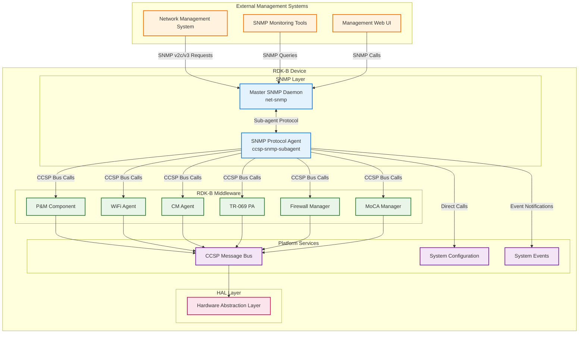
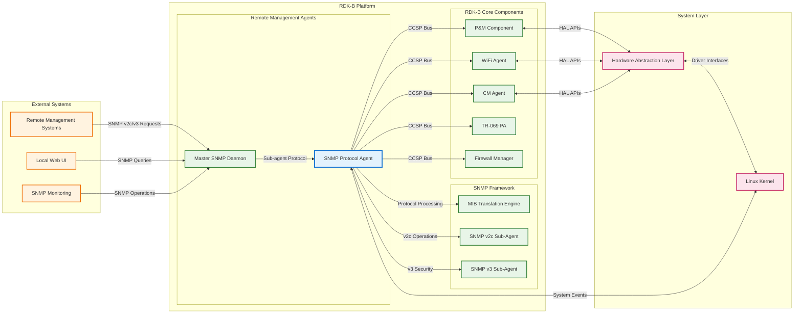
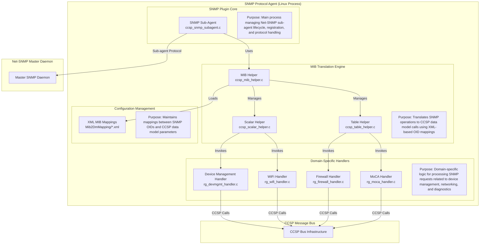
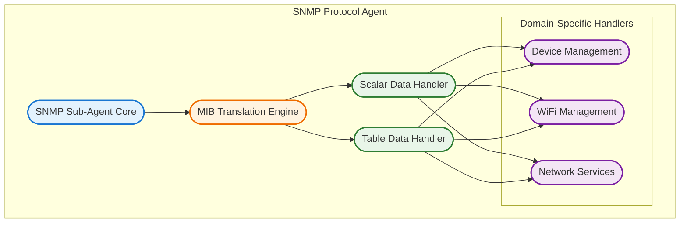
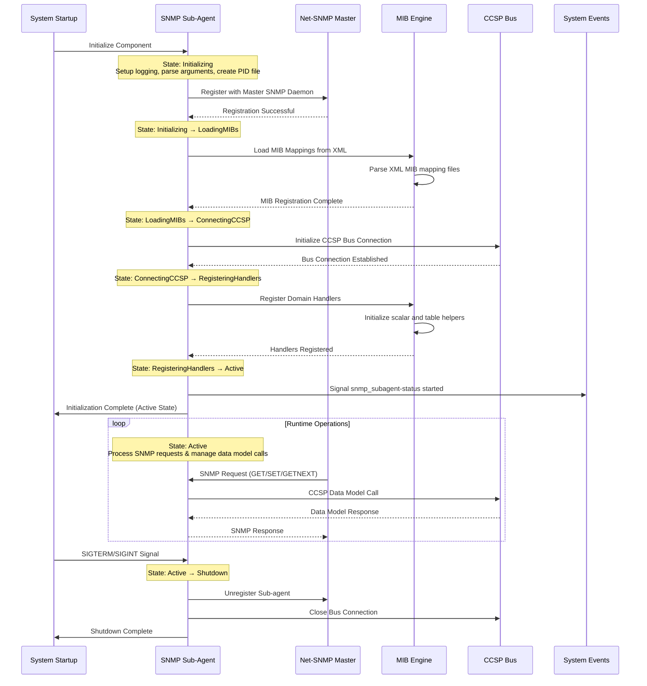
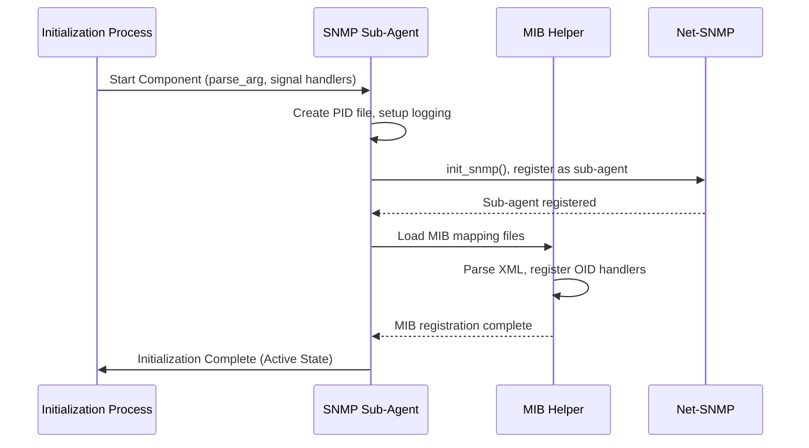
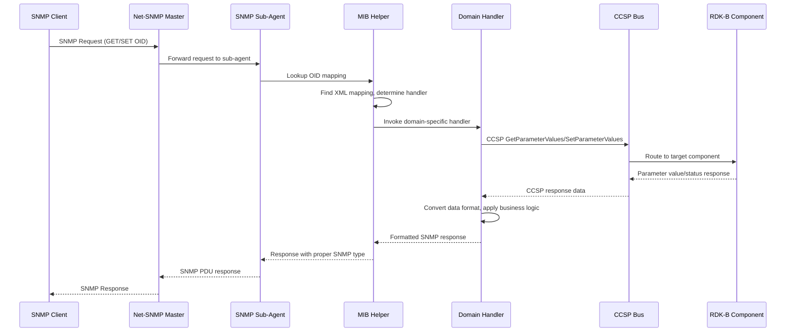
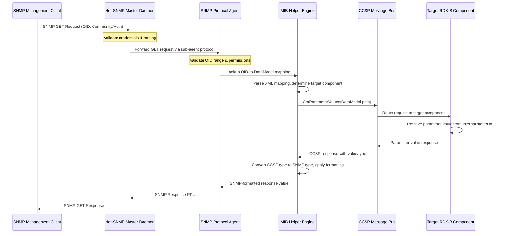
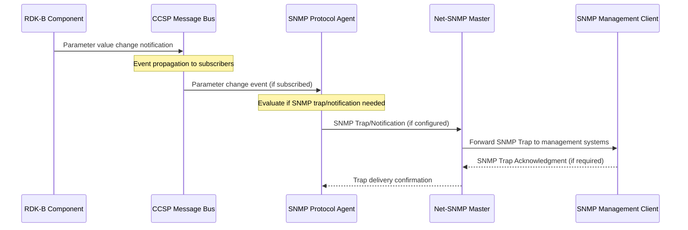
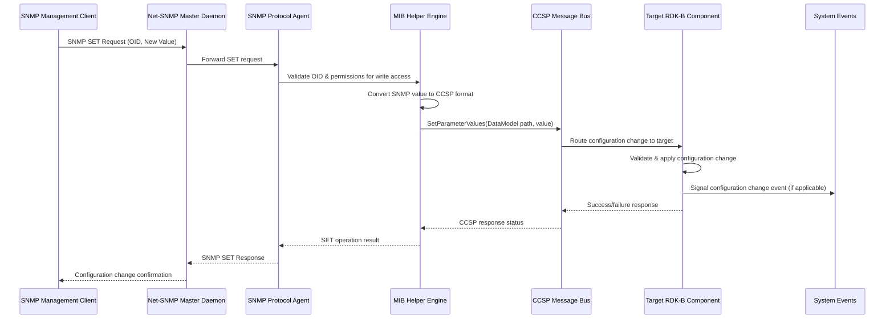

# SNMP Protocol Agent Documentation

The SNMP Protocol Agent serves as a bridge between external SNMP management systems and the RDK-B middleware stack, providing standardized network management capabilities through SNMP v2c and v3 protocols. This component enables remote monitoring and configuration of RDK-B devices by translating SNMP requests into calls to the underlying CCSP (Common Component Software Platform) data model and other RDK-B components.

The SNMP Protocol Agent operates as a sub-agent within the Net-SNMP framework, registering with the master SNMP daemon to handle specific MIB (Management Information Base) objects. It provides centralized access to device configuration, status information, and operational statistics from various RDK-B middleware components including WiFi management, device management, firewall configuration, MoCA status, and network diagnostics.

The component serves three primary functions: it acts as a protocol translator converting SNMP PDUs to CCSP data model operations, provides a security layer implementing SNMP authentication and authorization mechanisms, and maintains performance optimization through intelligent caching and batch processing of data model requests to minimize system overhead while ensuring real-time responsiveness to management operations.

**Key Features & Responsibilities**: 

- **SNMP Protocol Translation**: Converts SNMP GET/SET/GETNEXT operations into CCSP data model calls, enabling standardized network management access to RDK-B device parameters
- **MIB-to-Data Model Mapping**: Maintains comprehensive XML-based mappings between SNMP MIB objects and CCSP data model parameters for device management, WiFi, firewall, and network diagnostics
- **Multi-Version SNMP Support**: Implements both SNMP v2c and v3 protocols with separate sub-agent instances, providing backward compatibility and enhanced security features
- **Real-time Device Monitoring**: Provides live access to device status, performance metrics, and configuration parameters from multiple RDK-B components through standardized SNMP interfaces
- **Security and Authentication**: Integrates with Net-SNMP security framework to provide community-based (v2c) and user-based (v3) authentication and authorization mechanisms
- **Performance Optimization**: Implements intelligent caching strategies and batch processing to minimize system overhead while maintaining responsive access to device information

## Design

The SNMP Protocol Agent is architected as a modular sub-agent that integrates seamlessly with the Net-SNMP framework while providing optimized access to the RDK-B middleware stack. The design follows a layered approach with clear separation between protocol handling, data translation, and system integration concerns. The component operates within the Net-SNMP ecosystem as a dynamically loadable module, registering specific MIB subtrees and handling SNMP operations for those namespaces.

The core design principle centers around efficient translation between SNMP protocol operations and CCSP data model interactions. The component maintains a sophisticated mapping engine that uses XML configuration files to define relationships between SNMP OIDs and data model parameters, enabling dynamic configuration without code changes. This approach allows for platform-specific customizations while maintaining a common codebase across different RDK-B deployments. The design incorporates intelligent caching mechanisms to minimize redundant data model queries and optimize response times for frequently accessed parameters.

The architecture supports both synchronous and asynchronous operations, with the ability to handle complex table operations efficiently. The design includes specialized handlers for different functional areas such as device management, WiFi configuration, firewall settings, and network diagnostics, each optimized for their specific data access patterns. Error handling and logging are integrated throughout the design to provide comprehensive troubleshooting capabilities while maintaining system stability under various failure conditions.

The north-bound interface integrates with the master SNMP daemon through the standard Net-SNMP sub-agent protocol, supporting both UDP and TCP transports with configurable addressing schemes. The south-bound interface leverages the CCSP message bus for component communication, direct system configuration APIs for platform-specific settings, and sysevent mechanisms for real-time status monitoring and event propagation throughout the RDK-B stack.

### Prerequisites and Dependencies

**Build-Time Flags and Configuration:**

| Configure Option | DISTRO Feature | Build Flag | Purpose | Default |
|------------------|----------------|------------|---------|---------|
| `--enable-unitTestDockerSupport` | N/A | N/A | Enable Docker container support for unit testing | Disabled |
| N/A | `snmppa` | `SNMP_PA_ENABLE` | Enable SNMP Protocol Agent component and install configuration files | Platform dependent |
| N/A | `safec` | `SAFEC_DUMMY_API` (if safec not available) | Enable SafeC library support for secure string operations | Enabled if safec available |
| N/A | `OneWifi` | `RDK_ONEWIFI` | Enable OneWifi integration for wireless management through SNMP | Disabled |
| N/A | `rdkb_wan_manager` | `FEATURE_RDKB_WAN_MANAGER` | Enable WAN Manager integration for network management | Platform dependent |
| N/A | `rdk-b` | `FEATURE_SUPPORT_RDKLOG` | Enable RDK Logger framework integration for centralized logging | Enabled by default |

 

**RDK-B Platform and Integration Requirements:**

- **RDK-B Components**: CCSP P&M (Provisioning & Management), CCSP Common Library, and target-specific CCSP components (WiFi Agent, CM Agent, etc.) must be present and running
- **HAL Dependencies**: Device-specific HAL implementations for WiFi, MoCA, and network interfaces must be available and functional
- **Systemd Services**: ccsp-p-and-m.service, ccsp-common-library.service must be active before SNMP sub-agent initialization
- **Message Bus**: CCSP message bus infrastructure must be initialized and accessible for inter-component communication
- **Configuration Files**: /usr/ccsp/snmp/conf/snmpd.conf, MIB mapping files in /usr/ccsp/snmp/conf/Mib2DmMapping/ directory must be present
- **Startup Order**: Master SNMP daemon must be running before sub-agent instances can register and become operational

**Threading Model** 

The SNMP Protocol Agent follows a single-threaded event-driven architecture optimized for SNMP protocol processing and CCSP data model integration. The component operates within the Net-SNMP framework's execution context, inheriting its threading characteristics while maintaining thread-safe operations for concurrent SNMP request processing.

- **Threading Architecture**: Single-threaded event-driven model with callback-based request processing
- **Main Thread**: Handles SNMP sub-agent registration, MIB loading, XML parsing, protocol message processing, and CCSP bus communication
- **Synchronization**: Utilizes Net-SNMP's built-in synchronization mechanisms for request serialization and response handling. No additional thread synchronization required due to single-threaded design
- **Event Processing**: Processes SNMP requests sequentially through registered callback handlers, ensuring atomic operations and consistent state management

### Component State Flow

**Initialization to Active State**

The SNMP Protocol Agent follows a well-defined initialization sequence that ensures proper integration with both the Net-SNMP framework and the RDK-B middleware ecosystem. The component progresses through distinct states during startup, with each phase building upon the successful completion of the previous phase.

**Runtime State Changes and Context Switching**

The SNMP Protocol Agent maintains operational state primarily through the Net-SNMP framework's state management, with additional context maintained for CCSP integration and caching optimization.

**State Change Triggers:**

- SNMP master daemon restart triggers sub-agent re-registration and MIB re-initialization
- CCSP bus disconnection events trigger reconnection attempts and temporary request queuing
- Configuration file changes (detected through file system monitoring) trigger MIB mapping reload
- Memory pressure or cache timeouts trigger cache cleanup and optimization cycles

**Context Switching Scenarios:**

- Version-specific sub-agent instances (v2c vs v3) operate independently with separate PID files and configuration contexts
- Handler context switches occur when processing different MIB namespaces (device management vs WiFi vs firewall)
- Cache context management switches between fresh data retrieval and cached response modes based on configured timeouts

### Call Flow

**Initialization Call Flow:**

**Request Processing Call Flow:**

The SNMP Protocol Agent processes incoming SNMP requests through a sophisticated translation mechanism that converts protocol operations into CCSP data model interactions while maintaining SNMP semantics and error handling.

## Internal Modules

The SNMP Protocol Agent is organized into specialized modules that handle different aspects of SNMP protocol processing and data model integration. Each module is designed with specific responsibilities to maintain clean separation of concerns and enable efficient processing of SNMP operations.

| Module/Class | Description | Key Files |
|-------------|------------|-----------|
| **SNMP Sub-Agent Core** | Main process managing Net-SNMP sub-agent lifecycle, protocol registration, signal handling, and process management for both SNMP v2c and v3 instances | `ccsp_snmp_subagent.c`, `CcspSnmpPlugin.h` |
| **MIB Translation Engine** | XML-driven mapping engine that translates between SNMP OIDs and CCSP data model parameters, managing scalar and table operations with intelligent caching | `ccsp_mib_helper.c`, `ccsp_mib_helper.h`, `ccsp_mib_utilities.c` |
| **Scalar Data Handler** | Specialized handler for SNMP scalar operations (single-value OIDs) with optimized GET/SET processing and data type conversion between SNMP and CCSP formats | `ccsp_scalar_helper.c`, `ccsp_scalar_helper.h` |
| **Table Data Handler** | Complex table operations handler supporting SNMP GETNEXT traversal, bulk operations, and efficient row-based data retrieval from CCSP components | `ccsp_table_helper.c`, `ccsp_table_helper.h` |
| **Device Management Handler** | Domain-specific handler for device information, system status, reboot operations, and general device management parameters accessible via SNMP | `rg_devmgmt_handler.c`, `rg_devmgmt_handler.h` |
| **WiFi Management Handler** | Specialized handler for WiFi configuration, status monitoring, client information, and wireless network management through SNMP interfaces | `rg_wifi_handler.c` |
| **Network Services Handlers** | Collection of handlers for firewall configuration, MoCA status, IP management, NTP settings, and network diagnostics accessible via standardized SNMP MIBs | `rg_firewall_handler.c`, `rg_moca_handler.c`, `rg_ipmgmt_handler.c`, `rg_ntpserver_handler.c` |

## Component Interactions

The SNMP Protocol Agent serves as a critical integration point within the RDK-B architecture, interfacing with multiple layers and components to provide comprehensive network management capabilities. The component's interactions span from external SNMP management systems down to hardware abstraction layers, with sophisticated data translation and caching mechanisms to optimize performance.

### Interaction Matrix

| Target Component/Layer | Interaction Purpose | Key APIs/Endpoints |
|------------------------|-------------------|------------------|
| **RDK-B Middleware Components** |
| P&M Component | Device information retrieval, system status monitoring, reboot operations, and general device management parameter access | `GetParameterValues()`, `SetParameterValues()`, `Device.DeviceInfo.*` namespace |
| WiFi Agent | Wireless configuration management, client status monitoring, access point settings, and WiFi security parameter control | `Device.WiFi.*` namespace, `GetParameterValues()`, `SetParameterValues()` |
| CM Agent | Cable modem status monitoring, signal quality metrics, and upstream/downstream channel information for DOCSIS operations | `Device.X_CISCO_COM_CableModem.*`, status and diagnostic parameters |
| TR-069 PA | Remote management parameter synchronization and configuration state coordination between SNMP and TR-069 protocols | Data model parameter coordination, `Device.ManagementServer.*` |
| Firewall Manager | Security rule configuration, port blocking settings, and network access control through SNMP-accessible firewall parameters | `Device.Firewall.*` namespace, security configuration parameters |
| MoCA Manager | Coaxial network status monitoring, MoCA link quality metrics, and mesh network topology information | `Device.MoCA.*` namespace, network status and performance metrics |
| **System & Platform Services** |
| CCSP Message Bus | Primary inter-component communication for data model operations, component discovery, and parameter synchronization | `CCSP_Message_Bus_Get_Parameter()`, `CCSP_Message_Bus_Set_Parameter()` |
| System Configuration (syscfg) | Persistent configuration storage and retrieval for system-wide settings not managed through CCSP data model | `syscfg_get()`, `syscfg_set()`, configuration persistence operations |
| System Events (sysevent) | Real-time event notification and status signaling for component lifecycle and operational state changes | `sysevent_get()`, `sysevent_set()`, event subscription and notification |
| Unified API (UTAPI) | Platform-specific utility functions for network interface management and system operation support | Network interface utilities, system operation helpers |

**Events Published by SNMP Protocol Agent:**

| Event Name | Event Topic/Path | Trigger Condition | Subscriber Components |
|------------|-----------------|-------------------|---------------------|
| snmp_subagent-status | `snmp_subagent-status` | Component initialization complete, operational state changes | System monitoring, log aggregation services |
| snmp_v2_initialized | `/tmp/snmp_subagent_v2_initialized` | SNMP v2c sub-agent successfully initialized and ready for requests | Boot time measurement, system health monitoring |
| snmp_v3_initialized | `/tmp/snmp_subagent_v3_initialized` | SNMP v3 sub-agent successfully initialized with security contexts | Boot time measurement, security monitoring services |

### IPC Flow Patterns

**Primary IPC Flow - SNMP GET Request Processing:**

**Event Notification Flow:**

**Configuration Update Flow:**

## Implementation Details

### Major HAL APIs Integration

The SNMP Protocol Agent primarily integrates with RDK-B components through the CCSP message bus rather than direct HAL API calls. However, it does interact with platform-specific APIs through the RDK-B middleware layer for certain system-level operations and hardware status retrieval.

**Core Platform APIs:**

| Platform API | Purpose | Implementation File |
|---------|---------|-------------------|
| `syscfg_get()` / `syscfg_set()` | System configuration persistence for SNMP settings, community strings, and platform-specific parameters | `ccsp_snmp_subagent.c`, handler modules |
| `sysevent_get()` / `sysevent_set()` | Real-time system event monitoring and notification for component lifecycle and operational status | `ccsp_snmp_subagent.c`, `rg_devmgmt_handler.c` |
| `utapi_*` functions | Unified API calls for network interface management and system utility operations | Various handler modules |
| Net-SNMP API calls | `init_snmp()`, `register_mib()`, `snmp_log()` for SNMP protocol integration and sub-agent registration | `ccsp_snmp_subagent.c` |

### Key Implementation Logic

- **MIB-to-DataModel Translation Engine**: The core translation logic resides in `ccsp_mib_helper.c` with XML-driven mapping configuration loaded at startup. The engine parses OID requests, looks up corresponding CCSP data model paths, and handles data type conversion between SNMP and CCSP formats.
     - Main implementation in `ccsp_mib_helper.c` with XML parsing and OID registration
     - Translation handlers in `ccsp_scalar_helper.c` and `ccsp_table_helper.c` for different operation types
  
- **Request Processing Pipeline**: SNMP requests flow through a multi-stage pipeline with validation, translation, CCSP bus communication, and response formatting stages designed for optimal performance and error handling.
     - Request validation and routing in sub-agent core
     - Data model call orchestration through MIB helper engine
     - Response caching and optimization for frequently accessed parameters
  
- **Error Handling Strategy**: Comprehensive error detection and recovery mechanisms ensure system stability under various failure conditions while providing meaningful SNMP error responses.
     - CCSP bus error code mapping to SNMP error types
     - Timeout handling for slow data model operations with configurable retry logic
     - Graceful degradation when RDK-B components are unavailable or unresponsive
  
- **Logging & Debugging**: Multi-level logging integrated with both Net-SNMP logging framework and RDK-B logging standards for comprehensive troubleshooting capabilities.
     - SNMP operation tracing through Net-SNMP logging mechanisms
     - CCSP bus call logging with parameter values and response times
     - Domain-specific debug logging in handler modules for detailed troubleshooting

### Key Configuration Files

| Configuration File | Purpose | Override Mechanisms |
|--------------------|---------|--------------------|
| `config/snmpd.conf` | Master SNMP daemon configuration including community strings, access control, and sub-agent loading directives | Environment variables, runtime syscfg parameters |
| `Mib2DmMapping/*.xml` | XML-based mappings between SNMP OIDs and CCSP data model parameters for all supported MIB modules | Platform-specific XML files, conditional compilation flags |
| `/var/tmp/snmp_subagent_*.pid` | Process ID files for SNMP v2c and v3 sub-agent instances used by systemd service management | Runtime process management, automatic cleanup on restart |
| `/usr/ccsp/snmp/mibs/*.txt` | Standard MIB definition files loaded by Net-SNMP for OID resolution and validation | MIBDIRS environment variable, runtime MIB loading |