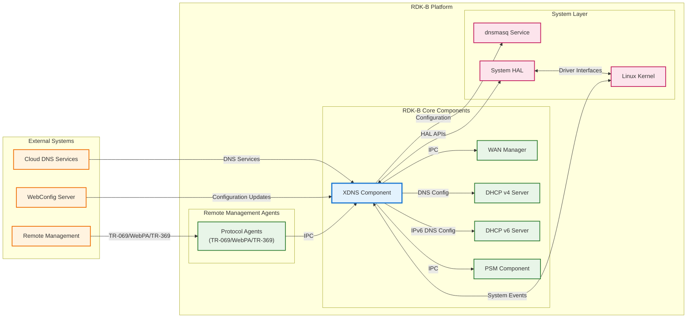
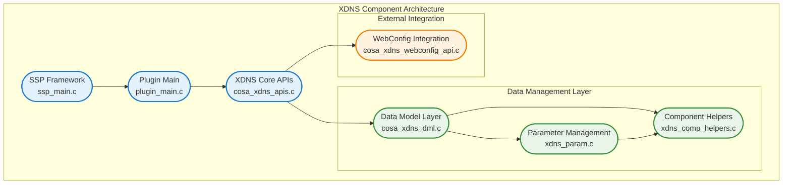
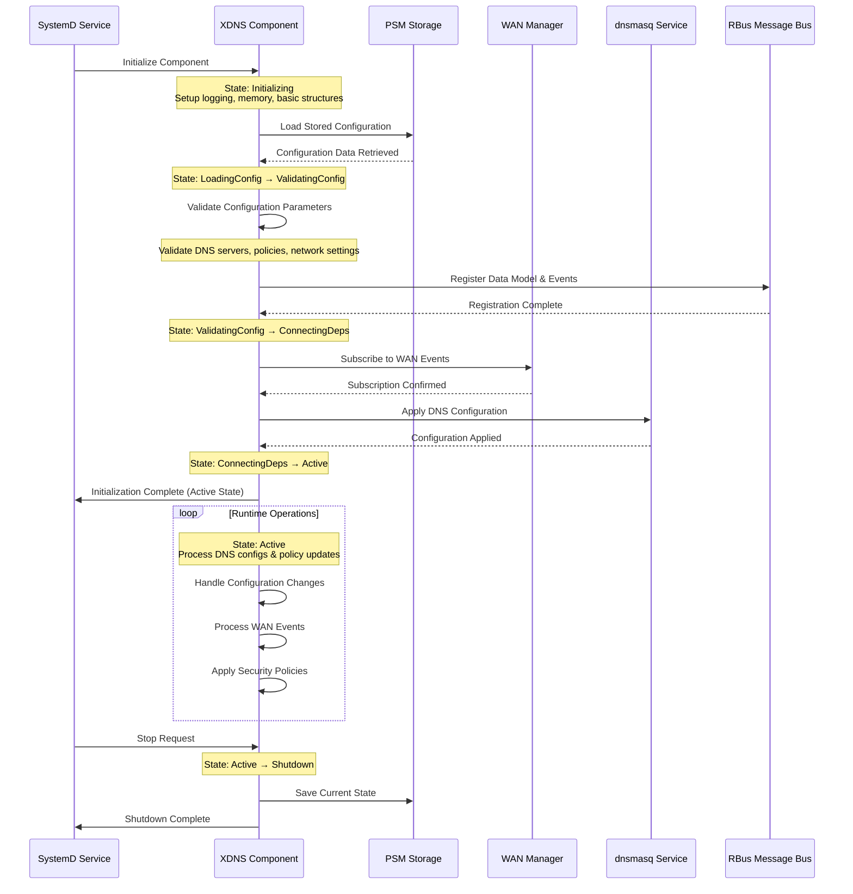
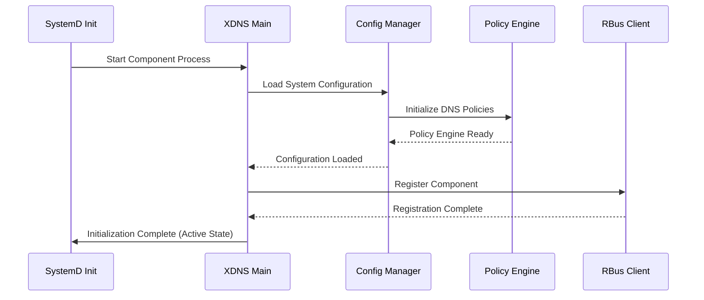
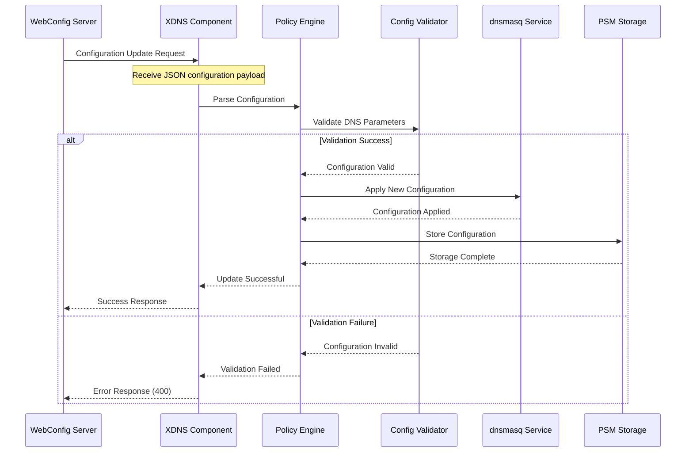
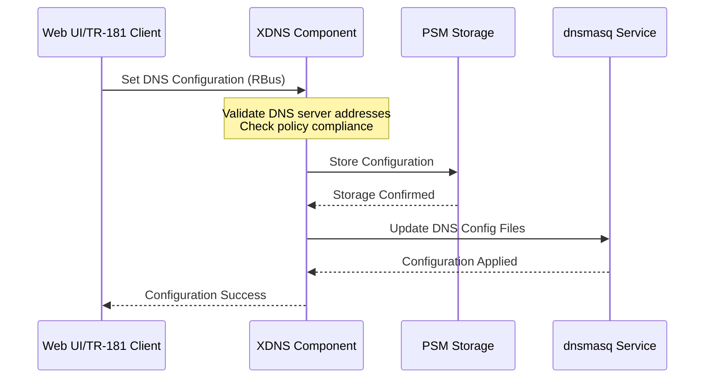
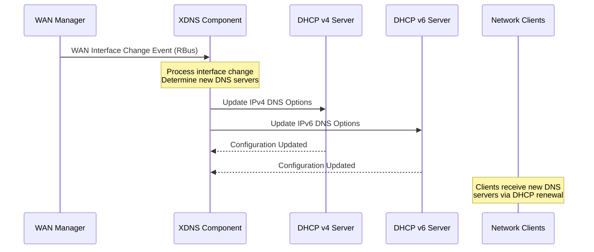

# XDNS (Extended DNS) Component Documentation

The XDNS (Extended DNS) component is a specialized RDK-B middleware component that provides advanced DNS management capabilities for RDK-B gateway devices. This component extends beyond traditional DNS functionality by implementing configurable DNS policies, security features, and integration with RDK-B's WebConfig framework for dynamic DNS configuration management. The XDNS component serves as a critical networking service that enables service providers to implement DNS-based content filtering, parental controls, and network security policies while maintaining compatibility with standard DNS protocols.

The XDNS component operates as a middleware layer between the RDK-B networking stack and external DNS services, providing intelligent DNS request routing, caching, and policy enforcement. It integrates deeply with the RDK-B ecosystem through TR-181 data model support, WebConfig integration for cloud-based configuration management, and RBus messaging for real-time communication with other RDK-B components. The component supports both IPv4 and IPv6 DNS configurations and provides failover mechanisms for high availability.

At the device level, XDNS enhances the gateway's networking capabilities by offering DNS-based security services, custom DNS server configurations per client or network segment, and comprehensive logging and monitoring of DNS activities. This enables service providers to offer value-added services such as malware protection, content filtering, and network usage analytics while maintaining transparent operation for end users.

**Key Features & Responsibilities**: 

- **DNS Configuration Management**: Centralized management of DNS server configurations for IPv4 and IPv6 networks, including primary and secondary DNS server settings with automatic failover capabilities
- **WebConfig Integration**: Support for cloud-based DNS configuration updates through RDK-B's WebConfig framework, enabling remote management and dynamic policy updates
- **Security Policy Enforcement**: Implementation of DNS-based security policies including malware protection, content filtering, and threat intelligence integration for network protection
- **Multi-Profile Support**: Advanced DNS profile management supporting different DNS configurations per client, network segment, or time-based policies for flexible network administration
- **WAN Failover Support**: Intelligent DNS server selection and failover mechanisms that work with RDK-B's WAN Manager for high availability network connectivity
- **TR-181 Data Model Integration**: Full TR-181 compliance for DNS parameters with support for remote management protocols and standardized device management interfaces
- **Real-time Event Processing**: RBus-based event handling for network state changes, WAN interface transitions, and dynamic DNS configuration updates
- **Logging and Telemetry**: Comprehensive DNS activity logging, performance metrics collection, and integration with RDK-B's telemetry framework for network monitoring

## Design

The XDNS component is architected as a modular, event-driven middleware service that follows the RDK-B design principles of separation of concerns and loose coupling. The design emphasizes configurability, security, and reliability through a layered architecture that cleanly separates DNS policy management from DNS resolution services. The component operates as a configuration orchestrator and policy engine, interfacing with the system's DNS resolver (typically dnsmasq) rather than implementing DNS resolution directly, which ensures compatibility with existing DNS infrastructure while adding advanced management capabilities.

The architectural design centers around three core principles: event-driven configuration management, where changes to network state or policies trigger automatic DNS configuration updates; modular policy enforcement, where DNS policies are implemented as pluggable modules that can be enabled or disabled based on service provider requirements; and high-availability design, where DNS services remain operational even during component updates or network transitions. The component utilizes RDK-B's standard IPC mechanisms (RBus) for inter-component communication and maintains state consistency through integration with the Persistent Storage Manager (PSM).

The northbound interface design focuses on standards compliance and cloud integration, exposing TR-181 compliant data models for traditional management protocols while supporting WebConfig APIs for modern cloud-based management. The southbound interface design emphasizes system integration, directly managing dnsmasq configuration files and system DNS settings while monitoring network interface changes through WAN Manager integration. This design ensures that DNS policies are enforced at the system level while maintaining visibility and control at the middleware level, enabling both local and remote management capabilities.

### Prerequisites and Dependencies

**Build-Time Flags and Configuration:**

| Configure Option | DISTRO Feature | Build Flag | Purpose | Default |
|------------------|----------------|------------|---------|---------|
| `--enable-core_net_lib_feature_support` | `core-net-lib` | `CORE_NET_LIB` | Enable advanced core networking library support for enhanced DNS processing | Disabled |
| N/A | `safec` | `SAFEC_DUMMY_API` (when disabled) | Enable/disable SafeC memory-safe API library for secure string operations | Enabled in production builds |
| N/A | `kirkstone` / `dunfell` | Build system compatibility | Yocto distribution version compatibility and Python version selection | Auto-detected |

 

**RDK-B Platform and Integration Requirements**

- **RDK-B Components**: WAN Manager (interface monitoring), PSM (Persistent Storage Manager), DHCP Server components (DNS distribution), TR-181 Data Model Provider (parameter management), CcspCr (Component Registrar), dnsmasq service (DNS resolution)
- **HAL Dependencies**: Network HAL for interface monitoring and configuration, System HAL for configuration persistence (minimum version 1.0 for basic functionality, 2.0+ recommended for advanced features and WAN failover support)
- **Systemd Services**: `CcspPsmSsp.service` (storage), `CcspCrSsp.service` (component registry), `CcspMtaAgentSsp.service` (management) must be active; `dnsmasq.service` must be available but controlled by XDNS component
- **Message Bus**: DBus registration under `com.cisco.spvtg.ccsp.xdns` namespace with RBus event subscription capabilities for WAN Manager interface change notifications and configuration updates
- **Configuration Files**: `/usr/ccsp/xdns/CcspXdns_dm.xml` (TR-181 data model), `/etc/ccsp_msg.cfg` (message bus configuration), `/nvram/syscfg.db` (system configuration storage), `/tmp/dnsmasq.conf` (DNS service config) must be accessible with read/write permissions
- **Startup Order**: PSM → Component Registrar → WAN Manager → DHCP Services → dnsmasq service → XDNS component initialization sequence must be strictly maintained for proper dependency resolution

**Threading Model** 

The XDNS component implements a hybrid threading model combining single-threaded event processing with dedicated worker threads for specific tasks, ensuring thread safety while maintaining responsive operation and preventing DNS service interruptions.

- **Main Thread Architecture**: Single-threaded event loop handles all IPC communications, configuration updates, and DNS policy management to ensure atomic operations and prevent race conditions in critical DNS configuration paths
- **Threading Architecture**: Event-driven with selective multi-threading for I/O intensive operations
- **Main Thread**: Handles RBus message processing, TR-181 data model operations, WebConfig API processing, DNS policy validation and application, state management and persistence operations
- **Worker Threads**: 
  - **File Monitor Thread**: Monitors `/etc/resolv.conf`, dnsmasq configuration files, and network interface changes using inotify for real-time detection of external configuration changes
  - **Network Event Thread**: Processes WAN Manager events, interface state changes, and DNS failover operations to ensure continuous DNS service availability during network transitions
- **Synchronization**: Mutex-protected shared data structures for DNS configuration state, atomic operations for critical configuration updates, condition variables for worker thread coordination and graceful shutdown signaling

### Component State Flow

**Initialization to Active State**

The XDNS component follows a structured initialization sequence that ensures all dependencies are established before processing DNS requests. The component starts in an uninitialized state and progresses through configuration loading, dependency connection, and service activation phases before reaching the fully operational active state.

**Runtime State Changes and Context Switching**

During normal operation, XDNS responds to various network and configuration events that trigger state transitions and context switches. These changes ensure that DNS services remain optimal and secure as network conditions and policies evolve.

**State Change Triggers:**

- **WAN Interface Changes**: WAN failover events, interface up/down transitions, and new default route assignments trigger DNS server re-evaluation and configuration updates
- **WebConfig Updates**: Cloud-based policy updates, security rule changes, and DNS profile modifications trigger validation and deployment of new configurations
- **Network Topology Changes**: DHCP lease events, client connection/disconnection, and VLAN configuration changes trigger client-specific DNS policy application
- **Security Events**: Threat detection, malware alerts, and security policy violations trigger DNS filtering rule updates and emergency policy enforcement

**Context Switching Scenarios:**

- **DNS Profile Switching**: Component switches between different DNS configurations based on client identity, network segment, or time-based policies without service interruption
- **Failover Context Switching**: Automatic switching between primary and secondary DNS servers during network failures with seamless client experience
- **Security Context Switching**: Dynamic switching between normal and restricted DNS policies based on threat detection or parental control schedules

### Call Flow

**Initialization Call Flow:**

**DNS Configuration Update Call Flow:**

The most critical flow supported by XDNS is the dynamic DNS configuration update process, which handles both local configuration changes and cloud-based policy updates while ensuring service continuity.

## Internal Modules

The XDNS component is structured into several specialized modules, each responsible for specific aspects of DNS management and system integration. These modules work together to provide comprehensive DNS services while maintaining clear separation of concerns and enabling independent testing and maintenance.

| Module/Class | Description | Key Files |
|-------------|------------|-----------|
| **XDNS Core APIs** | Main component initialization, lifecycle management, and core DNS configuration APIs providing the primary interface for DNS policy management | `cosa_xdns_apis.c`, `cosa_xdns_apis.h` |
| **Data Model Layer** | TR-181 compliant data model implementation handling get/set operations for DNS parameters and WebUI integration | `cosa_xdns_dml.c`, `cosa_xdns_dml.h` |
| **WebConfig Integration** | Cloud configuration management module handling JSON-based configuration updates and validation from WebConfig server | `cosa_xdns_webconfig_api.c`, `cosa_xdns_webconfig_api.h` |
| **SSP Framework** | Service Provider abstraction layer managing component registration, message bus integration, and system service lifecycle | `ssp_main.c`, `ssp_internal.h`, `ssp_global.h` |
| **Parameter Management** | System configuration parameter handling module managing syscfg integration and persistent storage of DNS settings | `xdns_param.c`, `xdns_param.h` |
| **Component Helpers** | Utility functions and helper modules providing common DNS validation, string manipulation, and system integration functions | `xdns_comp_helpers.c`, `xdns_comp_helpers.h` |
| **Plugin Main** | Component plugin interface managing dynamic loading, initialization callbacks, and integration with RDK-B component framework | `plugin_main.c`, `plugin_main.h`, `plugin_main_apis.c` |

## Component Interactions

The XDNS component operates as a central DNS management hub within the RDK-B ecosystem, maintaining active communication channels with multiple middleware components, system services, and external management systems. These interactions enable comprehensive DNS service management while ensuring integration with network management, security policies, and device configuration frameworks.

### Interaction Matrix

| Target Component/Layer | Interaction Purpose | Key APIs/Endpoints |
|------------------------|-------------------|------------------|
| **RDK-B Middleware Components** |
| WAN Manager | Network state monitoring, interface change notifications, DNS failover coordination | `Device.X_RDK_WanManager.CurrentActiveInterface`, `Device.X_RDK_WanManager.CurrentActiveDNS` |
| PSM (Persistent Storage) | DNS configuration persistence, system state storage, backup and recovery operations | `PSM_Set_Record_Value2()`, `PSM_Get_Record_Value2()`, `/config/xdns/` namespace |
| DHCP v4/v6 Servers | DNS server assignment to clients, DHCP option configuration, lease management integration | `/dmcli eRT setv Device.DHCPv4.Server.Pool.{i}.DNSServers`, DHCPv6 DNS options |
| TR-181 Provider | Standards-compliant parameter management, remote device management, data model updates | `Device.X_RDKCENTRAL-COM_XDNS.*` parameters, TR-181 commit/validate operations |
| **System & Platform Layers** |
| dnsmasq Service | DNS resolver configuration, DNS policy enforcement, DNS caching and forwarding | `/tmp/dnsmasq.conf`, `/tmp/dnsmasq.d/`, configuration file management |
| System Configuration | Parameter persistence, factory reset recovery, system-level DNS settings | `syscfg get/set X_RDKCENTRAL-COM_XDNS`, `/nvram/syscfg.db` |
| **External Services** |
| WebConfig Server | Cloud-based configuration management, policy updates, remote DNS management | `HTTPS POST /api/v1/device/{mac}/config`, JSON configuration blobs |
| Security Intelligence | Threat intelligence feeds, malware domain lists, security policy updates | Threat feed APIs, domain reputation services |

**Events Published by XDNS:**

| Event Name | Event Topic/Path | Trigger Condition | Subscriber Components |
|------------|-----------------|-------------------|---------------------|
| DNS_Configuration_Changed | `Device.X_RDKCENTRAL-COM_XDNS.ConfigurationChanged` | DNS server list updates, policy changes, security rule modifications | DHCP Servers, Telemetry Agent, Network Monitor |
| DNS_Failover_Event | `Device.X_RDKCENTRAL-COM_XDNS.FailoverEvent` | Primary DNS server failure, automatic failover to secondary DNS | WAN Manager, Telemetry Agent, Management Systems |
| Security_Policy_Applied | `Device.X_RDKCENTRAL-COM_XDNS.SecurityEvent` | Malware domain blocked, content filter activated, threat detected | Security Components, Logging System, Parental Controls |

### IPC Flow Patterns

**Primary IPC Flow - DNS Configuration Update:**

**WAN Failover Event Notification Flow:**

## Implementation Details

### Major HAL APIs Integration

The XDNS component primarily operates at the middleware level and has minimal direct HAL API integration, instead relying on system configuration APIs and network interface monitoring for platform-specific functionality.

**Core System APIs:**

| System API | Purpose | Implementation File |
|---------|---------|-------------------|
| `syscfg_get/syscfg_set` | System configuration parameter management for DNS settings persistence | `xdns_param.c` |
| `sysevent_get/sysevent_set` | Network event monitoring and state change notifications | `cosa_xdns_apis.c` |
| `inotify` API | File system monitoring for configuration file changes and automatic updates | `cosa_xdns_apis.c` |

### Key Implementation Logic

- **DNS Configuration State Machine**: The core DNS configuration management is implemented as a state machine with distinct phases for validation, application, and verification located in `cosa_xdns_apis.c` with configuration state tracking in `cosa_xdns_dml.c`
     - Main configuration state machine implementation in `cosa_xdns_apis.c` (functions: `XDNS_Validate()`, `XDNS_Commit()`, `XDNS_Rollback()`)
     - DNS parameter validation and TR-181 compliance handlers in `cosa_xdns_dml.c` (functions: `XDNS_GetParamStringValue()`, `XDNS_SetParamStringValue()`)
  
- **WebConfig Integration Processing**: Cloud-based configuration updates are processed through a secure validation pipeline that ensures configuration integrity and system compatibility
     - WebConfig JSON payload processing and validation in `cosa_xdns_webconfig_api.c`
     - Configuration blob decoding, schema validation, and security checks
     - Atomic configuration updates with rollback capability on validation failure

- **Real-time Network Event Handling**: Network state changes are monitored through RBus event subscriptions and sysevent monitoring for immediate DNS configuration adaptation
     - WAN Manager event subscription and processing in `cosa_xdns_apis.c` (function: `eventReceiveHandler()`)
     - Network interface monitoring and DNS server failover logic
     - Automatic DNS configuration updates based on WAN interface state changes

- **Error Handling Strategy**: Comprehensive error handling with graceful degradation ensures DNS services remain functional even during configuration errors or network issues
     - Configuration validation with detailed error reporting and rollback mechanisms
     - DNS server availability checking with automatic failover to backup servers
     - Logging and telemetry integration for troubleshooting and monitoring

- **Logging & Debugging**: Multi-level logging system with component-specific debug categories and integration with RDK-B's centralized logging framework
     - XDNS-specific logging macros in `ccsp_xdnsLog_wrapper.h` 
     - Configuration change tracking and DNS resolution performance monitoring
     - Debug hooks for real-time DNS policy troubleshooting and configuration validation

### Key Configuration Files

| Configuration File | Purpose | Override Mechanisms |
|--------------------|---------|--------------------|
| `/usr/ccsp/xdns/CcspXdns_dm.xml` | TR-181 Data Model definition | Environment variables, build-time customization |
| `/etc/ccsp_msg.cfg` | RBus message bus configuration | SystemD environment overrides |
| `/tmp/dnsmasq.conf` | dnsmasq service configuration | XDNS runtime configuration |
| `/nvram/syscfg.db` | System parameter storage | Factory reset, rescue mode |
| `/etc/resolv.conf` | System DNS resolver configuration | Network Manager overrides |