# CcspMisc Documentation

CcspMisc is a comprehensive collection of miscellaneous utility tools and components that provide essential supporting services for the RDK-B middleware stack. This component serves as a central repository for various system utilities, network configuration tools, diagnostic helpers, and service management components that are required by other RDK-B middleware components but don't belong to any specific functional domain.

The component operates as a collection of independent utility binaries and libraries rather than a monolithic service, providing essential infrastructure services including persistent storage management (PSM), network bridge configuration, DHCP client utilities, service control mechanisms, time conversion utilities, LED control, WebConfig testing tools, and diagnostic applications. Each utility is designed to integrate seamlessly with the broader RDK-B ecosystem while maintaining modularity and configurability based on platform requirements.

CcspMisc serves the RDK-B middleware by providing foundational utility services that enable configuration management, network infrastructure setup, system diagnostics, and inter-component communication support. These utilities act as building blocks that other RDK-B components depend on for basic system operations, making CcspMisc an essential supporting layer in the overall RDK-B architecture.

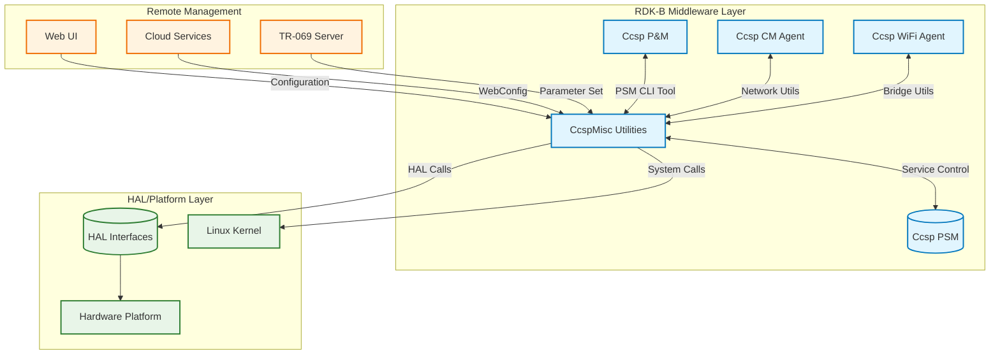

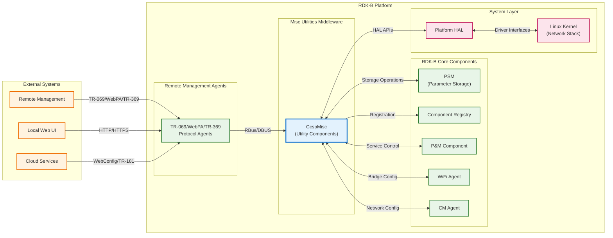

**Key Features & Responsibilities**: 

- **PSM CLI Tool (psmcli)**: Command-line interface for reading and writing persistent storage values, enabling configuration management and data persistence across system reboots
- **Service Control (ServiceCtrl)**: RBus-based service management utility that enables controlled restart of system services through standardized APIs and queue-based processing
- **Bridge Utilities**: Network bridge creation and management tools for configuring virtual network interfaces, VLAN tagging, and network topology management  
- **DHCP Client Utilities**: Comprehensive DHCP client management library supporting multiple DHCP implementations (udhcpc, dibbler, ti_dhcp6c) for both IPv4 and IPv6 configurations
- **Time Conversion Utilities**: System time management and conversion functions for handling different time formats and timezone operations across RDK-B components
- **LED Control (SetLED)**: Hardware LED control utility for visual status indication and platform-specific LED management functionality
- **WebConfig Test Tools**: Development and testing utilities for WebConfig functionality including daemon and application test components
- **Network Event Subscription**: Event handling mechanisms for network-related notifications and system state changes
- **Memory Fragment Calculator**: Diagnostic utility for analyzing memory fragmentation and system memory health monitoring
- **Message Queue Utilities**: Inter-process communication utilities for message passing and queue management between RDK-B components

## Design

CcspMisc follows a modular utility-based design where each tool is implemented as an independent binary or library with minimal inter-dependencies. The design emphasizes configurability through autotools build system with feature flags that allow platform-specific customization of which utilities are included in the final build. This approach ensures that resource-constrained platforms only include necessary utilities while maintaining full functionality on more capable hardware.

The component integrates deeply with the RDK-B ecosystem through standardized interfaces including RBus for service communication, PSM for persistent storage, HAL APIs for hardware abstraction, and syscfg for system configuration management. Each utility is designed to handle its specific domain (networking, storage, diagnostics) while providing well-defined APIs that other middleware components can depend upon.

The IPC design varies by utility function - ServiceCtrl uses RBus for service management APIs, bridge utilities interact directly with kernel networking interfaces through system calls and HAL APIs, while PSM CLI communicates with the PSM component through CCSP message bus protocols. This heterogeneous approach allows each utility to use the most appropriate communication mechanism for its specific use case.

Data persistence is managed through integration with the PSM component for configuration data, direct file system operations for temporary state, and syscfg for system-level configuration parameters. The utilities are designed to be stateless where possible, with persistent state managed through external storage mechanisms to ensure reliability and consistency across system restarts.

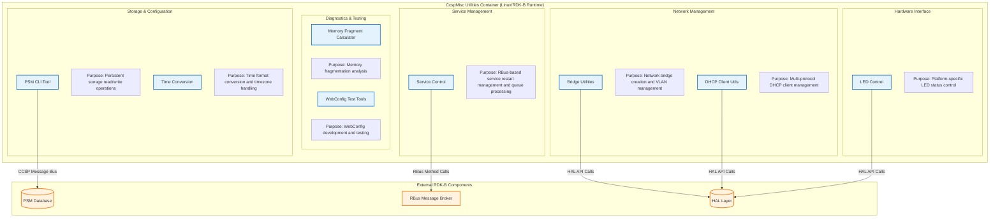

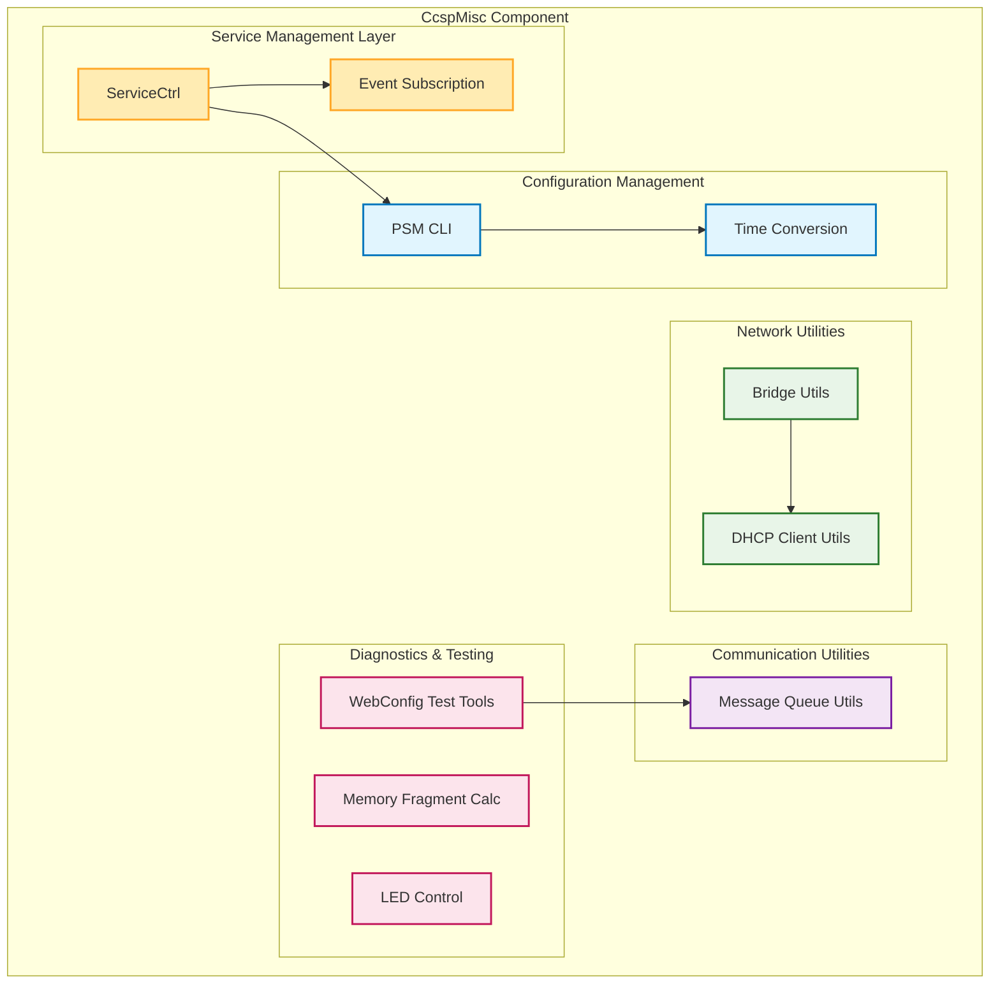

### Prerequisites and Dependencies

**Build-Time Flags and Configuration:**

| Configure Option | DISTRO Feature | Build Flag/Macro | Purpose | Default |
|------------------|----------------|------------------|---------|--------|
| `--enable-notifylease` | `notifylease` | `NOTIFYLEASE_ENABLE` | Enable DHCP lease notification utility | Disabled |
| `--enable-setLED=yes` | `setLED` | `SETLED_ENABLE` | Enable LED control utility (platform-specific: puma7, bcm3390) | Disabled |
| `--enable-multipartUtilEnable=yes` | `multipartUtility` | `MULTIPART_UTIL_ENABLE` | Enable multipart utility for WebConfig processing | Disabled |
| `--enable-wbCfgTestAppEnable` | `wbCfgTestApp` | `WEBCFG_TESTAPP_ENABLE` | Enable WebConfig testing daemon and application | Disabled |
| `--enable-bridgeUtilsBin` | N/A | `BRIDGE_UTILS_BIN_ENABLE` | Enable network bridge utilities binary | Disabled |
| `--enable-rdkSchedulerTestAppEnable` | `rdkscheduler_testapp` | `RDKSCHEDULER_TESTAPP_ENABLE` | Enable RDK Scheduler testing application | Disabled |
| `--enable-socketExampleEnable` | `Socket_Example` | `SOCKET_EXAMPLE_ENABLE` | Enable socket communication example utilities | Disabled |
| `--enable-dhcp_manager=yes` | `dhcp_manager` | `DHCP_MANAGER_ENABLE` | Enable DHCP manager integration support | Disabled |
| `--enable-core_net_lib_feature_support=yes` | `core-net-lib` | `CORE_NET_LIB` | Enable advanced core networking library support | Disabled |
| `--enable-unitTestDockerSupport` | N/A | `UNIT_TEST_DOCKER_SUPPORT` | Enable Docker support for unit testing | Disabled |
| N/A | `safec` | `SAFEC_DUMMY_API` (when disabled) | Safe C library integration for memory safety | Conditional |
| N/A | `rdkb_wan_manager` | `DHCPV4_CLIENT_UDHCPC`, `DHCPV6_CLIENT_DIBBLER` | WAN Manager DHCP client integration flags | Conditional |
| N/A | `enable_rdkscheduler` | Include RDK Scheduler headers | RDK Scheduler component integration | Conditional |

 

**RDK-B Platform and Integration Requirements**

- **RDK-B Components**: Depends on PSM component for persistent storage, RBus message broker for service communication, and Component Registry for component lifecycle management
- **HAL Dependencies**: Requires HAL platform interfaces for LED control, network management, and hardware-specific operations with minimum HAL version supporting bridge and DHCP operations
- **Systemd Services**: No direct systemd service dependencies as utilities run on-demand or as child processes of calling components
- **Message Bus**: RBus registration required for ServiceCtrl component with namespace "Device.DeviceInfo.X_RDKCENTRAL-COM_RFC.Feature.ServiceCtrl"
- **Configuration Files**: Utilizes syscfg configuration system and requires `/etc/utopia/` directory structure for configuration file access
- **Startup Order**: Must initialize after PSM component and RBus broker are available; individual utilities can be invoked independently

**Threading Model:**

CcspMisc utilities implement different threading models based on their specific functionality. Most utilities are single-threaded command-line tools that execute and exit, while ServiceCtrl implements a multi-threaded daemon architecture for concurrent service management operations.

| Thread & Function | Purpose | Cycle/Timeout | Synchronization |
|-------------------|---------|----------------|------------------|
| **Main Thread** `main()` / `servicecontrol_main.c` | Component initialization, RBus communication handling, signal processing, daemon lifecycle management | Event-driven RBus callback loop, signal-based event handling, configuration loading | pthread_mutex, RBus async callbacks |
| **Service Restart Queue Thread** `svc_restart_queue_loop()` | Service restart queue processing and execution | Continuous queue monitoring with pthread_cond_wait, processes comma-delimited service lists, executes systemctl restart commands | pthread_mutex (svcMutex), pthread_cond (svcCond) for queue operations |
| **Command-Line Utilities** Various utility binaries | Single-threaded execution for specific operations | Execute and exit pattern: PSM operations, bridge configuration, DHCP management, time conversion | No threading - stateless execution model |
| **Bridge Configuration** Bridge utilities execution | Network bridge creation and management | On-demand execution for bridge/VLAN operations, interface configuration tasks | No threading - synchronous HAL API calls |
| **DHCP Client Operations** DHCP utilities execution | DHCP client management and configuration | Event-driven DHCP operations, lease management, client state monitoring | No threading - callback-based event handling |
| **PSM CLI Operations** `psmcli` execution | Persistent storage read/write operations | Single command execution with CCSP message bus communication | No threading - synchronous PSM API calls |

### Component State Flow

**Initialization to Active State**

CcspMisc utilities have different initialization patterns - most are stateless command-line tools that execute and exit, while ServiceCtrl follows a daemon lifecycle with persistent state management.

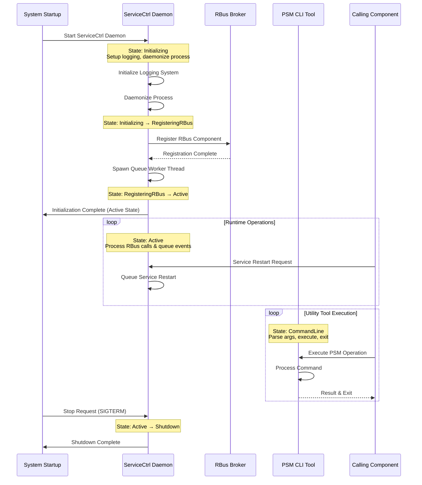

**Runtime State Changes and Context Switching**

ServiceCtrl is the primary component with runtime state management, while other utilities are typically stateless.

**State Change Triggers:**

- **ServiceCtrl State Changes**: Service restart requests trigger queue processing state, RBus disconnection triggers reconnection attempts, signal reception triggers graceful shutdown
- **Utility Tool State Changes**: Command-line argument processing triggers specific operation modes (get/set for PSMCli, create/delete for bridge utilities)
- **Error Recovery**: Failed RBus operations trigger retry logic, PSM communication failures trigger error logging and graceful exit

**Context Switching Scenarios:**

- **ServiceCtrl Queue Processing**: Switches between idle state and active service restart processing based on queue contents
- **Multi-Client Support**: Handles concurrent RBus method calls through separate handler threads
- **Configuration Mode Changes**: Bridge utilities switch between OVS and traditional bridge modes based on system configuration

### Call Flow

**Initialization Call Flow:**

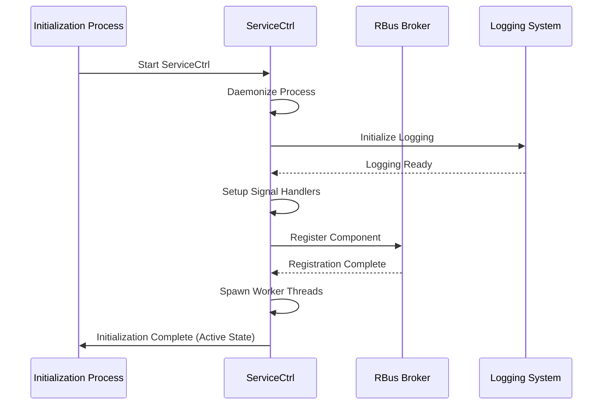

**Service Control Request Processing Call Flow:**

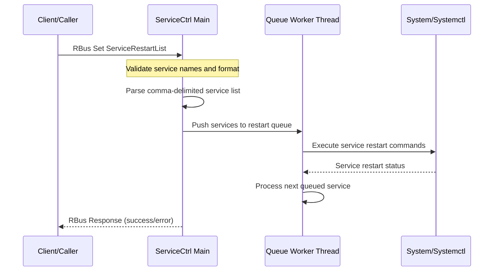

**PSM CLI Operation Call Flow:**

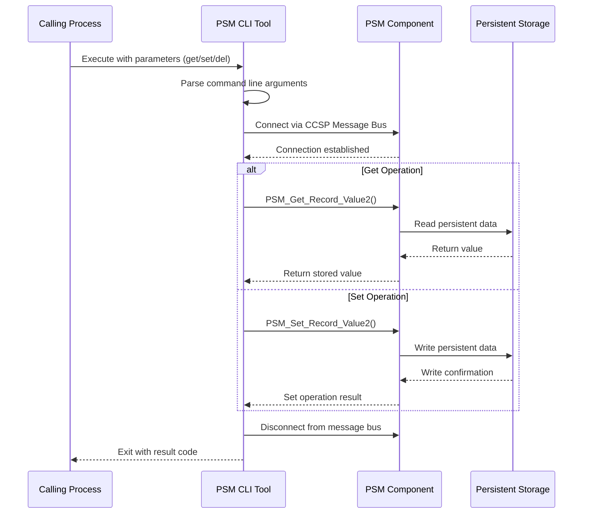

## Internal Modules

CcspMisc consists of multiple independent utility modules, each serving specific functional domains within the RDK-B ecosystem. The modules are designed to be self-contained with minimal inter-dependencies, allowing for flexible platform-specific builds.

| Module/Class | Description | Key Files |
|-------------|------------|-----------|
| **ServiceCtrl** | RBus-based service management daemon providing controlled restart functionality for system services with queue-based processing and error handling | `servicecontrol_main.c`, `servicecontrol_apis.c`, `servicecontrol_rbus_handler_apis.c` |
| **PSM CLI** | Command-line interface tool for persistent storage management operations including get/set/delete operations for configuration data stored in PSM database | `psmcli.c`, `psmtest.sh` |
| **Bridge Utils** | Network bridge configuration utilities providing programmatic interface for creating, deleting, and managing network bridges and VLAN interfaces | `bridge_creation.c`, `bridge_util.c`, `bridge_util_generic.c` |
| **DHCP Client Utils** | Multi-protocol DHCP client management library supporting various DHCP implementations with common API for IPv4/IPv6 operations | `dhcp_client_common.c`, `dhcpv4_client_utils.c`, `dhcpv6_client_utils.c`, `udhcpc_client_utils.c` |
| **Time Conversion** | System time management utilities providing conversion functions between different time formats and timezone handling capabilities | `time_conversion.c`, `time_conversion.h` |
| **LED Control** | Platform-specific LED control utility for managing visual status indicators and hardware LED state management | `SetLED.c` |
| **WebConfig Test Tools** | Development and testing utilities for WebConfig functionality including daemon processes and application testing components | `wbCfgTestDaemon.c`, `wbCfgTestApp.c` |
| **Event Subscription** | Network and system event handling utilities for processing notifications and managing event subscriptions | `event_subscriber.c` |
| **Memory Fragment Calc** | Diagnostic utility for analyzing system memory fragmentation and providing memory health monitoring capabilities | `MemFragCalc.c` |
| **Message Queue Utils** | Inter-process communication utilities providing message passing and queue management services for component communication | `msgq_util.c` |

## Component Interactions

CcspMisc utilities interact extensively with other RDK-B middleware components, HAL layer interfaces, and external services through multiple communication mechanisms. The interactions are designed to provide essential supporting services while maintaining loose coupling with dependent components.

### Interaction Matrix

| Target Component/Layer | Interaction Purpose | Key APIs/Endpoints |
|------------------------|-------------------|------------------|
| **RDK-B Middleware Components** |
| PSM Component | Persistent storage read/write operations for configuration data management | `PSM_Get_Record_Value2()`, `PSM_Set_Record_Value2()`, `PSM_Del_Record()` |
| RBus Message Broker | Service restart control and system management operations | `Device.DeviceInfo.X_RDKCENTRAL-COM_RFC.Feature.ServiceCtrl.ServiceRestartList` |
| Ccsp P&M | Configuration parameter management and device information queries | PSM CLI tool invocation, bridge utility configuration |
| Ccsp WiFi Agent | Network bridge configuration for WiFi interface management | Bridge creation/deletion APIs, VLAN configuration |
| **System & HAL Layers** |
| Platform HAL | Hardware abstraction for platform-specific operations and LED control | `platform_hal_GetLEDStatus()`, `platform_hal_SetLEDStatus()` |
| Network HAL | Low-level network interface operations and bridge management | Network interface creation, VLAN tagging, bridge operations |
| System Configuration | System-level configuration management through syscfg interface | Syscfg parameter read/write operations, configuration persistence |

**Events Published by CcspMisc:**

| Event Name | Event Topic/Path | Trigger Condition | Subscriber Components |
|------------|-----------------|-------------------|---------------------|
| Service Restart Complete | `ServiceCtrl.RestartComplete` | Service restart operation finished successfully | System monitoring components |
| Service Restart Failed | `ServiceCtrl.RestartFailed` | Service restart operation failed or timed out | Logging and alerting systems |
| Bridge Configuration Change | `NetworkConfig.BridgeChanged` | Network bridge created, deleted, or modified | WiFi Agent, CM Agent, Network Manager |
| DHCP Client Status | `DHCPClient.StatusChange` | DHCP client state change (acquire, release, renew) | Network components requiring IP status |

### IPC Flow Patterns

**Primary IPC Flow - Service Restart Control:**

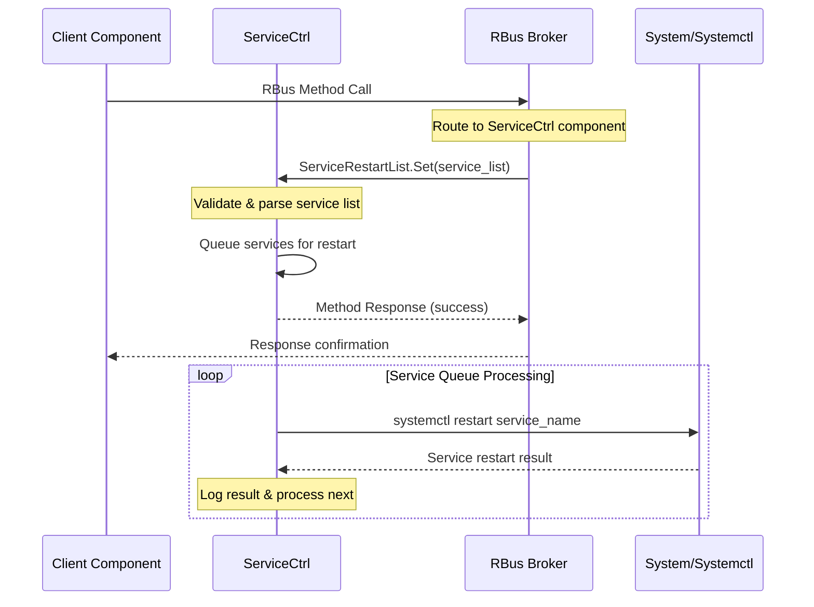

**PSM CLI Data Access Flow:**

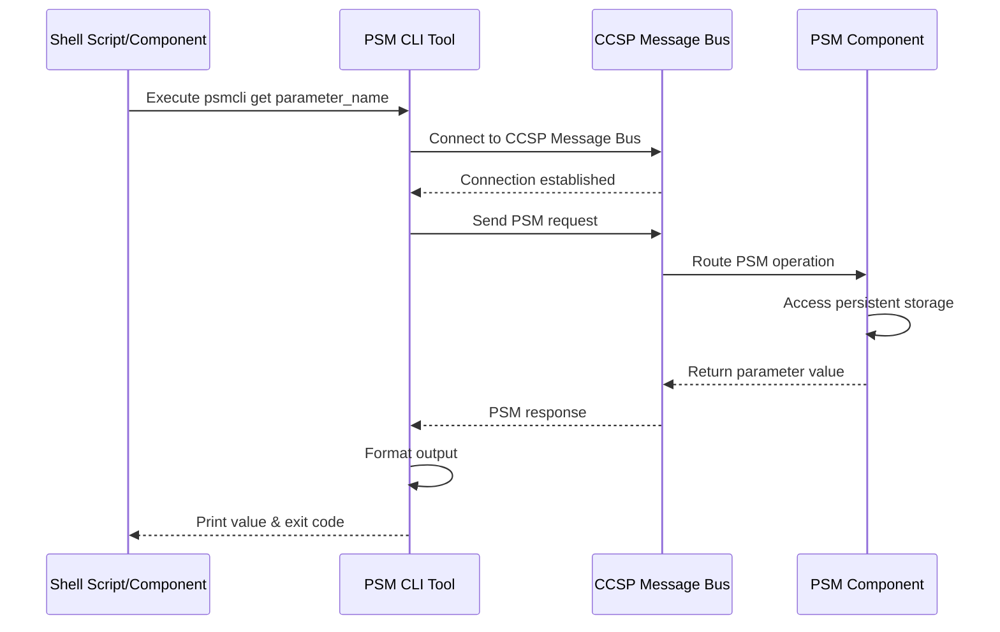

**Network Bridge Configuration Flow:**

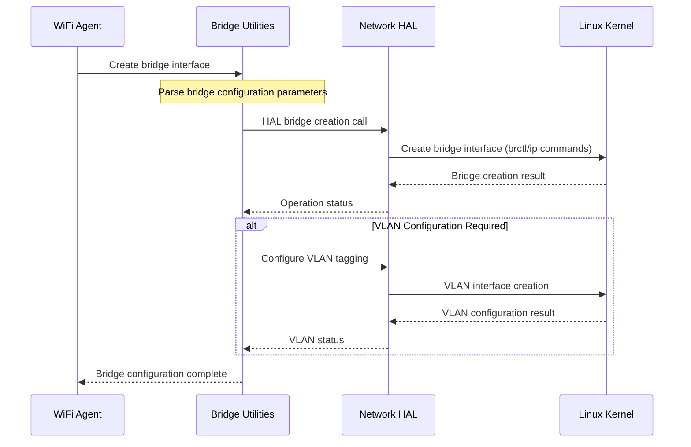

## Implementation Details

### Major HAL APIs Integration

CcspMisc utilities integrate with several HAL interfaces to provide hardware abstraction and platform-specific functionality while maintaining portability across different RDK-B platforms.

**Core HAL APIs:**

| HAL API | Purpose | Implementation File |
|---------|---------|-------------------|
| `platform_hal_GetLEDStatus()` | Retrieve current LED status and configuration for visual system status indication | `source/SetLED/SetLED.c` |
| `platform_hal_SetLEDStatus()` | Control LED state for system status indication and user feedback | `source/SetLED/SetLED.c` |
| Network HAL Bridge APIs | Low-level network bridge creation, deletion, and management operations | `source/bridge_utils/bridge_utils_bin/bridge_creation.c` |
| Network HAL Interface APIs | Network interface configuration and VLAN tagging operations | `source/bridge_utils/bridge_utils_bin/bridge_util.c` |

### Key Implementation Logic

- **Service Control State Machine**: The core service restart logic is implemented in `servicecontrol_main.c` with a multi-threaded architecture where the main thread handles RBus communication while a dedicated worker thread processes the service restart queue. State transition handlers manage the lifecycle from service restart request to completion, with error recovery mechanisms for failed operations.
     - Main implementation in `source/ServiceCtrl/servicecontrol_main.c` with daemon initialization and signal handling
     - State transition handlers in `source/ServiceCtrl/servicecontrol_apis.c` for queue management and service processing
  
- **PSM Integration Processing**: PSM CLI tool provides a command-line interface to the PSM persistent storage system, implemented with robust error handling and support for multiple data types including strings, integers, and binary data.
     - CCSP Message Bus connection handling for reliable PSM communication
     - Command-line argument parsing with support for get/set/delete operations
     - Data type conversion and validation for different parameter types

- **Network Bridge Management**: Bridge utilities implement a comprehensive network configuration system supporting both traditional Linux bridges and advanced features like VLAN tagging, with automatic detection of platform capabilities.
     - Traditional bridge operations using brctl-style commands through HAL abstraction
     - VLAN interface creation and configuration for advanced network topologies
     - Platform-specific bridge feature detection and capability management

- **Error Handling Strategy**: All utilities implement consistent error handling with detailed logging, graceful degradation for non-critical failures, and proper resource cleanup to ensure system stability.
     - HAL error code mapping with platform-specific error translation
     - Retry mechanisms for transient failures with exponential backoff
     - Timeout handling for network operations with configurable timeout values
     - Signal-safe error handling in daemon processes

- **Logging & Debugging**: Comprehensive logging system using RDK logging framework with configurable verbosity levels and utility-specific debug categories.
     - Service restart operation logging with detailed status information
     - PSM operation tracing for debugging storage access issues
     - Network configuration change logging for troubleshooting connectivity
     - Debug hooks for runtime introspection and diagnostic access

### Key Configuration Files

| Configuration File | Purpose | Override Mechanisms |
|--------------------|---------|--------------------|
| `/etc/utopia/system_defaults` | Default system configuration values for utility operation | Environment variables, syscfg overrides |
| `/var/lib/ccsp/ccsp_msg.cfg` | CCSP Message Bus configuration for PSM communication | Runtime message bus parameter updates |
| `/opt/rdk/servicecontrol.conf` | ServiceCtrl component configuration including allowed services list | RBus parameter updates, configuration reload |
| `/etc/dibbler/client.conf` | DHCPv6 client configuration for dibbler-based DHCP operations | Dynamic configuration updates through DHCP utils API |
| `/etc/udhcpc/udhcpc.conf` | DHCPv4 client configuration for udhcpc-based operations | Script-based configuration management |