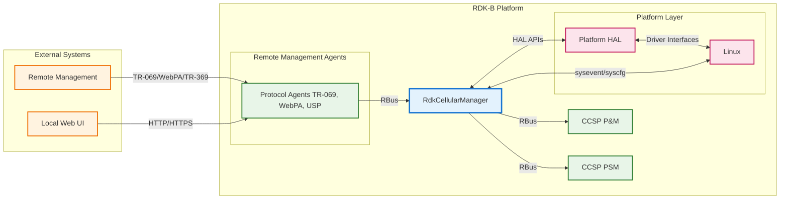
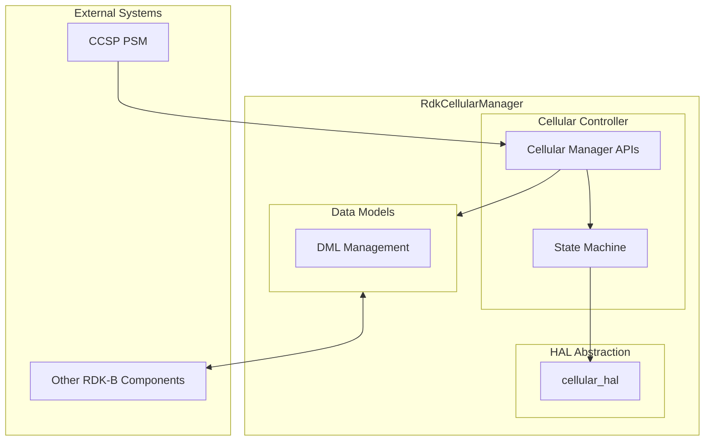
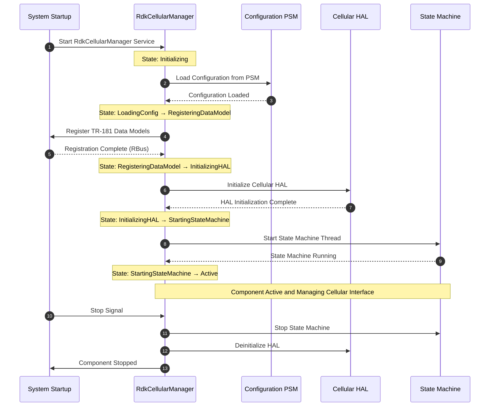
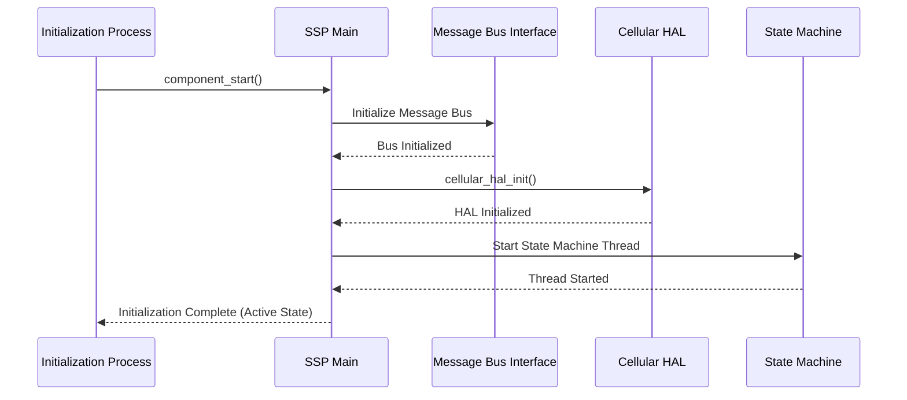
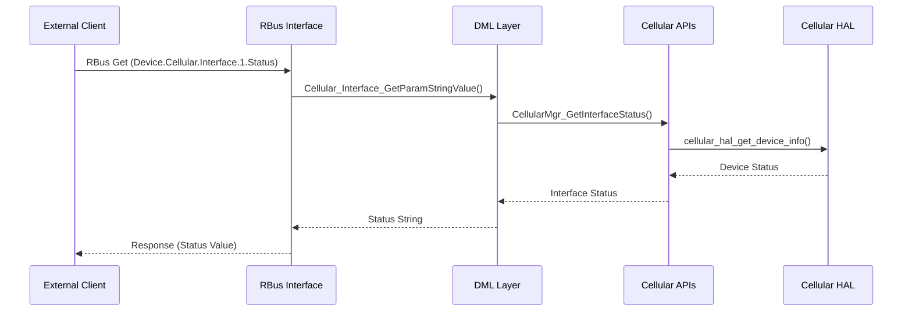
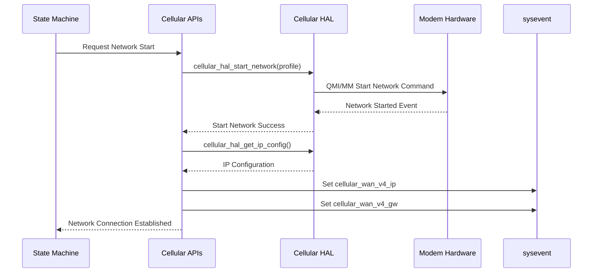
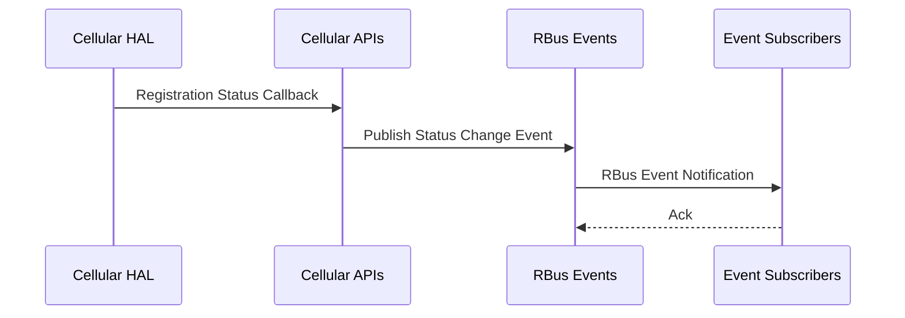

# RdkCellularManager Documentation

RdkCellularManager is the RDK-B component responsible for managing cellular modem interfaces, maintaining network connectivity through cellular WAN links, and providing standardized TR-181 data model access to cellular hardware capabilities. This component serves as the management and control interface between RDK-B middleware and vendor-specific cellular modem hardware through HAL (Hardware Abstraction Layer) APIs.

RdkCellularManager monitors and controls cellular modem initialization, SIM card management, network registration, profile configuration, and packet data network connectivity. The component implements the Device.Cellular TR-181 data model namespace enabling standardized access to cellular-specific parameters including interface status, signal quality, network registration state, and connection statistics. The component supports multiple cellular modem protocols including QMI (Qualcomm MSM Interface), ModemManager, and hybrid implementations through conditional compilation.

The component integrates with RDK-B message bus infrastructure through RBus for real-time event notifications and parameter synchronization. RdkCellularManager maintains cellular WAN interface lifecycle through an internal state machine that responds to modem events, manages network attachment sequences, and coordinates IP address configuration with the system networking stack.



**Key Features & Responsibilities**: 

- **Cellular Modem Lifecycle Management**: Controls modem device detection, initialization, firmware activation, and operational state transitions with support for multiple modem protocols including QMI and ModemManager backends
- **Network Registration and Attachment**: Manages cellular network registration including operator selection, roaming control, radio access technology selection, and NAS (Non-Access Stratum) registration state monitoring
- **SIM Card and Profile Management**: Provides SIM card detection, ICCID reading, PIN management, UICC slot selection, and cellular profile configuration including APN settings and authentication parameters
- **Packet Data Network Connectivity**: Establishes and maintains packet data connections supporting IPv4 and IPv6 address families with automatic IP configuration through DHCP client integration
- **Signal Quality and Network Metrics**: Monitors radio signal strength, serving cell information, neighbor cell data, network registration status, and connection statistics for performance analysis
- **TR-181 Data Model Implementation**: Implements comprehensive Device.Cellular object hierarchy following BBF TR-181 specifications for standardized access to cellular interface parameters
- **State Machine Control**: Executes policy-driven state machine managing cellular interface lifecycle from modem detection through network registration to active data connection establishment
- **Event-Driven Notifications**: Publishes RBus events for cellular interface status changes, registration state transitions, and connection state updates enabling real-time monitoring by dependent components


## Design

RdkCellularManager follows a layered architecture separating TR-181 data model implementation, state machine control logic, and hardware abstraction through well-defined interfaces. The design emphasizes asynchronous event-driven operation with non-blocking HAL communication to maintain responsiveness during modem initialization and network attachment sequences. The component maintains centralized data structures holding current cellular interface state synchronized through periodic polling and event callbacks from the vendor HAL layer.

The TR-181 middle layer implements Device.Cellular object hierarchy functions for parameter get/set operations, table synchronization, validation, commit, and rollback operations following CCSP data model agent conventions. The state machine controller orchestrates modem initialization, network registration, profile configuration, and packet data connection establishment providing separation between data model interface and connection management logic. The policy control state machine monitors modem detection status, device open state, SIM status, network registration, and IP configuration to autonomously manage interface enable/disable operations based on configuration and network conditions.

The northbound interface exposes TR-181 parameters through RBus messaging for integration with CcspPandM and other RDK-B components supporting both synchronous get/set operations and asynchronous event subscriptions. The southbound interface abstracts vendor-specific cellular modem control through Cellular HAL APIs supporting multiple modem communication protocols through conditional compilation. Configuration persistence is achieved through PSM (Persistent Storage Manager) for storing runtime configuration changes and syscfg for system-level settings. Network configuration is propagated to the system through sysevent mechanisms enabling coordination with DHCP clients and routing daemons.



### Prerequisites and Dependencies

**Build-Time Flags and Configuration:**

| Configure Option | DISTRO Feature | Build Flag | Purpose | Default |
|------------------|----------------|------------|---------|---------|
| `--enable-gtestapp` | N/A | `GTEST_ENABLE` | Enable Google Test framework support for unit testing | Disabled |
| `--enable-notify` | N/A | `ENABLE_SD_NOTIFY` | Enable systemd service notification support for service readiness signaling | Disabled |
| `--enable-dropearly` | N/A | `DROP_ROOT_EARLY` | Enable dropping root privileges early in initialization for security | Disabled |
| N/A | `HYBRID_SUPPORT` (Yocto DISTRO) | `HYBRID_SUPPORT` | Enable hybrid modem support combining multiple cellular protocols and device managers | Conditional |
| N/A | N/A | `MM_SUPPORT` | Enable ModemManager protocol support for cellular modem control | Conditional |
| N/A | N/A | `QMI_SUPPORT` | Enable QMI (Qualcomm MSM Interface) protocol support for cellular modem control | Conditional |
| N/A | N/A | `RBUS_BUILD_FLAG_ENABLE` | Enable RBus messaging infrastructure for inter-component communication | Platform Dependent |
| N/A | N/A | `FEATURE_SUPPORT_RDKLOG` | Enable RDK logging framework integration for centralized log management | Platform Dependent |

<br>

**RDK-B Platform and Integration Requirements:**

* **RDK-B Components**: `CcspPandM`, `CcspPsm`, `WebPA`, `CcspCommonLibrary`
* **HAL Dependencies**: Cellular HAL APIs supporting QMI, ModemManager, or hybrid implementations based on platform configuration
* **Systemd Services**: `CcspCrSsp.service`, `CcspPsmSsp.service` must be active before `RdkCellularManager.service` starts
* **Message Bus**: RBus registration under cellular namespace for event publishing and parameter access
* **TR-181 Data Model**: `Device.Cellular` object hierarchy implementation for interface management and statistics
* **Configuration Files**: `RdkCellularManager.xml` for TR-181 parameter definitions located in component configuration directory
* **System Libraries**: `libnanomsg`, `libsysevent`, `libsyscfg`, `libwebconfig_framework`, `libsecure_wrapper`, `libmsgpackc`, `libcurl`, `libtrower-base64`
* **Startup Order**: Initialize after network interfaces are available, PSM services are running, and message bus infrastructure is established

<br>

**Threading Model:** 

RdkCellularManager implements a multi-threaded architecture designed to handle concurrent modem operations, state machine execution, and external communications without blocking critical operations.

- **Threading Architecture**: Multi-threaded with main event loop and specialized worker threads for state machine execution
- **Main Thread**: Handles TR-181 parameter requests, RBus message processing, component lifecycle management, and message bus interface operations
- **Main worker Threads**: 
  - **State Machine Thread**: Executes cellular policy control state machine with 500ms loop interval managing modem lifecycle transitions, network registration sequences, and connection establishment
  - **HAL Event Threads**: Process asynchronous callbacks from cellular HAL layer for modem events, registration status updates, and packet service notifications
- **Synchronization**: Uses pthread mutex locks for shared data structure protection, thread-safe HAL API invocations, and state machine state transitions

### Component State Flow

**Initialization to Active State**

RdkCellularManager follows a structured initialization sequence ensuring all dependencies are properly established before entering active cellular management mode. The component performs configuration loading, TR-181 parameter registration, HAL initialization, and state machine startup in a predetermined order to guarantee system stability and modem connectivity.



**Runtime State Changes and Context Switching**

During normal operation, RdkCellularManager responds to various modem events, network conditions, and configuration changes that affect cellular interface operational state and connectivity behavior.

**State Change Triggers:**

- Modem device detection/removal events causing reinitialization of HAL and state machine reset
- SIM card insertion/removal events triggering SIM status validation and profile reconfiguration
- Network registration state changes requiring connection establishment or teardown based on registration success
- Configuration parameter changes affecting profile selection, APN settings, or roaming policies requiring connection restart
- Packet service status changes indicating data connection activation or deactivation requiring IP configuration updates

**Context Switching Scenarios:**

- State machine transitions between DOWN, DEACTIVATED, DEREGISTERED, REGISTERING, REGISTERED, and CONNECTED states based on modem and network conditions
- Protocol switching between QMI, ModemManager, or hybrid backends based on detected modem capabilities during initialization
- IP address family context switches between IPv4-only, IPv6-only, or dual-stack operation based on profile configuration and network support

### Call Flow

**Initialization Call Flow:**



**Request Processing Call Flow:**



## TR‑181 Data Models

### Supported TR-181 Parameters

RdkCellularManager implements comprehensive TR-181 data model support for cellular interface management following BBF TR-181 specifications for Device.Cellular object hierarchy. The component provides both standard BBF-defined parameters and vendor-specific extensions to support advanced RDK-B cellular connectivity features.

### Object Hierarchy

```
Device.
└── Cellular.
    ├── RoamingEnabled (boolean, R/W)
    ├── RoamingStatus (string, R)
    ├── InterfaceNumberOfEntries (unsignedInt, R)
    ├── AccessPointNumberOfEntries (unsignedInt, R)
    └── Interface.{i}.
        ├── Enable (boolean, R/W)
        ├── Status (string, R)
        ├── Alias (string, R/W)
        ├── Name (string, R)
        ├── LastChange (unsignedInt, R)
        ├── LowerLayers (string, R/W)
        ├── Upstream (boolean, R)
        ├── IMEI (string, R)
        ├── SupportedAccessTechnologies (string, R)
        ├── PreferredAccessTechnology (string, R/W)
        ├── CurrentAccessTechnology (string, R)
        ├── NetworkInUse (string, R)
        ├── RSSI (int, R)
        ├── RSRP (int, R)
        ├── RSRQ (int, R)
        ├── SNR (int, R)
        ├── X_RDK_Status (string, R)
        ├── X_RDK_LinkAvailability (string, R)
        ├── USIM.
        │   ├── Status (string, R)
        │   ├── IMSI (string, R)
        │   ├── ICCID (string, R)
        │   ├── MSISDN (string, R)
        │   └── PINCheck (string, R/W)
        ├── AccessPoint.{i}.
        │   ├── Enable (boolean, R/W)
        │   ├── Alias (string, R/W)
        │   ├── APN (string, R/W)
        │   ├── Username (string, R/W)
        │   ├── Password (string, R/W)
        │   ├── X_RDK_ApnAuthentication (string, R/W)
        │   ├── X_RDK_IpAddressFamily (string, R/W)
        │   └── X_RDK_Roaming (boolean, R/W)
        └── X_RDK_Statistics.
            ├── BytesSent (unsignedLong, R)
            ├── BytesReceived (unsignedLong, R)
            ├── PacketsSent (unsignedLong, R)
            ├── PacketsReceived (unsignedLong, R)
            └── PacketsDropped (unsignedLong, R)
```


## Internal Modules

RdkCellularManager is organized into specialized modules responsible for different aspects of cellular modem management, data model implementation, state machine control, and HAL abstraction. Each module encapsulates specific functionality while maintaining clear interfaces for inter-module communication and data sharing.

| Module/Class | Description | Key Files |
|-------------|------------|-----------|
| **Service Support Platform** | Process lifecycle management, message bus initialization, and component entry point providing integration with RDK-B service infrastructure | `cellularmgr_main.c`, `cellularmgr_ssp_action.c`, `cellularmgr_ssp_internal.h`, `cellularmgr_messagebus_interface.c` |
| **State Machine Controller** | Policy-driven state machine managing cellular interface lifecycle from modem detection through network registration to active data connection with autonomous state transitions | `cellularmgr_sm.c`, `cellularmgr_sm.h` |
| **Cellular Management APIs** | Core business logic coordinating modem operations, profile management, network registration, and connection control with centralized data structure management | `cellularmgr_cellular_apis.c`, `cellularmgr_cellular_apis.h`, `cellularmgr_cellular_internal.c`, `cellularmgr_cellular_internal.h` |
| **TR-181 Data Model Layer** | Device.Cellular object implementation providing standardized interface for cellular parameter access with validation, commit, and rollback support | `cellularmgr_cellular_dml.c`, `cellularmgr_cellular_dml.h`, `cellularmgr_cellular_param.c`, `cellularmgr_plugin_main.c`, `cellularmgr_plugin_main_apis.c` |
| **RBus Integration** | RBus data element registration, get/set handlers, and event publishing for real-time cellular interface monitoring and control | `cellularmgr_rbus_dml.c`, `cellularmgr_rbus_dml.h`, `cellularmgr_rbus_events.c`, `cellularmgr_rbus_events.h`, `cellularmgr_rbus_helpers.c` |
| **WebConfig Support** | Web configuration framework integration for remote cellular configuration management through cloud-based configuration updates | `cellularmgr_cellular_webconfig_api.c`, `cellularmgr_cellular_webconfig_api.h` |
| **HAL Abstraction Layer** | Hardware abstraction providing unified interface to vendor-specific cellular modem implementations supporting QMI, ModemManager, and hybrid protocols | `cellular_hal.c`, `cellular_hal.h`, `cellular_hal_qmi_apis.c`, `cellular_hal_mm_apis.c`, `cellular_hal_device_manager.c`, `cellular_hal_utils.c` |
| **Bus Utilities** | Component discovery and parameter access utilities for interacting with other RDK-B components through message bus infrastructure | `cellularmgr_bus_utils.c`, `cellularmgr_bus_utils.h` |

## Component Interactions

RdkCellularManager maintains extensive interactions with RDK-B middleware components, system services, and cellular modem hardware to provide comprehensive cellular WAN connectivity management. These interactions span multiple protocols and communication patterns including synchronous API calls, asynchronous event notifications, and data synchronization mechanisms.

### Interaction Matrix

| Target Component/Layer | Interaction Purpose | Key APIs/Endpoints |
|------------------------|-------------------|------------------|
| **RDK-B Middleware Components** |
| CcspPandM | TR-181 parameter registration, component configuration management, operational state coordination | RBus data element registration, parameter get/set handlers |
| CcspPsm | Persistent cellular configuration storage including profile settings, enable state, and user credentials | `PSM_Set_Record_Value2()`, `PSM_Get_Record_Value2()` |
| WebPA | Cloud-based management interface for remote cellular configuration and monitoring | RBus parameter access, event subscriptions |
| **System & HAL Layers** |
| Cellular HAL | Modem initialization, network registration control, profile configuration, packet data connection management | `cellular_hal_init()`, `cellular_hal_open_device()`, `cellular_hal_start_network()`, `cellular_hal_get_device_info()` |
| sysevent | System event notification for WAN IP configuration propagation to routing and DHCP services | `sysevent_set()` for IPv4/IPv6 address, gateway, DNS configuration |
| syscfg | System configuration storage for persistent settings across reboots | `syscfg_get()`, `syscfg_set()` |


**Major events Published by RdkCellularManager:**

| Event Name | Event Topic/Path | Trigger Condition | Subscriber Components |
|------------|-----------------|-------------------|---------------------|
| Interface_Status_Change | `Device.Cellular.Interface.{i}.Status` | Cellular interface operational status change | CcspPandM, WebPA, Monitoring Services |
| Registration_Status_Change | `Device.Cellular.Interface.{i}.NetworkInUse` | Network registration state transition | Connection Manager, Telemetry Services |
| Signal_Quality_Update | `Device.Cellular.Interface.{i}.RSSI` | Radio signal quality metrics update | Network Analytics, Telemetry Collection |
| Connection_State_Change | `Device.Cellular.Interface.{i}.X_RDK_Status` | Packet data connection state change | WAN Manager, Routing Services |

### IPC Flow Patterns

**Primary IPC Flow - Network Connection Establishment:**



**Event Notification Flow:**



## Implementation Details

### Major HAL APIs Integration

RdkCellularManager integrates with Cellular HAL APIs to abstract vendor-specific modem control operations. The HAL layer supports multiple cellular protocols including QMI, ModemManager, and hybrid implementations selected through conditional compilation.

**Core HAL APIs:**

| HAL API | Purpose | Implementation File |
|---------|---------|-------------------|
| `cellular_hal_IsModemDevicePresent()` | Detect presence of cellular modem hardware on the system | `cellular_hal.c` |
| `cellular_hal_init()` | Initialize cellular HAL layer and establish communication with modem | `cellular_hal.c` |
| `cellular_hal_open_device()` | Open modem device interface and prepare for control operations | `cellular_hal.c` |
| `cellular_hal_get_device_info()` | Retrieve modem hardware information including IMEI, manufacturer, model | `cellular_hal.c` |
| `cellular_hal_sim_power_enable()` | Enable SIM card power and initialize SIM interface | `cellular_hal.c` |
| `cellular_hal_get_sim_card_info()` | Read SIM card information including ICCID, IMSI, status | `cellular_hal.c` |
| `cellular_hal_select_profile()` | Configure cellular profile with APN, authentication, and IP family settings | `cellular_hal.c` |
| `cellular_hal_start_network()` | Initiate packet data network connection with selected profile | `cellular_hal.c` |
| `cellular_hal_stop_network()` | Terminate active packet data connection and release network resources | `cellular_hal.c` |
| `cellular_hal_get_ip_config()` | Retrieve IP configuration including address, gateway, DNS from modem | `cellular_hal.c` |
| `cellular_hal_get_signal_info()` | Read radio signal quality metrics including RSSI, RSRP, RSRQ, SNR | `cellular_hal.c` |
| `cellular_hal_get_registration_status()` | Query network registration status and registered operator information | `cellular_hal.c` |

### Key Implementation Logic

- **State Machine Engine**: Policy control state machine implemented in `cellularmgr_sm.c` manages cellular interface lifecycle through predefined states (DOWN, DEACTIVATED, DEREGISTERED, REGISTERING, REGISTERED, CONNECTED) with 500ms loop interval executing state-specific logic and transition functions based on modem status and configuration

  - State handlers process current state conditions and determine next state transitions: `StateDown()`, `StateDeactivated()`, `StateDeregistered()`, `StateRegistering()`, `StateRegistered()`, `StateConnected()`
  - Transition functions perform operations required for state changes including HAL API invocations and event notifications: `TransitionDown()`, `TransitionDeactivated()`, `TransitionDeregistered()`, `TransitionRegistering()`, `TransitionRegistered()`, `TransitionConnected()`
  - State machine thread executes continuously polling modem status and configuration changes to drive autonomous state transitions in `CellularMgr_StateMachine_Thread()`

- **Event Processing**: Cellular modem events processed through HAL callback mechanism with registration of callback functions during initialization

  - Device detection callbacks notify state machine of modem insertion/removal through `CellularMgrDeviceRemovedStatusCBForSM()`
  - Device open status callbacks indicate successful modem initialization through `CellularMgrDeviceOpenStatusCBForSM()`
  - Network registration callbacks provide registration state updates enabling state machine progression through registration phases
  - Asynchronous event processing maintains responsiveness during long-duration modem operations

- **Error Handling Strategy**: Comprehensive error detection and recovery mechanisms throughout component layers

  - HAL API return code checking with error logging and state machine notification for retry logic
  - State machine timeout handling for stuck states with automatic recovery through state reset sequences
  - Configuration validation preventing invalid parameter combinations that could cause modem failures
  - Timeout handling and retry logic for network attachment failures with exponential backoff

- **Logging & Debugging**: Multi-level logging infrastructure with RDK logging framework integration

  - CcspTraceInfo, CcspTraceWarning, CcspTraceError macros provide categorized logging throughout component
  - State machine state transitions logged with timestamps for debugging connection establishment sequences
  - HAL API invocations and responses logged for troubleshooting modem communication issues
  - Debug hooks for troubleshooting cellular connectivity including state dump, modem status query, and manual state transitions

### Key Configuration Files

| Configuration File | Purpose | Override Mechanisms |
|--------------------|---------|--------------------|
| `RdkCellularManager.xml` | TR-181 data model registration defining Device.Cellular object hierarchy and parameter metadata | N/A |
| `/nvram/cellularmgr_*.conf` | Persistent cellular profile configuration including APN settings, authentication credentials | PSM database, WebConfig updates |
