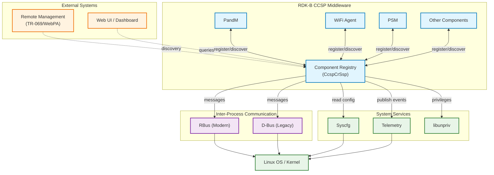
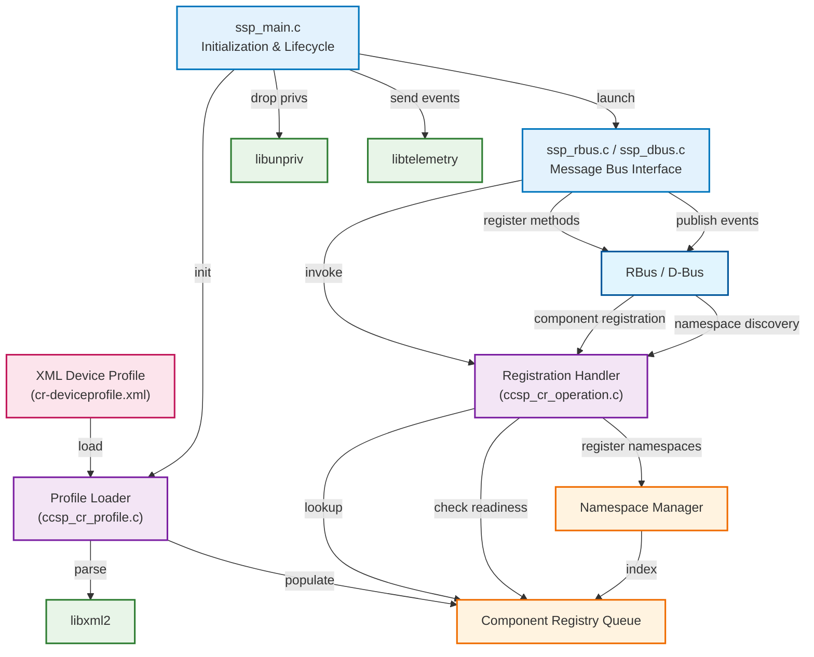
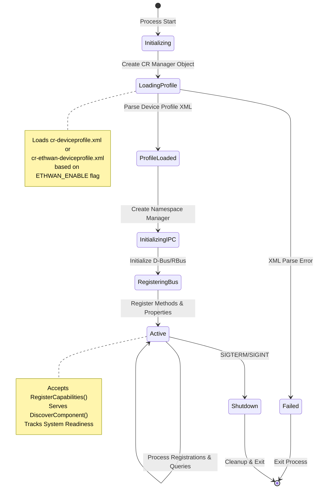
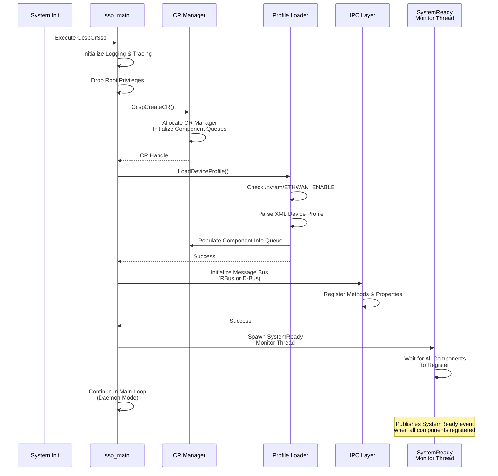
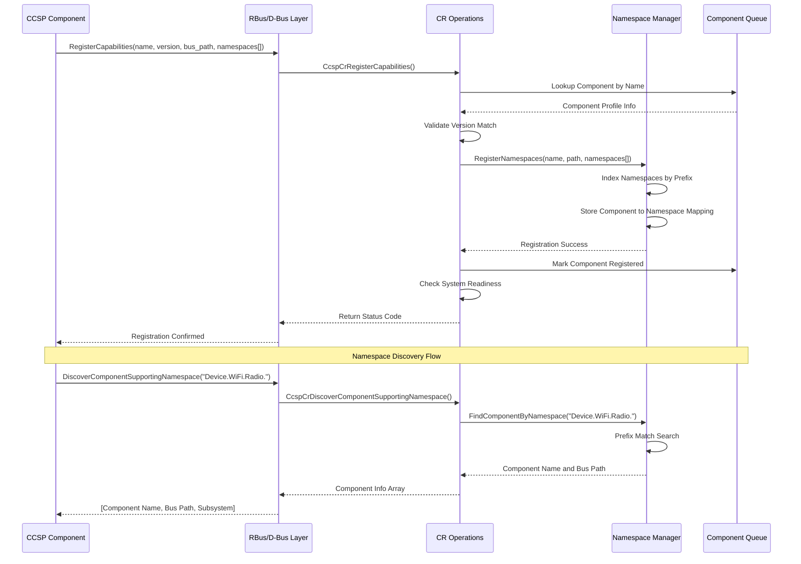
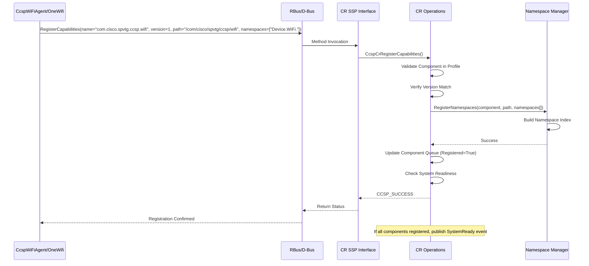
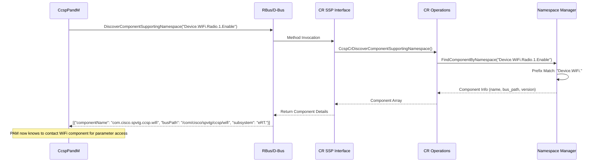
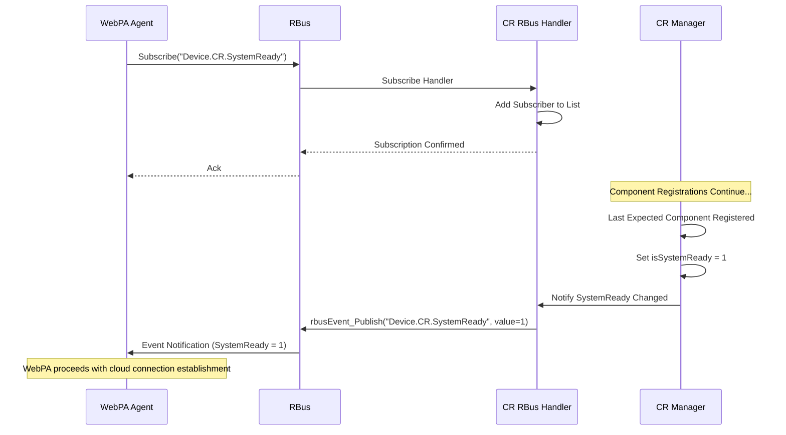

# Component Registry (CcspCr)

Component Registry (CR) is a core RDK-B middleware component that serves as the central registration and discovery service for all CCSP components in the system. The Component Registry maintains a comprehensive database of all registered components, their supported namespaces, capabilities, and communication endpoints, enabling dynamic service discovery and component interaction across the RDK-B middleware stack. CR acts as the primary authority for component lifecycle management, namespace resolution, and inter-component communication routing.

The Component Registry loads device profile XML configurations that define expected components and their capabilities, validates component registrations against these profiles, and provides query interfaces for namespace discovery and component lookup. CR supports both RBus and D-Bus messaging protocols, enabling flexible deployment configurations and migration paths between messaging infrastructures. The component exposes methods for capability registration, namespace discovery, data type validation, and system readiness monitoring that are consumed by all other RDK-B middleware components.

Component Registry enables the CCSP middleware architecture by decoupling components from direct dependencies and providing runtime service binding through namespace-based discovery. This architectural pattern supports modular component development, flexible deployment configurations, and dynamic system composition without compile-time component dependencies.

**Key Features & Responsibilities**: 

- **Component Registration Management**: Accepts and validates component capability registrations including namespace ownership, RBus/D-Bus endpoints, and version information against device profile configurations
- **Namespace Discovery Service**: Provides lookup services to discover which components support specific data model namespaces and dynamic table instances for inter-component parameter access
- **Device Profile Loading**: Parses and validates XML device profile configurations that define expected component topology, dependencies, and namespace allocations for the platform
- **Data Type Validation**: Verifies data model parameter types against registered namespace schemas to ensure type consistency across component boundaries
- **System Readiness Coordination**: Tracks component registration status and dependency fulfillment to determine overall system readiness state for upper-layer services
- **Session Management**: Manages registration sessions with priority handling and session ID allocation for transactional component registration operations
- **Dual IPC Support**: Supports both RBus and D-Bus messaging protocols through conditional compilation enabling flexible deployment configurations and migration strategies

## Design

Component Registry implements a centralized registration and discovery architecture that serves as the authoritative source for component topology and namespace ownership information in the RDK-B middleware stack. The design prioritizes runtime flexibility, allowing components to dynamically register capabilities while maintaining schema validation against pre-configured device profiles. The architecture separates profile management from runtime registration tracking, enabling static validation rules while supporting dynamic component lifecycle management.

The CR component initializes by loading XML device profile configurations from the filesystem that enumerate expected components, their versions, and namespace ownership patterns. During runtime, components invoke registration APIs providing their RBus/D-Bus endpoints, version information, and supported namespace arrays which CR validates against profile expectations. The namespace manager sub-component maintains indexed data structures for efficient namespace prefix matching and component lookup operations that service discovery requests from other middleware components. Registration state is maintained in memory queues tracking known components, unknown registrations, and remote CR instances in multi-subsystem deployments.

The northbound interface exposes component registration, namespace discovery, and data type validation APIs through both RBus and D-Bus protocols depending on build configuration. RBus support enables modern deployments with improved performance and reduced complexity while D-Bus support provides backward compatibility with legacy CCSP deployments. The southbound interface reads device profile XML files from the filesystem and integrates with syscfg for configuration data and telemetry services for event reporting. Component Registry does not persist registration state to non-volatile storage; instead, all components must re-register on each system initialization, ensuring registration state reflects current runtime topology.

### Prerequisites and Dependencies

**Build-Time Flags and Configuration:**

| Configure Option | DISTRO Feature | Build Flag | Purpose | Default |
|------------------|----------------|------------|---------|---------|
| `--with-rbus-build=none` | N/A | N/A | Build without RBus support (D-Bus only) | N/A |
| `--with-rbus-build=only` | N/A | `RBUS_MAIN_ENABLED` | Build RBus-only variant (no D-Bus support) | N/A |
| `--with-rbus-build=integrated` | N/A | N/A | Build with both D-Bus and RBus support enabled | `integrated` |
| `--enable-notify` | `systemd` | `ENABLE_SD_NOTIFY` | Enable systemd readiness notification via sd_notify() | Disabled |
| `--enable-gtestapp` | N/A | `GTEST_ENABLE` | Enable Google Test unit test suite | Disabled |
| N/A | `rdkb_wan_manager` | N/A | Apply WAN Manager ready event patch | Conditional |
| N/A | `no_mta_support` | N/A | Remove MTA component registration from device profiles | Conditional |

**RDK-B Platform and Integration Requirements:**

- **Build Dependencies**: `ccsp-common-library`, `dbus`, `telemetry`, `utopia`, `libunpriv`, `rbus` (conditionally), `libxml2`, `syscfg`, `utapi`, `utctx`, `ulog`, `cjson`, `msgpackc`
- **RDK-B Components**: All CCSP middleware components depend on CR for registration; CR does not depend on other middleware components except during registration operations
- **Systemd Services**: CR should start early in the RDK-B middleware stack before components that depend on registration services; systemd notify support is available via `--enable-notify` configure option
- **Message Bus**: Registers on RBus or D-Bus depending on build configuration at namespace `com.cisco.spvtg.ccsp.CR`; provides registration and discovery methods
- **Configuration Files**: 
  - `/usr/ccsp/cr-deviceprofile.xml` - Standard device profile defining expected component topology
  - `/usr/ccsp/cr-ethwan-deviceprofile.xml` - Ethernet WAN device profile used when `/nvram/ETHWAN_ENABLE` exists
- **Startup Order**: CR must initialize and load device profiles before other CCSP components attempt registration; no hard dependencies on other middleware components at startup

**Threading Model:** 

Component Registry uses a multi-threaded request processing model with dedicated threads for system readiness monitoring and message bus interactions.

- **Threading Architecture**: Multi-threaded with asynchronous message processing
  - **D-Bus variant**: Uses CCSP message bus framework with internal threading via `DslhCreateCpeController::Engage()`; spawns `waitingForSystemReadyTask` as separate task
  - **RBus variant**: Explicitly spawns threads for waiting on system ready (`waitForSystemReady`) and monitoring component dependencies (`pollingComponentReady`)
- **Main Thread**: Supervises component lifecycle and yields to IPC message processing threads
- **Synchronization**: Uses mutex locks (`pthread_mutex_t`) and condition variables (`pthread_cond_t`) for thread-safe access to component registry and system readiness state; synchronization mechanisms protect shared data structures during concurrent registration and discovery operations

### Component State Flow

**Initialization to Active State**

Component Registry follows a sequential initialization flow establishing foundational services before entering active registration and discovery mode. The component must successfully load device profile configurations defining expected component topology before accepting registration requests from other middleware components.

**Runtime State Changes and Context Switching**

Component Registry maintains minimal runtime state changes after entering active mode. The primary state tracked is system readiness which transitions from not-ready to ready when all expected components from the device profile have successfully registered.

**State Change Triggers:**

- Component registration completion transitions system readiness state when all profile-defined components have registered capabilities
- Configuration file reload (via SIGUSR2 signal) triggers data model XML export without interrupting registration services
- Component unregistration or loss triggers removal from namespace manager and component queues

**Context Switching Scenarios:**

- Device profile context switches between standard and Ethernet WAN profiles based on `/nvram/ETHWAN_ENABLE` file presence at startup
- IPC context varies between RBus and D-Bus processing depending on `--with-rbus-build` configuration

### Call Flow

**Initialization Call Flow:**

**Request Processing Call Flow:**

## Internal Modules

Component Registry is organized into distinct modules separating platform integration concerns, core registration logic, and data management responsibilities. Each module encapsulates specific functionality while maintaining clear interfaces for inter-module communication and data sharing.

| Module/Class | Description | Key Files |
|-------------|------------|-----------|
| **SSP Main** | Process entry point and lifecycle management handling initialization, signal processing, privilege dropping, and message bus setup | `ssp_main.c`, `ssp_global.h` |
| **SSP RBus Interface** | RBus IPC integration supporting method handlers for registration and system readiness properties over RBus protocol | `ssp_rbus.c` |
| **SSP D-Bus Interface** | D-Bus IPC integration providing component interface implementation for registration and discovery methods over D-Bus | `ssp_dbus.c`, `ssp_cmd.c` |
| **CR Manager** | Core component instance providing registration, discovery, and session management APIs with component queue management | `ccsp_cr_base.c` |
| **CR Operations** | External API implementation for capability registration, namespace discovery, data type validation, and component unregistration | `ccsp_cr_operation.c` |
| **Profile Loader** | XML device profile parser loading expected component definitions, namespace allocations, and remote CR configurations | `ccsp_cr_profile.c` |
| **Session Manager** | Transaction management for registration sessions with priority handling and session ID allocation for batch operations | `ccsp_cr_session.c` |
| **CR Utility** | Helper functions for component lookup, queue management, and common operations supporting core registration logic | `ccsp_cr_utility.c` |
| **Data Model Export** | Dynamic data model XML generation for Motive-compliant export functionality triggered by SIGUSR2 signal | `ccsp_cr_exportDM.c` |

## Component Interactions

Component Registry serves as the central hub for all CCSP middleware interactions enabling component discovery and namespace resolution. CR interacts with every CCSP component during initialization registration and provides ongoing discovery services for inter-component communication routing.

### Interaction Matrix

| Target Component/Layer | Interaction Purpose | Key APIs/Endpoints |
|------------------------|-------------------|------------------|
| **RDK-B Middleware Components** |
| All CCSP Components | Component capability registration, namespace ownership declaration | `Device.CR.RegisterComponent()` (RBus), `com.cisco.spvtg.ccsp.CR.registerCapabilities()` (D-Bus) |
| All CCSP Components | Namespace-to-component discovery for inter-component parameter access | `com.cisco.spvtg.ccsp.CR.discoverComponentSupportingNamespace()` |
| All CCSP Components | System readiness monitoring and component lifecycle tracking | `Device.CR.SystemReady`, `eRT.com.cisco.spvtg.ccsp.CR.GetHealth()` |
| All CCSP Components | Component unregistration and namespace cleanup during shutdown | `com.cisco.spvtg.ccsp.CR.unregisterComponent()` |
| **System & Platform Services** |
| Syscfg | Read system configuration for initialization parameters | `syscfg_get()` via libsyscfg |
| Telemetry | Send component health and operational telemetry events | `t2_event_s()` via libtelemetry_msgsender |
| libunpriv | Drop root privileges after initialization and before message loop | `drop_root()` via libunpriv |
| libxml2 | Parse XML device profile configurations defining component topology | `xmlParseFile()`, `xmlDocGetRootElement()` |

**Events Published by Component Registry:**

| Event Name | Event Topic/Path | Trigger Condition | Subscriber Components |
|------------|-----------------|-------------------|---------------------|
| Component_Registration | `Device.CR.ComponentRegistered` | Component successfully registers capabilities | Dependent components waiting for specific component availability |
| System_Ready | `Device.CR.SystemReady` (property change) | All profile-defined components have registered | Upper-layer services (WebPA, TR-069) requiring full stack initialization |
| Component_Health | `eRT.com.cisco.spvtg.ccsp.CR.GetHealth()` | Health query invoked | Watchdog services, diagnostic tools |

### IPC Flow Patterns

**Primary IPC Flow - Component Registration:**

**Namespace Discovery Flow:**

**System Readiness Monitoring Flow:**

## Implementation Details

### Major HAL APIs Integration

Component Registry does not directly integrate with HAL APIs. CR operates entirely within the RDK-B middleware layer and interacts with other CCSP components through message bus protocols. The component reads configuration files from the filesystem and uses standard Linux system calls for file I/O operations.

### Key Implementation Logic

- **Device Profile Selection**: CR determines which device profile XML to load by checking for `/nvram/ETHWAN_ENABLE` file existence at startup; if present, loads `cr-ethwan-deviceprofile.xml`, otherwise loads `cr-deviceprofile.xml`
  - Files: `ccsp_cr_profile.c` - `CcspCrLoadDeviceProfile()` function
  
- **Component Version Validation**: Registration requests validate component version against device profile expectations; mismatched versions result in registration rejection with `CCSP_CR_ERR_UNKNOWN_COMPONENT` error
  - Files: `ccsp_cr_operation.c` - `CcspCrRegisterCapabilities()` version check logic
  
- **Namespace Prefix Matching**: Discovery operations use longest-prefix matching algorithm to find owning component for namespace queries
  - Files: Namespace Manager from ccsp-common-library - invoked by `CcspCrDiscoverComponentSupportingNamespace()` in `ccsp_cr_operation.c`
  
- **System Readiness Determination**: CR tracks registered components against expected profile components; system is ready when all profile-defined components have successfully registered capabilities
  - Files: `ccsp_cr_base.c` - `CcspCrIsSystemReady()` function checking component queue registration status

- **IPC Protocol Abstraction**: Build system conditionally compiles RBus or D-Bus interface layers based on `--with-rbus-build` configure option; core CR logic remains protocol-agnostic
  - Files: `Makefile.am` - conditional compilation based on `RBUS_BUILD_ONLY` and `RBUS_BUILD_INTEGRATED` flags
  
- **Error Handling Strategy**: Registration failures log warnings but component operation continues; unknown component registrations are accepted and tracked in separate queue for diagnostic purposes
  - Files: `ccsp_cr_operation.c` - registration validates against profile but does not reject unknown components
  
- **Logging & Debugging**: Both RBus and D-Bus variants use RDK Logger via RDK_LOG macros when `DISABLE_RDK_LOGGER` is not defined; falls back to rtLog functions when RDK Logger is disabled. Also uses CCSP trace macros (AnscTrace) for general trace output.
  - Files: `ssp_main.c`, `ssp_rbus.c`, `ssp_dbus.c`; RDK Logger initialized in main via `RDK_LOGGER_INIT()` when `FEATURE_SUPPORT_RDKLOG` is defined

### Key Configuration Files

Component Registry relies on XML device profile configurations that define expected component topology and namespace allocations for the platform.

| Configuration File | Purpose | Override Mechanisms |
|--------------------|---------|---------------------|
| `/usr/ccsp/cr-deviceprofile.xml` | Standard device profile defining expected CCSP component registrations and namespace allocations | Selected by default; overridden by Ethernet WAN profile if `/nvram/ETHWAN_ENABLE` exists |
| `/usr/ccsp/cr-ethwan-deviceprofile.xml` | Ethernet WAN device profile with modified component topology for Ethernet WAN configurations | Automatically selected when `/nvram/ETHWAN_ENABLE` file is present |
