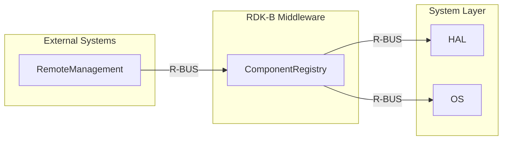
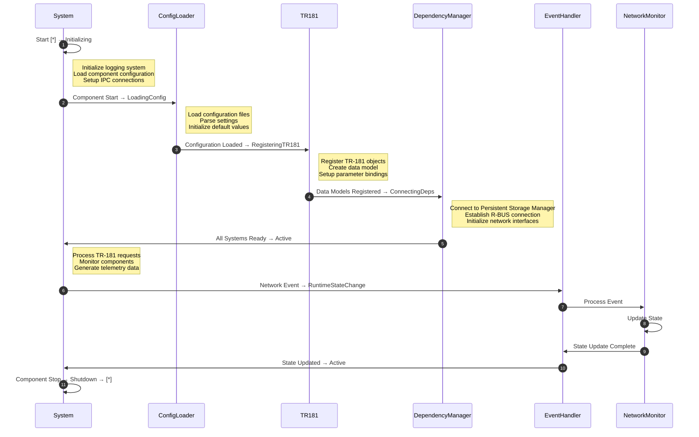
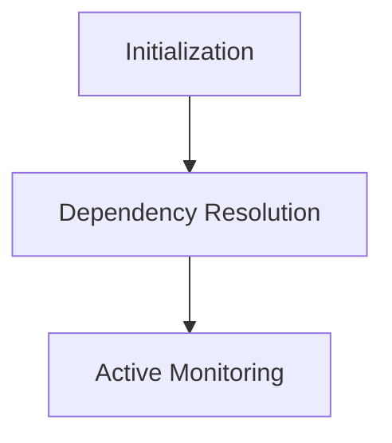

# Component Registry Documentation

## Overview

The Component Registry (CR) is a RDK-B middleware component responsible for managing the registration, discovery, and interaction of various software components within the RDK-B stack. It ensures that components can register their capabilities, discover other components, and interact seamlessly using standardized interfaces. The CR acts as a centralized hub for component metadata and facilitates inter-component communication.

## Key Features & Responsibilities

- **Component Registration**: Allows components to register their capabilities, namespaces, and dependencies.
- **Component Discovery**: Provides mechanisms for components to discover other registered components and their capabilities.
- **Inter-Component Communication**: Facilitates communication between components using standardized protocols and interfaces.
- **Dependency Management**: Manages dependencies between components, ensuring that dependent components are ready before initiating operations.
- **Health Monitoring**: Monitors the health and readiness of registered components.

## Design

The Component Registry follows a modular design with the following key principles:

- **Centralized Metadata Management**: All component metadata is stored and managed centrally, ensuring consistency and ease of access.
- **Event-Driven Architecture**: The CR uses an event-driven approach to handle component registration, updates, and discovery.
- **Scalability**: Designed to handle a large number of components with minimal performance overhead.
- **Extensibility**: New components and capabilities can be added without requiring changes to the core CR logic.

### Simplified System Context Diagram



### Component State Flow

**Initialization to Active State**

The Component Registry follows a structured initialization sequence ensuring all dependencies are properly established before entering active monitoring mode. The component performs configuration loading, TR-181 parameter registration, network interface discovery, and external service connections in a predetermined order to guarantee system stability and data consistency.



## Prerequisites and Dependencies

### Build-Time Flags

| Configure Option   | Distro Feature    | Build Flag          | Purpose                                    | Default  |
| ------------------ | ----------------- | ------------------- | ------------------------------------------ | -------- |
| `--enable-gtest`   | `gtest_support`   | `GTEST_ENABLE_FLAG` | Enables Google Test support for unit tests | Disabled |
| `--enable-rbus`    | `rbus_support`    | `RBUS_BUILD_ONLY`   | Enables R-BUS-specific build configuration | Enabled  |
| `--enable-systemd` | `systemd_support` | `SYSTEMD_CFLAGS`    | Enables SystemD integration                | Enabled  |

### Dependencies

- **Libraries**: pthread, R-BUS
- **Tools**: Autotools, GCC

## Threading Model

The Component Registry employs a robust threading model to ensure concurrency and responsiveness. Key threading mechanisms include:

- **Mutexes and Condition Variables**: Used to synchronize access to shared resources and manage component readiness states.
- **Dedicated Threads**: Separate threads for monitoring component dependencies and handling asynchronous events.
- **Error Handling**: Thread attributes are configured to detect and handle errors, ensuring system stability.

### Implementation Details

- Mutexes (`pthread_mutex_t`) and condition variables (`pthread_cond_t`) are initialized with specific attributes to ensure error checking and monotonic clock synchronization.
- Dedicated threads, such as `monitorTID`, are used for monitoring component dependencies and are safely terminated using `pthread_cancel`.

## Component State Flow / Initialization

The lifecycle of the Component Registry includes the following stages:

1. **Initialization**:
   - Configuration loading from XML profiles.
   - TR-181 parameter registration.
   - Network interface discovery.
2. **Dependency Resolution**:
   - Components register their dependencies, which are monitored using dedicated threads.
   - Dependencies are resolved before transitioning to the active state.
3. **Active Monitoring**:
   - Continuous health checks and readiness monitoring of registered components.
   - Event-driven updates to the component registry.

### Lifecycle Diagram



## Detailed Integration Requirements

The Component Registry has specific integration requirements to ensure seamless operation within the RDK-B platform:

- **Dependencies**:
  - Requires `rtMessage`, `rbus-core`, `rbus`, and `libxml2` to be built and installed.
  - XML profiles define component-specific dependencies and configurations.
- **Build Configuration**:
  - Custom build flags and environment variables must be set, such as `CFLAGS` and `LDFLAGS`.
  - Example build command:
    ```bash
    ../configure --prefix=$MY_PREFIX --with-rbus-build=only CFLAGS="-DDISABLE_RDK_LOGGER -I$MY_PREFIX/include" LDFLAGS="-L$MY_PREFIX/lib"
    ```

## Conclusion

The Component Registry is a cornerstone of the RDK-B middleware, providing essential services for component registration, discovery, and communication. Its robust threading model, structured lifecycle, and well-defined integration requirements ensure reliability and scalability. By adhering to the outlined design principles and operational guidelines, the Component Registry facilitates seamless inter-component interactions, contributing to the overall stability and performance of the RDK-B platform.
