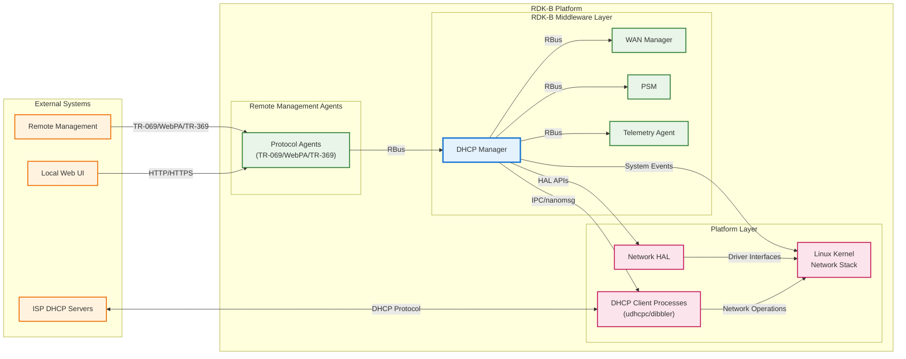
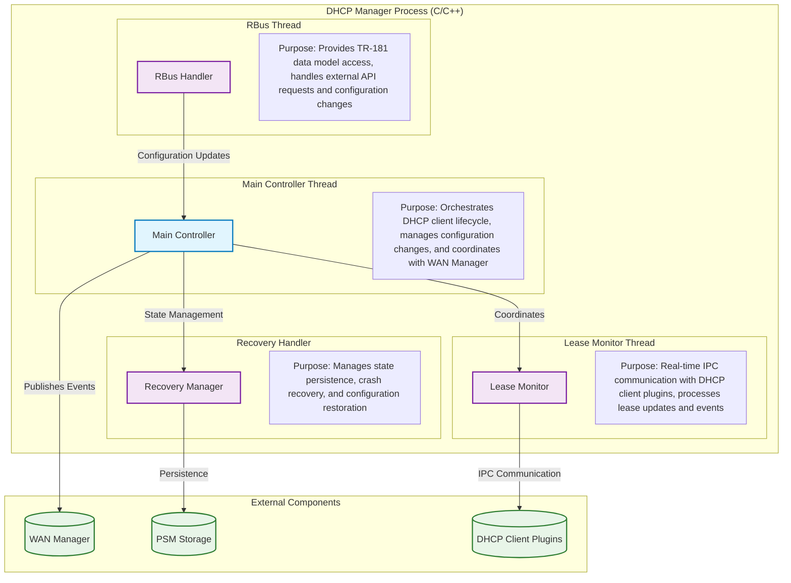
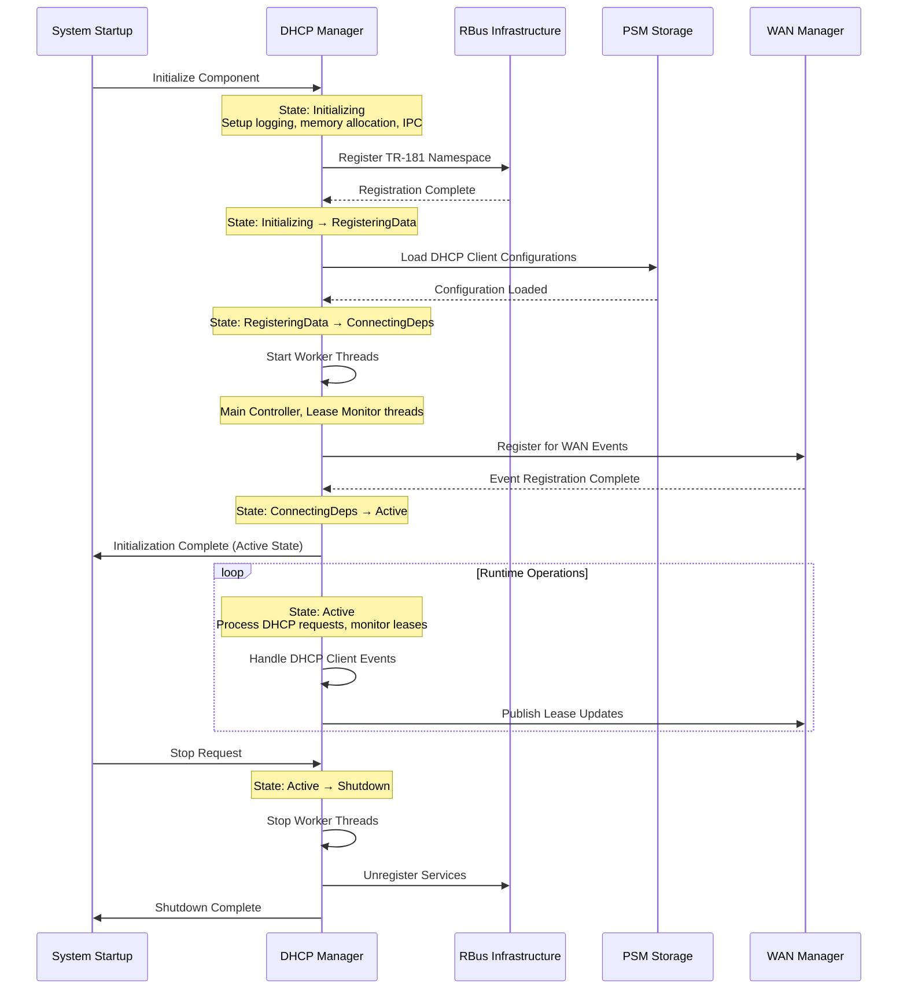
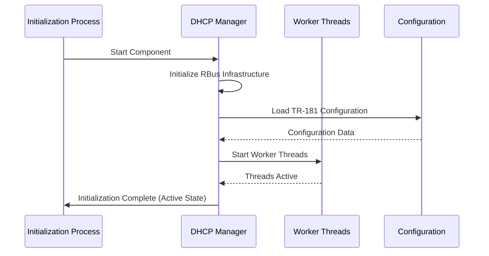
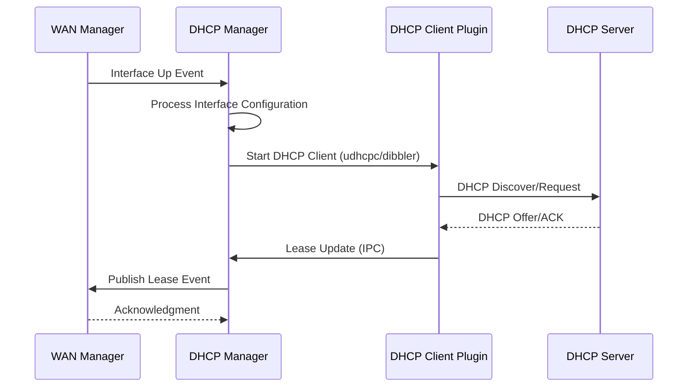
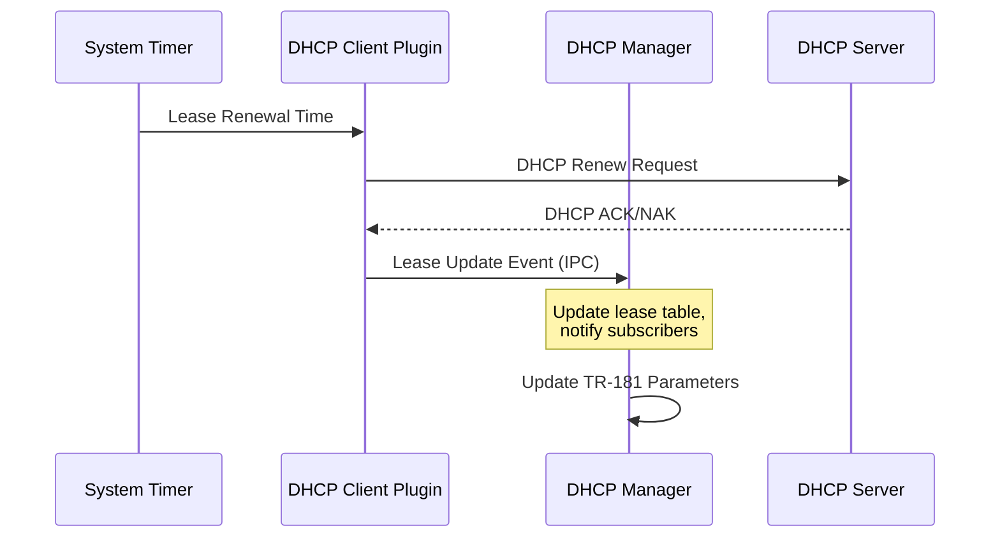

# DHCP Manager Documentation

The DHCP Manager is a comprehensive component of the RDK-B (Reference Design Kit for Broadband) framework that provides centralized management and orchestration of DHCP operations for both IPv4 and IPv6 protocols. This component serves as the primary controller for DHCP client configurations, lease monitoring, and dynamic IP address management across WAN interfaces. It ensures efficient IPv4/IPv6 coexistence, seamless network transitions, and robust recovery mechanisms in RDK-B networking environments.




**Key Features & Responsibilities**: 

- **Dual Protocol Support**: Comprehensive management of both DHCPv4 and DHCPv6 clients with unified configuration interface
- **Centralized DHCP Orchestration**: Single point of control for all DHCP client operations across multiple WAN interfaces with dynamic client lifecycle management
- **Real-time Lease Monitoring**: IPC-based system for receiving, processing, and distributing lease updates from DHCP client plugins to WAN Manager and other subscribers
- **TR-181 Data Model Integration**: Full compliance with TR-181 DHCP specifications providing standardized management interface for remote configuration and monitoring
- **Recovery and Persistence**: Automatic recovery of DHCP client states, lease information, and configuration after system restarts with crash-resistant state management
- **Custom DHCP Options Support**: Extensive support for vendor-specific and custom DHCP options including option 125, user class identifiers, and MAP-T transition technology
- **Event-driven Architecture**: Publishes lease events and state changes to WAN Manager, which orchestrates reactive system responses to network state changes, interface events, and lease lifecycle transitions with minimal latency

## Design

The DHCP Manager follows a modular, event-driven architecture designed to provide centralized control over DHCP operations while maintaining loose coupling with other RDK-B components. The core design principle centers on separation of concerns, where the main controller orchestrates DHCP client lifecycle management, while specialized modules handle lease monitoring, recovery operations, and custom option processing. This architecture ensures scalability, maintainability, and robust error handling across diverse network scenarios.

The system employs a multi-threaded design with dedicated threads for different operational aspects: the main controller thread manages client configurations and state transitions, the lease monitor thread handles real-time IPC communication with DHCP client plugins (udhcpc and dibbler), and the RBus thread provides TR-181 data model access for external management. This threading model ensures that critical operations like lease renewals and state updates are not blocked by configuration changes or external API calls.

Northbound interactions are managed through the TR-181 data model interface via RBus, enabling remote management systems and local web interfaces to configure DHCP clients, retrieve status information, and monitor lease states. The component publishes lease events and status changes to subscribing components, particularly WAN Manager, ensuring coordinated network state management across the entire RDK-B stack.

Southbound interactions include direct communication with HAL layers for network interface control, file system operations for configuration persistence, and IPC communication with DHCP client processes. The design abstracts the complexity of different DHCP client implementations (udhcpc for IPv4, dibbler for IPv6) through a unified plugin architecture, allowing for easy extension and platform-specific optimizations.

Data persistence and storage management is achieved through integration with PSM (Persistent Storage Manager) for TR-181 parameter storage, local file system for DHCP client configuration files, and in-memory structures for runtime state management. The recovery handler module ensures that all persistent state is regularly synchronized and can be restored after unexpected shutdowns or component crashes.




### Prerequisites and Dependencies

**Build-Time Flags and Configuration:**

| Configure Option | DISTRO Feature | Build Flag | Purpose | Default |
|------------------|----------------|------------|---------|---------|
| `--enable-maptsupport` | `nat46` / `feature_mapt` / `unified_mapt` | `FEATURE_SUPPORT_MAPT_NAT46` | Enable MAP-T (Mapping of Address and Port with Translation) support for IPv4/IPv6 transition technology | Disabled |
| `--enable-notify` | `systemd` | `ENABLE_SD_NOTIFY` | Enable systemd notify support for service status reporting and lifecycle management | Required |
| `--enable-dropearly` | N/A | `DROP_ROOT_EARLY` | Enable early privilege dropping for enhanced security and reduced attack surface | Disabled |
| `--enable-dhcp_server_support` | N/A | `DHCP_SERVER_SUPPORT` | Enable DHCP server functionality for LAN-side IP address assignment | Disabled (recipe sets to no) |
| `--enable-dhcp_client_support` | N/A | `DHCP_CLIENT_SUPPORT` | Enable DHCP client functionality for WAN-side IP address acquisition | Enabled (recipe sets to yes) |
| `--enable-dhcpv4_server_support` | N/A | `DHCPV4_SERVER_SUPPORT` | Enable DHCPv4 server support for IPv4 address management | Disabled (recipe sets to no) |
| `--enable-dhcpv6_server_support` | N/A | `DHCPV6_SERVER_SUPPORT` | Enable DHCPv6 server support for IPv6 address and prefix delegation | Disabled (recipe sets to no) |
| `--enable-dhcpv4_client_support` | N/A | `DHCPV4_CLIENT_SUPPORT` | Enable DHCPv4 client support for IPv4 DHCP operations via udhcpc plugin | Enabled (recipe sets to yes) |
| `--enable-dhcpv6_client_support` | N/A | `DHCPV6_CLIENT_SUPPORT` | Enable DHCPv6 client support for IPv6 DHCP operations via dibbler plugin | Enabled (recipe sets to yes) |
| `--enable-bci_support` | `bci` | `BCI_SUPPORT` | Enable Box Cloud Initiative support for telemetry reporting and cloud integration | Conditional on DISTRO feature |
| `--with-ccsp-platform` | N/A | `CCSP_PLATFORM` | Specify CCSP platform type (intel_usg, pc, bcm) for platform-specific optimizations | bcm (recipe sets) |
| `--with-ccsp-arch` | N/A | `CCSP_ARCH` | Specify CCSP CPU architecture (arm, atom, pc, mips) for target-specific builds | arm (recipe sets) |

**RDK-B Platform and Integration Requirements:**

* **RDK-B Components**: `CcspPandM`, `CcspPsm`, `CcspCommonLibrary`, `CcspLMLite`, `WanManager`
* **HAL Dependencies**: Network HAL interfaces (hal-dhcpv4c, hal-ethsw, hal-moca, hal-wifi) for interface management and DHCP operations
* **Systemd Services**: `CcspCrSsp.service`, `CcspPsmSsp.service`, `gwprovapp.service` must be active before `CcspDHCPMgr.service` starts
* **Message Bus**: RBus registration under TR-181 namespace `Device.DHCPv4.Client.{i}.*` and `Device.DHCPv6.Client.{i}.*` for parameter management
* **TR-181 Data Model**: Full TR-181 Issue 2 Amendment 15 DHCP objects and parameters support with MAP-T extensions when enabled
* **Configuration Files**: `/usr/ccsp/dhcpmgr/TR181-DHCPMgr.XML` for data model definition; systemd unit files for service management
* **Startup Order**: Initialize after Component Registry, PSM services, and network interfaces are active; before WAN Manager final configuration

<br>

**Threading Model:** 

The DHCP Manager implements a sophisticated multi-threaded architecture using POSIX pthreads for concurrent DHCP operations while maintaining system responsiveness and data consistency. The component creates multiple worker threads to handle different aspects of DHCP client management, lease monitoring, and recovery operations.

| Thread & Function | Purpose | Cycle/Timeout | Synchronization |
|-------------------|---------|----------------|------------------|
| **Main Thread**<br>`ssp_main()` / `main()` | Component initialization, RBus registration, TR-181 parameter handling, message loop processing | Event-driven message loop with RBus callbacks and SSP lifecycle management | RBus async callbacks, pthread mutexes for shared data structures, TR-181 parameter access control |
| **Main Controller Thread**<br>`DhcpMgr_MainController()` | DHCP client lifecycle management, configuration processing, WAN Manager coordination, client process control | Continuous monitoring loop with configurable intervals for client state management | pthread_create() in `DhcpMgr_StartMainController()`, pthread_detach() for autonomous operation, mutex synchronization for lease tables |
| **Lease Monitor Thread**<br>`DhcpMgr_LeaseMonitor_Thrd()` | Real-time IPC communication with DHCP client plugins, lease event processing, status updates via nanomsg | Continuous IPC message processing with blocking receive operations on `tcp://127.0.0.1:50324` | pthread_create() in `DhcpMgr_LeaseMonitor_Start()`, pthread_detach() for autonomous operation, nanomsg NN_PULL socket for IPC |
| **PID Monitor Thread**<br>`dhcp_pid_mon()` | DHCP client process monitoring, crash detection and recovery operations for udhcpc/dibbler processes | Continuous process monitoring with periodic PID file validation and process status checks | pthread_create() in `DhcpMgr_Dhcp_Recovery_Start()`, pthread_detach() for autonomous operation, file-based PID monitoring |
| **IFL Framework Threads**<br>`IFL_Thread()` worker functions | Generic event handling and IPC communication framework supporting sysevent processing and task queuing | Configurable thread lifecycle with joinable/detached modes based on thread properties | pthread_attr_setdetachstate(), mutex/spinlock coordination via IFL framework, task queue management |

### Component State Flow

**Initialization to Active State**

The DHCP Manager follows a structured initialization sequence that ensures all dependencies are satisfied and the system is ready for DHCP operations before transitioning to active state.



**Runtime State Changes and Context Switching**

The DHCP Manager undergoes several runtime state changes based on network conditions, interface status, and configuration updates that impact its operational context.

**State Change Triggers:**

- **Interface State Changes**: WAN interface up/down events trigger DHCP client start/stop operations
- **Configuration Updates**: TR-181 parameter changes trigger client reconfiguration and restart cycles
- **Lease Events**: DHCP lease acquire/renew/expire events cause lease table updates and WAN Manager notifications
- **Recovery Operations**: Crash detection or configuration corruption triggers state restoration from persistent storage

**Context Switching Scenarios:**

- **Active to Maintenance Mode**: Triggered by critical configuration changes requiring client restart
- **IPv4/IPv6 Protocol Switching**: Dynamic switching between single-stack and dual-stack operations based on provider support
- **Interface Failover**: DHCP Manager maintains client configurations across interface transitions while WAN Manager controls failover decisions and seamless migration between primary and backup WAN interfaces

### Call Flow

**Initialization Call Flow:**



**DHCP Client Request Processing Call Flow:**



**Lease Renewal Call Flow:**



## TR‑181 Data Models

### Supported TR-181 Parameters

The DHCP Manager implements comprehensive TR-181 DHCP data models supporting both DHCPv4 and DHCPv6 client configurations with full BBF compliance for parameter definitions, access methods, and validation rules.

### Object Hierarchy

```
Device.
├── DHCPv4.
│   ├── ClientNumberOfEntries (unsignedInt, R)
│   └── Client.{i}.
│       ├── Enable (boolean, R/W)
│       ├── Status (string, R)
│       ├── Interface (string, R/W)
│       ├── Alias (string, R/W)
│       ├── DHCPStatus (string, R)
│       ├── IPAddress (string, R)
│       ├── SubnetMask (string, R)
│       ├── IPRouters (string, R)
│       ├── DNSServers (string, R)
│       ├── LeaseTimeRemaining (int, R)
│       ├── RenewTime (dateTime, R)
│       ├── RebindTime (dateTime, R)
│       ├── SentOptionNumberOfEntries (unsignedInt, R)
│       ├── ReqOptionNumberOfEntries (unsignedInt, R)
│       ├── SentOption.{i}.
│       │   ├── Enable (boolean, R/W)
│       │   ├── Tag (unsignedInt, R/W)
│       │   └── Value (hexBinary, R/W)
│       └── ReqOption.{i}.
│           ├── Enable (boolean, R/W)
│           ├── Order (unsignedInt, R/W)
│           └── Tag (unsignedInt, R/W)
└── DHCPv6.
    ├── ClientNumberOfEntries (unsignedInt, R)
    └── Client.{i}.
        ├── Enable (boolean, R/W)
        ├── Status (string, R)
        ├── Interface (string, R/W)
        ├── Alias (string, R/W)
        ├── DUID (hexBinary, R)
        ├── RequestAddresses (boolean, R/W)
        ├── RequestPrefixes (boolean, R/W)
        ├── RapidCommit (boolean, R/W)
        ├── SentOptionNumberOfEntries (unsignedInt, R)
        ├── ReceivedOptionNumberOfEntries (unsignedInt, R)
        ├── SentOption.{i}.
        │   ├── Enable (boolean, R/W)
        │   ├── Tag (unsignedInt, R/W)
        │   └── Value (hexBinary, R/W)
        └── ReceivedOption.{i}.
            ├── Tag (unsignedInt, R)
            ├── Value (hexBinary, R)
            └── Server (string, R)
```

### Parameter Definitions

**Core DHCPv4 Parameters:**

| Parameter Path | Data Type | Access | Default Value | Description | BBF Compliance |
|----------------|-----------|--------|---------------|-------------|----------------|
| `Device.DHCPv4.ClientNumberOfEntries` | unsignedInt | R | `0` | The number of entries in the DHCPv4 Client table. Automatically managed by the system. | TR-181 Issue 2 |
| `Device.DHCPv4.Client.{i}.Enable` | boolean | R/W | `false` | Enables or disables the DHCPv4 client instance. When enabled, the client will attempt to obtain IP configuration from a DHCP server. | TR-181 Issue 2 |
| `Device.DHCPv4.Client.{i}.Status` | string | R | `"Disabled"` | Current operational status of the DHCPv4 client. Enumerated values: Disabled, Enabled, Error_Misconfigured, Error | TR-181 Issue 2 |
| `Device.DHCPv4.Client.{i}.Interface` | string | R/W | `""` | Reference to the IP interface on which the DHCP client will operate. Must be a valid Device.IP.Interface reference. | TR-181 Issue 2 |
| `Device.DHCPv4.Client.{i}.DHCPStatus` | string | R | `"Init"` | Current DHCP protocol state. Values: Init, Selecting, Requesting, Bound, Renewing, Rebinding, InitReboot, Rebooting | TR-181 Issue 2 |
| `Device.DHCPv4.Client.{i}.IPAddress` | string | R | `""` | Current IP address assigned by the DHCP server. Empty if no lease is active. Format: IPv4 dotted decimal notation. | TR-181 Issue 2 |
| `Device.DHCPv4.Client.{i}.SubnetMask` | string | R | `""` | Subnet mask assigned by the DHCP server. Format: IPv4 dotted decimal notation. | TR-181 Issue 2 |
| `Device.DHCPv4.Client.{i}.LeaseTimeRemaining` | int | R | `-1` | Number of seconds remaining in the current DHCP lease. -1 indicates infinite lease or no active lease. | TR-181 Issue 2 |

**Core DHCPv6 Parameters:**

| Parameter Path | Data Type | Access | Default Value | Description | BBF Compliance |
|----------------|-----------|--------|---------------|-------------|----------------|
| `Device.DHCPv6.ClientNumberOfEntries` | unsignedInt | R | `0` | The number of entries in the DHCPv6 Client table. Automatically managed by the system. | TR-181 Issue 2 |
| `Device.DHCPv6.Client.{i}.Enable` | boolean | R/W | `false` | Enables or disables the DHCPv6 client instance for address and/or prefix delegation. | TR-181 Issue 2 |
| `Device.DHCPv6.Client.{i}.Status` | string | R | `"Disabled"` | Current operational status of the DHCPv6 client. Values: Disabled, Enabled, Error_Misconfigured, Error | TR-181 Issue 2 |
| `Device.DHCPv6.Client.{i}.DUID` | hexBinary | R | `""` | DHCP Unique Identifier used by the client. Generated based on hardware address and timestamp. | TR-181 Issue 2 |
| `Device.DHCPv6.Client.{i}.RequestAddresses` | boolean | R/W | `true` | Enable Identity Association for Non-temporary Addresses (IA_NA) in DHCPv6 requests. | TR-181 Issue 2 |
| `Device.DHCPv6.Client.{i}.RequestPrefixes` | boolean | R/W | `false` | Enable Identity Association for Prefix Delegation (IA_PD) in DHCPv6 requests for prefix delegation. | TR-181 Issue 2 |

## Internal Modules

The DHCP Manager consists of several specialized modules that work together to provide comprehensive DHCP client management. Each module has specific responsibilities and interfaces for handling different aspects of DHCP operations.

| Module/Class | Description | Key Files |
|-------------|------------|-----------|
| **Main Controller** | Central orchestration module that manages DHCP client lifecycle, configuration changes, and coordination with other RDK-B components | `dhcpmgr_controller.c`, `dhcpmgr_controller.h` |
| **Lease Monitor** | Real-time IPC communication handler that receives lease updates from DHCP client plugins and processes lease state changes | `dhcp_lease_monitor_thrd.c`, `dhcp_lease_monitor_thrd.h` |
| **DHCPv4 Interface** | IPv4-specific DHCP client management including udhcpc plugin integration and IPv4 lease processing | `dhcpv4_interface.c`, `dhcpv4_interface.h` |
| **DHCPv6 Interface** | IPv6-specific DHCP client management including dibbler plugin integration and IPv6 address/prefix delegation | `dhcpv6_interface.c`, `dhcpv6_interface.h` |
| **Recovery Handler** | Persistence and crash recovery module that manages state restoration and configuration backup operations | `dhcpmgr_recovery_handler.c`, `dhcpmgr_recovery_handler.h` |
| **Custom Options** | Vendor-specific and custom DHCP option processing including option 125, user class identifiers, and MAP-T support | `dhcpmgr_custom_options.c`, `dhcpmgr_custom_options.h` |
| **SSP Interface** | System Service Provider interface for RBus integration and TR-181 data model implementation | `ssp_main.c`, `ssp_messagebus_interface.c` |

## Component Interactions

The DHCP Manager operates as a central coordinator in the RDK-B networking stack, maintaining active communication with multiple components to ensure seamless DHCP operations and network state management.

### Interaction Matrix

| Target Component/Layer | Interaction Purpose | Key APIs/Endpoints |
|------------------------|-------------------|------------------|
| **RDK-B Middleware Components** |
| WAN Manager | Lease event notifications, interface status coordination, network state synchronization | `RBus_PublishEvent`, `Device.X_RDK_WanManager.Interface.{i}.*` |
| PSM Component | Configuration persistence, TR-181 parameter storage, crash recovery data | `PSM_Set_Record_Value2`, `PSM_Get_Record_Value2` |
| Component Registry | Service registration, health monitoring, inter-component discovery | `CcspBaseIf_registerCapabilities`, `CcspBaseIf_discoverComponent` |
| **System & HAL Layers** |
| Network HAL | Interface status monitoring, network device control, IP configuration | `netHalGetIfStatus()`, `netHalSetIfAddress()` |
| File System | DHCP client configuration files, lease databases, log files | `/tmp/dhcp_*.conf`, `/tmp/udhcpc_*.pid`, `/var/log/dhcp.log` |
| DHCP Client Processes | Runtime control, lease monitoring, option configuration | IPC via nanomsg `tcp://127.0.0.1:50324` |

**Events Published by DHCP Manager:**

| Event Name | Event Topic/Path | Trigger Condition | Subscriber Components |
|------------|-----------------|-------------------|---------------------|
| DHCPv4_Lease_Obtained | `Device.DHCPv4.Client.{i}.DHCPStatus` | DHCPv4 lease successfully acquired | WAN Manager, Device Management |
| DHCPv6_Address_Assigned | `Device.DHCPv6.Client.{i}.Status` | DHCPv6 address assignment complete | WAN Manager, Routing Manager |
| DHCP_Client_Error | `Device.DHCPv4/v6.Client.{i}.Status` | DHCP client error or failure condition | System Health Monitor, WAN Manager |
| Lease_Renewal_Success | `Device.DHCP.Lease.Renewed` | DHCP lease successfully renewed | Telemetry, Network Analytics |

## Implementation Details

### Major HAL APIs Integration

The DHCP Manager integrates with several HAL APIs to manage network interfaces and monitor system state for effective DHCP operations.

**Core HAL APIs:**

| HAL API | Purpose | Implementation File |
|---------|---------|-------------------|
| `netHalGetIfStatus()` | Retrieve network interface operational status and capabilities | `dhcpmgr_controller.c` |
| `netHalSetIfAddress()` | Configure IP address settings on network interfaces | `dhcpv4_interface.c`, `dhcpv6_interface.c` |
| `netHalGetIfStats()` | Monitor interface statistics and error conditions | `dhcp_lease_monitor_thrd.c` |

### Key Implementation Logic

- **DHCP Client State Machine**: The core state management logic implements the complete DHCP client state machine with states (Init, Selecting, Requesting, Bound, Renewing, Rebinding) as defined in RFC 2131 for DHCPv4 and RFC 8415 for DHCPv6
     - Main state machine implementation in `dhcpmgr_controller.c` with comprehensive state transition validation
     - Protocol-specific state handlers in `dhcpv4_interface.c` and `dhcpv6_interface.c` for IPv4 and IPv6 operations
  
- **IPC Event Processing**: High-performance asynchronous event processing system handles lease updates, configuration changes, and error conditions with minimal latency
     - Nanomsg-based IPC implementation for real-time communication with DHCP client plugins
     - Event queue management with priority-based processing for critical lease events
     - Thread-safe event handling with mutex synchronization and atomic operations

- **Error Handling Strategy**: Comprehensive error detection, logging, and recovery mechanisms ensure system stability during network failures and configuration errors
     - Multi-level error categorization (fatal, recoverable, transient) with appropriate response strategies
     - Automatic retry mechanisms with exponential backoff for transient failures
     - Graceful degradation modes for partial functionality during system stress

- **Logging & Debugging**: Extensive logging framework with configurable verbosity levels and specialized debugging tools for troubleshooting DHCP operations
     - RDK logging integration with component-specific log categories and severity levels
     - Real-time lease monitoring with detailed protocol-level debugging capabilities
     - Performance metrics collection for lease acquisition times and renewal success rates

### Key Configuration Files

The DHCP Manager relies on several configuration files for proper operation, each serving specific purposes in the component's configuration management.

| Configuration File | Purpose | Override Mechanisms |
|--------------------|---------|--------------------|
| `/etc/ccsp/tr181-dhcpmgr.xml` | TR-181 data model definitions and parameter mappings | Environment variables, compile-time definitions |
| `/usr/ccsp/dhcpmgr/CcspDHCPMgr.cfg` | Component-specific configuration including logging levels and IPC settings | PSM parameter overrides, runtime configuration |
| `/tmp/dhcp_client_*.conf` | Dynamic DHCP client configuration files generated at runtime | TR-181 parameter values, custom option configurations |
| `/etc/systemd/system/CcspDHCPMgr.service` | Systemd service definition with dependencies and startup parameters | Systemd override files in `/etc/systemd/system/CcspDHCPMgr.service.d/` |

## Quick Start Guide

### Building the Component

DHCPManager is designed to be compiled and integrated with RDKB components. It is not a standalone binary.

To build DHCPManager as part of the RDKB build system:

1. **Ensure RDKB build environment is set up** - Verify that you have the complete RDKB build environment configured and operational
2. **Clone the DHCPManager repository** into the appropriate RDKB source directory
3. **Include DHCPManager Distro** (`dhcp_manager`) in your RDKB build configuration
4. **Run the RDKB build process** to compile DHCPManager along with other components:

```bash
# Build the entire DHCP Manager component
bitbake ccsp-dhcp-mgr
```

5. **Refer to the RDKB documentation** for detailed build and integration steps (From RC2.11.0a, the DHCPMANAGER APIs are supported in meta-rdk-wan)

### Basic Configuration

The component is configured through TR-181 Data Model entries:

- `Device.DHCPv4.Client.{i}.*` - DHCPv4 client configuration
- `Device.DHCPv6.Client.{i}.*` - DHCPv6 client configuration

### Key Runtime Interfaces

- **IPC Address**: `tcp://127.0.0.1:50324` (for lease monitoring)
- **Configuration Files**: Dynamic creation based on TR-181 settings
- **Log Output**: Standard RDK logging framework

## Directory Structure

The DHCP Manager follows a modular directory organization with clear separation between different functional components:

```
dhcp-manager/
├── README.md                           # Project overview and quick start
├── CHANGELOG.md                        # Version history and release notes
├── configure.ac                        # Autotools configuration
├── Makefile.am                        # Top-level build configuration
├── CONTRIBUTING.md                    # Contribution guidelines
├── LICENSE                            # License information
├── config/                            # System configuration files
│   ├── CcspDHCPMgr.path              # Systemd path unit
│   ├── CcspDHCPMgr.service           # Systemd service definition
│   ├── notify.sh                     # Event notification script
│   ├── TR181-DHCPMgr_bci.XML        # BCI TR-181 data model
│   └── TR181-DHCPMgr.XML            # Standard TR-181 data model
├── docs/                             # Comprehensive documentation
│   ├── README.md                     # Documentation overview
│   ├── configuration-guide.md        # PSM configuration guide
│   ├── architecture/                 # Architecture documentation
│   │   └── component-diagram.md     # System architecture diagrams
│   ├── components/                   # Component-specific docs
│   │   ├── lease-monitor.md         # Lease monitoring system
│   │   ├── main-controller.md       # Main controller logic
│   │   ├── lease-handlers.md        # DHCPv4/v6 lease processing
│   │   ├── recovery-handler.md      # Persistence and recovery
│   │   └── mapt-apis.md            # MAP-T implementation
│   └── Images/                       # Documentation images
└── source/                           # Source code
    ├── DHCPClientUtils/              # DHCP client utilities
    │   ├── DHCPv4Client/            # DHCPv4 client implementation
    │   │   ├── dhcp_client_common.c
    │   │   ├── dhcpv4_interface.c
    │   │   ├── dhcpv4_interface.h
    │   │   └── dhcpmgr_udhcpc_plugin/
    │   └── DHCPv6Client/            # DHCPv6 client implementation
    │       ├── dhcpv6_interface.c
    │       ├── dhcpv6_interface.h
    │       └── dhcpmgr_dibbler_plugin/
    ├── DHCPMgrInterface/            # IPC and threading framework
    │   ├── ifl_queue_impl.c
    │   ├── ifl_thread.c
    │   └── ifl.c
    ├── DHCPMgrSsp/                  # RBus and SSP integration
    │   ├── ssp_main.c
    │   ├── ssp_action.c
    │   └── ssp_messagebus_interface.c
    ├── DHCPMgrUtils/                # Core DHCP manager utilities
    │   ├── dhcpmgr_controller.c     # Main controller
    │   ├── dhcp_lease_monitor_thrd.c # Lease monitor
    │   ├── dhcpmgr_v4_lease_handler.c # DHCPv4 handler
    │   ├── dhcpmgr_v6_lease_handler.c # DHCPv6 handler
    │   ├── dhcpmgr_recovery_handler.c # Recovery manager
    │   ├── dhcpmgr_map_apis.c       # MAP-T support
    │   └── CustomOptions/           # Custom DHCP options
    │       ├── dhcpmgr_custom_options.c
    │       └── dhcpmgr_custom_options.h
    ├── DHCPServerUtils/             # DHCP server utilities
    │   ├── DHCPv4Server/            # DHCPv4 server implementation
    │   ├── DHCPv6Server/            # DHCPv6 server implementation
    │   └── utils/                   # Server utilities
    ├── IPv6rtmon/                   # IPv6 route monitoring
    │   ├── ipv6rtmon.c
    │   └── ipv6rtmon.h
    └── TR-181/                      # TR-181 data model layer
        ├── board_sbapi/             # Board-specific APIs
        ├── include/                 # TR-181 headers
        └── middle_layer_src/        # TR-181 implementation
```

## DHCP Client Configuration Guide

### Configuration Architecture

The DHCP Client Manager configuration follows a hierarchical PSM structure:

```
dmsb.dhcpmanager
├── ClientNoOfEntries                    # Number of DHCPv4 clients
├── Client.{i}                          # DHCPv4 client instances
│   ├── Alias                           # Client alias/name
│   ├── ReqOptionNoOfEntries            # Number of requested options
│   ├── ReqOption.{i}                   # Requested DHCP options
│   ├── SendOptionNoOfEntries           # Number of sent options
│   └── SendOption.{i}                  # Sent DHCP options
└── dhcpv6
    ├── ClientNoOfEntries               # Number of DHCPv6 clients
    └── Client.{i}                      # DHCPv6 client instances
        ├── Alias                       # Client alias/name
        ├── ReqAddr                     # Request IPv6 address (IANA)
        ├── ReqPrefix                   # Request prefix delegation (IAPD)
        ├── RequestedOptions            # Comma-separated option list
        ├── SentOptNoOfEntries          # Number of sent options
        └── SentOption.{i}              # Sent DHCPv6 options
```

### DHCPv4 Client Configuration

#### Basic Client Setup

```xml
<!-- Number of DHCPv4 clients -->
<Record name="dmsb.dhcpmanager.ClientNoOfEntries" type="astr">2</Record>

<!-- Client 1: Cable Modem WAN -->
<Record name="dmsb.dhcpmanager.Client.1.Alias" type="astr">CABLE_WAN</Record>

<!-- Client 2: Ethernet WAN -->
<Record name="dmsb.dhcpmanager.Client.2.Alias" type="astr">ETHERNET_WAN</Record>
```

#### Requested Options Configuration

DHCPv4 clients can request specific options from the DHCP server:

```xml
<!-- Client 1 Requested Options -->
<Record name="dmsb.dhcpmanager.Client.1.ReqOptionNoOfEntries" type="astr">4</Record>
<Record name="dmsb.dhcpmanager.Client.1.ReqOption.1.Tag" type="astr">1</Record>   <!-- Subnet Mask -->
<Record name="dmsb.dhcpmanager.Client.1.ReqOption.1.Order" type="astr">1</Record>
<Record name="dmsb.dhcpmanager.Client.1.ReqOption.2.Tag" type="astr">3</Record>   <!-- Router -->
<Record name="dmsb.dhcpmanager.Client.1.ReqOption.2.Order" type="astr">2</Record>
<Record name="dmsb.dhcpmanager.Client.1.ReqOption.3.Tag" type="astr">6</Record>   <!-- DNS Server -->
<Record name="dmsb.dhcpmanager.Client.1.ReqOption.3.Order" type="astr">3</Record>
<Record name="dmsb.dhcpmanager.Client.1.ReqOption.4.Tag" type="astr">42</Record>  <!-- NTP Server -->
<Record name="dmsb.dhcpmanager.Client.1.ReqOption.4.Order" type="astr">4</Record>
```

#### Common DHCPv4 Options

| Option | Description | Use Case |
|--------|-------------|----------|
| 1 | Subnet Mask | Network configuration |
| 3 | Router | Default gateway |
| 6 | DNS Server | Name resolution |
| 15 | Domain Name | DNS domain |
| 42 | NTP Server | Time synchronization |
| 43 | Vendor Specific | Custom vendor data |
| 60 | Vendor Class ID | Client identification |
| 125 | Vendor-Identifying Vendor Class | Enhanced vendor info |

#### Sent Options Configuration

```xml
<!-- Client 1 Sent Options -->
<Record name="dmsb.dhcpmanager.Client.1.SendOptionNoOfEntries" type="astr">3</Record>

<!-- Option 60: Vendor Class Identifier -->
<Record name="dmsb.dhcpmanager.Client.1.SendOption.1.Tag" type="astr">60</Record>
<Record name="dmsb.dhcpmanager.Client.1.SendOption.1.Value" type="astr">4D79564E444F52313233</Record>

<!-- Option 43: Vendor Specific Information -->
<Record name="dmsb.dhcpmanager.Client.1.SendOption.2.Tag" type="astr">43</Record>
<Record name="dmsb.dhcpmanager.Client.1.SendOption.2.Value" type="astr">010C4D6F64656D5365726E756D</Record>

<!-- Option 61: Client Identifier -->
<Record name="dmsb.dhcpmanager.Client.1.SendOption.3.Tag" type="astr">61</Record>
<Record name="dmsb.dhcpmanager.Client.1.SendOption.3.Value" type="astr">0014220165498132</Record>
```

### DHCPv6 Client Configuration

#### Basic DHCPv6 Setup

```xml
<!-- Number of DHCPv6 clients -->
<Record name="dmsb.dhcpmanager.dhcpv6.ClientNoOfEntries" type="astr">2</Record>

<!-- Client 1: Cable WAN with address request -->
<Record name="dmsb.dhcpmanager.dhcpv6.Client.1.Alias" type="astr">CABLE_IPV6</Record>
<Record name="dmsb.dhcpmanager.dhcpv6.Client.1.ReqAddr" type="astr">TRUE</Record>
<Record name="dmsb.dhcpmanager.dhcpv6.Client.1.ReqPrefix" type="astr">FALSE</Record>
<Record name="dmsb.dhcpmanager.dhcpv6.Client.1.RequestedOptions" type="astr">23,24,39</Record>
```

#### Common DHCPv6 Options

| Option | Description | Use Case |
|--------|-------------|----------|
| 16 | Vendor Class | Client identification |
| 17 | Vendor Specific | Custom vendor data |
| 21 | SIP Server Domain | VoIP configuration |
| 23 | DNS Server | Name resolution |
| 24 | Domain Search | DNS search domains |
| 25 | Identity Association PD | Prefix delegation |
| 39 | Client FQDN | Fully qualified domain name |
| 95 | S46 MAP-T Container | IPv4-over-IPv6 transition |

#### DHCPv6 Sent Options

```xml
<!-- DHCPv6 Client 1 Sent Options -->
<Record name="dmsb.dhcpmanager.dhcpv6.Client.1.SentOptNoOfEntries" type="astr">4</Record>

<!-- Option 16: Vendor Class -->
<Record name="dmsb.dhcpmanager.dhcpv6.Client.1.SentOption.1.Alias" type="astr">vendor-class</Record>
<Record name="dmsb.dhcpmanager.dhcpv6.Client.1.SentOption.1.Tag" type="astr">16</Record>
<Record name="dmsb.dhcpmanager.dhcpv6.Client.1.SentOption.1.Value" type="astr">0000118b000C526F757465725F563200</Record>

<!-- Option 17: Vendor Specific Information -->
<Record name="dmsb.dhcpmanager.dhcpv6.Client.1.SentOption.2.Alias" type="astr">vendor-info</Record>
<Record name="dmsb.dhcpmanager.dhcpv6.Client.1.SentOption.2.Tag" type="astr">17</Record>
<Record name="dmsb.dhcpmanager.dhcpv6.Client.1.SentOption.2.Value" type="astr">0000118b0001000800260027000000010002000C526F757465725F563231</Record>

<!-- Option 25: Identity Association for Prefix Delegation -->
<Record name="dmsb.dhcpmanager.dhcpv6.Client.1.SentOption.3.Alias" type="astr">ia-pd</Record>
<Record name="dmsb.dhcpmanager.dhcpv6.Client.1.SentOption.3.Tag" type="astr">25</Record>
<Record name="dmsb.dhcpmanager.dhcpv6.Client.1.SentOption.3.Value" type="astr">000000010000000000000000</Record>

<!-- Option 39: Client FQDN -->
<Record name="dmsb.dhcpmanager.dhcpv6.Client.1.SentOption.4.Alias" type="astr">client-fqdn</Record>
<Record name="dmsb.dhcpmanager.dhcpv6.Client.1.SentOption.4.Tag" type="astr">39</Record>
<Record name="dmsb.dhcpmanager.dhcpv6.Client.1.SentOption.4.Value" type="astr">0007726F7574657207657861E1706C6503636F6D00</Record>
```

### Custom Options and API Integration

#### Hex String Encoding

All option values are encoded as hexadecimal strings:

```
"Router2.0" → 526F75746572322E30
"VENDOR123" → 56454E444F52313233
```

#### Custom API Integration

The DHCP Manager supports custom option APIs for dynamic value generation:

**Weak Implementation** - Default implementations that can be overridden:

```c
// Weak implementation - can be overridden
__attribute__((weak)) 
int dhcpv4_get_vendor_class_id(char *buffer, size_t buflen) {
    // Default implementation
    return -1;
}

__attribute__((weak))
int dhcpv6_get_vendor_specific_info(char *buffer, size_t buflen) {
    // Default implementation  
    return -1;
}
```

**Strong Implementation** - Link with a library providing strong implementations:

```c
// Strong implementation in external library
int dhcpv4_get_vendor_class_id(char *buffer, size_t buflen) {
    // Custom implementation for option 60
    snprintf(buffer, buflen, "MyDevice_v1.0_%s", get_device_serial());
    return 0;
}

int dhcpv6_get_vendor_specific_info(char *buffer, size_t buflen) {
    // Custom implementation for option 17
    build_vendor_info_tlv(buffer, buflen);
    return 0;
}
```

**Custom Option Behavior:**
- **With PSM Value**: If a PSM value is configured, it takes precedence
- **Without PSM Value**: Custom API is called to generate the value
- **API Failure**: Option is omitted from DHCP request/response

### WAN Manager Integration

#### Interface Binding

Link DHCP clients to WAN Manager interfaces:

```xml
<!-- WAN Interface 1: Cable Modem -->
<Record name="dmsb.wanmanager.if.1.VirtualInterface.1.IP.DHCPV4Interface" type="astr">Device.DHCPv4.Client.1</Record>
<Record name="dmsb.wanmanager.if.1.VirtualInterface.1.IP.DHCPV6Interface" type="astr">Device.DHCPv6.Client.1</Record>

<!-- WAN Interface 2: Ethernet -->
<Record name="dmsb.wanmanager.if.2.VirtualInterface.1.IP.DHCPV4Interface" type="astr">Device.DHCPv4.Client.2</Record>
<Record name="dmsb.wanmanager.if.2.VirtualInterface.1.IP.DHCPV6Interface" type="astr">Device.DHCPv6.Client.2</Record>
```

#### Interface Configuration Flow

1. **WAN Manager** reads DHCP interface bindings from PSM
2. **DHCP Manager** receives interface enable/disable events
3. **Client Selection** based on interface type and configuration
4. **Option Processing** using PSM configuration
5. **Lease Processing** and interface configuration
6. **Status Reporting** back to WAN Manager

## Configuration Examples

### Cable Modem Configuration

```xml
<!-- Cable Modem DHCP Configuration -->
<Record name="dmsb.dhcpmanager.ClientNoOfEntries" type="astr">1</Record>
<Record name="dmsb.dhcpmanager.Client.1.Alias" type="astr">CABLE_MODEM</Record>

<!-- Request cable-specific options -->
<Record name="dmsb.dhcpmanager.Client.1.ReqOptionNoOfEntries" type="astr">5</Record>
<Record name="dmsb.dhcpmanager.Client.1.ReqOption.1.Tag" type="astr">1</Record>   <!-- Subnet Mask -->
<Record name="dmsb.dhcpmanager.Client.1.ReqOption.1.Order" type="astr">1</Record>
<Record name="dmsb.dhcpmanager.Client.1.ReqOption.2.Tag" type="astr">3</Record>   <!-- Router -->
<Record name="dmsb.dhcpmanager.Client.1.ReqOption.2.Order" type="astr">2</Record>
<Record name="dmsb.dhcpmanager.Client.1.ReqOption.3.Tag" type="astr">6</Record>   <!-- DNS -->
<Record name="dmsb.dhcpmanager.Client.1.ReqOption.3.Order" type="astr">3</Record>
<Record name="dmsb.dhcpmanager.Client.1.ReqOption.4.Tag" type="astr">7</Record>   <!-- Log Server -->
<Record name="dmsb.dhcpmanager.Client.1.ReqOption.4.Order" type="astr">4</Record>
<Record name="dmsb.dhcpmanager.Client.1.ReqOption.5.Tag" type="astr">42</Record>  <!-- Time Server -->
<Record name="dmsb.dhcpmanager.Client.1.ReqOption.5.Order" type="astr">5</Record>

<!-- Send cable modem identification -->
<Record name="dmsb.dhcpmanager.Client.1.SendOptionNoOfEntries" type="astr">2</Record>
<Record name="dmsb.dhcpmanager.Client.1.SendOption.1.Tag" type="astr">60</Record>
<Record name="dmsb.dhcpmanager.Client.1.SendOption.1.Value" type="astr">646F637369732D332E302D436162</Record>
<Record name="dmsb.dhcpmanager.Client.1.SendOption.2.Tag" type="astr">61</Record>
<Record name="dmsb.dhcpmanager.Client.1.SendOption.2.Value" type="astr">01AA00040000FF00</Record>

<!-- DHCPv6 Configuration -->
<Record name="dmsb.dhcpmanager.dhcpv6.ClientNoOfEntries" type="astr">1</Record>
<Record name="dmsb.dhcpmanager.dhcpv6.Client.1.Alias" type="astr">CABLE_IPV6</Record>
<Record name="dmsb.dhcpmanager.dhcpv6.Client.1.ReqAddr" type="astr">TRUE</Record>
<Record name="dmsb.dhcpmanager.dhcpv6.Client.1.ReqPrefix" type="astr">TRUE</Record>
<Record name="dmsb.dhcpmanager.dhcpv6.Client.1.RequestedOptions" type="astr">23,24</Record>
```

### Enterprise Router Configuration

```xml
<!-- Enterprise DHCP Configuration -->
<Record name="dmsb.dhcpmanager.ClientNoOfEntries" type="astr">1</Record>
<Record name="dmsb.dhcpmanager.Client.1.Alias" type="astr">ENTERPRISE</Record>

<!-- Enterprise-specific options -->
<Record name="dmsb.dhcpmanager.Client.1.ReqOptionNoOfEntries" type="astr">7</Record>
<Record name="dmsb.dhcpmanager.Client.1.ReqOption.1.Tag" type="astr">1</Record>    <!-- Subnet Mask -->
<Record name="dmsb.dhcpmanager.Client.1.ReqOption.1.Order" type="astr">1</Record>
<Record name="dmsb.dhcpmanager.Client.1.ReqOption.2.Tag" type="astr">3</Record>    <!-- Router -->
<Record name="dmsb.dhcpmanager.Client.1.ReqOption.2.Order" type="astr">2</Record>
<Record name="dmsb.dhcpmanager.Client.1.ReqOption.3.Tag" type="astr">6</Record>    <!-- DNS -->
<Record name="dmsb.dhcpmanager.Client.1.ReqOption.3.Order" type="astr">3</Record>
<Record name="dmsb.dhcpmanager.Client.1.ReqOption.4.Tag" type="astr">15</Record>   <!-- Domain -->
<Record name="dmsb.dhcpmanager.Client.1.ReqOption.4.Order" type="astr">4</Record>
<Record name="dmsb.dhcpmanager.Client.1.ReqOption.5.Tag" type="astr">119</Record>  <!-- Domain Search -->
<Record name="dmsb.dhcpmanager.Client.1.ReqOption.5.Order" type="astr">5</Record>
<Record name="dmsb.dhcpmanager.Client.1.ReqOption.6.Tag" type="astr">121</Record>  <!-- Classless Route -->
<Record name="dmsb.dhcpmanager.Client.1.ReqOption.6.Order" type="astr">6</Record>
<Record name="dmsb.dhcpmanager.Client.1.ReqOption.7.Tag" type="astr">249</Record>  <!-- Private/Classless Static Route -->
<Record name="dmsb.dhcpmanager.Client.1.ReqOption.7.Order" type="astr">7</Record>

<!-- Enterprise identification -->
<Record name="dmsb.dhcpmanager.Client.1.SendOptionNoOfEntries" type="astr">3</Record>
<Record name="dmsb.dhcpmanager.Client.1.SendOption.1.Tag" type="astr">60</Record>
<Record name="dmsb.dhcpmanager.Client.1.SendOption.1.Value" type="astr">456E746572707269736552000000</Record>
<Record name="dmsb.dhcpmanager.Client.1.SendOption.2.Tag" type="astr">77</Record>  <!-- User Class -->
<Record name="dmsb.dhcpmanager.Client.1.SendOption.2.Value" type="astr">06526F75746572</Record>
<Record name="dmsb.dhcpmanager.Client.1.SendOption.3.Tag" type="astr">125</Record> <!-- Vendor-Identifying Vendor Class -->
<Record name="dmsb.dhcpmanager.Client.1.SendOption.3.Value" type="astr">0000118b01020304050607080910</Record>
```

## Core Component Details

### Main Controller

The Main Controller serves as the central orchestration engine for all DHCP client operations:

**Responsibilities:**
- Manages DHCP client lifecycle (start, stop, restart)
- Monitors interface status changes from WAN Manager
- Coordinates lease processing between DHCPv4 and DHCPv6 handlers
- Handles client startup/shutdown sequences
- Monitors client process health and performs recovery operations

**Key Functions:**
- `DhcpMgr_MainController()` - Main control loop processing interface events
- `DhcpMgr_StartMainController()` - Initialize and start the controller thread
- `DhcpMgr_ProcessInterfaceEvent()` - Handle WAN interface state changes

**Files:** `dhcpmgr_controller.c`, `dhcpmgr_controller.h`

### Lease Monitor

The Lease Monitor implements a high-performance IPC server for real-time lease updates:

**Responsibilities:**
- IPC server listening on `tcp://127.0.0.1:50324`
- Receives lease updates from DHCP client plugins
- Processes messages from udhcpc and dibbler plugins
- Routes lease information to appropriate handlers (DHCPv4/DHCPv6)
- Maintains connection state with multiple DHCP clients

**Key Functions:**
- `DhcpMgr_LeaseMonitor_Thrd()` - Main IPC message processing loop
- `DhcpMgr_LeaseMonitor_Start()` - Initialize nanomsg socket and start thread
- `DhcpMgr_ProcessLeaseMessage()` - Parse and route lease messages

**Files:** `dhcp_lease_monitor_thrd.c`, `dhcp_lease_monitor_thrd.h`

### Lease Handlers

Protocol-specific lease processing modules handle IPv4 and IPv6 lease operations:

**DHCPv4 Handler:**
- Processes IPv4 lease information from udhcpc
- Updates TR-181 `Device.DHCPv4.Client.{i}.*` parameters
- Configures network interfaces with IPv4 addresses
- Handles lease acquisition, renewal, and expiration

**DHCPv6 Handler:**
- Processes IPv6 lease information from dibbler
- Handles IANA (Identity Association for Non-temporary Addresses)
- Handles IAPD (Identity Association for Prefix Delegation)
- Updates TR-181 `Device.DHCPv6.Client.{i}.*` parameters
- Configures IPv6 addresses and delegated prefixes

**Files:** `dhcpmgr_v4_lease_handler.c`, `dhcpmgr_v6_lease_handler.c`

### Recovery Handler

The Recovery Handler ensures system resilience through persistence and crash recovery:

**Responsibilities:**
- Persists lease information to filesystem (`/tmp/`)
- Restores DHCP client states after process restart
- Monitors client process health via PID files
- Implements automatic restart for crashed clients
- Maintains configuration consistency across reboots

**Key Functions:**
- `DhcpMgr_Dhcp_Recovery_Start()` - Initialize recovery system
- `dhcp_pid_mon()` - Monitor client process health
- `DhcpMgr_RecoverLeaseInfo()` - Restore lease data from disk

**Files:** `dhcpmgr_recovery_handler.c`, `dhcpmgr_recovery_handler.h`

### Client Plugin Architecture

The DHCP Manager works with external DHCP clients through a plugin architecture:

**DHCPv4 (udhcpc):**
- **Config Creator**: Generates udhcpc-compatible configuration files
- **Plugin Binary**: `dhcpmgr_udhcpc_plugin` - executed on lease events by udhcpc
- **Communication**: Sends lease data via IPC socket to lease monitor
- **Events**: BOUND, RENEW, RELEASE, NAK, DECONFIG

**DHCPv6 (dibbler):**
- **Config Creator**: Generates dibbler-compatible configuration files
- **Plugin Binary**: `dhcpmgr_dibbler_plugin` - executed on lease events by dibbler
- **Communication**: Sends lease data via IPC socket to lease monitor
- **Events**: ADD, UPDATE, DELETE, EXPIRED

## Performance Considerations

### Optimization Strategies

- **Asynchronous Processing**: Non-blocking lease processing ensures timely event handling
- **Memory Management**: Efficient cleanup of lease structures prevents memory leaks
- **IPC Optimization**: Fast nanomsg-based message processing in lease monitor
- **Thread Safety**: Proper synchronization across components prevents race conditions
- **Event Batching**: Multiple events can be processed in batches to reduce overhead

### Resource Management

- **Thread Pool**: Dedicated threads for different operational aspects
- **Connection Pooling**: Persistent IPC connections reduce connection overhead
- **Buffer Management**: Pre-allocated buffers for lease data processing
- **File System Caching**: Minimal disk I/O through intelligent caching

## Troubleshooting

### Common Issues and Solutions

#### 1. DHCP Client Not Starting

**Symptoms:**
- No IP address assigned
- Interface status shows "Error"
- Client process not found

**Debugging Steps:**
```bash
# Check DHCP client configuration
dmcli eRT getv Device.DHCPv4.Client.1.Enable
dmcli eRT getv Device.DHCPv4.Client.1.Status

# Check interface binding
dmcli eRT getv Device.DHCPv4.Client.1.Interface

# Check WAN Manager configuration
dmcli eRT getv Device.X_RDK_WanManager.Interface.1.VirtualInterface.1.IP.DHCPV4Interface

# Verify client process
ps aux | grep -E 'udhcpc|dibbler'

# Check configuration files
ls -la /tmp/dhcp_*.conf
cat /tmp/udhcpc_*.conf
```

**Solutions:**
- Verify `Enable` parameter is set to `true`
- Check interface reference is valid
- Ensure WAN interface is up
- Review log files for error messages

#### 2. Lease Not Being Renewed

**Symptoms:**
- Lease expires and not renewed
- Connectivity lost periodically
- DHCPStatus stuck in "Renewing"

**Debugging Steps:**
```bash
# Check current lease status
dmcli eRT getv Device.DHCPv4.Client.1.DHCPStatus
dmcli eRT getv Device.DHCPv4.Client.1.LeaseTimeRemaining

# Check renewal times
dmcli eRT getv Device.DHCPv4.Client.1.RenewTime
dmcli eRT getv Device.DHCPv4.Client.1.RebindTime

# Monitor lease monitor thread
grep "LeaseMonitor" /rdklogs/logs/DHCPlog.txt

# Check IPC communication
netstat -an | grep 50324
```

**Solutions:**
- Verify DHCP server is responding
- Check network connectivity
- Restart DHCP Manager if IPC connection is broken
- Review server-side lease configuration

#### 3. Custom Options Not Sent

**Symptoms:**
- DHCP options missing in requests
- Server not receiving expected options
- Custom API not being called

**Debugging Steps:**
```bash
# Check sent option configuration
dmcli eRT getv Device.DHCPv4.Client.1.SentOption.

# Verify hex encoding
# Option value should be valid hexadecimal string

# Check custom API implementation
# Verify library with strong implementation is linked

# Enable debug logging
# Review DHCPlog.txt for option processing
```

**Solutions:**
- Verify PSM configuration is correct
- Validate hex string encoding (even number of digits)
- Check custom API return values
- Link appropriate custom option library

#### 4. IPC Communication Failure

**Symptoms:**
- Lease updates not received
- Status parameters not updating
- Lease monitor thread errors

**Debugging Steps:**
```bash
# Check IPC socket
netstat -an | grep 50324

# Verify lease monitor thread is running
ps aux | grep CcspDHCPMgr

# Check plugin execution
ls -la /usr/ccsp/dhcpmgr/dhcpmgr_udhcpc_plugin
ls -la /usr/ccsp/dhcpmgr/dhcpmgr_dibbler_plugin

# Monitor IPC messages
# Check logs for IPC errors
```

**Solutions:**
- Restart DHCP Manager service
- Verify plugin binaries are executable
- Check nanomsg library is installed
- Review firewall rules for localhost

#### 5. Configuration Not Persisting

**Symptoms:**
- Settings lost after reboot
- PSM parameters not saved
- Lease information not recovered

**Debugging Steps:**
```bash
# Check PSM service
systemctl status CcspPsmSsp.service

# Verify PSM database
ls -la /nvram/bbhm_cur_cfg.xml

# Check recovery handler
grep "Recovery" /rdklogs/logs/DHCPlog.txt

# Verify write permissions
ls -la /tmp/ | grep dhcp
```

**Solutions:**
- Ensure PSM service is running
- Check NVRAM is not full
- Verify recovery handler is active
- Review PSM access permissions

### Diagnostic Commands

```bash
# Complete DHCP client status
dmcli eRT getv Device.DHCPv4.Client.
dmcli eRT getv Device.DHCPv6.Client.

# WAN Manager bindings
dmcli eRT getv Device.X_RDK_WanManager.Interface.

# System logs
tail -f /rdklogs/logs/DHCPlog.txt
tail -f /rdklogs/logs/WanManager.txt

# Process status
ps aux | grep -E 'CcspDHCPMgr|udhcpc|dibbler'

# Network interface status
ip addr show
ip -6 addr show

# Active leases
cat /tmp/udhcpc.leases
cat /var/lib/dibbler/client-AddrMgr.xml
```

### Log Analysis

Key log patterns to search for:

```bash
# Initialization
grep "DHCPMgr.*Initializ" /rdklogs/logs/DHCPlog.txt

# Client start/stop
grep -E "Starting|Stopping" /rdklogs/logs/DHCPlog.txt

# Lease events
grep -E "BOUND|RENEW|RELEASE" /rdklogs/logs/DHCPlog.txt

# Errors
grep -E "ERROR|Failed" /rdklogs/logs/DHCPlog.txt

# IPC communication
grep "IPC" /rdklogs/logs/DHCPlog.txt
```

## Best Practices

### Configuration Management

1. **Option Management**
   - Use consistent hex encoding across all options
   - Implement proper error handling in custom APIs
   - Document custom option meanings and formats
   - Test option combinations thoroughly with actual DHCP servers

2. **Configuration Validation**
   - Validate PSM parameters before deployment
   - Test with actual DHCP servers in lab environment
   - Monitor lease acquisition success rates
   - Verify network connectivity post-configuration
   - Use staged rollout for production deployments

3. **Custom API Development**
   - Implement comprehensive error handling
   - Use appropriate buffer management (check buffer sizes)
   - Validate generated option data format
   - Provide fallback mechanisms for API failures
   - Document expected input/output formats

4. **Integration Testing**
   - Test WAN Manager integration thoroughly
   - Verify interface state transitions
   - Validate option processing with packet captures
   - Check lease renewal behavior over time
   - Test failover and recovery scenarios

### Development Guidelines

When modifying the DHCP Manager:

1. **Follow existing code patterns and style**
   - Maintain consistency with RDK-B coding standards
   - Use established naming conventions
   - Preserve existing module boundaries

2. **Update relevant documentation**
   - Update component documentation for API changes
   - Add configuration examples for new features
   - Document new TR-181 parameters

3. **Test with both IPv4 and IPv6 scenarios**
   - Validate dual-stack operation
   - Test single-stack configurations
   - Verify protocol-specific features

4. **Verify TR-181 compliance**
   - Ensure parameter names follow TR-181 standard
   - Validate data types and access permissions
   - Test with TR-069/WebPA management interfaces

5. **Test recovery scenarios**
   - Simulate process crashes
   - Test system reboot recovery
   - Verify lease persistence

## Contributing

Contributions are welcome! To contribute:

1. **Fork the repository** and create a feature or bugfix branch
2. **Make your changes** and ensure they are thoroughly tested
3. **Follow coding standards** used in the project
4. **Include relevant documentation** or test cases for your changes
5. **Submit a pull request** with a clear description of your changes

Please adhere to the RDK-B coding standards and include relevant documentation or test cases.

## References

### Standards and RFCs

- [TR-181 Data Model - Issue 2](https://www.broadband-forum.org/technical/download/TR-181.pdf) - Broadband Forum Device Data Model
- [RFC 2131 - DHCP](https://tools.ietf.org/html/rfc2131) - Dynamic Host Configuration Protocol
- [RFC 3315 - DHCPv6](https://tools.ietf.org/html/rfc3315) - Dynamic Host Configuration Protocol for IPv6 (replaced by RFC 8415)
- [RFC 8415 - DHCPv6](https://tools.ietf.org/html/rfc8415) - Dynamic Host Configuration Protocol for IPv6
- [RFC 7599 - MAP-T](https://tools.ietf.org/html/rfc7599) - Mapping of Address and Port with Translation (MAP-T)
- [RFC 2132 - DHCP Options](https://tools.ietf.org/html/rfc2132) - DHCP Options and BOOTP Vendor Extensions
- [RFC 3646 - DHCPv6 DNS Options](https://tools.ietf.org/html/rfc3646) - DNS Configuration options for DHCPv6

### RDK-B Documentation

- [RDK-B Documentation](https://wiki.rdkcentral.com/display/RDK/RDK-B) - RDK Broadband Platform
- [WAN Manager Documentation](https://wiki.rdkcentral.com/display/RDK/WAN+Manager) - WAN Manager Component
- [TR-181 Implementation Guide](https://wiki.rdkcentral.com/display/RDK/TR-181) - TR-181 in RDK-B

### External Tools

- [udhcpc](https://udhcp.busybox.net/) - Busybox DHCP client
- [dibbler](http://klub.com.pl/dhcpv6/) - DHCPv6 client and server
- [nanomsg](https://nanomsg.org/) - Socket library for IPC communication
