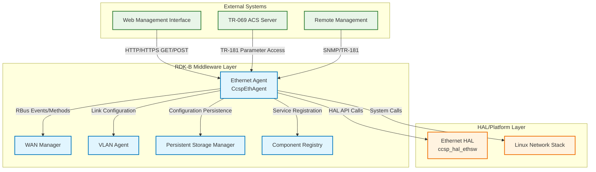
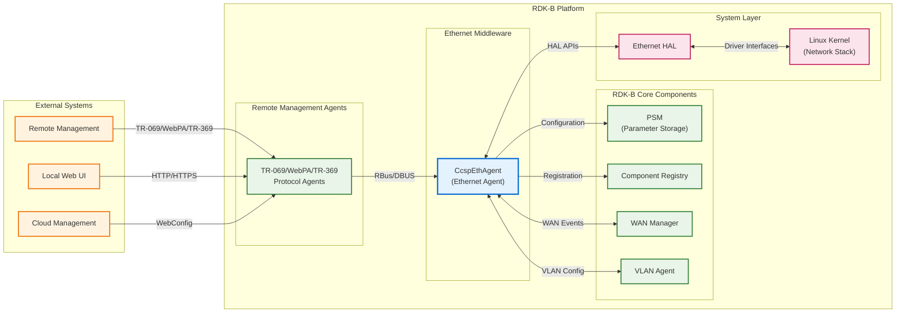
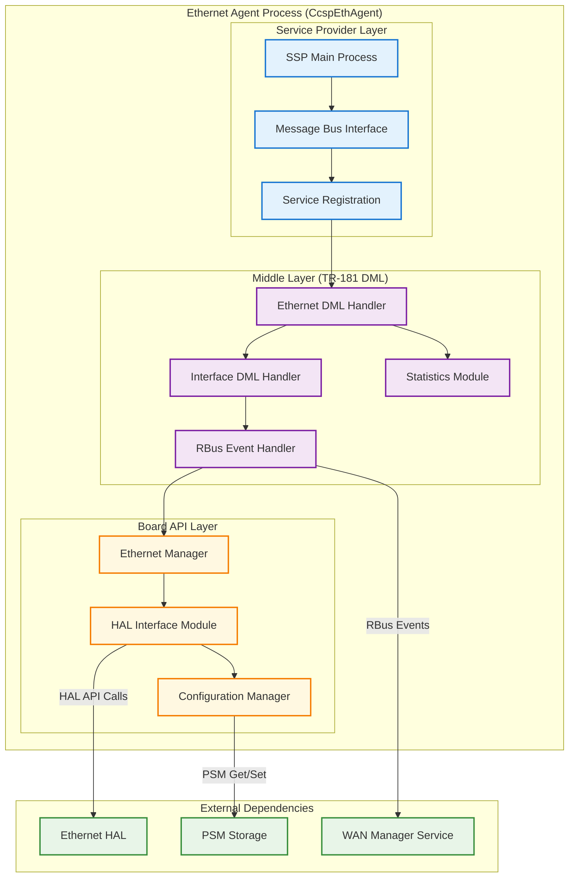
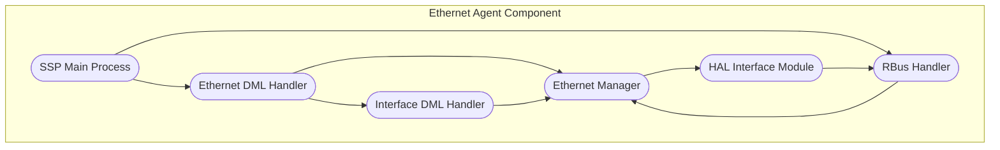
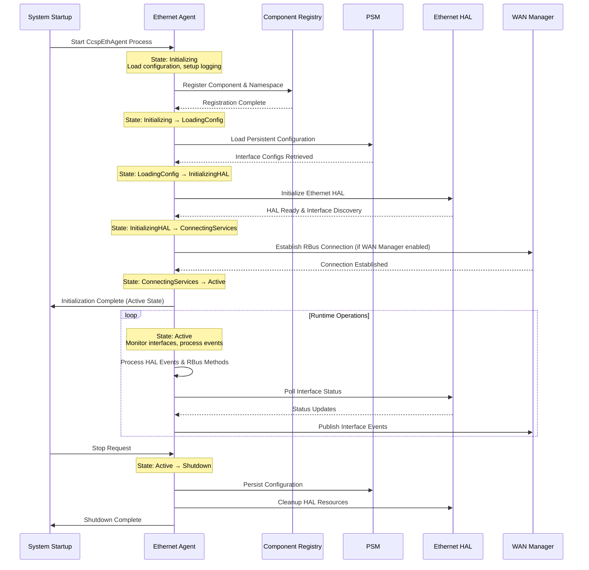
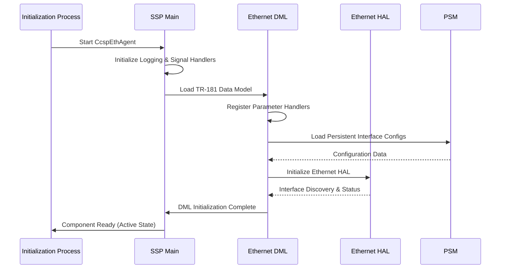
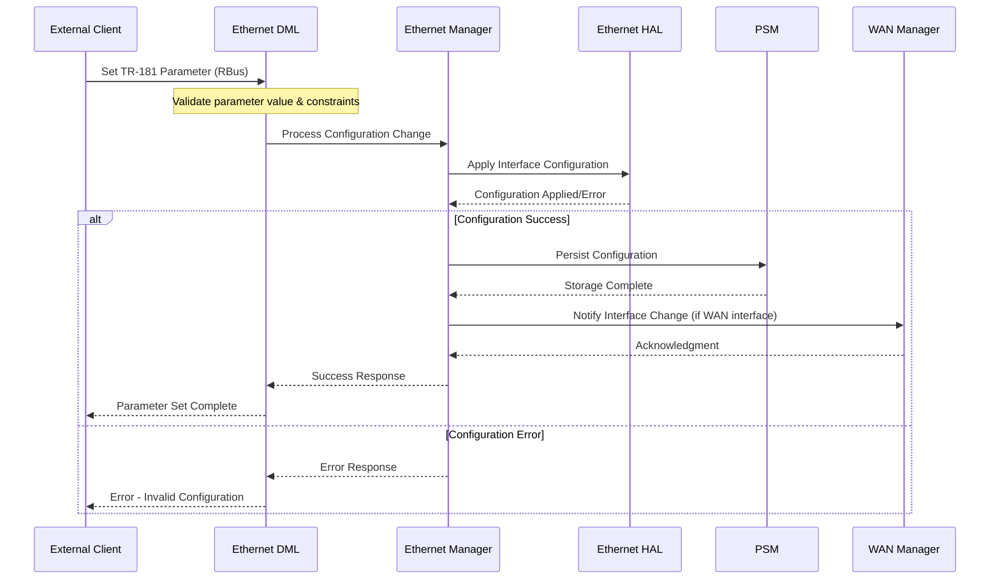
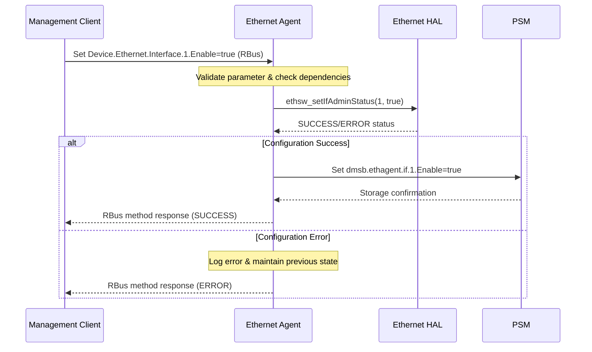
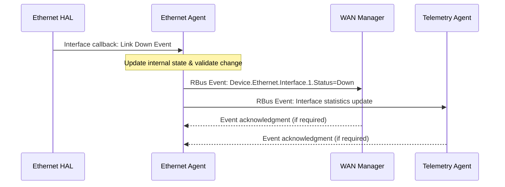

# Ethernet Agent Documentation

The Ethernet Agent is a critical RDK-B middleware component responsible for managing Ethernet interface configurations, monitoring interface status, and handling WAN failover operations in broadband gateway devices. This component provides comprehensive Ethernet interface management services including interface discovery, configuration management, status monitoring, and integration with WAN management subsystems.

The component serves as the primary interface between the RDK-B middleware stack and the underlying Ethernet hardware abstraction layer (HAL), enabling dynamic configuration of Ethernet interfaces for LAN and WAN operations. It supports advanced features like Ethernet WAN operation mode selection, interface bridging control, and real-time status monitoring with event-driven notifications.

The Ethernet Agent integrates seamlessly with other RDK-B components including the WAN Manager, VLAN Agent, and Component Registry, providing a unified interface for Ethernet interface management across different deployment scenarios. It supports both traditional WAN agent integration and modern WAN manager architectures based on compile-time feature flags.





**Key Features & Responsibilities**: 

- **Ethernet Interface Management**: Provides comprehensive management of Ethernet interfaces including discovery, configuration, and status monitoring for both LAN and WAN operations
- **TR-181 Data Model Support**: Implements Device.Ethernet object hierarchy with support for interface configuration, statistics collection, and WAN mode selection parameters
- **WAN Failover Integration**: Supports Ethernet WAN operation with automatic failover capabilities and integration with WAN Manager for multi-WAN scenarios  
- **Dynamic Interface Configuration**: Enables runtime configuration of Ethernet interface parameters including enable/disable, upstream designation, and bridge membership control
- **Real-time Status Monitoring**: Provides continuous monitoring of interface status with event-driven notifications for link state changes and operational mode transitions
- **HAL Abstraction Layer**: Abstracts underlying Ethernet hardware through standardized HAL interfaces enabling platform-independent operation across different hardware implementations

## Design

The Ethernet Agent employs a layered architecture design that separates interface abstraction, data model management, and platform integration concerns. The core design follows the RDK-B component pattern with a Service Provider (SSP) layer for process management, a middle layer for TR-181 data model implementation, and a board-specific abstraction layer for HAL integration. This design ensures maintainability while providing flexible deployment options across different hardware platforms.

The component's architecture supports multiple operational modes through compile-time feature flags, enabling integration with either traditional WAN Agent architecture (FEATURE_RDKB_WAN_AGENT) or modern WAN Manager systems (FEATURE_RDKB_WAN_MANAGER). The design emphasizes event-driven communication patterns with other middleware components, utilizing RBus for inter-component messaging and HAL callbacks for hardware event processing.

The data persistence strategy leverages the Persistent Storage Manager (PSM) for configuration storage while maintaining runtime state in memory for performance. The component implements a robust error handling and recovery mechanism with comprehensive logging for troubleshooting and system diagnostics. The threading model is primarily single-threaded with event-driven processing to ensure deterministic behavior and avoid race conditions in interface state management.





### Prerequisites and Dependencies

**Build-Time Flags and Configuration:**

| Configure Option | DISTRO Feature | Build Flag | Purpose | Default |
|------------------|----------------|------------|---------|---------|
| `--enable-wanfailover` | `WanFailOverSupportEnable` | `FEATURE_WAN_FAIL_OVER` | Enable WAN failover capabilities and RBus integration | Disabled |
| `--enable-core_net_lib_feature_support` | `core-net-lib` | `CORE_NET_LIB` | Enable advanced networking library support for enhanced functionality | Disabled |
| `--enable-dropearly` | N/A | `DROP_ROOT_EARLY` | Enable non-root execution by dropping root privileges early in process lifecycle | Enabled |
| `--enable-notify` | N/A | `ENABLE_SD_NOTIFY` | Enable systemd service notification for process lifecycle management | Disabled |
| `--enable-unitTestDockerSupport` | N/A | `UNIT_TEST_DOCKER_SUPPORT` | Enable Docker-based unit testing support with static function visibility | Disabled |

<br>

**RDK-B Platform and Integration Requirements**

- **RDK-B Components**: Component Registry (CcspCr), Persistent Storage Manager (PSM), WAN Manager (if FEATURE_RDKB_WAN_MANAGER enabled), VLAN Agent (if FEATURE_RDKB_WAN_AGENT enabled)
- **HAL Dependencies**: ccsp_hal_ethsw.h interface with minimum HAL specification compliance for Ethernet switching operations, optional statistics HAL for ETH_STATS_ENABLED
- **Systemd Services**: ccsp-cr.service must be active, psm.service for configuration persistence, dbus.service for inter-process communication
- **Hardware Requirements**: Ethernet switching hardware with HAL support, minimum 1 Ethernet interface, WAN-capable Ethernet port for WAN failover features
- **Message Bus**: RBus component registration with Device.Ethernet namespace reservation (if RbusBuildFlagEnable), CCSP message bus integration for legacy TR-181 support
- **TR-181 Data Model**: Device.Ethernet object hierarchy support, Device.DeviceInfo parameters for AutoWAN feature discovery
- **Configuration Files**: TR181-EthAgent.xml for data model definitions (dynamically modified based on DISTRO features), PSM database initialization for default interface configurations
- **Startup Order**: Component Registry → PSM → Ethernet Agent → WAN Manager (if enabled), HAL initialization must complete before Ethernet Agent startup

**Threading Model** 

The Ethernet Agent implements a single-threaded event-driven architecture to ensure deterministic behavior and avoid race conditions in interface state management. The main thread handles all TR-181 parameter operations, HAL callbacks, and RBus event processing sequentially through an event loop mechanism.

- **Threading Architecture**: Single-threaded with event-driven processing
- **Main Thread**: Handles TR-181 DML operations, RBus message processing, HAL callback handling, configuration persistence operations, and interface status monitoring
- **Event Processing**: Asynchronous event handling for HAL notifications, RBus method calls, and timer-based status polling using CCSP message bus event loop
- **Synchronization**: No explicit synchronization required due to single-threaded design; state consistency maintained through sequential event processing

### Component State Flow

**Initialization to Active State**

The Ethernet Agent follows a structured initialization sequence from system startup to full operational state. The component initializes its service provider layer, registers with the Component Registry, loads interface configurations from persistent storage, establishes HAL connections, and transitions to active monitoring mode.



**Runtime State Changes and Context Switching**

The Ethernet Agent manages several runtime state transitions based on interface events, configuration changes, and WAN operational mode switching. These state changes are triggered by HAL events, TR-181 parameter modifications, and external component requests.

**State Change Triggers:**

- Interface link state changes (up/down) trigger immediate status updates and event notifications to subscribing components
- WAN operational mode changes trigger interface reconfiguration and notification to WAN Manager for failover coordination  
- Configuration parameter updates trigger validation, persistence to PSM, and application of new settings to HAL interfaces
- HAL error conditions trigger error state transitions with automatic recovery attempts and comprehensive error logging

**Context Switching Scenarios:**

- **WAN Failover Context**: Component switches between monitoring primary and backup WAN interfaces based on WAN Manager requests
- **Bridge Mode Context**: Interfaces dynamically added/removed from bridge configurations based on LAN/WAN role assignments
- **AutoWAN Mode Context**: Automatic detection and configuration of optimal WAN interface based on connectivity validation

### Call Flow

**Initialization Call Flow:**



**Interface Configuration Call Flow:**

The most critical operational flow involves processing TR-181 parameter changes and applying them to the underlying Ethernet interfaces through the HAL layer.



## TR‑181 Data Models

### Supported TR-181 Parameters

The Ethernet Agent implements comprehensive TR-181 parameter support following BBF TR-181 Issue 2 specifications with RDK-Central extensions for enhanced Ethernet interface management and WAN failover capabilities. The implementation covers the Device.Ethernet object hierarchy with custom extensions for AutoWAN feature support and interface bridging control.

### Object Hierarchy

```
Device.
├── DeviceInfo.
│   └── X_RDKCENTRAL-COM_AutowanFeatureSupport (boolean, R)
└── Ethernet.
    ├── X_RDKCENTRAL-COM_EthHost_Sync (boolean, R/W)
    ├── X_RDKCENTRAL-COM_WAN.
    │   ├── Enabled (boolean, R/W)
    │   └── Port (unsignedInt, R)
    ├── Interface.{i}.
    │   ├── Enable (boolean, R/W)
    │   ├── Status (string, R)
    │   ├── Alias (string, R/W)
    │   ├── Name (string, R)
    │   ├── LastChange (unsignedInt, R)
    │   ├── LowerLayers (string, R/W)
    │   ├── Upstream (boolean, R/W)
    │   ├── MACAddress (string, R)
    │   ├── MaxBitRate (int, R)
    │   ├── CurrentBitRate (unsignedInt, R)
    │   ├── DuplexMode (string, R/W)
    │   ├── X_RDKCENTRAL-COM_AssociatedDevice.{i}.
    │   │   └── MACAddress (string, R/W)
    │   └── Stats.
    │       ├── BytesSent (unsignedLong, R)
    │       ├── BytesReceived (unsignedLong, R)
    │       ├── PacketsSent (unsignedLong, R)
    │       ├── PacketsReceived (unsignedLong, R)
    │       └── ErrorsReceived (unsignedLong, R)
    └── X_RDKCENTRAL-COM_EthernetWAN.
        ├── SelectedOperationalMode (string, R/W)
        ├── CurrentOperationalMode (string, R)
        ├── LastKnownOperationalMode (string, R)
        ├── ConfigureWan (boolean, R/W)
        ├── PostCfgWanFinalize (string, R/W)
        └── RequestPhyStatus (string, R/W)
```

### Parameter Definitions

**Core Parameters:**

| Parameter Path | Data Type | Access | Default Value | Description | BBF Compliance |
|----------------|-----------|--------|---------------|-------------|----------------|
| `Device.DeviceInfo.X_RDKCENTRAL-COM_AutowanFeatureSupport` | boolean | R | `false` | Indicates whether the device supports AutoWAN feature for automatic WAN interface selection and failover capabilities | RDK-Central Extension |
| `Device.Ethernet.X_RDKCENTRAL-COM_EthHost_Sync` | boolean | R/W | `false` | Controls synchronization of Ethernet host device information with connected devices for network topology discovery | RDK-Central Extension |
| `Device.Ethernet.X_RDKCENTRAL-COM_WAN.Enabled` | boolean | R/W | `false` | Enables Ethernet WAN functionality allowing Ethernet interfaces to operate as WAN connections | RDK-Central Extension |
| `Device.Ethernet.X_RDKCENTRAL-COM_WAN.Port` | unsignedInt | R | `0` | Indicates the physical port number currently configured for Ethernet WAN operation | RDK-Central Extension |
| `Device.Ethernet.Interface.{i}.Enable` | boolean | R/W | `true` | Enables or disables the Ethernet interface. When disabled, interface is administratively down | TR-181 Issue 2 |
| `Device.Ethernet.Interface.{i}.Status` | string | R | `"Down"` | Current operational status: Up(1), Down(2), Unknown(3), Dormant(4), NotPresent(5), LowerLayerDown(6), Error(7) | TR-181 Issue 2 |
| `Device.Ethernet.Interface.{i}.Upstream` | boolean | R/W | `false` | Indicates whether interface is designated as upstream (WAN) connection. Controls routing and bridge membership | TR-181 Issue 2 |
| `Device.Ethernet.Interface.{i}.DuplexMode` | string | R/W | `"Auto"` | Interface duplex mode: Half(1), Full(2), Auto(3). Auto enables automatic negotiation | TR-181 Issue 2 |
| `Device.Ethernet.X_RDKCENTRAL-COM_EthernetWAN.SelectedOperationalMode` | string | R/W | `""` | User-selected WAN operational mode for automatic interface selection in multi-WAN scenarios | RDK-Central Extension |
| `Device.Ethernet.X_RDKCENTRAL-COM_EthernetWAN.CurrentOperationalMode` | string | R | `""` | Currently active WAN operational mode reflecting actual system configuration | RDK-Central Extension |
| `Device.Ethernet.X_RDKCENTRAL-COM_EthernetWAN.ConfigureWan` | boolean | R/W | `false` | Triggers WAN interface configuration process when set to true | RDK-Central Extension |

## Internal Modules

The Ethernet Agent is structured into distinct functional modules that handle different aspects of Ethernet interface management. Each module has specific responsibilities and interacts through well-defined interfaces to maintain system modularity and testability.

| Module/Class | Description | Key Files |
|-------------|------------|-----------|
| **SSP Main Process** | Service provider layer handling process lifecycle, signal management, and message bus integration for component startup and shutdown coordination | `ssp_main.c`, `ssp_messagebus_interface.c`, `ssp_action.c` |
| **Ethernet DML Handler** | TR-181 data model implementation providing parameter access, validation, and event handling for Device.Ethernet object hierarchy | `cosa_ethernet_dml.c`, `cosa_ethernet_dml.h` |
| **Interface DML Handler** | Specialized handler for Device.Ethernet.Interface table operations including dynamic interface discovery, configuration management, and statistics collection | `cosa_ethernet_interface_dml.c`, `cosa_ethernet_interface_dml.h` |
| **Ethernet Manager** | Core business logic module managing interface state, configuration persistence, and coordination between HAL layer and upper middleware components | `cosa_ethernet_manager.c`, `cosa_ethernet_apis.c` |
| **HAL Interface Module** | Hardware abstraction layer integration providing platform-independent access to Ethernet hardware capabilities and event handling | `eth_hal_interface.c`, `cosa_ethernet_apis.h` |
| **RBus Handler** | Event-driven communication module managing RBus method registration, event publishing, and inter-component messaging for real-time interface status updates | `cosa_rbus_handler_apis.c`, `cosa_rbus_handler_apis.h` |

## Component Interactions

The Ethernet Agent integrates with multiple RDK-B middleware components and external systems to provide comprehensive Ethernet interface management. These interactions include TR-181 parameter access, event notifications, HAL hardware integration, and coordination with WAN management systems.

### Interaction Matrix

| Target Component/Layer | Interaction Purpose | Key APIs/Endpoints |
|------------------------|-------------------|------------------|
| **RDK-B Middleware Components** |
| WAN Manager | Interface status events and WAN failover coordination | `Device.Ethernet.X_RDKCENTRAL-COM_WAN.Enabled`, `Device.Ethernet.Interface.{i}.Upstream` |
| VLAN Agent | Ethernet link configuration and VLAN interface creation | `Device.X_RDKCENTRAL-COM_Ethernet.Link.{i}.*` parameters via CCSP message bus |
| PSM | Configuration persistence for interface settings | `dmsb.ethagent.if.{i}.Upstream`, `dmsb.ethagent.if.{i}.AddToLanBridge` |
| Component Registry | Service registration and namespace management | Component registration with `eRT.com.cisco.spvtg.ccsp.ethagent` identifier |
| Telemetry Agent | Interface statistics reporting | RBus events for statistics data: BytesSent, PacketsReceived, ErrorsReceived |
| **System & HAL Layers** |
| Ethernet HAL | Hardware interface control and status monitoring | `ethsw_setIfAdminStatus()`, `ethsw_getIfStatus()`, `ethsw_getIfStatsAll()` |
| Linux Network Stack | Direct interface manipulation for advanced configurations | `/sys/class/net/{interface}/operstate`, `ioctl()` system calls |

**Events Published by Ethernet Agent:**

| Event Name | Event Topic/Path | Trigger Condition | Subscriber Components |
|------------|-----------------|-------------------|---------------------|
| Interface Status Change | `Device.Ethernet.Interface.{i}.Status` | Link up/down, operational state changes | WAN Manager, Telemetry Agent, Web UI |
| WAN Interface Change | `Device.Ethernet.X_RDKCENTRAL-COM_WAN.Enabled` | WAN interface enable/disable, port changes | WAN Manager, VLAN Agent |
| Interface Statistics Update | `Device.Ethernet.Interface.{i}.Stats.*` | Periodic statistics collection (configurable interval) | Telemetry Agent, SNMP Agent |
| AutoWAN Mode Change | `Device.Ethernet.X_RDKCENTRAL-COM_EthernetWAN.CurrentOperationalMode` | WAN operational mode transitions | WAN Manager, Event logging systems |

### IPC Flow Patterns

**Primary IPC Flow - Interface Configuration:**



**Event Notification Flow - Interface Status Change:**



## Implementation Details

### Major HAL APIs Integration

The Ethernet Agent integrates with the Ethernet HAL through the ccsp_hal_ethsw.h interface, providing platform-independent access to Ethernet switching hardware. The HAL integration supports comprehensive interface management including administrative control, status monitoring, and statistics collection.

**Core HAL APIs:**

| HAL API | Purpose | Implementation File |
|---------|---------|-------------------|
| `ethsw_setIfAdminStatus()` | Set interface administrative status (enable/disable) | `cosa_ethernet_apis.c` |
| `ethsw_getIfStatus()` | Retrieve current interface operational and administrative status | `cosa_ethernet_manager.c` |
| `ethsw_getIfStatsAll()` | Collect comprehensive interface statistics (bytes, packets, errors) | `cosa_ethernet_apis.c` |
| `ethsw_setIfDuplexMode()` | Configure interface duplex mode (half/full/auto) | `eth_hal_interface.c` |
| `ethsw_getNumberOfPorts()` | Discover available Ethernet interfaces on the platform | `cosa_ethernet_manager.c` |
| `ethsw_registerCallback()` | Register callback for asynchronous interface status notifications | `eth_hal_interface.c` |

### Key Implementation Logic

- **Interface State Management**: The core state machine is implemented in `cosa_ethernet_manager.c` with interface state tracking, configuration validation, and event-driven status updates
     - Main state machine logic in `CosaDmlEthPortGetEntry()` and `CosaDmlEthPortSetCfg()` functions
     - State transition handlers in `EthInterface_SetParamBoolValue()` and `EthInterface_Validate()` functions
  
- **Event Processing**: Hardware events from the HAL layer are processed asynchronously and mapped to appropriate TR-181 parameter changes and RBus notifications
     - HAL callback handling in `eth_hal_interface_callback()` function
     - Event queue management through CCSP message bus integration 
     - Asynchronous RBus event publishing in `cosa_rbus_handler_apis.c`

- **Error Handling Strategy**: Comprehensive error detection and recovery with HAL error code mapping, automatic retry mechanisms, and detailed logging for troubleshooting
     - HAL error code mapping in `CosaDmlEthPortGetStatus()` with ANSC_STATUS return codes
     - Recovery mechanisms for failed HAL operations with exponential backoff retry logic
     - Timeout handling for HAL operations with configurable timeout values and fallback procedures

- **Logging & Debugging**: Multi-level logging with interface-specific debug categories, HAL API tracing, and runtime configuration for troubleshooting
     - Interface state transition logging with COSA_LOG_LEVEL_INFO for normal operations
     - HAL API call tracing with entry/exit logging for all HAL function calls
     - Debug hooks for runtime troubleshooting including interface dump capabilities and state inspection

### Key Configuration Files

| Configuration File | Purpose | Override Mechanisms |
|--------------------|---------|--------------------|
| `TR181-EthAgent.xml` | TR-181 data model definitions and function mappings | Compile-time feature flags: FEATURE_RDKB_WAN_MANAGER, AUTOWAN_ENABLE |
| `CcspEthAgent.cfg` | Component registration and message bus configuration | Environment variables: CCSP_MSG_BUS_CFG, CCSP_CFG_PATH |
| `system_defaults` | Default interface configurations and PSM parameter values | Build-time configuration: --enable-wanfailover, --enable-dropearly |