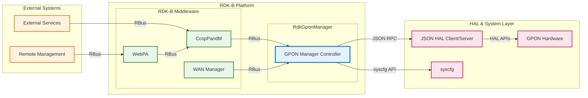
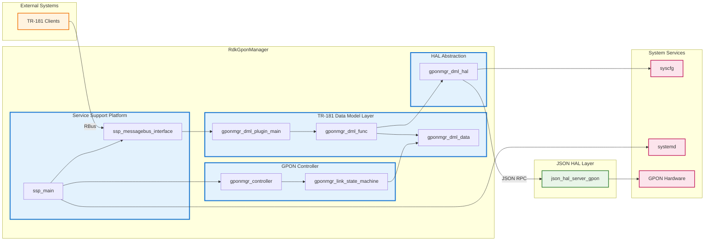
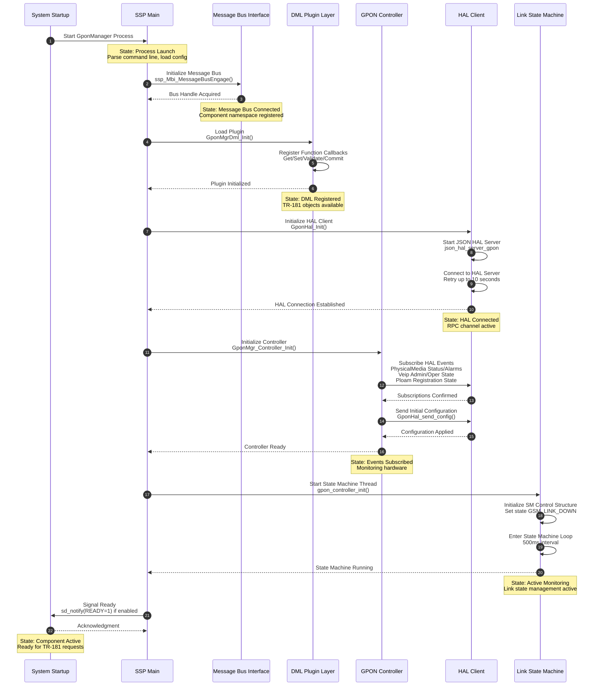
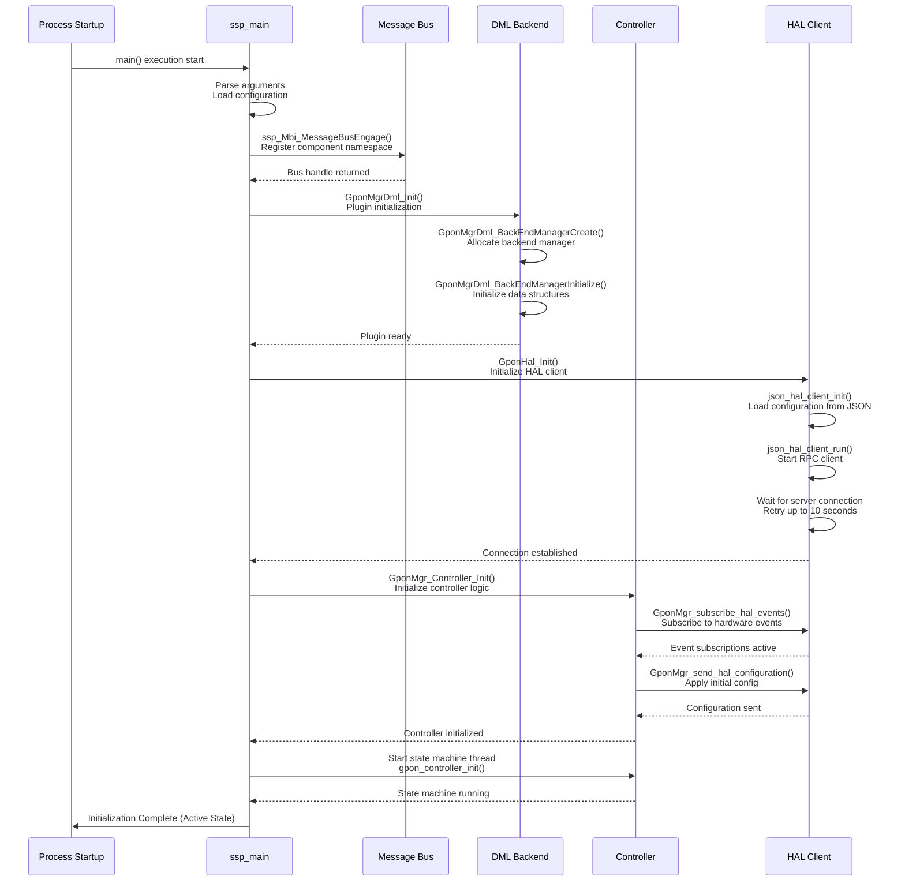
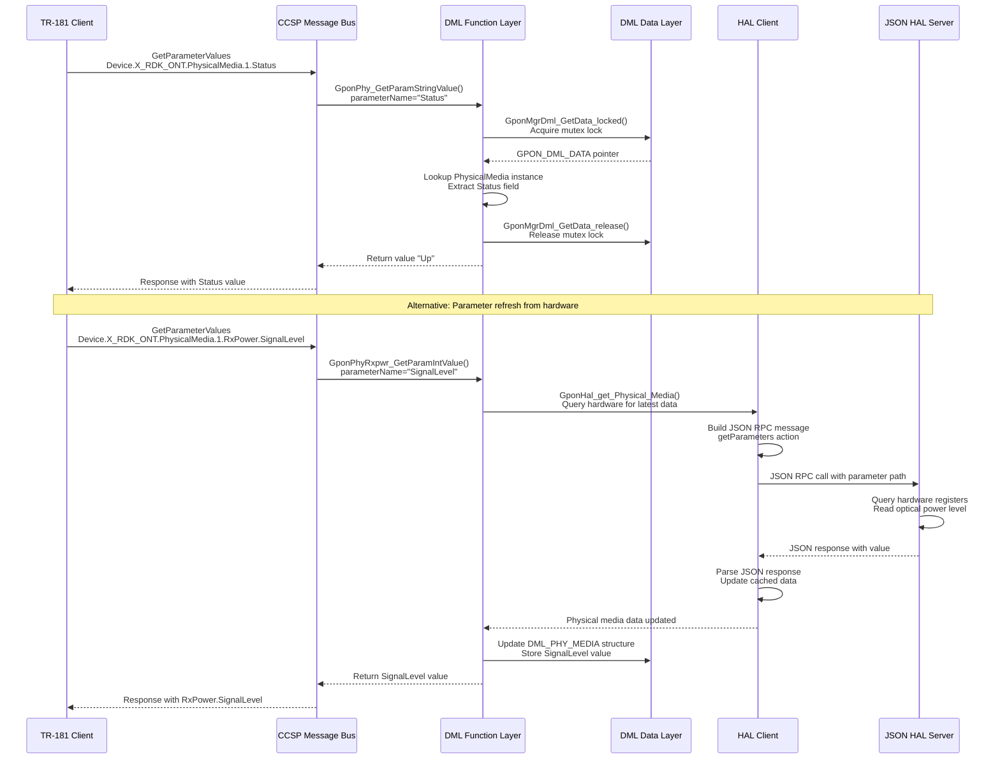
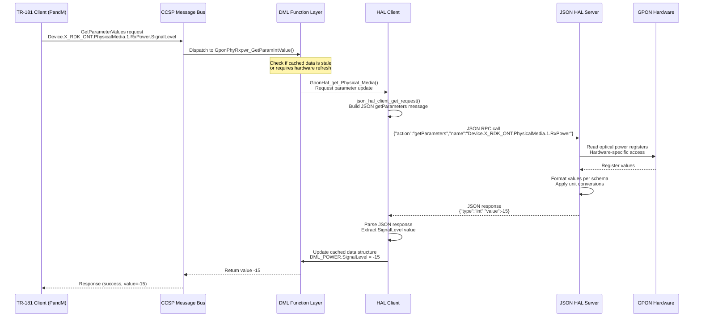
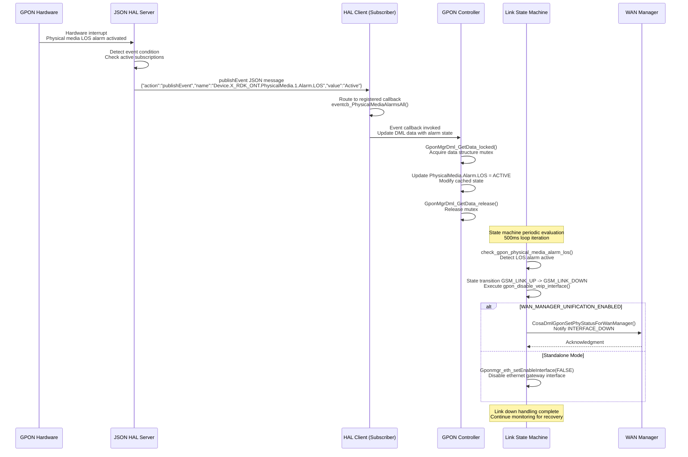

# RdkGponManager Documentation

RdkGponManager is the RDK-B component responsible for managing GPON (Gigabit Passive Optical Network) ONT (Optical Network Terminal) physical layer interfaces and providing standardized TR-181 data model access to GPON hardware capabilities. This component serves as the management interface between RDK-B middleware and vendor-specific GPON hardware through a JSON HAL (Hardware Abstraction Layer) client-server architecture.

RdkGponManager monitors and controls GPON physical media modules, manages Virtual Ethernet Interface Points (VEIPs), tracks GEM (GPON Encapsulation Method) port configurations, monitors PLOAM (Physical Layer Operations Administration and Maintenance) registration states, and provides access to OMCI (ONT Management and Control Interface) statistics. The component implements the Device.X_RDK_ONT TR-181 data model namespace, enabling standardized access to GPON-specific parameters and operational data.

The component integrates with WAN Manager for unified WAN interface management in newer RDK-B releases, supporting both standalone GPON management and WAN Manager-unified deployment scenarios through conditional compilation. RdkGponManager maintains real-time awareness of GPON link states through an internal state machine that responds to hardware events and manages interface lifecycle transitions.



**Key Features & Responsibilities**: 

- **GPON Physical Media Management**: Monitors and controls GPON optical transceiver modules including power levels, temperature, voltage, bias current, and alarm conditions for comprehensive hardware health tracking 
- **Virtual Ethernet Interface Point (VEIP) Control**: Manages VEIP lifecycle including administrative state control, operational status monitoring, and VLAN tagging configuration for upstream and downstream ethernet flows 
- **Link State Machine**: Implements intelligent GPON link state transitions responding to physical media alarms, VEIP operational states, and registration status to ensure reliable link establishment and failover handling 
- **GEM Port and Traffic Management**: Tracks GEM port configurations, traffic statistics, and VLAN flow parameters for both ingress and egress directions supporting multi-service traffic classification 
- **PLOAM and OMCI Statistics**: Provides access to PLOAM registration timers, activation counters, message counts, and OMCI baseline/extended message statistics for operational visibility and troubleshooting 
- **WAN Manager Integration**: Supports unified WAN interface management through conditional integration with WAN Manager, enabling coordinated multi-WAN scenarios with centralized interface lifecycle control 
- **Hardware Event Subscription**: Subscribes to vendor HAL events for real-time notification of physical media status changes, alarm conditions, VEIP state transitions, and PLOAM registration state updates


## Design

RdkGponManager follows a layered architecture separating TR-181 data model implementation, business logic control, and hardware abstraction through well-defined interfaces. The design emphasizes real-time event-driven state management with asynchronous HAL communication to minimize blocking operations during hardware queries. The component maintains a centralized data structure holding current GPON hardware state synchronized through periodic polling and event-driven updates from the vendor HAL layer.

The TR-181 middle layer implements Device.X_RDK_ONT object hierarchy functions for parameter get/set operations, table synchronization, validation, commit, and rollback operations following CCSP convention. The controller module orchestrates initialization, HAL event subscription, and state machine execution providing separation between data model interface and hardware control logic. The link state machine monitors GPON physical media and VEIP operational states to autonomously manage interface enable/disable operations based on link conditions and alarm states.

The northbound interface exposes TR-181 parameters through CCSP Data Model Agent following standard plugin architecture for integration with CcspPandM and other RDK-B components. The southbound interface abstracts vendor-specific GPON hardware control through JSON HAL client communicating with vendor HAL server over local RPC using standardized GPON HAL schema. Configuration persistence is achieved through syscfg APIs for storing runtime configuration changes. When WAN Manager unification is enabled, the component provides physical layer status updates to WAN Manager instead of directly managing ethernet gateway interfaces.



### Prerequisites and Dependencies

**Build-Time Flags and Configuration:**

| Configure Option | DISTRO Feature | Build Flag | Purpose | Default |
|------------------|----------------|------------|---------|---------|
| `--enable-notify` | N/A | `ENABLE_SD_NOTIFY` | Enable systemd service notification for ready state signaling | Disabled |
| N/A | `wan-manager-unification` | `WAN_MANAGER_UNIFICATION_ENABLED` | Enable integration with WAN Manager for unified WAN interface management | Disabled |
| N/A | N/A | `FEATURE_SUPPORT_RDKLOG` | Enable RDK centralized logging framework integration | Enabled |
| N/A | `breakpad` | `INCLUDE_BREAKPAD` | Enable Google Breakpad crash reporting and minidump generation | Disabled |

<br>

**RDK-B Platform and Integration Requirements:**

* **RDK-B Components**: `CcspPandM` for TR-181 data model registration, `CcspCommonLibrary` for base component infrastructure, `WAN Manager` when WAN_MANAGER_UNIFICATION_ENABLED is defined
* **HAL Dependencies**: JSON HAL client library (`libjson_hal_client`), vendor GPON HAL implementation providing json_hal_server_gpon binary and schema compliance
* **Systemd Services**: Component must start after network interfaces are initialized and CCSP Common Component infrastructure is active
* **Message Bus**: CCSP Message Bus registration under component namespace `com.cisco.spvtg.ccsp.gponmanager` for TR-181 parameter access
* **TR-181 Data Model**: Implements `Device.X_RDK_ONT` object hierarchy including PhysicalMedia, Veip, Gem, Gtc, Ploam, Omci, and TR69 sub-objects
* **Configuration Files**: `/etc/rdk/conf/gpon_manager_conf.json` for HAL client configuration (or `gpon_manager_wan_unify_conf.json` when WAN Manager unified), `/etc/rdk/conf/RdkGponManager.xml` for TR-181 object definitions, `/etc/rdk/schemas/gpon_hal_schema.json` for HAL schema validation
* **Startup Order**: Must initialize after CCSP infrastructure and before components requiring GPON interface status (e.g., WAN Manager, Networking components)
* **Resource Constraints**: Requires JSON-C library for HAL message parsing, pthread support for background state machine thread

<br>

**Threading Model** 

RdkGponManager implements a multi-threaded architecture with a main thread handling TR-181 requests and message bus operations, plus a dedicated background thread executing the GPON link state machine.

- **Threading Architecture**: Multi-threaded with main event loop and dedicated state machine thread
- **Main Thread**: Handles CCSP component lifecycle, TR-181 parameter get/set requests through DML layer, message bus communication, and HAL event callback processing
- **Worker Threads**: 
  - **State Machine Thread**: Executes GPON link state machine loop with 500ms interval monitoring physical media alarms, VEIP operational states, and managing link up/down transitions autonomously
- **Synchronization**: Uses mutex locks in DML data layer (`GponMgrDml_GetData_locked`, `GponMgrDml_GetData_release`) for thread-safe access to shared GPON data structures between TR-181 handlers and state machine thread

### Component State Flow

**Initialization to Active State**

RdkGponManager follows a structured initialization sequence starting from component loading through Data Model Agent plugin mechanism, progressing through HAL connection establishment, event subscription, and culminating in active state machine operation for continuous GPON link monitoring.



**Runtime State Changes and Context Switching**

During operation, RdkGponManager responds to hardware events, configuration changes, and external component interactions that trigger operational context changes and state machine transitions.

**State Change Triggers:**

- Physical media alarm state changes (LOS, LOF, SF, SD) causing link state machine transitions between GSM_LINK_DOWN, GSM_VEIP_DISABLED, GSM_VEIP_CONFIGURE, and GSM_LINK_UP states
- VEIP administrative state modifications through TR-181 parameter writes triggering state machine re-evaluation for interface enable/disable operations
- PLOAM registration state changes indicating ONT ranging and activation status affecting link establishment workflow
- WAN Manager synchronization events when WAN_MANAGER_UNIFICATION_ENABLED requiring physical layer status updates instead of direct ethernet interface management

**Context Switching Scenarios:**

- Switching between standalone GPON management mode and WAN Manager unified mode based on WAN_MANAGER_UNIFICATION_ENABLED build flag changing interface lifecycle responsibility
- HAL client reconnection sequence when JSON HAL server restarts requiring event resubscription and configuration resynchronization
- State machine context switch from GSM_LINK_UP to GSM_LINK_DOWN when physical media LOS alarm activates resulting in VEIP interface disablement

### Call Flow

**Initialization Call Flow:**



**Request Processing Call Flow:**



## TR‑181 Data Models

### Supported TR-181 Parameters

RdkGponManager implements the Device.X_RDK_ONT vendor-specific TR-181 data model namespace providing comprehensive access to GPON ONT hardware parameters, operational statistics, and configuration settings. The implementation supports both read-only monitoring parameters and read-write configuration parameters where hardware capabilities permit modification.

### Object Hierarchy

```
Device.
└── X_RDK_ONT.
    ├── PhysicalMedia.{i}.
    │   ├── Cage (uint32/mapped, R)
    │   ├── ModuleVendor (string, R)
    │   ├── ModuleName (string, R)
    │   ├── ModuleVersion (string, R)
    │   ├── ModuleFirmwareVersion (string, R)
    │   ├── PonMode (uint32/mapped, R)
    │   ├── Connector (uint32/mapped, R)
    │   ├── NominalBitRateDownstream (uint32, R)
    │   ├── NominalBitRateUpstream (uint32, R)
    │   ├── Enable (boolean, R/W) [WAN_MANAGER_UNIFICATION_ENABLED]
    │   ├── Status (uint32/mapped, R)
    │   ├── RedundancyState (uint32/mapped, R)
    │   ├── Alias (string, R/W) [WAN_MANAGER_UNIFICATION_ENABLED]
    │   ├── LastChange (uint32, R) [WAN_MANAGER_UNIFICATION_ENABLED]
    │   ├── LowerLayers (string, R/W) [WAN_MANAGER_UNIFICATION_ENABLED]
    │   ├── Upstream (boolean, R) [WAN_MANAGER_UNIFICATION_ENABLED]
    │   ├── RxPower.
    │   │   ├── SignalLevel (int, R)
    │   │   ├── SignalLevelLowerThreshold (int, R/W)
    │   │   └── SignalLevelUpperThreshold (int, R/W)
    │   ├── TxPower.
    │   │   ├── SignalLevel (int, R)
    │   │   ├── SignalLevelLowerThreshold (int, R/W)
    │   │   └── SignalLevelUpperThreshold (int, R/W)
    │   ├── Voltage.
    │   │   └── VoltageLevel (int, R)
    │   ├── Bias.
    │   │   └── CurrentBias (uint32, R)
    │   ├── Temperature.
    │   │   └── CurrentTemp (int, R)
    │   ├── PerformanceThreshold.
    │   │   ├── SignalFail (uint32, R)
    │   │   └── SignalDegrade (uint32, R)
    │   └── Alarm.
    │       ├── RDI (uint32/mapped, R)
    │       ├── PEE (uint32/mapped, R)
    │       ├── LOS (uint32/mapped, R)
    │       ├── LOF (uint32/mapped, R)
    │       ├── DACT (uint32/mapped, R)
    │       ├── DIS (uint32/mapped, R)
    │       ├── MIS (uint32/mapped, R)
    │       ├── MEM (uint32/mapped, R)
    │       ├── SUF (uint32/mapped, R)
    │       ├── SF (uint32/mapped, R)
    │       ├── SD (uint32/mapped, R)
    │       ├── LCDG (uint32/mapped, R)
    │       ├── TF (uint32/mapped, R)
    │       └── ROGUE (uint32/mapped, R)
    ├── Gtc.
    │   ├── CorrectedFecBytes (uint32, R)
    │   ├── CorrectedFecCodeWords (uint32, R)
    │   ├── UnCorrectedFecCodeWords (uint32, R)
    │   ├── TotalFecCodeWords (uint32, R)
    │   ├── HecErrorCount (uint32, R)
    │   ├── PSBdHecErrors (uint32, R)
    │   ├── FrameHecErrors (uint32, R)
    │   └── FramesLost (uint32, R)
    ├── Ploam.
    │   ├── RegistrationState (uint32/mapped, R)
    │   ├── ActivationCounter (uint32, R)
    │   ├── TxMessageCount (uint32, R)
    │   ├── RxMessageCount (uint32, R)
    │   ├── MicErrors (uint32, R)
    │   └── RegistrationTimers.
    │       ├── TO1 (uint32, R)
    │       └── TO2 (uint32, R)
    ├── Gem.{i}.
    │   ├── PortId (uint32, R)
    │   ├── TrafficType (uint32/mapped, R)
    │   ├── TransmittedFrames (uint32, R)
    │   ├── ReceivedFrames (uint32, R)
    │   └── EthernetFlow.
    │       ├── Ingress.
    │       │   ├── Tagged (uint32/mapped, R)
    │       │   ├── S-VLAN.
    │       │   │   ├── Vid (uint32, R)
    │       │   │   ├── Pcp (uint32, R)
    │       │   │   └── Dei (uint32, R)
    │       │   └── C-VLAN.
    │       │       ├── Vid (uint32, R)
    │       │       ├── Pcp (uint32, R)
    │       │       └── Dei (uint32, R)
    │       └── Egress.
    │           ├── Tagged (uint32/mapped, R)
    │           ├── S-VLAN.
    │           │   ├── Vid (uint32, R)
    │           │   ├── Pcp (uint32, R)
    │           │   └── Dei (uint32, R)
    │           └── C-VLAN.
    │               ├── Vid (uint32, R)
    │               ├── Pcp (uint32, R)
    │               └── Dei (uint32, R)
    ├── Omci.
    │   ├── RxBaseLineMessageCountValid (int, R)
    │   ├── RxExtendedMessageCountValid (int, R)
    │   └── MicErrors (uint32, R)
    ├── Veip.{i}.
    │   ├── MeId (uint32, R)
    │   ├── AdministrativeState (uint32/mapped, R)
    │   ├── OperationalState (uint32/mapped, R)
    │   ├── InterDomainName (string, R)
    │   ├── InterfaceName (string, R)
    │   └── EthernetFlow.
    │       ├── Ingress.
    │       │   ├── Tagged (uint32/mapped, R/W)
    │       │   └── Q-VLAN.
    │       │       ├── Vid (uint32, R/W)
    │       │       ├── Pcp (uint32, R)
    │       │       └── Dei (uint32, R)
    │       └── Egress.
    │           ├── Tagged (uint32/mapped, R/W)
    │           └── Q-VLAN.
    │               ├── Vid (uint32, R/W)
    │               ├── Pcp (uint32, R)
    │               └── Dei (uint32, R)
    └── TR69.
        ├── url (string, R)
        └── AssociatedTag (uint32, R)
```

### Parameter Registration and Access

- **Implemented Parameters**: RdkGponManager implements all parameters within Device.X_RDK_ONT namespace defined in RdkGponManager.xml configuration file with dynamic table support for PhysicalMedia, Gem, and Veip objects supporting up to 128 instances per table
- **Parameter Registration**: Parameters are registered during component initialization through DML plugin mechanism (`GponMgrDml_Init`) which acquires CCSP function callbacks and registers object hierarchy with Data Model Agent enabling TR-181 access via CCSP message bus
- **Access Mechanism**: External components access parameters through CCSP message bus using standard GetParameterValues, SetParameterValues, GetParameterNames, and GetParameterAttributes APIs with component namespace resolution directing requests to appropriate DML handler functions
- **Validation Rules**: Writable parameters undergo validation through Validate/Commit/Rollback pattern with hardware capability checks performed in Validate phase before committing changes to HAL layer, with transaction rollback support for atomic multi-parameter updates

## Internal Modules

RdkGponManager is organized into distinct functional modules handling service support platform integration, TR-181 data model implementation, GPON controller logic, link state management, and hardware abstraction layer communication.

| Module/Class | Description | Key Files |
|-------------|------------|-----------|
| **Service Support Platform** | Component lifecycle management providing process entry point, CCSP message bus integration, signal handling, component action dispatch, and systemd integration for process supervision | `ssp_main.c`, `ssp_action.c`, `ssp_messagebus_interface.c`, `ssp_global.h`, `ssp_internal.h` |
| **DML Plugin Layer** | TR-181 data model plugin providing CCSP Data Model Agent integration through function callback registration, backend manager initialization, and object hierarchy registration for Device.X_RDK_ONT namespace | `gponmgr_dml_plugin_main.c`, `gponmgr_dml_plugin_main.h` |
| **DML Backend Manager** | Backend infrastructure managing COSA data model object creation, initialization lifecycle, and global function callback references for coordinating TR-181 operations across DML modules | `gponmgr_dml_backendmgr.c`, `gponmgr_dml_backendmgr.h` |
| **DML Data Layer** | Centralized data structure management maintaining GPON hardware state cache with thread-safe access through mutex-protected getter/release functions for PhysicalMedia, Veip, Gem, Gtc, Ploam, Omci, and TR69 data | `gponmgr_dml_data.c`, `gponmgr_dml_data.h` |
| **DML Function Handlers** | TR-181 parameter function implementations for PhysicalMedia, Gtc, Ploam, Gem, Omci, Veip, and TR69 objects providing GetParamValue, SetParamValue, IsUpdated, Synchronize, GetEntryCount, GetEntry, Validate, Commit, and Rollback operations | `gponmgr_dml_func.c`, `gponmgr_dml_func.h` |
| **DML Object Layer** | High-level object management for TR-181 tables implementing dynamic instance management, object addition/deletion logic, and coordination between DML function layer and backend data structures | `gponmgr_dml_obj.c`, `gponmgr_dml_obj.h` |
| **DML Internal Logic** | Internal DML utility functions and helper routines supporting data model operations including type conversions, enumeration mappings, and cross-module coordination functions | `gponmgr_dml_internal.c`, `gponmgr_dml_internal.h` |
| **DML Ethernet Interface** | Ethernet gateway interface management module handling interface addition, deletion, enable/disable operations, and lower layer binding for standalone mode when WAN Manager unification is disabled | `gponmgr_dml_eth_iface.c`, `gponmgr_dml_eth_iface.h` |
| **GPON Controller** | High-level controller orchestrating component initialization sequence, HAL event subscription for hardware notifications, initial configuration transmission, and coordination between state machine and TR-181 layer | `gponmgr_controller.c`, `gponmgr_controller.h` |
| **Link State Machine** | Autonomous state machine managing GPON link lifecycle through states GSM_LINK_DOWN, GSM_VEIP_DISABLED, GSM_VEIP_CONFIGURE, and GSM_LINK_UP with transition logic based on physical media alarms, VEIP operational states, and administrative control | `gponmgr_link_state_machine.c`, `gponmgr_link_state_machine.h` |
| **HAL Client Interface** | JSON HAL client abstraction providing synchronous RPC operations for querying and configuring GPON hardware through json_hal_client library with connection management, retry logic, and response parsing | `gponmgr_dml_hal.c`, `gponmgr_dml_hal.h` |
| **HAL Parameter Mapping** | Parameter translation layer converting TR-181 parameter paths to JSON HAL schema paths and marshaling data between CCSP types and JSON message formats for getParameters, setParameters, and event subscription operations | `gponmgr_dml_hal_param.c`, `gponmgr_dml_hal_param.h` |

## Component Interactions

RdkGponManager maintains interactions with RDK-B middleware components for TR-181 access, vendor HAL layer for hardware control, system services for configuration persistence, and optionally with WAN Manager for unified interface management.

### Interaction Matrix

| Target Component/Layer | Interaction Purpose | Key APIs/Endpoints |
|------------------------|-------------------|------------------|
| **RDK-B Middleware Components** |
| CcspPandM | TR-181 parameter access and modification, component registration and capability advertisement | `GetParameterValues`, `SetParameterValues`, `GetParameterNames`, `GetParameterAttributes` via CCSP Message Bus |
| WAN Manager | Physical layer status synchronization for unified WAN management when WAN_MANAGER_UNIFICATION_ENABLED | `CosaDmlGponSetPhyStatusForWanManager()` providing interface status INTERFACE_UP/INTERFACE_DOWN |
| **System & HAL Layers** |
| JSON HAL Server | GPON hardware query and configuration through JSON RPC communication | `json_hal_client_init()`, `json_hal_client_run()`, `json_hal_client_get_request()`, `json_hal_client_set_request()`, `json_hal_client_subscribe_event()` |
| syscfg | Persistent configuration storage for writable GPON parameters requiring reboot survival | `syscfg_get()`, `syscfg_set()`, `syscfg_commit()` |
| systemd | Process lifecycle notification signaling component ready state when ENABLE_SD_NOTIFY enabled | `sd_notify()` with READY=1 status message |

**Events Published by RdkGponManager:**

| Event Name | Event Topic/Path | Trigger Condition | Subscriber Components |
|------------|-----------------|-------------------|---------------------|
| PhysicalMedia Status Change | `Device.X_RDK_ONT.PhysicalMedia.{i}.Status` | Physical media operational status transitions between Up, Down, Unknown, Dormant, NotPresent, LowerLayerDown, Error states | WAN Manager, Monitoring Systems, Logging Services |
| PhysicalMedia Alarm | `Device.X_RDK_ONT.PhysicalMedia.{i}.Alarm` | Alarm condition state change for LOS, LOF, SF, SD, or other physical layer alarms transitioning between Active and Inactive | Link State Machine, WAN Manager, Alarm Management Systems |
| VEIP Administrative State | `Device.X_RDK_ONT.Veip.{i}.AdministrativeState` | VEIP administrative state change between Lock and Unlock triggered by OMCI configuration | Link State Machine, Interface Management |
| VEIP Operational State | `Device.X_RDK_ONT.Veip.{i}.OperationalState` | VEIP operational state transitions affecting interface availability | Link State Machine, WAN Manager, Connectivity Monitoring |
| PLOAM Registration State | `Device.X_RDK_ONT.Ploam.RegistrationState` | ONT registration state change through PLOAM protocol ranging and activation process | WAN Manager, Provisioning Systems, Operational Monitoring |

### IPC Flow Patterns

**Primary IPC Flow - TR-181 Parameter Query:**



**Event Notification Flow:**



## Implementation Details

### Major HAL APIs Integration

RdkGponManager integrates with vendor-specific GPON hardware through JSON HAL client-server architecture using standardized schema-based message exchange for hardware abstraction and platform portability.

**Core HAL APIs:**

| HAL API | Purpose | Implementation File |
|---------|---------|-------------------|
| `json_hal_client_init()` | Initialize JSON HAL client library with configuration file path specifying HAL server port and schema location | `gponmgr_dml_hal.c` |
| `json_hal_client_run()` | Start JSON HAL client RPC mechanism establishing connection to vendor HAL server | `gponmgr_dml_hal.c` |
| `json_hal_is_client_connected()` | Query connection status between HAL client and server with retry logic during initialization | `gponmgr_dml_hal.c` |
| `json_hal_client_get_request()` | Send getParameters JSON RPC request to query hardware parameter values by TR-181 path | `gponmgr_dml_hal.c` |
| `json_hal_client_set_request()` | Send setParameters JSON RPC request to configure hardware parameters through TR-181 path | `gponmgr_dml_hal.c` |
| `json_hal_client_subscribe_event()` | Subscribe to hardware event notifications with onChange or interval notification types | `gponmgr_dml_hal.c` |
| `GponHal_Init()` | High-level HAL initialization launching vendor HAL server process, initializing client library, and verifying connection establishment | `gponmgr_dml_hal.c` |
| `GponHal_get_Physical_Media()` | Query all PhysicalMedia instance data including module information, power levels, alarms, and operational status | `gponmgr_dml_hal.c` |
| `GponHal_get_veip()` | Query VEIP instance data including administrative state, operational state, and ethernet flow configuration | `gponmgr_dml_hal.c` |
| `GponHal_get_gem()` | Query GEM port instance data including port IDs, traffic types, frame counts, and VLAN flow parameters | `gponmgr_dml_hal.c` |
| `GponHal_get_gtc()` | Query GTC layer statistics including FEC counters, HEC errors, and frame loss metrics | `gponmgr_dml_hal.c` |
| `GponHal_get_ploam()` | Query PLOAM statistics including registration state, activation counters, and message counts | `gponmgr_dml_hal.c` |
| `GponHal_Event_Subscribe()` | Subscribe to specific hardware events by parameter path with callback function registration | `gponmgr_dml_hal.c` |
| `GponHal_send_config()` | Transmit initial configuration to hardware layer applying stored setParameter values | `gponmgr_dml_hal.c` |

### Key Implementation Logic

- **State Machine Engine**: Link state machine implemented in `gponmgr_link_state_machine.c` executing periodic 500ms loop evaluating conditions for state transitions between GSM_LINK_DOWN, GSM_VEIP_DISABLED, GSM_VEIP_CONFIGURE, and GSM_LINK_UP states using function pointers for action execution and transition logic. State transition handlers invoke hardware query functions checking VEIP enabled status, physical media alarm conditions, and interface operational states. State transition functions implementing transition logic: `gpon_sm_transition_Start()`, `gpon_sm_transition_LinkDown_to_LinkUp()`, `gpon_sm_transition_VeipDisabled_to_VeipConfigure()`, `gpon_sm_transition_VeipConfigure_to_LinkUp()`, `gpon_sm_transition_LinkUp_to_LinkDown()`.
  
- **Event Processing**: Hardware events received asynchronously through JSON HAL publishEvent messages routed to registered callback functions based on parameter path subscriptions. Event callbacks defined in `gponmgr_controller.c` and `gponmgr_dml_hal.c` include `eventcb_PhysicalMediaStatus()`, `eventcb_PhysicalMediaAlarmsAll()`, `eventcb_VeipAdministrativeState()`, `eventcb_VeipOperationalState()`, `eventcb_PloamRegistrationState()`. Callbacks acquire data structure mutex, update cached values in `GPON_DML_DATA` structure, release mutex, enabling state machine thread to consume updated state during next evaluation cycle.

- **Error Handling Strategy**: JSON HAL operations return ANSC_STATUS_SUCCESS or ANSC_STATUS_FAILURE with error logging through CcspTraceError macro providing function name, line number, and error context. HAL client connection failures trigger retry mechanism with exponential backoff up to HAL_CONNECTION_RETRY_MAX_COUNT (10 attempts) during initialization. Parameter validation failures in DML Validate functions return error without committing to hardware allowing rollback of multi-parameter transactions. JSON parsing errors during HAL response processing logged with message content dump and safe default value return to prevent data corruption.

- **Logging & Debugging**: Component uses RDK Logger framework when FEATURE_SUPPORT_RDKLOG enabled providing categorized logging through CcspTraceInfo, CcspTraceWarning, CcspTraceError macros. State machine state transitions logged at Info level with current state, next state, and transition reason. HAL communication logged at Debug level including JSON message payloads for request/response correlation. Critical failures including HAL connection loss, event subscription failure, or state machine initialization failure logged at Error level with component restart recommendation. 

### Key Configuration Files

| Configuration File | Purpose | Override Mechanisms |
|--------------------|---------|--------------------|
| `/etc/rdk/conf/gpon_manager_conf.json` | HAL client configuration specifying json_hal_server port number and schema file path used by json_hal_client_init | No runtime override, requires file modification and process restart |
| `/etc/rdk/conf/gpon_manager_wan_unify_conf.json` | Alternative HAL configuration used when WAN_MANAGER_UNIFICATION_ENABLED build flag is defined | Selected at compile time via build flag, runtime selection not supported |
| `/etc/rdk/conf/RdkGponManager.xml` | TR-181 object hierarchy definition specifying DML function mappings, parameter types, syntax, and access permissions for Device.X_RDK_ONT namespace | Loaded during DML initialization, modifications require component restart |
| `/etc/rdk/schemas/gpon_hal_schema.json` | JSON HAL schema definition specifying supported actions, parameter paths, data types, and enumeration mappings for GPON HAL protocol validation | Schema path referenced from gpon_manager_conf.json, vendor HAL server must provide matching schema version |

