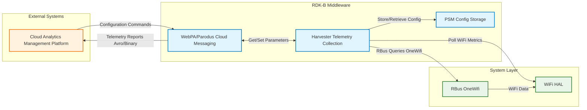
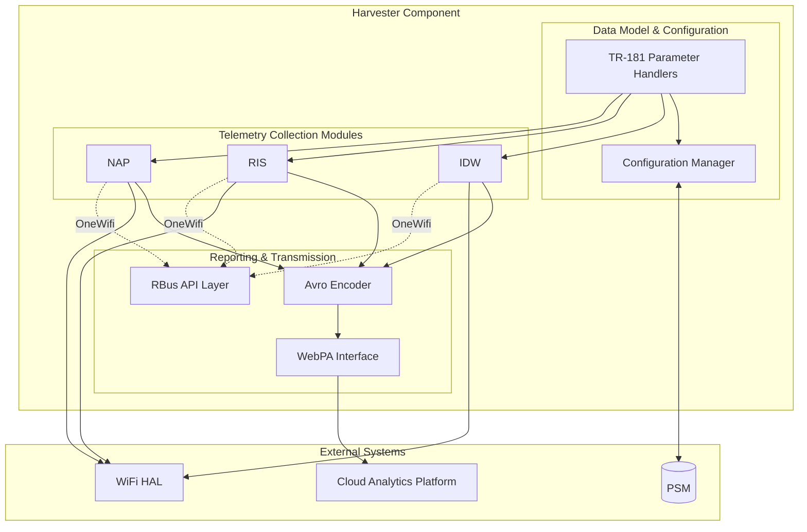
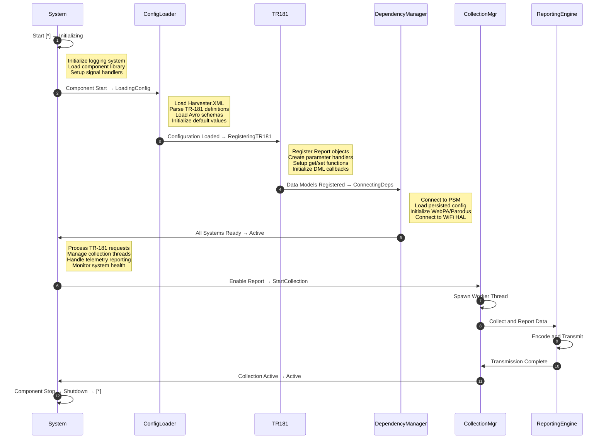
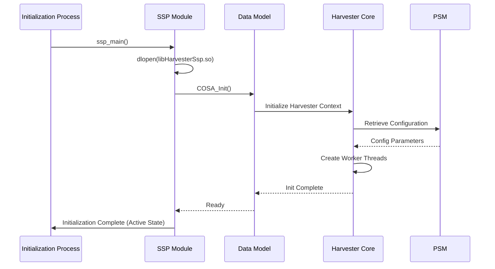
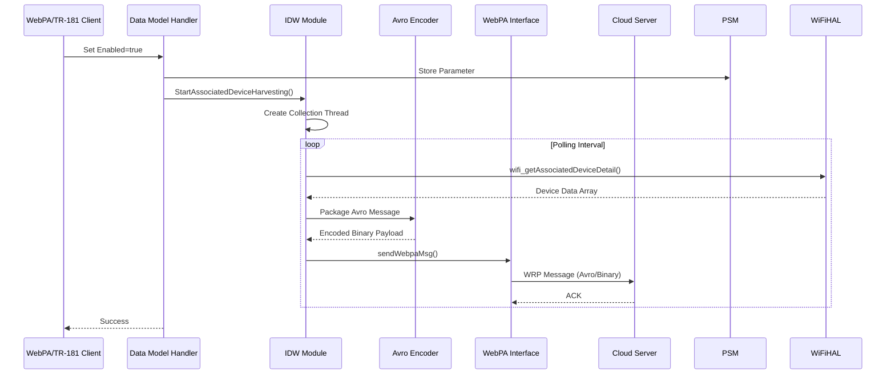
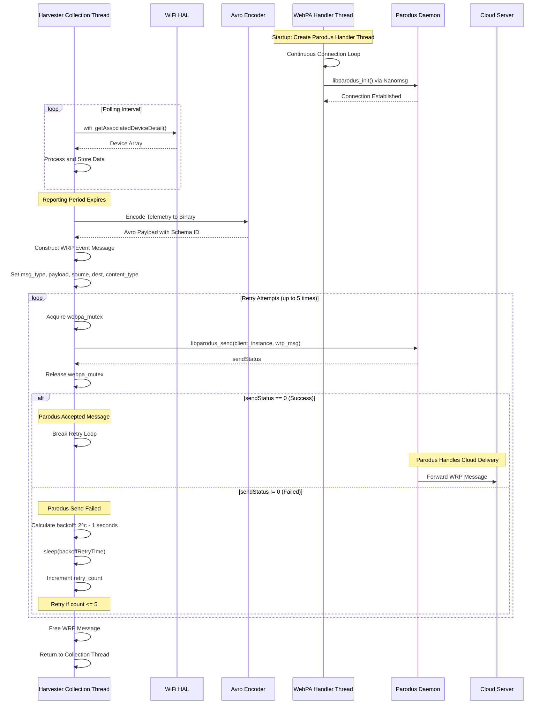
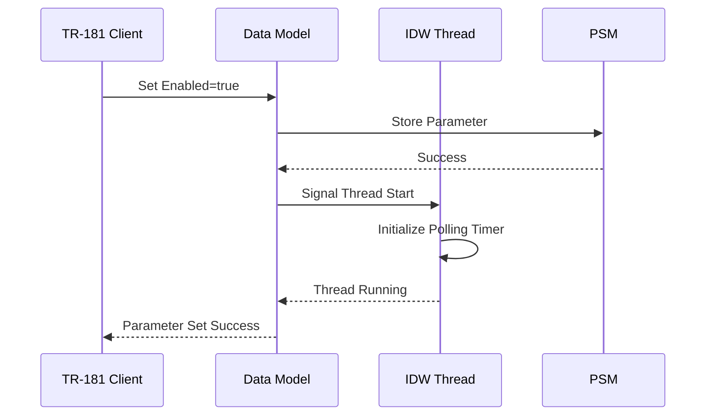

# Harvester Documentation

Harvester is an RDK-B telemetry component responsible for collecting and reporting WiFi metrics and statistics from the gateway device to cloud management systems. The component gathers data about associated WiFi devices, neighboring access points, and radio interface statistics at configurable intervals and transmits these metrics using Avro serialization format through the WebPA/Parodus framework for upstream analytics and monitoring.

The component operates as a scheduled data collection agent that periodically polls WiFi HAL APIs to retrieve device association information, radio traffic metrics, and neighboring AP scan results. Harvester packages this telemetry data into structured Avro-encoded messages and transmits them to cloud-based data processing systems through the CcspWebPA messaging infrastructure. The component supports configurable polling and reporting intervals for each telemetry report type with persistent storage of configuration parameters through CcspPsm integration.

Harvester implements TR-181 data model parameters under the Device.X_RDKCENTRAL-COM_Report namespace enabling dynamic configuration and control of telemetry collection behavior. The architecture supports both traditional WiFi HAL-based data collection and RBus-based data retrieval when OneWifi feature is enabled providing flexibility across different RDK-B platform configurations.



**Key Features & Responsibilities**: 

- **Interface Devices WiFi Reporting**: Collects and reports detailed information about WiFi devices associated with each SSID including MAC addresses, signal strength, connection timestamps, operating mode, frequency band, and data rate information at configurable polling intervals
- **Radio Interface Statistics Collection**: Gathers radio-level performance metrics including channel utilization, noise floor, transmission statistics, retry counts, and error rates for each WiFi radio interface supporting 2.4GHz and 5GHz bands
- **Neighboring Access Point Scanning**: Performs periodic WiFi channel scans to detect and report neighboring access points including SSID, BSSID, channel, signal strength, security mode, and operating standards for spectrum analysis and channel optimization
- **Avro Serialization and Encoding**: Packages collected telemetry data using Apache Avro binary serialization format with schema validation ensuring compact data representation and efficient transmission to cloud analytics platforms
- **WebPA Integration and Upstream Messaging**: Establishes persistent connection with Parodus daemon through a dedicated handler thread that continuously monitors connectivity status and performs connection initialization using libparodus APIs over nanomsg IPC transport. When reporting intervals expire, collection threads invoke message transmission by constructing WRP event message structures containing Avro-encoded telemetry payloads with message type, source MAC address, destination routing, and content-type metadata. The transmission function calls libparodus_send with mutex synchronization to deliver messages to Parodus daemon which forwards them to cloud management systems. When transmission to Parodus fails, the component implements synchronous retry logic with exponential backoff delay calculated as 2^n - 1 seconds, attempting up to 5 retries before abandoning the message. The Parodus daemon handles subsequent message queuing and cloud delivery while Harvester confirms only that Parodus successfully accepted the outbound telemetry report


## Design

Harvester follows an event-driven, multi-threaded architecture organized around independent data collection threads for each telemetry report type. The design separates data collection responsibilities into distinct modules corresponding to Interface Devices WiFi (IDW), Radio Interface Statistics (RIS), and Neighboring AP (NAP) reporting each operating with independent polling cycles and reporting intervals configured through TR-181 parameters.

The component implements a producer-consumer pattern where dedicated polling threads periodically invoke WiFi HAL APIs or RBus queries to retrieve metrics and package the collected data into Avro-encoded binary payloads. These telemetry messages are transmitted to Parodus daemon through libparodus IPC interface with Harvester implementing retry logic and exponential backoff to ensure Parodus accepts the messages. Parodus is subsequently responsible for reliable cloud delivery including message queuing and cloud-level connection management.

Configuration parameters for polling periods, reporting intervals, and harvesting enable flags are persisted in CcspPsm ensuring configuration survives system reboots and component restarts. The TR-181 data model implementation provides standardized northbound interfaces for external components and management systems to configure harvester behavior dynamically. The component supports a default configuration mechanism with override TTL support allowing temporary parameter changes that automatically revert to defaults after expiration.

When OneWifi feature is enabled, Harvester utilizes RBus APIs for data collection providing an abstraction layer over direct WiFi HAL access and enabling better integration with unified WiFi management architectures. The dual-mode operation supports both traditional HAL-based collection and RBus-based queries determined at build time through conditional compilation.



### Prerequisites and Dependencies

**Build-Time Flags and Configuration:**

| Configure Option | DISTRO Feature | Build Flag | Purpose | Default |
|------------------|----------------|------------|---------|---------|
| `--enable-rdkOneWifi` | `OneWifi` | `RDK_ONEWIFI` | Enable RBus-based WiFi data collection through OneWifi unified management stack | Disabled |
| `--enable-core_net_lib_feature_support` | `core-net-lib` | `CORE_NET_LIB` | Enable advanced networking library support for network operations | Disabled |
| N/A | `safec` | `SAFEC_DUMMY_API` (when disabled) | Enable bounds-checking string and memory functions for security hardening | Enabled |
| N/A | `seshat` | `ENABLE_SESHAT` | Enable Seshat integration for secure token management in CcspWebPA communication | Disabled |
| N/A (CFLAGS) | N/A | `FEATURE_SUPPORT_RDKLOG` | Enable RDK logging framework integration for standardized logging across components | Enabled |

<br>

**RDK-B Platform and Integration Requirements:**

* **Build Dependencies**: `ccsp-common-library`, `rdk-logger`, `avro-c`, `trower-base64`, `hal-wifi`, `msgpackc`, `dbus`, `utopia`, `wrp-c`, `nanomsg`, `libparodus`
* **RDK-B Components**: `CcspPsm`, `CcspWiFiAgent/OneWifi`, `CcspWebPA`
* **HAL Dependencies**: WiFi HAL APIs for device association queries, radio statistics, and neighboring AP scans
* **Systemd Services**: CcspPsm services must be active before harvester initialization for configuration parameter retrieval
* **Message Bus**: Component registers with component name `com.cisco.spvtg.ccsp.harvester` or with name `harvester` when OneWifi is enabled
* **TR-181 Data Model**: Implements `Device.X_RDKCENTRAL-COM_Report` object hierarchy for telemetry configuration and control
* **Configuration Files**: `Harvester.XML` for TR-181 parameter definitions; Avro schema files in `/usr/ccsp/harvester/` including `InterfaceDevicesWifi.avsc`, `RadioInterfacesStatistics.avsc`, `GatewayAccessPointNeighborScanReport.avsc`
* **Startup Order**: Initialize after CcspPsm, CcspWiFiAgent/OneWifi, and CcspWebPA services are running to ensure configuration retrieval and message transmission capabilities

<br>

**Threading Model:** 

Harvester implements a multi-threaded architecture with independent worker threads for each telemetry report type enabling concurrent data collection without blocking operations.

- **Threading Architecture**: Multi-threaded with main event loop and dedicated worker threads for each telemetry report
- **Main Thread**: Handles TR-181 parameter requests, component lifecycle management, and message bus event processing
- **Worker Threads**: 
  - **IDW Thread**: Polls associated device information at configured intervals and triggers Avro encoding and transmission (thread function: `StartAssociatedDeviceHarvesting`)
  - **RIS Thread**: Collects radio-level performance metrics periodically and packages data for upstream reporting
  - **NAP Thread**: Performs WiFi channel scans to detect neighboring access points and generates telemetry reports
  - **Parodus Handler Thread**: Maintains WebPA/Parodus connection and handles upstream message transmission with retry logic (`handle_parodus` thread function)
- **Synchronization**: Uses pthread mutexes for configuration parameter access, pthread condition variables for polling interval timing, and semaphores for thread lifecycle management

### Component State Flow

**Initialization to Active State**

Harvester follows a structured initialization sequence establishing message bus connectivity, loading persisted configuration from CcspPsm, and spawning worker threads for telemetry collection based on enabled report types.



**Runtime State Changes and Context Switching**

During operation, Harvester responds to configuration changes, network events, and CcspWebPA connectivity status affecting telemetry collection behavior.

**State Change Triggers:**

- TR-181 parameter changes for Enabled flags triggering thread creation or termination for specific report types
- Polling period or reporting period modifications requiring reconfiguration of worker thread timers without thread restart
- Override TTL expiration causing automatic reversion to default configuration parameters retrieved from CcspPsm
- CcspWebPA connection loss triggering buffering of telemetry messages and retry attempts with exponential backoff

**Context Switching Scenarios:**

- OneWifi mode transitions between WiFi HAL direct access and RBus-based query mechanisms based on build-time configuration
- Collection mode switches between active polling and suspended state when Enabled parameter changes from true to false
- Transmission context switches between immediate send and retry queue when CcspWebPA/Parodus connection availability changes

### Call Flow

**Initialization Call Flow:**



**Request Processing Call Flow:**



## TR‑181 Data Models

### Supported TR-181 Parameters

Harvester implements vendor-specific TR-181 data model extensions under the Device.X_RDKCENTRAL-COM_Report namespace providing configuration and control of WiFi telemetry collection and reporting functionality. The implementation follows TR-181 Issue 2 architectural patterns with support for dynamic parameter updates, validation, commit/rollback operations, and persistent storage integration.

### Object Hierarchy

```
Device.
└── X_RDKCENTRAL-COM_Report.
    ├── InterfaceDevicesWifi.
    │   ├── Enabled (boolean, R/W)
    │   ├── ReportingPeriod (unsignedInt, R/W)
    │   ├── PollingPeriod (unsignedInt, R/W)
    │   ├── Schema (string, R)
    │   ├── SchemaID (string, R)
    │   └── Default.
    │       ├── ReportingPeriod (unsignedInt, R/W)
    │       ├── PollingPeriod (unsignedInt, R/W)
    │       └── OverrideTTL (unsignedInt, R)
    ├── RadioInterfaceStatistics.
    │   ├── Enabled (boolean, R/W)
    │   ├── ReportingPeriod (unsignedInt, R/W)
    │   ├── PollingPeriod (unsignedInt, R/W)
    │   ├── Schema (string, R)
    │   ├── SchemaID (string, R)
    │   └── Default.
    │       ├── ReportingPeriod (unsignedInt, R/W)
    │       ├── PollingPeriod (unsignedInt, R/W)
    │       └── OverrideTTL (unsignedInt, R)
    └── NeighboringAP.
        ├── Enabled (boolean, R/W)
        ├── ReportingPeriod (unsignedInt, R/W)
        ├── PollingPeriod (unsignedInt, R/W)
        ├── Schema (string, R)
        ├── SchemaID (string, R)
        └── Default.
            ├── ReportingPeriod (unsignedInt, R/W)
            ├── PollingPeriod (unsignedInt, R/W)
            └── OverrideTTL (unsignedInt, R)
```

| Parameter Path | Data Type | Access | Default Value | Description | BBF Compliance |
|----------------|-----------|--------|---------------|-------------|----------------|
| `Device.X_RDKCENTRAL-COM_Report.InterfaceDevicesWifi.Enabled` | boolean | R/W | `false` | Enable or disable associated WiFi device telemetry collection and reporting | Vendor Extension |
| `Device.X_RDKCENTRAL-COM_Report.InterfaceDevicesWifi.PollingPeriod` | unsignedInt | R/W | `1` | Interval in seconds for polling WiFi HAL to retrieve associated device information | Vendor Extension |
| `Device.X_RDKCENTRAL-COM_Report.InterfaceDevicesWifi.ReportingPeriod` | unsignedInt | R/W | `1` | Interval in seconds for transmitting collected telemetry data to cloud systems | Vendor Extension |
| `Device.X_RDKCENTRAL-COM_Report.InterfaceDevicesWifi.Schema` | string | R | `InterfaceDevicesWifi` | Avro schema name identifying the data structure for telemetry reports | Vendor Extension |
| `Device.X_RDKCENTRAL-COM_Report.InterfaceDevicesWifi.SchemaID` | string | R | `(computed)` | Base64-encoded hash of Avro schema used for message validation | Vendor Extension |
| `Device.X_RDKCENTRAL-COM_Report.RadioInterfaceStatistics.Enabled` | boolean | R/W | `false` | Enable or disable radio interface statistics telemetry collection and reporting | Vendor Extension |
| `Device.X_RDKCENTRAL-COM_Report.RadioInterfaceStatistics.PollingPeriod` | unsignedInt | R/W | `1` | Interval in seconds for polling radio-level performance metrics | Vendor Extension |
| `Device.X_RDKCENTRAL-COM_Report.RadioInterfaceStatistics.ReportingPeriod` | unsignedInt | R/W | `1` | Interval in seconds for transmitting radio statistics to cloud systems | Vendor Extension |
| `Device.X_RDKCENTRAL-COM_Report.NeighboringAP.Enabled` | boolean | R/W | `false` | Enable or disable neighboring access point scan telemetry collection | Vendor Extension |
| `Device.X_RDKCENTRAL-COM_Report.NeighboringAP.PollingPeriod` | unsignedInt | R/W | `1` | Interval in seconds for performing neighboring AP channel scans | Vendor Extension |
| `Device.X_RDKCENTRAL-COM_Report.NeighboringAP.ReportingPeriod` | unsignedInt | R/W | `1` | Interval in seconds for transmitting neighboring AP scan results | Vendor Extension |

## Internal Modules

Harvester is organized into specialized modules responsible for telemetry data collection, encoding, transmission, and configuration management with clear separation between report-specific collection logic and shared infrastructure components.

| Module/Class | Description | Key Files |
|-------------|------------|-----------|
| **IDW Module** | Collects detailed information about WiFi clients associated with each SSID by polling WiFi HAL or RBus APIs including device MAC addresses, signal strength, PHY rates, operating modes, and connection timestamps. Thread function `StartAssociatedDeviceHarvesting` implements the collection loop with configurable polling intervals. | `harvester_associated_devices.c`, `harvester_associated_devices.h`, `harvester_associated_devices_avropack.c` |
| **RIS Module** | Gathers radio-level performance metrics including channel utilization, noise floor, transmission counts, retry statistics, and error rates for capacity analysis and network health monitoring | `harvester_radio_traffic.c`, `harvester_radio_traffic.h`, `harvester_radio_traffic_avropack.c` |
| **NAP Module** | Performs periodic WiFi channel scans to detect surrounding access points and collects SSID, BSSID, channel number, signal strength, security settings, and operating standards for spectrum analysis | `harvester_neighboring_ap.c`, `harvester_neighboring_ap.h`, `harvester_neighboring_ap_avropack.c` |
| **Harvester Data Model** | Implements TR-181 Device.X_RDKCENTRAL-COM_Report object hierarchy with parameter handlers for get/set operations, validation logic, commit/rollback support, and integration with PSM for persistent storage | `cosa_harvester_dml.c`, `cosa_harvester_dml.h`, `cosa_harvester_internal.c` |
| **WebPA Integration** | Manages upstream message transmission to cloud systems through Parodus messaging infrastructure with WRP protocol support, retry logic with exponential backoff, and connection health monitoring | `webpa_interface.c`, `webpa_interface.h`, `webpa_interface_with_seshat.c`, `webpa_interface_without_seshat.c` |
| **RBus API Module** | Provides abstraction layer for WiFi data retrieval through RBus messaging when OneWifi is enabled replacing direct WiFi HAL calls with RBus queries for unified WiFi management integration | `harvester_rbus_api.c`, `harvester_rbus_api.h` |
| **Service Support Platform** | Handles component lifecycle management, message bus initialization, configuration loading, logging framework setup, and signal handling for graceful shutdown and crash reporting | `ssp_main.c`, `ssp_action.c`, `ssp_messagebus_interface.c` |

## Component Interactions

Harvester maintains interactions with RDK-B middleware components for configuration management and telemetry transmission, WiFi subsystems for data collection, and cloud management systems for upstream reporting.

### Interaction Matrix

| Target Component/Layer | Interaction Purpose | Key APIs/Endpoints |
|------------------------|-------------------|------------------|
| **RDK-B Middleware Components** |
| CcspPsm | Configuration parameter persistence and retrieval for polling periods, reporting intervals, enable flags, and default values | `PSM_Get_Record_Value2()`, `PSM_Set_Record_Value2()` |
| CcspWebPA/Parodus | Upstream telemetry message transmission to cloud analytics using WRP protocol with Avro-encoded binary payloads | `libparodus_send()`, `libparodus_init()`, `sendWebpaMsg()` |
| CcspWiFiAgent/OneWifi | Indirect interaction through WiFi HAL for device association queries and radio statistics when not using OneWifi RBus mode | WiFi HAL function invocations |
| **System & HAL Layers** |
| WiFi HAL | Retrieve associated device information, radio interface statistics, and neighboring AP scan results through HAL APIs | `wifi_getAssociatedDeviceDetail()`, `wifi_getRadioTrafficStats2()`, `wifi_getNeighboringWiFiDiagnosticResult2()` |
| RBus | Query WiFi device and radio data through RBus messaging when OneWifi feature is enabled providing abstraction over HAL | `rbus_get()`, `rbus_getExt()`, RBus property queries |

**Events Published by Harvester:**

| Event Name | Event Topic/Path | Trigger Condition | Subscriber Components |
|------------|-----------------|-------------------|---------------------|
| Telemetry Report | WebPA WRP Message | Reporting period expiration with collected data ready for transmission | CcspWebPA/Parodus forwards to cloud |

### IPC Flow Patterns

**Primary IPC Flow - Telemetry Collection with WebPA Messaging:**



**Event Notification Flow:**



## Implementation Details

### Major HAL APIs Integration

Harvester integrates with WiFi HAL APIs to retrieve telemetry data for associated devices, radio statistics, and neighboring access point information with conditional RBus-based access when OneWifi is enabled.

**Core HAL APIs:**

| HAL API | Purpose | Implementation File |
|---------|---------|-------------------|
| `wifi_getAssociatedDeviceDetail()` | Retrieve detailed information about devices associated with specific SSID including MAC, signal strength, rates, and connection time | `harvester_associated_devices.c` |
| `wifi_getRadioTrafficStats2()` | Collect radio-level traffic statistics including channel utilization, transmission counts, retry statistics, and error rates | `harvester_radio_traffic.c` |
| `wifi_getNeighboringWiFiDiagnosticResult2()` | Perform channel scan and retrieve information about detected neighboring access points | `harvester_neighboring_ap.c` |
| `wifi_getSSIDNumberOfEntries()` | Query the number of configured SSIDs for iterating through all access points | `harvester_associated_devices.c` |
| `wifi_getRadioNumberOfEntries()` | Query the number of radio interfaces for iterating through all radios | `harvester_radio_traffic.c` |

**RBus Integration for OneWifi:**

When OneWifi feature is enabled, Harvester uses RBus queries instead of direct HAL calls through the RBus API module:

| RBus Query | Purpose | Implementation File |
|------------|---------|-------------------|
| `rbus_get()` | Retrieve WiFi configuration and operational data from OneWifi using RBus property paths | `harvester_rbus_api.c` |
| `rbus_getExt()` | Extended RBus query for complex data structures and bulk property retrieval | `harvester_rbus_api.c` |

### Avro Schema and Serialization

Harvester uses Apache Avro for efficient binary serialization of telemetry data with schema validation:

- **Schema Files**: Avro schema definitions stored in `/usr/ccsp/harvester/` directory including `InterfaceDevicesWifi.avsc`, `RadioInterfacesStatistics.avsc`, `GatewayAccessPointNeighborScanReport.avsc`
- **Schema Loading**: Avro schemas loaded at runtime during component initialization and cached for encoding operations
- **Message Format**: Binary encoded messages prefixed with magic number (0x85) and 32-byte schema ID hash for validation
- **Encoding Process**: Telemetry data structures marshalled into Avro format using writer buffers with automatic memory management

### Configuration Persistence

Harvester stores configuration parameters in PSM with the following key patterns:

- `eRT.com.cisco.spvtg.ccsp.harvester.InterfaceDevicesWifiEnabled`
- `eRT.com.cisco.spvtg.ccsp.harvester.InterfaceDevicesWifiPollingPeriod`
- `eRT.com.cisco.spvtg.ccsp.harvester.InterfaceDevicesWifiReportingPeriod`
- Similar patterns for RadioInterfaceStatistics and NeighboringAP report types
- Default values stored separately with override TTL mechanism for temporary configuration changes

### Key Implementation Logic

- **Telemetry Collection Engine**: Multi-threaded polling system with independent collection threads for each report type implementing producer-consumer pattern with configurable polling intervals validated against predefined acceptable values. Thread lifecycle management with conditional variables for timer-based polling and graceful shutdown handling. State machine implementation tracking collection thread status transitions between idle, active, and suspended states.
  
- **Event Processing**: Asynchronous message transmission through WebPA/Parodus with retry logic and exponential backoff for failed transmissions. Queue management for telemetry reports when cloud connectivity is unavailable with persistent buffering during extended outages. Parameter validation engine ensuring polling period less than or equal to reporting period and restricting values to supported intervals defined in source code arrays.
  
- **Error Handling Strategy**: Comprehensive error detection and recovery mechanisms ensuring system stability during WiFi HAL failures, WebPA connection losses, and resource constraints. Automatic retry logic with configurable backoff for transient HAL errors. Graceful degradation when telemetry transmission fails with local buffering and notification logging. Health monitoring logging telemetry collection success rates and transmission statistics for operational visibility.

### Key Configuration Files

| Configuration File | Purpose | Override Mechanisms |
|--------------------|---------|---------------------|
| `Harvester.XML`    | TR-181 parameter definitions and DML function mappings for telemetry report configuration | Component compilation flags, runtime parameter updates |
| `InterfaceDevicesWifi.avsc` | Avro schema definition for associated WiFi device telemetry report structure | Schema version updates, cloud-side schema registry |
| `RadioInterfacesStatistics.avsc` | Avro schema definition for radio interface performance metrics report structure | Schema version updates, cloud-side schema registry |
| `GatewayAccessPointNeighborScanReport.avsc` | Avro schema definition for neighboring AP scan results report structure | Schema version updates, cloud-side schema registry |
