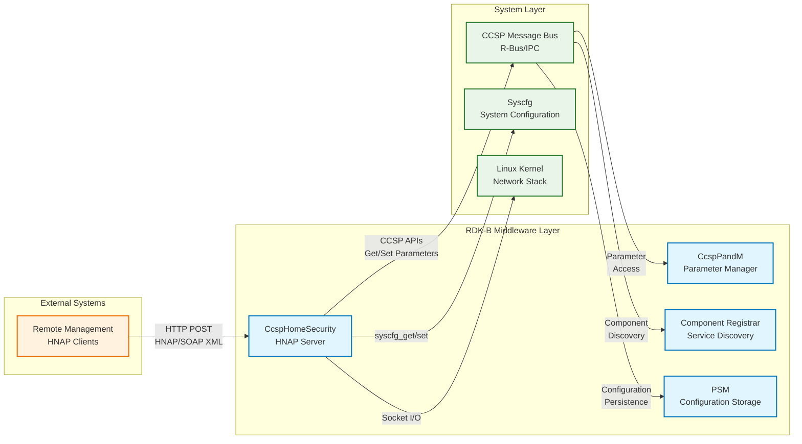
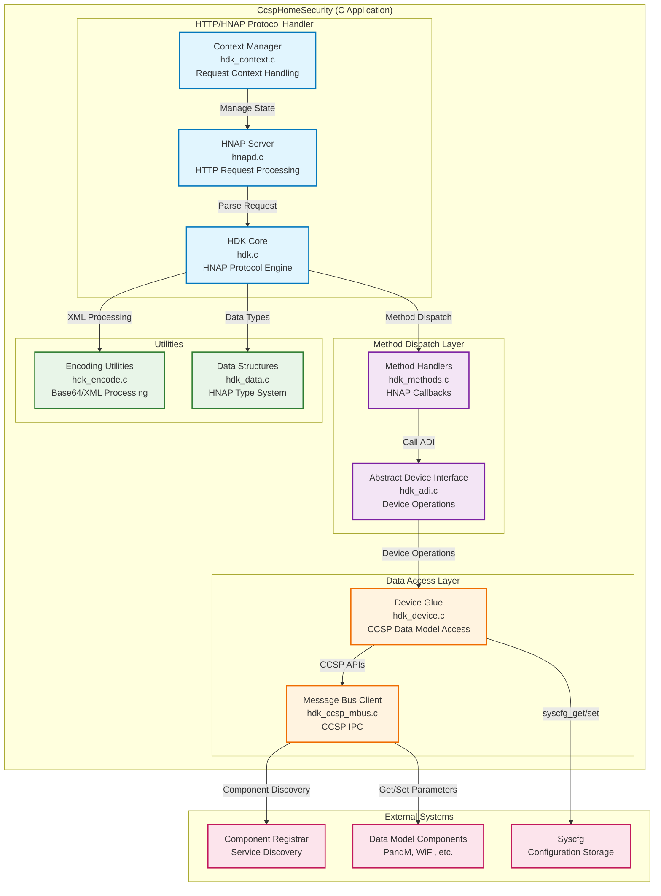
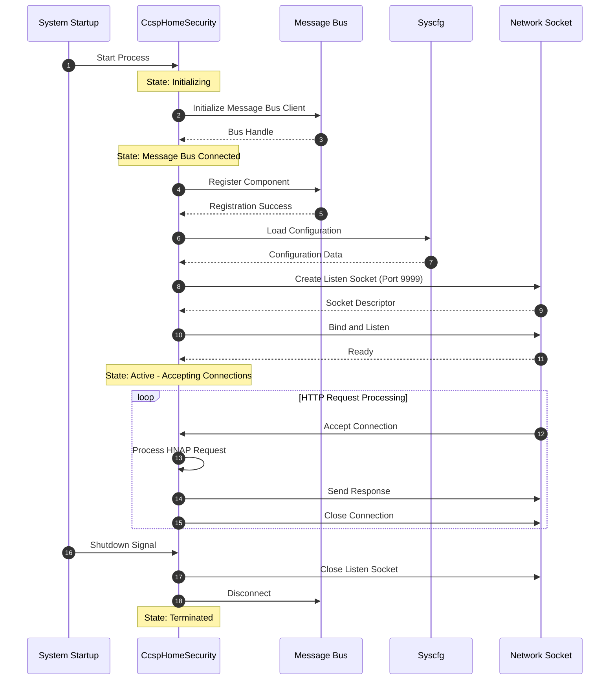
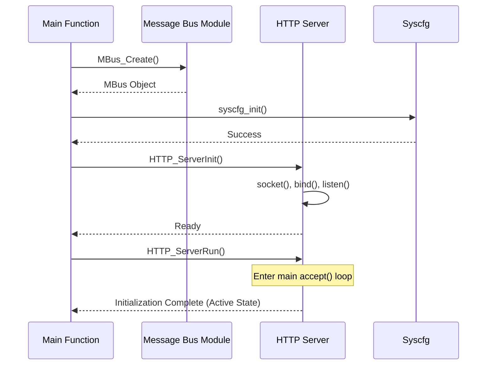
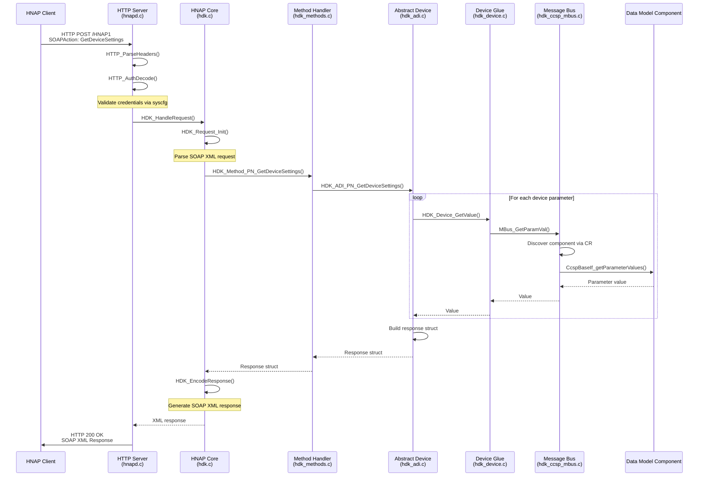
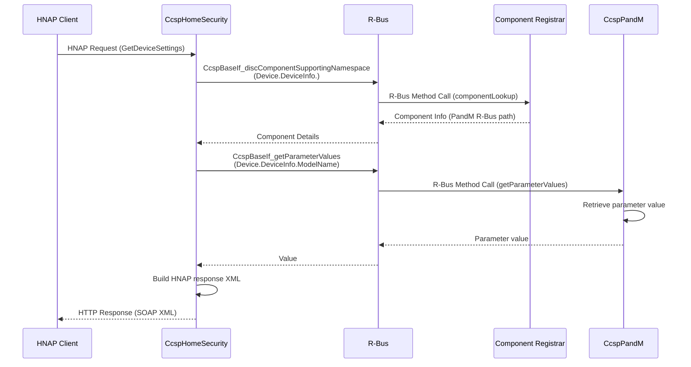
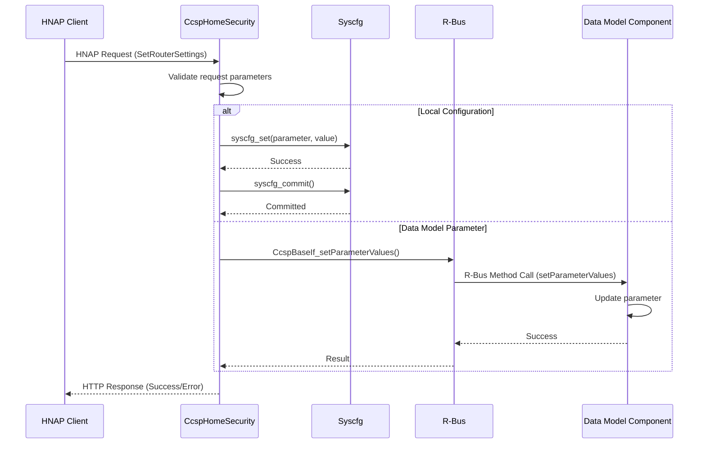

# CcspHomeSecurity Documentation

CcspHomeSecurity is the RDK-B component responsible for providing Home Network Administration Protocol (HNAP) server functionality for managing home security devices and settings. This component serves as a protocol adapter that bridges HNAP requests from external clients to the CCSP data model infrastructure, enabling remote management and configuration of home security devices through standardized HNAP interfaces. CcspHomeSecurity implements HNAP 1.0 protocol specifications and provides device abstraction layer for accessing various device settings, network configurations, and security parameters through XML-based SOAP messaging.

The component acts as a standalone HTTP server listening for HNAP requests and translating them into CCSP message bus calls to access the underlying data model. It handles authentication, request parsing, method dispatching, and response generation for all supported HNAP operations.

**Key Features & Responsibilities**: 

- **HNAP Protocol Server**: Implements HNAP 1.0 server functionality including HTTP request handling, SOAP/XML parsing, and response generation for home network device management operations
- **Device Settings Management**: Provides access to device configuration parameters including network settings, wireless configurations, firmware information, and administrative credentials through HNAP interfaces
- **Authentication and Security**: Implements HTTP Basic Authentication for HNAP requests and validates credentials against system configuration to ensure secure access to device management functions
- **CCSP Data Model Integration**: Translates HNAP method calls into CCSP message bus operations for reading and writing TR-181 data model parameters across multiple RDK-B components
- **Network Management APIs**: Exposes HNAP methods for network configuration including LAN settings, wireless settings, port mappings, MAC filtering, and connected device enumeration

## Design

CcspHomeSecurity follows a request-response architecture designed around the HNAP protocol specification. The design emphasizes protocol compliance, secure authentication, and seamless integration with the CCSP middleware infrastructure. The component operates as a single-threaded HTTP server that processes HNAP requests synchronously, parsing incoming XML payloads, dispatching to appropriate method handlers, and generating XML responses.

The architecture separates HNAP protocol handling from device-specific operations through a well-defined abstraction layer. The core protocol engine manages HTTP communication, XML serialization/deserialization, and SOAP message processing, while the Abstract Device Interface (ADI) layer provides device-agnostic implementations of HNAP methods. The device glue layer connects ADI implementations to the CCSP message bus for accessing the underlying data model.

The northbound interface accepts HTTP POST requests on the `/HNAP1` endpoint, with SOAP Action headers identifying the requested method. The southbound interface utilizes CCSP message bus APIs for component discovery, parameter retrieval, and parameter modification across the RDK-B middleware stack. The component registers with the message bus as a client and discovers component destinations through the Component Registrar. Configuration persistence is achieved through syscfg APIs for local storage and PSM integration for TR-181 parameter persistence.

### Prerequisites and Dependencies

**Build-Time Flags and Configuration:**

| Configure Option | DISTRO Feature | Build Flag | Purpose | Default |
|------------------|----------------|------------|---------|---------|
| `--enable-mountutils` | `MountUtils` | `LIBRDKCONFIG_BUILD` | Enable rdkconfig library for configuration file management as replacement for mountutils | Disabled |
| `--enable-unitTestDockerSupport` | N/A | `UNIT_TEST_DOCKER_SUPPORT` | Enable Docker-based unit testing infrastructure with mock components | Disabled |
| N/A | `safec` | `SAFEC_DUMMY_API` | Define dummy SafeC API macros when SafeC library is not available | Enabled when safec absent |

**RDK-B Platform and Integration Requirements:**

- **RDK-B Components**: `CcspCommonLibrary`, `CcspCr`, `Utopia`
- **HAL Dependencies**: No direct HAL dependencies
- **Systemd Services**: `CcspCrSsp.service` must be active before `CcspHomeSecurity` starts for component registration
- **Message Bus**: CCSP message bus (R-Bus) client registration for accessing data model components
- **Configuration Files**: Syscfg configuration database for authentication credentials and device settings
- **Startup Order**: Initialize after message bus and Component Registrar are operational

**Threading Model:** 

CcspHomeSecurity implements a single-threaded architecture centered around a synchronous HTTP request processing loop.

- **Threading Architecture**: Single-threaded with blocking I/O
- **Main Thread**: Handles all HTTP server operations including socket accept, request parsing, HNAP method execution, and response generation in a sequential manner
- **Synchronization**: No explicit synchronization mechanisms required due to single-threaded design

### Component State Flow

**Initialization to Active State**

CcspHomeSecurity follows a straightforward initialization sequence focused on establishing message bus connectivity and starting the HTTP server.

**Runtime State Changes and Context Switching**

During normal operation, CcspHomeSecurity maintains a steady state while processing HNAP requests sequentially.

**State Change Triggers:**

- Message bus disconnection events requiring reconnection attempts to restore data model access
- Configuration parameter changes through syscfg affecting authentication credentials or device settings
- Network socket errors causing server restart or connection handling failures

**Context Switching Scenarios:**

- Switching between authenticated and unauthenticated request handling based on HNAP method requirements
- Transitioning between read-only operations (GetDeviceSettings) and write operations (SetDeviceSettings) requiring different data model access patterns

### Call Flow

**Initialization Call Flow:**

**Request Processing Call Flow:**

The most critical flow is processing an HNAP GetDeviceSettings request, which demonstrates the complete request-response cycle.

## Internal Modules

CcspHomeSecurity is organized into specialized modules handling protocol processing, method dispatch, and data access layers.

| Module/Class | Description | Key Files |
|-------------|------------|-----------|
| **HTTP/HNAP Server** | Main HTTP server daemon processing incoming HNAP requests, handling socket operations, HTTP header parsing, and authentication validation | `hnapd.c` |
| **HNAP Protocol Engine** | Core HNAP protocol implementation managing request parsing, method routing, SOAP message processing, and XML response generation | `hdk.c`, `hdk.h` |
| **Context Manager** | Request context management maintaining per-request state including file handles, authentication status, and reboot flags | `hdk_context.c`, `hdk_context.h` |
| **Method Handlers** | HNAP method callback implementations providing entry points for all supported HNAP operations with request validation and response preparation | `hdk_methods.c`, `hdk_methods.h` |
| **Abstract Device Interface** | Device-agnostic HNAP method implementations providing logical operations for device management without platform-specific details | `hdk_adi.c`, `hdk_adi.h` |
| **Device Glue Layer** | Platform-specific device operations connecting HNAP ADI layer to CCSP data model through message bus APIs and syscfg storage | `hdk_device.c` |
| **Message Bus Client** | CCSP message bus integration providing parameter get/set operations, component discovery, and data model object manipulation | `hdk_ccsp_mbus.c`, `hdk_ccsp_mbus.h` |
| **Encoding Utilities** | XML and Base64 encoding/decoding functions for SOAP message processing and authentication credential handling | `hdk_encode.c`, `hdk_encode.h` |
| **Data Structures** | HNAP type system implementation including structures, enumerations, and type conversion utilities for protocol data representation | `hdk_data.c`, `hdk_data.h` |

## Component Interactions

CcspHomeSecurity maintains interactions with CCSP middleware components and system services for data model access and configuration management.

### Interaction Matrix

| Target Component/Layer | Interaction Purpose | Key APIs/Endpoints |
|------------------------|-------------------|------------------|
| **RDK-B Middleware Components** |
| Component Registrar | Component discovery for locating data model providers | `CcspBaseIf_discComponentSupportingNamespace()` |
| CcspPandM | Device management parameters including LAN settings, device info, firmware details | `CcspBaseIf_getParameterValues()`, `CcspBaseIf_setParameterValues()` |
| CcspWiFi | Wireless configuration including SSID, security settings, radio parameters | `CcspBaseIf_getParameterValues()`, `CcspBaseIf_setParameterValues()` |
| PSM | Configuration parameter persistence and retrieval | `CcspBaseIf_getParameterValues()`, `CcspBaseIf_setParameterValues()` |
| **System & Configuration Layers** |
| Syscfg | Local configuration storage for authentication credentials and device settings | `syscfg_init()`, `syscfg_get()`, `syscfg_set()`, `syscfg_commit()` |
| R-Bus Message Bus | IPC mechanism for CCSP component communication | `CCSP_Message_Bus_Init()`, Message bus client APIs |

**Events Published by CcspHomeSecurity:**

CcspHomeSecurity does not publish events. It operates as a request-response service processing HNAP requests synchronously.

### IPC Flow Patterns

**Primary IPC Flow - HNAP Parameter Get:**

**Configuration Update Flow:**

## Implementation Details

### Message Bus APIs Integration

CcspHomeSecurity utilizes CCSP message bus APIs for accessing the TR-181 data model across RDK-B components.

**Core Message Bus APIs:**

| Message Bus API | Purpose | Implementation File |
|---------|---------|-------------------|
| `MBus_Create()` | Initialize message bus object with subsystem configuration and component registration | `hdk_ccsp_mbus.c` |
| `MBus_Destroy()` | Clean up message bus resources and disconnect from bus | `hdk_ccsp_mbus.c` |
| `MBus_GetParamVal()` | Retrieve single parameter value from data model with component discovery | `hdk_ccsp_mbus.c` |
| `MBus_SetParamVal()` | Set single parameter value in data model with type validation | `hdk_ccsp_mbus.c` |
| `MBus_GetParamList()` | Retrieve multiple parameter values in single operation | `hdk_ccsp_mbus.c` |
| `MBus_SetParamList()` | Set multiple parameter values atomically | `hdk_ccsp_mbus.c` |
| `MBus_Commit()` | Commit pending parameter changes to persistent storage | `hdk_ccsp_mbus.c` |
| `MBus_AddObject()` | Create new data model object instance | `hdk_ccsp_mbus.c` |
| `MBus_DelObject()` | Delete data model object instance | `hdk_ccsp_mbus.c` |
| `CcspBaseIf_discComponentSupportingNamespace()` | Discover component responsible for data model namespace | `hdk_ccsp_mbus.c` |

### Key Implementation Logic

- **HTTP Server Engine**: Single-threaded HTTP server implementation in `hnapd.c` using standard POSIX socket APIs with blocking accept/read/write operations for processing HNAP requests with configurable port specified as command line argument

- **HNAP Protocol Processing**: XML-based SOAP message parsing and generation implemented in `hdk.c` using custom XML parser, with method dispatch based on SOAPAction header matching to registered HNAP method handlers

- **Authentication Mechanism**: HTTP Basic Authentication validation implemented in `hnapd.c` with Base64-decoding of Authorization header and credential verification against syscfg stored admin username/password

- **Device Abstraction Layer**: Abstract Device Interface in `hdk_adi.c` provides device-agnostic implementations of HNAP methods, delegating device-specific operations to `hdk_device.c` glue layer for CCSP data model mapping

- **Error Handling Strategy**: HNAP error codes mapped to `HDK_Enum_Result` enumeration with HTTP 200 responses containing SOAP fault details for protocol-level errors, and component-level error propagation through message bus return codes

- **Logging & Debugging**: Syslog-based logging using `chs_log.h` macros with severity levels (LOG_ERR, LOG_WARNING, LOG_INFO) for request processing, message bus operations, and error conditions

### Key Configuration Files

| Configuration File | Purpose | Override Mechanisms |
|--------------------|---------|--------------------|
| CCSP message bus config | Message bus configuration specifying R-Bus connection parameters referenced by CCSP_MSG_BUS_CFG macro | Environment variables for bus configuration paths |
| Syscfg database | Authentication credentials (admin username/password) and device configuration parameters | `syscfg_set` command-line utility |
