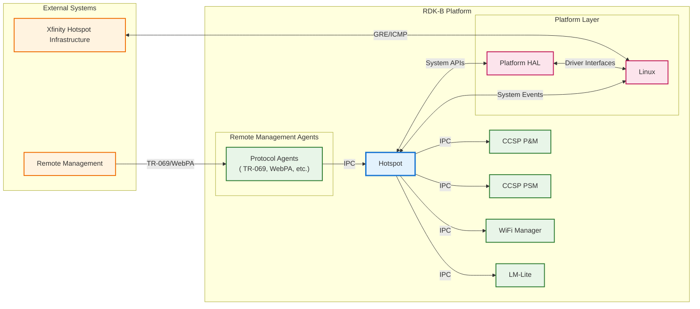
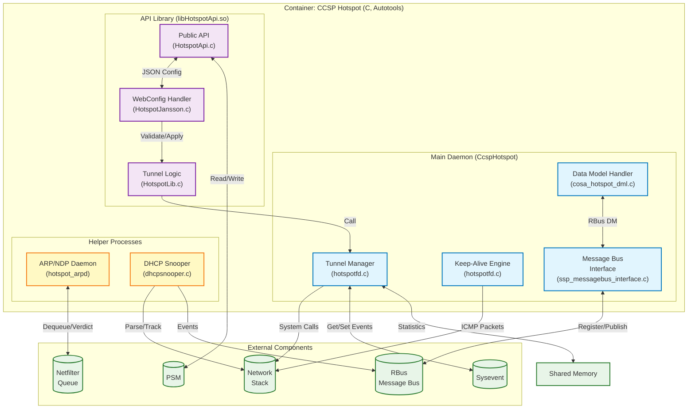
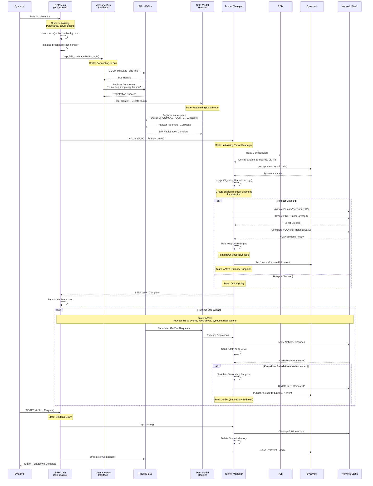
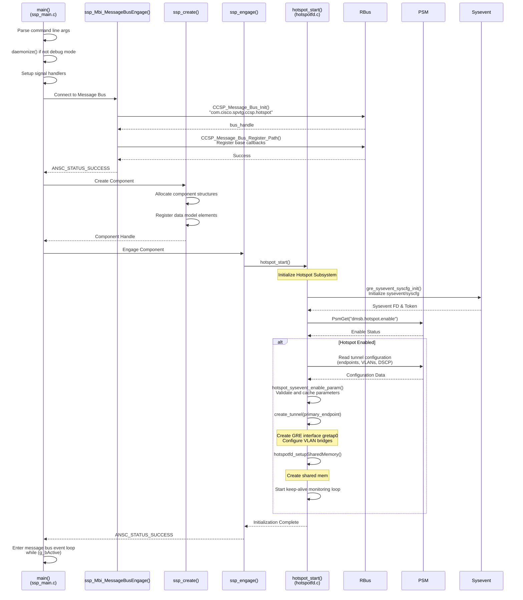
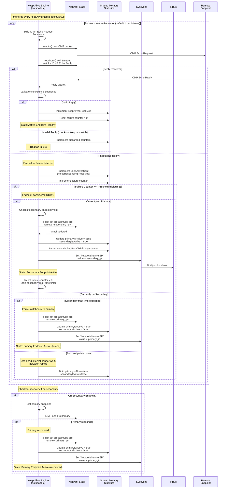
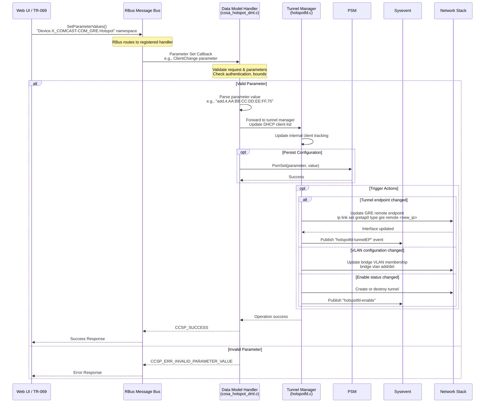
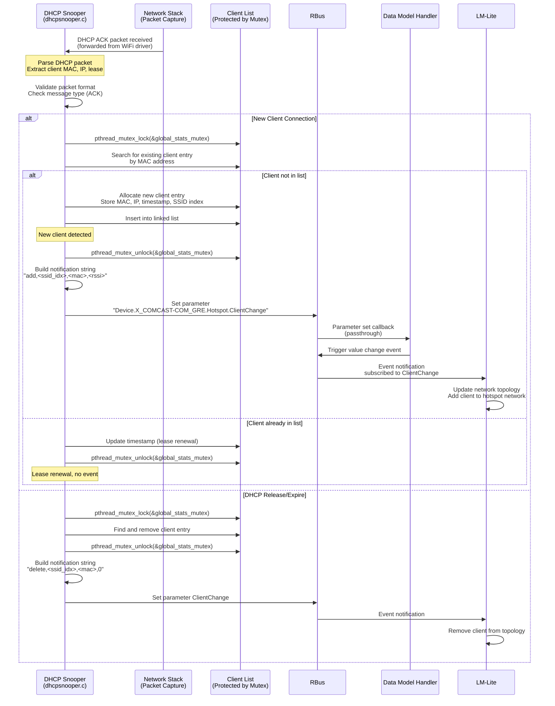
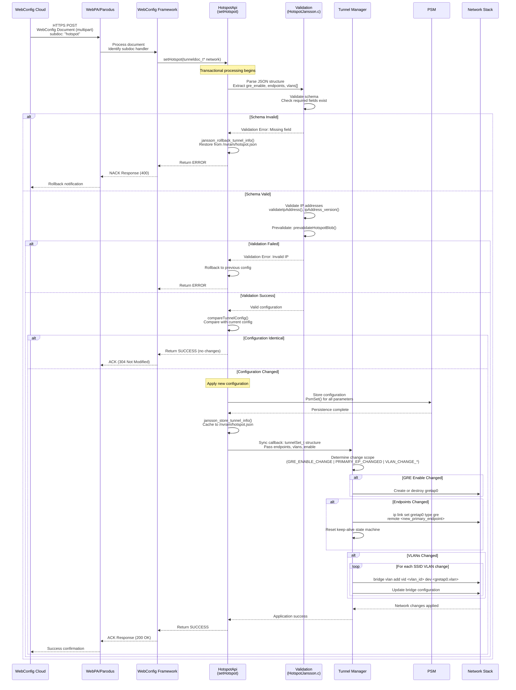
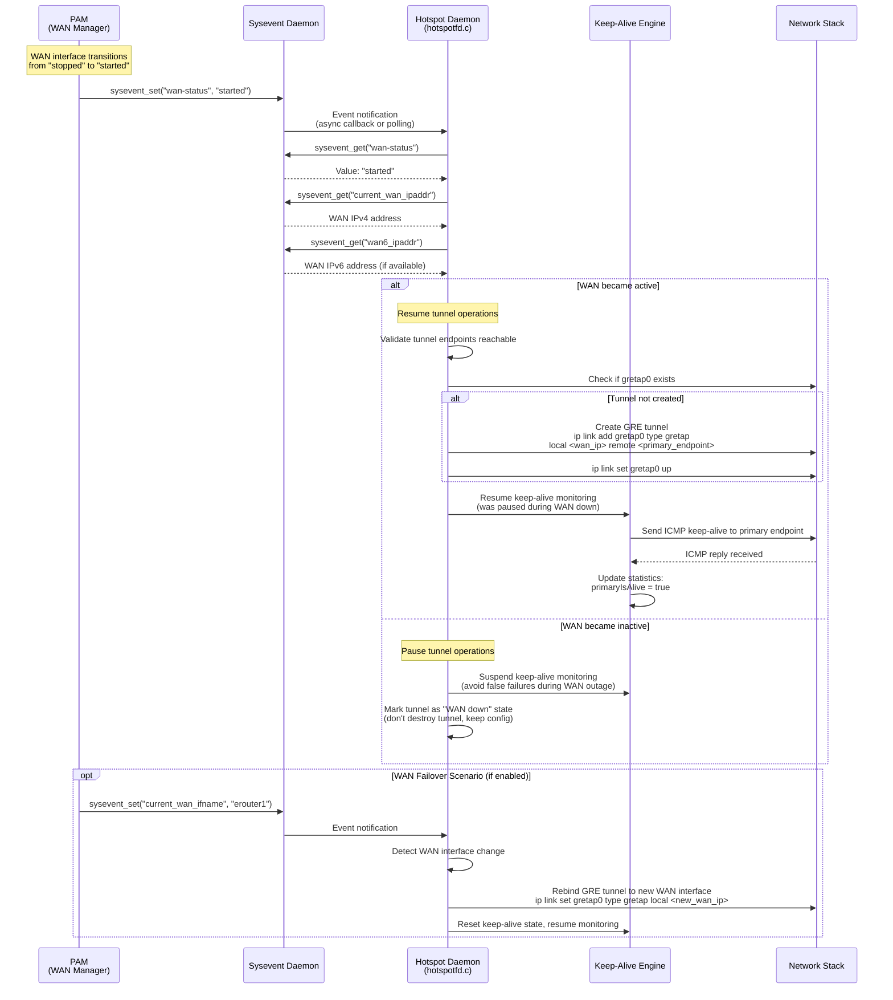

# CCSP Hotspot Component Documentation

The CCSP Hotspot component is a critical middleware service in the RDK-B stack that manages GRE (Generic Routing Encapsulation) tunnels for Xfinity Hotspot functionality. This component enables service providers to offer secure guest WiFi access on customer premises equipment (CPE) by establishing and maintaining encrypted tunnels to remote hotspot endpoints.

The Hotspot component provides three primary services to the RDK-B device: **GRE Tunnel Management** - creates, configures, and maintains GRE tunnels with primary and secondary remote endpoints for redundancy; **Endpoint Health Monitoring** - implements intelligent ICMP keep-alive mechanisms with automatic failover between primary and secondary endpoints when connectivity issues are detected; **VLAN and Client Management** - manages VLAN configurations for hotspot SSIDs across multiple frequency bands (2.4GHz, 5GHz, 6GHz) and provides DHCP snooping capabilities for tracking connected client devices.

At the module level, the component consists of multiple cooperating processes: the main hotspot daemon (CcspHotspot) handles tunnel lifecycle and endpoint monitoring, the HotspotApi library provides a programmatic interface for configuration and WebConfig integration, the hotspot_arpd process manages ARP/NDP traffic using netfilter queue mechanisms, the DHCP snooper tracks client connections and generates telemetry events, and the tunnel test agent validates connectivity. These modules work together through RBus, sysevent, and shared memory mechanisms to provide a robust hotspot service infrastructure.



**Key Features & Responsibilities**: 

- **GRE Tunnel Management**: Creates and maintains GRE tunnels (`gretap0`) to Xfinity hotspot infrastructure with configurable primary and secondary remote endpoints, supporting both IPv4 and IPv6 addressing with automatic failover capabilities
- **Endpoint Health Monitoring**: Implements sophisticated ICMP keep-alive mechanism with configurable intervals (default 60s), threshold-based failover (default 5 failures), and automatic switchback to primary endpoint after recovery
- **VLAN Configuration**: Manages VLAN tagging for multiple hotspot SSIDs across 2.4GHz, 5GHz, and 6GHz bands, coordinating with WiFi manager and Linux bridge subsystem for proper traffic isolation
- **DHCP Client Tracking**: Provides DHCP snooping functionality to monitor client connections, generate presence notifications, and support Circuit ID and Remote ID options for subscriber identification
- **WebConfig Integration**: Supports RFC-based configuration through WebConfig framework, enabling cloud-managed tunnel and VLAN provisioning with transactional rollback capabilities
- **ARP/NDP Processing**: Handles ARP solicitation for IPv4 and Neighbor Discovery Protocol (NDP) for IPv6 using netfilter queue mechanisms, with MAPT/NAT46 translation support
- **Telemetry and Diagnostics**: Publishes operational metrics including tunnel status, endpoint switches, keep-alive statistics, and client activity events through RDK Telemetry framework


## Design

The CCSP Hotspot component is designed as a multi-process architecture with clear separation of concerns. The core design centers around the main daemon (CcspHotspot/hotspotfd) that acts as the control plane for tunnel lifecycle management and health monitoring, while specialized helper processes handle traffic plane functions. The component integrates tightly with the RDK-B middleware stack through multiple IPC mechanisms - RBus for data model registration and event publication, sysevent for platform-level event coordination, and PSM for persistent configuration storage. This distributed design allows the component to operate efficiently with minimal resource consumption while maintaining high availability for the hotspot service.

The design emphasizes operational resilience through several key mechanisms: dual endpoint support with automatic failover ensures continuous service even when the primary tunnel endpoint becomes unreachable; shared memory segments provide lock-free statistics sharing between the main daemon and monitoring tools; and transactional configuration updates through WebConfig allow atomic changes with automatic rollback on validation failures. The component follows the CCSP plugin architecture, registering its data model namespace (`Device.X_COMCAST-COM_GRE.Hotspot`) with the system and responding to both synchronous parameter queries and asynchronous configuration events.

For northbound interactions, the component exposes a TR-181 compliant data model accessible via RBus/D-Bus, allowing management entities (Web UI, TR-069 ACS, SNMP) to configure tunnel endpoints, keep-alive parameters, and enable/disable the hotspot service. The WebConfig integration provides an alternative configuration path optimized for cloud-managed deployments, using JSON documents validated against schemas and applied transactionally. Southbound interactions occur primarily through system calls to the Linux network stack for GRE interface creation, VLAN configuration, and bridge management, while netfilter queue integration enables packet-level processing for ARP/NDP handling.

IPC mechanisms are carefully selected based on use case requirements: RBus provides the primary data model and event bus with support for method calls, parameter get/set, and publish/subscribe patterns; sysevent handles asynchronous system-wide events like WAN status changes and interface state transitions; PSM stores persistent configuration that survives reboots; and shared memory segments provide high-performance statistics access without IPC overhead. Thread safety is ensured through mutex protection for shared data structures, particularly in the DHCP snooper module where client lists are accessed concurrently.

Data persistence and storage are managed through multiple mechanisms: PSM stores critical configuration parameters like tunnel endpoints, VLAN IDs, and enable flags that survive reboots; JSON files in `/nvram` cache WebConfig documents for rollback and WAN failover scenarios; and temporary files in `/tmp` hold runtime state such as current WAN IP addresses and tunnel status. The component also maintains shared memory segments for keep-alive statistics that need to be accessed by external monitoring tools without involving the main process.



### Prerequisites and Dependencies

The CCSP Hotspot component requires a fully functional RDK-B middleware environment with specific platform capabilities and dependent services. The component is built using the Autotools build system and integrates with the Yocto Project through the `ccsp-hotspot.bb` recipe in the `meta-rdk-broadband` layer.

**Build-Time Flags and Configuration:**

| Configure Option | DISTRO Feature | Build Flag | Purpose | Default |
|------------------|----------------|------------|---------|---------|
| `--enable-unitTestDockerSupport` | N/A | `UNIT_TEST_DOCKER_SUPPORT` | Enable Docker container support for unit testing; compiles test harness (`HotspotApiTest`, `HotspotFdTest`) with mocking frameworks for isolated component testing | Disabled |
| `--enable-wanfailover` | `WanFailOverSupportEnable` | `WAN_FAILOVER_SUPPORTED` | Enable WAN failover support for multi-WAN scenarios; subscribes to WAN Manager interface change events and rebinds GRE tunnel to active WAN interface automatically | Disabled |
| `--enable-core_net_lib_feature_support` | `core-net-lib` | `CORE_NET_LIB` | Enable advanced core networking library for enhanced network operations; links against libnet for low-level packet construction and network interface manipulation | Disabled |
| N/A | `safec` | (absence triggers `SAFEC_DUMMY_API`) | Enable SafeC library for bounds-checked string operations; provides memory-safe alternatives to standard C string functions (strcpy_s, memcpy_s, etc.) for vulnerability mitigation | Enabled (recommended) |
| N/A | `OneWifi` | `RDK_ONEWIFI` | Enable OneWifi unified WiFi stack integration; increases MAX_VAP from 4 to 6 to support 6GHz band hotspot SSIDs (hotspot_open_6g, hotspot_secure_6g) | Disabled |
| Platform-specific | N/A | `_CBR_PRODUCT_REQ_` | CBR product variant configuration; sets MAX_VAP=5 with specific PSM VLAN mapping for Comcast Business Router platforms | Platform-dependent |
| Platform-specific | N/A | `_XB8_PRODUCT_REQ_` | XB8 (Gen 3) product configuration; enables 6GHz support when combined with RDK_ONEWIFI, configures platform-specific VLAN sync data structures | Platform-dependent |
| Platform-specific | N/A | `_XB7_PRODUCT_REQ_` | XB7 (Gen 2) product configuration; adjusts VLAN mappings and WiFi interface names for XB7 hardware platform | Platform-dependent |
| Platform-specific | N/A | `_SCXF11BFL_PRODUCT_REQ_` | SCXF11 (fiber) product configuration; similar to XB8 with 6GHz support and platform-specific network interface configurations | Platform-dependent |
| Platform-specific | N/A | `FEATURE_SUPPORT_MAPT_NAT46` | Enable MAP-T (Mapping of Address and Port with Translation) NAT46 support in ARP daemon for IPv4/IPv6 translation in hotspot traffic | Platform-dependent |
| Platform-specific | N/A | `AMENITIES_NETWORK_ENABLED` | Enable amenities network support for hospitality/MDU deployments; creates separate bridge interfaces for amenities SSIDs with dedicated DHCP snooping queues | Disabled |

**Configuration Examples:**

```bash
# Basic build with safec and standard features
DISTRO_FEATURES += "safec"

# Build with WAN failover support
DISTRO_FEATURES += "safec WanFailOverSupportEnable"
EXTRA_OECONF_append_pn-ccsp-hotspot = " --enable-wanfailover"

# Build with OneWifi 6GHz support
DISTRO_FEATURES += "safec OneWifi"

# Build with all optional features
DISTRO_FEATURES += "safec core-net-lib OneWifi WanFailOverSupportEnable"
EXTRA_OECONF_append_pn-ccsp-hotspot = " --enable-wanfailover --enable-core_net_lib_feature_support"

# Build with unit test support
EXTRA_OECONF_append_pn-ccsp-hotspot = " --enable-unitTestDockerSupport"
```

**Flag Impact on Code Behavior:**

- **RDK_ONEWIFI**: Changes `MAX_VAP` definition from 4 to 6, adds support for `VAP_NAME_11` (hotspot_open_6g) and `VAP_NAME_12` (hotspot_secure_6g), includes additional PSM VLAN keys for 6GHz bands
- **WAN_FAILOVER_SUPPORTED**: Enables RBus subscription thread for `Device.X_RDK_WanManager.CurrentActiveInterface` events, adds WAN interface rebinding logic, includes failover JSON configuration handling
- **CORE_NET_LIB**: Uses `libnet` library calls for network operations instead of system() calls, provides more efficient packet construction and interface manipulation
- **AMENITIES_NETWORK_ENABLED**: Expands DHCP snooper to handle additional netfilter queues for amenities networks, creates separate bridge interfaces and VLAN configurations for hospitality SSIDs
- **FEATURE_SUPPORT_MAPT_NAT46**: Enables IPv4/IPv6 address translation in ARP daemon, reads MAP-T configuration from sysevent, performs address mapping for dual-stack hotspot deployments

<br>

**RDK-B Platform and Integration Requirements:**

- **DISTRO Features**: Configure options and DISTRO features are detailed in the Build-Time Flags table above. Key features include:
  - `safec` - Recommended for production builds to enable memory-safe string operations
  - `core-net-lib` - Optional, provides enhanced networking capabilities via libnet
  - `OneWifi` - Required for 6GHz hotspot SSID support on compatible platforms
  - `WanFailOverSupportEnable` - Required for multi-WAN deployments with automatic failover

- **Build Dependencies**: Required Yocto packages and libraries that must be present at build time:
  - `ccsp-common-library` - CCSP framework and base utilities
  - `dbus` - D-Bus message bus library
  - `libnetfilter-queue` - Netfilter queue library for packet processing
  - `utopia` - System configuration and event framework
  - `ccsp-lm-lite` - LAN Manager Lite for client tracking integration
  - `telemetry` - RDK Telemetry framework for metrics reporting
  - `libunpriv` - Privilege management library
  - `safec` - Safe C library for bounds-checked operations
  - `breakpadwrapper` - Crash reporting framework
  - `webconfig-framework` - WebConfig RFC support
  - `jansson` - JSON parsing library
  - `core-net-lib` (conditional) - Core networking library

- **RDK-B Components**: The following middleware components must be running before hotspot starts:
  - **CR (Component Registrar)** - Component registry and discovery service
  - **PSM (Persistent Storage Manager)** - Configuration persistence layer
  - **PAM (Protocol Address Management)** - WAN interface management
  - **WiFi Manager** - WiFi configuration and control (for SSID enable/disable queries)
  - **Sysevent daemon** - System event coordination

- **HAL Dependencies**: The component does not directly depend on HAL APIs but requires:
  - Linux kernel with GRE tunnel support (`ip_gre`, `gre` kernel modules)
  - VLAN support in kernel (`8021q` module)
  - Bridge support (`bridge` module)
  - Netfilter support with QUEUE target

- **Systemd Services**: The hotspot systemd service unit typically depends on:
  - `ccsp-cr.service` - Component Registrar must be active
  - `ccsp-psm.service` - PSM must be initialized
  - `syseventd.service` - Sysevent daemon must be running
  - Network prerequisite services (varies by platform)

- **Message Bus**: RBus configuration requirements:
  - RBus daemon must be running
  - Component registers namespace: `Device.X_COMCAST-COM_GRE.Hotspot`
  - Must have permissions to publish events and register data model elements
  - Requires CCSP D-Bus configuration file: `/etc/ccsp_msg.cfg` (or platform-specific path)

- **Configuration Files**: Mandatory configuration files and expected locations:
  - `/etc/ccsp_msg.cfg` - CCSP message bus configuration
  - `/etc/debug.ini` - Debug and logging configuration
  - `/nvram/syscfg.db` - System configuration database (managed by syscfg)
  - `/nvram/hotspot.json` - Hotspot configuration cache (created at runtime)
  - PSM database must contain hotspot configuration namespace

- **Startup Order**: Components that must initialize before hotspot:
  1. System logging (`syslog`)
  2. Sysevent daemon (`syseventd`)
  3. PSM (`CcspPsm`)
  4. Component Registrar (`CcspCr`)
  5. PAM (`CcspPandM`) - for WAN status monitoring
  6. WiFi Manager - for SSID state queries

**Threading Model**

The CCSP Hotspot component uses a multi-threaded architecture designed to handle concurrent tunnel management, health monitoring, event processing, and client tracking without blocking critical operations.

- **Threading Architecture**: Multi-threaded with main event loop and specialized worker threads for different operational domains
- **Main Thread**: Handles CCSP message bus event loop, RBus callbacks, TR-181 parameter get/set operations, tunnel lifecycle management, ICMP keep-alive packet generation and validation, and shared memory management for statistics
- **Worker Threads**: 

| Thread Name | Thread Function | Purpose | Creation Location | Synchronization |
|------------|----------------|---------|-------------------|-----------------|
| **Sysevent Handler Thread** | `hotspotfd_sysevent_handler()` | Monitors sysevent notifications for configuration parameter changes (primary/secondary endpoints, keep-alive settings, enable/disable), WAN status transitions, DHCP snooper settings, and WAN failover events. Registers async notifications and processes events in dedicated event loop. | `hotspotfd.c`<br/>`pthread_create(&sysevent_tid, NULL, hotspotfd_sysevent_handler, NULL)` | Event-driven with sysevent async notifications, no explicit locks (sysevent handles concurrency) |
| **DHCP Snooper Thread** | `dhcp_snooper_init()` | Processes DHCP packets from netfilter queues to track client connections on hotspot SSIDs. Parses DHCP ACK/RELEASE messages, maintains dynamic client list, extracts Circuit ID/Remote ID options, and publishes client presence events via RBus. | `hotspotfd.c`<br/>`pthread_create(&dhcp_snooper_tid, NULL, dhcp_snooper_init, NULL)` | `pthread_mutex_t global_stats_mutex` protects client list during traversal, insertion, deletion operations |
| **RBus WAN Subscriber Thread** | `handle_rbusSubscribe()` | Subscribes to WAN Manager's current active interface change events (`Device.X_RDK_WanManager.CurrentActiveInterface`) for WAN failover support. Handles interface switching and tunnel rebinding during WAN failover scenarios. | `hotspotfd.c`<br/>`pthread_create(&rbus_tid, NULL, handle_rbusSubscribe, NULL)`<br/>(Conditional: `WAN_FAILOVER_SUPPORTED`) | RBus subscription with retry logic (up to 10 attempts), event-driven callbacks |
| **IPv6 SLAAC Thread** | `checkglobalipv6()` | Performs IPv6 Stateless Address Autoconfiguration (SLAAC) on GRE tunnel interface during connectivity tests. Monitors for global IPv6 address acquisition with 10-second timeout, verifies Duplicate Address Detection (DAD) completion. Used in XfinityTestAgent tunnel validation. | `tunnelcheck.c`<br/>`pthread_create(&slaacthread, NULL, checkglobalipv6, NULL)` | Thread is joined after completion (`pthread_join`), single-shot operation with timeout mechanism |

- **Synchronization Mechanisms**: 
  - **Mutex Protection**: `pthread_mutex_t global_stats_mutex` in DHCP snooper for thread-safe client list access
  - **Signal Handlers**: `SIGTERM`, `SIGINT`, `SIGKILL` handlers for graceful shutdown with atomic flag checks
  - **Lock-free Statistics**: Keep-alive statistics in shared memory use single-writer (daemon), multiple-reader pattern without locks
  - **Event-driven Coordination**: Sysevent async notifications and RBus event subscriptions eliminate polling overhead

**Helper Process Threading Model:**

- **hotspot_arpd**: Single-threaded process using select-based event loop to process ARP/NDP packets from netfilter queues synchronously. No internal threading required as packet processing is sequential.

### Component State Flow

**Initialization to Active State**

The CCSP Hotspot component follows a structured initialization sequence that transitions through several states before reaching full operational readiness. The component starts when systemd launches the CcspHotspot daemon, which then performs subsystem initialization in a specific order to ensure all dependencies are satisfied.



**Runtime State Changes and Context Switching**

During normal operation, the hotspot component undergoes several runtime state changes driven by external events and tunnel health monitoring. These state changes are designed to maintain service continuity in the face of network disruptions or configuration updates.

**State Change Triggers:**

- **WAN Status Changes**: When sysevent `wan-status` transitions to "started" or "stopped", the component validates tunnel endpoints and may suspend/resume keep-alive monitoring. If WAN is down, keep-alive checks are paused to avoid unnecessary failure detection.

- **Keep-Alive Failures**: When consecutive ICMP keep-alive failures reach the threshold (default 5), the component switches from the primary endpoint to the secondary endpoint. This state change updates the GRE tunnel's remote endpoint IP and publishes a `hotspotfd-tunnelEP` sysevent to notify other components.

- **Endpoint Recovery**: After switching to the secondary endpoint, the component continues monitoring the primary endpoint. Upon successful primary endpoint recovery detection, it switches back automatically. A configurable "secondary maximum time" parameter can force switchback even if both endpoints respond.

- **Configuration Updates**: When WebConfig delivers a new hotspot configuration document, or when parameters change via TR-181 data model, the component validates the changes and applies them transactionally:
  - If GRE enable status changes, tunnels are created or destroyed
  - If endpoint IPs change, the GRE remote address is updated without tunnel recreation
  - If VLANs change, bridge and VLAN configurations are updated incrementally
  - Failed validation triggers automatic rollback to the last known good configuration

- **WAN Failover** (if enabled): On platforms supporting WAN failover, when `current_wan_ifname` sysevent changes, the component re-evaluates the WAN interface used for GRE encapsulation and may rebind the tunnel to the new WAN interface.

- **WiFi SSID State Changes**: When hotspot SSIDs are enabled or disabled via WiFi manager, the component queries SSID state and adjusts VLAN bridge memberships accordingly, ensuring traffic isolation is maintained only for active SSIDs.

**Context Switching Scenarios:**

- **Primary ↔ Secondary Endpoint Switching**: The most common runtime context switch occurs during endpoint failover. The component maintains a state machine tracking the active endpoint, failed keep-alive counts, and switchback timers. State transitions are atomic - the GRE remote endpoint is updated via `ip link set gretap0 type gre remote <new_ip>`, and statistics counters are incremented in shared memory. Recovery involves exponential backoff to avoid flapping between endpoints.

- **WebConfig Transaction Mode**: When processing WebConfig documents, the component enters a transactional mode where changes are staged but not committed. Upon validation success, all changes are applied atomically; upon failure, a rollback mechanism restores the previous configuration from cached JSON in `/nvram/hotspot.json`. This ensures configuration consistency even if the component crashes during update.

- **DHCP Snooper Client Tracking**: The DHCP snooper maintains a dynamic client list that changes as devices connect and disconnect. When a client presence event is detected (DHCP ACK packets), the snooper adds the client to its internal list and publishes an RBus event to LM-Lite. Clients are aged out after lease expiry or explicit DHCP release.

### Call Flow

**Initialization Call Flow:**



**Request Processing Call Flow:**

The most critical operational flow is the tunnel endpoint health monitoring and automatic failover sequence, which ensures continuous hotspot service availability.



## Internal Modules

The CCSP Hotspot component is organized into several logical modules, each responsible for specific aspects of tunnel management, health monitoring, and client tracking. These modules are compiled into separate executables and libraries that cooperate through IPC mechanisms.

| Module/Class | Description | Key Files |
|-------------|------------|-----------|
| **SSP Framework** | Provides the CCSP Single Service Process framework implementation, handling component registration, message bus engagement, lifecycle management (initialize/engage/cancel), and signal handling. This module bootstraps the entire component. | `ssp_main.c`, `ssp_action.c`, `ssp_messagebus_interface.c`, `ssp_global.h`, `ssp_internal.h` |
| **Data Model Handler** | Implements the TR-181 data model interface for `Device.X_COMCAST-COM_GRE.Hotspot` namespace. Handles parameter get/set operations, validates input, and bridges RBus/D-Bus calls to the tunnel manager logic. Exposes the `ClientChange` parameter for DHCP snooper integration. | `cosa_hotspot_dml.c`, `cosa_hotspot_dml.h`, `plugin_main.c` |
| **Tunnel Manager** | Core tunnel lifecycle manager responsible for GRE tunnel creation, configuration, and destruction. Maintains tunnel state, coordinates with network stack for interface operations, manages VLAN bridge configurations, and handles sysevent-based coordination with other system components. | `hotspotfd.c`, `hotspotfd.h` |
| **Keep-Alive Engine** | Implements ICMP-based endpoint health monitoring with configurable intervals, thresholds, and policies. Manages the primary/secondary endpoint failover state machine, maintains keep-alive statistics in shared memory, and publishes endpoint change events via sysevent. | `hotspotfd.c` (hotspotfd_isPrimaryAlive, hotspotfd_isSecondaryAlive, keep-alive loop) |
| **Hotspot API Library** | Public library providing programmatic API for hotspot configuration and control. Used by WebConfig framework for RFC-based provisioning, implements configuration validation, comparison, and transactional application with rollback support. | `HotspotApi.c`, `libHotspotApi.h` |
| **WebConfig Handler** | Processes JSON-based WebConfig documents (subdoc: "hotspot"), performs schema validation using Jansson library, manages configuration persistence to PSM and filesystem, and coordinates with tunnel manager for atomic configuration updates. | `HotspotJansson.c`, `HotspotLib.c` |
| **DHCP Snooper** | Monitors DHCP traffic on hotspot SSIDs to track client connections, parses DHCP ACK packets to extract client MAC addresses and lease information, maintains a dynamic client list in memory, supports DHCP Option 82 (Circuit ID / Remote ID) for carrier-grade NAT deployments, and publishes client presence events via RBus. Receives DHCP packets from external sources (WiFi manager forwarding). | `dhcpsnooper.c`, `dhcpsnooper.h`, `dhcp.h` (DHCP packet structures) |
| **ARP/NDP Daemon** | Standalone process that handles ARP (IPv4) and Neighbor Discovery Protocol (IPv6) packet processing using netfilter queue mechanism. Receives packets from iptables/ip6tables NFQUEUE targets, validates source addresses, generates ARP replies or NDP neighbor advertisements, and supports MAPT/NAT46 address translation for dual-stack environments. | `hotspot_arpd.c` |
| **Tunnel Test Agent** | Diagnostic utility for validating tunnel connectivity, performs IPv6 SLAAC on GRE interface, verifies global IPv6 address acquisition, tests reachability to remote endpoints, and generates connectivity reports. Can be executed standalone or invoked by monitoring systems. | `tunnelcheck.c` |

## Component Interactions

The CCSP Hotspot component interacts extensively with other RDK-B middleware components, platform services, and external systems to deliver comprehensive hotspot functionality. These interactions span multiple IPC mechanisms and involve both synchronous request-response patterns and asynchronous event notifications.

### Interaction Matrix

The following table consolidates all component interactions, their purposes, and the specific APIs or endpoints used for communication.

| Target Component/Layer | Interaction Purpose | Key APIs/Endpoints |
|------------------------|-------------------|------------------|
| **RDK-B Middleware Components** |
| WiFi Manager (CcspWifiSsp) | Query SSID enable/disable status to determine if hotspot VAPs are active, coordinate VLAN configuration changes when SSIDs are enabled/disabled | RBus method call: `getParameterValues("Device.WiFi.SSID.{i}.Enable")`, `get_ssid_enable(ssidIdx)` wrapper function |
| LM-Lite (CcspLMLite) | Notify about hotspot client connections and disconnections for network topology tracking and analytics | RBus parameter set: `Device.X_COMCAST-COM_GRE.Hotspot.ClientChange` (format: `<add\|delete>,<ssid_idx>,<mac_addr>,<rssi>`), DM callback: `HotspotConnectedDevice_SetParamStringValue()` |
| PAM (CcspPandM) | Monitor WAN interface status to pause/resume keep-alive checks during WAN outages, query current WAN IP addresses for local endpoint validation | Sysevent subscription: `wan-status`, `current_wan_ipaddr`, `wan6_ipaddr`, Optional: `current_wan_ifname` (for WAN failover) |
| PSM (CcspPsm) | Persist tunnel configuration (endpoints, VLANs, enable flags) across reboots, read configuration during initialization | PSM API calls: `PsmGet()`, `PsmSet()` - Namespace: `dmsb.hotspot.enable`, `dmsb.hotspot.tunnel.1.PrimaryRemoteEndpoint`, `dmsb.hotspot.tunnel.1.SecondaryRemoteEndpoint`, `dmsb.hotspot.tunnel.1.interface.{i}.VLANID`, `dmsb.l2net.{i}.Vid` (per-SSID VLAN PSM keys) |
| CR (Component Registrar) | Register component at startup for discovery by other CCSP components and PAM | D-Bus/RBus registration: Component name `com.cisco.spvtg.ccsp.hotspot`, Namespace: `Device.X_COMCAST-COM_GRE.Hotspot`, Path: `/com/cisco/spvtg/ccsp/hotspot` |
| Telemetry (T2) | Report operational metrics and events for monitoring and analytics (tunnel status, endpoint switches, keep-alive failures, client counts) | T2 API: `t2_event_s()`, `t2_event_d()` - Markers: `HOTSPOT_TUNNEL_STATUS`, `HOTSPOT_ENDPOINT_SWITCH`, `HOTSPOT_CLIENT_COUNT`, Log parsing for RDK Telemetry 2.0 |
| WebPA / WebConfig Framework | Receive RFC-based configuration updates for tunnel parameters via cloud-managed deployment model | WebConfig callback registration: `register_sub_doc_handler("hotspot", setHotspot, deleteHotspot)`, Function: `setHotspot(void* network)` receives `tunneldoc_t*` structure |
| **System & HAL Layers** |
| Linux Network Stack | Create and configure GRE tunnel interface (gretap0), manage VLAN tagging on bridge interfaces, send/receive ICMP packets for keep-alive, configure bridge memberships for hotspot SSIDs | System calls: `system("ip link add gretap0 type gretap remote <endpoint>")`, `system("ip link set gretap0 up")`, `system("bridge vlan add vid <vlan> dev <interface>")`, Raw socket APIs: `socket(AF_INET, SOCK_RAW, IPPROTO_ICMP)`, `sendto()`, `recvfrom()` for ICMP |
| Sysevent Framework | Subscribe to system-wide events (WAN status, interface changes), publish hotspot-specific events (tunnel endpoint changes) for coordination with firewall and routing | Sysevent API: `sysevent_open()`, `sysevent_get()`, `sysevent_set()`, `sysevent_set_options()`, Events: Get: `wan-status`, `current_wan_ipaddr`, Set: `hotspotfd-tunnelEP`, `hotspotfd-enable`, `hotspotfd-keep-alive` |
| Syscfg Framework | Read persistent system configuration during initialization (used less frequently than PSM for hotspot-specific config) | Syscfg API: `syscfg_init()`, `syscfg_get()`, Used for general system settings, not hotspot-specific configuration |
| Netfilter Queue | Process ARP and NDP packets intercepted by iptables/ip6tables rules, generate replies for hotspot interface IPv4/IPv6 addresses | Netfilter queue library: `nfq_open()`, `nfq_bind_pf()`, `nfq_create_queue()`, `nfq_set_verdict()`, Queue numbers: Configured at runtime (e.g., queue 0-3 for different SSIDs) |
| Shared Memory | Store keep-alive statistics for access by diagnostic tools and monitoring scripts without IPC overhead | System V shared memory: `shmget(size=sizeof(hotspotfd_statistics_s), IPC_CREAT)`, `shmat()`, Structure: `hotspotfd_statistics_s` with counters and status flags |

**Events Published by CCSP Hotspot:**

| Event Name | Event Topic/Path | Trigger Condition | Subscriber Components |
|------------|-----------------|-------------------|---------------------|
| Tunnel Endpoint Change | `hotspotfd-tunnelEP` (sysevent) | When keep-alive failover switches between primary and secondary endpoints, or during switchback to primary. Value contains the new active endpoint IP address. | Firewall manager (for NAT rules), Routing (for route updates), TR-069 client (for status reporting), Monitoring/diagnostic scripts |
| Hotspot Enable/Disable | `hotspotfd-enable` (sysevent) | When hotspot service is enabled or disabled via data model or WebConfig. Value: "true" or "false". | WiFi manager (to enable/disable hotspot SSIDs), Firewall (to enable/disable hotspot rules), DHCP server (for hotspot subnet management) |
| Keep-Alive Interval | `hotspotfd-keep-alive` (sysevent) | When keep-alive interval is configured or changed. Value: interval in seconds. | Monitoring tools (to synchronize polling intervals) |
| Keep-Alive Threshold | `hotspotfd-threshold` (sysevent) | When failure threshold is configured. Value: number of consecutive failures before failover. | Diagnostic tools (for threshold reporting) |
| Client Connection | `Device.X_COMCAST-COM_GRE.Hotspot.ClientChange` (RBus parameter) | When DHCP ACK is detected for a new client connection. Format: "add,<ssid_idx>,<mac>,<rssi>". | LM-Lite (for network topology), Parental Control (for device tracking), Analytics components |
| Client Disconnection | `Device.X_COMCAST-COM_GRE.Hotspot.ClientChange` (RBus parameter) | When DHCP release or lease expiry is detected. Format: "delete,<ssid_idx>,<mac>,<rssi>". | LM-Lite, Parental Control, Analytics components |
| WAN Status | Subscriber to `wan-status` (sysevent) | Component subscribes to this event; triggers reevaluation of tunnel configuration when WAN transitions between "started" and "stopped". | Published by PAM, subscribed by Hotspot |

### IPC Flow Patterns

**Primary IPC Flow - RBus Data Model Parameter Set:**



**Event Notification Flow - Client Connection Event:**



**WebConfig Document Update Flow:**



**Sysevent-based Coordination Flow - WAN Status Change:**



## Implementation Details

### Major HAL APIs Integration

The CCSP Hotspot component does not directly integrate with traditional RDK-B HAL (Hardware Abstraction Layer) APIs. Instead, it operates at the middleware layer and interfaces with the Linux kernel networking stack through system calls and standard Linux APIs. This is because tunnel management, VLAN configuration, and ICMP processing are OS-level functions rather than hardware-specific operations that would require HAL abstraction.

**Core System APIs (Linux Kernel Interface):**

| System API / Interface | Purpose | Implementation File |
|---------|---------|-------------------|
| `system("ip link add/set/del")` | Create, configure, and delete GRE tunnel interfaces (gretap0); set tunnel parameters like local/remote endpoints, MTU, and operational state | `HotspotLib.c`, `hotspotfd.c` (create_tunnel(), recreate_tunnel()) |
| `system("bridge vlan add/del")` | Manage VLAN tagging on bridge interfaces for hotspot SSIDs; add/remove VLAN IDs on bridge ports | `HotspotLib.c` (configHotspotBridgeVlan(), update_bridge_config()) |
| `socket(AF_INET, SOCK_RAW, IPPROTO_ICMP)` | Create raw sockets for sending and receiving ICMP Echo Request/Reply packets for keep-alive health monitoring | `hotspotfd.c` (keep-alive loop) |
| `sendto() / recvfrom()` | Send ICMP keep-alive packets to remote endpoints and receive replies; implements timeout-based failure detection | `hotspotfd.c` (keep-alive monitoring functions) |
| `shmget() / shmat() / shmdt()` | Create and access System V shared memory segment for keep-alive statistics; allows inter-process communication without message passing overhead | `hotspotfd.c` (hotspotfd_setupSharedMemory(), kKeepAlive_Statistics) |
| `nfq_open() / nfq_create_queue() / nfq_set_verdict()` | Interface with Linux netfilter_queue for intercepting and processing ARP/NDP packets; receive packets from iptables NFQUEUE target and issue verdicts (ACCEPT/DROP) | `hotspot_arpd.c` (ARP/NDP daemon main loop) |
| `ioctl(SIOCGIFADDR, SIOCGIFINDEX)` | Query network interface properties (IP addresses, interface index) for validation and configuration | `hotspot_arpd.c`, `hotspotfd.c` (interface validation) |
| PSM API: `PSM_Get_Record_Value2() / PSM_Set_Record_Value2()` | Read and write persistent configuration to the PSM database; stores tunnel endpoints, VLAN IDs, enable flags | `HotspotApi.c` (PsmGet(), PsmSet() wrappers) |
| Sysevent API: `sysevent_open() / sysevent_get() / sysevent_set()` | Subscribe to and publish system-wide events for coordination with other RDK-B components; handles WAN status, interface changes, tunnel endpoint updates | `hotspotfd.c`, `HotspotApi.c` (gre_sysevent_syscfg_init(), hotspot_sysevent_enable_param()) |
| Syscfg API: `syscfg_get() / syscfg_set()` | Access system configuration database for general platform settings (used less frequently than PSM for hotspot-specific config) | `HotspotApi.c` (configuration initialization) |

### Key Implementation Logic

The CCSP Hotspot component implements several critical algorithms and mechanisms that ensure robust tunnel management and service availability.

- **Tunnel Lifecycle State Machine**: The tunnel manager maintains a finite state machine that tracks the operational status of the GRE tunnel and manages transitions between different operational modes. State transitions are triggered by configuration changes, keep-alive failures, WAN status events, and endpoint recovery.

**State Machine States:**

| State | Description | Entry Conditions / Triggers |
|-------|-------------|----------------------------|
| **UNINITIALIZED** | Initial state before first configuration | Component startup before configuration is loaded |
| **DISABLED** | Hotspot service is administratively disabled | Hotspot enable flag set to false via configuration or data model |
| **INITIALIZING** | Creating GRE interface and configuring VLANs | Configuration loaded with hotspot enabled; GRE tunnel and VLAN setup in progress |
| **PRIMARY_ACTIVE** | Operating normally on primary endpoint | Tunnel created successfully; primary endpoint responding to keep-alives |
| **SECONDARY_ACTIVE** | Failed over to secondary endpoint | Primary endpoint failed keep-alive threshold; secondary endpoint responding |
| **WAN_DOWN** | Tunnel paused due to WAN outage | WAN interface down; keep-alive monitoring suspended to avoid false failures |
| **ERROR** | Unrecoverable failure state | Critical errors such as tunnel creation failure, both endpoints unreachable |

**Implementation Details:**
  - Main implementation in `hotspotfd.c`: main keep-alive loop, tunnel creation, state management
  - State transition handlers in `hotspotfd.c`: endpoint switching logic, WAN status handling
  - Helper functions: `create_tunnel()`, `recreate_tunnel()`, `hotspot_start()`, tunnel parameter validation
  
- **Keep-Alive Health Monitoring Algorithm**: Implements a threshold-based failure detection mechanism with the following logic:
  
  1. Every `keepAliveInterval` seconds (default 60), send `keepAliveCount` (default 1) ICMP Echo Request packets to the active endpoint
  2. Wait for ICMP Echo Reply with matching sequence number and valid checksum
  3. If reply received, reset failure counter; if timeout or invalid reply, increment failure counter
  4. When failure counter reaches `keepAliveThreshold` (default 5), trigger endpoint failover
  5. During SECONDARY_ACTIVE state, continue monitoring primary endpoint for recovery
  6. If primary responds successfully, switch back to primary (unless `secondaryMaxTime` exceeded)
  7. If both endpoints fail, enter `deadInterval` mode with longer polling intervals to reduce overhead
  
  The algorithm uses raw ICMP sockets to avoid dependency on ping utilities and provides sub-second detection granularity. Sequence numbers are monotonically increasing to detect reply re-ordering or duplication.
  
  - Implementation in `hotspotfd.c`: keep-alive loop and ICMP packet handling functions
  - Checksum validation: `hotspotfd_checksum()` function

- **Event Processing**: Hardware events (in this context, network interface events and DHCP packets) are processed through multiple pathways:
  
  - **Sysevent Notifications**: WAN status changes and interface transitions are received via sysevent get/set operations. The main event loop polls sysevent or receives async notifications.
  - **DHCP Packet Processing**: DHCP snooper receives packets forwarded from the WiFi driver or captured via packet sockets. Packets are parsed to extract client information (MAC, IP, lease time, Option 82) and client lists are updated atomically under mutex protection.
  - **Netfilter Queue Processing**: ARP/NDP packets are dequeued from netfilter queue, validated, and appropri ate replies are generated. The `hotspot_arpd` process runs an event loop with `nfq_handle_packet()` processing each intercepted packet.
  
  Events trigger state machine transitions, configuration updates, or telemetry publications as appropriate.

- **Error Handling Strategy**: The component implements multi-layered error handling and recovery:
  
  - **Configuration Validation**: IP addresses are validated using `validateIpAddress()` and `ipAddress_version()` before applying. VLAN IDs are range-checked (1-4094). Invalid configurations are rejected with appropriate error codes.
  - **Transactional Rollback**: WebConfig updates are applied transactionally. If validation fails mid-transaction, `jansson_rollback_tunnel_info()` restores the previous configuration from `/nvram/hotspot.json`.
  - **Endpoint Failover**: Keep-alive failures trigger automatic failover to secondary endpoint. If both endpoints fail, the component logs errors, publishes telemetry events, but maintains the tunnel configuration so service resumes automatically when endpoints recover.
  - **Graceful Degradation**: If GRE tunnel creation fails (e.g., kernel module not loaded), the component logs the error, disables keep-alive monitoring, and publishes telemetry. It retries tunnel creation on next configuration change or WAN status change.
  - **Crash Recovery**: The component uses breakpad for crash dump generation. On restart after crash, PSM configuration is re-read and tunnel is recreated from persistent state.
  - **Timeout Handling**: ICMP keep-alive uses `select()` with timeout for non-blocking receive. Sysevent operations have implicit timeouts. If timeout occurs, the operation is retried with exponential backoff.
  - **Resource Cleanup**: Signal handlers (`SIGTERM`, `SIGINT`) ensure graceful shutdown: shared memory is deleted (`shmctl(IPC_RMID)`), sysevent handles are closed, GRE interfaces are deleted, and RBus is unregistered.

- **Logging & Debugging**: The component uses the CCSP trace framework for hierarchical logging:
  
  - **Log Categories**: Initialization, configuration, tunnel management, keep-alive, DHCP snooping, errors
  - **Verbosity Levels**: ERROR, WARNING, INFO, DEBUG, TRACE - controlled via `/etc/debug.ini` and runtime DM parameters
  - **State Transition Logging**: Each state machine transition logs the previous state, trigger event, and new state with timestamps
  - **Keep-Alive Diagnostics**: Logs include ICMP sequence numbers, checksums, round-trip times, failure counts, and active endpoint
  - **Telemetry Integration**: Critical events are published via T2 markers: `HOTSPOT_TUNNEL_STATUS`, `HOTSPOT_EP_SWITCH_PRIMARY`, `HOTSPOT_EP_SWITCH_SECONDARY`, `HOTSPOT_CLIENT_CONNECT`, `HOTSPOT_CLIENT_DISCONNECT`
  - **Debug Hooks**: 
    - Shared memory statistics can be dumped via `cat /proc/<pid>/maps` and `ipcs -m`
    - Sysevent values can be inspected: `sysevent get hotspotfd-tunnelEP`
    - DHCP client list can be queried via RBus (future enhancement)
    - Verbose ICMP packet logging can be enabled at compile time (`VERBOSE_KEEPALIVE_LOGGING`)

### Key Configuration Files

| Configuration File | Purpose | Override Mechanisms |
|--------------------|---------|--------------------|
| **PSM Database** (`dmsb.hotspot.*` namespace) | Stores persistent hotspot configuration that survives reboots: <br/>- `dmsb.hotspot.enable` - Master enable/disable flag<br/>- `dmsb.hotspot.tunnel.1.PrimaryRemoteEndpoint` - Primary tunnel endpoint IP<br/>- `dmsb.hotspot.tunnel.1.SecondaryRemoteEndpoint` - Secondary tunnel endpoint IP<br/>- `dmsb.hotspot.gre.1.DSCPMarkPolicy` - DSCP marking for QoS<br/>- `dmsb.hotspot.tunnel.1.interface.{i}.VLANID` - Per-interface VLAN IDs<br/>- `dmsb.l2net.{i}.Vid` - VLAN IDs for specific L2 networks (SSIDs) | TR-181 data model SetParameterValues, WebConfig document updates, Direct PSM API calls |
| `/nvram/hotspot.json` | JSON cache of the last successfully applied WebConfig document. Used for rollback on validation failures and restoration after reboot if WebConfig server is unreachable. Contains full tunnel configuration in RFC schema format. | Overwritten on each successful WebConfig update via `jansson_store_tunnel_info()`, Restored on rollback via `jansson_rollback_tunnel_info()` |
| `/tmp/hotspot.json` | Temporary working copy of WebConfig document during processing and validation. Deleted after successful application or rollback. | Created during WebConfig processing, deleted after completion |
| `/tmp/hotspot_wanfailover.json` | Temporary file storing WAN failover configuration when WAN failover feature is enabled. Contains mapping of WAN interfaces to tunnel configurations. | Created/updated by `hotspot_wan_failover()` function when WAN interface changes |
| `/etc/ccsp_msg.cfg` | CCSP message bus configuration file specifying D-Bus/RBus connection parameters, component registration paths. | System configuration file, typically not overridden at runtime. Can be customized per-platform during image build. |
| `/etc/debug.ini` | Debug and logging configuration for CCSP components. Controls log level, output destination (console/file/syslog), module-specific verbosity. | Modified manually for debugging; may be overridden by DM parameter `Device.Logging.X_RDKCENTRAL-COM_LogLevel` |
| Sysevent Variables | Runtime configuration and state variables: <br/>- `hotspotfd-primary` - Primary endpoint IP (sysevent variable)<br/>- `hotspotfd-secondary` - Secondary endpoint IP<br/>- `hotspotfd-keep-alive` - Keep-alive interval in seconds<br/>- `hotspotfd-threshold` - Failure threshold count<br/>- `hotspotfd-max-secondary` - Max time on secondary in seconds<br/>- `hotspotfd-policy` - Keep-alive policy (ICMP=2, NONE=0)<br/>- `hotspotfd-count` - Pings per keep-alive interval<br/>- `hotspotfd-dead-interval` - Polling interval when both EPs down<br/>- `hotspotfd-enable` - Runtime enable flag<br/>- `hotspotfd-tunnelEP` - Currently active endpoint IP (read-only status) | Set via `sysevent set <name> <value>`, Can be overridden by scripts, Typically populated from PSM during initialization |
| `/nvram/syscfg.db` | Syscfg persistent configuration database. Stores general system configuration, may include hotspot-related settings on some platforms. | Modified via `syscfg set <namespace>.<param> <value>`; requires `syscfg commit` to persist |
| **Shared Memory Segment** | Read-only statistics structure `hotspotfd_statistics_s` containing: <br/>- Primary/secondary endpoint status and IPs<br/>- Keep-alive counters (sent, received, failed)<br/>- Active endpoint indicator<br/>- Checksum/sequence discard counters<br/>- Operational parameters (interval, threshold, max secondary time) | Written exclusively by hotspot daemon, Read by monitoring tools/scripts. Not persistent (recreated on restart). |
| `/var/log/messages` or `/rdklogs/logs/` | System logs containing hotspot component messages via CcspTraceInfo/Error macros, mapped to syslog or RDK log files depending on platform. | Log rotation policies, log level filtering via debug.ini |


