# Hotspot Documentation

The Hotspot component is a critical RDK-B middleware service that provides comprehensive WiFi hotspot functionality, enabling residential gateways to host public WiFi access points for service provider customers. This component manages secure tunneling, client monitoring, DHCP snooping, and integration with authentication and accounting systems to deliver a complete public WiFi solution.

The Hotspot component serves the RDK-B stack by creating and managing public WiFi access points that operate alongside private customer networks. It enables service providers to monetize their customer premise equipment by offering secure, managed WiFi access to their subscriber base while maintaining isolation from private networks.

At the module level, the Hotspot component provides tunnel endpoint management, client session tracking, DHCP option processing, ARP solicitation handling, and real-time monitoring capabilities. It integrates with the broader RDK-B ecosystem through standardized message bus interfaces and HAL layer interactions for hardware abstraction.

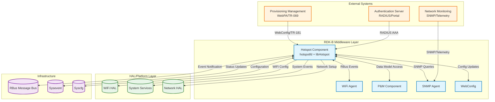

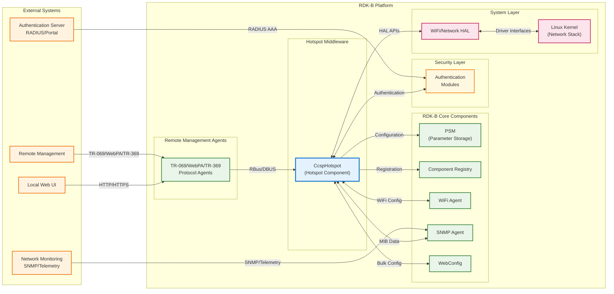

**Key Features & Responsibilities**: 

- **Tunnel Endpoint Management**: Manages GRE tunnel connections to service provider infrastructure with automatic failover between primary and secondary endpoints for high availability 
- **Client Session Monitoring**: Tracks hotspot client connections, authentication status, and session parameters including DHCP lease information and connection quality metrics 
- **DHCP Snooping & ARP Handling**: Monitors DHCP transactions and ARP traffic to maintain client state, enforce policies, and provide network protection against spoofing attacks 
- **Authentication Integration**: Interfaces with RADIUS servers and captive portal systems to authenticate hotspot users and manage access control policies 
- **VLAN & Network Isolation**: Configures VLAN tagging and network segmentation to isolate hotspot traffic from private customer networks while maintaining service quality 
- **WebConfig & TR-181 Support**: Provides remote configuration management through WebConfig framework and TR-181 data model for standardized device management 
- **Telemetry & Monitoring**: Collects and reports operational metrics, connection statistics, and performance data for network monitoring and troubleshooting

## Design

The Hotspot component is architected as a multi-process system with clear separation of concerns between tunnel management, client monitoring, and configuration management. The design emphasizes reliability, security, and scalability while maintaining backward compatibility with legacy RDK-B interfaces. The core design principle centers around event-driven architecture that responds to network state changes, client activity, and configuration updates in real-time.

The system design integrates seamlessly with the RDK-B middleware stack through standardized message bus communication and data model abstractions. It leverages the platform's configuration management systems (Syscfg/Sysevent) for persistent storage and inter-component communication. The modular architecture allows for independent scaling of tunnel management and client monitoring functions based on deployment requirements.

Northbound interactions are managed through TR-181 data model interfaces that provide standardized access for remote management systems, SNMP agents, and WebConfig framework. The component exposes hotspot configuration parameters, client statistics, and operational status through well-defined APIs that support both read and write operations. These interfaces enable centralized management and monitoring of hotspot services across large deployments.

Southbound interactions with the hardware abstraction layer follow RDK-B patterns for WiFi configuration, network interface management, and system service integration. The component utilizes WiFi HAL APIs for SSID configuration, client enumeration, and radio management while abstracting platform-specific details. Network HAL integration provides VLAN configuration, tunnel setup, and traffic routing capabilities.

IPC mechanisms are implemented using RBus for real-time event notification and asynchronous communication with other RDK-B components. The component publishes events for client connection changes, tunnel status updates, and configuration modifications. Sysevent integration provides legacy compatibility for shell-based service interactions and system startup coordination.

Data persistence and storage management are handled through Syscfg for configuration parameters and shared memory for runtime statistics. The component maintains client session databases, tunnel endpoint configurations, and operational counters in appropriate storage mechanisms based on persistence requirements. Critical configuration data is backed up to non-volatile storage while transient operational data is kept in memory for performance.

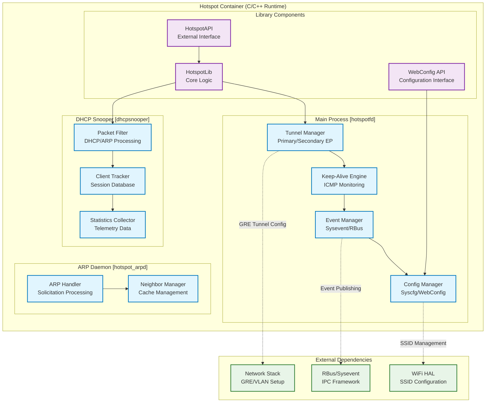

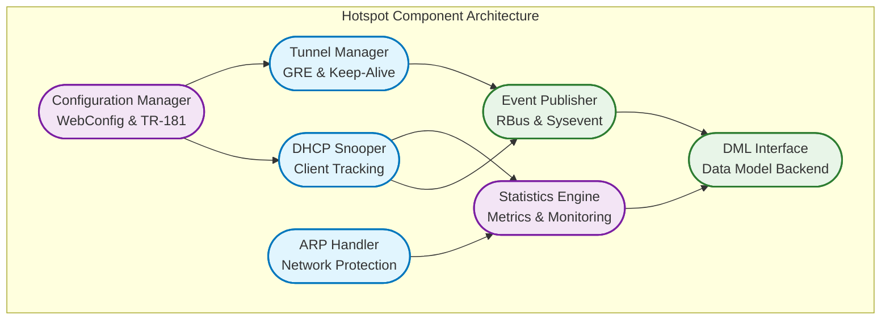

### Prerequisites and Dependencies

**Build-Time Flags and Configuration:**

| Configure Option | DISTRO Feature | Build Flag | Purpose | Default |
|------------------|----------------|------------|---------|----------|
| `--enable-wanfailover` | N/A | `WAN_FAILOVER_SUPPORTED` | Enable WAN failover support with RBus integration | Disabled |
| `--enable-unitTestDockerSupport` | N/A | `UNIT_TEST_DOCKER_SUPPORT` | Enable Docker support for unit testing | Disabled |
| `--enable-core_net_lib_feature_support` | N/A | `CORE_NET_LIB_FEATURE_SUPPORT` | Enable advanced networking library support | Disabled |
| Product-specific flags | N/A | `_BWG_PRODUCT_REQ_`, `_CBR_PRODUCT_REQ_`, `_XB8_PRODUCT_REQ_` | Product-specific SSID and parameter configurations | Platform dependent |
| WiFi HAL version | N/A | `WIFI_HAL_VERSION_3`, `RDK_ONEWIFI` | WiFi HAL version and OneWifi integration support | Platform dependent |
| MAPT NAT46 support | N/A | `FEATURE_SUPPORT_MAPT_NAT46` | IPv4/IPv6 translation support | Platform dependent |
| Amenities Network | N/A | `AMENITIES_NETWORK_ENABLED` | Special network services support | Platform dependent |

 

**RDK-B Platform and Integration Requirements:**

* **RDK-B Components**: `CcspPandM`, `CcspWifiAgent`, `CcspPsm`, `CcspCommonLibrary`, `WebConfig Framework`
* **HAL Dependencies**: WiFi HAL APIs v3+, Network HAL interfaces for GRE tunnel management
* **Systemd Services**: `sysevent.service`, `psm.service`, `ccsp-wifi-agent.service` must be active before `CcspHotspot.service` starts
* **Message Bus**: RBus registration under `Device.X_COMCAST-COM_GRE` namespace for tunnel management and event publishing
* **TR-181 Data Model**: `Device.X_COMCAST-COM_GRE.Tunnel` and `Device.X_COMCAST-COM_GRE.Hotspot` object hierarchy support
* **Configuration Files**: `hotspot.XML` for TR-181 parameter definitions; component configuration files located in `/etc/utopia/service.d/`
* **Startup Order**: Initialize after sysevent, PSM services are running and WiFi interfaces are configured

**Threading Model:**

The Hotspot component implements a multi-threaded architecture optimized for concurrent tunnel management, client monitoring, and event processing. The design uses dedicated threads for I/O operations, timer management, and inter-process communication to ensure responsive operation under varying network conditions and client loads.

| Thread & Function | Purpose | Cycle/Timeout | Synchronization |
|-------------------|---------|----------------|------------------|
| **Main Thread** `main()` / `hotspotfd_main()` | Component initialization, configuration management, tunnel monitoring loop | Event-driven main loop, keep-alive intervals, configuration updates | pthread_mutex for shared state |
| **Sysevent Handler Thread** `hotspotfd_sysevent_handler()` | System event processing and configuration updates | Continuous event monitoring, sysevent notifications for tunnel parameters, WAN status changes | Sysevent token synchronization |
| **DHCP Snooper Thread** `dhcp_snooper_init()` | DHCP packet capture and client session tracking | DHCP packet processing, netfilter queue handling, client state management | global_stats_mutex for client list |
| **RBus Subscription Thread** `handle_rbusSubscribe()` | RBus event subscription and notification handling | RBus event processing, tunnel status notifications, configuration sync | RBus callback synchronization |
| **Keep-Alive Monitor** **(Internal to main loop)** | ICMP ping operations for tunnel endpoint monitoring | Configurable intervals (60-300s), endpoint failover logic, connectivity validation | keep_alive_mutex for state transitions |

### Component State Flow

**Initialization to Active State**

The Hotspot component follows a structured initialization sequence that ensures all dependencies are satisfied before becoming operational. The state machine progresses through distinct phases with proper error handling and rollback capabilities at each stage.

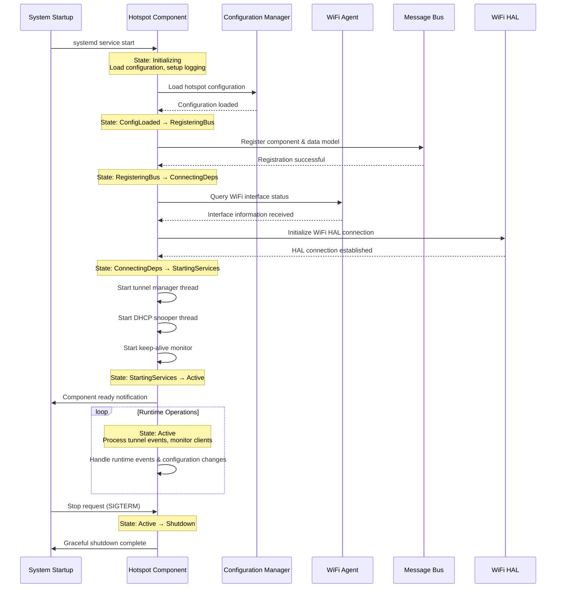

**Runtime State Changes and Context Switching**

The component handles several runtime state transitions based on network conditions, configuration changes, and external events that affect hotspot operation.

**State Change Triggers:**

- **Tunnel Endpoint Failover**: Primary endpoint connectivity loss triggers automatic switch to secondary endpoint with session continuity
- **WiFi Interface Changes**: SSID enable/disable events cause hotspot service activation/deactivation with proper client disconnection handling
- **WAN Interface Events**: WAN connectivity changes trigger tunnel re-establishment and client notification procedures
- **Configuration Updates**: WebConfig or TR-181 parameter changes cause controlled service restart with minimal client impact

**Context Switching Scenarios:**

- **Primary/Secondary Endpoint Switching**: Maintains client sessions during tunnel endpoint changes with seamless traffic redirection
- **VLAN Reconfiguration**: Handles dynamic VLAN changes while preserving existing client connections and session state
- **Authentication Server Failover**: Switches between primary and backup authentication servers with session preservation

### Call Flow

**Initialization Call Flow:**

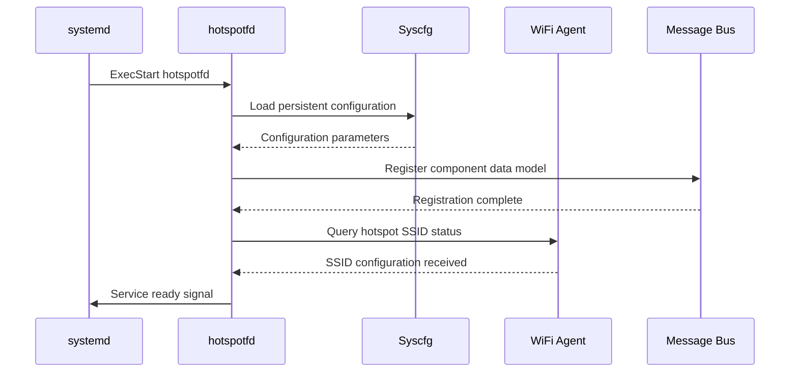

**Tunnel Establishment Call Flow:**

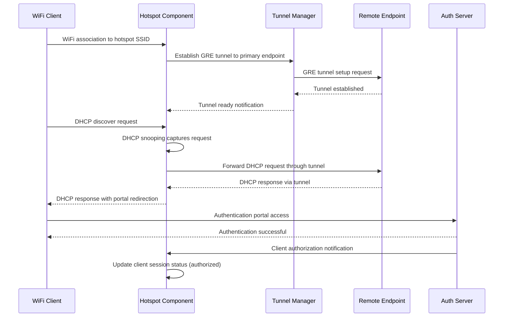

**Client Session Management Call Flow:**

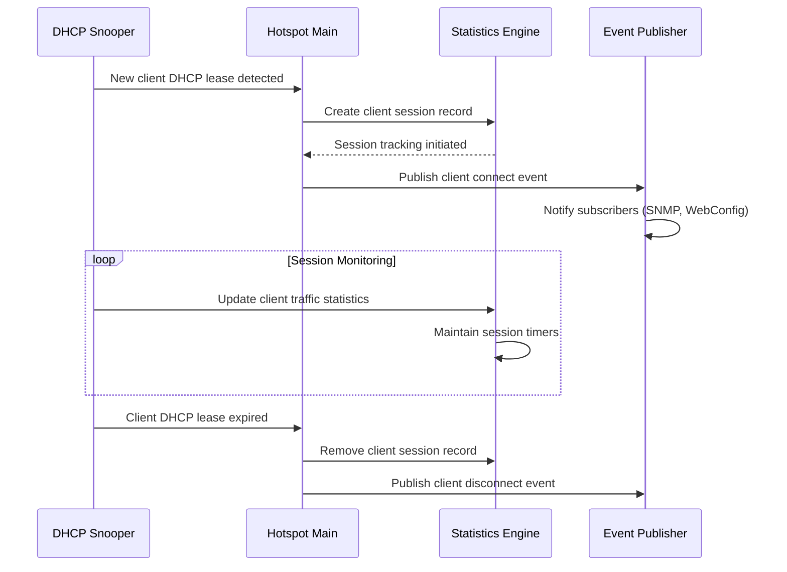

## Internal Modules

The Hotspot component is organized into several specialized modules, each handling distinct aspects of hotspot functionality while maintaining clean interfaces for inter-module communication.

| Module/Class | Description | Key Files |
|-------------|------------|-----------|
| **Tunnel Manager** | Manages GRE tunnel connections to service provider endpoints with automatic failover capabilities and keep-alive monitoring | `hotspotfd.c`, `libHotspot.c` |
| **DHCP Snooper** | Captures and processes DHCP transactions to track client sessions, IP assignments, and connection metadata | `dhcpsnooper.c`, `dhcpsnooper.h` |
| **ARP Handler** | Processes ARP solicitations and maintains neighbor cache for efficient client communication and network protection | `hotspot_arpd.c` |
| **Configuration Manager** | Handles WebConfig integration, TR-181 data model implementation, and persistent configuration management | `HotspotApi.c`, `HotspotJansson.c` |
| **Event Publisher** | Manages RBus and sysevent notifications for client state changes, tunnel status, and system integration | `ssp_messagebus_interface.c` |
| **Statistics Engine** | Collects and maintains operational metrics, client statistics, and performance counters for monitoring systems | `hotspotfd.c` (statistics functions) |
| **DML Interface** | Implements TR-181 data model backend for SNMP and management system integration | `cosa_hotspot_dml.c` |

## Component Interactions

The Hotspot component integrates extensively with the RDK-B ecosystem through well-defined interfaces for configuration management, event notification, and data model access. These interactions enable centralized management and monitoring while maintaining operational independence.

### Interaction Matrix

| Target Component/Layer | Interaction Purpose | Key APIs/Endpoints |
|------------------------|-------------------|------------------|
| **RDK-B Middleware Components** |
| WiFi Agent | SSID configuration, client enumeration, radio status monitoring | `Device.WiFi.SSID.{i}.Enable`, RBus events `wifi-ssid-status` |
| P&M Component | TR-181 data model access, parameter validation, configuration persistence | `Device.X_COMCAST-COM_GRE.Hotspot.*`, CCSP message bus |
| SNMP Agent | MIB data provisioning, statistics reporting, trap generation | `rdkbRgWifiHotspot*` MIB objects, SNMP handler callbacks |
| WebConfig Framework | Remote configuration management, bulk parameter updates | WebConfig subdoc `hotspot`, JSON schema validation |
| Telemetry Agent | Operational metrics collection, performance monitoring | T2 events, telemetry markers |
| **System & HAL Layers** |
| WiFi HAL | SSID enable/disable, client association events, radio configuration | `wifi_createSSID()`, `wifi_getSSIDNumberOfEntries()`, `wifi_getClientConnectionStatus()` |
| Network HAL | GRE tunnel creation, VLAN configuration, interface management | `netdev_create_gre_tunnel()`, `vlan_configure_interface()` |
| System Services | Process lifecycle, service dependencies, resource management | systemd service unit, process monitoring APIs |

**Events Published by Hotspot Component:**

| Event Name | Event Topic/Path | Trigger Condition | Subscriber Components |
|------------|-----------------|-------------------|---------------------|
| Client Connected | `Device.X_COMCAST-COM_GRE.Hotspot.ClientChange` | New client DHCP lease acquired | SNMP Agent, Telemetry, Monitoring |
| Client Disconnected | `Device.X_COMCAST-COM_GRE.Hotspot.ClientChange` | Client session expired or terminated | SNMP Agent, Telemetry, Monitoring |
| Tunnel Status Change | `hotspotfd-tunnelEP` (sysevent) | Primary/secondary endpoint failover | WiFi Agent, P&M Component |
| Configuration Update | RBus data model events | WebConfig or TR-181 parameter changes | All data model subscribers |

### IPC Flow Patterns

**Primary IPC Flow - Client Session Management:**

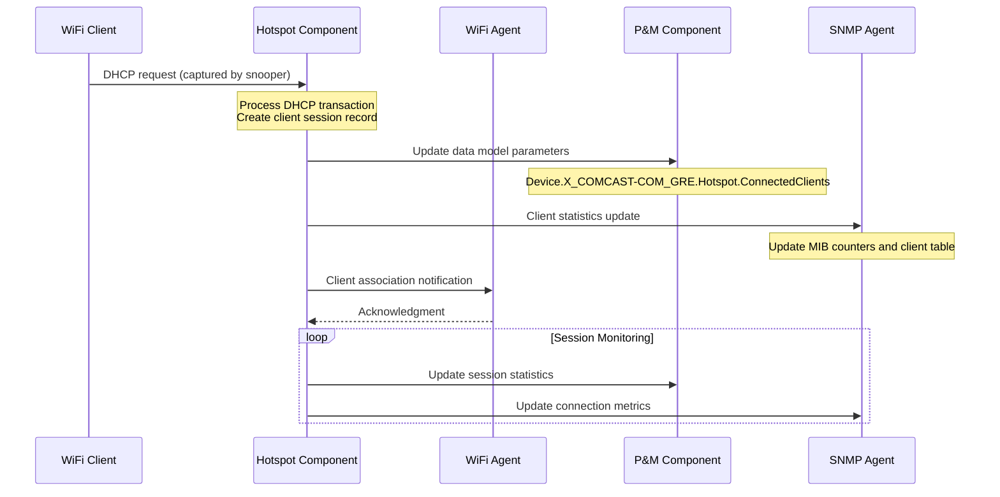

**Configuration Management Flow:**

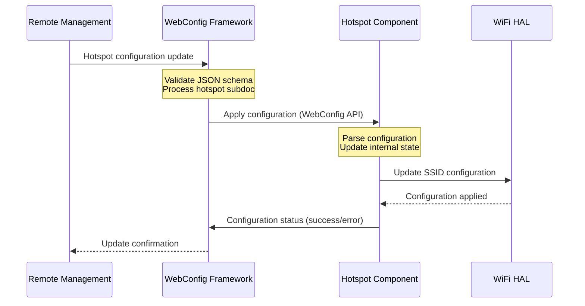

**Tunnel Failover Event Flow:**

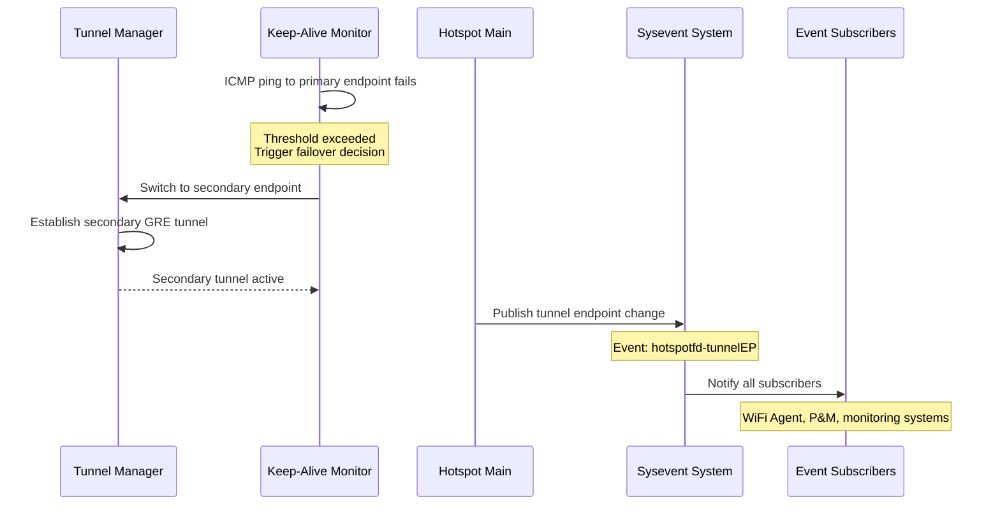

## Implementation Details

### Major HAL APIs Integration

The Hotspot component integrates with several HAL interfaces to abstract hardware-specific functionality and maintain platform independence across different RDK-B deployments.

**Core HAL APIs:**

| HAL API | Purpose | Implementation File |
|---------|---------|-------------------|
| `wifi_createSSID()` | Creates and configures hotspot SSID with security settings and VLAN assignment | `hotspotfd.c` |
| `wifi_deleteSSID()` | Removes hotspot SSID configuration during service disable or reconfiguration | `hotspotfd.c` |
| `wifi_getSSIDNumberOfEntries()` | Enumerates available SSID slots for hotspot configuration validation | `HotspotApi.c` |
| `wifi_getClientConnectionStatus()` | Retrieves client association status and connection quality metrics | `dhcpsnooper.c` |
| `netdev_create_gre_tunnel()` | Establishes GRE tunnel to service provider endpoint with VLAN tagging | `hotspotfd.c` |
| `vlan_configure_interface()` | Configures VLAN tagging for traffic isolation and QoS management | `HotspotApi.c` |

### Key Implementation Logic

- **Tunnel State Machine Engine**: The core tunnel management logic is implemented in `hotspotfd.c` with a sophisticated state machine that handles endpoint connectivity monitoring, automatic failover, and session preservation. The state machine maintains separate states for primary and secondary endpoints with configurable timeouts and retry policies.
     - Main implementation in `hotspotfd.c` (functions: tunnel_establish, tunnel_monitor, tunnel_failover)
     - State transition handlers in `hotspotfd.c` (functions: primary_endpoint_handler, secondary_endpoint_handler)
  
- **DHCP Packet Processing**: DHCP snooping functionality processes layer 2 packets to extract client session information, IP assignments, and connection metadata. The implementation uses raw socket programming with packet filtering to capture DHCP transactions without interfering with normal DHCP operation.
     - DHCP packet capture and parsing logic in `dhcpsnooper.c`
     - Client session database management with thread-safe operations
     - Integration with netfilter framework for efficient packet processing

- **Keep-Alive Monitoring System**: ICMP ping-based monitoring system tracks tunnel endpoint connectivity with configurable intervals, thresholds, and policies. The system supports both active probing and passive monitoring modes based on network conditions and configuration policies.
     - ICMP ping implementation with socket-level control
     - Adaptive timing algorithms for network condition response
     - Statistical analysis for connection quality assessment

- **Error Handling Strategy**: Comprehensive error handling covers network failures, HAL API errors, configuration validation failures, and resource exhaustion scenarios. The component implements graceful degradation and automatic recovery mechanisms to maintain service availability.
     - HAL error code mapping with retry logic and fallback procedures
     - Network timeout handling with exponential backoff algorithms
     - Memory management with bounds checking and resource cleanup
     - Configuration validation with schema enforcement and rollback support

- **Logging & Debugging**: Multi-level logging system provides detailed troubleshooting information for tunnel operations, client sessions, and configuration management with configurable verbosity levels and log rotation.
     - Tunnel establishment and failover event logging with timing information
     - Client session lifecycle tracking with connection quality metrics
     - Configuration change auditing with before/after state capture
     - Performance metrics collection for capacity planning and optimization

### Key Configuration Files

| Configuration File | Purpose | Override Mechanisms |
|--------------------|---------|--------------------|
| `/etc/hotspot.conf` | Main hotspot configuration including tunnel endpoints, timing parameters, and feature enables | Environment variables, WebConfig updates |
| `/var/lib/hotspot/client_db` | Persistent client session database for service restart recovery | Automatic cleanup on restart, manual reset via API |
| `/tmp/hotspot_status` | Runtime status information for monitoring and debugging | Real-time updates, cleared on service restart |
| `hotspot.XML` | TR-181 data model registration and DML function mapping | Component rebuild required for changes |
| `/etc/systemd/system/hotspot.service` | Systemd service configuration with dependencies and resource limits | systemd override files in `/etc/systemd/system/` |