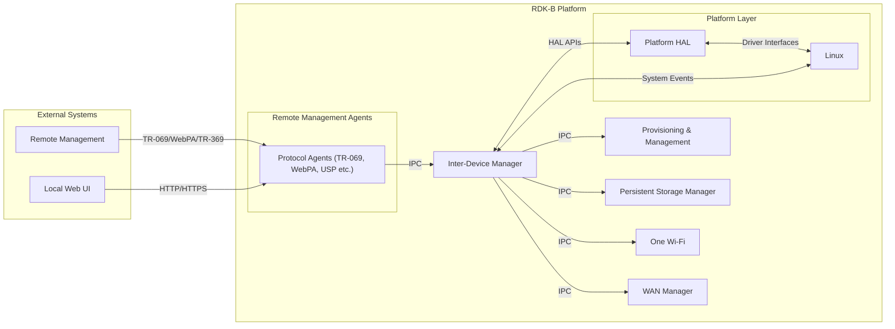
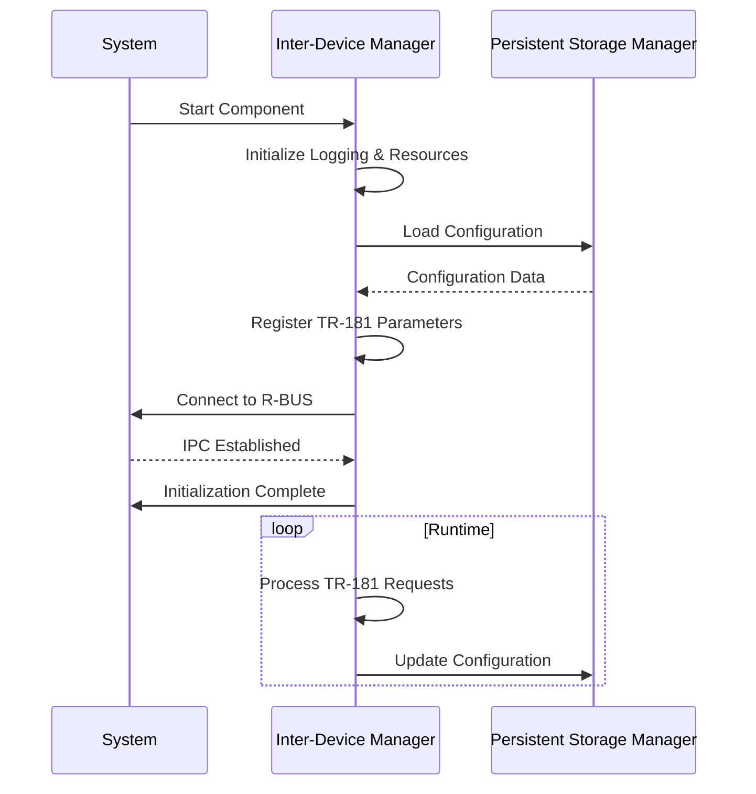

# Inter-Device Manager Documentation

Inter-Device Manager (IDM) is a RDK-B component responsible for managing and monitoring remote devices connected to the gateway. It facilitates device discovery, communication, and data synchronization across various network interfaces. IDM ensures seamless integration with other RDK-B components and external systems, providing a unified interface for remote device management.

## Key Features & Responsibilities

- **Remote Device Discovery**: Automatically discovers and tracks remote devices connected to the network.
- **Data Synchronization**: Ensures consistent data across multiple interfaces and components.
- **Protocol Support**: Implements support for protocols like R-BUS and sysevent for inter-process communication.
- **TR-181 Data Model Implementation**: Provides standardized access to remote device information through TR-181 parameters.
- **Event-Driven Architecture**: Utilizes event-driven mechanisms for real-time updates and efficient resource utilization.

## Design

IDM follows a modular design with distinct responsibilities for device discovery, data management, and communication. The architecture emphasizes scalability, real-time responsiveness, and minimal resource usage.

### Simplified System Context Diagram

### Prerequisites and Dependencies

**Build-Time Flags and Configuration:**
| Configure Option | Distro Feature | Build Flag | Purpose | Default |
| --------------------- | -------------- | --------------------- | ------------------------------------------- | ------- |
| `--enable-gtestapp` | `gtest` | `-DGTEST_ENABLE` | Enables GTest support for unit testing | `no` |
| `--enable-journalctl` | `systemd` | `-DENABLE_JOURNALCTL` | Enables logging via journalctl | `yes` |
| `--enable-rbus` | `rbus` | `-DRBUS_SUPPORT` | Enables R-BUS support for IPC | `yes` |
| `--enable-sysevent` | `sysevent` | `-DSYSEVENT_SUPPORT` | Enables sysevent support for event handling | `yes` |

**RDK-B Platform and Integration Requirements:**

- **RDK-B Components**: `Provisioning & Management`, `Persistent Storage Manager`, `CcspCommonLibrary`
- **HAL Dependencies**: WiFi HAL APIs, Ethernet HAL interfaces
- **Systemd Services**: `CcspCrSsp.service`, `CcspPsmSsp.service` must be active before `InterDeviceManager.service` starts
- **Message Bus**: R-BUS registration under `com.cisco.spvtg.ccsp.idm` namespace for performance optimization and inter-component communication
- **TR-181 Data Model**: `Device.X_RDK_Remote.Device` object hierarchy for device management and reporting
- **Configuration Files**: `IDM.xml` for TR-181 parameter definitions; component configuration files located in `/usr/ccsp/idm/`
- **Startup Order**: Initialize after network interfaces are active and Persistent Storage Manager services are running

### Threading Model

IDM implements a multi-threaded architecture designed to handle concurrent network monitoring, data processing, and external communications without blocking critical operations.

- **Threading Architecture**: Multi-threaded with main event loop and specialized worker threads for different operational domains
- **Main Thread**: Handles TR-181 parameter requests, R-BUS message processing, and component lifecycle management
- **Main Worker Threads**:
  - **Network Scanner Thread**: Performs periodic network interface scanning and device discovery operations
  - **Presence Detection Thread**: Monitors device connectivity status and triggers presence change notifications
- **Synchronization**: Uses mutex locks for shared data structures, condition variables for thread communication, and atomic operations for counters

### Component State Flow

**Initialization to Active State**

The Inter-Device Manager follows a structured initialization sequence ensuring proper dependency resolution and secure agent coordination. The component validates system prerequisites, loads configuration from persistent storage, establishes IPC connections, and coordinates with other RDK-B components before transitioning to active operational state.

### References

- [TR-181 Data Model](https://www.broadband-forum.org/technical/download/TR-181_Issue-2_Amendment-14.pdf)
- [RDK-B Documentation Guidelines](diagram-guidelines 1.md)
- [CcspLMLite Documentation](ccsplmlite.md)
