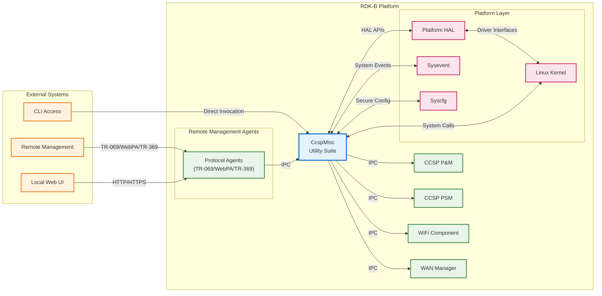
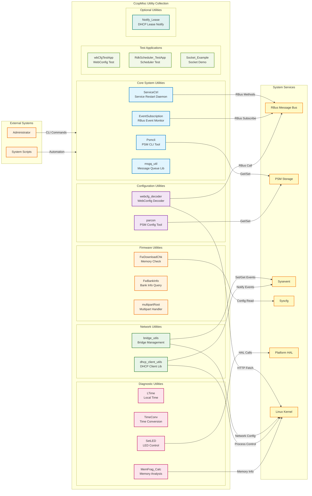
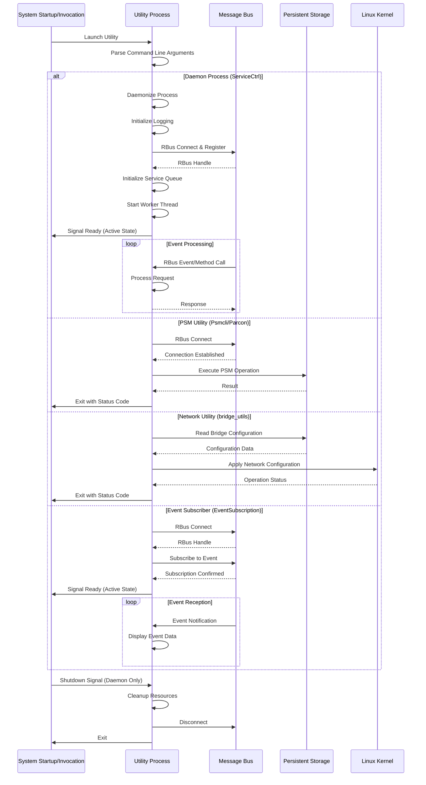
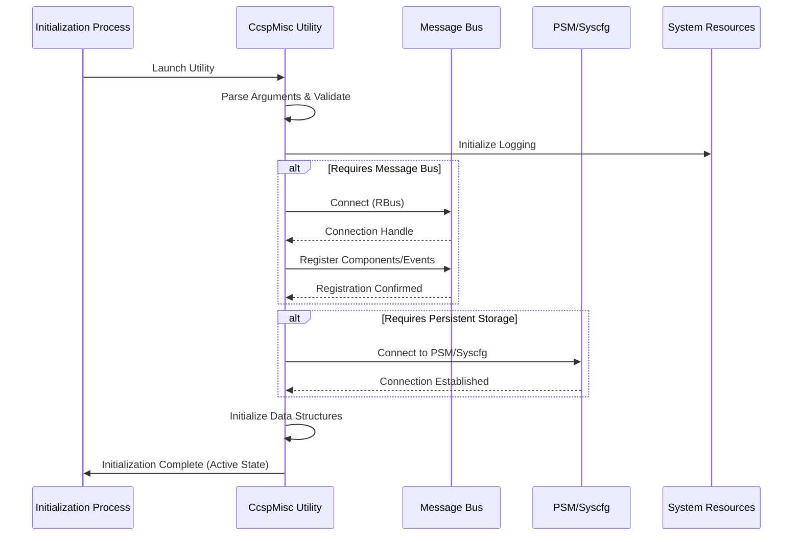
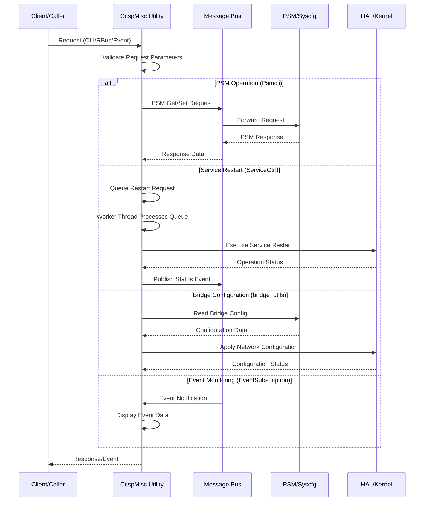
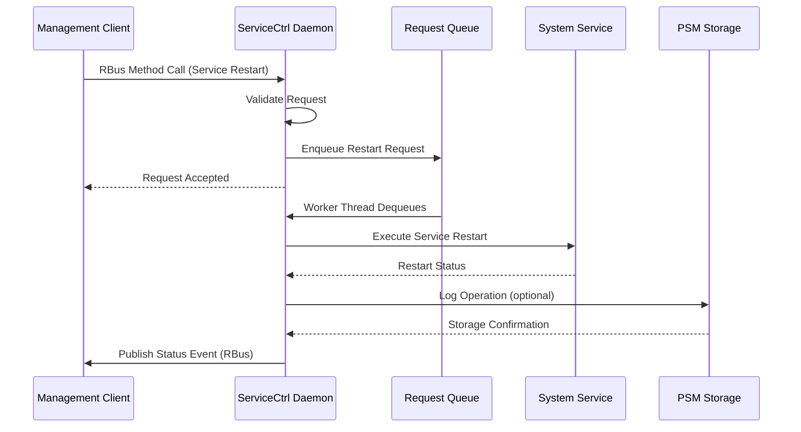
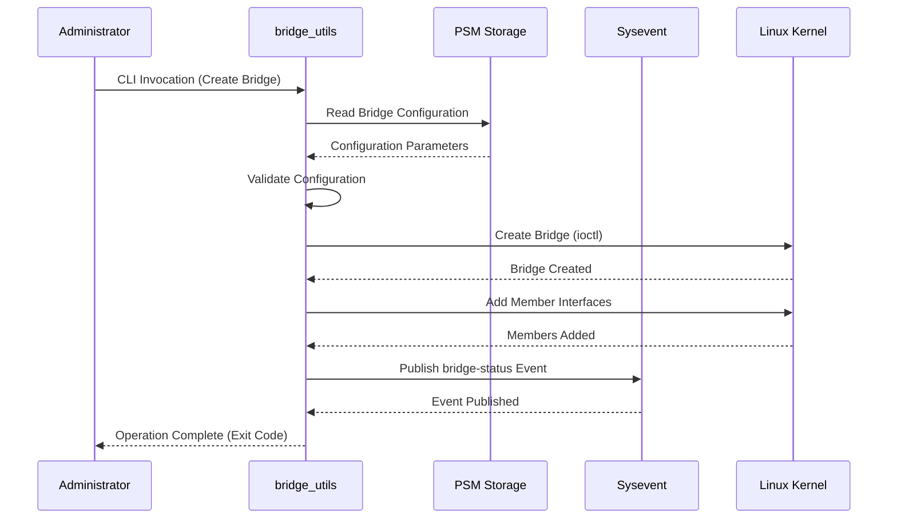
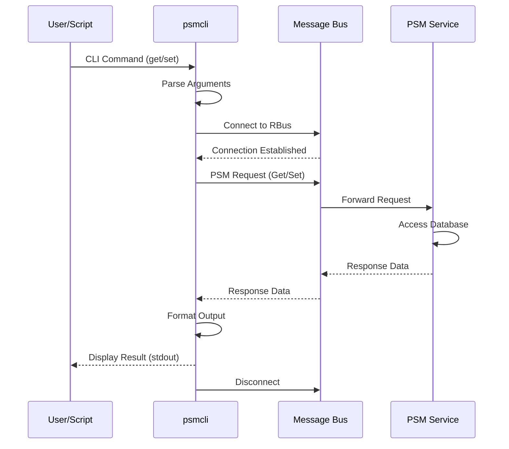

# CcspMisc (Miscellaneous Broadband) Documentation

CcspMisc is a collection of utility components and helper applications within the RDK-B middleware stack that provide essential system-level services and management capabilities. This component encompasses multiple independent utilities designed to support various broadband gateway operations including persistent storage management, event subscription, service control, firmware download validation, network bridge configuration, DHCP client utilities, and system diagnostics. Each utility within this collection serves specific operational requirements across the RDK-B ecosystem, enabling functionality ranging from data persistence and inter-process communication to network interface management and telemetry reporting.

The miscellaneous-broadband component acts as a repository for standalone utilities that do not fit within larger architectural components but remain essential for gateway operation. These utilities provide low-level infrastructure services, command-line tools for system configuration and testing, and specialized daemons for specific operational tasks. The modular nature of this component allows platform vendors to selectively enable utilities based on specific platform capabilities and deployment requirements through build-time configuration flags.

**Key Features & Responsibilities**: 

- **Persistent Storage CLI (Psmcli)**: Command-line interface for reading and writing configuration parameters to persistent storage through PSM integration enabling manual configuration management and debugging
- **Bridge Utilities (bridge_utils)**: Network bridge creation and management tools for configuring LAN-side bridging including VLAN, Ethernet, WiFi, and MoCA interface aggregation with support for multiple bridge instances
- **Service Control (ServiceCtrl)**: RBus-based service restart management daemon allowing controlled restart of system services through standardized data model interface with queue-based processing
- **DHCP Client Utilities (dhcp_client_utils)**: Common library for managing DHCP client operations supporting multiple DHCP client implementations including udhcpc, dibbler, and ti_dhcp6c with unified interface
- **Event Subscription Utility (EventSubscription)**: RBus event subscription testing tool enabling command-line monitoring and debugging of RBus events across the system
- **Firmware Download Check (FwDownloadChk)**: Memory availability validation utility for firmware download operations ensuring sufficient system memory before initiating firmware upgrades
- **WebConfig Decoder (webcfg_decoder)**: Utility for fetching and decoding WebConfig blobs enabling testing and debugging of WebConfig multipart document processing
- **Message Queue Utility (msgq_util)**: POSIX message queue wrapper providing inter-process communication capabilities for gateway state machine messaging
- **Time Conversion Utilities (LTime/TimeConv)**: Timestamp conversion tools providing local time retrieval and time format conversion with UTC support
- **Memory Fragmentation Calculator (MemFrag_Calc)**: System memory analysis utility calculating memory fragmentation metrics for system diagnostics and telemetry
- **PSM Configuration Utility (parcon)**: Persistent configuration manipulation tool for managing PSM-stored parameters
- **LED Control (SetLED)**: Hardware LED control utility for setting device indicator states
- **Firmware Bank Info (FwBankInfo)**: Utility for querying firmware bank information from the bootloader
- **Multipart Root (multipartRoot)**: Utility for handling multipart firmware images
- **Notify Lease (Notify_Lease)**: DHCP lease notification utility for monitoring DHCP lease events
- **Test Applications**: Suite of test applications including wbCfgTestApp, wbCfgTestDaemon, RdkScheduler_TestApp, and Socket_Example for development and validation

## Design

The miscellaneous-broadband component follows a modular, loosely-coupled architecture where each utility operates as an independent executable or library with well-defined responsibilities. The design philosophy emphasizes minimal dependencies between utilities, allowing selective compilation and deployment based on platform requirements specified through configure-time flags. Each utility interface design promotes reusability and integration, providing command-line interfaces for administrative operations, library APIs for programmatic access, or daemon processes for runtime services. The architecture enables platform vendors to customize the utility suite by enabling only required modules through autoconf-based build configuration.

The component integrates with the RDK-B middleware stack through standardized interfaces including RBus for event-driven communication, PSM for persistent data storage, sysevent for system-wide event notification, and syscfg for secure configuration access. Utilities requiring inter-process communication leverage RBus event subscription and method invocation mechanisms following RDK-B design patterns. Network-related utilities interact with the Linux kernel network stack through socket APIs, ioctl system calls, or specialized libraries like libnet when core networking library support is enabled. The design ensures that utilities can operate independently while maintaining consistent integration patterns across the broader RDK-B ecosystem.

Data persistence strategies vary by utility purpose with configuration-focused utilities using PSM as the primary storage backend, runtime state managed through sysevent, and diagnostic information logged to standardized log locations under /rdklogs/logs/. Utilities requiring secure configuration access integrate with syscfg providing tamper-resistant storage for sensitive parameters. The threading model varies per utility with simple command-line tools executing as single-threaded processes, while daemon utilities like ServiceCtrl implement multi-threaded architectures with dedicated worker threads for queue processing and event handling. Error handling follows defensive programming practices with comprehensive input validation, graceful error recovery, and detailed logging to support field diagnostics and troubleshooting operations.

### Prerequisites and Dependencies

**Build-Time Flags and Configuration:**

| Configure Option | DISTRO Feature | Build Flag | Purpose | Default |
|------------------|----------------|------------|---------|---------|
| `--enable-vts_bridge_util` | N/A | `VTS_BRIDGE_UTIL_ENABLED` | Enable VTS-specific bridge utility variant | Disabled |
| `--enable-core_net_lib_feature_support` | N/A | `CORE_NET_LIB` | Enable libnet-based networking library instead of standard Linux headers | Disabled |
| `--enable-notifylease` | N/A | `NOTIFYLEASE_ENABLE` | Build DHCP lease notification utility | Disabled |
| `--enable-setLED` | N/A | `SETLED_ENABLE` | Build LED control utility | Enabled |
| `--enable-multipartUtilEnable` | N/A | `MULTIPART_UTIL_ENABLE` | Build multipart firmware handling utility | Disabled |
| `--enable-bridgeUtilsBin` | N/A | `BRIDGE_UTILS_BIN_ENABLE` | Build bridge utilities binary and library | Disabled |
| `--enable-wbCfgTestAppEnable` | N/A | `WEBCFG_TESTAPP_ENABLE` | Build WebConfig test applications (daemon and app) | Disabled |
| `--enable-rdkSchedulerTestAppEnable` | N/A | `RDKSCHEDULER_TESTAPP_ENABLE` | Build RDK Scheduler test application | Disabled |
| `--enable-socketExampleEnable` | N/A | `SOCKET_EXAMPLE_ENABLE` | Build socket client/server example applications | Disabled |
| `--enable-dhcp_manager` | N/A | `DHCP_MANAGER_ENABLE` | Disable dhcp_client_utils when DHCP manager is enabled | Disabled |
| `--enable-unitTestDockerSupport` | N/A | `UNIT_TEST_DOCKER_SUPPORT` | Build unit tests with Docker support | Disabled |
| N/A | `OneWifi` | `RDK_ONEWIFI` | Conditional compilation for OneWifi stack integration | Platform-specific |
| N/A | `safec` | `SAFEC_DUMMY_API` (when safec disabled) | Enable safe C library for bounds-checked string operations | Platform-specific |
| N/A | N/A | `INCLUDE_BREAKPAD` | Enable Google Breakpad crash reporting integration | Platform-specific |
| N/A | N/A | `NO_MOCA_FEATURE_SUPPORT` | Disable MoCA interface support in bridge utilities | Platform-specific |
| N/A | N/A | `RDKB_EXTENDER_ENABLED` | Enable extender mode support in bridge utilities | Platform-specific |
| N/A | N/A | `UTC_ENABLE` | Enable UTC time support in time conversion utilities | Platform-specific |
| N/A | N/A | `DBUS_INIT_SYNC_MODE` | Enable synchronous RBus initialization in psmcli | Platform-specific |

 

**RDK-B Platform and Integration Requirements:**

* **Build Dependencies**: Standard C compiler (gcc/clang), autotools (autoconf, automake, libtool), pkg-config
* **RDK-B Components**: `CcspCommonLibrary` for message bus and utility functions, `CcspPsm` for persistent storage operations, RBus library for event-driven communication
* **System Libraries**: RBus library, pthread library, standard C library with POSIX extensions, libcurl for HTTP operations (webcfg_decoder), msgpack-c for binary serialization (webcfg_decoder), trower-base64 for encoding (webcfg_decoder), libnet for core networking support (optional, bridge_utils)
* **HAL Dependencies**: Platform HAL for LED control operations when SetLED is enabled
* **Configuration Files**: PSM database for persistent parameters, syscfg storage for secure configuration, sysevent daemon for system event distribution
* **Runtime Dependencies**: RBus message bus daemon must be running, PSM service must be operational for utilities requiring persistent storage access, sysevent daemon must be active for network utilities

 

**Threading Model:** 

The miscellaneous-broadband component employs utility-specific threading models optimized for each module's operational requirements.

- **Command-Line Utilities**: Single-threaded synchronous execution model used by psmcli, parcon, LTime, TimeConv, MemFrag_Calc, SetLED, FwBankInfo, FwDownloadChk, and webcfg_decoder where utilities execute requested operations and exit
- **Daemon Processes**: Multi-threaded architecture employed by ServiceCtrl with dedicated threads
  - **Main Thread**: RBus event loop processing and message handling
  - **Service Restart Queue Thread**: Processes queued service restart requests with mutex-protected queue access using pthread condition variables for synchronization
- **Library Components**: Thread-safe libraries (dhcp_client_utils, msgq_util) providing reentrant functions with caller-controlled threading context
- **Event-Driven Utilities**: Single-threaded with event loop (EventSubscription) using RBus event dispatcher for asynchronous event delivery
- **Synchronization**: Pthread mutexes protect shared data structures, condition variables coordinate thread communication, atomic operations minimize lock contention in performance-critical paths

### Component State Flow

**Initialization to Active State**

Command-line utilities follow a straightforward initialization-execute-terminate lifecycle while daemon processes maintain persistent operation with event-driven state management.

**Runtime State Changes and Context Switching**

Runtime state transitions occur based on external triggers, configuration changes, and operational events specific to each utility.

**State Change Triggers:**

- Daemon processes respond to RBus method invocations triggering service restart operations queued for sequential processing
- Network utilities react to sysevent notifications for bridge configuration changes, interface state transitions, or VLAN updates requiring reconfiguration
- Configuration utilities process PSM parameter change notifications triggering re-read of configuration data
- Event subscription utilities receive RBus events from subscribed topics triggering callback handler execution and data logging
- Service restart operations transition through queued, processing, and completed states with mutex-protected state tracking

### Call Flow

**Initialization Call Flow:**

**Request Processing Call Flow:**

## Internal Modules

The miscellaneous-broadband component consists of multiple independent utilities, each serving specific operational needs within the RDK-B ecosystem.

| Module/Class | Description | Key Files |
|-------------|------------|-----------|
| **Psmcli** | Command-line interface for PSM operations supporting get, set, getdetail, and delete operations with type-specific parameter handling. Provides direct access to persistent storage for administration and debugging. | `psmcli.c`, `ccsp_psmcli.h` |
| **ServiceCtrl** | RBus-based daemon providing service restart management through standardized interface. Implements queue-based restart processing with mutex-protected concurrent access and RBus method handlers. | `servicecontrol_main.c`, `servicecontrol_apis.c`, `servicecontrol_rbus_handler_apis.c`, `servicecontrol_dml.c` |
| **bridge_utils** | Network bridge management utility supporting creation, configuration, and deletion of Linux bridges with VLAN tagging, member interface management, and MoCA isolation support. Integrates with PSM for configuration storage and sysevent for runtime coordination. | `bridge_util.c`, `bridge_util_generic.c`, `bridge_creation.c`, `main.c` |
| **dhcp_client_utils** | Common library abstracting multiple DHCP client implementations (udhcpc, dibbler, ti_dhcp6c) providing unified API for client lifecycle management, process control, and event notification. | `dhcp_client_common.c`, `udhcpc_client_utils.c`, `dhcpv4_client_utils.c`, `dhcpv6_client_utils.c`, `dibbler_client_utils.c`, `ti_dhcp6c_client_utils.c`, `ti_udhcpc_client_utils.c` |
| **EventSubscription** | RBus event subscription utility for CLI-based event monitoring. Subscribes to specified RBus events and displays received event data with type-aware value extraction supporting string, boolean, and numeric types. | `event_subscriber.c` |
| **FwDownloadChk** | Firmware download memory validation utility checking available system memory against firmware size plus configurable thresholds. Prevents firmware download attempts when insufficient memory exists, reducing failed upgrade attempts. | `fw_download_check.c`, `fw_download_check.h` |
| **webcfg_decoder** | WebConfig blob fetch and decode utility supporting both HTTP download and RBus-based cache retrieval. Decodes msgpack-encoded multipart documents with base64 decoding and structured output for debugging WebConfig operations. | `main.c` |
| **msgq_util** | POSIX message queue wrapper providing gateway state machine messaging capabilities. Implements message send/receive operations for inter-process event communication with defined event enumeration. | `msgq_util.c` |
| **LTime** | Local time retrieval utility providing current timestamp output in seconds since epoch. Supports optional UTC time handling when UTC_ENABLE flag is set. | `LTime.c` |
| **TimeConv** | Time format conversion library providing conversion between different time representations. Supports UTC time conversion when UTC_ENABLE build flag is enabled. | `time_conversion.c`, `time_conversion.h` |
| **MemFrag_Calc** | Memory fragmentation analysis utility calculating fragmentation metrics from /proc meminfo. Used for system diagnostics and telemetry reporting. | `MemFragCalc.c` |
| **FwBankInfo** | Firmware bank information query utility extracting bootloader firmware bank details. Provides active/inactive bank identification for dual-bank firmware management. | `FwBank_Info.c` |
| **parcon** | PSM configuration utility providing command-line parameter manipulation. Offers simplified interface for common PSM operations during development and field deployment. | `parcon.c` |
| **multipartRoot** | Multipart firmware image handling utility for processing split firmware images during upgrade operations. | `multipartRoot.c` |
| **SetLED** | LED control utility providing command-line interface for hardware LED state management. Interfaces with platform HAL for LED hardware control. | `SetLED.c` |
| **Notify_Lease** | DHCP lease notification monitoring utility tracking DHCP lease acquisition and renewal events. Conditionally compiled when notifylease feature is enabled. | `Notify_Lease.c` |
| **wbCfgTestApp / wbCfgTestDaemon** | WebConfig testing utilities for development and validation of WebConfig document processing and decoding operations. | `wbCfgTestApp.c`, `wbCfgTestDaemon.c`, `wbCfgTestDaemon.h` |
| **RdkScheduler_TestApp** | RDK Scheduler API testing application for validating scheduler service integration and operation. | `testapp_main.c` |
| **Socket_Example** | Socket programming example demonstrating client-server socket communication patterns for reference implementation. | `socket_client.c`, `socket_server.c` |

## Component Interactions

The miscellaneous-broadband utilities interact with various RDK-B components, system services, and external systems to provide their respective functionalities.

### Interaction Matrix

| Target Component/Layer | Interaction Purpose | Key APIs/Endpoints |
|------------------------|-------------------|------------------|
| **RDK-B Middleware Components** |
| RBus Message Bus | Event subscription, method invocation, parameter get/set operations | `CCSP_Message_Bus_Init()`, `rbus_open()`, `rbusEvent_Subscribe()`, `rbusMethod_InvokeAsync()` |
| CcspPsm | Persistent parameter storage and retrieval for configuration data | `PSM_Get_Record_Value2()`, `PSM_Set_Record_Value2()`, `PSM_Del_Record()` |
| CcspPandM | Bridge configuration coordination, service state synchronization | RBus events: `Device.X_CISCO_COM_DeviceControl.*`, PSM parameters: `dmsb.l2net.*` |
| CcspWiFi | WiFi interface bridge membership configuration | PSM parameters: `dmsb.l2net.*.Members.WiFi`, Sysevent: WiFi interface notifications |
| **System Services** |
| Sysevent | System-wide event notification for network configuration changes | `sysevent_open()`, `sysevent_get()`, `sysevent_set()`, `sysevent_set_options()` events: `bridge-status`, `multinet-*`, `wan-status` |
| Syscfg | Secure configuration storage for firmware and system parameters | `syscfg_init()`, `syscfg_get()`, `syscfg_set()`, `syscfg_commit()` keys: `xconf_url`, `FwDwld_AvlMem_RsrvThreshold` |
| **Hardware Abstraction Layer** |
| Platform HAL | LED hardware control operations | Platform-specific LED HAL APIs for state control |
| **Linux Kernel** |
| Network Stack | Bridge creation, VLAN configuration, interface management | `socket()`, `ioctl(SIOCBRADDBR)`, `ioctl(BRCADDIF)`, netlink sockets for interface operations |
| Process Management | DHCP client process lifecycle control | `fork()`, `execv()`, `waitpid()`, `kill()`, signal handling |
| File System | Memory information, system status, log file access | `/proc/meminfo`, `/proc/net/*`, `/sys/class/net/*`, `/rdklogs/logs/*` |
| POSIX Message Queues | Inter-process messaging for gateway state machine | `mq_open()`, `mq_send()`, `mq_receive()`, `mq_close()`, queue: `/gwsm_queue` |
| **External Systems** |
| XCONF Server | Firmware image download URL and metadata retrieval | HTTP GET with curl library, Content-Length header parsing |
| WebConfig Server | Configuration document fetch and processing | HTTP GET/POST with curl, msgpack deserialization, base64 decoding |
| Telemetry System | Diagnostic event reporting | `t2_event_s()` for telemetry marker publication |
| **Configuration Sources** |
| PSM Database | Bridge configurations, network parameters, persistent state | Namespace: `dmsb.l2net.*`, `dmsb.MultiLAN.*` for bridge and network settings |
| Command Line | Direct utility invocation by administrators and scripts | Standard argc/argv parsing, getopt for option processing |

**Events Published by CcspMisc:**

| Event Name | Event Topic/Path | Trigger Condition | Subscriber Components |
|------------|-----------------|-------------------|---------------------|
| Service_Restart_Complete | ServiceCtrl RBus method response | Service restart operation completes successfully or with error | Requesting component (CcspPandM, WebPA) |
| Bridge_Status_Change | `bridge-status` sysevent | Bridge creation or deletion completes | Network management components, WiFi, routing services |
| DHCP_Lease_Event | Sysevent notifications | DHCP lease acquisition or renewal detected | Network monitoring, device tracking components |
| Network_Device_Status | RBus event publication | Device presence or network status change detected | Telemetry services, monitoring components |

### IPC Flow Patterns

**Primary IPC Flow - Service Restart Request:**

**Bridge Configuration Flow:**

**PSM Access Flow:**

## Implementation Details

### Key Implementation Logic

- **Service Restart Management (ServiceCtrl)**: Queue-based processing system with mutex-protected concurrent access. Worker thread dequeues restart requests sequentially preventing race conditions. RBus method handlers validate requests and enqueue operations. State machines track restart operation progress with timeout handling. Configuration persistence through RBus data elements maintaining service restart history.

- **Bridge Management (bridge_utils)**: Multi-interface bridge creation engine supporting VLAN tagging, member interface aggregation, and dynamic reconfiguration. PSM integration for configuration persistence with sysevent coordination for runtime updates. Kernel netlink interface for bridge manipulation using ioctl system calls. MoCA isolation support with separate bridge instances. OpenVSwitch detection with automatic implementation selection. Platform capability detection through file system checks (`/etc/onewifi_enabled`, `/sys/module/openvswitch`).

- **DHCP Client Abstraction (dhcp_client_utils)**: Unified API abstracting multiple DHCP client implementations (udhcpc, dibbler, ti_dhcp6c, ti_udhcpc). Process lifecycle management with fork/exec/waitpid patterns. Signal handling for graceful client termination. Timeout-based process collection with configurable wait intervals. Event notification through sysevent integration. Client-specific configuration file generation and management.

- **Event Processing (EventSubscription)**: RBus event subscription registration with callback handler. Type-aware value extraction supporting string, boolean, int8/16/32, uint8/16/32, double, and bytes types. Real-time event display for debugging and monitoring. User data preservation across callback invocations. Continuous event loop with signal handling for graceful exit.

- **Memory Validation (FwDownloadChk)**: Multi-factor memory availability check combining firmware size, reserved threshold, and processing overhead. HTTP Content-Length header parsing from XCONF URL. /proc/meminfo parsing for MemAvailable extraction. Configurable thresholds via syscfg parameters. Telemetry event publication on insufficient memory conditions. Structured logging with timestamps to `/rdklogs/logs/xconf.txt.0`.

- **Error Handling Strategy**: Defensive parameter validation with return code conventions (0 for success, non-zero for errors). Graceful degradation when optional features unavailable (libnet fallback to standard headers). Resource cleanup on error paths preventing leaks. Retry logic for transient failures with exponential backoff. Comprehensive error logging with context information. Signal handlers for daemon processes enabling graceful shutdown.

- **Logging & Debugging**: Component-specific log files under `/rdklogs/logs/` including `Parcon.txt` (parcon), `xconf.txt.0` (FwDownloadChk), and `SelfHeal.txt.0` (FwBankInfo). Structured logging with severity levels and timestamps. Debug builds with verbose output when enabled. Runtime logging control through debug flags. Integration with RDK Logger framework when FEATURE_SUPPORT_RDKLOG is enabled.

### Key Configuration Files

The miscellaneous-broadband component relies on multiple configuration sources including PSM parameters, syscfg keys, and file-based configurations.

| Configuration Source | Location/Namespace | Purpose | Access Method |
|---------------------|-------------------|---------|---------------|
| PSM Parameters | `dmsb.l2net.*` | L2 network bridge configuration including bridge names, VLAN IDs, and member interfaces | PSM API via message bus |
| PSM Parameters | `dmsb.MultiLAN.*` | Multi-LAN configuration including MoCA isolation settings | PSM API via message bus |
| Syscfg | `xconf_url`, `fw_to_upgrade` | Firmware download URL construction for memory check validation | Syscfg API |
| Syscfg | `FwDwld_AvlMem_RsrvThreshold` | Reserved memory threshold in MB for firmware download operations | Syscfg API |
| Syscfg | `FwDwld_ImageProcMemPercent` | Additional memory overhead percentage for firmware image processing | Syscfg API |
| File | `/etc/onewifi_enabled` | OneWifi feature detection flag for bridge utility behavior | File existence check |
| File | `/sys/module/openvswitch` | OpenVSwitch kernel module detection for bridge implementation selection | Directory existence check |
| File | `/etc/WFO_enabled` | WFO (WiFi Offload) feature detection flag | File existence check |
| File | `/var/tmp/brctl_interact_enable.txt` | Bridge utility debug interaction enable flag | File existence check |
| File | `/rdklogs/logs/xconf.txt.0` | XCONF firmware download check log output | Append-only log file |
| RBus Method | `Device.X_RDK_WebConfig.FetchCachedBlob` | WebConfig cached blob retrieval method for offline decode operations | RBus method invocation |
| Message Bus Config | CCSP_MSG_BUS_CFG | Message bus connection configuration for RBus initialization | File read during bus initialization |
