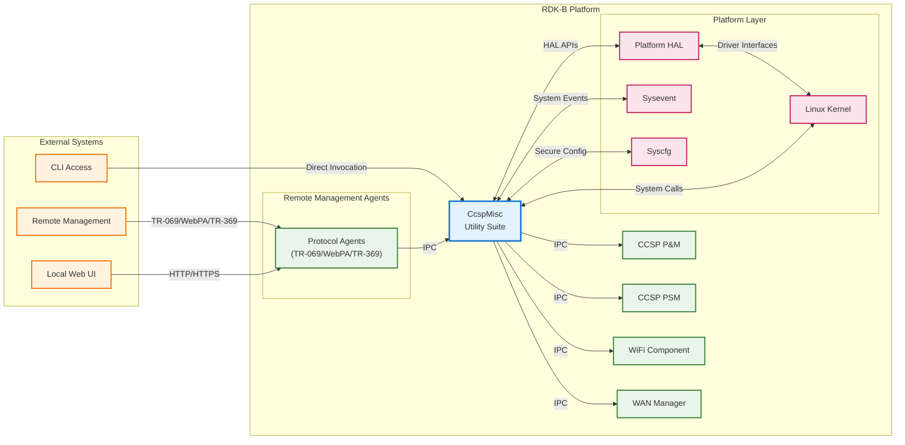
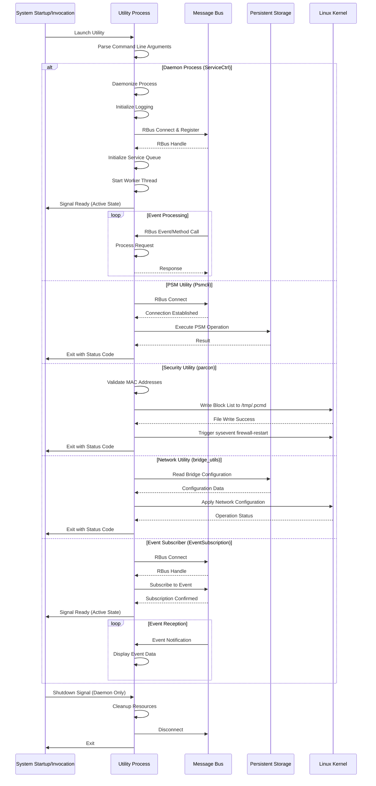
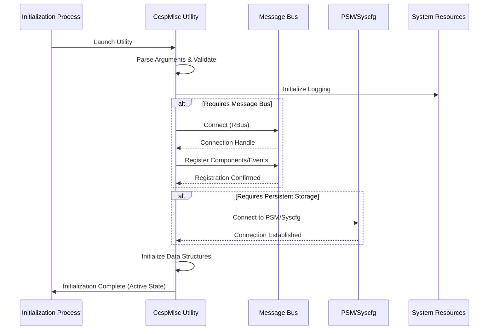
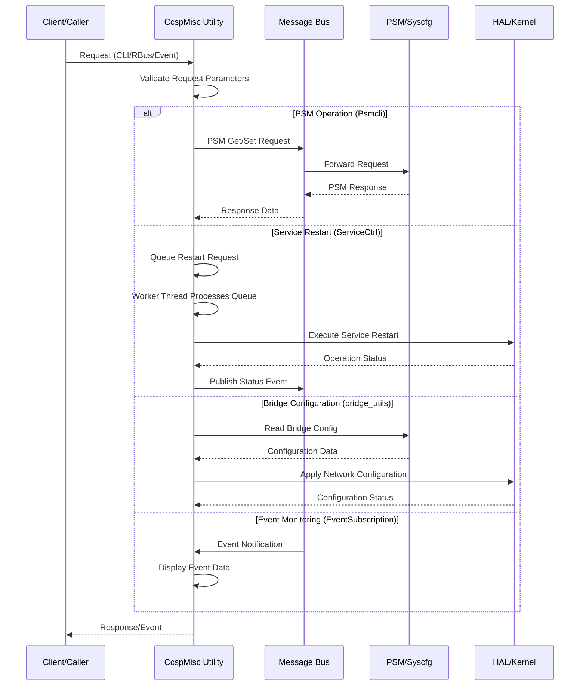
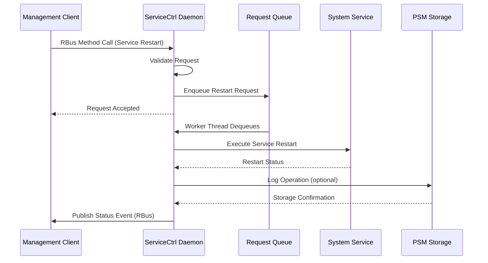
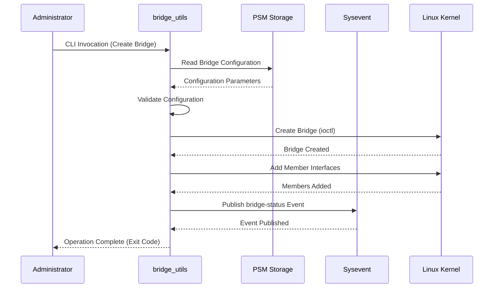
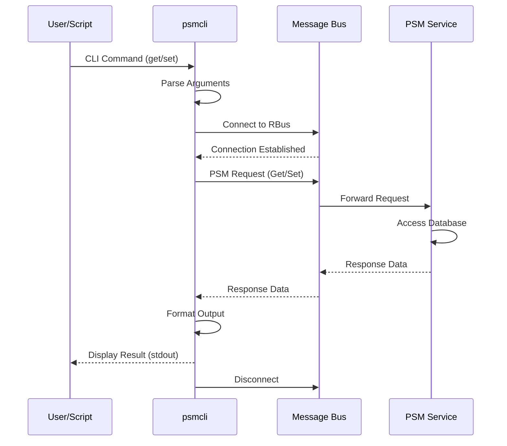

# CcspMisc (Miscellaneous Broadband)

CcspMisc is a collection of utility components and helper applications within the RDK-B middleware stack that provide essential system-level services and management capabilities. This component encompasses multiple independent utilities designed to support various broadband gateway operations including persistent storage management, event subscription, service control, firmware download validation, network bridge configuration, DHCP client utilities, and system diagnostics. Each utility within this collection serves specific operational requirements across the RDK-B ecosystem, enabling functionality ranging from data persistence and inter-process communication to network interface management and telemetry reporting.

The miscellaneous-broadband component acts as a repository for standalone utilities that do not fit within larger architectural components but remain essential for gateway operation. These utilities provide low-level infrastructure services, command-line tools for system configuration and testing, and specialized daemons for specific operational tasks. The modular nature of this component allows platform vendors to selectively enable utilities based on specific platform capabilities and deployment requirements through build-time configuration flags.

**Key Features & Responsibilities**: 

- **Persistent Storage CLI (Psmcli)**: Command-line interface for PSM (Persistent Storage Manager) database operations providing direct access to CCSP parameter storage through message bus integration using `PSM_Get_Record_Value2()` and `PSM_Set_Record_Value2()` APIs with automatic retry logic (up to 3 attempts on NULL responses), supporting multiple CCSP data types (ccsp_string, ccsp_int, ccsp_unsignedInt, ccsp_boolean, ccsp_long, ccsp_unsignedLong, ccsp_float, ccsp_double, ccsp_byte)
  - CLI: `psmcli [subsys <prefix> | nosubsys] <command> <parameters...>`
  - Commands: `get`, `set`, `del`, `getdetail`, `setdetail`, `getallinst`, `getinstcnt`
  - Subsystem prefix defaults to "eRT." if not specified
  - Example: `psmcli get dmsb.l2net.1.Name`

- **Bridge Utilities (bridge_utils)**: Linux bridge management toolkit implementing network bridge operations via brctl commands (`brctl addbr`, `brctl addif`, `brctl delif`, `brctl delbr`) and VLAN configuration using vconfig (`vconfig add` for802.1Q tagging), PSM parameter namespace `dmsb.l2net.*` for persistent configuration storage, sysevent integration for runtime coordination, platform capability detection through file system checks (`/etc/onewifi_enabled` for OneWifi, `/sys/module/openvswitch` for OpenVSwitch, `/etc/WFO_enabled` for WiFi Offload), supports MoCA isolation with separate bridge instances when MoCA is not disabled via NO_MOCA_FEATURE_SUPPORT flag
  - CLI: `bridge_util <operation> <instance_number>`
  - Operations: `multinet-up`, `multinet-down`, `multinet-start`, `multinet-stop`, `multinet-restart`, `multinet-syncMembers`, `add-port`, `del-port`, `lnf-setup`, `lnf-down`, `meshbhaul-setup`, `meshonboard-setup`, `meshethbhaul-up`, `meshethbhaul-down`
  - Example: `bridge_util multinet-start 1`

- **Service Control (ServiceCtrl)**: RBus-based daemon implementing service restart management through data element `Device.DeviceInfo.X_RDKCENTRAL-COM_RFC.Feature.ServiceCtrl.ServiceRestartList` with queue-based request processing using pthread mutexes and condition variables for thread synchronization, automatically daemonizes via fork()/setsid() pattern, spawns dedicated worker thread (`spawn_svc_restart_queue_loop()`) for sequential service restart execution preventing race conditions, maintains restart queue using custom queue_t data structure with queue_push/queue_pop operations protected by pthread_mutex_lock
  - No direct CLI - accessed via RBus set operation on ServiceRestartList parameter
  - Interface: RBus RBUS_ELEMENT_TYPE_PROPERTY with ServiceControl_SetStringHandler

- **DHCP Client Utilities (dhcp_client_utils)**: Unified API library abstracting multiple DHCP client implementations (udhcpc, dibbler, ti_dhcp6c, ti_udhcpc) providing process lifecycle management functions `collect_waiting_process()` using waitpid() with WNOHANG and configurable timeout intervals, `signal_process()` for sending signals via kill(), fork()/execv() pattern for client spawning, zombie process collection with COLLECT_WAIT_INTERVAL_MS polling, sysevent notification integration for DHCP events
  - Library functions: No direct CLI - provides APIs for programmatic DHCP client control
  - Core APIs: `signal_process()`, `collect_waiting_process()`, client-specific wrappers

- **Event Subscription Utility (EventSubscription)**: RBus event monitoring tool using `rbusEvent_Subscribe()` for event registration with custom callback handler `eventReceiveHandler()`, type-aware value extraction supporting RBUS_STRING, RBUS_BOOLEAN, RBUS_INT8, RBUS_INT16, RBUS_INT32, RBUS_UINT8, RBUS_UINT16, RBUS_UINT32, RBUS_DOUBLE, RBUS_BYTES through `rbusValue_GetType()` and type-specific getter functions (`rbusValue_GetBoolean()`, `rbusValue_GetInt8()`, etc.), continuous event loop processing with user data preservation across callback invocations
  - CLI: `event_subscriber <component_name> <event_name>`
  - Example: `event_subscriber MyComponent Device.WiFi.Status`

- **Firmware Download Check (FwDownloadChk)**: Firmware download memory validation implementing multi-factor availability check combining firmware image size extraction via HTTP Content-Length header parsing using libcurl, current available memory reading from `/proc/meminfo` (MemAvailable field), syscfg-based configuration thresholds (`FwDwld_AvlMem_RsrvThreshold` in MB, `FwDwld_ImageProcMemPercent` for processing overhead percentage), calculates required_kB = firmware_kB + reserve_threshold_kB + (firmware_kB * image_proc_percent / 100), publishes telemetry event `t2_event_d("XCONF_Dwld_Ignored_Not_EnoughMem", 1)` when memory insufficient, structured logging to `/rdklogs/logs/xconf.txt.0` with timestamps
  - CLI: `FwDownloadChk`
  - Returns: Exit code 1 (proceed), 0 (block), -1 (error)

- **WebConfig Decoder (webcfg_decoder)**: WebConfig multipart document decoder supporting msgpack binary deserialization using `msgpack_unpack_next()` with MSGPACK_OBJECT_MAP parsing, base64 decoding via trower-base64 library, HTTP fetch using libcurl for cloud configuration retrieval, RBus method invocation `Device.X_RDK_WebConfig.FetchCachedBlob` for offline cache access via `rbusMethod_InvokeAsync()`, handles MSGPACK_OBJECT_NIL, MSGPACK_OBJECT_BOOLEAN, MSGPACK_OBJECT_POSITIVE_INTEGER, MSGPACK_OBJECT_STR and nested structures, outputs decoded JSON structures to stdout for debugging
  - CLI: `webcfg_decoder -b <filename>` (base64 decode)
  - CLI: `webcfg_decoder -m <filename>` (msgpack decode)
  - CLI: `webcfg_decoder -c <url> <subdoc> <token_file> <interface>` (cloud fetch)
  - CLI: `webcfg_decoder -f <subdocname>` (cache fetch via RBus)
  - Example: `webcfg_decoder -f portforwarding`

- **Message Queue Utility (msgq_util)**: POSIX message queue wrapper for gateway state machine IPC using `mq_open()` on queue `/gwmgr_smqueue`, `mq_send()` for posting 24 defined event types (GM_EVENT_STA_MODE_CONNECTED=0, GM_EVENT_AP_MODE_CONNECTED=1, GM_EVENT_WAN_PRIMARY_UP=6, GM_EVENT_WAN_PRIMARY_DOWN=7, etc.), blocking send operations with error handling for queue full conditions
  - CLI: `msgq_util <event_number>`
  - Event range: 0-23 for gateway state machine events
  - Example: `msgq_util 6` (sends GM_EVENT_WAN_PRIMARY_UP)

- **Time Conversion Utilities (LTime/TimeConv)**: Timestamp conversion library using `getOffset()` function retrieving timezone offset from sysevent parameters (`ipv4-timeoffset`, `ipv6-timeoffset`) or platform HAL `platform_hal_getTimeOffSet()`, applies offset via `gmtime_r()` for UTC-adjusted local time calculation, `strftime()` for formatted output with DATE_FMT_H (hour), DATE_FMT_M (minute) formats, supports UTC_ENABLE conditional compilation for UTC time handling
  - CLI: `LTime [H|M|O]`
  - Options: `H` (hour format), `M` (minute format), `O` (raw offset in seconds), no args (formatted timestamp)
  - Example: `LTime O` (outputs timezone offset)

- **Memory Fragmentation Calculator (MemFrag_Calc)**: Memory fragmentation analysis using Linux buddyinfo data (11-column format) parsing, calculates free page distribution across order-0 through order-10 memory blocks using power-of-2 array (1, 2, 4, 8, 16, 32, 64, 128, 256, 512, 1024 pages), computes `overallFragmentation = sum(fragmentation_percentages) / 11` and `averageFragmentation = sum(fragmentation_percentages_orders_3_to_10) / 8`, outputs two integer percentages to stdout for telemetry ingestion
  - CLI: `MemFrag_Calc <buddyinfo_data>`
  - Input format: Comma-separated 11 integer values representing page counts per order
  - Example: `MemFrag_Calc "100,50,25,12,6,3,1,0,0,0,0"` (outputs "overall avg")

- **Parental Control Device Blocker (parcon)**: Parental control MAC address block list manager for device access restriction, validates MAC address format (checks colon positions at string indices 2,5,8,11,14 matching pattern XX:XX:XX:XX:XX:XX), writes validated MAC addresses to `/tmp/.pcmd` with file locking via `flock(fileno(fp), LOCK_EX)` preventing concurrent access race conditions, triggers firewall restart through `sysevent set firewall-restart` to apply blocking rules, logs all operations to `/rdklogs/logs/Parcon.txt` with timestamps, clears block list when invoked without arguments allowing all devices
  - CLI: `parcon <mac_address1> <mac_address2> ...`
  - Validates MAC format before accepting, writes device count + MAC list to `/tmp/.pcmd` for firewall consumption
  - Example: `parcon AA:BB:CC:DD:EE:FF 11:22:33:44:55:66` (blocks two devices)

- **LED Control (SetLED)**: Hardware LED state management interfacing with platform HAL `platform_hal_setLed()` function accepting LEDMGMT_PARAMS structure with LED color (0-4 supported values), state (0=solid/1=blink), and blink interval in seconds, validates input parameters with bounds checking (color range 0-4, state values 0-1, non-negative interval), returns error codes on validation failure or HAL operation errors
  - CLI: `SetLED <color> <state> <interval>`
  - Parameters: color (0-4 where invalid values set NOT_SUPPORTED), state (0=solid, 1=blink), interval (blink period in seconds, ≥0)
  - Example: `SetLED 1 1 2` (color 1, blinking, 2-second interval)

- **Firmware Bank Info (FwBankInfo)**: Bootloader firmware bank information query using `platform_hal_GetFirmwareBankInfo()` for both ACTIVE_BANK and INACTIVE_BANK, extracts firmware name and state into FW_BANK_INFO structure, publishes to telemetry system via `t2_event_s("FW_ACTIVEBANK_split", buffer)` and `t2_event_s("FW_INACTIVEBANK_split", buffer)` with comma-separated name,state format, logs to `/rdklogs/logs/SelfHeal.txt.0`, publishes error events `t2_event_d("SYS_ERROR_FW_ACTIVEBANK_FETCHFAILED", 1)` on HAL failures
  - CLI: `FwBankInfo`
  - Queries both banks and publishes telemetry events automatically

- **Multipart Root (multipartRoot)**: Multipart firmware/configuration document creator using msgpack binary serialization via `msgpack_packer` for encoding subdocument metadata (name, version, binary data), accepts root version and variable subdocument arguments, generates multipart binary buffer using `generateMultipartBuffer()`, writes output to `/nvram/multipart.bin`, supports subdocument argument parsing and JSON-to-msgpack conversion for structured configuration documents
  - CLI: `multipartRoot <root_version> <subdoc_args...>`
  - Creates msgpack-encoded multipart document from subdocument inputs
  - Example: `multipartRoot 1.0 subdoc1.bin subdoc2.bin`

- **Notify Lease (Notify_Lease)**: DHCP lease file monitoring daemon using inotify API (`inotify_init()`, `inotify_add_watch()`) for `/nvram/dnsmasq.leases` with IN_MODIFY event mask, daemonizes via fork()/exit() pattern, spawns monitoring thread using `pthread_create()` running `MonitorDHCPLeaseFile()` function, triggers lease synchronization script `/etc/utopia/service.d/service_lan/dhcp_lease_sync.sh` on every file modification event, continuous event loop with `read(inotifyFd, buf, BUF_LEN)` blocking on inotify file descriptor, waits for lease file existence with 5-second polling if not present at startup
  - CLI: `Notify_Lease` (daemon)
  - Automatically monitors DHCP lease file changes and triggers sync script

## Design

The miscellaneous-broadband component follows a modular, loosely-coupled architecture where each utility operates as an independent executable or library with well-defined responsibilities. The design philosophy emphasizes minimal dependencies between utilities, allowing selective compilation and deployment based on platform requirements specified through configure-time flags. Each utility interface design promotes reusability and integration, providing command-line interfaces for administrative operations, library APIs for programmatic access, or daemon processes for runtime services. The architecture enables platform vendors to customize the utility suite by enabling only required modules through autoconf-based build configuration.

The component integrates with the RDK-B middleware stack through standardized interfaces including RBus for event-driven communication, PSM for persistent data storage, sysevent for system-wide event notification, and syscfg for secure configuration access. Utilities requiring inter-process communication leverage RBus event subscription and method invocation mechanisms following RDK-B design patterns. Network-related utilities interact with the Linux kernel network stack through socket APIs, ioctl system calls, or specialized libraries like libnet when core networking library support is enabled. The design ensures that utilities can operate independently while maintaining consistent integration patterns across the broader RDK-B ecosystem.

Data persistence strategies vary by utility purpose with configuration-focused utilities using PSM as the primary storage backend, runtime state managed through sysevent, and diagnostic information logged to standardized log locations under /rdklogs/logs/. Utilities requiring secure configuration access integrate with syscfg providing tamper-resistant storage for sensitive parameters. The threading model varies per utility with simple command-line tools executing as single-threaded processes, while daemon utilities like ServiceCtrl implement multi-threaded architectures with dedicated worker threads for queue processing and event handling. Error handling follows defensive programming practices with comprehensive input validation, graceful error recovery, and detailed logging to support field diagnostics and troubleshooting operations.

```mermaid
graph TB
    %% External Actors
    Admin[<b>Administrator/Scripts</b><br/>CLI Invocation]
    
    %% Utility Categories
    subgraph Utilities[" "]
        direction TB
        
        subgraph Core["<b>Core Utilities</b>"]
            Psmcli["psmcli<br/><i>PSM CLI</i>"]
            ServiceCtrl["ServiceCtrl<br/><i>Service Restart Daemon</i>"]
            EventSub["event_subscriber<br/><i>Event Monitor</i>"]
        end
        
        subgraph Network["<b>Network & Security</b>"]
            BridgeUtils["bridge_utils<br/><i>Bridge Manager</i>"]
            DHCPUtils["dhcp_client_utils<br/><i>DHCP Client Library</i>"]
            Parcon["parcon<br/><i>Device Blocker</i>"]
            NotifyLease["Notify_Lease<br/><i>Lease Monitor</i>"]
        end
        
        subgraph Config["<b>Configuration</b>"]
            WebCfgDecoder["webcfg_decoder<br/><i>WebConfig Parser</i>"]
            MsgQ["msgq_util<br/><i>State Machine IPC</i>"]
        end
        
        subgraph Firmware["<b>Firmware Management</b>"]
            FwDownloadChk["FwDownloadChk<br/><i>Memory Validator</i>"]
            FwBankInfo["FwBankInfo<br/><i>Bank Query</i>"]
            MultipartRoot["multipartRoot<br/><i>Multipart Creator</i>"]
        end
        
        subgraph Diagnostic["<b>Diagnostics</b>"]
            LTime["LTime<br/><i>Time utility</i>"]
            MemFragCalc["MemFrag_Calc<br/><i>Fragmentation</i>"]
            SetLED["SetLED<br/><i>LED Control</i>"]
        end
    end
    
    %% System Interfaces
    subgraph SystemAPIs[" "]
        direction LR
        RBus["<b>RBus</b><br/>Message Bus"]
        PSM["<b>PSM</b><br/>Persistent Storage"]
        Sysevent["<b>Sysevent</b><br/>Event System"]
        Syscfg["<b>Syscfg</b><br/>Config Store"]
        Kernel["<b>Linux Kernel</b><br/>Network/FS/Proc"]
        HAL["<b>Platform HAL</b><br/>Hardware Abstraction"]
    end
    
    %% Connections
    Admin -.->|invoke| Core
    Admin -.->|invoke| Network
    Admin -.->|invoke| Config
    Admin -.->|invoke| Firmware
    Admin -.->|invoke| Diagnostic
    
    ServiceCtrl --> RBus
    EventSub --> RBus
    WebCfgDecoder --> RBus
    
    Psmcli --> PSM
    BridgeUtils --> PSM
    
    BridgeUtils --> Sysevent
    DHCPUtils --> Sysevent
    Parcon --> Sysevent
    
    FwDownloadChk --> Syscfg
    
    SetLED --> HAL
    FwBankInfo --> HAL
    
    BridgeUtils --> Kernel
    DHCPUtils --> Kernel
    Parcon --> Kernel
    NotifyLease --> Kernel
    MemFragCalc --> Kernel
    WebCfgDecoder --> Kernel
    MsgQ --> Kernel
    
    %% Styling
    classDef coreStyle fill:#e3f2fd,stroke:#1976d2,stroke-width:2px
    classDef netStyle fill:#e8f5e9,stroke:#388e3c,stroke-width:2px
    classDef configStyle fill:#f3e5f5,stroke:#7b1fa2,stroke-width:2px
    classDef fwStyle fill:#fff3e0,stroke:#f57c00,stroke-width:2px
    classDef diagStyle fill:#fce4ec,stroke:#c2185b,stroke-width:2px
    classDef apiStyle fill:#fff9c4,stroke:#f57f17,stroke-width:2px
    classDef adminStyle fill:#ffebee,stroke:#d32f2f,stroke-width:2px
    
    class Psmcli,ServiceCtrl,EventSub coreStyle
    class BridgeUtils,DHCPUtils,Parcon,NotifyLease netStyle
    class WebCfgDecoder,MsgQ configStyle
    class FwDownloadChk,FwBankInfo,MultipartRoot fwStyle
    class LTime,MemFragCalc,SetLED diagStyle
    class RBus,PSM,Sysevent,Syscfg,Kernel,HAL apiStyle
    class Admin adminStyle
```

### Prerequisites and Dependencies

**Build-Time Flags and Configuration:**

| Configure Option | DISTRO Feature | Build Flag | Purpose | Default |
|------------------|----------------|------------|---------|---------|
| `--enable-vts_bridge_util` | N/A | `VTS_BRIDGE_UTIL_ENABLED` | Enable VTS-specific bridge utility variant | Disabled |
| `--enable-core_net_lib_feature_support` | N/A | `CORE_NET_LIB` | Enable libnet-based networking library instead of standard Linux headers | Disabled |
| `--enable-notifylease` | N/A | `NOTIFYLEASE_ENABLE` | Build DHCP lease notification utility | Disabled |
| `--enable-setLED` | N/A | `SETLED_ENABLE` | Build LED control utility | Enabled |
| `--enable-multipartUtilEnable` | N/A | `MULTIPART_UTIL_ENABLE` | Build multipart firmware handling utility | Disabled |
| `--enable-bridgeUtilsBin` | N/A | `BRIDGE_UTILS_BIN_ENABLE` | Build bridge utilities binary and library | Disabled |
| `--enable-dhcp_manager` | N/A | `DHCP_MANAGER_ENABLE` | Disable dhcp_client_utils when DHCP manager is enabled | Disabled |
| `--enable-unitTestDockerSupport` | N/A | `UNIT_TEST_DOCKER_SUPPORT` | Build unit tests with Docker support | Disabled |
| N/A | `OneWifi` | `RDK_ONEWIFI` | Conditional compilation for OneWifi stack integration | Platform-specific |
| N/A | `safec` | `SAFEC_DUMMY_API` (when safec disabled) | Enable safe C library for bounds-checked string operations | Platform-specific |
| N/A | N/A | `INCLUDE_BREAKPAD` | Enable Google Breakpad crash reporting integration | Platform-specific |
| N/A | N/A | `NO_MOCA_FEATURE_SUPPORT` | Disable MoCA interface support in bridge utilities | Platform-specific |
| N/A | N/A | `RDKB_EXTENDER_ENABLED` | Enable extender mode support in bridge utilities | Platform-specific |
| N/A | N/A | `UTC_ENABLE` | Enable UTC time support in time conversion utilities | Platform-specific |
| N/A | N/A | `DBUS_INIT_SYNC_MODE` | Enable synchronous RBus initialization in psmcli | Platform-specific |

 

**RDK-B Platform and Integration Requirements:**

* **Build Dependencies**: Standard C compiler (gcc/clang), autotools (autoconf, automake, libtool), pkg-config
* **RDK-B Components**: `CcspCommonLibrary` for message bus and utility functions, `CcspPsm` for persistent storage operations, RBus library for event-driven communication
* **System Libraries**: RBus library, pthread library, standard C library with POSIX extensions, libcurl for HTTP operations (webcfg_decoder), msgpack-c for binary serialization (webcfg_decoder), trower-base64 for encoding (webcfg_decoder), libnet for core networking support (optional, bridge_utils)
* **HAL Dependencies**: Platform HAL for LED control operations when SetLED is enabled
* **Configuration Files**: PSM database for persistent parameters, syscfg storage for secure configuration, sysevent daemon for system event distribution
* **Runtime Dependencies**: RBus message bus daemon must be running, PSM service must be operational for utilities requiring persistent storage access, sysevent daemon must be active for network utilities

 

**Threading Model:** 

The miscellaneous-broadband component employs utility-specific threading models optimized for each module's operational requirements ranging from single-threaded command-line tools to multi-threaded daemon processes with specialized worker threads.

- **Threading Architecture**: Varies by utility type - single-threaded for CLI utilities, multi-threaded for daemon processes with dedicated worker threads
- **Command-Line Utilities**: Single-threaded synchronous execution model used by psmcli, parcon, LTime, TimeConv, MemFrag_Calc, SetLED, FwBankInfo, FwDownloadChk, and webcfg_decoder where utilities execute requested operations and exit immediately without background processing
- **Main Thread Responsibilities (Daemon Processes)**:
  - **ServiceCtrl Main Thread**: Signal handler installation (SIGTERM, SIGINT, SIGUSR1, SIGUSR2, SIGSEGV), RBus connection management with `ServiceControl_Rbus_Init()`, component lifecycle coordination, infinite sleep loop maintaining daemon process
  - **Notify_Lease Main Thread**: Process daemonization via fork()/exit() pattern, monitoring thread spawning, infinite sleep loop (30-second intervals) maintaining daemon process lifetime
  - **EventSubscription Main Thread**: RBus connection initialization via `rbus_open()`, event subscription setup with `rbusEvent_Subscribe()`, infinite event processing loop, signal handler for graceful SIGINT shutdown with `rbusEvent_Unsubscribe()`
- **Worker Threads**:
  - **ServiceCtrl - Service Restart Queue Thread** (`svc_restart_queue_loop()`): Dedicated detached thread created via `spawn_svc_restart_queue_loop()` with PTHREAD_CREATE_DETACHED attribute, processes service restart queue using `pthread_cond_wait()` on `svcCond` condition variable, executes `systemctl restart` commands sequentially via `v_secure_system()` for queued services, waits on condition variable when queue empty (`svc_queue_wakeup` flag false), terminates when `exit_svc_queue_loop` flag set
  - **Notify_Lease - DHCP Lease Monitor Thread** (`MonitorDHCPLeaseFile()`): Spawned via `pthread_create()` with default joinable attributes, initializes inotify file descriptor with `inotify_init()`, adds watch on `/nvram/dnsmasq.leases` with IN_MODIFY event mask using `inotify_add_watch()`, infinite blocking read loop on inotify file descriptor, triggers `/etc/utopia/service.d/service_lan/dhcp_lease_sync.sh` script on every IN_MODIFY event, handles file existence polling with 5-second sleep intervals when lease file not present
- **Event-Driven Processing (EventSubscription)**: Single-threaded event-driven architecture using RBus event dispatcher, callback handler `eventReceiveHandler()` invoked asynchronously by RBus library on subscribed event arrival, type-aware event value extraction supporting multiple RBus data types (RBUS_STRING, RBUS_BOOLEAN, RBUS_INT8, RBUS_UINT8, RBUS_INT16, RBUS_UINT16, RBUS_INT32, RBUS_UINT32, RBUS_DOUBLE, RBUS_BYTES), user data preserved across callback invocations via `subscription->userData`, graceful unsubscribe on SIGINT via `handle_sigint()` signal handler
- **Library Components**: Thread-safe reentrant libraries (dhcp_client_utils, msgq_util) with no internal threading, caller-controlled threading context, mutex-free design relying on atomic system calls and process-level synchronization
- **Synchronization Mechanisms**:
  - **ServiceCtrl Mutexes**: `svcMutex` (pthread_mutex_t) protects service restart queue operations including queue_push/queue_pop and queue_count access, `gVarMutex` (pthread_mutex_t) protects global variable access including `exit_svc_queue_loop` and `svc_queue_wakeup` flags
  - **ServiceCtrl Condition Variables**: `svcCond` (pthread_cond_t) used for thread coordination with `pthread_cond_wait()` in worker thread and `pthread_cond_signal()` in queue push operations, implements producer-consumer pattern for service restart queue
  - **File Locking**: parcon utility uses `flock(fileno(fp), LOCK_EX)` for exclusive lock on `/tmp/.pcmd` file preventing concurrent firewall rule modifications, automatic unlock via `flock(fileno(fp), LOCK_UN)` before file close
  - **Atomic Operations**: Queue wakeup flag (`svc_queue_wakeup`) and exit flag (`exit_svc_queue_loop`) used for lock-free thread signaling patterns

### Component State Flow

**Initialization to Active State**

Command-line utilities follow a straightforward initialization-execute-terminate lifecycle while daemon processes maintain persistent operation with event-driven state management.

**Runtime State Changes and Context Switching**

Runtime state transitions occur based on external triggers, configuration changes, and operational events specific to each utility.

**State Change Triggers:**

- Daemon processes respond to RBus method invocations triggering service restart operations queued for sequential processing
- Network utilities react to sysevent notifications for bridge configuration changes, interface state transitions, or VLAN updates requiring reconfiguration
- Configuration utilities process PSM parameter change notifications triggering re-read of configuration data
- Event subscription utilities receive RBus events from subscribed topics triggering callback handler execution and data logging
- Service restart operations transition through queued, processing, and completed states with mutex-protected state tracking

### Call Flow

**Initialization Call Flow:**

**Request Processing Call Flow:**

## Internal Modules

The miscellaneous-broadband component consists of multiple independent utilities, each serving specific operational needs within the RDK-B ecosystem.

| Module/Class | Description | Key Files |
|-------------|------------|-----------|
| **Psmcli** | Command-line interface for PSM operations supporting get, set, getdetail, and delete operations with type-specific parameter handling. Provides direct access to persistent storage for administration and debugging. | `psmcli.c`, `ccsp_psmcli.h` |
| **ServiceCtrl** | RBus-based daemon providing service restart management through standardized interface. Implements queue-based restart processing with mutex-protected concurrent access and RBus method handlers. | `servicecontrol_main.c`, `servicecontrol_apis.c`, `servicecontrol_rbus_handler_apis.c`, `servicecontrol_dml.c` |
| **bridge_utils** | Network bridge management utility supporting creation, configuration, and deletion of Linux bridges with VLAN tagging, member interface management, and MoCA isolation support. Integrates with PSM for configuration storage and sysevent for runtime coordination. | `bridge_util.c`, `bridge_util_generic.c`, `bridge_creation.c`, `main.c` |
| **dhcp_client_utils** | Common library abstracting multiple DHCP client implementations (udhcpc, dibbler, ti_dhcp6c) providing unified API for client lifecycle management, process control, and event notification. | `dhcp_client_common.c`, `udhcpc_client_utils.c`, `dhcpv4_client_utils.c`, `dhcpv6_client_utils.c`, `dibbler_client_utils.c`, `ti_dhcp6c_client_utils.c`, `ti_udhcpc_client_utils.c` |
| **EventSubscription** | RBus event subscription utility for CLI-based event monitoring. Subscribes to specified RBus events and displays received event data with type-aware value extraction supporting string, boolean, and numeric types. | `event_subscriber.c` |
| **FwDownloadChk** | Firmware download memory validation utility checking available system memory against firmware size plus configurable thresholds. Prevents firmware download attempts when insufficient memory exists, reducing failed upgrade attempts. | `fw_download_check.c`, `fw_download_check.h` |
| **webcfg_decoder** | WebConfig blob fetch and decode utility supporting both HTTP download and RBus-based cache retrieval. Decodes msgpack-encoded multipart documents with base64 decoding and structured output for debugging WebConfig operations. | `main.c` |
| **msgq_util** | POSIX message queue wrapper providing gateway state machine messaging capabilities. Implements message send/receive operations for inter-process event communication with defined event enumeration. | `msgq_util.c` |
| **LTime** | Local time retrieval utility providing current timestamp output in seconds since epoch. Supports optional UTC time handling when UTC_ENABLE flag is set. | `LTime.c` |
| **TimeConv** | Time format conversion library providing conversion between different time representations. Supports UTC time conversion when UTC_ENABLE build flag is enabled. | `time_conversion.c`, `time_conversion.h` |
| **MemFrag_Calc** | Memory fragmentation analysis utility calculating fragmentation metrics from /proc meminfo. Used for system diagnostics and telemetry reporting. | `MemFragCalc.c` |
| **FwBankInfo** | Firmware bank information query utility extracting bootloader firmware bank details. Provides active/inactive bank identification for dual-bank firmware management. | `FwBank_Info.c` |
| **parcon** | Parental control device blocking utility managing MAC address block lists for firewall-based device access restriction. Validates MAC addresses, writes block list to `/tmp/.pcmd`, and triggers firewall restart via sysevent. | `parcon.c` |
| **multipartRoot** | Multipart firmware image handling utility for processing split firmware images during upgrade operations. | `multipartRoot.c` |
| **SetLED** | LED control utility providing command-line interface for hardware LED state management. Interfaces with platform HAL for LED hardware control. | `SetLED.c` |
| **Notify_Lease** | DHCP lease notification monitoring utility tracking DHCP lease acquisition and renewal events. Conditionally compiled when notifylease feature is enabled. | `Notify_Lease.c` |

## Component Interactions

The miscellaneous-broadband utilities interact with various RDK-B components, system services, and external systems to provide their respective functionalities.

### Interaction Matrix

| Target Component/Layer | Interaction Purpose | Key APIs/Endpoints |
|------------------------|-------------------|------------------|
| **RDK-B Middleware Components** |
| RBus Message Bus | Event subscription, method invocation, parameter get/set operations | `CCSP_Message_Bus_Init()`, `rbus_open()`, `rbusEvent_Subscribe()`, `rbusMethod_InvokeAsync()` |
| CcspPsm | Persistent parameter storage and retrieval for configuration data | `PSM_Get_Record_Value2()`, `PSM_Set_Record_Value2()`, `PSM_Del_Record()` |
| CcspPandM | Bridge configuration coordination, service state synchronization | RBus events: `Device.X_CISCO_COM_DeviceControl.*`, PSM parameters: `dmsb.l2net.*` |
| CcspWiFi | WiFi interface bridge membership configuration | PSM parameters: `dmsb.l2net.*.Members.WiFi`, Sysevent: WiFi interface notifications |
| **System Services** |
| Sysevent | System-wide event notification for network configuration changes | `sysevent_open()`, `sysevent_get()`, `sysevent_set()`, `sysevent_set_options()` events: `bridge-status`, `multinet-*`, `wan-status` |
| Syscfg | Secure configuration storage for firmware and system parameters | `syscfg_init()`, `syscfg_get()`, `syscfg_set()`, `syscfg_commit()` keys: `xconf_url`, `FwDwld_AvlMem_RsrvThreshold` |
| **Hardware Abstraction Layer** |
| Platform HAL | LED hardware control operations | Platform-specific LED HAL APIs for state control |
| **Linux Kernel** |
| Network Stack | Bridge creation, VLAN configuration, interface management | `socket()`, `ioctl(SIOCBRADDBR)`, `ioctl(BRCADDIF)`, netlink sockets for interface operations |
| Process Management | DHCP client process lifecycle control | `fork()`, `execv()`, `waitpid()`, `kill()`, signal handling |
| File System | Memory information, system status, log file access | `/proc/meminfo`, `/proc/net/*`, `/sys/class/net/*`, `/rdklogs/logs/*` |
| POSIX Message Queues | Inter-process messaging for gateway state machine | `mq_open()`, `mq_send()`, `mq_receive()`, `mq_close()`, queue: `/gwsm_queue` |
| **External Systems** |
| XCONF Server | Firmware image download URL and metadata retrieval | HTTP GET with curl library, Content-Length header parsing |
| WebConfig Server | Configuration document fetch and processing | HTTP GET/POST with curl, msgpack deserialization, base64 decoding |
| Telemetry System | Diagnostic event reporting | `t2_event_s()` for telemetry marker publication |
| **Configuration Sources** |
| PSM Database | Bridge configurations, network parameters, persistent state | Namespace: `dmsb.l2net.*`, `dmsb.MultiLAN.*` for bridge and network settings |
| Command Line | Direct utility invocation by administrators and scripts | Standard argc/argv parsing, getopt for option processing |

**Events Published by CcspMisc:**

| Event Name | Event Topic/Path | Trigger Condition | Subscriber Components |
|------------|-----------------|-------------------|---------------------|
| Service_Restart_Complete | ServiceCtrl RBus method response | Service restart operation completes successfully or with error | Requesting component (CcspPandM, WebPA) |
| Bridge_Status_Change | `bridge-status` sysevent | Bridge creation or deletion completes | Network management components, WiFi, routing services |
| DHCP_Lease_Event | Sysevent notifications | DHCP lease acquisition or renewal detected | Network monitoring, device tracking components |
| Network_Device_Status | RBus event publication | Device presence or network status change detected | Telemetry services, monitoring components |

### IPC Flow Patterns

**Primary IPC Flow - Service Restart Request:**

**Bridge Configuration Flow:**

**PSM Access Flow:**

## Implementation Details

### Key Implementation Logic

- **Queue-Based Service Management (ServiceCtrl)**: Producer-consumer pattern with dedicated worker thread processing service restart requests sequentially, ensuring serialized systemctl operations to prevent race conditions and maintain system stability during bulk restart operations.

  - Main implementation in `servicecontrol_main.c` - process daemonization via fork()/setsid() pattern, signal handler installation (SIGTERM, SIGINT, SIGUSR1, SIGUSR2, SIGSEGV), RBus connection via `ServiceControl_Rbus_Init()`, infinite sleep loop maintaining daemon lifetime
  - Worker thread implementation in `servicecontrol_apis.c` - `svc_restart_queue_loop()` function spawned with PTHREAD_CREATE_DETACHED attribute, processes queue using `pthread_cond_wait()` blocking until requests arrive, executes `v_secure_system("systemctl restart %s")` for each queued service name, uses mutex-protected queue operations (queue_push/queue_pop) preventing concurrent modification
  - RBus handler in `servicecontrol_rbus_handler_apis.c` - `ServiceControl_SetStringHandler()` receives restart requests via RBus method call `Device.DeviceInfo.X_RDKCENTRAL-COM_RFC.Feature.ServiceCtrl.ServiceRestartList`, validates service names, enqueues requests with `pthread_cond_signal()` to wake worker thread
  
- **Event Processing**: Multiple event handling patterns implemented across utilities, each optimized for specific operational requirements including RBus event callbacks, inotify file system monitoring, and queue-based asynchronous processing.

  - **RBus Event Callback Processing (EventSubscription)**: Implemented in `event_subscriber.c` using `eventReceiveHandler()` callback function invoked asynchronously by RBus dispatcher thread when subscribed events arrive, extracts event data via `rbusObject_GetValue()` with NULL key to get root value, performs type-aware value extraction using `rbusValue_GetType()` to determine data type (RBUS_STRING, RBUS_BOOLEAN, RBUS_INT8/16/32, RBUS_UINT8/16/32, RBUS_DOUBLE, RBUS_BYTES), calls type-specific getter functions (`rbusValue_GetBoolean()`, `rbusValue_GetInt8()`, `rbusValue_ToString()`, etc.) to extract actual values, displays formatted event data to stdout for monitoring/debugging, preserves user data across callback invocations via `subscription->userData` pointer, implements SIGINT handler `handle_sigint()` for graceful unsubscribe via `rbusEvent_Unsubscribe()` before exit
  - **File System Event Monitoring (Notify_Lease)**: Implemented in `Notify_Lease.c` using Linux inotify API with `MonitorDHCPLeaseFile()` thread function, initializes inotify instance via `inotify_init()`, registers file watch on `/nvram/dnsmasq.leases` using `inotify_add_watch()` with IN_MODIFY event mask, enters infinite blocking loop with `read(inotifyFd, buf, BUF_LEN)` waiting for file modification events, triggers lease synchronization script `/etc/utopia/service.d/service_lan/dhcp_lease_sync.sh` via `v_secure_system()` on every file modification, handles missing file scenario with 5-second polling loop using `sleep(5)` and `access()` checking file existence before adding watch
  - **Queue-Based Asynchronous Processing (ServiceCtrl)**: Worker thread blocks on `pthread_cond_wait(&svcCond, &svcMutex)` waiting for queue wakeup signal, processes queue in while loop checking `queue_count(svc_queue)`, pops service name from queue with `queue_pop(svc_queue)`, executes restart operation, signals completion, returns to wait state when queue empty (`svc_queue_wakeup` flag set to false)

- **Error Handling Strategy**: Comprehensive error detection and recovery mechanisms across all utilities ensuring robustness with defensive programming practices, explicit error code checking, resource cleanup, and telemetry integration for operational visibility.

  - **Return Code Validation**: Every system call and API function checked for error returns with explicit validation - PSM operations retry up to 3 times on NULL response in psmcli, curl operations check CURLE_OK status in FwDownloadChk, file operations check for NULL file pointer in parcon with error logging via `v_secure_system("echo Error: ... >> /rdklogs/logs/Parcon.txt")`, HAL API calls verify non-error status codes with fallback telemetry event publication on failure
  - **Input Validation**: Extensive parameter validation before processing - MAC address format validation in parcon checks colon positions at indices 2,5,8,11,14 matching XX:XX:XX:XX:XX:XX pattern, LED control parameter bounds checking in SetLED ensures color range 0-4 and state values 0-1 with non-negative interval, argc/argv validation in all CLI utilities with usage message display on invalid argument count
  - **Resource Cleanup**: Guaranteed cleanup on error paths - file descriptor closure after operations, mutex unlock in ServiceCtrl error paths preventing deadlocks, RBus handle cleanup via `rbus_close()` on connection failures, memory free for dynamically allocated queue data preventing memory leaks, flock unlock via `flock(fileno(fp), LOCK_UN)` before file close in parcon
  - **Telemetry Integration**: Operational error reporting via T2 telemetry system - FwDownloadChk publishes `t2_event_d("XCONF_Dwld_Ignored_Not_EnoughMem", 1)` when memory insufficient, FwBankInfo publishes `t2_event_d("SYS_ERROR_FW_ACTIVEBANK_FETCHFAILED", 1)` on HAL failures, provides visibility into field operational issues for remote diagnostics and proactive issue detection

- **Logging & Debugging**: Multi-tier logging strategy with component-specific log files, structured log formatting, runtime debug control, and integration with RDK Logger framework when available for centralized log management.

  - **Component-Specific Log Files**: Dedicated log files under `/rdklogs/logs/` - parcon writes to `/rdklogs/logs/Parcon.txt` with `v_secure_system("echo message >> /rdklogs/logs/Parcon.txt")` pattern including entry/exit timestamps via `date` command, FwDownloadChk uses custom `xconf_log_write()` function writing to `/rdklogs/logs/xconf.txt.0` with timestamped INFO/ERROR levels formatted as "YYYY-MM-DD HH:MM:SS [LEVEL] message" using `strftime()` and `localtime_r()`, FwBankInfo outputs to `/rdklogs/logs/SelfHeal.txt.0`
  - **RDK Logger Integration (ServiceCtrl)**: Uses RDK Logger framework when available - `ServiceControl_Log_Init()` initializes logger with debug configuration from `/etc/debug.ini` or override path, uses severity macros `SvcCtrlDebug()`, `SvcCtrlInfo()`, `SvcCtrlWarning()`, `SvcCtrlError()` for categorized logging with function name tracking via `__FUNCTION__` macro
  - **Debug Control Mechanisms**: Runtime debug level control in psmcli via `/nvram/psmcli_debug_level` file containing log level name (NONE, EMERG, ALERT, CRIT, ERROR, WARN, NOTICE, INFO, DEBUG, TRACE), parsed at startup via `psmcli_get_debug_level()` function, conditional compilation with `_DEBUG` preprocessor flag enabling additional verbose output, trace macros `CcspTraceDebug()`, `CcspTraceWarning()` for development builds
  - **Console Output**: Utilities output operational status to stdout/stderr - EventSubscription displays received event data with type information and formatted values for real-time monitoring, psmcli outputs PSM operation results in human-readable format, error messages written to stderr with detailed context including component name and error codes

### Key Configuration Files

The miscellaneous-broadband component relies on multiple configuration sources including PSM parameters, syscfg keys, and file-based configurations.

| Configuration Source | Location/Namespace | Purpose | Access Method |
|---------------------|-------------------|---------|---------------|
| PSM Parameters | `dmsb.l2net.*` | L2 network bridge configuration including bridge names, VLAN IDs, and member interfaces | PSM API via message bus |
| PSM Parameters | `dmsb.MultiLAN.*` | Multi-LAN configuration including MoCA isolation settings | PSM API via message bus |
| Syscfg | `xconf_url`, `fw_to_upgrade` | Firmware download URL construction for memory check validation | Syscfg API |
| Syscfg | `FwDwld_AvlMem_RsrvThreshold` | Reserved memory threshold in MB for firmware download operations | Syscfg API |
| Syscfg | `FwDwld_ImageProcMemPercent` | Additional memory overhead percentage for firmware image processing | Syscfg API |
| File | `/etc/onewifi_enabled` | OneWifi feature detection flag for bridge utility behavior | File existence check |
| File | `/sys/module/openvswitch` | OpenVSwitch kernel module detection for bridge implementation selection | Directory existence check |
| File | `/etc/WFO_enabled` | WFO (WiFi Offload) feature detection flag | File existence check |
| File | `/var/tmp/brctl_interact_enable.txt` | Bridge utility debug interaction enable flag | File existence check |
| File | `/rdklogs/logs/xconf.txt.0` | XCONF firmware download check log output | Append-only log file |
| RBus Method | `Device.X_RDK_WebConfig.FetchCachedBlob` | WebConfig cached blob retrieval method for offline decode operations | RBus method invocation |
| Message Bus Config | CCSP_MSG_BUS_CFG | Message bus connection configuration for RBus initialization | File read during bus initialization |
