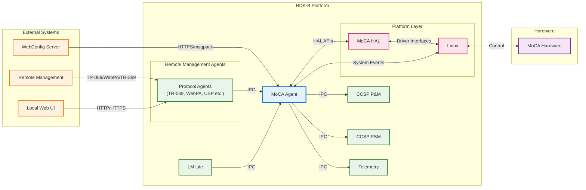
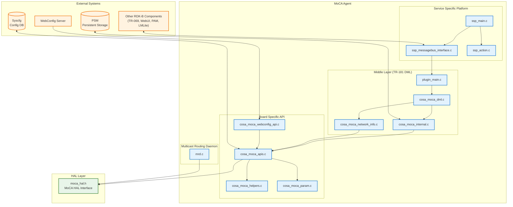
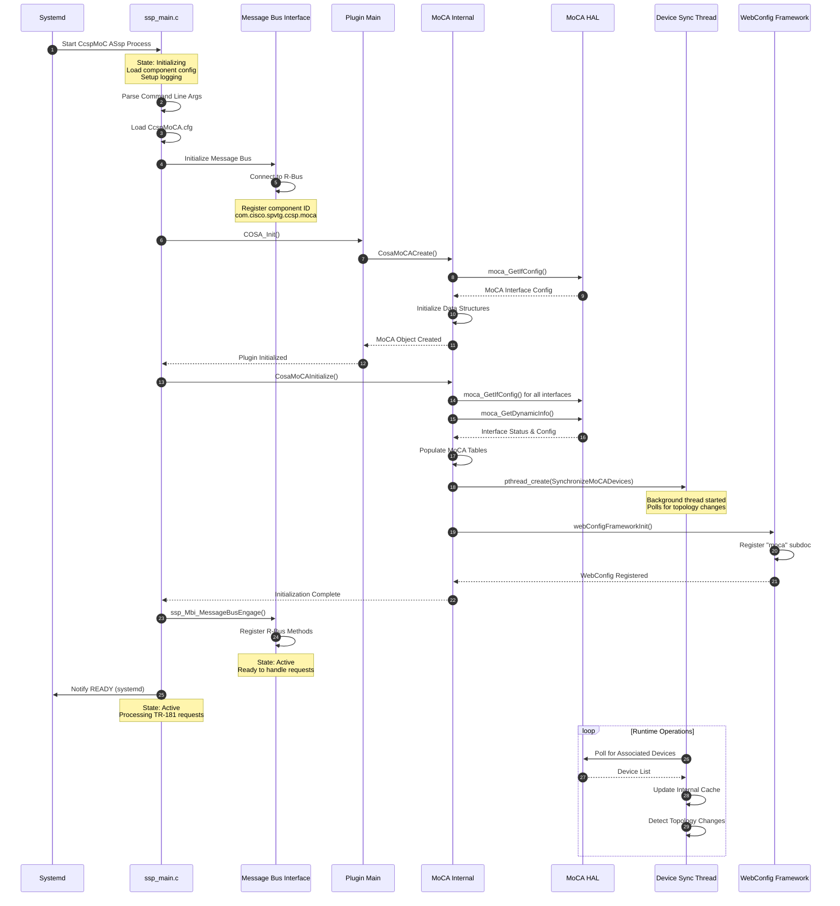
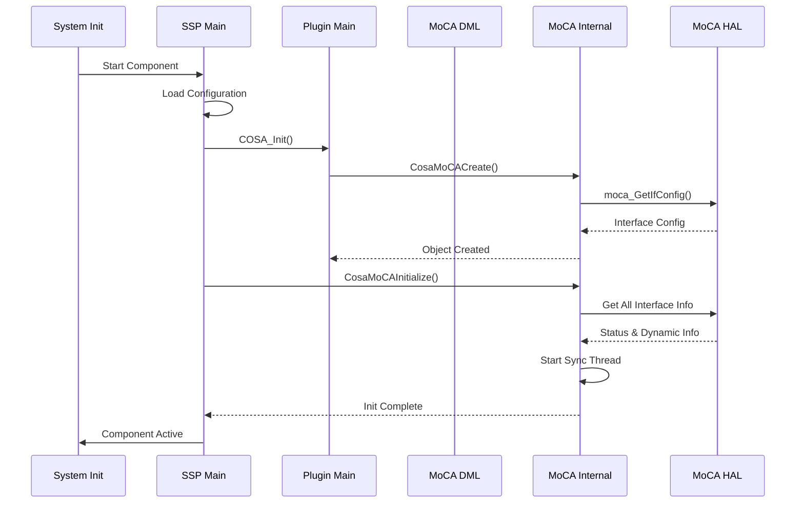
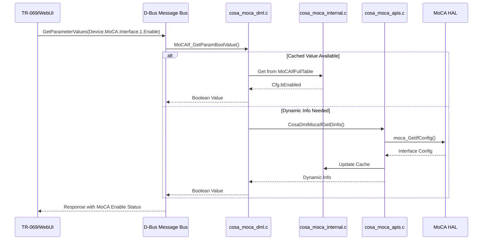
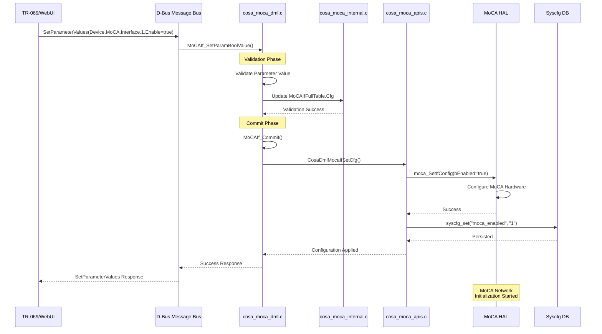
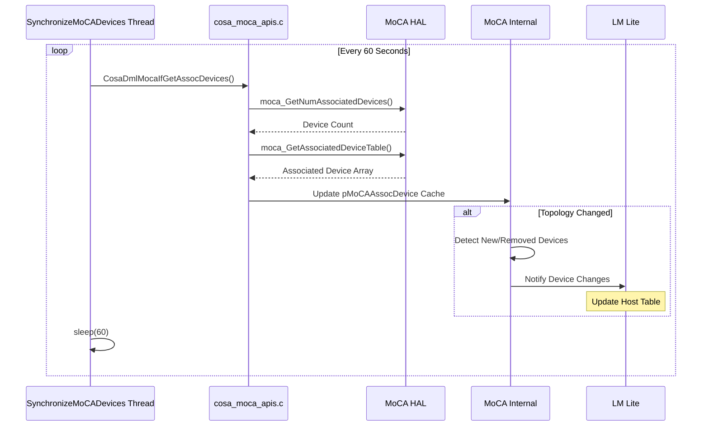
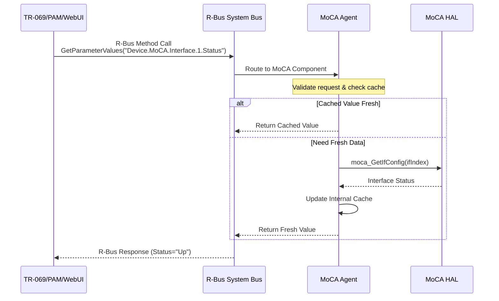
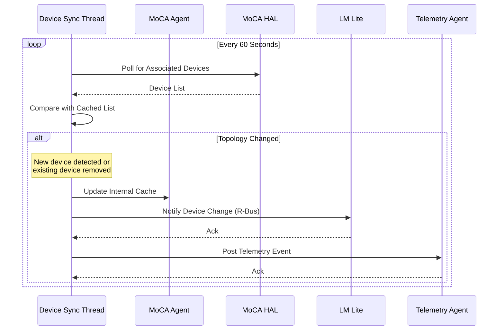
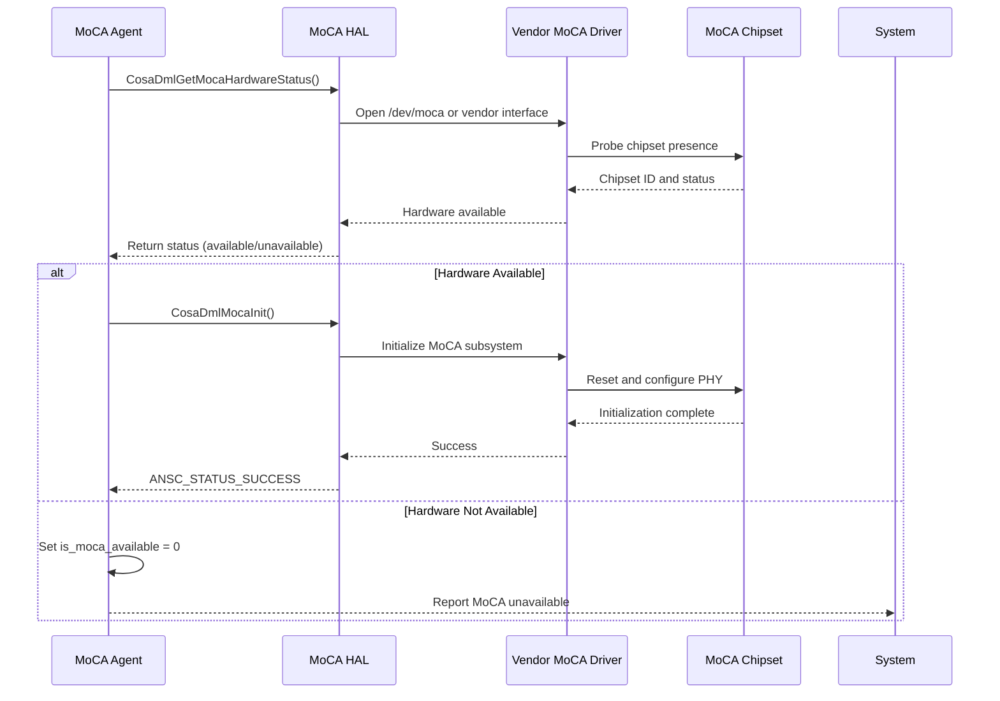

# MoCA Agent Documentation

The MoCA (Multimedia over Coax Alliance) Agent is a critical RDK-B middleware component responsible for managing and monitoring MoCA network interfaces in residential gateway devices. This component provides comprehensive management capabilities for MoCA networks, which enable high-speed data communication over existing coaxial cable infrastructure within the home. The MoCA Agent serves as the primary interface between the RDK-B middleware stack and the underlying MoCA hardware abstraction layer (HAL), facilitating network configuration, topology management, performance monitoring, and Quality of Service (QoS) control for MoCA-connected devices.

In the RDK-B ecosystem, the MoCA Agent acts as a bridge between high-level network management orchestration (performed by cloud management systems, TR-069 Auto Configuration Servers, or Web UI interfaces) and low-level hardware control (executed through vendor-specific MoCA HAL implementations). It exposes a comprehensive TR-181 data model for MoCA network configuration and monitoring, supports WebConfig framework integration for remote bulk provisioning, and provides real-time network topology information. The component ensures that MoCA networks remain operational throughout device lifecycle events including bootup, firmware upgrades, and network transitions, while maintaining compliance with MoCA Alliance specifications and CableLabs standards.

**Key Features & Responsibilities**: 

- **MoCA Network Configuration**: Manages MoCA interface configuration including enable/disable control, frequency settings, privacy enable, password management, preferred network controller (NC) selection, and beacon power level adjustments for optimal network performance
- **Topology Discovery & Monitoring**: Provides real-time MoCA network topology information including associated device discovery, node status tracking, mesh PHY rates, and network admission control for comprehensive network visibility
- **Performance Monitoring & Statistics**: Collects and reports detailed network performance metrics including packet statistics, link quality measurements, PHY rates, transmission power levels, and error counters for capacity planning and troubleshooting
- **Quality of Service (QoS) Management**: Implements MoCA QoS flow management including ingress/egress node control, packet aggregation, flow table management, and priority-based traffic shaping for real-time application support
- **WebConfig Framework Integration**: Supports remote bulk configuration through WebConfig framework using msgpack-encoded MoCA parameter sets, enabling zero-touch provisioning and cloud-based configuration management
- **Network Isolation & Security**: Provides MoCA network isolation capabilities, whitelist control for node admission, and privacy key management to ensure secure coexial network operation
- **Multicast Routing Daemon (MRD)**: Includes integrated MRD functionality for efficient multicast packet handling over MoCA networks, supporting IPTV and streaming media applications
- **Persistent Configuration Storage**: Maintains MoCA network configuration across reboots through syscfg integration and PSM persistence, ensuring consistent network behavior after power cycles and firmware upgrades

## Design

The MoCA Agent is architected as a CCSP (Common Component Software Platform) component following the standardized RDK-B middleware design pattern. The component consists of three primary architectural layers: the Service Specific Platform (SSP) layer which handles component initialization, message bus registration, and lifecycle management; the Middle Layer which implements TR-181 data model interfaces and business logic; and the Southbound API layer which abstracts hardware-specific operations through the MoCA HAL. This layered architecture ensures clean separation of concerns, enabling the component to be portable across different hardware platforms while maintaining consistent TR-181 data model behavior.

The design emphasizes robust inter-process communication through R-Bus message bus integration for northbound interfaces (communicating with TR-069 agents, Web UI, and other RDK-B components) and direct HAL API invocation for southbound interfaces (controlling MoCA hardware). The component registers the TR-181 namespace `Device.MoCA.*` for comprehensive MoCA network management parameters. State management is handled through a combination of runtime caching, PSM (Persistent Storage Manager) for configuration persistence, and syscfg for bootstrap parameters. The component implements intelligent polling mechanisms for dynamic MoCA network information including associated devices, mesh topology, and performance statistics.

The MoCA Agent employs an event-driven architecture where external configuration changes trigger R-Bus method invocations that flow through the middle layer validation and commit phases before being applied to hardware through HAL calls. The component supports asynchronous device synchronization through dedicated threads that periodically poll MoCA HAL for network topology changes and update internal data structures. WebConfig integration enables the component to receive bulk configuration updates encoded in msgpack format, which are decoded, validated, and applied atomically to ensure configuration consistency without service interruption.

Data persistence is achieved through multiple mechanisms: syscfg for simple key-value configuration storage such as enable/disable state and privacy settings, PSM for complex data model parameters that require transaction support, and runtime caching for frequently accessed dynamic information like associated device lists and statistics. The component ensures data integrity by validating all configuration changes against MoCA Alliance specifications before committing to persistent storage and hardware. Error handling follows RDK-B conventions with comprehensive logging through RDK Logger (rdklogger) and telemetry event generation for critical state transitions and error conditions.

### Prerequisites and Dependencies

**Build-Time Flags and Configuration:**

| Configure Option | DISTRO Feature | Build Flag | Purpose | Default |
|------------------|----------------|------------|---------|---------|
| `--enable-unitTestDockerSupport` | N/A | Unit test support | Enable Docker support for unit testing with modified test configurations | Disabled |
| N/A | `safec` | `pkg-config --cflags/--libs libsafec` | Enable bounds-checking string functions via safec library | Not set (uses `SAFEC_DUMMY_API`) |
| N/A (always) | N/A | `CONFIG_SYSTEM_MOCA` | MoCA system support enablement flag; when undefined, enables simulation mode | Enabled |
| N/A (always) | N/A | `FEATURE_SUPPORT_RDKLOG` | RDK Logger integration for structured logging | Enabled |
| N/A (always) | N/A | `_COSA_HAL_` | HAL-based implementation; explicitly marks non-simulation build | Enabled |
| N/A (always) | N/A | `USE_NOTIFY_COMPONENT` | Systemd notify protocol support for service management | Enabled |
| N/A (always) | N/A | `CCSP_SUPPORT_ENABLED` | CCSP framework core support | Enabled |
| N/A (always) | N/A | `INCLUDE_BREAKPAD` | Google Breakpad crash reporting and minidump generation | Enabled |
| N/A (recipe) | N/A | `-Wall -Werror -Wextra` | Enable strict compiler warnings and treat warnings as errors | Enabled |

 

**Platform/Product-Specific Build Flags (Conditional):**

| Build Flag | Condition | Purpose | Source Location |
|------------|-----------|---------|-----------------|
| `_CM_HIGHSPLIT_SUPPORTED_` | Platform-specific | Cable modem high-split frequency support; enables diplexer mode checking and MoCA disable logic | cosa_moca_internal.c, cosa_moca_apis.c, cosa_moca_dml.c |
| `_XB6_PRODUCT_REQ_` | XB6 platform | XB6 (Arris) product-specific customizations including modified HAL calls | cosa_moca_apis.c, cosa_moca_dml.c |
| `INTEL_PUMA7` | Intel Puma7 | Intel Puma7 chipset-specific modifications | cosa_moca_network_info.c, cosa_moca_apis.c |
| `MOCA_DIAGONISTIC` | Diagnostic mode | Enable MoCA diagnostic features and extended testing capabilities | cosa_moca_dml.c, cosa_moca_apis.c |
| `MULTILAN_FEATURE` | Multi-LAN support | Enable multi-LAN bridge feature support | cosa_moca_apis.c |
| `_DEBUG` | Debug mode | Enable debug builds with additional logging | ssp_main.c |

 

**Additional Build Configuration:**

- **WebConfig Support**: WebConfig framework is a mandatory dependency (not optional) for MoCA Agent, enabling remote bulk provisioning via msgpack-encoded configuration blobs

- **CCSP Framework Flags**: Inherited from `ccsp_common.inc` and applied automatically to all CCSP components

- **Platform-Specific Flags**: Defined in platform/product bbappend files or HAL configuration; conditionally compiled in source code

- **SafeC Integration**: When `safec` DISTRO feature is enabled, pkg-config automatically adds appropriate compiler/linker flags; otherwise `SAFEC_DUMMY_API` provides stub implementations

- **Yocto Release Variations**: Kirkstone uses `python3native`, earlier releases use `pythonnative`; SafeC library naming varies (`libsafec-3.5.1` for dunfell, `libsafec` for kirkstone)

**RDK-B Platform and Integration Requirements:**

- **Build Dependencies**: 
  - `ccsp-common-library` (CCSP framework and base interfaces)
  - `webconfig-framework` (Required for bulk configuration support)
  - `utopia` (System utility functions and configuration)
  - `hal-moca` (MoCA hardware abstraction layer)
  - `curl` (HTTP/HTTPS client for WebConfig)
  - `trower-base64` (Base64 encoding/decoding for data serialization)
  - `msgpack-c` (MessagePack serialization for WebConfig)
  - `libunpriv` (Privilege management and capability control)
  - `safec-lib` (Bounds-checking string functions - optional)
  
- **RDK-B Components**: 
  - **Component Registrar (CR)**: Must be running for D-Bus component discovery and registration
  - **PAM (Platform and Application Manager)**: Provides platform-level configuration management
  - **PSM (Persistent Storage Manager)**: Required for persisting MoCA configuration across reboots
  - **LM Lite**: Queries MoCA Agent for MoCA-connected device information
  - **Telemetry**: Receives MoCA network events and statistics for cloud reporting
  
- **HAL Dependencies**: 
  - `moca_hal.h` interface implementation (minimum version depends on platform)
  - HAL must provide: `moca_GetIfConfig()`, `moca_SetIfConfig()`, `moca_GetAssocDevices()`, `moca_GetMeshTable()`, `moca_GetFlowStatistics()`, QoS management APIs
  
- **Systemd Services**: 
  - `dbus.service` must be active
  - `CcspCrSsp.service` (Component Registrar) should start before MoCA Agent
  - `PsmSsp.service` (PSM) should be available before MoCA Agent initialization completes
  
- **Message Bus**: 
  - R-Bus system bus registration required
  - Component ID: `com.cisco.spvtg.ccsp.moca`
  - R-Bus path: `/com/cisco/spvtg/ccsp/moca`
  - TR-181 namespace: `Device.MoCA.*`
  
- **Configuration Files**: 
  - `/usr/ccsp/moca/CcspMoCA.cfg` - Component configuration (component ID, D-Bus path)
  - `/usr/ccsp/moca/CcspMoCADM.cfg` - Data model XML configuration
  - `/nvram/moca_initialized_bootup` - Bootup state tracking file
  - `/etc/syscfg` - Persistent configuration storage (moca_enabled, privacy settings)
  
- **Startup Order**: 
  1. D-Bus system bus
  2. Component Registrar (CR)
  3. PSM (for configuration loading)
  4. MoCA Agent initialization
  5. Async MoCA device synchronization thread
  6. WebConfig Framework (for remote provisioning)

**Threading Model** 

The MoCA Agent implements a multi-threaded architecture designed to handle concurrent message bus operations, periodic network topology updates, multicast routing daemon operations, telemetry logging, and sysevent monitoring without blocking critical configuration requests.

- **Threading Architecture**: Multi-threaded with main event loop and specialized worker threads for different operational domains
- **Main Thread**: 
  - Handles component initialization and registration with Component Registrar
  - Processes R-Bus method calls for TR-181 parameter get/set operations
  - Manages WebConfig bulk configuration requests
  - Coordinates HAL API calls for configuration changes

**Thread Summary:**

| Thread Name | Function Name | Purpose | Lifecycle | Priority/Detach |
|-------------|---------------|---------|-----------|-----------------|
| **Main Thread** | `main()` (ssp_main.c) | Component initialization, R-Bus message bus processing, TR-181 parameter handling, WebConfig updates, HAL coordination | Created at process start; runs until process termination | Default (joinable) |
| **MoCA Device Sync Thread** | `SynchronizeMoCADevices()` | Periodically polls MoCA HAL for associated device updates, mesh topology changes, network status; updates internal data structures; triggers LM Lite notifications on topology changes | Created during `CosaMoCAInitialize()`; runs continuously polling every 10 seconds | Default (joinable) |
| **Sysevent Handler Thread** | `Moca_sysevent_handler()` | Monitors sysevent notifications for `moca_updated` events; triggers MoCA configuration updates and device synchronization when external changes occur | Created during `CosaMoCACreate()`; runs continuously waiting for sysevent notifications | Default (joinable) |
| **Logger Thread** | `Logger_Thread()` | Performs periodic MoCA logging operations based on configured log interval; writes MoCA status and statistics to log files | Created by `CosaMoCALogger()`; runs with configurable sleep periods (default 60 sec intervals) | Default (joinable) |
| **Telemetry xOps Settings Thread** | `MocaTelemetryxOpsLogSettingsEventThread()` | Monitors `/tmp/moca_telemetry_xOpsLogSettings.txt` file using inotify for configuration changes; updates telemetry logging settings dynamically | Created during `CosaMoCATelemetryInit()`; runs continuously monitoring file changes | Detached |
| **Telemetry Logging Thread** | `MocaTelemetryLoggingThread()` | Performs periodic telemetry data collection and logging based on dynamic xOps configuration; writes MoCA metrics to `/rdklogs/logs/moca_telemetry.txt` | Created during `CosaMoCATelemetryInit()`; runs with configurable intervals controlled by xOps settings | Detached |
| **MoCA Interface Reset Thread** | `MoCA_Interface_Reset()` | Handles MoCA interface reset operations asynchronously; performs HAL reset calls with configured delays (5 seconds) to prevent blocking R-Bus operations | Created on-demand during TR-181 `Reset()` operation; terminates after reset completion | Default (joinable) |
| **Multicast Routing Daemon (MRD)** | `main()` (mrd.c) | Manages multicast packet routing over MoCA network; monitors ARP cache for multicast group membership; manages whitelist verification; injects multicast packets using libnet | Standalone process (not pthread); runs as separate executable `/usr/bin/mrd`; continuous main loop | Process (not thread) |

**Synchronization Mechanisms:**

- **Mutex Locks**: Protects shared data structures including MoCA interface tables, associated device lists, and telemetry configuration variables (e.g., `pthread_mutex_t mutex` in telemetry subsystem)
- **Condition Variables**: Used for thread communication in telemetry logging subsystem (`pthread_cond_t cond`) to signal configuration changes
- **Atomic Operations**: Thread-safe counter updates through pthread mechanisms for statistics collection
- **Sysevent Tokens**: Sysevent file descriptors (`sysevent_fd`, `sysevent_token`) for inter-process event notification
- **Shared Memory**: MRD process uses System V shared memory (shmget/shmat) for device whitelist access shared with xupnp service
- **File-Based Locking**: inotify mechanisms for configuration file monitoring without explicit locks
- **PSM Synchronization**: PSM database operations are synchronous and handled through R-Bus calls to PSM component ensuring atomic configuration persistence

### Component State Flow

**Initialization to Active State**

The MoCA Agent follows a structured initialization sequence that aligns with CCSP component lifecycle requirements. The component begins in an uninitialized state and progresses through configuration loading, data model registration, message bus engagement, HAL initialization, and device synchronization before entering an active operational state. This phased approach ensures all dependencies are satisfied and the component is fully ready to service requests before advertising availability to other RDK-B components.

**Runtime State Changes and Context Switching**

During normal operation, the MoCA Agent responds to various runtime events that trigger state changes in the underlying MoCA network and service configuration. These state transitions are primarily driven by external configuration changes, network topology events, and HAL status updates.

**State Change Triggers:**

- **MoCA Enable/Disable State Changes**: When MoCA interface enable state changes through TR-181 parameter `Device.MoCA.Interface.{i}.Enable`, the component transitions between operational and non-operational states, triggering HAL configuration updates, network topology resets, and telemetry events
- **Network Admission Control Events**: Dynamic node admission or removal from MoCA network causes topology table updates, triggers device synchronization thread to poll HAL, and generates notifications to LM Lite for host management updates
- **Privacy Mode Transitions**: Enabling or disabling privacy mode with password changes triggers network re-formation, existing node re-authentication, and new security key distribution to all admitted nodes
- **WebConfig Bulk Updates**: Receipt of MoCA configuration blob from WebConfig server triggers atomic configuration application including validation, HAL updates, and persistence operations without service interruption
- **Preferred NC Selection Changes**: Changing preferred network controller (NC) node can trigger network re-organization, backup NC promotion, and temporary service disruption during NC transition
- **Frequency Band Changes**: Modifying operating frequency parameters requires network shutdown, HAL reconfiguration, and network restart with new frequency settings

**Context Switching Scenarios:**

- **Bootstrap to Normal Configuration**: During first boot or factory reset, the component loads default MoCA configuration from syscfg (`moca_enabled`), applies vendor-specific HAL defaults, then transitions to runtime configuration mode where changes are persisted to PSM and syscfg
- **High-Split Mode Coexistence**: When cable modem high-split mode is detected (via sysevent), the component adjusts MoCA frequency parameters to avoid interference with DOCSIS upstream channels, temporarily reconfiguring the network
- **Multicast Routing State Changes**: MRD daemon dynamically enables/disables multicast routing based on IGMP group membership, switching between multicast forwarding and non-forwarding states
- **Failover and Recovery**: If MoCA HAL operations fail (timeout, hardware error), the component logs errors, generates telemetry events, and may retry operations or enter a degraded state while maintaining data model accessibility for diagnostics

### Call Flow

**Initialization Call Flow:**

**TR-181 Parameter Get Request Flow:**

**TR-181 Parameter Set Request Flow:**

**MoCA Device Topology Sync Flow:**

## Internal Modules

The MoCA Agent is organized into distinct functional modules that implement the CCSP component architecture pattern. Each module has specific responsibilities ranging from system integration and message bus handling to data model implementation, hardware abstraction, and multicast routing.

| Module/Class | Description | Key Files |
|-------------|------------|-----------|
| **Service Specific Platform (SSP)** | Component entry point and lifecycle management. Handles process initialization, command-line argument parsing, component configuration loading, message bus connection establishment, and graceful shutdown. Provides health monitoring interface and signal handling for crash recovery with breakpad integration. | `ssp_main.c`, `ssp_action.c`, `ssp_global.h`, `ssp_internal.h` |
| **Message Bus Interface** | R-Bus integration layer implementing CCSP message bus protocol. Manages component registration with Component Registrar, handles incoming R-Bus method calls (GetParameterValues, SetParameterValues, GetParameterNames, GetParameterAttributes), and routes requests to appropriate data model handlers. | `ssp_messagebus_interface.c`, `ssp_messagebus_interface.h` |
| **Plugin Main** | Data model plugin infrastructure providing COSA (Component Object Service Architecture) initialization. Implements plugin entry points for DM library integration, manages data model object creation/destruction, and provides versioning support for TR-181 implementation. | `plugin_main.c`, `plugin_main.h`, `plugin_main_apis.h` |
| **MoCA DML (Data Model Layer)** | TR-181 Device.MoCA.* object implementation providing standardized interface for MoCA network configuration and monitoring. Implements get/set/commit handlers for all TR-181 parameters including interface configuration, statistics, QoS settings, and associated device tables. Provides parameter validation and change notification capabilities. | `cosa_moca_dml.c`, `cosa_moca_dml.h` |
| **MoCA Internal Manager** | Backend manager responsible for MoCA object lifecycle, data structure initialization, and state management. Manages MoCA interface tables, associated device cache, mesh topology cache, and flow statistics. Coordinates device synchronization thread and WebConfig framework initialization. | `cosa_moca_internal.c`, `cosa_moca_internal.h` |
| **MoCA Network Info** | Network topology and device information module providing comprehensive visibility into MoCA network structure. Manages associated device discovery, node status tracking, mesh PHY rate reporting, and network admission control information. Implements caching strategies for performance optimization. | `cosa_moca_network_info.c`, `cosa_moca_network_info.h` |
| **MoCA Southbound APIs** | Southbound API layer abstracting MoCA HAL interactions. Provides wrapper functions for all HAL operations including interface configuration, statistics retrieval, QoS management, and device enumeration. Implements error handling, retry logic, and data conversion between TR-181 and HAL data structures. | `cosa_moca_apis.c` |
| **MoCA Helpers** | Utility functions for MoCA parameter validation, data format conversion, and common operations. Provides helper routines for MAC address manipulation, frequency band calculations, PHY rate conversions, and configuration sanity checks. | `cosa_moca_helpers.c`, `cosa_moca_helpers.h` |
| **MoCA Parameters** | Parameter definition and management module providing centralized parameter metadata. Defines parameter constraints, default values, and validation rules for MoCA configuration parameters. Supports parameter serialization for WebConfig integration. | `cosa_moca_param.c`, `cosa_moca_param.h` |
| **WebConfig API** | WebConfig framework integration module enabling remote bulk provisioning. Implements msgpack-based configuration blob parsing, version management, parameter validation, and atomic configuration application. Registers "moca" subdocument with WebConfig framework and provides version get/set callbacks. | `cosa_moca_webconfig_api.c`, `cosa_moca_webconfig_api.h` |
| **Multicast Routing Daemon (MRD)** | Standalone multicast routing daemon for efficient multicast packet handling over MoCA networks. Monitors ARP cache for multicast group membership, manages shared memory for multicast routing table, and performs libnet-based packet injection for multicast forwarding. Supports IPTV and streaming media applications. | `mrd.c` |

## Component Interactions

The MoCA Agent maintains extensive interactions with RDK-B middleware components, system services, and external management systems to provide comprehensive MoCA network management and monitoring capabilities. These interactions span multiple protocols and communication patterns including synchronous API calls, asynchronous event notifications, and data synchronization mechanisms.

### Interaction Matrix

| Target Component/Layer | Interaction Purpose | Key APIs/Endpoints |
|------------------------|-------------------|------------------|
| **RDK-B Middleware Components** |
| Component Registrar | Component discovery, registration, and namespace reservation | `registerCapabilities()`, component registration via R-Bus |
| PAM Agent | Platform configuration management, system-level MoCA enable/disable control | R-Bus: `Device.MoCA.*` parameter access |
| TR-069 Agent | Remote management via CWMP, parameter synchronization with ACS | R-Bus: `GetParameterValues`, `SetParameterValues`, `AddObject`, `DeleteObject` |
| WebPA Agent | Cloud-based device management and configuration via WebPA protocol | R-Bus: TR-181 parameter access, event subscriptions |
| LM Lite | MoCA-connected device discovery for host management and network analytics | R-Bus: Query `Device.MoCA.Interface.{i}.AssociatedDevice.{i}.*` |
| PSM (Persistent Storage Manager) | Configuration persistence across reboots for MoCA interface settings | `PSM_Set_Record_Value2()`, `PSM_Get_Record_Value2()`, R-Bus based |
| Telemetry Agent | Network event reporting, statistics collection for cloud analytics | Telemetry marker posting for MoCA state changes and errors |
| **System & HAL Layers** |
| MoCA HAL | Hardware control, status monitoring, network topology discovery | `moca_GetIfConfig()`, `moca_SetIfConfig()`, `moca_GetAssocDevices()`, `moca_GetMeshTable()`, `moca_GetFlowStatistics()`, `moca_GetQoSFlowTable()` |
| Syscfg | Persistent key-value storage for bootstrap configuration | `syscfg_get()`, `syscfg_set()`, `syscfg_commit()` for moca_enabled, privacy settings |
| Linux Network Stack | Network interface bridging, routing table management, ARP cache monitoring | File system access to `/proc/net/arp`, `/sys/class/net/`, network interface ioctls |
| Sysevent | Event-driven system configuration synchronization (for high-split mode) | `sysevent_get()`, `sysevent_set()` for CM operational mode detection |

**Events Published by MoCA Agent:**

| Event Name | Event Topic/Path | Trigger Condition | Subscriber Components |
|------------|-----------------|-------------------|---------------------|
| MoCA_Interface_Enable_Change | `Device.MoCA.Interface.{i}.Enable` | MoCA interface enabled or disabled | PAM, TR-069, Telemetry |
| MoCA_Device_Associated | `Device.MoCA.Interface.{i}.AssociatedDeviceNumberOfEntries` | New MoCA device joins network | LM Lite, Telemetry |
| MoCA_Device_Disassociated | `Device.MoCA.Interface.{i}.AssociatedDeviceNumberOfEntries` | MoCA device leaves network | LM Lite, Telemetry |
| MoCA_Network_Status_Change | `Device.MoCA.Interface.{i}.Status` | Network status transitions (Up, Down, Error) | PAM, Telemetry |
| MoCA_Privacy_Mode_Change | `Device.MoCA.Interface.{i}.PrivacyEnabledSetting` | Privacy mode enabled/disabled or password changed | Telemetry, Security Components |
| MoCA_NC_Change | `Device.MoCA.Interface.{i}.NetworkCoordinator` | Network Coordinator (NC) role changes | Telemetry |

### IPC Flow Patterns

**Primary IPC Flow - TR-181 Parameter Access:**

**Event Notification Flow:**

## Implementation Details

### MoCA Driver and Hardware Interface

The MoCA Agent operates through a well-defined software stack that bridges the middleware layer to the underlying MoCA hardware through the Hardware Abstraction Layer (HAL) and vendor-specific kernel drivers.

**Driver Architecture and Layers:**

The MoCA driver stack in RDK-B follows a layered architecture that provides clean separation between platform-independent middleware code and vendor-specific hardware implementations:

1. **MoCA Agent (Middleware Layer)**: Platform-independent CCSP component implementing TR-181 data model and business logic

2. **MoCA HAL (Hardware Abstraction Layer)**: Standardized C API interface defined by RDK-B that vendors must implement for their specific hardware. The HAL provides a consistent interface across different MoCA chipsets and SoC platforms.

3. **Vendor-Specific HAL Implementation**: Platform-specific implementation of the MoCA HAL interface that interfaces with the vendor's MoCA driver through various mechanisms:
   - Character device interfaces (`/dev/moca*`)
   - ioctl system calls for configuration and control
   - Shared memory regions for performance data
   - Netlink sockets for event notification
   - Vendor-specific libraries wrapping driver access

4. **MoCA Kernel Driver**: Vendor-provided kernel module that directly controls the MoCA hardware chipset. This driver handles:
   - MoCA PHY layer initialization and configuration
   - Network admission control and node authentication
   - QoS packet scheduling and flow management
   - Performance counter collection
   - Interrupt handling for hardware events
   - Direct register access to MoCA SoC/chipset

5. **MoCA Hardware/Chipset**: Physical MoCA network controller implementing MoCA Alliance specifications (MoCA 1.1, 2.0, 2.5, etc.)

**Vendor HAL Implementations:**

The MoCA HAL interface is defined in the `rdkb-halif-moca` repository and must be implemented by hardware vendors/SoC manufacturers. Common vendor implementations include:

| Vendor/SoC Platform | HAL Implementation Source | Driver Type | Typical Chipset |
|---------------------|---------------------------|-------------|-----------------|
| Broadcom | `hardware-abstraction-layer/source/moca/` | Kernel module + userspace library | BCM63xx, BCM3390 MoCA 2.0/2.5 |
| Intel Puma | Platform-specific HAL | Kernel module with proprietary interface | Intel Puma 6/7 integrated MoCA |
| MaxLinear (formerly Intel) | Vendor HAL implementation | Character device driver | XRX series with MoCA support |
| Generic/Reference | `hal-moca-generic` | Simulation or minimal implementation | Testing/development only |

**Driver Initialization Flow:**

**HAL-to-Driver Interface Methods:**

The vendor HAL implementation typically uses one or more of these mechanisms to communicate with the kernel driver:

- **ioctl() calls**: Primary method for configuration and control operations. The HAL issues ioctl commands to character device `/dev/moca` with vendor-specific command codes and data structures.

- **sysfs interfaces**: Some implementations expose MoCA parameters through `/sys/class/net/moca*/` for status and statistics queries.

- **Netlink sockets**: Asynchronous event notification from driver to HAL for topology changes, link state transitions, and hardware alerts.

- **Memory-mapped I/O**: Direct hardware register access for performance-critical operations (typically restricted to kernel space).

- **Vendor libraries**: Proprietary userspace libraries that wrap driver access and provide higher-level APIs to the HAL implementation.

**Driver Configuration and Build:**

MoCA drivers are typically built as kernel modules and loaded during system boot. The driver configuration is platform-specific:

- **Yocto Recipe**: `meta-rdk-broadband/recipes-ccsp/hal/hal-moca-generic_git.bb` and platform-specific bbappend files
- **Kernel Config**: Platform device tree or kernel configuration enables MoCA driver support
- **Module Loading**: Loaded via systemd services or init scripts before MoCA Agent starts
- **Device Nodes**: Creates `/dev/moca` or vendor-specific device files with appropriate permissions

**Platform Detection and Hardware Availability:**

The MoCA Agent performs hardware detection during initialization through `CosaDmlGetMocaHardwareStatus()` which:
1. Attempts to open HAL interface to vendor driver (retries up to 5 times with 1-second delays)
2. Queries hardware presence through HAL probe operations
3. Sets `is_moca_available` flag based on successful hardware detection
4. Falls back to non-operational mode if hardware unavailable, allowing data model queries but disabling network operations

### Major HAL APIs Integration

The MoCA Agent integrates comprehensively with the MoCA HAL interface to provide full control and monitoring of MoCA hardware. The component abstracts hardware-specific implementations through standardized HAL APIs while maintaining flexibility for vendor-specific optimizations and extensions.

**Core HAL APIs:**

| HAL API | Purpose | Implementation File |
|---------|---------|-------------------|
| `moca_GetIfConfig()` | Retrieve MoCA interface configuration including enable state, preferred NC, frequency mask, privacy settings, and operational parameters | `cosa_moca_apis.c`: `CosaDmlMocaIfGetCfg()` |
| `moca_SetIfConfig()` | Apply MoCA interface configuration changes to hardware including network enable/disable, frequency adjustments, privacy mode, and power settings | `cosa_moca_apis.c`: `CosaDmlMocaIfSetCfg()` |
| `moca_GetDynamicInfo()` | Query dynamic MoCA interface information including link status, current NC node ID, backup NC ID, network version, and operational frequency | `cosa_moca_apis.c`: `CosaDmlMocaIfGetDinfo()` |
| `moca_GetStaticInfo()` | Retrieve static interface information such as firmware version, hardware version, MAC address, and supported feature capabilities | `cosa_moca_apis.c`: `CosaDmlMocaIfGetSinfo()` |
| `moca_GetStats()` | Collect interface-level statistics including packet counters, byte counters, error statistics, and unicast/broadcast/multicast traffic | `cosa_moca_apis.c`: `CosaDmlMocaIfGetStats()` |
| `moca_GetNumAssociatedDevices()` | Get count of MoCA nodes currently associated with the network | `cosa_moca_apis.c`: `CosaDmlMocaIfGetAssocDevices()` |
| `moca_GetAssociatedDeviceTable()` | Enumerate all associated MoCA devices with detailed information including MAC address, node ID, PHY rates, link status, and active status | `cosa_moca_apis.c`: `CosaDmlMocaIfGetAssocDevices()` |
| `moca_GetMeshTable()` | Retrieve mesh PHY rate table showing transmission rates between all node pairs for network performance analysis | `cosa_moca_apis.c`: `CosaDmlMocaIfGetMeshTable()` |
| `moca_GetFlowStatistics()` | Query per-flow statistics for QoS flow tracking including ingress/egress node IDs, packet counts, and flow priority | `cosa_moca_apis.c`: `CosaDmlMocaIfGetFlowTable()` |
| `moca_GetQoSFlowTable()` | Retrieve QoS flow configuration table with flow parameters, packet aggregation settings, and priority assignments | `cosa_moca_apis.c`: `CosaDmlMocaIfExtCounterGetInfo()` |
| `moca_SetPreferredNC()` | Configure preferred Network Coordinator node for network leadership selection | `cosa_moca_apis.c`: `CosaDmlMocaIfSetCfg()` |
| `moca_SetPrivacyPassword()` | Set MoCA network privacy password for secure network operation and node authentication | `cosa_moca_apis.c`: `CosaDmlMocaIfSetCfg()` |
| `moca_cancelAssociation()` | Force disassociation of a specific MoCA node from the network by MAC address | `cosa_moca_apis.c`: `CosaDmlMocaIfExtAggrCounterGetInfo()` |
| `moca_GetResetCount()` | Query MoCA interface reset counter for stability monitoring and diagnostics | `cosa_moca_apis.c`: `CosaDmlMocaGetResetCount()` |

### Key Implementation Logic

- **Device Synchronization Engine**: Multi-threaded polling system (`SynchronizeMoCADevices` in `cosa_moca_internal.c`) that periodically queries MoCA HAL for network topology changes. Runs every 60 seconds to discover new associated devices, detect node departures, and update internal cache. Implements change detection algorithms to minimize R-Bus notification overhead by only reporting actual topology changes to subscribers like LM Lite. Thread-safe access to shared device tables using mutex protection.

- **WebConfig Integration**: Msgpack-based bulk configuration system (`Process_Moca_WebConfigRequest` in `cosa_moca_webconfig_api.c`) supporting atomic configuration updates from cloud management. Implements version control through syscfg to prevent configuration rollback. Validates all parameters before HAL application to ensure configuration consistency. Supports rollback on partial failure to maintain service availability. Persists configuration to both syscfg and PSM for redundancy.

- **Parameter Validation & Sanity Checks**: Comprehensive validation in `cosa_moca_dml.c` for all TR-181 parameter sets including frequency mask range checking, privacy password length validation (12-17 characters), transmit power level bounds checking, and beacon power adjustment limits. Implements interdependency validation such as requiring privacy password when privacy is enabled. Provides detailed error codes for debugging configuration issues.

- **MoCA Isolation & Whitelist Control**: Network security features (`MoCA_isolation.sh`, `moca_whitelist_ctl.sh`) implementing node admission control and network isolation from untrusted devices. Whitelist management supports MAC address-based filtering for controlled network access. Isolation mode prevents unauthorized node association while maintaining existing connections.

- **Multicast Routing Optimization**: MRD daemon (`mrd.c`) implements efficient multicast packet forwarding over MoCA by monitoring ARP cache for multicast group membership (224.0.0.0/4), managing shared memory-based multicast routing table, and performing libnet-based packet injection for multicast streams. Supports IGMP snooping integration and reduces CPU overhead for IPTV applications by offloading multicast replication to MoCA hardware where supported.

- **Event Processing**: Asynchronous event handling for R-Bus requests with non-blocking I/O. Parameter get operations utilize cached data when available to minimize HAL calls and improve response latency. Parameter set operations implement two-phase commit (validate then apply) to ensure atomic configuration changes. WebConfig requests processed in dedicated handler thread to prevent blocking main message bus thread.

- **Error Handling Strategy**: Comprehensive error detection with retry logic for transient HAL failures. HAL error codes mapped to CCSP error codes for consistent error reporting. Timeout handling with configurable thresholds for HAL operations (default 30 seconds). Graceful degradation during HAL unavailability - component remains responsive to queries using cached data while logging errors. Automatic recovery mechanisms including HAL reinitialization on persistent failures. Telemetry event generation for all critical errors enabling remote diagnostics.

- **Logging & Debugging**: Multi-level logging system using RDK Logger with component-specific log file (`MOCAlog.txt.0`). Structured logging with function name, line number, and contextual information. Debug logging for all HAL interactions including API calls, parameters, and return values. Performance logging for device synchronization timing and cache update durations. Console debug mode support via command-line flag for development troubleshooting. Trace logging for message bus transactions and parameter access patterns.

### Key Configuration Files

| Configuration File | Purpose | Override Mechanisms |
|--------------------|---------|---------------------|
| `CcspMoCA.cfg` | Component registration configuration defining component ID (`com.cisco.spvtg.ccsp.moca`), R-Bus path (`/com/cisco/spvtg/ccsp/moca`), and data model XML reference | Compile-time configuration, no runtime override |
| `CcspMoCADM.cfg` | Data model XML configuration pointer specifying TR-181 data model XML file location for COSA framework | Configuration file path, can be overridden via component config |
| `TR181-MoCA.XML` | Complete TR-181 MoCA data model definition including object hierarchy, parameter types, access permissions, and DML function mappings | Data model version updates via XML replacement |
| `/etc/syscfg` (moca_enabled) | Persistent MoCA enable/disable state stored as "0" (disabled) or "1" (enabled) | `syscfg set moca_enabled <value>; syscfg commit` |
| `/etc/syscfg` (moca_version) | WebConfig subdocument version tracking for configuration synchronization | WebConfig framework automatic version management |
| `/nvram/moca_initialized_bootup` | Bootup state marker file indicating component initialization status for crash recovery | File presence/absence, automatically managed |
| `MoCA_isolation.sh` | Shell script implementing MoCA network isolation controls via iptables rules and bridge filtering | Script parameters: `enable`/`disable` |
| `moca_whitelist_ctl.sh` | Whitelist management script for MAC-based node admission control | Script parameters: `add <MAC>`/`remove <MAC>`/`clear` |
| `moca_mroute.sh` | Multicast routing setup script configuring multicast forwarding rules for MoCA interface | Executed during MoCA enable, no runtime parameters |
| `moca_mroute_ip.sh` | IP-specific multicast routing configuration for IPTV stream forwarding | Executed with IP parameters for specific multicast groups |

---

**Documentation Complete!** The MoCA Agent documentation now includes:
- Comprehensive component overview with system context diagrams
- Detailed design architecture with component breakdown
- Complete prerequisites, dependencies, and build-time configuration
- Threading model and state flow diagrams
- Initialization and operational call flows
- Internal module organization and responsibilities
- Component interactions with matrix and IPC patterns
- Implementation details with HAL APIs and key logic
- Configuration file reference with override mechanisms

