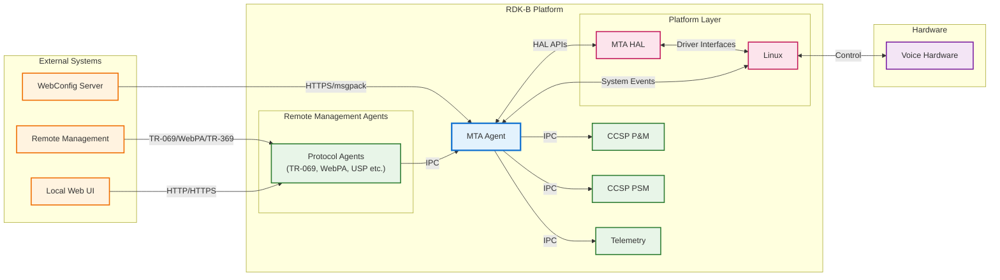
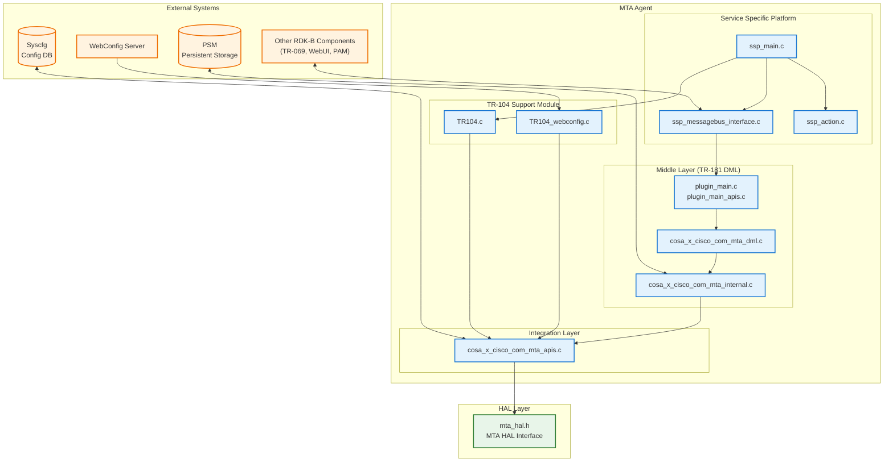
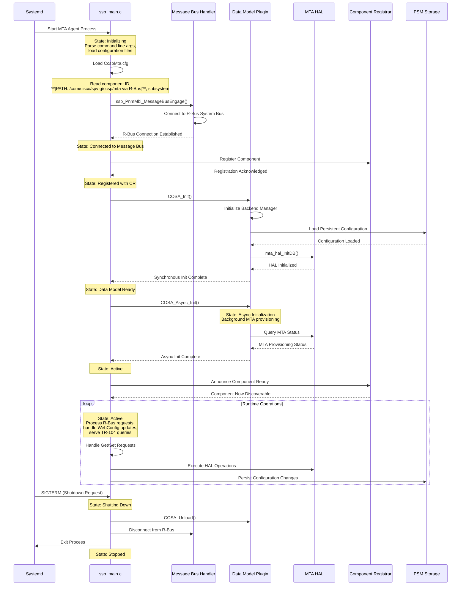
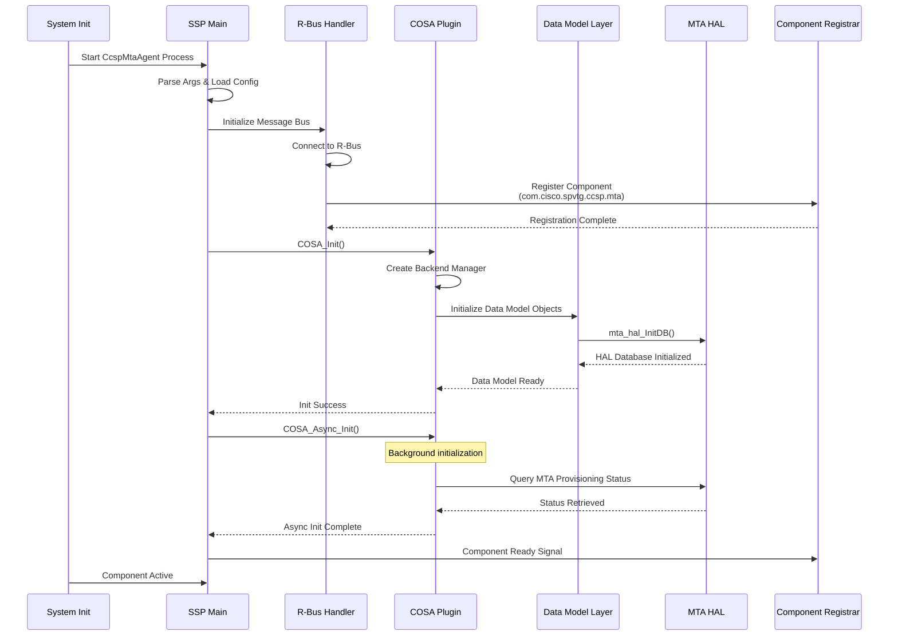
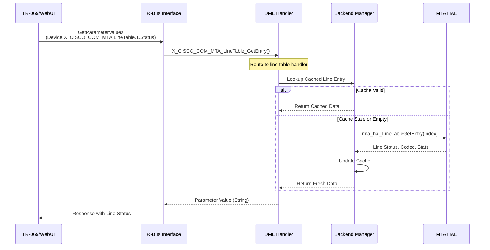
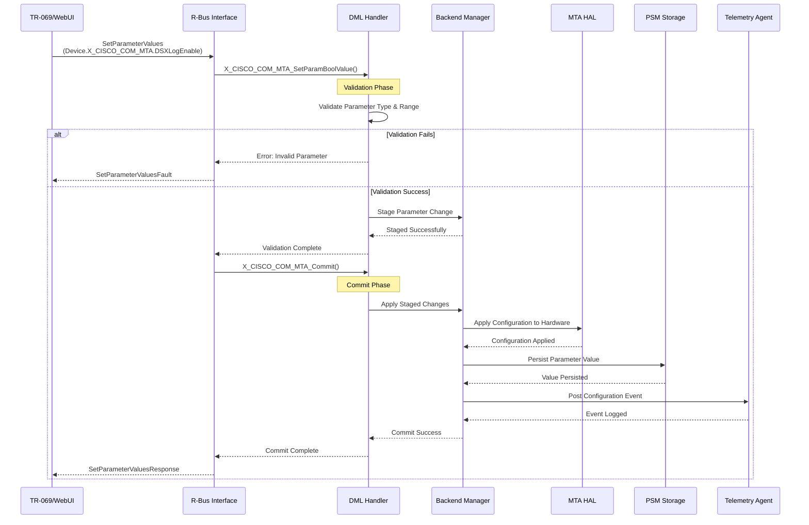
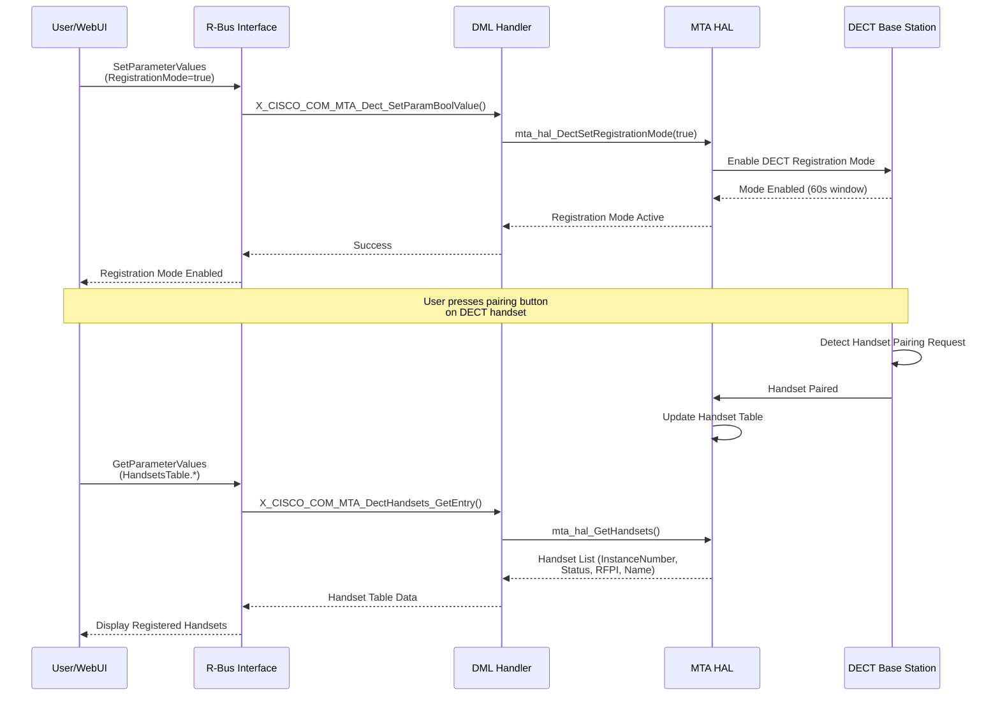
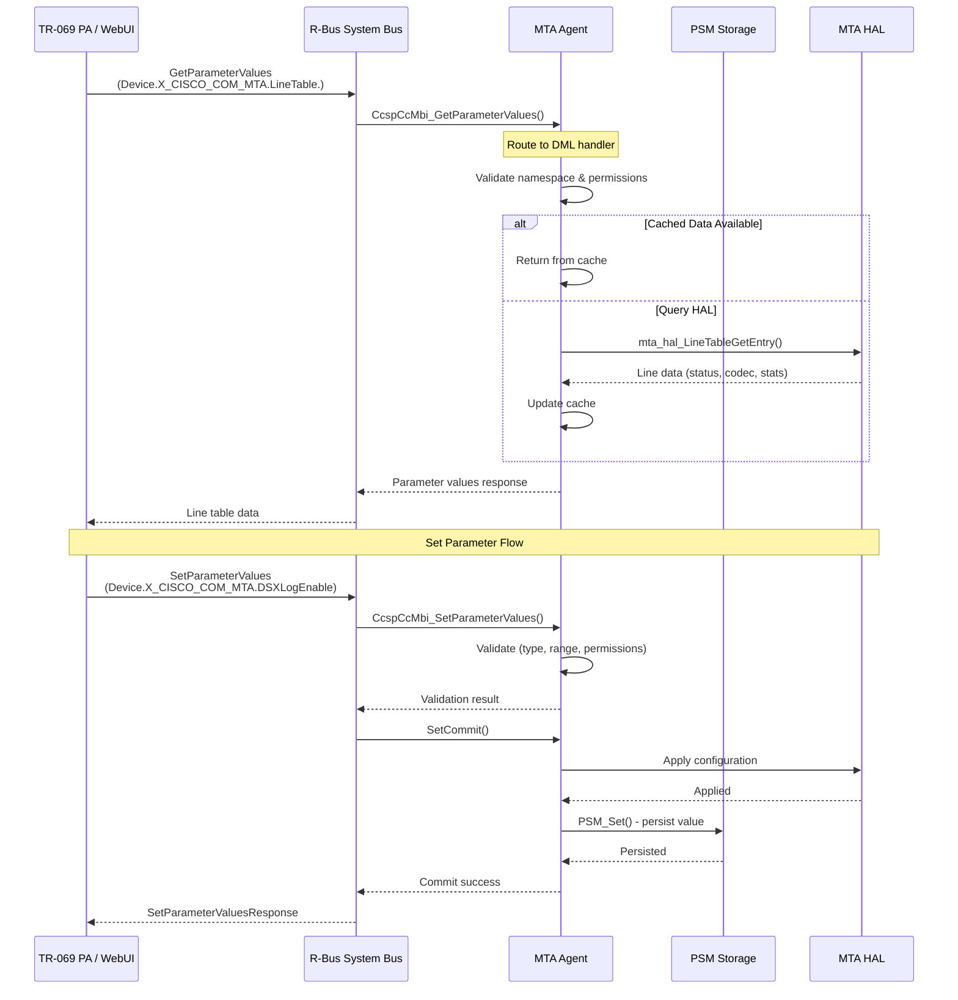
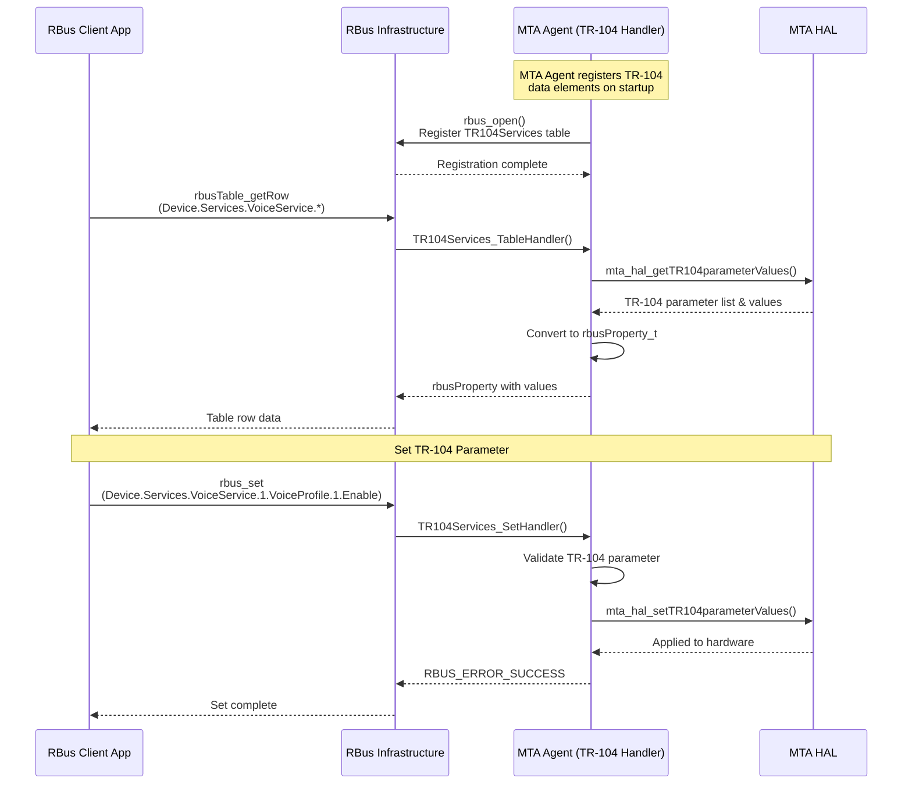

# Media Terminal Adapter (MTA) Agent Documentation

The Media Terminal Adapter (MTA) Agent is a critical RDK-B middleware component responsible for managing PacketCable/DOCSIS-based voice services in cable operator networks. This component provides comprehensive management capabilities for multimedia terminal adapters, enabling residential gateways to support VoIP telephony services through DOCSIS cable infrastructure. The MTA Agent serves as the primary interface between the RDK-B middleware stack and the underlying MTA hardware abstraction layer (HAL), facilitating voice line provisioning, call management, DHCP/DHCPv6 configuration, DECT cordless phone support, and TR-104 VoIP service configuration. As a CCSP (Common Component Software Platform) component, it integrates seamlessly with the RDK-B architecture to provide standardized voice service management across diverse cable modem platforms.

In the RDK-B ecosystem, the MTA Agent acts as a bridge between high-level voice service orchestration (performed by cloud management systems, TR-069 Auto Configuration Servers, or Web UI interfaces) and low-level hardware control (executed through vendor-specific MTA HAL implementations). It exposes a comprehensive TR-181 data model for voice service configuration and monitoring, supports TR-104 VoIP service parameter management through RBus interfaces, and provides WebConfig framework integration for remote bulk provisioning. The component ensures that voice services remain operational throughout device lifecycle events including bootup, firmware upgrades, and network transitions, while maintaining compliance with PacketCable specifications and CableLabs standards.

**Key Features & Responsibilities**: 

- **Voice Line Management**: Manages PacketCable voice line provisioning, configuration, and monitoring including line status, registration state, call statistics, and quality metrics for FXS (Foreign Exchange Station) ports and DECT cordless handsets
- **TR-104 VoIP Service Support**: Implements TR-104 (Voice over IP) data model for comprehensive VoIP service configuration including SIP profiles, codecs, network parameters, call features, and service provider settings through RBus interface
- **DHCP/DHCPv6 Information Management**: Monitors and reports MTA-specific DHCP and DHCPv6 lease information including provisioning server addresses, TFTP boot file locations, time servers, and FQDN assignments critical for PacketCable provisioning
- **DECT Cordless Phone Support**: Provides registration, deregistration, and management capabilities for DECT (Digital Enhanced Cordless Telecommunications) handsets including PIN management and handset discovery
- **Service Flow Monitoring**: Tracks DOCSIS service flow statistics for voice traffic including upstream/downstream bandwidth allocation, QoS parameters, and real-time performance metrics
- **WebConfig Framework Integration**: Supports remote bulk configuration through WebConfig framework using msgpack-encoded TR-104 parameter sets, enabling zero-touch provisioning and cloud-based configuration management
- **Call Management & Diagnostics**: Offers call detail reporting, active call tracking, diagnostic trigger capabilities, and overcurrent fault detection for troubleshooting voice service issues
- **Persistent Configuration Storage**: Maintains voice service configuration across reboots through syscfg integration and manages bootstrap configuration data with secure storage mechanisms

## Design

The MTA Agent is architected as a CCSP (Common Component Software Platform) component following the standardized RDK-B middleware design pattern. The component consists of three primary architectural layers: the Service Specific Platform (SSP) layer which handles component initialization, message bus registration, and lifecycle management; the Middle Layer which implements TR-181 data model interfaces and business logic; and the Integration Layer which abstracts hardware-specific operations through the MTA HAL. This layered architecture ensures clean separation of concerns, enabling the component to be portable across different hardware platforms while maintaining consistent TR-181 data model behavior.

The design emphasizes robust inter-process communication through R-Bus message bus integration for northbound interfaces (communicating with TR-069 agents, Web UI, and other RDK-B components) and direct HAL API invocation for southbound interfaces (controlling MTA hardware). The component registers multiple TR-181 namespaces including `Device.X_CISCO_COM_MTA.*` for legacy Cisco-specific parameters and implements TR-104 VoIP service parameters through RBus data elements when TR-104 support is enabled. State management is handled through a combination of runtime caching, PSM (Persistent Storage Manager) for configuration persistence, and syscfg for bootstrap parameters.

The MTA Agent employs an event-driven architecture where external configuration changes trigger R-Bus method invocations that flow through the middle layer validation and commit phases before being applied to hardware through HAL calls. The component supports asynchronous initialization to prevent blocking the system startup sequence, allowing time-consuming MTA hardware initialization to complete in the background while other system components come online. WebConfig integration enables the component to receive bulk configuration updates encoded in msgpack format, which are decoded, validated, and applied atomically to ensure configuration consistency.

Data persistence is achieved through multiple mechanisms: syscfg for simple key-value configuration storage, PSM for complex data model parameters that require transaction support, and NVRAM file storage for TR-104 configuration blobs. The component ensures data integrity by validating all configuration changes against PacketCable specifications before committing to persistent storage and hardware. Error handling follows RDK-B conventions with comprehensive logging through RDK Logger (rdklogger) and telemetry event generation for critical state transitions and error conditions.

### Prerequisites and Dependencies

**RDK-B Platform and Integration Requirements:**

**Build-Time Flags and Configuration:**

| Configure Option | DISTRO Feature | Build Flag | Purpose | Default |
|------------------|----------------|------------|---------|---------|
| N/A | N/A | `MTA_TR104SUPPORT` | Enable TR-104 VoIP data model with RBus interface and WebConfig handlers | Not defined |
| N/A | N/A | `FEATURE_SUPPORT_WEBCONFIG` | Enable WebConfig framework integration for TR-104 bulk provisioning | Not set |
| N/A | N/A | `FEATURE_RDKB_WAN_MANAGER` | Enable WAN Manager integration for Ethernet WAN mode support | Not set |
| N/A | N/A | `FEATURE_SUPPORT_RDKLOG` | RDK Logger integration for structured logging | Enabled |
| N/A | N/A | `INCLUDE_BREAKPAD` | Google Breakpad crash reporting and minidump generation | Enabled |
| N/A | `safec` | N/A | Enable bounds-checking string functions via safec library | Not set (uses `SAFEC_DUMMY_API`) |
| N/A | `webconfig` | N/A | Enable WebConfig framework integration | Not set |
| N/A | `kirkstone` | N/A | Yocto Kirkstone build adjustments; Python 3 interpreter selection | Not set (uses `pythonnative`) |
| N/A | `rdkb_wan_manager` | N/A | WAN Manager integration | Not set |
| N/A | N/A | `INTEL_PUMA7` | Intel Puma7 chipset-specific code paths and optimizations | Not defined |
| N/A | N/A | `_CBR_PRODUCT_REQ_` | Comcast CBR product-specific requirements and features | Not defined |
| N/A | N/A | `_XB6_PRODUCT_REQ_` | XB6 gateway platform requirements | Not defined |
| N/A | N/A | `_COSA_INTEL_USG_ARM_` | Intel USG ARM platform identifier | Enabled |
| N/A | N/A | `_COSA_FOR_COMCAST_` | Comcast/Xfinity operator-specific customizations | Enabled |
| `--enable-unitTestDockerSupport` | N/A | N/A | Reduce MTA polling timeouts for Docker-based unit testing | Disabled |
| N/A | N/A | `_COSA_SIM_` | Simulation mode for development/testing without real hardware | Not defined |

 

**Additional Build Configuration:**

- **Core MTA Timeouts** (configure.ac `MTA_CFLAGS`):
  - `MAX_TIMEOUT_MTA_DHCP_ENABLED` = 60 seconds (production) / 2 seconds (unit test)
  - `MAX_TIMEOUT_MTA_DHCP_DISABLED` = 300 seconds (production) / 1 second (unit test)
  - `FOREVER` = 1 (production infinite loop) / 0 (unit test finite execution)

- **Platform-Specific Flags**: Defined in platform/product bbappend files or HAL configuration; conditionally compiled in source code

- **TR-104 Support**: `MTA_TR104SUPPORT` must be manually defined and requires additional dependencies:
  - `rbus` library for RBus data element registration
  - `webconfig-framework` for bulk provisioning
  - `msgpack-c` for msgpack encoding/decoding

- **SafeC Integration**: When `safec` DISTRO feature is enabled, pkg-config automatically adds appropriate compiler/linker flags; otherwise `SAFEC_DUMMY_API` provides stub implementations

- **Build Dependencies**: 
  - `hal-mta` (MTA Hardware Abstraction Layer)
  - `libsyscfg` (System configuration database)
  - `rdk-logger` (RDK logging framework)
  - `libtelemetry` (Telemetry event reporting)
  - `msgpack-c` (MessagePack serialization for WebConfig)
  - `webconfig-framework` (WebConfig integration, optional)
  - `rbus` (RBus library for TR-104 support, optional)
  - `safec-lib` (Bounds-checking string functions)

- **HAL Dependencies**: 
  - `mta_hal.h` interface implementation (minimum version depends on platform)
  - HAL must provide: `mta_hal_InitDB()`, `mta_hal_GetDHCPInfo()`, `mta_hal_LineTableGetEntry()`, `mta_hal_GetServiceFlow()`, DECT management APIs, and TR-104 parameter handlers (if TR-104 enabled)

**Threading Model** 

The MTA Agent employs a single-threaded event-driven architecture for main R-Bus message processing to ensure thread-safety and avoid race conditions when accessing shared data structures. The component's threading model is designed around the CCSP framework's message bus dispatcher which operates on a single main thread handling all incoming R-Bus method calls, property get/set operations, and event notifications.

- **Threading Architecture**: Single-threaded event-driven model with R-Bus main loop integration
- **Main Thread**: 
  - Handles component initialization and registration with Component Registrar
  - Processes all R-Bus method invocations (get/set parameter requests from TR-069, Web UI, other CCSP components)
  - Executes data model validation and commit operations
  - Invokes HAL API calls synchronously (HAL calls may block but are typically fast)
  - Manages WebConfig message processing when bulk configuration updates arrive
  - Handles RBus subscriptions and get/set operations for TR-104 data elements
- **Asynchronous Initialization**: 
  - `COSA_Async_Init()` function allows MTA hardware initialization to complete in background
  - Prevents blocking system startup if MTA provisioning takes significant time
  - Component reports ready state once async initialization completes
- **Synchronization**: 
  - No explicit mutex/locking required for main data structures as single-threaded model prevents concurrent access
  - HAL layer is responsible for its own thread-safety if HAL implementation uses multi-threading
  - File I/O operations (reading/writing NVRAM configuration) execute synchronously on main thread
  - PSM database operations are synchronous and handled through R-Bus calls to PSM component

### Component State Flow

**Initialization to Active State**

The MTA Agent follows a structured initialization sequence that aligns with CCSP component lifecycle requirements. The component begins in an uninitialized state and progresses through configuration loading, data model registration, message bus engagement, and hardware initialization before entering an active operational state. This phased approach ensures all dependencies are satisfied and the component is fully ready to service requests before advertising availability to other RDK-B components.

**Runtime State Changes and Context Switching**

During normal operation, the MTA Agent responds to various runtime events that trigger state changes in the underlying MTA hardware and service configuration. These state transitions are primarily driven by external configuration changes, network events, and hardware status updates.

**State Change Triggers:**

- **MTA Provisioning State Changes**: When DOCSIS cable modem completes registration and MTA begins PacketCable provisioning flow, the component transitions from non-provisioned to provisioned state, triggering telemetry events and updating data model status parameters
- **Voice Line Registration Events**: SIP registration success/failure for individual voice lines causes line status transitions (idle → registering → registered → in-call → idle), which are reflected in TR-181 `LineTable` entries
- **DECT Handset Registration**: User-initiated DECT handset pairing mode enables registration mode temporarily, allowing new cordless handsets to join the system; deregistration removes handsets from the active handset table
- **WebConfig Bulk Updates**: Receipt of TR-104 configuration blob from WebConfig server triggers atomic configuration application including validation, HAL updates, and persistence operations
- **DHCP Lease Renewal**: MTA DHCP/DHCPv6 lease renewals update provisioning server information, time servers, and TFTP boot file locations which may trigger re-provisioning flows
- **Overcurrent Fault Detection**: Hardware fault conditions (FXS port overcurrent) trigger protective state transitions and generate fault status reports for diagnostics

**Context Switching Scenarios:**

- **Bootstrap to Normal Configuration**: During first boot or factory reset, the component loads bootstrap configuration from `/opt/secure/bootstrap.json`, applies default voice service parameters, then transitions to runtime configuration mode where changes are persisted to NVRAM
- **TR-104 Enable/Disable**: When TR-104 support is enabled/disabled through syscfg (`TR104enable` flag), the component registers or unregisters RBus data elements and enables/disables WebConfig TR-104 subdocument processing without requiring process restart
- **Failover and Recovery**: If MTA HAL operations fail (timeout, hardware error), the component logs errors, generates telemetry events, and may retry operations or enter a degraded state while maintaining data model accessibility for diagnostics

### Call Flow

**Initialization Call Flow:**

**TR-181 Parameter Get Request Flow:**

**TR-181 Parameter Set Request Flow:**

**DECT Handset Registration Flow:**

## Internal Modules

The MTA Agent is organized into distinct functional modules that implement the CCSP component architecture pattern. Each module has specific responsibilities ranging from system integration and message bus handling to data model implementation and hardware abstraction.

| Module/Class | Description | Key Files |
|-------------|------------|-----------|
| **Service Specific Platform (SSP)** | Component entry point and lifecycle management. Handles process initialization, command-line argument parsing, component configuration loading, message bus connection establishment, and graceful shutdown. Provides health monitoring interface and signal handling for crash recovery. | `ssp_main.c`, `ssp_action.c`, `ssp_global.h`, `ssp_internal.h` |
| **Message Bus Interface** | R-Bus integration layer implementing CCSP message bus protocol. Manages component registration with Component Registrar, handles incoming R-Bus method calls (GetParameterValues, SetParameterValues, GetParameterNames, GetParameterAttributes), and routes requests to appropriate data model handlers. | `ssp_messagebus_interface.c`, `ssp_messagebus_interface.h` |
| **TR-104 RBus Handler** | RBus interface implementation for TR-104 VoIP service data model. Provides get/set handlers for TR-104 parameters, manages table-based data elements, and integrates with MTA HAL for TR-104 parameter retrieval and configuration. Enabled only when `MTA_TR104SUPPORT` compile flag is set. | `TR104.c`, `TR104.h` |
| **TR-104 WebConfig Handler** | WebConfig framework integration for bulk TR-104 configuration. Decodes msgpack-encoded TR-104 parameter blobs from WebConfig server, validates structure, applies configuration through HAL, persists to NVRAM as base64-encoded data, and reports provisioning status through sysevent. | `TR104_webconfig.c` |
| **Data Model Plugin** | COSA (Component Object Service Architecture) plugin implementing TR-181 data model lifecycle. Provides `COSA_Init()` for synchronous initialization, `COSA_Async_Init()` for background MTA provisioning, `COSA_Unload()` for cleanup, and memory management functions. Registers data model XML definition and function pointers with CCSP framework. | `plugin_main.c`, `plugin_main.h`, `plugin_main_apis.c`, `plugin_main_apis.h` |
| **Data Model Layer (DML)** | TR-181 parameter get/set/validate/commit handler implementation for `Device.X_CISCO_COM_MTA.*` namespace. Implements handlers for MTA root object, DHCPInfo (IPv4/IPv6), LineTable (voice lines), ServiceFlow statistics, DECT management, and diagnostic controls. Enforces parameter validation rules and manages multi-phase commit protocol. | `cosa_x_cisco_com_mta_dml.c`, `cosa_x_cisco_com_mta_dml.h` |
| **Backend Manager (Internal)** | Core business logic and state management. Maintains runtime cache of MTA status, line configurations, DECT handset list, and service flow data. Coordinates between DML layer and HAL integration layer, manages asynchronous initialization, and handles PSM interaction for persistent storage. | `cosa_x_cisco_com_mta_internal.c`, `cosa_x_cisco_com_mta_internal.h` |
| **HAL Integration Layer** | Hardware abstraction layer wrapper providing vendor-neutral interface to MTA HAL. Implements API wrappers for all MTA HAL functions including initialization, DHCP info retrieval, line management, service flow queries, DECT operations, and TR-104 parameter access. Handles HAL error code translation and logging. | `cosa_x_cisco_com_mta_apis.c`, `cosa_x_cisco_com_mta_apis.h` |
| **Custom Platform Definitions** | Platform-specific configuration and customization header. May contain hardware-specific constants, feature flags, and platform adaptations required for different cable modem chipsets and MTA implementations. | `mta_custom.h` |

## Component Interactions

The MTA Agent interacts with multiple RDK-B middleware components, system services, and external management systems to provide comprehensive voice service management. These interactions follow standardized protocols including R-Bus for CCSP component communication, RBus for TR-104 data elements, syscfg for configuration persistence, and WebConfig for bulk provisioning.

### Interaction Matrix

| Target Component/Layer | Interaction Purpose | Key APIs/Endpoints |
|------------------------|-------------------|------------------|
| **RDK-B Middleware Components** |
| Component Registrar (CR) | Component registration, discovery, and health monitoring | `CcspBaseIf_Register_Event()`, `CcspBaseIf_discComponentSupportingNamespace()` |
| TR-069 Protocol Adapter | Remote management parameter access for voice service configuration | R-Bus: `Device.X_CISCO_COM_MTA.*` namespace |
| PAM (Platform Abstraction Manager) | Coordinate voice service initialization with overall platform provisioning state | R-Bus: Parameter queries for provisioning status |
| PSM (Persistent Storage Manager) | Store and retrieve voice line configuration, DECT settings, and service parameters | `PSM_Set()`, `PSM_Get()`, `PSM_Del()` |
| WebConfig Agent | Receive and apply bulk TR-104 VoIP configuration from cloud | WebConfig Subdoc: `TR104`, callback: `TR104_WebConfigDataHandler()` |
| Telemetry Agent | Report critical events: provisioning changes, line registration, faults | Telemetry markers: `MTA_PROVISIONED`, `MTA_LINE_STATUS_CHANGE` |
| **System & HAL Layers** |
| MTA HAL | Control voice hardware, query status, manage lines, DECT, service flows | `mta_hal_InitDB()`, `mta_hal_GetDHCPInfo()`, `mta_hal_LineTableGetEntry()`, `mta_hal_GetServiceFlow()`, `mta_hal_DectGetEnable()`, `mta_hal_getTR104parameterValues()`, `mta_hal_setTR104parameterValues()` |
| Syscfg | Persistent key-value storage for bootstrap config, TR-104 enable flag | `syscfg_get()`, `syscfg_set()`, `syscfg_commit()` |
| Sysevent | Publish MTA provisioning status for consumption by other processes | `sysevent_set()`: `mta_provision_status`, `mta_status` |
| R-Bus System Bus | Primary IPC mechanism for CCSP component communication | Standard R-Bus methods: `GetParameterValues`, `SetParameterValues`, `GetParameterNames` |
| RBus | TR-104 data element registration and serving (when TR-104 support enabled) | `rbusHandle_t`, `rbusProperty_t`, `TR104Services_GetHandler()`, `TR104Services_SetHandler()` |
| NVRAM Filesystem | Persist TR-104 configuration blob, bootstrap data, partner defaults | File paths: `/nvram/.vsb64.txt`, `/nvram/partners_defaults.json`, `/nvram/bootstrap.json` |

**Events Published by MTA Agent:**

| Event Name | Event Topic/Path | Trigger Condition | Subscriber Components |
|------------|-----------------|-------------------|---------------------|
| `mta_provision_status` | Sysevent key | MTA provisioning state change (MTA_PROVISIONED / MTA_NON_PROVISIONED) | System monitoring, PAM, WebConfig |
| `mta_status` | Sysevent key | MTA initialization progress (MTA_INIT, MTA_START, MTA_COMPLETE, MTA_ERROR, MTA_REJECTED) | System initialization, diagnostics |
| `MTA_PROVISIONED` | Telemetry marker | MTA successfully provisioned and voice services operational | Telemetry backend, cloud analytics |
| `MTA_LINE_STATUS_CHANGE` | Telemetry marker | Voice line registration status change (idle → registered → in-call) | Call analytics, service quality monitoring |
| `MTA_DECT_REGISTRATION` | Telemetry marker | DECT handset registered or deregistered | User activity tracking |
| `MTA_OVERCURRENT_FAULT` | Telemetry marker | FXS port overcurrent fault detected | Hardware fault monitoring |
| Component State Change | R-Bus signal via CR | Component health status change (green, yellow, red) | Component Registrar, system health monitors |

### IPC Flow Patterns

**Primary IPC Flow - R-Bus Parameter Access:**

**RBus TR-104 Data Access Flow:**

## Implementation Details

### Major HAL APIs Integration

The MTA Agent relies heavily on the MTA HAL interface to abstract hardware-specific voice service operations. The HAL provides a standardized API that vendors implement for their specific MTA chipsets and DOCSIS platforms. The component uses these HAL APIs extensively throughout its data model implementation.

**Core HAL APIs:**

| HAL API | Purpose | Implementation File |
|---------|---------|-------------------|
| `mta_hal_InitDB()` | Initialize MTA HAL subsystem and establish connection to MTA hardware/firmware. Must be called before any other HAL operations. | `cosa_x_cisco_com_mta_apis.c::CosaDmlMTAInit()` |
| `mta_hal_GetDHCPInfo()` | Retrieve MTA IPv4 DHCP lease information including IP address, subnet mask, gateway, DNS servers, boot filename, FQDN, lease times, and DHCP options (3,6,7,8). | `cosa_x_cisco_com_mta_apis.c::CosaDmlMTAGetDHCPInfo()` |
| `mta_hal_GetDHCPV6Info()` | Retrieve MTA IPv6 DHCPv6 lease information including IPv6 address, prefix, boot filename, DNS servers, and DHCPv6 option data. | `cosa_x_cisco_com_mta_apis.c::CosaDmlMTAGetDHCPV6Info()` |
| `mta_hal_LineTableGetNumberOfEntries()` | Query the number of voice lines provisioned in the MTA (typically 2 for residential gateways, up to 8 for MTAs). | `cosa_x_cisco_com_mta_apis.c::CosaDmlMTALineTableGetNumberOfEntries()` |
| `mta_hal_LineTableGetEntry()` | Retrieve detailed voice line information for a specific line index: status, registration state, codec, call statistics, quality metrics, emergency call capability. | `cosa_x_cisco_com_mta_apis.c::CosaDmlMTALineTableGetEntry()` |
| `mta_hal_TriggerDiagnostics()` | Initiate diagnostics for a specific voice line to test connectivity, codec negotiation, and call quality. | `cosa_x_cisco_com_mta_apis.c::CosaDmlMtaTriggerDiagnostics()` |
| `mta_hal_GetServiceFlow()` | Query DOCSIS service flow statistics including upstream/downstream bandwidth, packet counts, and QoS parameters for voice traffic. | `cosa_x_cisco_com_mta_apis.c::CosaDmlMtaGetServiceFlow()` |
| `mta_hal_DectGetEnable()` | Get DECT base station enable status (whether cordless phone support is active). | `cosa_x_cisco_com_mta_apis.c::CosaDmlMTADectGetEnable()` |
| `mta_hal_DectSetEnable()` | Enable or disable DECT base station functionality for cordless handset support. | `cosa_x_cisco_com_mta_apis.c::CosaDmlMTADectSetEnable()` |
| `mta_hal_DectGetRegistrationMode()` | Query whether DECT registration mode is active (allowing new handsets to pair). | `cosa_x_cisco_com_mta_apis.c::CosaDmlMTADectGetRegistrationMode()` |
| `mta_hal_DectSetRegistrationMode()` | Enable/disable DECT handset registration mode (typically opens 60-second pairing window). | `cosa_x_cisco_com_mta_apis.c::CosaDmlMTADectSetRegistrationMode()` |
| `mta_hal_DectDeregisterDectHandset()` | Deregister a specific DECT handset by instance number, removing it from the paired handset list. | `cosa_x_cisco_com_mta_apis.c::CosaDmlMTADectDeregisterDectHandset()` |
| `mta_hal_GetHandsets()` | Retrieve list of registered DECT handsets with details: instance number, status, RFPI (Radio Fixed Part Identity), handset name. | `cosa_x_cisco_com_mta_apis.c::CosaDmlMTADectGetHandsets()` |
| `mta_hal_GetCalls()` | Query active calls on a specific voice line including call direction, remote number, codec in use, start time. | `cosa_x_cisco_com_mta_apis.c::CosaDmlMtaLineGetCalls()` |
| `mta_hal_getTR104parameterValues()` | Retrieve TR-104 VoIP service parameter values from MTA hardware (used when TR-104 support enabled). | `TR104.c::TR104Services_TableHandler()` |
| `mta_hal_setTR104parameterValues()` | Apply TR-104 VoIP configuration parameters to MTA hardware (used for WebConfig bulk provisioning). | `TR104_webconfig.c::TR104_WebConfigDataHandler()` |
| `mta_hal_getTR104parameterNames()` | Query list of supported TR-104 parameter names from HAL implementation. | `TR104.c::TR104_open()` |

### Key Implementation Logic

- **State Machine Engine**: The MTA Agent does not implement an explicit finite state machine, but rather follows the CCSP component lifecycle state model (Initializing → Registered → Active → Shutting Down). MTA provisioning state is managed by the underlying HAL and DOCSIS stack, with the agent observing and reporting status through data model parameters.

  - Component lifecycle managed in `ssp_main.c::main()` and `ssp_action.c`
  - Asynchronous MTA initialization in `plugin_main.c::COSA_Async_Init()`
  - State transitions logged through RDK Logger with component health updates to Component Registrar

- **Event Processing**: The agent operates in a reactive event-driven model responding to external requests rather than generating internal state machine events. Events are processed through the R-Bus message dispatcher on the main thread.

  - R-Bus method invocations dispatched to DML handlers in `cosa_x_cisco_com_mta_dml.c`
  - WebConfig events handled through callback registration in `TR104_webconfig.c`
  - RBus TR-104 subscriptions processed through handlers in `TR104.c`
  - No asynchronous event queue; all processing synchronous on main thread

- **Error Handling Strategy**: Errors are detected at multiple layers and propagated through return codes, with logging and telemetry generation for critical failures.

  - HAL errors (RETURN_ERR) logged and translated to CCSP return codes (ANSC_STATUS_FAILURE)
  - Validation failures in DML layer return error codes to R-Bus clients without committing changes
  - WebConfig parsing errors reject entire configuration blob to prevent partial application
  - Telemetry events generated for provisioning failures, line registration failures, hardware faults
  - No automatic retry logic; external management systems responsible for retry

- **Logging & Debugging**: Comprehensive logging using RDK Logger infrastructure with configurable log levels.

  - Log categories: `LOG_RDK_LOG_DEBUG`, `LOG_RDK_LOG_INFO`, `LOG_RDK_LOG_ERROR`
  - Trace macros: `CcspTraceDebug()`, `CcspTraceInfo()`, `CcspTraceWarning()`, `CcspTraceError()`
  - Crash backtrace capture to `/nvram/MTaAgentSsp_backtrace` for post-mortem analysis
  - Memory leak detection through CCSP memory tracking: `COSA_MemoryCheck()`, `COSA_MemoryUsage()`

### Key Configuration Files

| Configuration File | Purpose | Override Mechanisms |
|--------------------|---------|--------------------|
| `/etc/CcspMta.cfg` | Component identity and R-Bus configuration. Defines component ID (`com.cisco.spvtg.ccsp.mta`), **[PATH: /com/cisco/spvtg/ccsp/mta via R-Bus]**, and data model library reference. | Typically static; changes require component restart |
| `/etc/CcspMtaAgent.xml` | TR-181 data model XML definition mapping object paths to function handlers. Defines complete object hierarchy for `Device.X_CISCO_COM_MTA.*` namespace with function pointers for get/set/validate/commit operations. | Generated from data model tools; platform integrators may customize |
| `/etc/CcspMtaLib.cfg` | Data model library configuration referenced from main component config. | Platform-specific customization |
| `/nvram/partners_defaults.json` | Partner-specific default configurations for different cable operators. May contain default voice service settings per partner ID. | Provisioned during manufacturing or first boot; updated via firmware |
| `/opt/secure/bootstrap.json` | Secure bootstrap configuration data including initial provisioning parameters. Used during first-time provisioning before full configuration available. | Securely provisioned; fallback to `/nvram/bootstrap.json` if primary missing |

