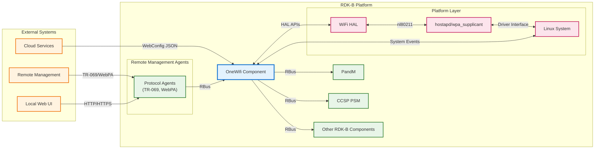
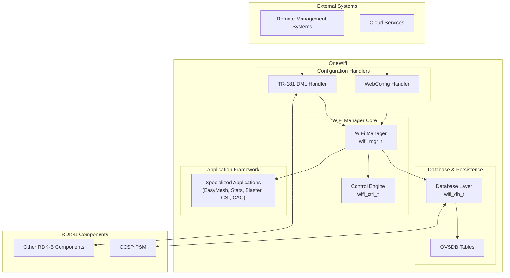
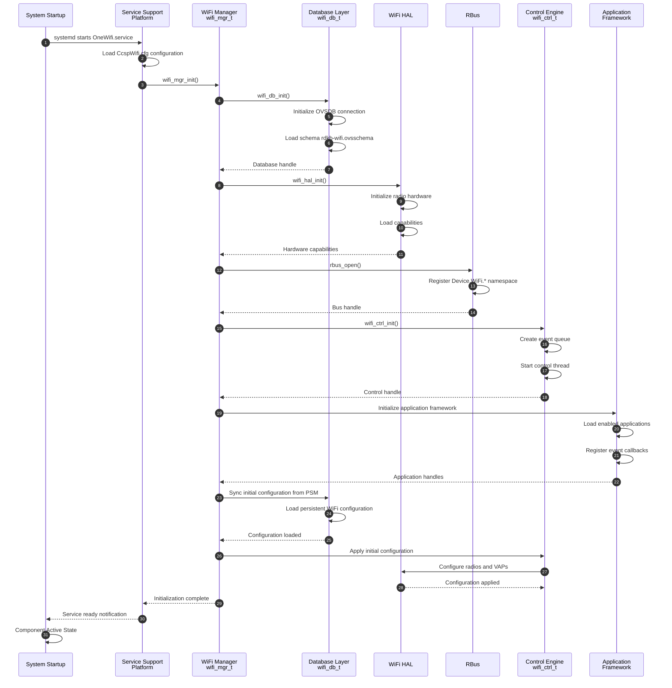
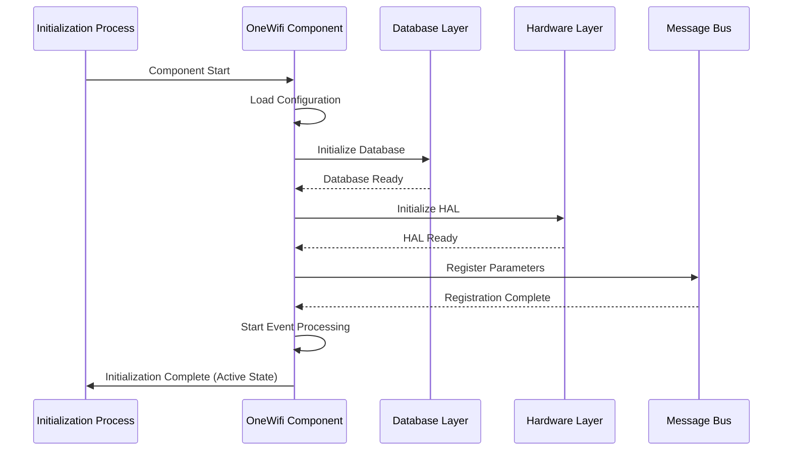
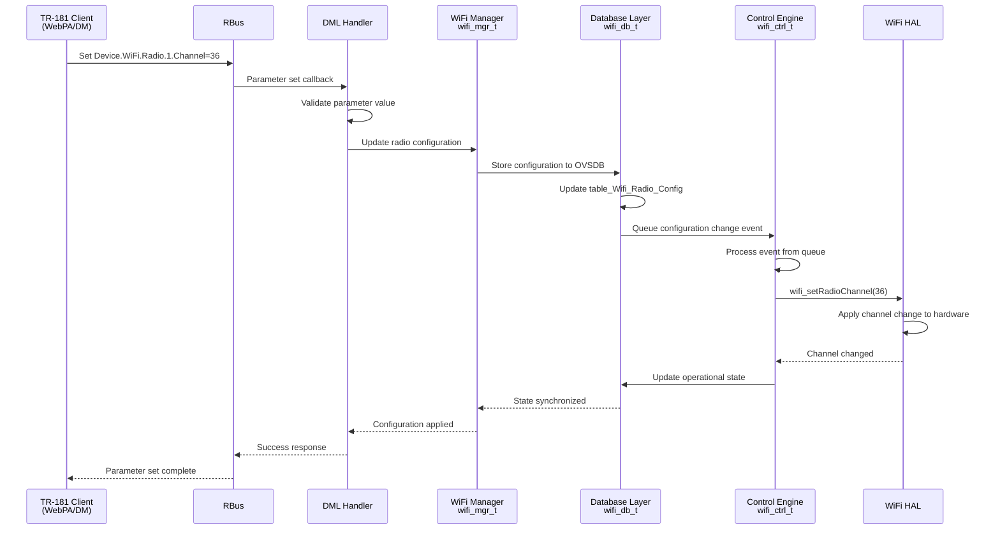
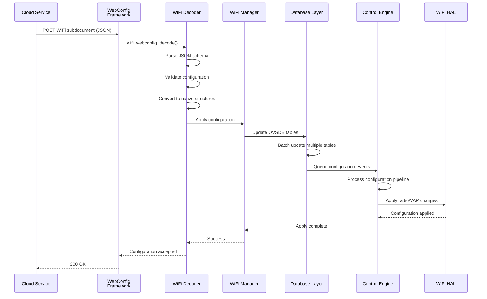

# OneWifi

OneWifi is the RDK-B component responsible for WiFi management, providing control of WiFi parameters, statistics, telemetry, client steering, and optimization across both Gateway and Extender devices. This component is the central WiFi management system for RDK platforms, handling operations across multiple radios, Virtual Access Points (VAPs), and specialized applications. OneWifi bridges high-level configuration interfaces (TR-181 and JSON-based WebConfig) with underlying hardware via the Hardware Abstraction Layer (HAL).

OneWifi manages radio configuration, VAP management, client association handling, DFS channel management, security configuration, and WiFi 6E/7 support. It implements TR-181 data model parameters for WiFi management and integrates with WebPA for cloud-based configuration and monitoring. OneWifi orchestrates all WiFi-related functionality, coordinating between configuration sources, internal database, control engine, and hardware abstraction layer. VAPs are categorized by service type prefixes including private_ssid, iot_ssid, hotspot, and mesh_backhaul to distinguish different service purposes.

The component supports mesh WiFi (EasyMesh Multi-AP protocol), WiFi optimization (client steering), performance measurement (Blaster), motion detection (CSI analytics), channel availability checking (CAC), and statistics collection through a modular application framework. For mesh networking, the system supports both Gateway and Extender device roles with automatic backhaul selection using ranking algorithms based on SNR and Channel Utilization.



**Key Features & Responsibilities**: 

- **Unified WiFi Management**: Centralized control of all WiFi operations including radio configuration, VAP management, client associations, and security settings across multiple radios and service types
- **Multi-Interface Configuration**: Supports TR-181 data model access and JSON-based WebConfig for flexible configuration from local management interfaces and cloud services
- **Event-Driven Control Engine**: Real-time processing of hardware events, configuration changes, and application requests through an event queue architecture with database synchronization
- **Application Framework**: Hosts specialized applications including EasyMesh (Multi-AP), Statistics Monitor, Blaster (performance testing), CSI (motion detection), CAC (channel availability), and client steering
- **Hardware Abstraction**: Interfaces with WiFi HAL providing platform-independent WiFi management supporting WiFi 5/6/6E/7 standards and vendor-specific features


## Design

OneWifi follows a layered, event-driven architecture designed to provide centralized WiFi management while maintaining separation between configuration interfaces, control logic, persistent storage, and hardware abstraction. The design emphasizes modularity, scalability, and real-time responsiveness to both configuration changes and hardware events. The architecture separates concerns between external configuration sources (TR-181 DML and WebConfig), the central WiFi manager, control engine, database layer, and hardware abstraction layer through well-defined interfaces.

The component operates as a central orchestrator coordinating between multiple subsystems. The WiFi Manager (wifi_mgr_t) maintains global state including radio configurations, VAP mappings, hardware capabilities, and handles for database and control engine instances. The Control Engine (wifi_ctrl_t) processes events from an internal queue including database updates, HAL indications, timeout events, and application requests. The database layer uses OVSDB-based persistent storage with in-memory caching for performance. Configuration changes flow through validation, normalization, and apply pipelines to maintain consistency between external interfaces, internal state, and hardware configuration.

The northbound interface uses TR-181 compliant access through RBus messaging for integration with other RDK-B components and external management systems. WebConfig integration handles cloud-based configuration through JSON subdocuments with schema validation. The southbound interface abstracts hardware interactions through WiFi HAL APIs supporting multiple vendor platforms. Data persistence is achieved through OVSDB database integration with PSM for non-volatile storage across reboots. The application framework allows specialized applications to register for events and extend WiFi functionality without modifying core logic. When CONFIG_IEEE80211BE is enabled, OneWifi supports WiFi 7 (802.11be) Multi-Link Operation (MLO) and Multi-Link Device (MLD) management. The MLO architecture tracks Multi-Link Device identifiers using UNDEFINED_MLD_ID and MLD_UNIT_COUNT constants, implements Wi-Fi Alliance data model extensions in wfa_dml_cb.c for APMLD (Access Point Multi-Link Device) and STAMLD (Station Multi-Link Device) identity tracking, and supports simultaneous operation across 2.4GHz, 5GHz, and 6GHz bands with coordinated channel selection and DFS handling. The OVSDB schema includes versioning flag ONEWIFI_DB_VERSION_UPDATE_MLD_FLAG for WiFi 7 MLD support, while hostapd applies over 30 patches for MLO configuration with independent security, QoS, and power management settings per physical link while maintaining unified MLD identity.



### Prerequisites and Dependencies

**Build-Time Flags and Configuration:**

Build-time configuration options, DISTRO features, and compiler flags from Yocto recipe files (ccsp-one-wifi.bb, ccsp-one-wifi.bbappend, ccsp-one-wifi-libwebconfig.bb, ccsp-one-wifi-libwebconfig.bbappend).

| Configure Option | DISTRO Feature | Build Flag | Purpose | Default |
|------------------|----------------|------------|---------|---------|
| `ONEWIFI_CAC_APP_SUPPORT=true` | `cac` | `-DONEWIFI_CAC_APP_SUPPORT` | Enable Connection Admission Control application for DFS channel availability checking | Enabled |
| `ONEWIFI_DML_SUPPORT_MAKEFILE=true` | N/A | `-DONEWIFI_DML_SUPPORT` | Enable TR-181 Data Model Layer support for RDK-B integration | Enabled |
| `ONEWIFI_CSI_APP_SUPPORT=true` | N/A | `-DONEWIFI_CSI_APP_SUPPORT` | Enable Channel State Information application for motion detection and analytics | Enabled |
| `ONEWIFI_MOTION_APP_SUPPORT=true` | N/A | `-DONEWIFI_MOTION_APP_SUPPORT` | Enable motion sensing application using CSI data | Enabled |
| `ONEWIFI_HARVESTER_APP_SUPPORT=true` | N/A | `-DONEWIFI_HARVESTER_APP_SUPPORT` | Enable data harvester application for telemetry collection | Enabled |
| `ONEWIFI_ANALYTICS_APP_SUPPORT=true` | N/A | `-DONEWIFI_ANALYTICS_APP_SUPPORT` | Enable WiFi analytics application for performance monitoring | Enabled |
| `ONEWIFI_LEVL_APP_SUPPORT=true` | N/A | `-DONEWIFI_LEVL_APP_SUPPORT` | Enable LEVL application support | Enabled |
| `ONEWIFI_WHIX_APP_SUPPORT=true` | N/A | `-DONEWIFI_WHIX_APP_SUPPORT` | Enable WHIX/Ignite client steering and link quality management | Enabled |
| `ONEWIFI_BLASTER_APP_SUPPORT=true` | N/A | `-DONEWIFI_BLASTER_APP_SUPPORT` | Enable Blaster application for active WiFi performance measurement | Enabled |
| `ONEWIFI_MEMWRAPTOOL_APP_SUPPORT=true` | `Memwrap_Tool` | `-DONEWIFI_MEMWRAPTOOL_APP_SUPPORT` | Enable memory wrapper tool for memory profiling and leak detection | Disabled |
| `ONEWIFI_RDKB_APP_SUPPORT` | N/A | `-DONEWIFI_RDKB_APP_SUPPORT` | Enable RDK-B specific application layer integration | Enabled |
| `ONEWIFI_DB_SUPPORT` | N/A | `-DONEWIFI_DB_SUPPORT` | Enable OVSDB database layer support | Enabled |
| `ONEWIFI_RDKB_CCSP_SUPPORT` | N/A | `-DONEWIFI_RDKB_CCSP_SUPPORT` | Enable RDK-B platform integration | Enabled |
| `ONEWIFI_OVSDB_TABLE_SUPPORT` | N/A | `-DONEWIFI_OVSDB_TABLE_SUPPORT` | Enable OVSDB table management support | Enabled |
| `ONEWIFI_STA_MGR_APP_SUPPORT=true` | `sta_manager` | `-DONEWIFI_STA_MGR_APP_SUPPORT` | Enable Station Manager application for client mode operations | Disabled |
| `FEATURE_OFF_CHANNEL_SCAN_5G=true` | `offchannel_scan_5g` | N/A | Enable off-channel scanning capability for 5GHz band | Disabled |
| N/A | `meshwifi` | `-DENABLE_FEATURE_MESHWIFI` | Enable Mesh WiFi capabilities and EasyMesh protocol support | Disabled |
| N/A | `wps_support` | `-DFEATURE_SUPPORT_WPS` | Enable WiFi Protected Setup (WPS) functionality | Disabled |
| `--enable-easyconnect` | `EasyConnect` | N/A | Enable WiFi Easy Connect (DPP) protocol support | Disabled |
| N/A | `CONFIG_IEEE80211BE` | `-DCONFIG_IEEE80211BE` | Enable WiFi 7 (802.11be) and MLO/MLD support | Disabled |
| `--enable-sm-app` | `sm_app` | N/A | Enable Statistics Manager application | Disabled |
| N/A | `halVersion3` | `-DWIFI_HAL_VERSION_3` | Enable WiFi HAL Version 3 API support | Enabled |
| N/A | `always_enable_ax_2g` | `-DALWAYS_ENABLE_AX_2G` | Force enable WiFi 6 (802.11ax) on 2.4GHz band | Disabled |

<br>

**RDK-B Platform and Integration Requirements:**

- **DISTRO Features**: Core features include `halVersion3` for WiFi HAL v3 support, `systemd` for service management, optional features include `meshwifi`, `cac`, `sta_manager`, `Memwrap_Tool`, `wps_support`, `EasyConnect`, `CONFIG_IEEE80211BE`
- **Build Dependencies**: `webconfig-framework`, `telemetry`, `libsyswrapper`, `libev`, `rbus`, `libnl`, `ccsp-one-wifi-libwebconfig`, `trower-base64`, `ccsp-common-library`, `utopia`, `libunpriv`, `jansson`, `opensync-headers`, `avro-c`, `libparodus`
- **RDK-B Components**: `CcspPandM`, `CcspPsm`, `CcspCommonLibrary`, `CcspCrSsp`, optional `WiFiCnxCtrl` (if `cac` enabled), `WiFiStaManager` (if `sta_manager` enabled)
- **HAL Dependencies**: `rdk-wifi-halif` (WiFi HAL interface definitions), `rdk-wifi-hal` (HAL implementation), `hal-cm`, `hal-dhcpv4c`, `hal-ethsw`, `hal-moca`, `hal-mso_mgmt`, `hal-mta`, `hal-platform`, `hal-vlan`
- **Systemd Services**: `CcspCrSsp.service`, `CcspPsmSsp.service` must be active before `OneWifi.service` starts; optional `wifi-telemetry.target` and `wifi-telemetry-cron.service` for telemetry collection
- **Hardware Requirements**: WiFi radio hardware supporting nl80211 interface, minimum WiFi 5 (802.11ac) support, optional WiFi 6/6E/7 support based on build flags
- **Message Bus**: RBus registration under `Device.WiFi.*` namespace for TR-181 parameter access and event notifications
- **TR-181 Data Model**: Complete Device.WiFi.* object hierarchy including Device.WiFi.Radio.{i}, Device.WiFi.SSID.{i}, Device.WiFi.AccessPoint.{i}, Device.WiFi.EndPoint.{i} for WiFi management
- **Configuration Files**: `CcspWifi.cfg` for component configuration, `CcspDmLib.cfg` for data model library settings, `rdkb-wifi.ovsschema` for OVSDB schema, `WifiSingleClient.avsc` and `WifiSingleClientActiveMeasurement.avsc` for Avro telemetry schemas
- **Startup Order**: Network interfaces must be initialized, RBus services running, PSM services active, HAL components loaded before OneWifi initialization
- **Resource Constraints**: Multi-threaded application requiring mutex synchronization, event queue processing, database caching, recommended minimum 256MB RAM allocation for WiFi subsystem

<br>

**Threading Model:** 

OneWifi implements a multi-threaded architecture with a central event processing loop and specialized worker threads for different operational domains.

- **Threading Architecture**: Multi-threaded with main event loop, control engine thread, database operations thread, and application-specific threads
- **Main Thread** (`wifi_mgr`): Handles component initialization, RBus message registration, serves as entry point for external parameter requests, and coordinates overall system lifecycle
- **Control Engine Thread** (`wifi_ctrl`): Processes events from internal queue (wifi_ctrl_t) including configuration changes, HAL events, timeout events, and application requests using condition variable pattern for efficient event processing
- **Database Thread** (`wifi_db`): Manages OVSDB operations, in-memory cache updates, and database synchronization to avoid blocking main control flow with disk/socket I/O
- **Statistics Monitor Thread** (`wifi_monitor`): Collects periodic radio statistics, client statistics, and telemetry data for Avro serialization and reporting
- **RBus Listener Threads**: Handle asynchronous RBus message reception for TR-181 parameter get/set requests and event subscriptions
- **Application Threads**: 
  - **EasyMesh Thread** (`easymesh_agent`): Handles Multi-AP protocol operations, mesh topology management, and backhaul steering (if meshwifi enabled)
  - **CSI Processing Thread** (`csi_processor`): Processes Channel State Information for motion detection and presence sensing analytics (if CSI app enabled)
  - **Blaster Thread** (`blaster_worker`): Executes active WiFi performance measurement tests for throughput testing (if Blaster app enabled)
  - **Harvester Thread** (`data_harvester`): Collects and aggregates telemetry data for periodic reporting (if Harvester app enabled)
  - **Analytics Thread** (`wifi_analytics`): Processes performance metrics and generates analytics reports (if Analytics app enabled)
- **Scheduled Tasks**: Includes sta_connectivity_selfheal that monitors health of backhaul connection on Extender devices and automatically re-establishes mesh backhaul connections if station interface loses connectivity
- **Synchronization Mechanisms**: 
  - `data_cache_lock` (pthread_mutex_t): Protects global WiFi data cache access across wifi_mgr, wifi_ctrl, and wifi_monitor threads
  - `queue_lock` (pthread_mutex_t): Protects event queue operations in wifi_ctrl_t
  - `cond` (pthread_cond_t): Condition variable for event queue signaling
  - `webconfig_data_lock` (pthread_mutex_t): Protects webconfig_ovsdb_data cache structure
  - `associated_devices_lock` (pthread_mutex_t): Per-VAP locks for client list protection

### Component State Flow

**Initialization to Active State**

OneWifi follows a structured initialization sequence ensuring all subsystems are properly initialized before entering active operation mode. The component performs configuration loading, database initialization, HAL capability discovery, RBus registration, and application framework startup in a predetermined order to guarantee system stability.



**Runtime State Changes and Context Switching**

During normal operation, OneWifi responds to various configuration changes, hardware events, and application requests that may affect its operational state and behavior.

**State Change Triggers:**

- TR-181 parameter set operations causing radio or VAP configuration changes with validation and apply pipeline execution
- WebConfig subdocument reception triggering JSON decode, validation, and multi-object configuration updates
- HAL event indications including client association/disassociation, DFS channel changes, radar detection, or hardware errors
- Application-initiated events such as EasyMesh topology changes, client steering decisions, or CSI analytics triggers
- Timeout events for periodic statistics collection, telemetry reporting, or DFS channel monitoring
- Channel change events notifying relevant VAP services including Mesh VAPs to adjust their operational state

**Context Switching Scenarios:**

- DFS channel change events causing VAP down, channel switch, CAC period, and VAP restart sequence
- Mesh role changes between Gateway and Extender modes affecting VAP configurations and backhaul settings
- Mesh backhaul connectivity loss triggering sta_connectivity_selfheal task to re-establish connections
- Factory reset operations clearing OVSDB database, resetting to default configuration, and reinitializing all subsystems
- Firmware upgrade scenarios requiring graceful shutdown, configuration backup to PSM, and post-upgrade restoration

### Call Flow

**Initialization Call Flow:**



**Request Processing Call Flow:**

TR-181 parameter set operation (e.g., changing WiFi radio channel):



**WebConfig Subdocument Processing Call Flow:**

WebConfig JSON subdocument reception from cloud:



## TR‑181 Data Models

### Supported TR-181 Parameters

OneWifi implements TR-181 data model support for WiFi management. The component implements the Device.WiFi object hierarchy including Radio, SSID, AccessPoint, EndPoint, and associated statistics objects. The implementation supports both standard parameters and RDK-specific extensions for Mesh WiFi, CSI analytics, and client steering.

### Object Hierarchy

```
Device.
└── WiFi.
    ├── RadioNumberOfEntries (unsignedInt, R)
    ├── SSIDNumberOfEntries (unsignedInt, R)
    ├── AccessPointNumberOfEntries (unsignedInt, R)
    ├── EndPointNumberOfEntries (unsignedInt, R)
    ├── Radio.{i}.
    │   ├── Enable (boolean, R/W)
    │   ├── Status (string, R)
    │   ├── Name (string, R)
    │   ├── OperatingFrequencyBand (string, R/W)
    │   ├── Channel (unsignedInt, R/W)
    │   ├── AutoChannelEnable (boolean, R/W)
    │   ├── OperatingChannelBandwidth (string, R/W)
    │   ├── TransmitPower (int, R/W)
    │   ├── X_RDK_MLD_ID (unsignedInt, R)
    │   └── Stats.
    ├── SSID.{i}.
    │   ├── Enable (boolean, R/W)
    │   ├── Status (string, R)
    │   ├── Name (string, R/W)
    │   ├── SSID (string, R/W)
    │   ├── BSSID (string, R)
    │   └── Stats.
    ├── AccessPoint.{i}.
    │   ├── Enable (boolean, R/W)
    │   ├── Status (string, R)
    │   ├── SSIDReference (string, R/W)
    │   ├── Security.
    │   │   ├── ModesSupported (string, R)
    │   │   ├── ModeEnabled (string, R/W)
    │   │   ├── KeyPassphrase (string, R/W)
    │   │   └── RadiusServerIPAddr (string, R/W)
    │   ├── WPS.
    │   ├── AssociatedDevice.{i}.
    │   │   ├── MACAddress (string, R)
    │   │   ├── X_RDK_MLD_ID (unsignedInt, R)
    │   │   ├── X_RDK_MLD_Addr (string, R)
    │   │   └── LastDataDownlinkRate (unsignedInt, R)
    │   └── Stats.
    ├── EndPoint.{i}.
    │   ├── Enable (boolean, R/W)
    │   ├── Status (string, R)
    │   ├── Profile.{i}.
    │   └── Stats.
    ├── MultiLinkDevice.{i}.
    │   ├── MLDAddress (string, R)
    │   ├── MLDNumberOfLinks (unsignedInt, R)
    │   ├── Link.{i}.
    │   │   ├── RadioReference (string, R)
    │   │   ├── LinkStatus (string, R)
    │   │   ├── LinkID (unsignedInt, R)
    │   │   └── Stats.
    │   └── Stats.
    └── X_RDK_Extensions.
        ├── CSI.{i}.
        ├── Harvester.
        ├── Analytics.
        └── Steering.

Device.
└── X_RDKCENTRAL-COM_WiFi.
    ├── MacFilterList (string, R/W)
    └── Config (string, R/W)
```

### Parameter Registration and Object Access

OneWifi implements TR-181 parameter support for the Device.WiFi.* object hierarchy with standard TR-181 objects and RDK-specific extensions.

**Implementation Details:**

- **Implemented Objects**: Device.WiFi.* object hierarchy including Radio, SSID, AccessPoint, EndPoint objects with statistics subtrees. RDK extensions include X_RDK_CSI for CSI analytics, X_RDK_Harvester for data collection, X_RDK_Analytics for performance monitoring, and X_RDK_Steering for client steering parameters
- **Registration Mechanism**: Parameters are registered with RBus during initialization through wifi_dml_registration(). DML handler functions map TR-181 paths to internal wifi_mgr_t structures and database tables
- **Access Pattern**: External components access parameters via RBus method calls (rbus_get/rbus_set) which invoke corresponding DML handler functions. Handlers validate parameters, update wifi_mgr_t state, write to OVSDB via wifi_db_t layer, and queue events to control engine for HAL application
- **Validation**: Radio channel selection validates against supported channel lists and regulatory constraints. Security mode changes validate against hardware capabilities. Bandwidth selection validates channel width support for current band. String parameters enforce maximum length constraints

## Internal Modules

OneWifi is organized into specialized modules responsible for different aspects of WiFi management including configuration handling, control logic, database management, hardware abstraction, and application services.

| Module/Class | Description |
|-------------|------------|
| **WiFi Manager Core** | Central management entity maintaining global state, coordinating between subsystems, managing wifi_mgr_t structure |
| **Control Engine** | Event-driven processing engine handling configuration changes, HAL events, timeout events through event queue architecture with scheduler for deferred tasks |
| **Database Layer** | OVSDB-based persistence layer with in-memory caching, schema management, and PSM synchronization |
| **DML/TR-181 Handler** | Implementation of Device.WiFi.* TR-181 data model with RBus integration for external parameter access |
| **WebConfig System** | JSON-based configuration decoder/encoder supporting cloud-based configuration and bulk updates with subdocument handlers for private, radio, mesh, dml, and blaster configurations |
| **Statistics Monitor** | Periodic collection of radio statistics, client statistics, and telemetry reporting with Avro serialization |
| **EasyMesh Application** | Multi-AP protocol implementation for WiFi mesh networking including topology management and backhaul steering (requires meshwifi DISTRO feature) |
| **Mesh VAP Service** | Mesh-specific VAP service operations managing mesh_backhaul VAP type with backhaul candidate selection using ranking algorithms based on SNR and Channel Utilization |
| **Blaster Application** | Active WiFi performance measurement tool for throughput testing and quality assessment |
| **CSI Analytics** | Channel State Information processing for motion detection and presence sensing applications |
| **CAC Application** | Connection Admission Control and DFS channel availability checking for radar detection compliance (requires cac DISTRO feature) |
| **Client Steering (WHIX)** | Link quality monitoring and intelligent client steering for optimal AP association |
| **Station Manager** | Client mode (STA) connection management for Extender and repeater devices with station interface health monitoring (requires sta_manager DISTRO feature) |
| **Service Support Platform** | Process lifecycle management, message bus initialization, configuration loading, component entry point |

## Component Interactions

OneWifi interacts with external RDK-B components, system services, and hardware layers to provide WiFi management functionality.

### Interaction Matrix

| Target Component/Layer | Interaction Purpose | Key APIs/Endpoints |
|------------------------|---------------------|-------------------|
| **RBus** | TR-181 parameter access, event notifications, inter-component communication | `rbus_open()`, `rbus_regDataElements()`, `rbus_get()`, `rbus_set()`, `rbus_publishEvent()` |
| **CcspPsm** | Persistent configuration storage across reboots | PSM_Get(), PSM_Set(), PSM_Del() via wifi_db layer |
| **WiFi HAL** | Hardware control and configuration | `wifi_init()`, `wifi_setRadioChannel()`, `wifi_createAp()`, `wifi_setApSecurity()`, event callbacks |
| **Telemetry** | Statistics and event reporting | `t2_event_s()`, `t2_event_d()` for marker-based telemetry |
| **WebConfig Framework** | Cloud-based configuration reception | `wifi_webconfig_decode()`, `wifi_webconfig_encode()`, blob management |
| **Parodus/WebPA** | Cloud connectivity and management | Message passing through WebConfig subdocuments |
| **CcspPandM** | Device management coordination | Via RBus for system-level parameters |
| **hostapd/wpa_supplicant** | Low-level WiFi protocol handling | Via libhostap and HAL layer |
| **OVSDB** | Local database for configuration caching | Table operations via wifi_db layer |

**Key Interaction Flows:**

1. **Configuration from Cloud**: WebPA → Parodus → WebConfig → JSON Decode → WiFi Manager → Database → Control Engine → HAL → Hardware
2. **TR-181 Parameter Access**: External Client → RBus → DML Handler → WiFi Manager → Database/HAL → Response
3. **Persistent Storage**: WiFi Manager → Database Layer → PSM → Non-volatile Storage
4. **Telemetry Reporting**: Statistics Monitor → Avro Encoding → Telemetry Service → Cloud
5. **Hardware Events**: Radio Hardware → Driver → HAL Callback → Control Engine → Event Processing → State Update

## Performance Tuning and Optimization

OneWifi implements multiple performance optimization strategies to minimize latency, reduce resource consumption, and maximize WiFi throughput across different operational scenarios.

### In-Memory Data Caching

**OVSDB Cache Layer:**
- **Purpose**: Avoid frequent disk/socket I/O operations by maintaining synchronized in-memory cache of database state
- **Implementation**: webconfig_ovsdb_data structure protected by webconfig_data_lock mutex for thread-safe access
- **Cache Scope**: Stores radio configurations, VAP settings, security parameters, and client association data
- **Synchronization**: wifi_mgr, wifi_ctrl, and wifi_monitor threads access cached data with mutex protection
- **Update Strategy**: Write-through cache updates OVSDB and in-memory structures atomically

**DML Cache:**
- **Function**: get_dml_cache_vap_info retrieves cached VAP data for TR-181 parameter requests without HAL queries
- **Benefit**: Reduces TR-181 get parameter latency from milliseconds to microseconds for cached parameters
- **Invalidation**: Cache invalidated on configuration changes through control engine event processing

### Event Queue Optimization

**Condition Variable Pattern:**
- **Control Loop**: wifi_ctrl thread uses pthread_cond_timedwait for efficient event processing without busy-waiting
- **Wake Mechanism**: Events trigger pthread_cond_signal to immediately wake control thread
- **Timeout Handling**: Configurable timeout for periodic maintenance tasks without blocking event processing
- **Queue Management**: Thread-safe queue_t implementation with queue_lock mutex protection

**Event Batching:**
- **Multiple Events**: Control engine processes multiple queued events per wake cycle
- **Priority Handling**: Critical events (HAL indications, client associations) processed before configuration updates
- **Deferred Processing**: Low-priority events deferred using scheduler mechanism

### Database Performance

**Transaction Batching:**
- **Bulk Updates**: WebConfig subdocument processing batches multiple table updates into single OVSDB transaction
- **Atomic Operations**: Multi-parameter changes committed atomically to maintain consistency
- **Reduced Overhead**: Minimizes transaction overhead and database synchronization latency

**Schema Versioning:**
- **Migration Flags**: ONEWIFI_DB_VERSION_UPDATE_MLD_FLAG for conditional schema updates
- **Backward Compatibility**: Database API handles legacy schema formats for upgrade scenarios
- **Default Population**: wifidb_init_default_value populates cache with hardcoded defaults on factory reset

### HAL Interaction Optimization

**Capability Caching:**
- **hal_cap Structure**: Hardware capabilities cached during initialization in wifi_hal_capability_t
- **Query Elimination**: Eliminates repeated HAL capability queries during runtime
- **Validation**: Configuration validation uses cached capabilities for immediate parameter checks

**Asynchronous HAL Operations:**
- **Non-Blocking Callbacks**: HAL event callbacks queue events to control engine without blocking HAL thread
- **Deferred Application**: Configuration changes queued for application during appropriate control engine cycles
- **Timeout Protection**: HAL operations monitored with timeout mechanisms to prevent system hang

### Network Protocol Optimization

**Channel Selection:**
- **ACS Optimization**: Auto Channel Selection uses cached scan results to minimize channel switching overhead
- **DFS Handling**: Non-Occupancy Period (NOP) tracking prevents unnecessary radar channel rescans
- **Background Scanning**: Off-channel scan support (FEATURE_OFF_CHANNEL_SCAN_5G) for spectrum analysis without service interruption

**Client Association:**
- **Fast Roaming**: Pre-authentication support for 802.11r reduces handoff latency
- **Association Caching**: Client device information cached to speed reconnection processing
- **Steering Optimization**: WHIX client steering uses link quality metrics for intelligent AP selection

### Memory Management

**Lock Granularity:**
- **Per-VAP Locks**: associated_devices_lock for fine-grained locking per VAP to reduce contention
- **Read-Write Patterns**: Optimized lock duration minimizes critical section time
- **Lock-Free Reads**: Atomic operations used where possible for lock-free read access

**Resource Pooling:**
- **Event Structures**: Reusable event structure pools reduce malloc/free overhead
- **String Buffers**: Static buffer allocation for frequently accessed strings
- **Memory Profiling**: ONEWIFI_MEMWRAPTOOL_APP_SUPPORT for runtime memory leak detection
