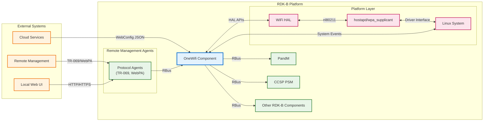
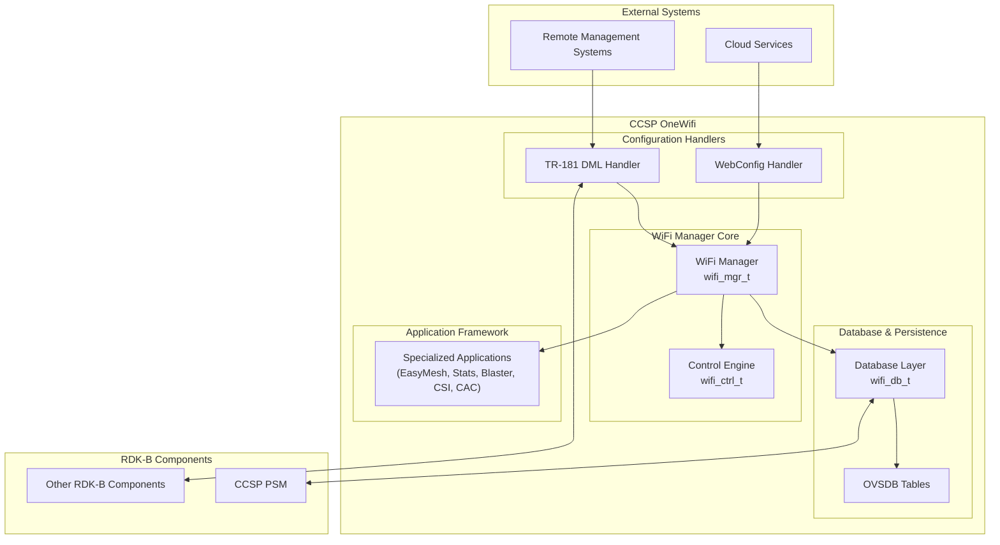
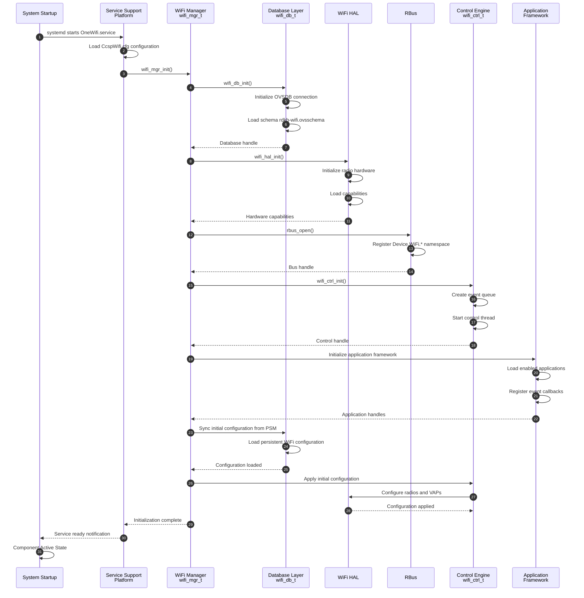
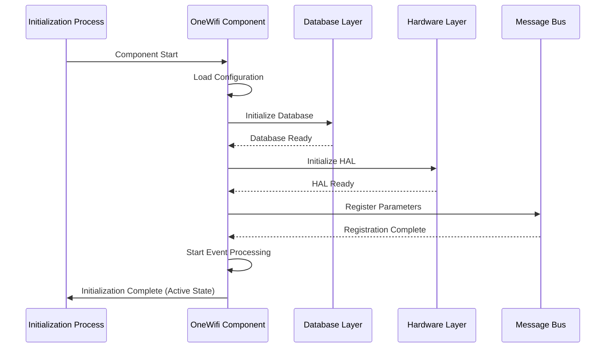
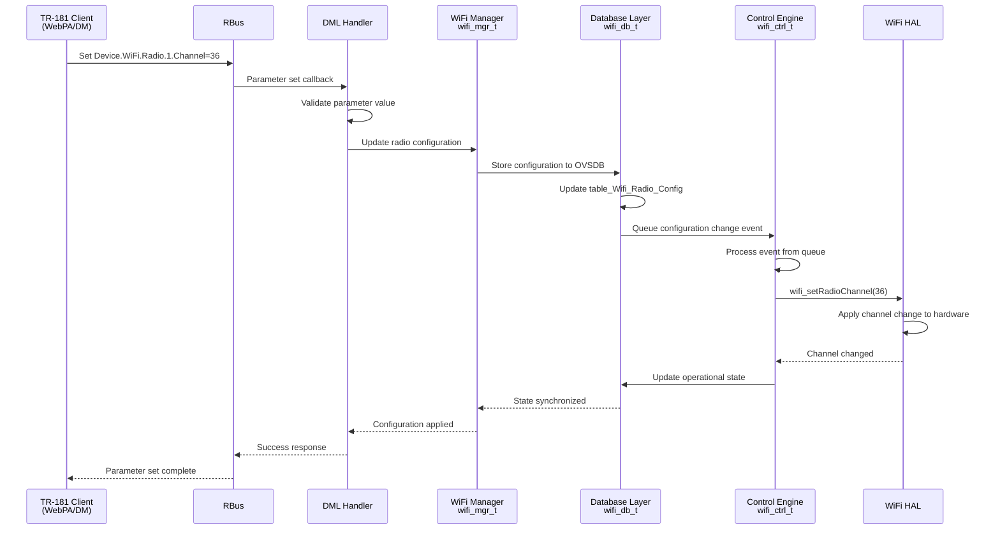
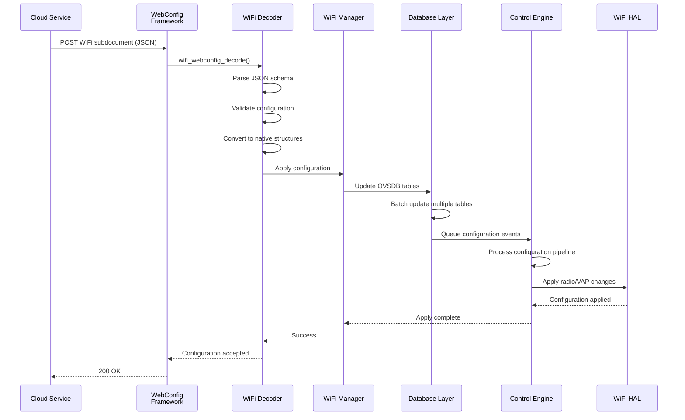

# OneWifi

OneWifi is the RDK-B component responsible for WiFi management, providing control of WiFi parameters, statistics, telemetry, client steering, and optimization across both Gateway and Extender devices. This component is the central WiFi management system for RDK platforms, handling operations across multiple radios, Virtual Access Points (VAPs), and specialized applications. OneWifi bridges high-level configuration interfaces (TR-181 and JSON-based WebConfig) with underlying hardware via the Hardware Abstraction Layer (HAL).

OneWifi manages radio configuration, VAP management, client association handling, DFS channel management, security configuration, and WiFi 6E/7 support. It implements TR-181 data model parameters for WiFi management and integrates with WebPA for cloud-based configuration and monitoring. CcspOneWifi orchestrates all WiFi-related functionality, coordinating between configuration sources, internal database, control engine, and hardware abstraction layer. VAPs are categorized by service type prefixes including private_ssid, iot_ssid, hotspot, and mesh_backhaul to distinguish different service purposes.

The component supports mesh WiFi (EasyMesh Multi-AP protocol), WiFi optimization (client steering), performance measurement (Blaster), motion detection (CSI analytics), channel availability checking (CAC), and statistics collection through a modular application framework. For mesh networking, the system supports both Gateway and Extender device roles with automatic backhaul selection using ranking algorithms based on SNR and Channel Utilization.



**Key Features & Responsibilities**: 

- **Unified WiFi Management**: Centralized control of all WiFi operations including radio configuration, VAP management, client associations, and security settings across multiple radios and service types
- **Multi-Interface Configuration**: Supports TR-181 data model access and JSON-based WebConfig for flexible configuration from local management interfaces and cloud services
- **Event-Driven Control Engine**: Real-time processing of hardware events, configuration changes, and application requests through an event queue architecture with database synchronization
- **Application Framework**: Hosts specialized applications including EasyMesh (Multi-AP), Statistics Monitor, Blaster (performance testing), CSI (motion detection), CAC (channel availability), and client steering
- **Hardware Abstraction**: Interfaces with WiFi HAL providing platform-independent WiFi management supporting WiFi 5/6/6E/7 standards and vendor-specific features


## Design

CcspOneWifi follows a layered, event-driven architecture designed to provide centralized WiFi management while maintaining separation between configuration interfaces, control logic, persistent storage, and hardware abstraction. The design emphasizes modularity, scalability, and real-time responsiveness to both configuration changes and hardware events. The architecture separates concerns between external configuration sources (TR-181 DML and WebConfig), the central WiFi manager, control engine, database layer, and hardware abstraction layer through well-defined interfaces.

The component operates as a central orchestrator coordinating between multiple subsystems. The WiFi Manager (wifi_mgr_t) maintains global state including radio configurations, VAP mappings, hardware capabilities, and handles for database and control engine instances. The Control Engine (wifi_ctrl_t) processes events from an internal queue including database updates, HAL indications, timeout events, and application requests. The database layer provides OVSDB-based persistent storage with in-memory caching for performance. Configuration changes flow through validation, normalization, and apply pipelines ensuring consistency between external interfaces, internal state, and hardware configuration.

The northbound interface provides TR-181 compliant access through RBus messaging for integration with other RDK-B components and external management systems. WebConfig integration enables cloud-based configuration through JSON subdocuments with schema validation. The southbound interface abstracts hardware interactions through WiFi HAL APIs supporting multiple vendor platforms. Data persistence is achieved through OVSDB database integration with PSM for non-volatile storage across reboots. The application framework enables specialized applications to register for events and extend WiFi functionality without modifying core logic.



### Prerequisites and Dependencies

**Build-Time Flags and Configuration:**

Build-time configuration options, DISTRO features, and compiler flags from Yocto recipe files (ccsp-one-wifi.bb, ccsp-one-wifi.bbappend, ccsp-one-wifi-libwebconfig.bb, ccsp-one-wifi-libwebconfig.bbappend).

| Configure Option | DISTRO Feature | Build Flag | Purpose | Default |
|------------------|----------------|------------|---------|---------|
| `--enable-journalctl` | N/A | N/A | Enable systemd journal logging support | Enabled |
| `ONEWIFI_CAC_APP_SUPPORT=true` | `cac` | `-DONEWIFI_CAC_APP_SUPPORT` | Enable Connection Admission Control application for DFS channel availability checking | Enabled |
| `ONEWIFI_DML_SUPPORT_MAKEFILE=true` | N/A | `-DONEWIFI_DML_SUPPORT` | Enable TR-181 Data Model Layer support for CCSP integration | Enabled |
| `ONEWIFI_CSI_APP_SUPPORT=true` | N/A | `-DONEWIFI_CSI_APP_SUPPORT` | Enable Channel State Information application for motion detection and analytics | Enabled |
| `ONEWIFI_MOTION_APP_SUPPORT=true` | N/A | `-DONEWIFI_MOTION_APP_SUPPORT` | Enable motion sensing application using CSI data | Enabled |
| `ONEWIFI_HARVESTER_APP_SUPPORT=true` | N/A | `-DONEWIFI_HARVESTER_APP_SUPPORT` | Enable data harvester application for telemetry collection | Enabled |
| `ONEWIFI_ANALYTICS_APP_SUPPORT=true` | N/A | `-DONEWIFI_ANALYTICS_APP_SUPPORT` | Enable WiFi analytics application for performance monitoring | Enabled |
| `ONEWIFI_LEVL_APP_SUPPORT=true` | N/A | `-DONEWIFI_LEVL_APP_SUPPORT` | Enable LEVL application support | Enabled |
| `ONEWIFI_WHIX_APP_SUPPORT=true` | N/A | `-DONEWIFI_WHIX_APP_SUPPORT` | Enable WHIX/Ignite client steering and link quality management | Enabled |
| `ONEWIFI_BLASTER_APP_SUPPORT=true` | N/A | `-DONEWIFI_BLASTER_APP_SUPPORT` | Enable Blaster application for active WiFi performance measurement | Enabled |
| `FEATURE_OFF_CHANNEL_SCAN_5G=true` | `offchannel_scan_5g` | N/A | Enable off-channel scanning capability for 5GHz band | Disabled |
| `ONEWIFI_MEMWRAPTOOL_APP_SUPPORT=true` | `Memwrap_Tool` | `-DONEWIFI_MEMWRAPTOOL_APP_SUPPORT` | Enable memory wrapper tool for memory profiling and leak detection | Disabled |
| N/A | N/A | `-DONEWIFI_RDKB_APP_SUPPORT` | Enable RDK-B specific application layer integration | Enabled |
| N/A | N/A | `-DONEWIFI_DB_SUPPORT` | Enable OVSDB database layer support | Enabled |
| N/A | N/A | `-DONEWIFI_RDKB_CCSP_SUPPORT` | Enable CCSP (Common Component Software Platform) integration | Enabled |
| N/A | N/A | `-DONEWIFI_OVSDB_TABLE_SUPPORT` | Enable OVSDB table management support | Enabled |
| N/A | `meshwifi` | `-DENABLE_FEATURE_MESHWIFI` | Enable Mesh WiFi capabilities and EasyMesh protocol support | Disabled |
| N/A | N/A | `-DWIFI_CAPTIVE_PORTAL` | Enable captive portal functionality for guest networks | Enabled |
| N/A | `halVersion3` | `-DWIFI_HAL_VERSION_3` | Enable WiFi HAL Version 3 API support | Enabled |
| N/A | `onewifi_integration` | `-DNEWPLATFORM_PORT` | Enable new platform integration port | Disabled |
| N/A | `wps_support` | `-DFEATURE_SUPPORT_WPS` | Enable WiFi Protected Setup (WPS) functionality | Disabled |
| N/A | N/A | N/A | RBus message bus is the standard IPC mechanism | Enabled |
| N/A | `always_enable_ax_2g` | `-DALWAYS_ENABLE_AX_2G` | Force enable WiFi 6 (802.11ax) on 2.4GHz band | Disabled |
| `HAL_IPC=true` | `hal-ipc` | `-DHAL_IPC` | Enable IPC-based HAL communication for process separation | Disabled |
| N/A | `disable_nl80211_acl` | (empty) / `-DNL80211_ACL` | Control nl80211 ACL implementation (flag present when NOT disabled) | Enabled |
| `--enable-notify` | `systemd` | N/A | Enable systemd notification support for service management | Conditional |
| `ONEWIFI_STA_MGR_APP_SUPPORT=true` | `sta_manager` | `-DONEWIFI_STA_MGR_APP_SUPPORT` | Enable Station Manager application for client mode operations | Disabled |
| `--enable-easyconnect` | `EasyConnect` | N/A | Enable WiFi Easy Connect (DPP) protocol support | Disabled |
| `--disable-libwebconfig` | N/A | N/A | Disable webconfig library build in main component | Enabled |
| `--with-ccsp-platform=bcm` | N/A | N/A | Specify CCSP platform type (Broadcom) | bcm |
| `--with-ccsp-arch=arm` | N/A | N/A | Specify target architecture | arm |
| `--enable-libwebconfig` | N/A | N/A | Enable webconfig library build (libwebconfig recipe only) | N/A |
| N/A | `safec` | `-DSAFEC_DUMMY_API` (if NOT enabled) | Control use of SafeC library vs dummy implementation | Enabled |
| N/A | `CONFIG_IEEE80211BE` | `-DCONFIG_IEEE80211BE` | Enable WiFi 7 (802.11be) support | Disabled |
| `--enable-sm-app` | `sm_app` | N/A | Enable Statistics Manager application | Disabled |

<br>

**RDK-B Platform and Integration Requirements:**

- **DISTRO Features**: Core features include `halVersion3` for WiFi HAL v3 support, `systemd` for service management, optional features include `meshwifi`, `cac`, `sta_manager`, `Memwrap_Tool`, `wps_support`, `EasyConnect`, `CONFIG_IEEE80211BE`
- **Build Dependencies**: `webconfig-framework`, `telemetry`, `libsyswrapper`, `libev`, `rbus`, `libnl`, `ccsp-one-wifi-libwebconfig`, `trower-base64`, `ccsp-common-library`, `utopia`, `libunpriv`, `jansson`, `opensync-headers`, `avro-c`, `libparodus`
- **RDK-B Components**: `CcspPandM`, `CcspPsm`, `CcspCommonLibrary`, `CcspCrSsp`, optional `WiFiCnxCtrl` (if `cac` enabled), `WiFiStaManager` (if `sta_manager` enabled)
- **HAL Dependencies**: `rdk-wifi-halif` (WiFi HAL interface definitions), `rdk-wifi-hal` (HAL implementation), `hal-cm`, `hal-dhcpv4c`, `hal-ethsw`, `hal-moca`, `hal-mso_mgmt`, `hal-mta`, `hal-platform`, `hal-vlan`
- **Systemd Services**: `CcspCrSsp.service`, `CcspPsmSsp.service` must be active before `OneWifi.service` starts; optional `wifi-telemetry.target` and `wifi-telemetry-cron.service` for telemetry collection
- **Hardware Requirements**: WiFi radio hardware supporting nl80211 interface, minimum WiFi 5 (802.11ac) support, optional WiFi 6/6E/7 support based on build flags
- **Message Bus**: RBus registration under `Device.WiFi.*` namespace for TR-181 parameter access and event notifications
- **TR-181 Data Model**: Complete Device.WiFi.* object hierarchy including Device.WiFi.Radio.{i}, Device.WiFi.SSID.{i}, Device.WiFi.AccessPoint.{i}, Device.WiFi.EndPoint.{i} for WiFi management
- **Configuration Files**: `CcspWifi.cfg` for component configuration, `CcspDmLib.cfg` for data model library settings, `rdkb-wifi.ovsschema` for OVSDB schema, `WifiSingleClient.avsc` and `WifiSingleClientActiveMeasurement.avsc` for Avro telemetry schemas
- **Startup Order**: Network interfaces must be initialized, RBus services running, PSM services active, HAL components loaded before OneWifi initialization
- **Resource Constraints**: Multi-threaded application requiring mutex synchronization, event queue processing, database caching, recommended minimum 256MB RAM allocation for WiFi subsystem

<br>

**Threading Model:** 

CcspOneWifi implements a multi-threaded architecture with a central event processing loop and specialized worker threads for different operational domains.

- **Threading Architecture**: Multi-threaded with main event loop, control engine thread, and application-specific threads
- **Main Thread**: Handles component initialization, RBus message registration, and serves as entry point for external parameter requests
- **Control Engine Thread**: Processes events from internal queue including configuration changes, HAL events, timeout events, and application requests through wifi_ctrl_t event loop
- **Application Threads**: 
  - **Statistics Monitor Thread**: Collects periodic radio and client statistics for telemetry reporting
  - **EasyMesh Thread**: Handles Multi-AP protocol operations and mesh topology management (if meshwifi enabled)
  - **CSI Thread**: Processes Channel State Information for motion detection analytics (if CSI app enabled)
  - **Blaster Thread**: Executes active performance measurement tests (if Blaster app enabled)
- **Scheduled Tasks**: Includes sta_connectivity_selfheal that monitors health of backhaul connection on Extender devices and automatically re-establishes mesh backhaul connections if station interface loses connectivity
- **Synchronization**: Uses data_cache_lock (pthread_mutex_t) for global WiFi data cache access, event queue mutexes for control engine, per-radio locks for configuration updates, condition variables for thread signaling

### Component State Flow

**Initialization to Active State**

CcspOneWifi follows a structured initialization sequence ensuring all subsystems are properly initialized before entering active operation mode. The component performs configuration loading, database initialization, HAL capability discovery, RBus registration, and application framework startup in a predetermined order to guarantee system stability.



**Runtime State Changes and Context Switching**

During normal operation, CcspOneWifi responds to various configuration changes, hardware events, and application requests that may affect its operational state and behavior.

**State Change Triggers:**

- TR-181 parameter set operations causing radio or VAP configuration changes with validation and apply pipeline execution
- WebConfig subdocument reception triggering JSON decode, validation, and multi-object configuration updates
- HAL event indications including client association/disassociation, DFS channel changes, radar detection, or hardware errors
- Application-initiated events such as EasyMesh topology changes, client steering decisions, or CSI analytics triggers
- Timeout events for periodic statistics collection, telemetry reporting, or DFS channel monitoring
- Channel change events notifying relevant VAP services including Mesh VAPs to adjust their operational state

**Context Switching Scenarios:**

- DFS channel change events causing VAP down, channel switch, CAC period, and VAP restart sequence
- Mesh role changes between Gateway and Extender modes affecting VAP configurations and backhaul settings
- Mesh backhaul connectivity loss triggering sta_connectivity_selfheal task to re-establish connections
- Factory reset operations clearing OVSDB database, resetting to default configuration, and reinitializing all subsystems
- Firmware upgrade scenarios requiring graceful shutdown, configuration backup to PSM, and post-upgrade restoration

### Call Flow

**Initialization Call Flow:**



**Request Processing Call Flow:**

TR-181 parameter set operation (e.g., changing WiFi radio channel):



**WebConfig Subdocument Processing Call Flow:**

WebConfig JSON subdocument reception from cloud:



## TR‑181 Data Models

### Supported TR-181 Parameters

CcspOneWifi implements TR-181 data model support for WiFi management following BBF TR-181 Issue 2 Amendment 15 specifications. The component implements the Device.WiFi object hierarchy including Radio, SSID, AccessPoint, EndPoint, and associated statistics objects. The implementation supports both standard BBF-defined parameters and RDK-specific extensions for Mesh WiFi, CSI analytics, and client steering.

### Object Hierarchy

```
Device.
└── WiFi.
    ├── RadioNumberOfEntries (unsignedInt, R)
    ├── SSIDNumberOfEntries (unsignedInt, R)
    ├── AccessPointNumberOfEntries (unsignedInt, R)
    ├── EndPointNumberOfEntries (unsignedInt, R)
    ├── Radio.{i}.
    │   ├── Enable (boolean, R/W)
    │   ├── Status (string, R)
    │   ├── Name (string, R)
    │   ├── OperatingFrequencyBand (string, R/W)
    │   ├── Channel (unsignedInt, R/W)
    │   ├── AutoChannelEnable (boolean, R/W)
    │   ├── OperatingChannelBandwidth (string, R/W)
    │   ├── TransmitPower (int, R/W)
    │   └── Stats.
    ├── SSID.{i}.
    │   ├── Enable (boolean, R/W)
    │   ├── Status (string, R)
    │   ├── Name (string, R/W)
    │   ├── SSID (string, R/W)
    │   ├── BSSID (string, R)
    │   └── Stats.
    ├── AccessPoint.{i}.
    │   ├── Enable (boolean, R/W)
    │   ├── Status (string, R)
    │   ├── SSIDReference (string, R/W)
    │   ├── Security.
    │   │   ├── ModesSupported (string, R)
    │   │   ├── ModeEnabled (string, R/W)
    │   │   ├── KeyPassphrase (string, R/W)
    │   │   └── RadiusServerIPAddr (string, R/W)
    │   ├── WPS.
    │   ├── AssociatedDevice.{i}.
    │   └── Stats.
    ├── EndPoint.{i}.
    │   ├── Enable (boolean, R/W)
    │   ├── Status (string, R)
    │   ├── Profile.{i}.
    │   └── Stats.
    └── X_RDK_Extensions.
        ├── CSI.{i}.
        ├── Harvester.
        ├── Analytics.
        └── Steering.

Device.
└── X_RDKCENTRAL-COM_WiFi.
    ├── MacFilterList (string, R/W)
    └── Config (string, R/W)
```

### Parameter Definitions

**Core Radio Parameters:**

| Parameter Path | Data Type | Access | Default Value | Description | BBF Compliance |
|----------------|-----------|--------|---------------|-------------|----------------|
| `Device.WiFi.RadioNumberOfEntries` | unsignedInt | R | Platform-dependent | Number of WiFi radio interfaces present on the device | TR-181 Issue 2 |
| `Device.WiFi.Radio.{i}.Enable` | boolean | R/W | `false` | Enables or disables the radio interface. When disabled, radio is powered down and no VAPs are operational | TR-181 Issue 2 |
| `Device.WiFi.Radio.{i}.Status` | string | R | `"Down"` | Current operational status of the radio. Enumeration: Up, Down, Unknown, Dormant, Error | TR-181 Issue 2 |
| `Device.WiFi.Radio.{i}.Channel` | unsignedInt | R/W | `0` | Current operating channel number. Valid channels depend on operating frequency band and regulatory domain | TR-181 Issue 2 |
| `Device.WiFi.Radio.{i}.AutoChannelEnable` | boolean | R/W | `false` | Enable automatic channel selection based on interference and DFS constraints | TR-181 Issue 2 |
| `Device.WiFi.Radio.{i}.OperatingChannelBandwidth` | string | R/W | `"20MHz"` | Operating channel bandwidth. Enumeration: 20MHz, 40MHz, 80MHz, 160MHz, 80+80MHz, 320MHz (WiFi 7) | TR-181 Issue 2 |
| `Device.WiFi.Radio.{i}.TransmitPower` | int | R/W | `100` | Current transmit power level as percentage of maximum, range 0-100 | TR-181 Issue 2 |
| `Device.WiFi.Radio.{i}.OperatingFrequencyBand` | string | R/W | Platform-dependent | Operating frequency band. Enumeration: 2.4GHz, 5GHz, 6GHz (WiFi 6E), 60GHz | TR-181 Issue 2 |

**SSID Parameters:**

| Parameter Path | Data Type | Access | Default Value | Description | BBF Compliance |
|----------------|-----------|--------|---------------|-------------|----------------|
| `Device.WiFi.SSIDNumberOfEntries` | unsignedInt | R | Platform-dependent | Number of SSID instances available across all radios | TR-181 Issue 2 |
| `Device.WiFi.SSID.{i}.Enable` | boolean | R/W | `false` | Enable or disable this SSID instance. When disabled, SSID is not advertised | TR-181 Issue 2 |
| `Device.WiFi.SSID.{i}.Status` | string | R | `"Disabled"` | Current operational status. Enumeration: Disabled, Enabled, Error | TR-181 Issue 2 |
| `Device.WiFi.SSID.{i}.Name` | string | R/W | `""` | Human-readable name for this SSID interface for identification purposes | TR-181 Issue 2 |
| `Device.WiFi.SSID.{i}.SSID` | string | R/W | `""` | The actual SSID string advertised in beacon frames, maximum 32 octets | TR-181 Issue 2 |
| `Device.WiFi.SSID.{i}.BSSID` | string | R | `"00:00:00:00:00:00"` | Basic Service Set Identifier (MAC address) for this SSID, assigned by radio | TR-181 Issue 2 |

**AccessPoint Security Parameters:**

| Parameter Path | Data Type | Access | Default Value | Description | BBF Compliance |
|----------------|-----------|--------|---------------|-------------|----------------|
| `Device.WiFi.AccessPointNumberOfEntries` | unsignedInt | R | Platform-dependent | Number of AccessPoint instances | TR-181 Issue 2 |
| `Device.WiFi.AccessPoint.{i}.Enable` | boolean | R/W | `false` | Enable or disable this access point instance | TR-181 Issue 2 |
| `Device.WiFi.AccessPoint.{i}.SSIDReference` | string | R/W | `""` | Reference to associated SSID instance (Device.WiFi.SSID.{i}) | TR-181 Issue 2 |
| `Device.WiFi.AccessPoint.{i}.Security.ModeEnabled` | string | R/W | `"None"` | WiFi security mode. Enumeration: None, WEP-64, WEP-128, WPA-Personal, WPA2-Personal, WPA-WPA2-Personal, WPA-Enterprise, WPA2-Enterprise, WPA-WPA2-Enterprise, WPA3-Personal, WPA3-Personal-Transition, WPA3-Enterprise | TR-181 Issue 2 Amd 15 |
| `Device.WiFi.AccessPoint.{i}.Security.KeyPassphrase` | string | R/W | `""` | WPA/WPA2/WPA3 Pre-Shared Key passphrase, 8-63 ASCII characters or 64 hex digits | TR-181 Issue 2 |
| `Device.WiFi.AccessPoint.{i}.WPS.Enable` | boolean | R/W | `false` | Enable WiFi Protected Setup (WPS) for this access point (requires `wps_support` DISTRO feature) | TR-181 Issue 2 |

**RDK-Specific Extension Parameters:**

| Parameter Path | Data Type | Access | Default Value | Description | BBF Compliance |
|----------------|-----------|--------|---------------|-------------|----------------|
| `Device.WiFi.X_RDK_CSI.{i}.Enable` | boolean | R/W | `false` | Enable Channel State Information collection for motion detection (requires CSI app support) | RDK Extension |
| `Device.X_RDKCENTRAL-COM_WiFi.MacFilterList` | string | R/W | `""` | MAC address filter list for access control, comma-separated MAC addresses | RDK Extension |
| `Device.X_RDKCENTRAL-COM_WiFi.Config` | string | R/W | `""` | WebConfig JSON subdocument for bulk WiFi configuration | RDK Extension |

### Parameter Registration and Access

- **Implemented Parameters**: OneWifi implements complete Device.WiFi.* object hierarchy including Radio, SSID, AccessPoint, EndPoint objects with full statistics subtrees. RDK extensions include X_RDK_CSI for CSI analytics, X_RDK_Harvester for data collection, X_RDK_Analytics for performance monitoring, and X_RDK_Steering for client steering parameters
- **Parameter Registration**: Parameters are registered with RBus during initialization through wifi_dml_registration(). DML handler functions map TR-181 paths to internal wifi_mgr_t structures and database tables
- **Access Mechanism**: External components access parameters via RBus method calls (rbus_get/rbus_set) which invoke corresponding DML handler functions. Handlers validate parameters, update wifi_mgr_t state, write to OVSDB via wifi_db_t layer, and queue events to control engine for HAL application
- **Validation Rules**: Radio channel selection validates against supported channel lists and regulatory constraints. Security mode changes validate against hardware capabilities. Bandwidth selection validates channel width support for current band. String parameters enforce maximum length constraints per TR-181 specification

## Internal Modules

CcspOneWifi is organized into specialized modules responsible for different aspects of WiFi management including configuration handling, control logic, database management, hardware abstraction, and application services.

| Module/Class | Description |
|-------------|------------|
| **WiFi Manager Core** | Central management entity maintaining global state, coordinating between subsystems, managing wifi_mgr_t structure |
| **WiFi Manager Core** | Central management entity maintaining global state, coordinating between subsystems, managing wifi_mgr_t structure |
| **Control Engine** | Event-driven processing engine handling configuration changes, HAL events, timeout events through event queue architecture with scheduler for deferred tasks |
| **Database Layer** | OVSDB-based persistence layer with in-memory caching, schema management, and PSM synchronization |
| **DML/TR-181 Handler** | Implementation of Device.WiFi.* TR-181 data model with RBus integration for external parameter access |
| **WebConfig System** | JSON-based configuration decoder/encoder supporting cloud-based configuration and bulk updates with subdocument handlers for private, radio, mesh, dml, and blaster configurations |
| **Statistics Monitor** | Periodic collection of radio statistics, client statistics, and telemetry reporting with Avro serialization |
| **EasyMesh Application** | Multi-AP protocol implementation for WiFi mesh networking including topology management and backhaul steering (requires meshwifi DISTRO feature) |
| **Mesh VAP Service** | Mesh-specific VAP service operations managing mesh_backhaul VAP type with backhaul candidate selection using ranking algorithms based on SNR and Channel Utilization |
| **Blaster Application** | Active WiFi performance measurement tool for throughput testing and quality assessment |
| **CSI Analytics** | Channel State Information processing for motion detection and presence sensing applications |
| **CAC Application** | Connection Admission Control and DFS channel availability checking for radar detection compliance (requires cac DISTRO feature) |
| **Client Steering (WHIX)** | Link quality monitoring and intelligent client steering for optimal AP association |
| **Station Manager** | Client mode (STA) connection management for Extender and repeater devices with station interface health monitoring (requires sta_manager DISTRO feature) |
| **Service Support Platform** | Process lifecycle management, message bus initialization, configuration loading, component entry point |

## Component Interactions

CcspOneWifi interacts with external RDK-B components, system services, and hardware layers to provide WiFi management functionality.

### Interaction Matrix

| Target Component/Layer | Interaction Purpose | Key APIs/Endpoints |
|------------------------|---------------------|-------------------|
| **RBus** | TR-181 parameter access, event notifications, inter-component communication | `rbus_open()`, `rbus_regDataElements()`, `rbus_get()`, `rbus_set()`, `rbus_publishEvent()` |
| **CcspPsm** | Persistent configuration storage across reboots | PSM_Get(), PSM_Set(), PSM_Del() via wifi_db layer |
| **WiFi HAL** | Hardware control and configuration | `wifi_init()`, `wifi_setRadioChannel()`, `wifi_createAp()`, `wifi_setApSecurity()`, event callbacks |
| **Telemetry** | Statistics and event reporting | `t2_event_s()`, `t2_event_d()` for marker-based telemetry |
| **WebConfig Framework** | Cloud-based configuration reception | `wifi_webconfig_decode()`, `wifi_webconfig_encode()`, blob management |
| **Parodus/WebPA** | Cloud connectivity and management | Message passing through WebConfig subdocuments |
| **CcspPandM** | Device management coordination | Via RBus for system-level parameters |
| **hostapd/wpa_supplicant** | Low-level WiFi protocol handling | Via libhostap and HAL layer |
| **OVSDB** | Local database for configuration caching | Table operations via wifi_db layer |

**Key Interaction Flows:**

1. **Configuration from Cloud**: WebPA → Parodus → WebConfig → JSON Decode → WiFi Manager → Database → Control Engine → HAL → Hardware
2. **TR-181 Parameter Access**: External Client → RBus → DML Handler → WiFi Manager → Database/HAL → Response
3. **Persistent Storage**: WiFi Manager → Database Layer → PSM → Non-volatile Storage
4. **Telemetry Reporting**: Statistics Monitor → Avro Encoding → Telemetry Service → Cloud
5. **Hardware Events**: Radio Hardware → Driver → HAL Callback → Control Engine → Event Processing → State Update
