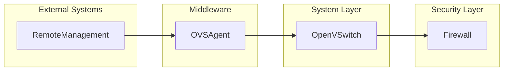
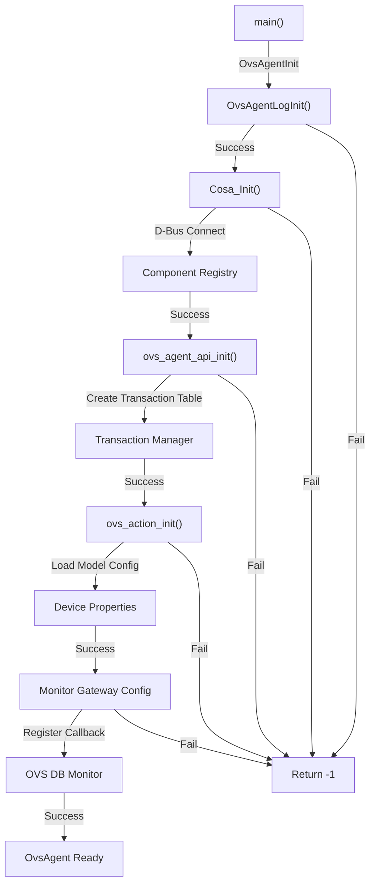

# Open Virtual Switch Agent Documentation

## Overview

The Open Virtual Switch Agent (OVS Agent) is the RDK-B component responsible for managing virtual switch configurations and interactions. It facilitates communication between the middleware and the underlying Open vSwitch (OVS) infrastructure, ensuring efficient network traffic management and policy enforcement.

## Key Features & Responsibilities

- **Virtual Switch Management**: Configures and manages Open vSwitch instances, enabling dynamic network segmentation and traffic control.
- **Protocol Support**: Implements support for key networking protocols, ensuring compatibility with various network configurations.
- **Telemetry and Monitoring**: Collects and reports network statistics for performance analysis and troubleshooting.
- **Integration with Middleware**: Acts as a bridge between the RDK-B middleware and the OVS infrastructure, ensuring seamless operation.

## Design

The OVS Agent follows a modular, event-driven architecture designed to efficiently manage network device discovery, monitoring, and reporting across network interfaces. The design emphasizes scalability, real-time responsiveness, and data consistency while maintaining minimal system resource utilization. The architecture separates ownership between device discovery, data model management, telemetry reporting, and external communications through well-defined interfaces and protocols.

The northbound interface provides TR-181 compliant access through R-BUS messaging, enabling seamless integration with other RDK-B components and external management systems. The southbound interface abstracts network interface interactions through HAL APIs and system-level networking calls. Data persistence is achieved through integration with the Persistent Storage Manager (PSM) ensuring device information survives system reboots. WebPA integration enables cloud-based management and telemetry reporting following industry-standard protocols and data formats including Avro serialization for efficient data transmission.

### Simplified System Context Diagram

### Simplified Component Diagram

## Threading Model

The OVS Agent employs a lightweight threading model to ensure efficient operation and responsiveness. The threading architecture includes:

- **Primary Thread**: Handles initialization, configuration loading, and main event loop.
- **Worker Threads**: Dedicated threads for handling asynchronous operations such as socket communication and transaction management.
- **Synchronization Mechanisms**: Utilizes `pthread_mutex_t` for protecting shared resources and `pthread_cond_t` for signaling between threads.

### Thread Details

| Thread Name            | Purpose                                | Synchronization Mechanism |
| ---------------------- | -------------------------------------- | ------------------------- |
| **Main Thread**        | Component initialization and lifecycle | Mutex, Condition Variable |
| **Socket Worker**      | Handles OVSDB socket communication     | Non-blocking I/O          |
| **Transaction Worker** | Manages transaction state transitions  | Mutex                     |

## Component State Flow

The OVS Agent follows a structured initialization sequence to ensure proper dependency resolution and secure operation. The lifecycle includes the following states:

1. **Initialization**: Sets up logging, connects to the Component Registry, and initializes the OVSDB socket.
2. **Active**: Processes requests and manages transactions.
3. **Error Handling**: Handles failures gracefully, including retries and state cleanup.

### Initialization Flow

## Integration Requirements

The OVS Agent integrates with various RDK-B components and system services to provide its functionality. Key dependencies include:

| Dependency                     | Purpose                                      | Interface                |
| ------------------------------ | -------------------------------------------- | ------------------------ |
| **Component Registry**         | Component discovery and namespace resolution | R-BUS                    |
| **Persistent Storage Manager** | Configuration storage                        | COSA API                 |
| **Open vSwitch**               | Virtual switch management                    | OVSDB Protocol           |
| **RDK Logging Framework**      | Diagnostic logging                           | RDK Logger API           |
| **Mesh Agent**                 | Multi-device coordination                    | OVS DB Monitor Callbacks |

## Validation Checklist

- [ ] **Deployment Accuracy**: Diagrams reflect real deployment boundaries and processes.
- [ ] **Protocol Specificity**: Each edge clearly states the protocol and data format.
- [ ] **Scaling Representation**: Illustrates what scales together and independently.
- [ ] **Technology Stack**: Actual languages, frameworks, and versions are referenced.
- [ ] **Implementation Details**: Filenames, config keys, are included where important.
- [ ] **Visual Hierarchy**: Colors and shapes clearly distinguish users, core components, external systems, databases, and middleware.
- [ ] **Mermaid Syntax**: Diagrams render without errors, using proper identifiers and quoting.
