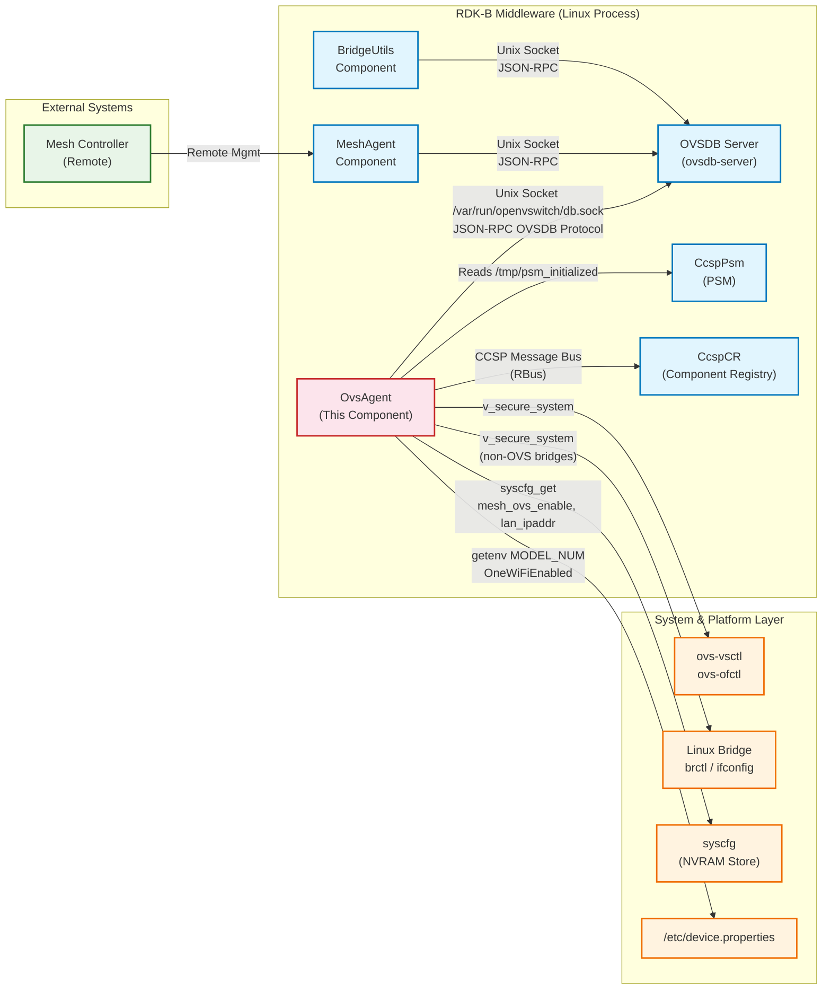
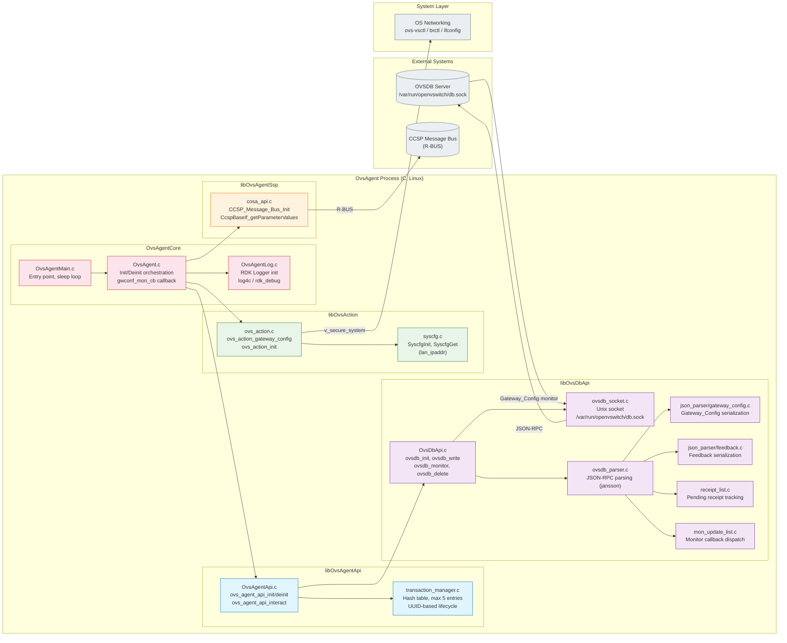
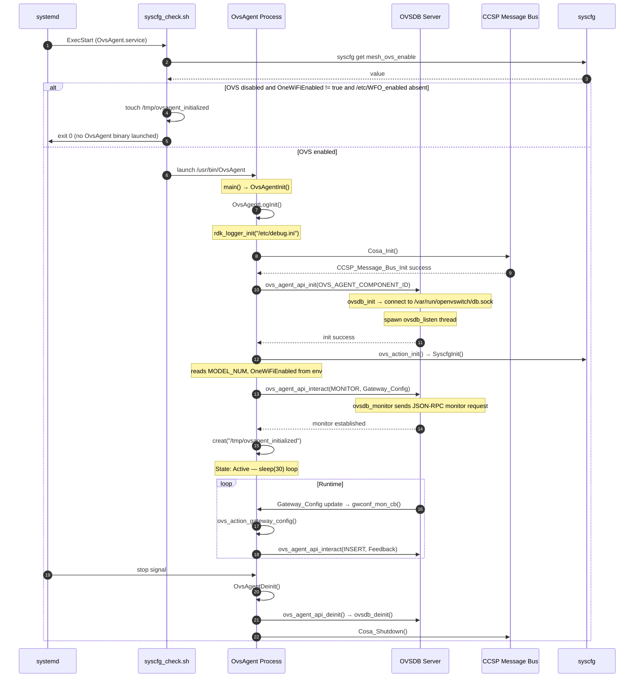
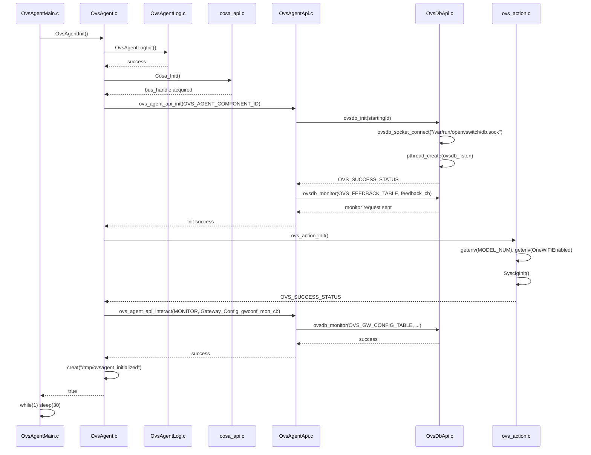
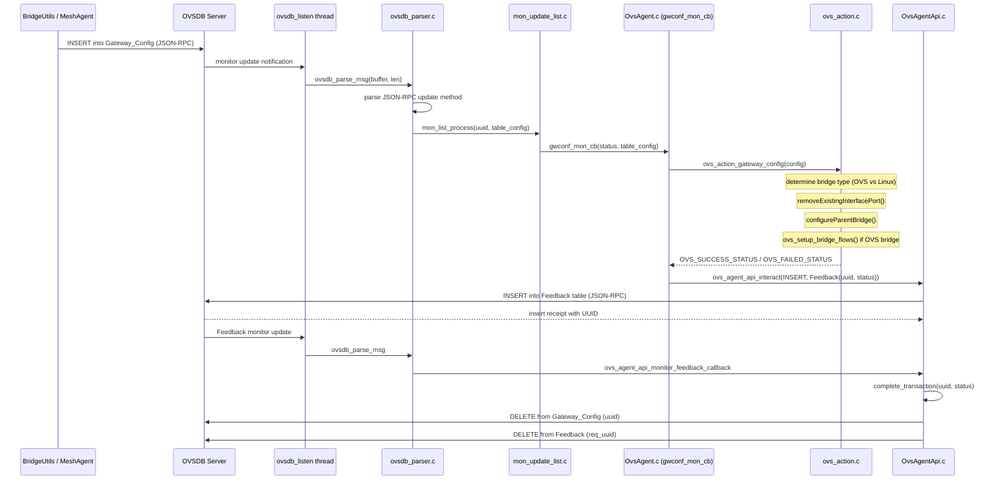
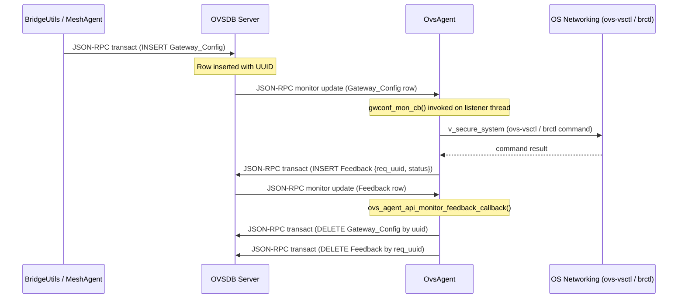

# Open Virtual Switch Agent Documentation

Open Virtual Switch Agent (OvsAgent) is the RDK-B component responsible for translating network bridge configuration requests stored in the Open vSwitch Database (OVSDB) into actual Linux networking operations on the gateway. The component connects to the OVSDB server over a Unix domain socket, monitors the `Gateway_Config` table for incoming configuration commands, and executes the corresponding bridge and port management operations using either Open vSwitch (`ovs-vsctl`) commands or Linux bridge utilities (`brctl`/`ifconfig`) depending on bridge type. After executing each operation, OvsAgent writes the result status back to the OVSDB `Feedback` table so that requesting components can confirm success or failure.

OvsAgent serves as the southbound executor for virtual networking configuration on RDK-B platforms. Components such as BridgeUtils and MeshAgent submit configuration requests to OVSDB; OvsAgent picks them up, applies them to the Linux kernel networking layer, and reports back. This decoupling allows other middleware components to interact with the virtual switch through a well-defined database interface without needing direct knowledge of the underlying networking commands or platform-specific details.

**Key Features & Responsibilities**:

- **OVSDB Gateway Config Monitoring**: Connects to the OVSDB server via Unix domain socket at `/var/run/openvswitch/db.sock` and monitors the `Gateway_Config` table for incoming network interface and bridge configuration requests from other RDK-B components.
- **Bridge and Port Management**: Translates `Gateway_Config` records into actual Linux networking commands — creating or removing OVS bridges with `ovs-vsctl`, adding or removing ports, bringing interfaces up or down, and configuring VLAN and GRE interfaces.
- **Dual-mode Networking Backend**: Selects between OVS-managed (`ovs-vsctl`) and Linux-native (`brctl`/`ifconfig`) bridge operations at runtime based on the bridge name. Specific bridges such as `brlan2`–`brlan5`, `brpublic`, `bropen6g`, and `brsecure6g` are managed using Linux bridge utilities regardless of OVS availability.
- **Feedback Reporting**: After applying each configuration, inserts a `Feedback` record into the OVSDB `Feedback` table containing the request UUID and the operation status, allowing the originating component to confirm the outcome.
- **OpenFlow Flow Configuration**: Sets up OpenFlow flows on OVS bridges for Broadcom Wi-Fi models and Mesh fast-roaming scenarios using `ovs-ofctl` commands after bridge configuration.
- **Conditional Startup via syscfg**: Reads the `mesh_ovs_enable` syscfg key at startup. If the key is not set to `true` and neither `OneWiFiEnabled` nor `/etc/WFO_enabled` is present, the agent skips execution and touches `/tmp/ovsagent_initialized` to signal readiness without launching the main process.

## Design

OvsAgent is designed around a single-responsibility principle: it is the sole executor of OVSDB-originated network configuration commands on the Linux platform. The design separates concerns into five distinct libraries linked into the final binary — the core orchestration layer, the public API, the database abstraction layer, the action execution layer, and the CCSP SSP integration layer. Each layer communicates through well-defined C interfaces, making the component straightforward to unit-test and extend.

The northbound interface to OvsAgent is the OVSDB `Gateway_Config` table. Any RDK-B component that needs to configure a bridge or port inserts a row into this table using the OVS Agent API (`ovs_agent_api_interact`). The southbound interface is the combination of `ovs-vsctl`/`ovs-ofctl` shell commands (invoked via `v_secure_system`) and Linux bridge utilities, with an optional `libnet`-based path when built with `CORE_NET_LIB` support. The CCSP message bus (R-BUS) connection via `libOvsAgentSsp` allows the agent to resolve CCSP component paths if needed, though the primary communication path is through the Unix socket to OVSDB.

The OVSDB socket layer runs a dedicated listener thread (`ovsdb_listen`) that continuously reads from the socket, parses incoming JSON-RPC messages using the jansson library, and dispatches them to the appropriate receipt or monitor update handlers. The main thread initializes all subsystems in sequence and then enters a sleep loop. Synchronization between the listener thread and the calling thread uses a `pthread_cond_t`/`pthread_mutex_t` pair with a configurable timeout (`OVS_BLOCK_MODE_TIMEOUT_SECS = 3` seconds).

Configuration persistence is limited to reading two syscfg keys: `mesh_ovs_enable` (read at startup by the shell script to decide whether to launch) and `lan_ipaddr` (read by the OvsAction module to retrieve the LAN0 IP address for OpenFlow rule setup). No syscfg writes are performed by OvsAgent itself. The model number and `OneWiFiEnabled` flag are read from environment variables exported by `/etc/device.properties` at process start.

A Component diagram showing the component's internal structure and dependencies is given below:

### Prerequisites and Dependencies

**Build-Time Flags and Configuration:**

The following flags and macros are used in the source code. Flags with a configure option can be set during the `./configure` step. Flags marked as "Always set" are hard-coded in the respective `Makefile.am`.

| Configure Option                            | DISTRO Feature / AM Conditional | Build Flag / Macro                                                   | Purpose                                                                                                                                                                                                                              | Default        |
| ------------------------------------------- | ------------------------------- | -------------------------------------------------------------------- | ------------------------------------------------------------------------------------------------------------------------------------------------------------------------------------------------------------------------------------ | -------------- |
| `--enable-gtestapp`                         | `WITH_GTEST_SUPPORT`            | `-DGTEST_ENABLE`                                                     | Enables building the GTest unit test applications under `source/test/`. When disabled, the test subdirectory is excluded from the build.                                                                                             | Disabled       |
| `--enable-core_net_lib_feature_support`     | `CORE_NET_LIB_FEATURE_SUPPORT`  | Links `-lnet` (libnet). Source-level guard is `#ifdef CORE_NET_LIB`. | Enables the core network library (`libnet`) backend in `OvsAction`. When active, bridge creation, port add/remove, and interface up/down use `libnet` API calls instead of `brctl` and `ifconfig` shell commands.                    | `false`        |
| Not in `configure.ac` — pass via `CPPFLAGS` | N/A                             | `CORE_NET_LIB`                                                       | Compile-time guard in `ovs_action.c` (used in over 30 `#ifdef` blocks) that selects `libnet`-based networking calls over shell-based `brctl`/`ifconfig` commands. Must be defined alongside `--enable-core_net_lib_feature_support`. | Not defined    |
| Not in `configure.ac` — pass via `CPPFLAGS` | N/A                             | `BCI_RESIDENTIAL_SUPPORT`                                            | If defined, `ovs_action_init()` hard-codes the device model as `"CGA4332COM"` instead of reading `MODEL_NUM` from `/etc/device.properties`. Used for BCI residential platform builds.                                                | Not defined    |
| Always set in `OvsAgentCore/Makefile.am`    | N/A                             | `FEATURE_SUPPORT_RDKLOG`                                             | Enables RDK Logger initialization (`rdk_logger_init` / `rdk_logger_deinit`) in `OvsAgentLog.c`. When not defined, the logging hooks are compiled out and the binary falls back to stderr only.                                       | Always enabled |
| Always set in all `Makefile.am` files       | N/A                             | `_ANSC_LINUX`                                                        | ANSC platform identifier for Linux target. Required by CCSP common library headers.                                                                                                                                                  | Always set     |
| Always set in all `Makefile.am` files       | N/A                             | `_ANSC_USER`                                                         | ANSC user-space mode identifier. Required by CCSP common library headers.                                                                                                                                                            | Always set     |

 

**RDK-B Platform and Integration Requirements:**

- **Build Dependencies**: `libjansson` (JSON parsing for OVSDB protocol), `libdbus-1 >= 1.6.18` (CCSP Message Bus), `libsyscfg` (syscfg get/init), `libccsp_common` (CCSP base interfaces), `liblog4c` (RDK logging), `libsafec` (safe string functions), `libsystemd` (systemd notify integration)
- **RDK-B Components**: `CcspCr` (CCSP Component Registry must be reachable on R-BUS at startup), `CcspPsm` (PSM must have written `/tmp/psm_initialized` before OvsAgent starts)
- **HAL Dependencies**: None. OvsAgent does not call any HAL APIs directly.
- **Systemd Services**: `OvsAgent_ovsdb-server.service` must be active (starts the OVSDB server and opensync/plume managers). `OvsAgent.service` has `Requires=OvsAgent_ovsdb-server.service`.
- **Configuration Files**: `/etc/device.properties` must export `MODEL_NUM` and `OneWiFiEnabled` into the process environment. `/etc/debug.ini` is read by the RDK logger. `/tmp/ccsp_msg.cfg` is the CCSP message bus configuration file.
- **Startup Order**: `OvsAgent.path` watches for `/tmp/psm_initialized` to appear, which triggers `OvsAgent.service`. The service pre-start removes any stale `/tmp/ovsagent_initialized` and then runs `syscfg_check.sh`. The OVSDB socket must exist at `/var/run/openvswitch/db.sock` before the C binary connects.
- **syscfg Keys Read**: `mesh_ovs_enable` (shell script gate), `lan_ipaddr` (LAN0 IP address for OpenFlow rule generation, read from `ovs_action.c`).
- **File Indicators**: `/tmp/ovsagent_initialized` — created by the agent after successful init (or by the shell script when OVS is disabled) to signal readiness. `/nvram/enable_ovs_debug` — presence enables `RDK_LOG_DEBUG` level logging at runtime.

 

**Threading Model:**

OvsAgent runs two threads throughout its process lifetime.

- **Threading Architecture**: Two-threaded. The main thread handles initialization and remains in a `sleep(30)` loop for the lifetime of the process. The listener thread handles all OVSDB socket I/O.
- **Main Thread**: Executes the full initialization sequence (`OvsAgentInit`), enters an infinite sleep loop, and runs `OvsAgentDeinit` on shutdown.
- **Worker Threads**:
  - **`ovsdb_listen` thread**: Created during `ovsdb_init()`. Calls `ovsdb_socket_listen()` in a poll loop with a 100ms timeout. On receiving data, passes the raw buffer to `ovsdb_parse_msg()` for JSON-RPC message dispatch. Thread exits when `g_terminate` is set during deinit.
- **Synchronization**: Blocking API calls in `OvsAgentApi` use a `pthread_cond_t`/`pthread_mutex_t` pair per context handle with a 3-second timed wait (`OVS_BLOCK_MODE_TIMEOUT_SECS`). The transaction table is protected by `ovs_agent_api_mutex` (a static `PTHREAD_MUTEX_INITIALIZER`).

### Component State Flow

**Initialization to Active State**

OvsAgent starts conditionally. The systemd service executes `syscfg_check.sh` to read the `mesh_ovs_enable` syscfg key. If OVS is disabled and neither `OneWiFiEnabled` nor `/etc/WFO_enabled` is present, the script exits after touching `/tmp/ovsagent_initialized` without launching the binary. When OVS is enabled, the binary initializes each subsystem in order — RDK Logger, CCSP message bus, OVSDB API with listener thread, OvsAction with syscfg — then sets a monitor on the `Gateway_Config` table and creates `/tmp/ovsagent_initialized` to signal readiness.

**Runtime State Changes and Context Switching**

OvsAgent does not implement a formal state machine beyond init/active/deinit. During active operation, the agent reacts to each `Gateway_Config` monitor update independently.

**State Change Triggers:**

- A new row inserted into the OVSDB `Gateway_Config` table by BridgeUtils or MeshAgent triggers `gwconf_mon_cb()` on the listener thread.
- The `if_cmd` field in `Gateway_Config` determines the specific operation: `OVS_IF_UP_CMD`, `OVS_IF_DOWN_CMD`, `OVS_IF_DELETE_CMD`, or `OVS_BR_REMOVE_CMD`.
- The `parent_bridge` name determines whether OVS or Linux bridge tools are used; `brlan2`–`brlan5`, `brpublic`, `bropen6g`, `brsecure6g` are always handled by Linux bridges.
- Presence of `/nvram/enable_ovs_debug` at startup switches the log level from `RDK_LOG_INFO` to `RDK_LOG_DEBUG`.

**Context Switching Scenarios:**

- If `mesh_ovs_enable` is `false` at service start, the shell script exits without launching the binary, touching `/tmp/ovsagent_initialized` to prevent dependent services from stalling.
- On Broadcom Wi-Fi models (`OVS_CGM4331COM_MODEL`, `OVS_CGA4332COM_MODEL`, `OVS_CGM4981COM_MODEL`, `OVS_CGM601TCOM_MODEL`, `OVS_SG417DBCT_MODEL`, `OVS_VTER11QEL_MODEL`, `OVS_SR203_MODEL`), additional OpenFlow flows are configured via `ovs_setup_brcm_wifi_flows()` after bridge setup.
- In warehouse mode (`/tmp/warehouse_mode` present), the agent skips adding `eth0` to `brlan0`.

### Call Flow

**Initialization Call Flow:**

**Request Processing Call Flow:**

## Internal Modules

OvsAgent is organized into five library modules with a single executable entry point. Each library has a clearly scoped responsibility.

| Module/Class                       | Description                                                                                                                                                                                                                                                                                                                                                                        | Key Files                                                                                                                                         |
| ---------------------------------- | ---------------------------------------------------------------------------------------------------------------------------------------------------------------------------------------------------------------------------------------------------------------------------------------------------------------------------------------------------------------------------------- | ------------------------------------------------------------------------------------------------------------------------------------------------- |
| **OvsAgentCore**                   | Entry point and top-level orchestration. Calls each subsystem in initialization order, registers the Gateway_Config monitor callback (`gwconf_mon_cb`), creates the `/tmp/ovsagent_initialized` marker on success, and drives the deinit sequence on shutdown.                                                                                                                     | `OvsAgentMain.c`, `OvsAgent.c`, `OvsAgentLog.c`, `OvsAgentLog.h`                                                                                  |
| **OvsAgentApi** (`libOvsAgentApi`) | Public interaction API consumed by other RDK-B components. Manages the component lifecycle (`ovs_agent_api_init/deinit`), serializes requests to the OvsDbApi, tracks each request through a hash-table-based transaction manager (max 5 concurrent entries), and handles timed blocking waits for feedback.                                                                       | `OvsAgentApi.c`, `transaction_manager.c`, `transaction_interface.h`                                                                               |
| **OvsDbApi** (`libOvsDbApi`)       | OVSDB protocol abstraction. Manages the Unix domain socket connection to the OVSDB server, runs the `ovsdb_listen` listener thread, serializes `Gateway_Config` and `Feedback` records to JSON-RPC using jansson, and dispatches received messages to receipt and monitor update lists.                                                                                            | `OvsDbApi.c`, `ovsdb_socket.c`, `ovsdb_parser.c`, `receipt_list.c`, `mon_update_list.c`, `json_parser/gateway_config.c`, `json_parser/feedback.c` |
| **OvsAction** (`libOvsAction`)     | Network operation execution. Reads device model and `OneWiFiEnabled` flag from environment variables and initializes syscfg at startup. Translates each `Gateway_Config` record into the appropriate `ovs-vsctl`, `brctl`, or `ifconfig` command (or `libnet` API calls when `CORE_NET_LIB` is defined). Handles OpenFlow flow setup for Broadcom Wi-Fi models and Mesh scenarios. | `ovs_action.c`, `ovs_action.h`, `syscfg.c`, `syscfg.h`                                                                                            |
| **OvsAgentSsp** (`libOvsAgentSsp`) | CCSP Service Support Platform integration. Initializes the CCSP Message Bus connection, exposes helpers to discover CCSP component paths (`Cosa_FindDestComp`) and retrieve parameter values (`Cosa_GetParamValues`), and cleanly shuts down the bus handle.                                                                                                                       | `cosa_api.c`, `cosa_api.h`                                                                                                                        |

## Component Interactions

OvsAgent communicates with the OVSDB server over a Unix domain socket using JSON-RPC, with the `ovsdb_listen` thread handling all incoming messages. Network operations are executed through `v_secure_system` shell commands targeting `ovs-vsctl`, `brctl`, or `ifconfig`. The CCSP message bus connection initialized via `libOvsAgentSsp` enables CCSP component path resolution at startup.

### Interaction Matrix

| Target Component/Layer          | Interaction Purpose                                                                                                                          | Key APIs/Endpoints                                                                                                     |
| ------------------------------- | -------------------------------------------------------------------------------------------------------------------------------------------- | ---------------------------------------------------------------------------------------------------------------------- |
| **RDK-B Middleware Components** |                                                                                                                                              |                                                                                                                        |
| OVSDB Server (`ovsdb-server`)   | Primary communication channel. Receives `Gateway_Config` monitor updates; sends `Feedback` inserts and cleanup deletes.                      | Unix socket `/var/run/openvswitch/db.sock`, JSON-RPC `transact`, `monitor`, `monitor_cancel` methods                   |
| BridgeUtils                     | Indirect; inserts `Gateway_Config` rows that OvsAgent monitors. OvsAgent does not call BridgeUtils directly.                                 | OVSDB `Gateway_Config` table (consumer side)                                                                           |
| MeshAgent                       | Indirect; inserts `Gateway_Config` rows for Mesh networking bridge setup. OvsAgent sends Feedback on completion.                             | OVSDB `Gateway_Config` table (consumer side), OVSDB `Feedback` table                                                   |
| CcspCR                          | CCSP Component Registry — used during `Cosa_Init()` to establish R-BUS bus handle.                                                           | `CCSP_Message_Bus_Init()`, `CcspBaseIf_discComponentSupportingNamespace()`                                             |
| CcspPsm                         | Startup gate — OvsAgent service requires `/tmp/psm_initialized` to exist before it starts. No direct API calls to PSM at runtime.            | `ConditionPathExists=/tmp/psm_initialized` (systemd)                                                                   |
| **System & Platform Layer**     |                                                                                                                                              |                                                                                                                        |
| syscfg (NVRAM)                  | Reads `lan_ipaddr` for OpenFlow rule construction; `SyscfgInit()` called once in `ovs_action_init()`.                                        | `SyscfgInit()`, `SyscfgGet("lan_ipaddr", ...)` in `ovs_action.c`                                                       |
| `/etc/device.properties`        | Source of `MODEL_NUM` and `OneWiFiEnabled` flags used to select OVS flow configuration paths. Read via `getenv()`.                           | `getenv("MODEL_NUM")`, `getenv("OneWiFiEnabled")`                                                                      |
| `ovs-vsctl` / `ovs-ofctl`       | Executes OVS bridge/port management and OpenFlow rule setup via shell command.                                                               | `v_secure_system("ovs-vsctl add-br ...")`, `v_secure_system("ovs-ofctl ...")`                                          |
| `brctl` / `ifconfig`            | Executes Linux-native bridge and interface commands for non-OVS bridges.                                                                     | `v_secure_system("brctl addbr ...")`, `v_secure_system("ifconfig ...")`                                                |
| `libnet` (optional)             | When built with `CORE_NET_LIB` defined, replaces `brctl`/`ifconfig` shell calls with `libnet` API calls for bridge and interface operations. | `bridge_create()`, `interface_add_to_bridge()`, `interface_up()`, `interface_down()`, `interface_remove_from_bridge()` |

**Note:** No configuration changes are persisted across reboots by OvsAgent itself. `SyscfgGet` is used read-only for `lan_ipaddr`. The `mesh_ovs_enable` syscfg key that gates service startup is written and managed by other components.

**Major Events Published by OvsAgent:**

OvsAgent does not publish R-BUS or CCSP events. Its output channel is inserting rows into the OVSDB `Feedback` table over the Unix socket.

| Output                             | Target                                           | Trigger Condition                                                   | Description                                                                                                                  |
| ---------------------------------- | ------------------------------------------------ | ------------------------------------------------------------------- | ---------------------------------------------------------------------------------------------------------------------------- |
| OVSDB `Feedback` INSERT            | OVSDB Server → BridgeUtils / MeshAgent (monitor) | After each `Gateway_Config` operation completes                     | Contains `req_uuid` (matching the processed `Gateway_Config` row) and `status` (`OVS_SUCCESS_STATUS` or `OVS_FAILED_STATUS`) |
| OVSDB `Gateway_Config` DELETE      | OVSDB Server                                     | After Feedback monitor callback confirms completion                 | Cleans the processed request row from the table                                                                              |
| OVSDB `Feedback` DELETE            | OVSDB Server                                     | After Feedback monitor callback confirms completion                 | Cleans the feedback row from the table                                                                                       |
| `/tmp/ovsagent_initialized` (file) | Dependent systemd units / shell scripts          | After `OvsAgentInit()` succeeds, or when OVS is disabled at startup | Marker file indicating OvsAgent is ready or has determined it should not run                                                 |

### IPC Flow Patterns

**Primary IPC Flow — Gateway Config Request and Feedback:**

## Implementation Details

### Key Implementation Logic

- **Bridge Backend Selection**: In `ovs_modifyParentBridge()` (`ovs_action.c`), the bridge name is checked against a hard-coded list (`brlan2`–`brlan5`, `brpublic`, `bropen6g`, `brsecure6g`). These bridges always use Linux bridge utilities regardless of whether OVS is otherwise active. All other bridges use `ovs-vsctl`.

- **OpenFlow Flow Setup**: After creating or modifying a bridge, `ovs_setup_bridge_flows()` is called. For Broadcom Wi-Fi models (identified as `OVS_CGM4331COM_MODEL`, `OVS_CGA4332COM_MODEL`, `OVS_CGM4981COM_MODEL`, `OVS_CGM601TCOM_MODEL`, `OVS_SG417DBCT_MODEL`, `OVS_VTER11QEL_MODEL`, `OVS_SR203_MODEL`), `ovs_setup_brcm_wifi_flows()` sets up OpenFlow flows. Additional flows handle Mesh fast-roaming scenarios.

- **Transaction Manager**: Uses a fixed-size hash table in `transaction_manager.c` with a maximum of 5 concurrent entries (`MAX_TABLE_SIZE = 5`), keyed by a string request ID (`rid`). States: `TRANSACTION_INIT_ST` → `TRANSACTION_UUID_RECV_ST` → `TRANSACTION_COMPLETE_ST`.

- **Blocking Mode Timeout**: `wait_for_callback_completion()` in `OvsAgentApi.c` uses `pthread_cond_timedwait` with a 3-second timeout (`OVS_BLOCK_MODE_TIMEOUT_SECS`). On timeout, `OVS_TIMED_OUT_STATUS` is returned.

- **Warehouse Mode Guard**: In `configureParentBridge()`, if `if_name` is `eth0` and the target bridge is `brlan0` and `/tmp/warehouse_mode` exists, port addition is skipped to avoid modifying the network in warehouse mode.

- **Logging and Debug**: `OvsAgentLog.c` initializes RDK Logger from `/etc/debug.ini`. Log channel is `LOG.RDK.OVSAGENT`. Debug logging is enabled at runtime by creating `/nvram/enable_ovs_debug`.

- **Error Handling**: Each initialization step in `OvsAgentInit()` performs a teardown of previously initialized subsystems before returning `false`. The `OvsAgent.service` systemd unit has `Restart=on-failure`, so the process will be restarted by systemd if it exits with a non-zero return code.

### Key Configuration Files

| Configuration File       | Purpose                                                                                                                                               | Override Mechanisms                                               |
| ------------------------ | ----------------------------------------------------------------------------------------------------------------------------------------------------- | ----------------------------------------------------------------- |
| `/etc/device.properties` | Supplies `MODEL_NUM` (device model identifier) and `OneWiFiEnabled` flag via environment variables injected by the systemd unit (`EnvironmentFile=`). | Replaced per platform at image build time.                        |
| `/etc/debug.ini`         | RDK Logger configuration, read during `OvsAgentLogInit()`.                                                                                            | N/A                                                               |
| `/tmp/ccsp_msg.cfg`      | CCSP Message Bus configuration file, read by `CCSP_Message_Bus_Init()` in `cosa_api.c`.                                                               | Written at runtime by CCSP infrastructure before OvsAgent starts. |

**Configuration Persistence:**

`OvsAgent` reads `lan_ipaddr` from syscfg via `SyscfgGet()` in `ovs_action.c`. This is a read-only operation. No syscfg keys are written or committed by OvsAgent. The `mesh_ovs_enable` key that gates service startup is read exclusively by the `syscfg_check.sh` shell script, not by the C binary. Network interface and bridge configurations applied by OvsAgent are not persisted to any store — they are re-applied from OVSDB state on each service start.
