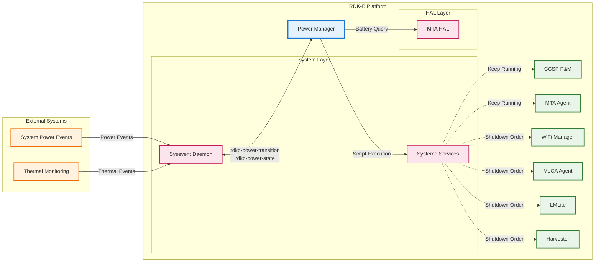
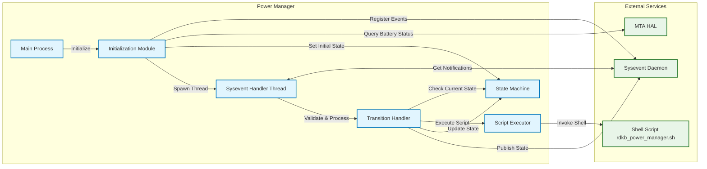
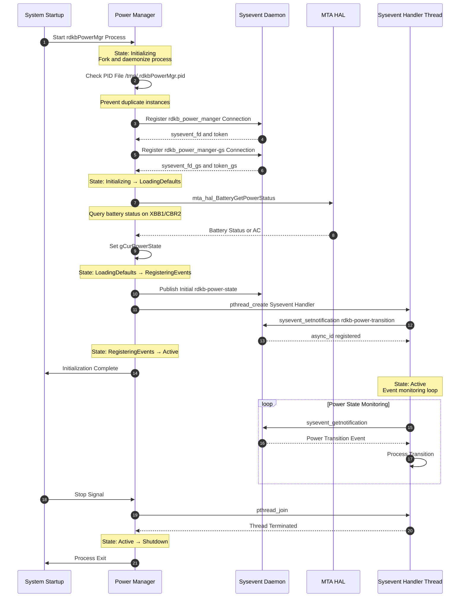
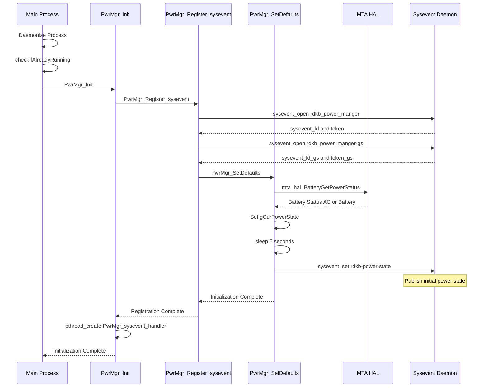
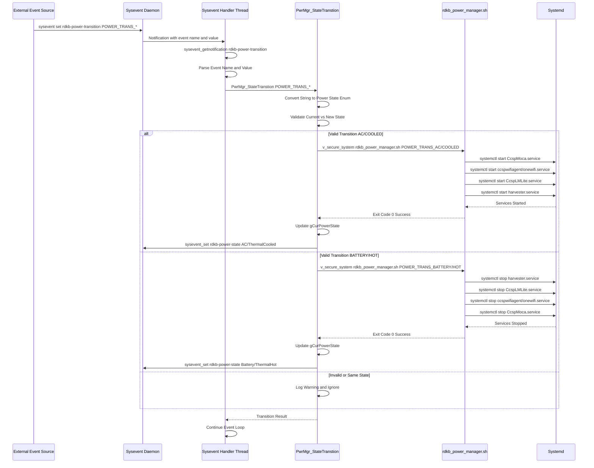
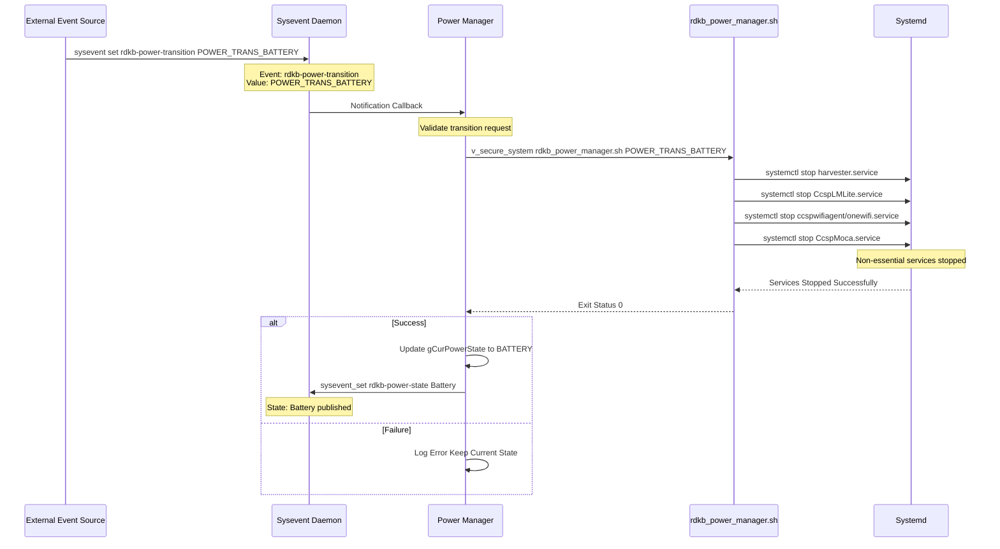
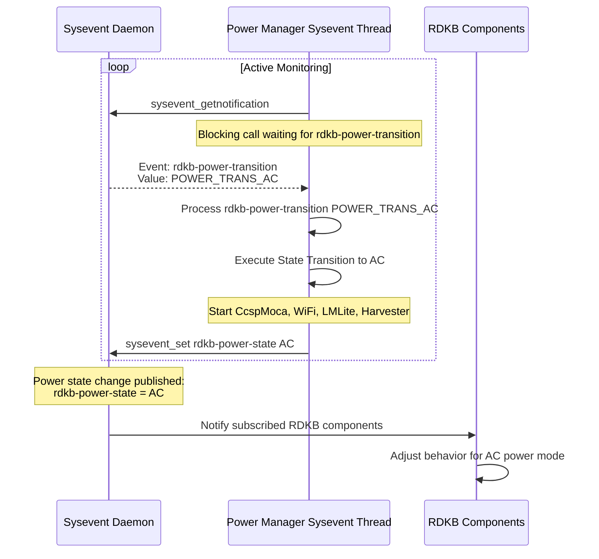

# Power Manager

The RDKB Power Manager is a lightweight system service responsible for managing power state transitions and coordinating orderly shutdown and startup of RDKB CCSP components based on power source changes and thermal conditions. This component monitors power transition events from the system layer and orchestrates component lifecycle management during power state changes. Power Manager handles transitions between AC power and battery operation on supported platforms, as well as thermal management states to protect hardware from overheating conditions.

The component operates as a daemon process that listens to sysevent notifications for power state changes, validates transitions, invokes management scripts to control RDKB component lifecycles, and publishes the current power state for other components to consume. Power Manager maintains minimal resource footprint for power event handling and component coordination across different power modes.

**Key Features & Responsibilities**: 

- **Power State Transition Management**: Monitors and processes power source transitions between AC power and battery operation on supported platforms, ensuring graceful component shutdown and startup sequences
- **Thermal State Management**: Handles thermal condition transitions from normal operation to hot state and back to cooled state, triggering protective component shutdowns to prevent hardware damage
- **Component Lifecycle Coordination**: Orchestrates orderly shutdown and startup of non-essential RDKB components while preserving critical services for remote management and voice functionality
- **Sysevent Integration**: Listens to rdkb-power-transition events and publishes rdkb-power-state notifications for current power operating mode

## Design

Power Manager implements a lightweight event-driven architecture focused on power state monitoring and component coordination with minimal system overhead. The design separates power event detection, state transition validation, and component lifecycle management. The component operates as a standalone daemon process with dedicated threading for asynchronous event handling without blocking critical operations.

The architecture maintains a simple state machine tracking current power mode and validating transition requests to prevent invalid state changes. Power Manager delegates actual component shutdown and startup operations to a companion shell script that encapsulates platform-specific systemd service management commands. This separation allows platform-specific customization while maintaining consistent core power management logic.

Sysevent serves as the primary IPC mechanism for both receiving power transition notifications and publishing current state information. The component establishes two sysevent connections - one dedicated to asynchronous event notifications and another for synchronous state publication operations. On startup, Power Manager queries battery status through MTA HAL on battery-capable platforms to initialize with correct power state before beginning event processing.

### Prerequisites and Dependencies

**Build-Time Flags and Configuration:**

| Configure Option | DISTRO Feature | Build Flag | Purpose | Default |
|------------------|----------------|------------|---------|---------|
| `--enable-gtestapp` | N/A | `GTEST_ENABLE` | Enable GTest support for unit testing | Disabled |
| N/A | Platform-specific | `_XBB1_SUPPORTED_` | Enable XBB1 platform battery power management support | Platform conditional |
| N/A | Platform-specific | `_CBR2_PRODUCT_REQ_` | Enable CBR2 platform battery power management support | Platform conditional |
| N/A | RDK logging | `FEATURE_SUPPORT_RDKLOG` | Enable RDK logger integration for standardized logging | Enabled |
| N/A | Crash reporting | `INCLUDE_BREAKPAD` | Enable breakpad crash handler for minidump generation | Enabled |
| N/A | Development | `_DEBUG` | Enable debug output redirection to console | Enabled in source |

 

**RDK-B Platform and Integration Requirements:**

* **Build Dependencies**: `ccsp-common-library`, `sysevent`, `syscfg`, `hal-mta`, `rdk-logger`, `breakpad`, `breakpad-wrapper`, `secure-wrapper`
* **RDK-B Components**: `CcspCrSsp`, `CcspMtaAgentSsp`
* **HAL Dependencies**: MTA HAL APIs for battery status query on battery-capable platforms
* **Systemd Services**: `CcspCrSsp.service`, `CcspMtaAgentSsp.service` must be active before `rdkbPowerManager.service` starts
* **Configuration Files**: `/tmp/.rdkbPowerMgr.pid` for process tracking, `/etc/device.properties` for platform configuration, `/etc/debug.ini` for RDK logger initialization
* **Startup Order**: Initialize after sysevent daemon is running and MTA agent services are available

 

**Threading Model:** 

Power Manager implements a multi-threaded architecture with a main process thread and a dedicated worker thread for asynchronous sysevent notification handling.

- **Threading Architecture**: Multi-threaded with event-driven worker thread
- **Main Thread**: Handles component initialization, sysevent registration, initial state setup, and process lifecycle management including thread creation and cleanup
- **Worker Threads**: 
  - **Sysevent Handler Thread**: Continuously monitors rdkb-power-transition events, validates incoming transition requests, invokes state transition logic, and publishes updated power state
- **Synchronization**: Thread naming using pthread_setname_np for debugging and monitoring, thread joining on shutdown for clean termination

### Component State Flow

**Initialization to Active State**

Power Manager follows a sequential initialization process: establish sysevent connections, query initial power state, spawn event handler thread, then transition to active monitoring mode.

**Runtime State Changes and Context Switching**

During active operation, Power Manager responds to power transition events by validating state and managing component lifecycle.

**State Change Triggers:**

- `rdkb-power-transition` sysevent set to `POWER_TRANS_AC` initiates transition to AC power mode with component startup
- `rdkb-power-transition` sysevent set to `POWER_TRANS_BATTERY` initiates transition to battery mode with non-essential component shutdown on battery-capable platforms
- `rdkb-power-transition` sysevent set to `POWER_TRANS_HOT` initiates transition to thermal hot state with protective component shutdown
- `rdkb-power-transition` sysevent set to `POWER_TRANS_COOLED` initiates transition from thermal hot to cooled state with component restart
- Sysevent daemon restart detection triggers connection re-establishment after 600 second delay

**Context Switching Scenarios:**

- Battery to AC transition switches from low-power component-limited mode to full operational mode with all services running
- AC to Battery transition switches from full operational mode to low-power mode preserving only critical services for remote management and voice
- Thermal hot transition switches from normal operation to protective mode shutting down high-activity components to reduce heat generation
- Thermal cooled transition restores normal operational context after thermal conditions normalize

### Call Flow

**Initialization Call Flow:**

**Power Transition Processing Call Flow:**

## Internal Modules

Power Manager consists of a single monolithic process with functional separation through internal functions rather than separate module files.

| Module/Class | Description | Key Files |
|-------------|------------|-----------|
| **Main Process** | Process entry point handling daemonization, PID file management, initialization orchestration, and breakpad crash handler setup | `pwrMgr.c` main function |
| **Initialization Handler** | Component initialization logic including sysevent registration, default state setup, and thread creation | `pwrMgr.c` PwrMgr_Init, PwrMgr_Register_sysevent, PwrMgr_SetDefaults |
| **Sysevent Handler Thread** | Asynchronous event monitoring loop receiving and dispatching power transition notifications | `pwrMgr.c` PwrMgr_sysevent_handler |
| **State Transition Engine** | Power state validation and transition execution including script invocation and state publication | `pwrMgr.c` PwrMgr_StateTranstion |
| **Configuration Module** | Power state definitions and transition string mappings | `pwrMgr.h` PWRMGR_PwrState, PWRMGR_PwrStateItem |

## Component Interactions

Power Manager maintains focused interactions with system services for event monitoring and component lifecycle management.

### Interaction Matrix

| Target Component/Layer | Interaction Purpose | Key APIs/Endpoints |
|------------------------|-------------------|------------------|
| **RDK-B Middleware Components (Indirect via Systemd)** |
| CcspMoca.service | Stop during battery/thermal modes and restart on AC/cooled transitions | Controlled via `/usr/ccsp/pwrMgr/rdkb_power_manager.sh` executing `systemctl stop/start CcspMoca.service` |
| WiFi Services (ccspwifiagent.service / onewifi.service) | Stop during battery/thermal modes and restart on AC/cooled transitions | Controlled via shell script executing `systemctl stop/start ccspwifiagent.service` or `onewifi.service` based on OneWiFiEnabled flag |
| CcspLMLite.service | Stop during battery/thermal modes and restart on AC/cooled transitions | Controlled via shell script executing `systemctl stop/start CcspLMLite.service` |
| harvester.service | Stop during battery/thermal modes and restart on AC/cooled transitions | Controlled via shell script executing `systemctl stop/start harvester.service` |
| CcspPandM.service | Kept running in all power modes for remote monitoring | No direct control - preserved during power transitions |
| CcspMtaAgent.service | Kept running in all power modes for voice service | No direct control - preserved during power transitions |
| **System & HAL Layers** |
| Sysevent Daemon | IPC mechanism for receiving power transition events and publishing current power state | Sysevent API: `sysevent_open()`, `sysevent_setnotification()`, `sysevent_getnotification()`, `sysevent_set()` on events `rdkb-power-transition` (subscribed), `rdkb-power-state` (published) |
| Systemd | Service lifecycle management for RDKB component orderly shutdown and startup | Shell script invocation via `v_secure_system()` API executing `/usr/ccsp/pwrMgr/rdkb_power_manager.sh` with parameters POWER_TRANS_AC, POWER_TRANS_BATTERY, POWER_TRANS_HOT, POWER_TRANS_COOLED |
| MTA HAL | Query battery power status during initialization on battery-capable platforms (XBB1, CBR2) | HAL API: `mta_hal_BatteryGetPowerStatus()` returns "AC", "Battery", or "Unknown" |
| Secure Wrapper | Secure execution of shell scripts with sanitized inputs | Security API: `v_secure_system()` for safe shell command execution |

**Configuration Persistence:**
Power Manager does not persist power state configuration across reboots. The component queries MTA HAL on startup to determine initial power state on battery-capable platforms, defaulting to AC mode otherwise. Runtime power state changes are handled via sysevent notifications and are not stored in syscfg or PSM.

**Events Published by Power Manager:**

| Event Name | Event Topic/Path | Trigger Condition | Subscriber Components |
|------------|-----------------|-------------------|---------------------|
| Power State Update | `rdkb-power-state` sysevent | Successful power state transition completion | All RDKB components monitoring power state for operational adjustments |

**Events Subscribed by Power Manager:**

| Event Name | Event Topic/Path | Action Taken |
|------------|-----------------|--------------|
| Power Transition Request | `rdkb-power-transition` sysevent | Validate and execute power state transition invoking management script |

### IPC Flow Patterns

**Primary IPC Flow - Power State Transition:**

**Event Notification Flow:**

## Implementation Details

### Major HAL APIs Integration

Power Manager integrates with MTA HAL on battery-capable platforms to query initial battery power status during component initialization.

**Core HAL APIs:**

| HAL API | Purpose | Implementation File |
|---------|---------|-------------------|
| `mta_hal_BatteryGetPowerStatus()` | Query current battery power status returning AC Battery or Unknown for initial state determination | `pwrMgr.c` PwrMgr_SetDefaults function |

### Key Implementation Logic

- **State Machine Engine**: Maintains current power state in `gCurPowerState` global variable with predefined state definitions in `powerStateArr` array mapping enum values to transition strings and state strings

  - State transition validation in `pwrMgr.c` PwrMgr_StateTranstion function comparing requested state against current state
  - State transition handlers in `pwrMgr.c` PwrMgr_StateTranstion switch statement executing platform-specific transitions

- **Event Processing**: Sysevent notification handling in dedicated thread continuously monitoring rdkb-power-transition events

  - Asynchronous event retrieval using `sysevent_getnotification()` in blocking mode within infinite loop
  - Event name matching and value extraction dispatching to PwrMgr_StateTranstion function
  - Sysevent daemon availability monitoring with 600 second retry delay on connection failure

- **Error Handling Strategy**: Validates power state transitions preventing invalid or duplicate state change requests

  - Duplicate state transition requests logged with warning and ignored without script execution
  - Script execution failure detection through `v_secure_system()` return code checking
  - Sysevent connection failure retry logic with maximum 6 attempts and automatic syseventd restart
  - Thread creation failure detection with error logging and initialization abort

- **Logging & Debugging**: RDK logger integration for standardized log message formatting when `FEATURE_SUPPORT_RDKLOG` enabled

  - Debug logging with function name and line number inclusion using `PWRMGRLOG` macro
  - Log severity levels INFO WARNING ERROR mapped to CcspTrace functions
  - Component name LOG.RDK.PWRMGR for log message identification and filtering
  - Thread naming using pthread_setname_np for process monitoring and debugging

### Key Configuration Files

| Configuration File | Purpose | Override Mechanisms |
|--------------------|---------|--------------------|
| `/tmp/.rdkbPowerMgr.pid` | Process ID file preventing duplicate daemon instances | N/A system managed |
| `/etc/device.properties` | Platform configuration properties used by management script | Platform build configuration |
| `/etc/debug.ini` | RDK logger initialization configuration | Manual configuration file edit |
| `/usr/ccsp/pwrMgr/rdkb_power_manager.sh` | Component lifecycle management script | Platform-specific customization |
