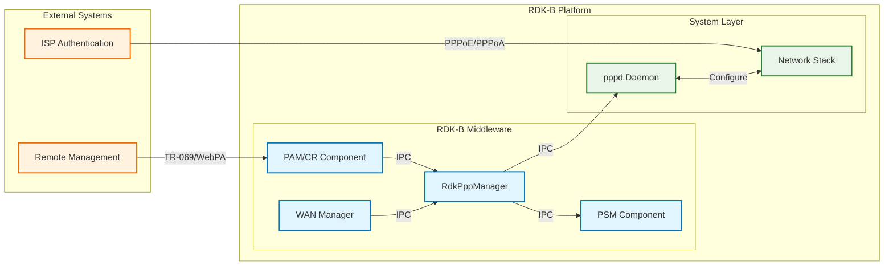
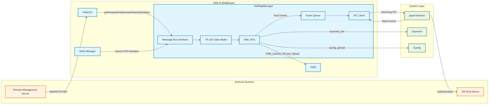
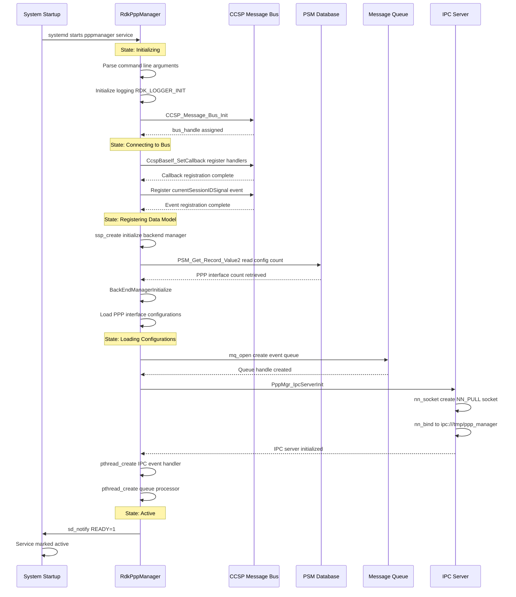
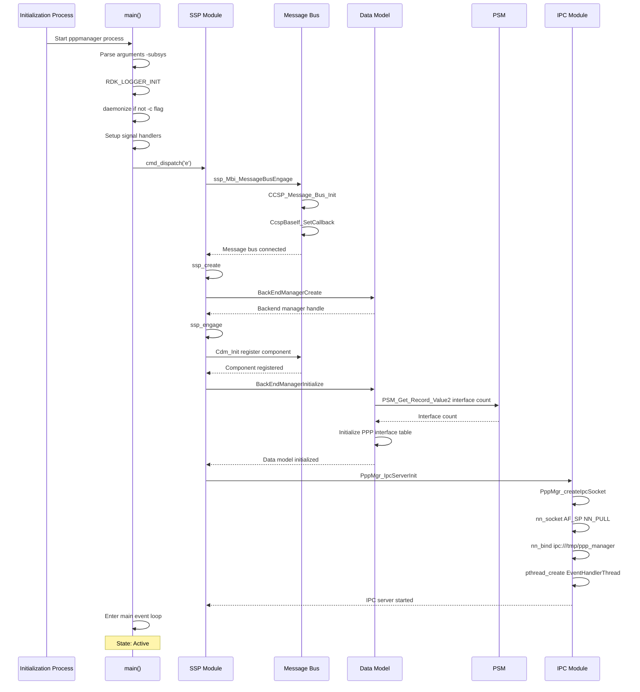
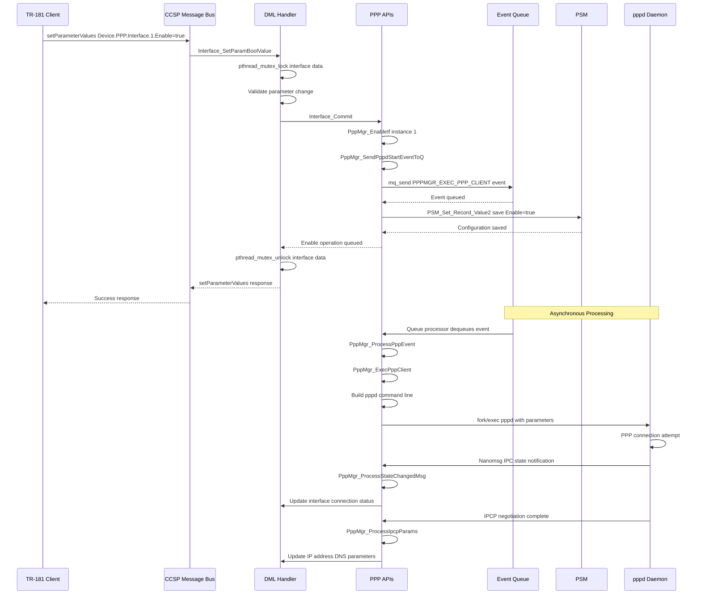
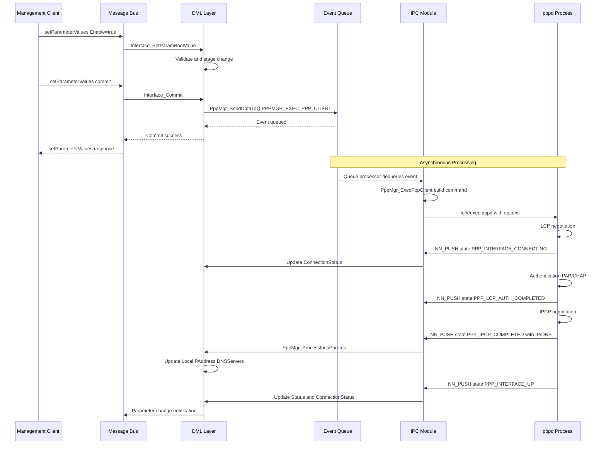
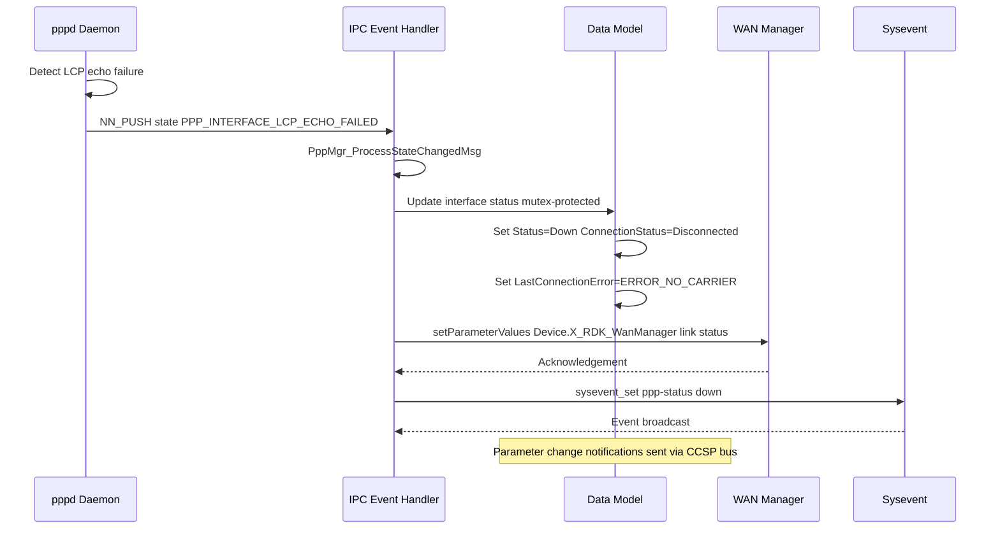

# RdkPppManager Documentation

RdkPppManager is the RDK-B middleware component responsible for managing Point-to-Point Protocol connections for WAN connectivity. This component implements the TR-181 Device.PPP data model and provides centralized management of PPP interfaces including PPPoE and PPPoA configurations. RdkPppManager handles PPP session lifecycle management, authentication, network control protocol negotiation, and status monitoring for broadband connections requiring PPP encapsulation.

RdkPppManager acts as the bridge between the RDK-B middleware layer and the underlying pppd daemon, translating TR-181 configuration parameters into pppd runtime options and reporting connection status, statistics, and events back to the management layer. The component integrates with WAN Manager for unified WAN interface management and uses PSM for persistent configuration storage.



**Key Features & Responsibilities**: 

- **PPP Session Management**: Controls PPP interface lifecycle including session establishment, authentication handshake, connection teardown, and automatic reconnection handling with configurable retry policies
- **TR-181 Data Model Implementation**: Provides comprehensive Device.PPP.Interface object implementation with support for PPPoE and PPPoA link types, authentication protocols, and network control protocols
- **Network Control Protocol Handling**: Manages IPCP and IPv6CP negotiations for IP address assignment, DNS server configuration, and network parameter establishment with the ISP
- **Authentication Protocol Support**: Implements PAP, CHAP, MS-CHAP, and AUTO authentication modes with secure credential storage and retrieval from PSM
- **Connection Monitoring**: Tracks PPP connection status, session parameters, LCP echo keepalive, link statistics, and error conditions with event notifications to WAN Manager

## Design

RdkPppManager follows an event-driven architecture designed to manage PPP connections asynchronously while maintaining synchronous TR-181 parameter access through the CCSP message bus. The design separates configuration management from runtime session control through distinct modules handling data model operations, daemon interaction, and event processing.

The component operates as a CCSP middleware process integrating with the RDK-B component ecosystem through the CCSP message bus for northbound TR-181 access and PSM integration for configuration persistence. The southbound interface uses nanomsg IPC sockets to communicate with pppd daemon instances, receiving connection state changes, negotiation results, and error notifications asynchronously while sending configuration commands synchronously.

The threading model uses mutex-based synchronization to protect shared PPP interface data structures accessed by both the CCSP message bus handler thread and the IPC event processing thread. A POSIX message queue handles asynchronous event dispatching for PPP client start/stop operations and configuration changes requiring daemon restarts. The component maintains an in-memory table of PPP interface configurations synchronized with PSM storage and updated dynamically based on runtime status from pppd.



### Prerequisites and Dependencies

**Build-Time Flags and Configuration:**

| Configure Option | DISTRO Feature | Build Flag | Purpose | Default |
|------------------|----------------|------------|---------|---------|
| `--enable-notify` | N/A | `ENABLE_SD_NOTIFY` | Enable systemd service notification support for process lifecycle management | Disabled |
| `--enable-dropearly` | N/A | `DROP_ROOT_EARLY` | Enable early privilege dropping for non-root execution security hardening | Disabled |
| `--with-ccsp-arch` | N/A | `CCSP_ARCH` | Specify target CPU architecture: arm, atom, pc, mips for platform-specific builds | None |
| `--with-ccsp-platform` | N/A | `CCSP_PLATFORM` | Specify target platform: intel_usg, pc, bcm for vendor-specific implementations | None |
| N/A | `FEATURE_SUPPORT_RDKLOG` | `FEATURE_SUPPORT_RDKLOG` | Enable RDK centralized logging framework integration | Disabled |
| N/A | N/A | `USE_PPP_DAEMON` | Use pppd plugin libraries rp-pppoe.so and pppoatm.so for link layer | Disabled |
| N/A | N/A | `PPP_USERNAME_PASSWORD_FROM_PSM` | Store PPP credentials in PSM instead of runtime memory | Disabled |
| N/A | N/A | `DYNAMIC_CONFIGURE_PPP_LOWERLAYER` | Enable dynamic lower layer interface configuration at runtime | Disabled |
| N/A | N/A | `DUID_UUID_ENABLE` | Use UUID-based DHCP Unique Identifier generation | Disabled |
| N/A | N/A | `WAN_MANAGER_UNIFICATION_ENABLED` | Enable integration with unified WAN Manager architecture | Disabled |
| N/A | N/A | `_DT_QoS_Enable_` | Enable QoS parameter configuration for PPP interfaces | Disabled |
| N/A | N/A | `_COSA_DRG_CNS_` | Enable vendor-specific extensions for Cisco platforms | Disabled |
| N/A | N/A | `_USE_NM_MSG_SOCK` | Use nanomsg library for IPC instead of UNIX domain sockets | Enabled |
| N/A | N/A | `_ANSC_LINUX` | Linux platform compilation flag for ANSC framework | Enabled |

<br>

**RDK-B Platform and Integration Requirements:**

* **RDK-B Components**: `CcspPandM`, `CcspPsm`, `CcspCommonLibrary`, `WanManager`, `CcspCr`
* **HAL Dependencies**: `hal_platform` for platform-specific operations
* **Systemd Services**: `CcspCrSsp.service`, `CcspPsmSsp.service` must be active before `pppmanager.service` starts
* **Message Bus**: CCSP Message Bus registration under component ID `com.cisco.spvtg.ccsp.pppmanager` with path `/com/cisco/spvtg/ccsp/pppmanager`
* **TR-181 Data Model**: `Device.PPP` object hierarchy implementation per BBF TR-181 Issue 2 specification
* **Configuration Files**: `RdkPppManager.xml` for TR-181 parameter registration located in component configuration directory
* **External Dependencies**: `pppd` daemon version 2.4.9 or compatible, `libnanomsg` for IPC, `libsysevent`, `libsyscfg` for system integration
* **Startup Order**: Initialize after CCSP CR and PSM services are running and message bus is available
* **IPC Socket**: Nanomsg socket endpoint at `ipc:///tmp/ppp_manager` for pppd daemon communication

<br>

**Threading Model:** 

RdkPppManager implements a multi-threaded architecture to handle asynchronous PPP session events while maintaining synchronous TR-181 parameter operations without blocking.

- **Threading Architecture**: Multi-threaded with main event loop and dedicated worker threads for IPC event handling and queue processing
- **Main Thread**: Handles CCSP message bus operations, TR-181 parameter get/set requests, component initialization, and main event loop processing
- **Worker Threads**: 
  - **IPC Event Handler Thread**: Monitors nanomsg socket for incoming PPP state change notifications from pppd daemon and processes connection status updates
  - **Event Queue Processor Thread**: Processes POSIX message queue for PPP client start/stop operations and configuration change events
- **Synchronization**: Uses pthread mutex locks per PPP interface instance protecting shared configuration and status data structures accessed by multiple threads

### Component State Flow

**Initialization to Active State**

RdkPppManager follows a structured initialization sequence registering with CCSP infrastructure before entering active state to process TR-181 requests and manage PPP sessions.



**Runtime State Changes and Context Switching**

During operation RdkPppManager responds to configuration changes and connection events causing PPP interface state transitions.

**State Change Triggers:**

- TR-181 Enable parameter change triggering PPP client start or stop
- PPP connection establishment completing IPCP/IPv6CP negotiation
- LCP echo failure causing connection down detection
- Authentication failure from ISP rejecting credentials
- Configuration parameter changes requiring session restart

**Context Switching Scenarios:**

- Interface enable/disable switching between unconfigured and connecting states
- Connection mode switching between AlwaysOn, OnDemand, and Manual trigger modes
- Link type switching between PPPoE and PPPoA requiring different lower layer interfaces
- Authentication protocol fallback from preferred method to supported alternative

### Call Flow

**Initialization Call Flow:**



**Request Processing Call Flow:**



## TR‑181 Data Models

### Supported TR-181 Parameters

RdkPppManager implements the Device.PPP object hierarchy as defined in BBF TR-181 Issue 2 specifications providing comprehensive PPP interface management and monitoring capabilities.

### Object Hierarchy

```
Device.
└── PPP.
    ├── SupportedNCPs (string, R)
    ├── InterfaceNumberOfEntries (unsignedInt, R)
    └── Interface.{i}.
        ├── Enable (boolean, R/W)
        ├── IPCPEnable (boolean, R/W)
        ├── IPv6CPEnable (boolean, R/W)
        ├── Status (string, R)
        ├── Alias (string(64), R/W)
        ├── Name (string(64), R)
        ├── LastChange (unsignedInt, R)
        ├── LowerLayers (string, R/W)
        ├── Reset (boolean, R/W)
        ├── ConnectionStatus (string, R)
        ├── LastConnectionError (string, R)
        ├── AutoDisconnectTime (unsignedInt, R/W)
        ├── IdleDisconnectTime (unsignedInt, R/W)
        ├── WarnDisconnectDelay (unsignedInt, R/W)
        ├── Username (string(64), R/W)
        ├── Password (string(64), R/W)
        ├── EncryptionProtocol (string, R)
        ├── CompressionProtocol (string, R)
        ├── AuthenticationProtocol (string, R)
        ├── MaxMRUSize (unsignedInt, R/W)
        ├── CurrentMRUSize (unsignedInt, R)
        ├── ConnectionTrigger (string, R/W)
        ├── X_RDK_LinkType (string, R/W)
        ├── LCPEcho (unsignedInt, R)
        ├── LCPEchoRetry (unsignedInt, R)
        ├── PPPoE.
        │   ├── SessionID (unsignedInt, R)
        │   ├── ACName (string(256), R/W)
        │   └── ServiceName (string(256), R/W)
        ├── IPCP.
        │   ├── LocalIPAddress (string, R)
        │   ├── RemoteIPAddress (string, R)
        │   ├── DNSServers (string, R)
        │   └── PassthroughEnable (boolean, R/W)
        ├── IPv6CP.
        │   └── LocalInterfaceIdentifier (string, R)
        └── Stats.
            ├── BytesSent (unsignedLong, R)
            ├── BytesReceived (unsignedLong, R)
            ├── PacketsSent (unsignedLong, R)
            ├── PacketsReceived (unsignedLong, R)
            ├── ErrorsSent (unsignedInt, R)
            ├── ErrorsReceived (unsignedInt, R)
            ├── UnicastPacketsSent (unsignedLong, R)
            ├── UnicastPacketsReceived (unsignedLong, R)
            ├── DiscardPacketsSent (unsignedInt, R)
            └── DiscardPacketsReceived (unsignedInt, R)
```

### Parameter Definitions

**Core Parameters:**

| Parameter Path | Data Type | Access | Default Value | Description | BBF Compliance |
|----------------|-----------|--------|---------------|-------------|----------------|
| `Device.PPP.SupportedNCPs` | string | R | `"IPCP,IPv6CP"` | Comma-separated list of supported Network Control Protocols. Implementation supports IPCP and IPv6CP for IPv4 and IPv6 address negotiation | TR-181 Issue 2 |
| `Device.PPP.InterfaceNumberOfEntries` | unsignedInt | R | `0` | Number of PPP interface instances in the Interface table. Dynamically reflects configured interface count | TR-181 Issue 2 |
| `Device.PPP.Interface.{i}.Enable` | boolean | R/W | `false` | Enables or disables the PPP interface. Setting to true initiates PPP connection establishment. Setting to false terminates active connection | TR-181 Issue 2 |
| `Device.PPP.Interface.{i}.Status` | string | R | `"Down"` | Current operational status of the interface. Enumerated values: Up, Down, Unknown, Dormant, NotPresent, LowerLayerDown, Error | TR-181 Issue 2 |
| `Device.PPP.Interface.{i}.ConnectionStatus` | string | R | `"Unconfigured"` | Current PPP connection state. Enumerated values: Unconfigured, Connecting, Authenticating, Connected, PendingDisconnect, Disconnecting, Disconnected | TR-181 Issue 2 |
| `Device.PPP.Interface.{i}.LastConnectionError` | string | R | `"ERROR_NONE"` | Last error that caused connection failure. Values include ERROR_AUTHENTICATION_FAILURE, ERROR_ISP_TIME_OUT, ERROR_NO_CARRIER, ERROR_IP_CONFIGURATION per TR-181 specification | TR-181 Issue 2 |
| `Device.PPP.Interface.{i}.Username` | string(64) | R/W | `""` | Username for PPP authentication. Used with PAP CHAP or MS-CHAP authentication protocols | TR-181 Issue 2 |
| `Device.PPP.Interface.{i}.Password` | string(64) | R/W | `""` | Password for PPP authentication. Stored securely in PSM when PPP_USERNAME_PASSWORD_FROM_PSM flag enabled | TR-181 Issue 2 |
| `Device.PPP.Interface.{i}.AuthenticationProtocol` | string | R | `"AUTO"` | Authentication protocol negotiated or configured. Enumerated values: PAP, CHAP, MS-CHAP, AUTO. AUTO allows pppd to select based on peer requirements | TR-181 Issue 2 |
| `Device.PPP.Interface.{i}.X_RDK_LinkType` | string | R/W | `"PPPoE"` | RDK vendor extension specifying PPP encapsulation type. Enumerated values: PPPoE for Ethernet-based DSL connections, PPPoA for ATM-based connections | Custom Extension |
| `Device.PPP.Interface.{i}.LowerLayers` | string | R/W | `""` | Comma-separated list of lower layer interface references. For PPPoE typically references Device.Ethernet.VLANTermination instance. For PPPoA references Device.ATM.Link instance | TR-181 Issue 2 |
| `Device.PPP.Interface.{i}.ConnectionTrigger` | string | R/W | `"AlwaysOn"` | Connection initiation mode. OnDemand connects when traffic present. AlwaysOn maintains persistent connection. Manual requires explicit connection request | TR-181 Issue 2 |
| `Device.PPP.Interface.{i}.MaxMRUSize` | unsignedInt | R/W | `1492` | Maximum Receive Unit size in bytes for PPP frames. Valid range 1280-1500. PPPoE typically uses 1492 accounting for 8-byte overhead on 1500-byte Ethernet | TR-181 Issue 2 |
| `Device.PPP.Interface.{i}.LCPEcho` | unsignedInt | R | `30` | LCP echo request interval in seconds for keepalive detection. Value 30 sends echo every 30 seconds to detect link failures | TR-181 Issue 2 |
| `Device.PPP.Interface.{i}.LCPEchoRetry` | unsignedInt | R | `3` | Number of consecutive LCP echo failures before declaring connection down. Value 3 allows 90 seconds detection time with 30-second interval | TR-181 Issue 2 |
| `Device.PPP.Interface.{i}.PPPoE.SessionID` | unsignedInt | R | `0` | PPPoE session identifier assigned by access concentrator during session establishment. Valid range 1-65535 with 0 indicating no active session | TR-181 Issue 2 |
| `Device.PPP.Interface.{i}.IPCP.LocalIPAddress` | string | R | `""` | IPv4 address assigned to local PPP interface through IPCP negotiation. Dynamically obtained from ISP during connection establishment | TR-181 Issue 2 |
| `Device.PPP.Interface.{i}.IPCP.RemoteIPAddress` | string | R | `""` | IPv4 address of remote PPP peer. Typically ISP gateway address for routing | TR-181 Issue 2 |
| `Device.PPP.Interface.{i}.IPCP.DNSServers` | string | R | `""` | Comma-separated list of DNS server IPv4 addresses obtained via IPCP negotiation | TR-181 Issue 2 |

### Parameter Registration and Access

- **Implemented Parameters**: RdkPppManager implements Device.PPP.SupportedNCPs, InterfaceNumberOfEntries, and complete Device.PPP.Interface.{i} object hierarchy including PPPoE, IPCP, IPv6CP, and Stats sub-objects
- **Parameter Registration**: Parameters registered through `RdkPppManager.xml` configuration file parsed by CCSP Component Registrar. DML handler functions mapped to each parameter in XML function definitions
- **Access Mechanism**: External components access parameters via CCSP Message Bus using `getParameterValues` and `setParameterValues` RPCs. Message bus routes requests to registered DML handler functions based on parameter path
- **Validation Rules**: Enable parameter validates lower layer interface exists. MaxMRUSize validated against 1280-1500 range. Username and Password limited to 64 characters. ConnectionTrigger validated against enumerated values

## Internal Modules

RdkPppManager organizes functionality into specialized modules handling TR-181 data model operations, PPP session management, IPC communication, and event processing.

| Module/Class | Description | Key Files |
|-------------|------------|-----------|
| **Service Support Platform** | Process initialization and CCSP framework integration providing component entry point, message bus connection, signal handling, and component lifecycle management | `pppmgr_ssp_main.c`, `pppmgr_ssp_action.c`, `pppmgr_ssp_messagebus_interface.c` |
| **Data Model Layer** | TR-181 Device.PPP object implementation with DML handler functions for parameter get/set/validate/commit operations and backend manager for interface table management | `pppmgr_dml.c`, `pppmgr_dml.h`, `pppmgr_dml_apis.h` |
| **PPP API Module** | Core PPP session control logic including pppd daemon execution, configuration building, interface enable/disable, status monitoring, and statistics collection | `pppmgr_dml_ppp_apis.c`, `pppmgr_dml_ppp_apis.h` |
| **IPC Communication** | Nanomsg-based inter-process communication with pppd daemon handling state change notifications, IPCP/IPv6CP parameter updates, and connection event processing | `pppmgr_ipc.c` |
| **Data Management** | Backend manager implementation providing PPP interface table initialization, instance management, mutex-protected data access, and PSM integration for persistence | `pppmgr_data.c`, `pppmgr_data.h` |
| **Utility Functions** | Helper functions for string manipulation, parameter validation, PSM operations, and IPv6 address processing | `pppmgr_utils.c` |

## Component Interactions

RdkPppManager integrates with multiple RDK-B middleware components, system services, and external daemons to provide complete PPP connection management functionality.

### Interaction Matrix

| Target Component/Layer | Interaction Purpose | Key APIs/Endpoints |
|------------------------|-------------------|------------------|
| **RDK-B Middleware Components** |
| PAM Component | TR-181 parameter access for PPP configuration and status monitoring | `Device.PPP.Interface.{i}.*` via CCSP Message Bus getParameterValues/setParameterValues |
| WAN Manager | WAN interface status synchronization and connection state coordination | `Device.X_RDK_WanManager.Interface.*` setParameterValues for link status updates |
| PSM Component | Persistent storage of PPP configuration parameters and interface instance data | `PSM_Get_Record_Value2()`, `PSM_Set_Record_Value2()` for dml.ppp.* namespace |
| **System & Services** |
| pppd Daemon | PPP session establishment, authentication, NCP negotiation, connection monitoring | Nanomsg IPC socket `ipc:///tmp/ppp_manager` for bidirectional event/command messaging |
| Sysevent | System-wide event notification for PPP status changes | `sysevent_set()` for ppp-status, wan-status events |
| Syscfg | System configuration database access for device-specific parameters | `syscfg_get()`, `syscfg_set()` for persistent configuration |
| Linux Network Stack | Statistics collection and interface status monitoring | `/proc/net/dev`, `/proc/net/dev_extstats` parsing for traffic counters |

**Events Published by RdkPppManager:**

| Event Name | Event Topic/Path | Trigger Condition | Subscriber Components |
|------------|-----------------|-------------------|---------------------|
| PPP_Connection_Up | `Device.PPP.Interface.{i}.Status` parameter change notification | PPP connection established and IPCP negotiation complete | WAN Manager, PAM, Remote Management |
| PPP_Connection_Down | `Device.PPP.Interface.{i}.Status` parameter change notification | PPP connection terminated or LCP echo failure detected | WAN Manager, PAM, Remote Management |
| PPP_Authentication_Failed | `Device.PPP.Interface.{i}.LastConnectionError` update | ISP rejects authentication credentials | WAN Manager, Logging Services |
| IPCP_Negotiation_Complete | Internal IPC message | IPv4 address and DNS parameters obtained | Data Model Layer for parameter updates |
| PPP_Session_Reset | Sysevent `ppp-status` set to down | Manual reset triggered via Reset parameter | Network Services, Firewall |

### IPC Flow Patterns

**Primary IPC Flow - PPP Connection Establishment:**



**Event Notification Flow:**



## Implementation Details

### Major HAL APIs Integration

RdkPppManager integrates with platform HAL interfaces for hardware-specific operations and system configuration access. The component abstracts platform-specific implementations through standardized HAL APIs while maintaining direct system interface access for performance-critical operations.

**Core HAL APIs:**

| HAL API | Purpose | Implementation File |
|---------|---------|-------------------|
| `platform_hal_GetSerialNumber` | Retrieve device serial number for DUID generation when DUID_UUID_ENABLE flag set | `pppmgr_utils.c` |
| `cm_hal_GetDHCPInfo` | Query cable modem for DHCP-assigned parameters when operating in cable mode | `pppmgr_dml_ppp_apis.c` |

### Key Implementation Logic

- **PPP Session Management**: Core session control implemented in `pppmgr_dml_ppp_apis.c` with `PppMgr_EnableIf()` function handling interface enable/disable operations. Function validates lower layer configuration ensuring prerequisite interfaces exist, builds pppd command line with authentication parameters including username and password, applies plugin selection based on X_RDK_LinkType for PPPoE or PPPoA modes, and enqueues execution event to message queue for asynchronous processing. Session teardown implemented through `PppMgr_StopPppClient()` sending SIGTERM signal to pppd process identified by PID file and performing cleanup of interface state including connection status reset and resource deallocation. Configuration validation includes LowerLayers parameter verification and authentication protocol selection.
  
- **Event Processing Architecture**: Event queue handler in `pppmgr_ipc.c` implements POSIX message queue pattern with `PppMgr_SendDataToQ()` providing non-blocking event posting mechanism and dedicated processor thread consuming events from queue named `/pppmgr_queue`. Queue supports two event types: PPPMGR_EXEC_PPP_CLIENT for connection establishment and termination operations, and PPPMGR_BUS_SET for parameter propagation to WAN Manager component. Event queue created with maximum length 100 messages and 256-byte buffer size. Processing thread implements event dispatching logic routing events to appropriate handlers based on action type with error recovery for failed operations.
  
- **IPC Communication Protocol**: Nanomsg NN_PULL/NN_PUSH socket pattern in `pppmgr_ipc.c` with `PppMgr_EventHandlerThread()` monitoring IPC socket endpoint `ipc:///tmp/ppp_manager` for incoming PPP state notifications from pppd daemon. Protocol uses structured `ipc_ppp_event_msg_t` messages containing state enumeration including PPP_INTERFACE_UP, PPP_INTERFACE_DOWN, PPP_IPCP_COMPLETED, session parameters like session ID, and negotiated IP configuration including local address, remote address, and DNS servers. Function `PppMgr_ProcessPppState()` dispatches messages to appropriate handlers based on state type: `PppMgr_ProcessStateChangedMsg()` for connection state changes, `PppMgr_ProcessIpcpParams()` for IPCP negotiation results, `PppMgr_ProcessIpv6cpParams()` for IPv6CP parameters. Socket operations use NN_DONTWAIT flag for non-blocking receives.
  
- **Data Synchronization**: Thread-safe interface access in `pppmgr_data.c` using per-interface pthread mutex with `PppMgr_GetIfaceData_locked()` acquiring exclusive lock on interface data structure and `PppMgr_GetIfaceData_release()` releasing lock after access. Locking pattern ensures atomic updates during concurrent TR-181 parameter access from CCSP message bus handler thread and IPC event processing from pppd daemon notifications. Backend manager maintains interface table array indexed by instance number with each entry containing configuration, status, and runtime information. Interface table initialized from PSM storage during `BackEndManagerInitialize()` with instance count retrieved via `PSM_Get_Record_Value2()` reading `dml.pppmanager.pppifcount` key. Mutex protects configuration fields (Enable, Username, Password, LowerLayers), status fields (ConnectionStatus, LastConnectionError), and IPCP/IPv6CP negotiated parameters.
  
- **Configuration Persistence**: PSM integration in `pppmgr_dml_ppp_apis.c` with `PppDmlGetIfEntry()` loading configuration from PSM namespace keys following pattern `dml.ppp.if.%d.*` where %d represents interface index. Function `PppDmlSetIfValues()` persists critical parameters including InstanceNumber, Enable state, Username, Password credentials, and lower layer interface references to corresponding PSM keys. Conditional compilation flag `PPP_USERNAME_PASSWORD_FROM_PSM` controls credential storage location: when enabled, credentials stored in PSM keys; when disabled, credentials passed directly to pppd via command line arguments. PSM operations use `PSM_Get_Record_Value2()` for reading and `PSM_Set_Record_Value2()` for writing with subsystem prefix `g_Subsystem` and bus handle `bus_handle` for CCSP integration.
  
- **Statistics Collection**: Traffic counters retrieved from Linux kernel virtual filesystem `/proc/net/dev` and extended statistics from `/proc/net/dev_extstats` in `CosaUtilGetIfStats()` function. Implementation opens file descriptor, parses interface-specific lines matching PPP interface name, extracts fields for transmitted and received bytes, packets, errors, and drops. Standard `/proc/net/dev` provides basic counters while `/proc/net/dev_extstats` includes extended metrics when available. Function populates `DML_IF_STATS` structure with BytesSent, BytesReceived, PacketsSent, PacketsReceived, ErrorsSent, ErrorsReceived fields. Statistics updated on-demand when Device.PPP.Interface.{i}.Stats parameters accessed via TR-181 interface. Error handling includes file open failure detection and graceful degradation when extended statistics unavailable.

### Key Configuration Files

| Configuration File | Purpose | Override Mechanisms |
|--------------------|---------|---------------------|
| `RdkPppManager.xml` | TR-181 data model registration defining object hierarchy, parameter types, DML function mappings, and access permissions | Component-specific overrides via PSM namespace `dml.ppp.*` |
| `/etc/ppp/options` | System-wide pppd default options | Per-interface options via command-line parameters |
| `/etc/ppp/pap-secrets` | PAP authentication credentials when not using PSM storage | Runtime credential passing via pppd command line when `PPP_USERNAME_PASSWORD_FROM_PSM` enabled |
| `/etc/ppp/chap-secrets` | CHAP and MS-CHAP authentication credentials | Runtime credential passing via pppd command line when `PPP_USERNAME_PASSWORD_FROM_PSM` enabled |
