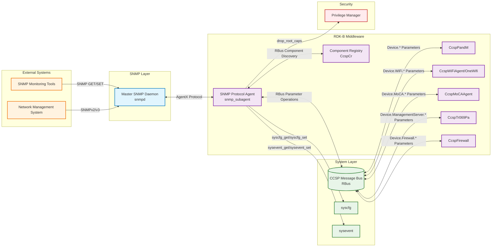
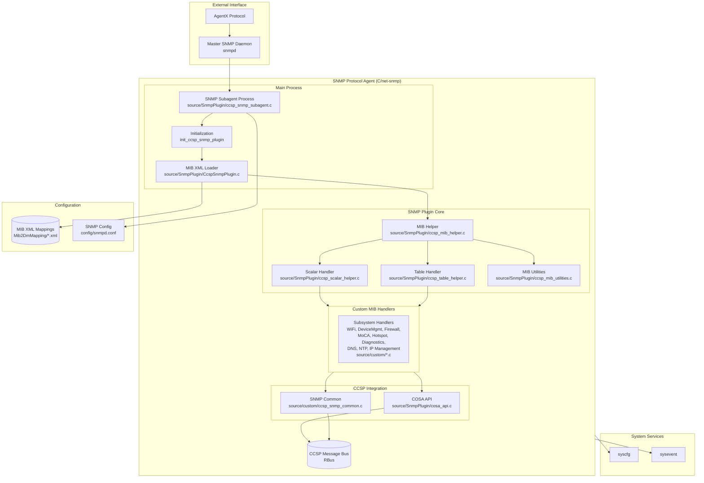
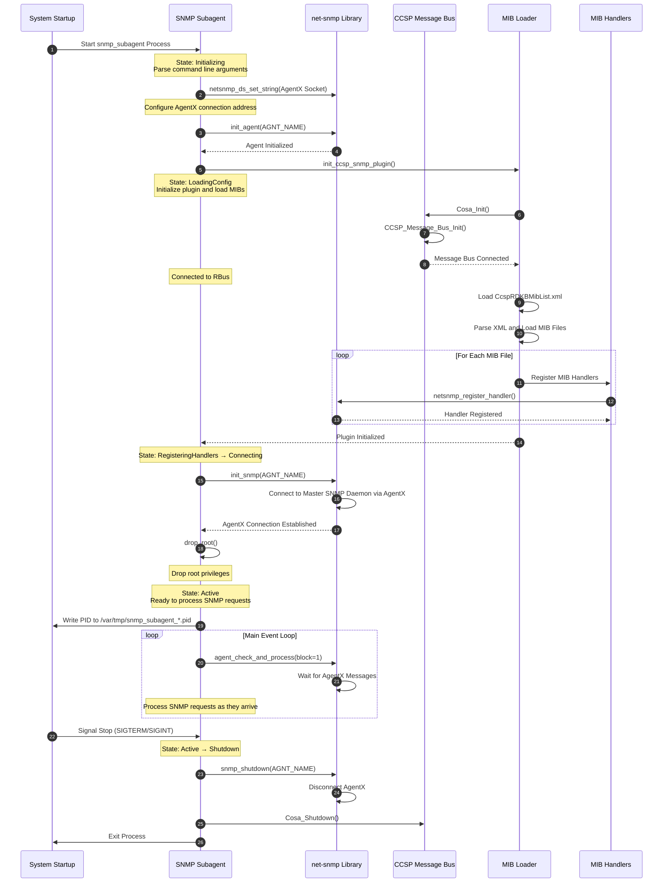
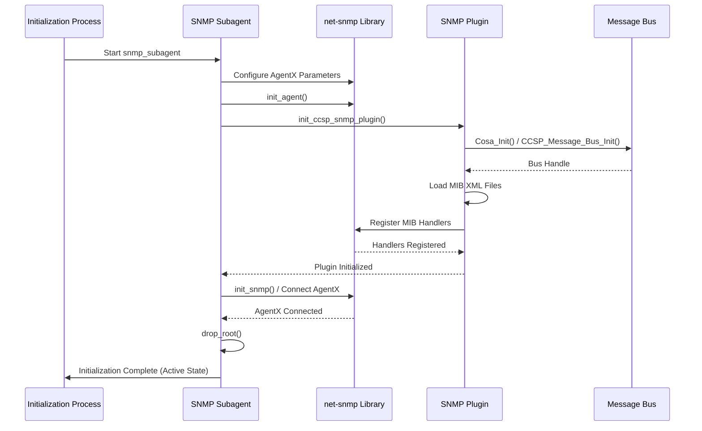
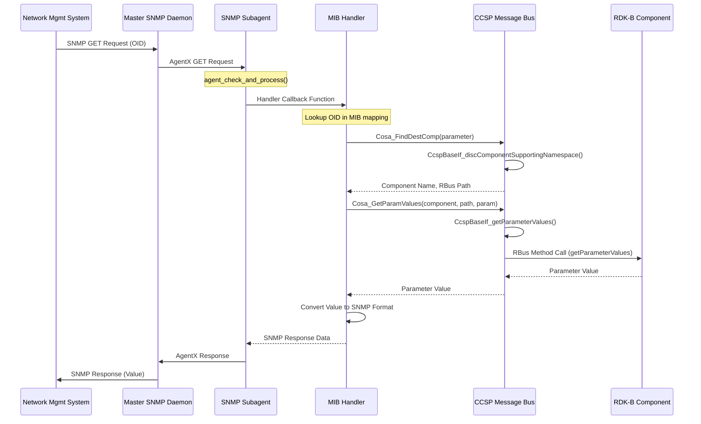
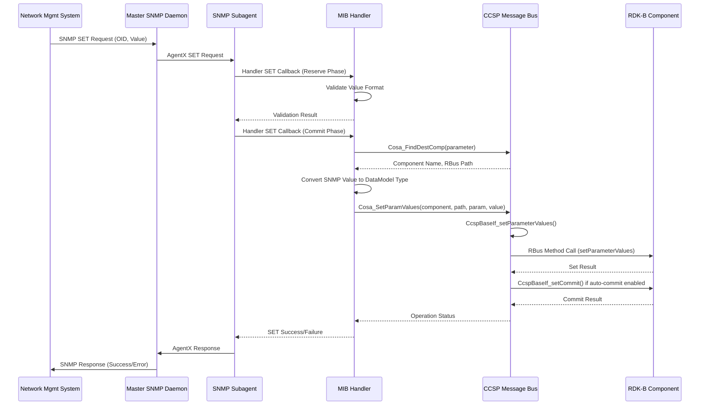
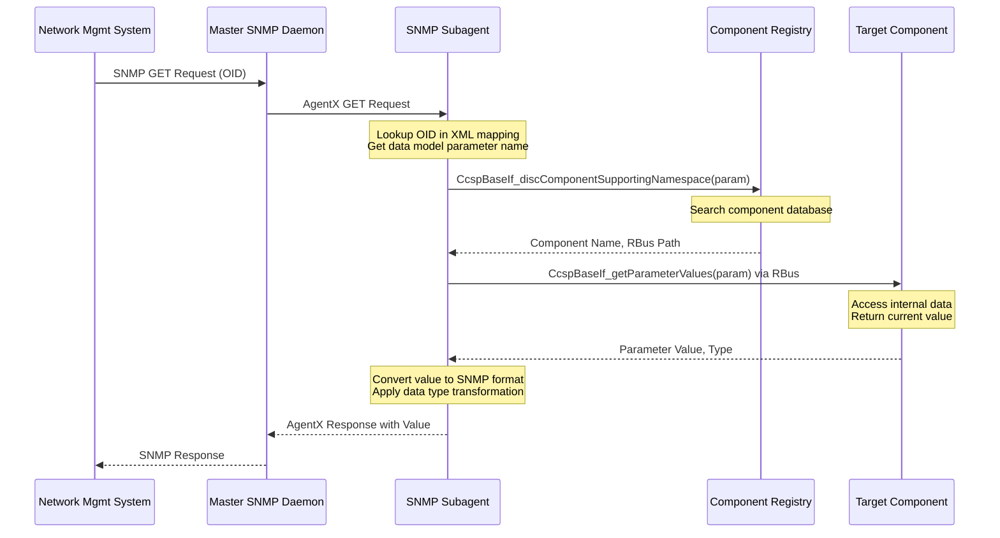
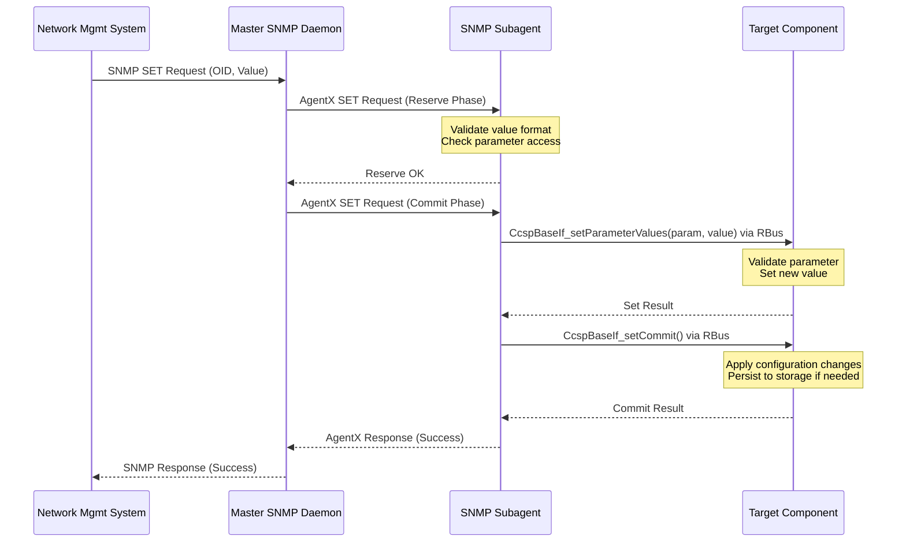
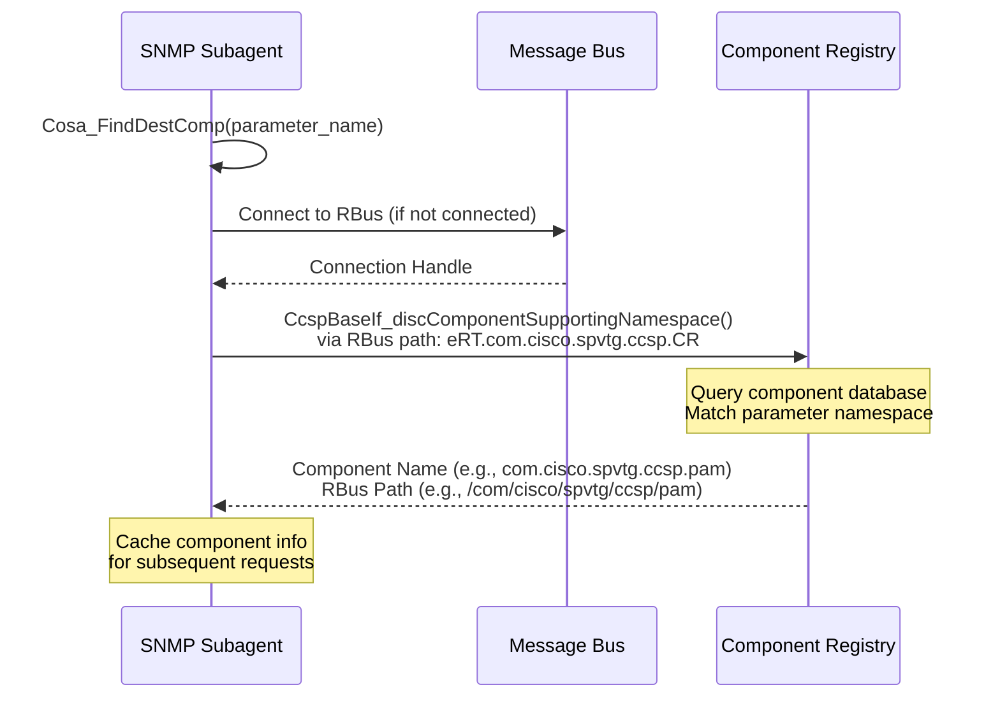

# SNMP Protocol Agent

The SNMP Protocol Agent is an RDK-B component that provides network management capabilities through the Simple Network Management Protocol. This component operates as an SNMP subagent using the AgentX protocol to communicate with a master SNMP daemon. It translates SNMP Object Identifiers (OIDs) into RDK-B data model parameters, enabling remote network management systems to monitor and configure RDK-B gateway devices through standard SNMP operations. The component supports both SNMPv2 and SNMPv3 protocols and provides comprehensive Management Information Base (MIB) implementations for various gateway subsystems.

The SNMP Protocol Agent acts as a bridge between external network management systems and the internal RDK-B middleware layer. It receives SNMP GET, SET, and GETNEXT requests from network management stations, translates these requests into corresponding data model parameter operations using the CCSP message bus, and returns responses in SNMP format. The component implements MIB-to-Data-Model mappings defined in XML configuration files, which specify the relationship between SNMP OIDs and RDK-B data model parameters across multiple subsystems including WiFi, Firewall, MoCA, Device Management, Hotspot, DNS, NTP, and TR-069.

**Key Features & Responsibilities**: 

- **SNMP Protocol Implementation**: Operates as AgentX subagent providing SNMP GET, SET, and GETNEXT operations for remote network management with support for both SNMPv2 and SNMPv3 protocols
- **MIB-to-DataModel Translation**: Implements dynamic MIB object handling by translating SNMP OIDs to RDK-B data model parameters through XML-defined mappings enabling consistent access across subsystems
- **Multi-Subsystem Coverage**: Provides MIB implementations for WiFi, Firewall, MoCA, Hotspot, Device Management, DNS, NTP, TR-069, VLAN, and vendor-specific extensions through custom handler modules
- **AgentX Protocol Support**: Integrates with master SNMP daemon via AgentX protocol enabling distributed SNMP agent architecture and supporting multiple subagents on the same device
- **Dynamic MIB Loading**: Loads MIB mapping configurations from XML files at runtime allowing flexible MIB extensions without code recompilation

## Design

The SNMP Protocol Agent follows a modular architecture designed around the net-snmp library's AgentX subagent model with clear separation between protocol handling, MIB translation, and data model access. The design emphasizes extensibility through XML-driven MIB mappings and handler-based subsystem implementations. The architecture operates in three primary layers: the SNMP protocol layer handling AgentX communication with the master daemon, the translation layer processing MIB-to-DataModel conversions through XML configurations, and the integration layer managing CCSP message bus interactions for parameter access.

The component initializes by establishing an AgentX connection to the master SNMP daemon, loading MIB mapping XML files, and registering MIB handlers for each supported subsystem. Communication with RDK-B components occurs through the CCSP message bus using the CcspBaseIf API set, which provides parameter discovery, get, set, and commit operations. The design implements caching strategies for frequently accessed parameters and supports both scalar and tabular SNMP objects with automatic instance management.

The northbound interface accepts SNMP requests via AgentX protocol on TCP port 705 (loopback, configured as `tcp:127.0.0.1:705` in ccsp_snmp_subagent.c). External SNMP requests arrive on UDP port 161; trap notifications use UDP port 162. The southbound interface uses RBus message bus for RDK-B component parameter operations and syscfg/sysevent APIs for system configuration. The component drops root capabilities after initialization via privilege manager API.

MIB mapping configurations are stored in XML files located in the Mib2DmMapping directory, with CcspRDKBMibList.xml serving as the master index. Each MIB module has a corresponding XML file specifying OID-to-parameter mappings, data types, access permissions, and handler function bindings. The component supports conditional MIB loading through XML preprocessing directives enabling feature-specific MIB definitions.

### Prerequisites and Dependencies

**Build-Time Flags and Configuration:**

| Configure Option | DISTRO Feature | Build Flag | Purpose | Default |
|------------------|----------------|------------|---------|---------|
| `--enable-unitTestDockerSupport` | N/A | `UNIT_TEST_DOCKER_SUPPORT` | Enable docker support for unit testing | Disabled |
| N/A | N/A | `RDKB_MIB` | Use RDKB-specific MIB list (CcspRDKBMibList.xml) instead of legacy | Enabled |
| N/A | rdklogger | `FEATURE_SUPPORT_RDKLOG` | Enable RDK Logger integration for logging | Platform-dependent |
| N/A | breakpad | `INCLUDE_BREAKPAD` | Enable Breakpad crash reporting | Platform-dependent |
| N/A | wan-manager | `FEATURE_RDKB_WAN_MANAGER` | Enable WAN Manager specific parameters | Platform-dependent |
| N/A | onewifi | `RDK_ONEWIFI` | Enable OneWiFi unified WiFi stack support | Platform-dependent |
| N/A | Product-specific | `_XB6_PRODUCT_REQ_` | XB6 product specific features | Platform-dependent |
| N/A | Product-specific | `_XB7_PRODUCT_REQ_` | XB7 product specific features | Platform-dependent |
| N/A | Product-specific | `_XF3_PRODUCT_REQ_` | XF3 product specific features | Platform-dependent |
| N/A | Product-specific | `_CBR_PRODUCT_REQ_` | CBR product specific features | Platform-dependent |
| N/A | wifi-ax | `_WIFI_AX_SUPPORT_` | WiFi 6 (802.11ax) support | Platform-dependent |
| N/A | puma7 | `INTEL_PUMA7` | Intel Puma7 chipset specific features | Platform-dependent |
| N/A | pcd | `USE_PCD_API_EXCEPTION_HANDLING` | PCD API exception handling | Platform-dependent |

 

**RDK-B Platform and Integration Requirements:**

* **RDK-B Components**: CcspCommonLibrary, CcspCr (Component Registry), CcspPandM, CcspWiFiAgent/OneWifi, CcspMoCAAgent, CcspTr069Pa
* **HAL Dependencies**: No direct HAL dependencies
* **Systemd Services**: Master SNMP daemon (snmpd) must be running before snmp_subagent starts
* **Message Bus**: CCSP Message Bus (RBus) registration under component name `ccsp.cisco.spvtg.ccsp.snmp` with connection to Component Registry at `eRT.com.cisco.spvtg.ccsp.CR`
* **Configuration Files**: 
  * `/tmp/ccsp_msg.cfg` for CCSP message bus configuration
  * `config/snmpd.conf` for SNMP daemon configuration
  * `mibs/*.txt` for MIB definition files
  * `libsnmp_plugin.so` for core plugin library
  * `libsnmp_custom.so` for custom handler library
  * `Mib2DmMapping/CcspRDKBMibList.xml` for MIB mapping index
  * Individual MIB mapping XML files in Mib2DmMapping directory
* **Startup Order**: Initialize after CCSP Component Registry and message bus are active
* **External Libraries**: net-snmp (libnetsnmp, libnetsnmpagent, libnetsnmpmibs), libccsp_common, libsyscfg, libsysevent, libutapi, libutctx, libsecure_wrapper, libprivilege, libprint_uptime

 

**Threading Model:** 

The SNMP Protocol Agent implements a single-threaded event-driven architecture based on the net-snmp library's main event loop. All SNMP request processing, MIB operations, and CCSP message bus interactions occur within the main thread context using the net-snmp agent event processing mechanism.

- **Threading Architecture**: Single-threaded with net-snmp event loop
- **Main Thread**: Handles AgentX protocol communication, SNMP request processing, MIB handler callbacks, and CCSP message bus synchronous calls
- **Synchronization**: No explicit synchronization required due to single-threaded design

### Component State Flow

**Initialization to Active State**

The SNMP Protocol Agent follows a sequential initialization process establishing system connections, loading configurations, and registering MIB handlers before entering the main SNMP request processing loop. The component performs argument parsing, net-snmp initialization, CCSP message bus connection, MIB mapping XML loading, and handler registration in a fixed order to ensure all dependencies are satisfied before accepting SNMP requests.

**Runtime State Changes and Context Switching**

During normal operation, the SNMP Protocol Agent remains in an active state processing incoming SNMP requests through the net-snmp event loop. State changes occur primarily in response to external events such as configuration updates, master daemon reconnection, or component restart triggers.

**State Change Triggers:**

- Master SNMP daemon restart requiring AgentX reconnection
- CCSP message bus reconnection when Component Registry or target components restart
- V2Support syscfg parameter change affecting SNMPv2 availability
- Component stop signal (SIGTERM/SIGINT) triggering graceful shutdown

**Context Switching Scenarios:**

- AgentX connection failure triggering reconnection attempts with exponential backoff
- SNMP request handling context switch from idle to active processing state
- CCSP message bus call timeout handling with parameter access retry logic

### Call Flow

**Initialization Call Flow:**

**Request Processing Call Flow:**

**SNMP SET Operation Flow:**

## Internal Modules

The SNMP Protocol Agent is organized into specialized modules separating core SNMP protocol handling, MIB translation logic, custom subsystem handlers, and CCSP integration. Each module encapsulates specific functionality with defined interfaces for inter-module communication and extension.

| Module/Class | Description | Key Files |
|-------------|------------|-----------|
| **SNMP Subagent Process** | Main executable implementing AgentX subagent protocol with master daemon communication, event loop management, privilege dropping, and process lifecycle control | `ccsp_snmp_subagent.c` |
| **SNMP Plugin Core** | Central plugin manager responsible for MIB XML loading, MIB helper object creation, handler registration coordination, and plugin lifecycle management | `CcspSnmpPlugin.c` |
| **MIB Helper Framework** | Core MIB processing framework providing OID registration, handler dispatch, caching infrastructure, and base implementation for scalar and table MIB objects | `ccsp_mib_helper.c`, `ccsp_mib_helper.h` |
| **Scalar Helper** | Implements scalar MIB object handling including GET/SET operations, value validation, type conversion, and parameter access control for single-instance OIDs | `ccsp_scalar_helper.c`, `ccsp_scalar_helper_access.c`, `ccsp_scalar_helper_control.c`, `ccsp_scalar_helper.h`, `ccsp_scalar_helper_internal.h` |
| **Table Helper** | Implements tabular MIB object handling including row enumeration, index management, table caching, and multi-instance object operations for SNMP tables | `ccsp_table_helper.c`, `ccsp_table_helper_access.c`, `ccsp_table_helper_control.c`, `ccsp_table_helper.h`, `ccsp_table_helper_internal.h` |
| **MIB Utilities** | Utility functions for OID manipulation, data type conversion, parameter name parsing, and common MIB operation helpers | `ccsp_mib_utilities.c`, `ccsp_mib_utilities.h` |
| **MIB Definitions** | Common MIB-related constants, macros, and data structure definitions shared across all MIB handlers | `ccsp_mib_definitions.h` |
| **WiFi MIB Handler** | Handles RDKB-RG-WiFi-MIB operations for wireless access point configuration, client association, security settings, and WiFi statistics with OneWiFi and legacy WiFi stack support | `rg_wifi_handler.c` |
| **Device Management Handler** | Handles RDKB-RG-MIB-DeviceMgmt operations for device information, firmware management, reboot control, configuration backup/restore, and device status monitoring | `rg_devmgmt_handler.c`, `rg_devmgmt_handler.h` |
| **Firewall MIB Handler** | Handles RDKB-RG-MIB-Firewall operations for firewall rule management, port forwarding, DMZ configuration, and security policy control | `rg_firewall_handler.c` |
| **MoCA MIB Handler** | Handles RDKB-RG-MIB-MoCA operations for MoCA interface status, node information, network topology, and MoCA performance statistics | `rg_moca_handler.c` |
| **Hotspot MIB Handler** | Handles RDKB-RG-MIB-Hotspot operations for public WiFi hotspot configuration, SSID management, client access control, and hotspot status | `rg_hotspot_handler.c` |
| **Diagnostics Handler** | Handles diagnostic MIB operations for ping tests, traceroute, device diagnostics, and network troubleshooting commands | `rg_diag_handler.c` |
| **WAN DNS Handler** | Handles RDKB-RG-MIB-WanDns operations for DNS server configuration, DNS forwarding settings, and DNS query statistics | `rg_wandns_handler.c` |
| **NTP Server Handler** | Handles RDKB-RG-MIB-NTP operations for NTP server configuration, time synchronization settings, and NTP client status | `rg_ntpserver_handler.c` |
| **IP Management Handler** | Handles IP address management MIB operations for IPv4/IPv6 addressing, DHCP client/server, and IP interface configuration | `rg_ipmgmt_handler.c` |
| **COSA API Integration** | CCSP Object Access API providing abstraction layer for component discovery, parameter get/set operations, table row operations, and commit handling through CCSP message bus | `cosa_api.c`, `cosa_api.h` |
| **SNMP Common Utilities** | Common utility functions for data model access including wrapper functions for get/set operations shared across multiple MIB handlers | `ccsp_snmp_common.c`, `ccsp_snmp_common.h` |

## Component Interactions

The SNMP Protocol Agent maintains interactions with network management systems, the master SNMP daemon, RDK-B middleware components, and system services. These interactions span multiple protocols including AgentX for SNMP communication, RBus for middleware integration, and direct API calls for system configuration access.

### Interaction Matrix

| Target Component/Layer | Interaction Purpose | Key APIs/Endpoints |
|------------------------|-------------------|------------------|
| **External Systems** |
| Network Management System | SNMP-based remote monitoring and configuration of gateway device | SNMPv2/v3 protocol via master daemon |
| Master SNMP Daemon (snmpd) | AgentX subagent protocol communication for SNMP request delegation | AgentX protocol over `tcp:127.0.0.1:705` |
| **RDK-B Middleware Components** |
| Component Registry (CcspCr) | Component discovery to locate which component owns specific data model parameters | `CcspBaseIf_discComponentSupportingNamespace()` via RBus path `eRT.com.cisco.spvtg.ccsp.CR` |
| CcspPandM | Access to Device.* parameters including device information, LAN settings, and general platform configuration | `CcspBaseIf_getParameterValues()`, `CcspBaseIf_setParameterValues()` |
| CcspWiFiAgent/OneWifi | WiFi MIB operations for access point configuration, associated devices, security settings, and wireless statistics | `Device.WiFi.*` parameters via message bus |
| CcspMoCAAgent | MoCA MIB operations for interface status, associated devices, and MoCA network topology | `Device.MoCA.*` parameters via message bus |
| CcspTr069Pa | TR-069 management server parameters for ACS connection, parameter attributes, and device provisioning | `Device.ManagementServer.*` parameters via message bus |
| CcspFirewall | Firewall MIB operations for security rules, port forwarding, and firewall configuration | `Device.Firewall.*`, `Device.NAT.*` parameters via message bus |
| CcspWanManager | WAN interface configuration and device control parameters | `Device.X_CISCO_COM_DeviceControl.*` parameters (when `FEATURE_RDKB_WAN_MANAGER` enabled) |
| **System & Platform Services** |
| CCSP Message Bus (RBus) | Primary IPC mechanism for all RDK-B component communication and data model access | `CCSP_Message_Bus_Init()`, `CcspBaseIf_*` API family |
| syscfg | Persistent configuration storage for system settings including SNMP v2 support flags | `syscfg_get()`, `syscfg_set()` |
| sysevent | Event notification system for system state changes and inter-process communication | `sysevent_get()`, `sysevent_set()` |
| Privilege Manager | Security service for dropping root privileges after initialization | `drop_root_caps()`, `init_capability()`, `update_process_caps()` |

**Events Published by SNMP Protocol Agent:**

The SNMP Protocol Agent does not publish events to other components. It operates in response mode, processing incoming SNMP requests and translating them to data model operations. State changes in RDK-B components are reflected through standard data model change notifications subscribed by management systems through SNMP traps configured in the master daemon.

### IPC Flow Patterns

**Primary IPC Flow - SNMP GET Request to Data Model Parameter:**

**IPC Flow - SNMP SET Request with Commit:**

**Component Discovery Flow:**

## Implementation Details

### Major HAL APIs Integration

The SNMP Protocol Agent does not directly integrate with HAL APIs. It operates at the middleware layer translating SNMP requests to data model parameter operations. Target RDK-B components invoked through message bus calls are responsible for HAL interactions as needed.

### Key Implementation Logic

- **MIB XML Parsing and Loading**: The component loads MIB mapping configurations at startup by parsing CcspRDKBMibList.xml to determine which MIB XML files to load, then processing each XML file to extract OID-to-parameter mappings, data types, and handler bindings using the ansc_xml_dom_parser library

  * XML parsing implementation in `source/SnmpPlugin/CcspSnmpPlugin.c` function `init_ccsp_snmp_plugin()`
  * MIB helper object creation and handler registration in `source/SnmpPlugin/ccsp_mib_helper.c`
  
- **OID Translation and Parameter Discovery**: Each SNMP request triggers OID lookup in loaded MIB mappings to identify the corresponding data model parameter, followed by component discovery through the Component Registry to determine which RDK-B component owns that parameter

  * OID-to-parameter mapping lookup in `source/SnmpPlugin/ccsp_mib_utilities.c`
  * Component discovery implementation in `source/SnmpPlugin/cosa_api.c` function `Cosa_FindDestComp()`
  * Caching of component discovery results to minimize registry queries
  
- **Data Type Conversion**: The component implements bidirectional conversion between SNMP data types (INTEGER, OCTET_STR, IPADDRESS, COUNTER, GAUGE, TIMETICKS) and data model types (string, int, unsignedInt, boolean, dateTime, base64) ensuring proper value representation

  * Type conversion logic in `source/SnmpPlugin/ccsp_mib_utilities.c` and `source/SnmpPlugin/ccsp_scalar_helper.c`
  * Special handling for complex types like MAC addresses, IP addresses, and enumerations
  
- **Error Handling Strategy**: SNMP error codes are generated based on CCSP message bus operation results with proper mapping of CCSP error codes to SNMP error codes (noError, noSuchName, badValue, genErr, noAccess)

  * Error mapping implementation in MIB helper functions
  * Timeout handling for message bus calls with configurable retry
  * Fallback to default values when parameter access fails for read operations
  
- **Logging & Debugging**: The component uses RDK Logger when available, falling back to AnscTrace logging for development builds with configurable log levels through CCSPDBG environment variable

  * Logger initialization in `source/SnmpPlugin/CcspSnmpPlugin.c` using `RDK_LOGGER_INIT()`
  * Debug level configuration in `set_debug_level()` function
  * net-snmp debug token registration for protocol-level debugging
  
- **Privilege Management**: After initialization and AgentX connection establishment, the component drops root privileges using the privilege manager API retaining only necessary capabilities for operation

  * Privilege dropping implementation in `source/SnmpPlugin/ccsp_snmp_subagent.c` function `drop_root()`
  * Capability configuration through privilege manager library

### Key Configuration Files

| Configuration File | Purpose | Override Mechanisms |
|--------------------|---------|---------------------|
| `config/snmpd.conf` | Master SNMP daemon configuration including community strings, AgentX settings, and plugin loading directives | System integrator configuration |
| `/tmp/ccsp_msg.cfg` | CCSP message bus configuration specifying component names, RBus paths, and subsystem prefixes | Copied from `/usr/ccsp/ccsp_msg.cfg` at startup |
| `Mib2DmMapping/CcspRDKBMibList.xml` | Master index of MIB mapping XML files to be loaded by the plugin | Build-time selection between CcspRDKBMibList.xml and CcspMibList.xml via RDKB_MIB flag |
| `Mib2DmMapping/Ccsp_RDKB-RG-WiFi-MIB.xml` | MIB-to-DataModel mapping for WiFi subsystem including access point and associated device parameters | XML preprocessing directives for feature-specific includes |
| `Mib2DmMapping/Ccsp_RDKB-RG-MIB-DeviceMgmt.xml` | MIB-to-DataModel mapping for device management operations including reboot, reset, and firmware management | Platform-specific parameter mappings |
| `Mib2DmMapping/Ccsp_RDKB-RG-MIB-Firewall.xml` | MIB-to-DataModel mapping for firewall configuration and port forwarding rules | Security feature flag conditionals |
| `Mib2DmMapping/Ccsp_RDKB-RG-MIB-MoCA.xml` | MIB-to-DataModel mapping for MoCA interface status and network topology | MoCA availability conditionals |
| `Mib2DmMapping/Ccsp_RDKB-RG-MIB-Hotspot.xml` | MIB-to-DataModel mapping for public WiFi hotspot configuration and management | Hotspot feature flag conditionals |
| `/var/tmp/snmp_subagent_v2.pid` | Process ID file for SNMPv2 subagent instance | Generated at runtime |
| `/var/tmp/snmp_subagent_v3.pid` | Process ID file for SNMPv3 subagent instance | Generated at runtime |
