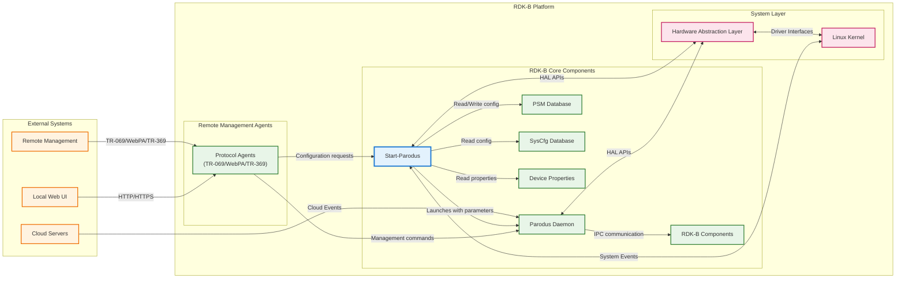
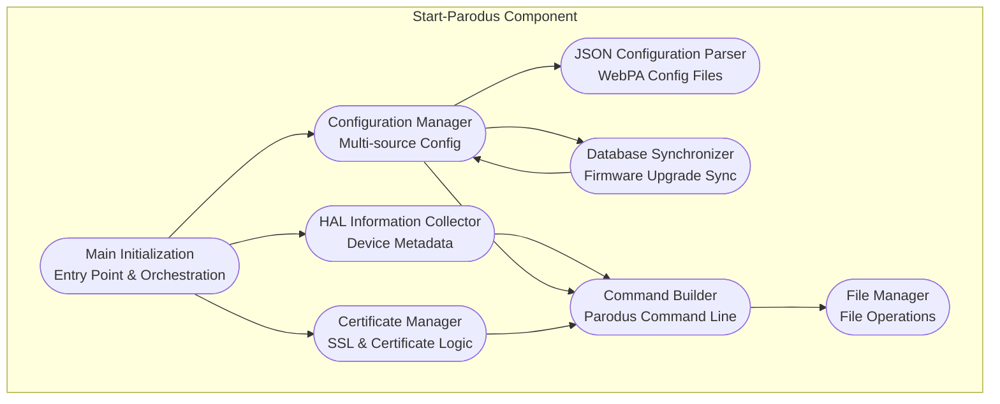
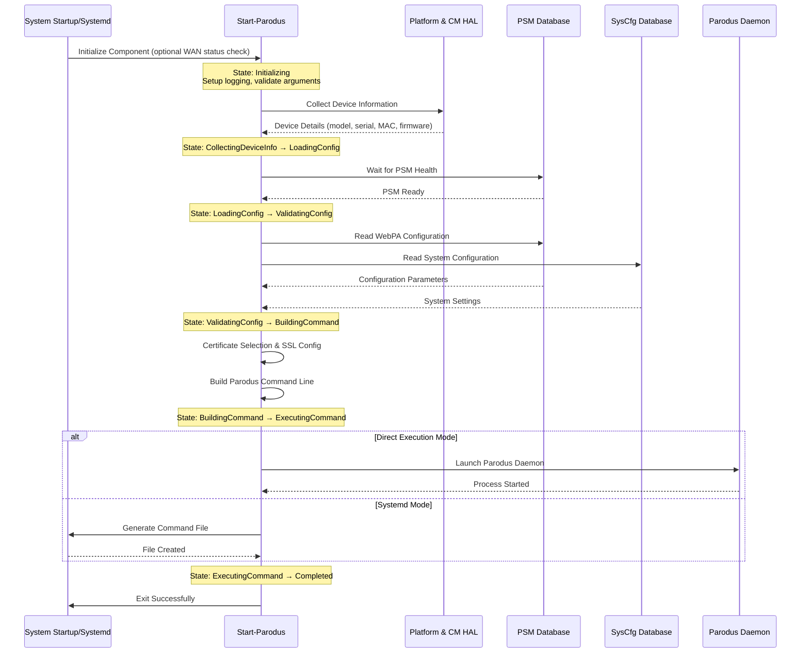
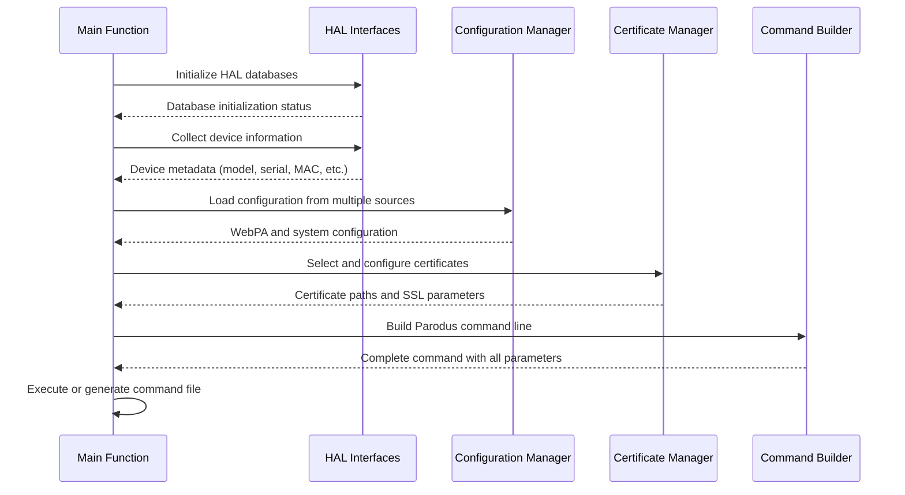
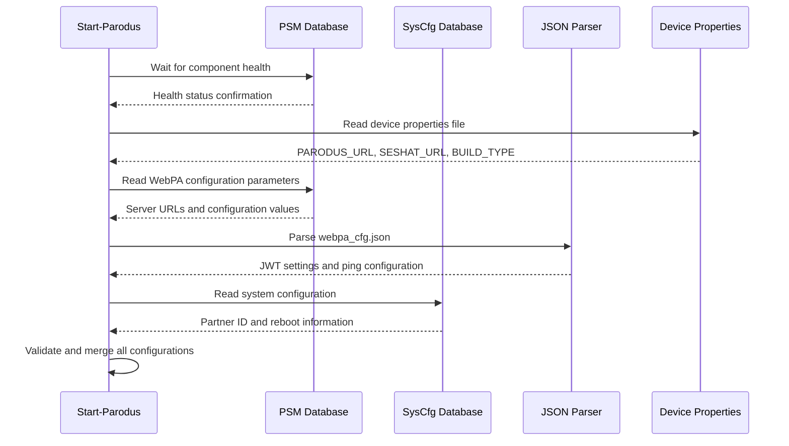
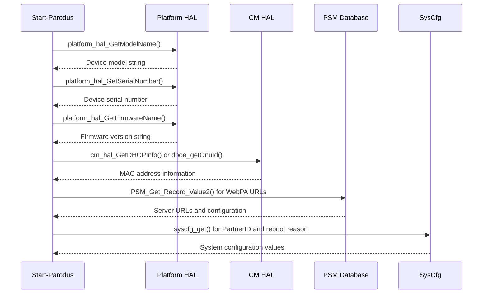
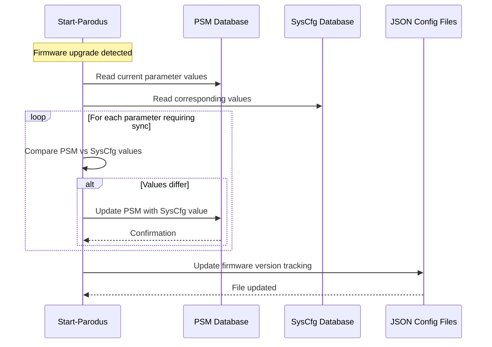

# Start-Parodus Documentation

The Start-Parodus component provides a critical initialization and startup utility for the Parodus daemon, which is a key communication bridge between RDK-B middleware components and cloud management systems. This component serves as the pre-execution configuration and launch mechanism that ensures Parodus starts with appropriate device-specific parameters, security certificates, and network configuration. Start-Parodus acts as the orchestrator that gathers all necessary device information from HAL APIs, configuration databases, and device properties files, then constructs and executes the Parodus daemon with the complete parameter set required for secure cloud connectivity and device management operations in the RDK-B ecosystem.

```mermaid
graph TD
    subgraph "Cloud Management Systems"
        Cloud[Cloud Management Platform]
        WebPA[WebPA Server]
        JWT[JWT Token Server]
    end

    subgraph "RDK-B Middleware Layer"
        StartParodus[Start-Parodus]
        Parodus[Parodus Daemon]
        PSM[PSM Database]
        Sysevent[Sysevent]
        Components[RDK-B Components]
    end

    subgraph "HAL/Platform Layer"
        PlatformHAL[Platform HAL]
        CMHAL[CM HAL]
        SysCfg[SysCfg Database]
        DeviceProps[Device Properties]
    end

    subgraph "System Layer"
        Systemd[Systemd Service]
        Network[Network Interface]
        Certificates[SSL Certificates]
    end

    %% External interactions
    Cloud -->|Cloud Commands/Events| Parodus
    Parodus -->|Device Status/Telemetry| Cloud
    WebPA -->|Configuration Updates| Parodus
    JWT -->|Authentication Tokens| Parodus

    %% Start-Parodus orchestration
    StartParodus -->|Launches with parameters| Parodus
    StartParodus <-->|Read device info| PlatformHAL
    StartParodus <-->|Read network info| CMHAL
    StartParodus <-->|Read/Write config| PSM
    StartParodus <-->|Read config| SysCfg
    StartParodus <-->|Read properties| DeviceProps
    StartParodus -->|Generate command file| Systemd

    %% Parodus runtime interactions
    Parodus <-->|Event notifications| Sysevent
    Parodus <-->|IPC communication| Components
    Parodus -->|Network communication| Network
    Parodus -->|SSL/TLS authentication| Certificates

    classDef cloud fill:#fff3e0,stroke:#ef6c00,stroke-width:2px;
    classDef middleware fill:#e1f5fe,stroke:#0277bd,stroke-width:2px;
    classDef hal fill:#e8f5e8,stroke:#2e7d32,stroke-width:2px;
    classDef system fill:#fce4ec,stroke:#c2185b,stroke-width:2px;

    class Cloud,WebPA,JWT cloud;
    class StartParodus,Parodus,PSM,Sysevent,Components middleware;
    class PlatformHAL,CMHAL,SysCfg,DeviceProps hal;
    class Systemd,Network,Certificates system;
```

**Key Features & Responsibilities**: 

- **Device Information Collection**: Gathers comprehensive device metadata including model name, serial number, firmware version, manufacturer information, MAC addresses, and hardware-specific identifiers from Platform HAL and CM HAL interfaces
- **Configuration Management**: Retrieves and validates device configuration parameters from multiple sources including PSM database, SysCfg database, device properties files, and JSON configuration files to ensure proper Parodus initialization
- **Security Certificate Management**: Implements dynamic certificate selection logic supporting SE (Secure Element), Dynamic xPKI, and Static certificate types with proper SSL engine configuration and reference management
- **Network Interface Detection**: Dynamically determines the appropriate network interface for WebPA communication, supporting WAN failover scenarios and configurable WAN interfaces through sysevent monitoring
- **Command Generation & Execution**: Constructs comprehensive Parodus daemon command line with all required parameters and either executes directly or generates command files for systemd service management
- **Database Synchronization**: Performs parameter synchronization between PSM and SysCfg databases during firmware upgrades to maintain configuration consistency across system updates
- **Health Monitoring Integration**: Implements PSM component health monitoring and boot time retry mechanisms to ensure reliable startup sequencing in the RDK-B middleware stack

## Design

The Start-Parodus component follows a sequential initialization pattern designed to collect, validate, and configure all necessary parameters before launching the Parodus daemon. The design prioritizes reliability and flexibility, supporting multiple hardware platforms, certificate types, and configuration sources. The architecture ensures that Parodus starts only when all dependencies are satisfied and the system is in a stable state ready for cloud connectivity. The component implements robust error handling and recovery mechanisms to handle various failure scenarios during device startup.

The design integrates tightly with the RDK-B middleware architecture by leveraging standardized HAL interfaces for hardware abstraction, PSM/SysCfg for persistent configuration storage, and sysevent for real-time system state monitoring. The component follows the principle of separation of concerns by focusing solely on pre-execution configuration while delegating the actual cloud communication responsibilities to the Parodus daemon it launches. This design ensures maintainability and allows for independent updates of configuration logic and communication protocols.

The initialization process is structured as a dependency-aware sequence that waits for critical system components (particularly PSM) to become healthy before proceeding. The component supports both immediate execution and systemd-managed execution modes, providing flexibility for different deployment scenarios. The design also incorporates platform-specific variations to handle differences in certificate management, network interface detection, and hardware identification across various RDK-B device types.

```mermaid
graph TD
    subgraph "Start-Parodus Container (C Application)"
        subgraph "Initialization Module"
            IM[Main Initialization]
            HAL[HAL Information Collector]
            noteIM["Purpose: Orchestrates startup sequence and command line argument processing including WAN status validation."]
            noteHAL["Purpose: Collects device-specific information from Platform HAL and CM HAL interfaces."]
        end

        subgraph "Configuration Module"
            CFG[Configuration Manager]
            JSON[JSON Configuration Parser]
            noteCFG["Purpose: Manages configuration retrieval from PSM, SysCfg, and device properties sources."]
            noteJSON["Purpose: Parses and validates WebPA configuration JSON files and handles malformed JSON recovery."]
        end

        subgraph "Security Module"
            CERT[Certificate Manager]
            SSL[SSL Configuration]
            noteCERT["Purpose: Implements certificate selection logic for SE, Dynamic xPKI, and Static certificates."]
            noteSSL["Purpose: Configures SSL engine parameters and certificate reference management."]
        end

        subgraph "Command Module"
            CMD[Command Builder]
            FILE[File Manager]
            noteCMD["Purpose: Constructs Parodus daemon command line with all required parameters and feature flags."]
            noteFILE["Purpose: Manages command file generation and logging operations."]
        end

        subgraph "Database Module"
            PSM[PSM Interface]
            SYSCFG[SysCfg Interface]
            SYNC[DB Synchronizer]
            notePSM["Purpose: Handles PSM database operations for persistent WebPA configuration parameters."]
            noteSYSCFG["Purpose: Manages SysCfg database operations for device configuration and reboot tracking."]
            noteSYNC["Purpose: Performs database synchronization during firmware upgrades and parameter migration."]
        end
    end

    subgraph "External Dependencies"
        HALLayer[Platform & CM HAL]
        SystemD[Systemd Service]
        ParodusDaemon[Parodus Daemon Process]
    end

    %% Internal module interactions
    IM --> HAL
    IM --> CFG
    CFG --> JSON
    CFG --> PSM
    CFG --> SYSCFG
    IM --> CERT
    CERT --> SSL
    IM --> CMD
    CMD --> FILE
    IM --> SYNC
    SYNC --> PSM
    SYNC --> SYSCFG

    %% External interactions
    HAL <-->|HAL API Calls| HALLayer
    FILE -->|Generate command file| SystemD
    CMD -->|Direct execution| ParodusDaemon
```

### Prerequisites and Dependencies

**Build-Time Flags and Configuration:**

| Configure Option | DISTRO Feature | Build Flag | Purpose | Default |
|------------------|----------------|------------|---------|---------|
| `--enable-unitTestDockerSupport` | N/A | `UNIT_TEST_DOCKER_SUPPORT` | Enable docker support for unit testing environment | Disabled |
| `--with-ccsp-arch=arm` | N/A | `CCSP_ARCH_ARM` | ARM architecture support with Platform HAL integration | Enabled for ARM builds |
| `--with-ccsp-arch=mips` | N/A | `CCSP_ARCH_MIPS` | MIPS architecture support with DPOE HAL integration | Enabled for MIPS builds |
| `--with-ccsp-arch=atom` | N/A | `CCSP_ARCH_ATOM` | Intel Atom architecture support | Enabled for Atom builds |
| `--with-ccsp-arch=pc` | N/A | `CCSP_ARCH_PC` | PC/x86 architecture support | Enabled for PC builds |
| N/A | `safec` | `SAFEC_DUMMY_API` (when disabled) | SafeC library integration for secure string operations | SafeC enabled by default |
| N/A | `seshat` | `ENABLE_SESHAT` | Seshat service discovery integration for cloud connectivity | Disabled by default |
| N/A | `WanFailOverSupportEnable` | `WAN_FAILOVER_SUPPORTED` | WAN interface failover support for redundant connectivity | Disabled by default |
| N/A | `webconfig_bin` | `ENABLE_WEBCFGBIN` | WebConfig binary support for configuration management | Disabled by default |
| N/A | N/A | `FEATURE_DNS_QUERY` | DNS query support for service discovery | Enabled by default |
| N/A | N/A | `START_PARODUS` | Enable actual Parodus daemon execution (vs command file generation) | Enabled by default |
| N/A | N/A | `UPDATE_CONFIG_FILE` | Enable configuration file update and event handling | Conditionally enabled |
| N/A | N/A | `INCLUDE_BREAKPAD` | Breakpad crash reporting integration | Optionally enabled |

 

**RDK-B Platform and Integration Requirements**

- **RDK-B Components**: PSM (Parameter System Manager) component must be running and healthy before Start-Parodus execution
- **HAL Dependencies**: Platform HAL interface (minimum version supporting GetModelName, GetSerialNumber, GetFirmwareName), CM HAL interface for MAC address retrieval (non-MIPS platforms), DPOE HAL for ONU identification (MIPS platforms only)
- **Systemd Services**: No hard systemd dependencies in BASE mode, optional systemd service integration for TCCBR/SYSTEMD deployment modes
- **Message Bus**: No direct RBus dependency - operates as standalone utility that launches Parodus which handles RBus communication
- **Configuration Files**: /etc/device.properties (mandatory), /nvram/webpa_cfg.json (optional), /nvram/parodus_cfg.json (optional)
- **Startup Order**: Must execute after network interface initialization and before Parodus service startup, requires PSM component health validation

**Threading Model** 

The Start-Parodus component implements a single-threaded synchronous execution model designed for one-time startup operations. The component follows a linear execution flow from initialization through configuration collection to command generation and execution.

- **Threading Architecture**: Single-threaded application with synchronous operations
- **Main Thread**: Handles all operations including HAL calls, database interactions, file operations, and command execution
- **Synchronization**: No internal threading synchronization required due to single-threaded nature
- **Blocking Operations**: Uses synchronous HAL calls, database queries, and file I/O operations with appropriate error handling

### Component State Flow

**Initialization to Active State**

The Start-Parodus component follows a linear state progression from system startup through configuration collection to Parodus daemon launch. The component implements validation checkpoints and error handling at each stage to ensure reliable operation.

**Runtime State Changes and Context Switching**

The Start-Parodus component does not maintain runtime state after completion as it operates as a one-time initialization utility. However, it supports different execution contexts based on command line arguments and system configuration.

**State Change Triggers:**

- WAN status events trigger conditional execution when invoked with "wan-status" argument
- PSM component health status affects progression to configuration loading phase
- Certificate availability determines SSL configuration context
- Database synchronization requirements trigger firmware upgrade handling

**Context Switching Scenarios:**

- Platform-specific certificate handling (SE vs Dynamic vs Static xPKI certificates)
- Network interface selection based on WAN failover configuration
- Feature flag-based command generation (Seshat, DNS query, JWT acquisition features)
- Recovery mode handling for malformed JSON configuration files

### Call Flow

**Initialization Call Flow:**

**Configuration Processing Call Flow:**

## Internal Modules

The Start-Parodus component consists of several internal modules that handle specific aspects of the initialization and configuration process. Each module is responsible for a distinct functionality area while maintaining clear interfaces for integration.

| Module/Class | Description | Key Files |
|-------------|------------|-----------|
| **Main Initialization** | Core application entry point handling command line processing, WAN status validation, and overall execution orchestration | `start_parodus.c (main function)` |
| **HAL Information Collector** | Interfaces with Platform HAL and CM HAL to collect device-specific information including model name, serial number, firmware version, and MAC addresses | `start_parodus.c (platform_hal_* and cm_hal_* functions)` |
| **Configuration Manager** | Manages configuration retrieval from PSM database, SysCfg database, device properties files, and JSON configuration files with validation and error handling | `start_parodus.c (getValuesFromPsmDb, getValuesFromSysCfgDb, get_url functions)` |
| **JSON Configuration Parser** | Handles parsing and validation of WebPA JSON configuration files with recovery mechanisms for malformed JSON and automatic correction capabilities | `start_parodus.c (getValueFromCfgJson, writeToJson functions)` |
| **Certificate Manager** | Implements certificate selection logic supporting SE (Secure Element), Dynamic xPKI, and Static certificate types with SSL engine configuration | `start_parodus.c (getDeviceConfigFile, getSECertSupport functions)` |
| **Command Builder** | Constructs comprehensive Parodus daemon command line arguments based on collected configuration, feature flags, and platform-specific requirements | `start_parodus.c (sprintf_s command construction sections)` |
| **Database Synchronizer** | Performs parameter synchronization between PSM and SysCfg databases during firmware upgrades to maintain configuration consistency | `start_parodus.c (syncXpcParamsOnUpgrade, waitForPSMHealth functions)` |
| **File Manager** | Handles file operations including command file generation, logging setup, and configuration file access with proper error handling | `start_parodus.c (addParodusCmdToFile, get_parodusStart_logFile functions)` |

## Component Interactions

The Start-Parodus component interacts extensively with HAL interfaces, configuration databases, and system services to collect the necessary information for Parodus daemon initialization. The component serves as a bridge between low-level hardware/system information and the high-level Parodus configuration requirements.

### Interaction Matrix

This consolidated table provides component interactions with their purposes and key APIs/endpoints:

| Target Component/Layer | Interaction Purpose | Key APIs/Endpoints |
|------------------------|-------------------|------------------|
| **RDK-B Middleware Components** |
| PSM Database | Configuration parameter storage and retrieval, firmware upgrade synchronization | `PSM_Get_Record_Value2()`, `PSM_Set_Record_Value2()` |
| SysCfg Database | System configuration and reboot reason tracking | `syscfg_get()`, `syscfg_set()` |
| Sysevent | Network interface status monitoring and WAN failover support | `sysevent_get()` for current_wan_ifname |
| **System & HAL Layers** |
| Platform HAL | Hardware identification and device metadata collection | `platform_hal_GetModelName()`, `platform_hal_GetSerialNumber()`, `platform_hal_GetFirmwareName()` |
| CM HAL | Cable modem and network interface information | `cm_hal_GetDHCPInfo()` for MAC address retrieval |
| DPOE HAL (MIPS) | DOCSIS provisioning and ONU identification | `dpoe_getOnuId()` for MIPS platform MAC addresses |
| **Configuration Files** |
| Device Properties | System configuration and URL definitions | File path: `/etc/device.properties` with PARODUS_URL, SESHAT_URL, BUILD_TYPE |
| WebPA Config JSON | WebPA-specific configuration and JWT settings | File path: `/nvram/webpa_cfg.json` with server URLs and authentication settings |

**Events Published by Start-Parodus:**

Start-Parodus operates as a one-time initialization utility and does not publish runtime events. However, it generates the following outputs:

| Output Type | Output Path/Method | Trigger Condition | Consumer Components |
|------------|-----------------|-------------------|---------------------|
| Command File | `/tmp/parodusCmd.cmd` | Successful command generation | Systemd service, manual execution scripts |
| Log Output | `/rdklogs/logs/parodusStart_log.txt` | All execution phases | Log aggregation systems, debugging tools |
| Process Launch | Direct process execution | START_PARODUS compile flag enabled | Parodus daemon as child process |

### IPC Flow Patterns

**Primary Configuration Flow - Device Information Collection:**

**Configuration Synchronization Flow:**

## Implementation Details

### Major HAL APIs Integration

The Start-Parodus component integrates with multiple HAL layers to collect comprehensive device information required for Parodus initialization. The HAL integration follows platform-specific patterns to accommodate hardware differences across RDK-B device types.

**Core HAL APIs:**

| HAL API | Purpose | Implementation File |
|---------|---------|-------------------|
| `platform_hal_PandMDBInit()` | Initialize Platform HAL database connections | `start_parodus.c` |
| `platform_hal_GetModelName()` | Retrieve device model name for cloud identification | `start_parodus.c` |
| `platform_hal_GetSerialNumber()` | Retrieve device serial number for unique identification | `start_parodus.c` |
| `platform_hal_GetFirmwareName()` | Retrieve firmware version for cloud communication | `start_parodus.c` |
| `cm_hal_InitDB()` | Initialize Cable Modem HAL database | `start_parodus.c` |
| `cm_hal_GetDHCPInfo()` | Retrieve MAC address and network information (non-MIPS) | `start_parodus.c` |
| `dpoe_getOnuId()` | Retrieve ONU MAC address for MIPS platforms | `start_parodus.c` |

### Key Implementation Logic

- **Configuration Collection Engine**: The core implementation follows a multi-source configuration collection pattern implemented in the main function. Configuration sources are prioritized with device properties files providing base URLs, PSM database providing cloud-specific parameters, and JSON files providing WebPA-specific settings. The implementation includes validation and fallback mechanisms for missing or invalid configuration data.
     - Main configuration logic in `start_parodus.c` main function (lines 160-900)
     - Database interaction functions: `getValuesFromPsmDb()`, `getValuesFromSysCfgDb()`, `getWebpaValuesFromPsmDb()`
     - File parsing functions: `get_url()`, `getValueFromCfgJson()`

- **Certificate Management Logic**: The component implements sophisticated certificate selection logic supporting multiple certificate types and SSL engines. The implementation prioritizes SE (Secure Element) certificates for enhanced security, falls back to dynamic xPKI certificates, and uses static certificates as a last resort.
     - Certificate detection logic in `getDeviceConfigFile()` function
     - SE certificate support validation in `getSECertSupport()` function
     - SSL engine configuration based on certificate type selection

- **Command Line Construction**: The implementation uses feature flag-based conditional compilation to construct appropriate Parodus command lines based on platform capabilities and enabled features. The command construction accounts for Seshat integration, DNS query support, JWT acquisition, and WebCfg binary support.
     - Command building logic in main function using multiple `sprintf_s()` calls with conditional compilation blocks
     - Feature detection and parameter inclusion based on compile-time flags
     - Platform-specific parameter handling for different hardware architectures

- **Error Handling Strategy**: The implementation follows defensive programming practices with comprehensive error checking at each stage of execution. HAL API failures are logged but do not necessarily terminate execution, allowing graceful degradation when possible.
     - HAL error code validation and logging throughout device information collection
     - Database operation error handling with retry mechanisms for critical parameters
     - File operation validation with fallback to default values when appropriate
     - Memory allocation failure handling with proper cleanup and error reporting

- **Logging & Debugging**: The component implements structured logging with timestamp formatting and module identification. Debug information includes all collected parameters, command line construction details, and execution status for troubleshooting startup issues.
     - Custom logging implementation in `_START_LOG()` function with level-based output
     - Comprehensive parameter logging for all collected device and configuration information
     - Command line logging before execution for startup debugging
     - File operation status logging for configuration validation

### Key Configuration Files

The Start-Parodus component relies on multiple configuration files that provide different aspects of the overall configuration required for Parodus initialization.

| Configuration File | Purpose | Override Mechanisms |
|--------------------|---------|--------------------|
| `/etc/device.properties` | Primary device configuration containing Parodus URL, Seshat URL, build type, and other device-specific parameters | No override mechanism - considered authoritative device configuration |
| `/nvram/webpa_cfg.json` | WebPA-specific configuration including JWT acquisition settings, ping timeouts, and server-specific parameters | Can be programmatically updated by Start-Parodus with JSON correction logic |
| `/nvram/parodus_cfg.json` | CRUD configuration file referenced by Parodus for runtime parameter management | Managed by Parodus runtime - Start-Parodus provides path reference only |
| PSM Database | Persistent parameter storage for WebPA server URLs, token server URLs, and DNS text URLs | PSM parameter management APIs, WebPA cloud configuration updates |
| SysCfg Database | System-level configuration including PartnerID, reboot tracking, and device-specific settings | SysCfg CLI tools, factory reset procedures, manual configuration |