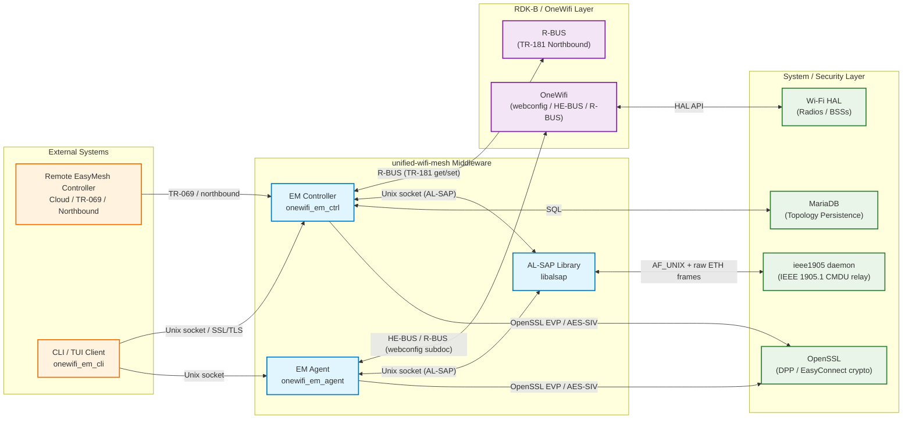
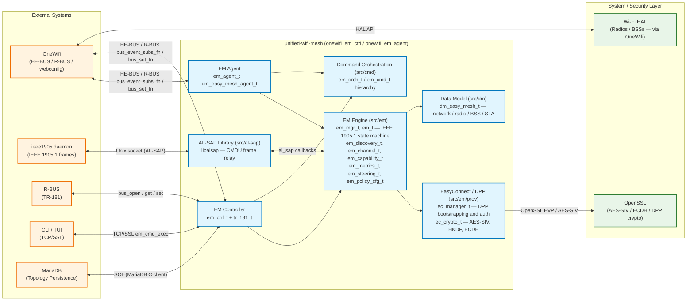
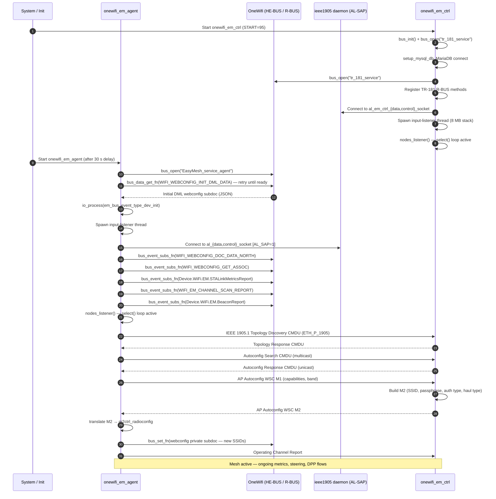
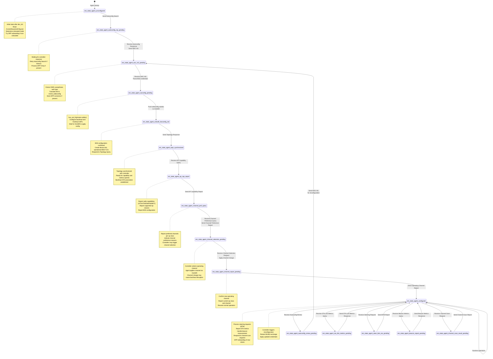
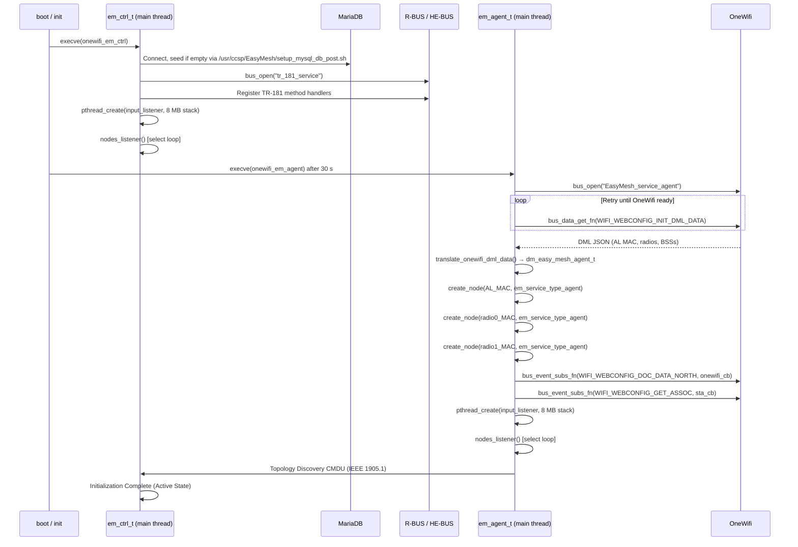
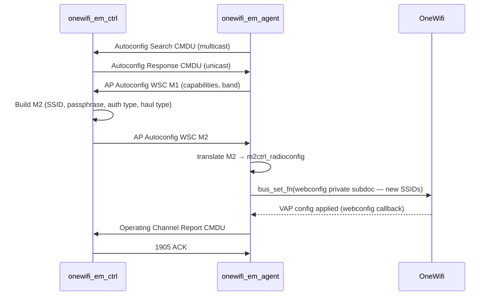
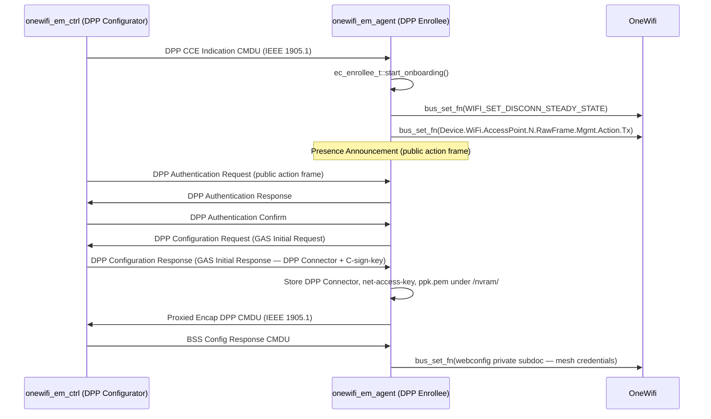
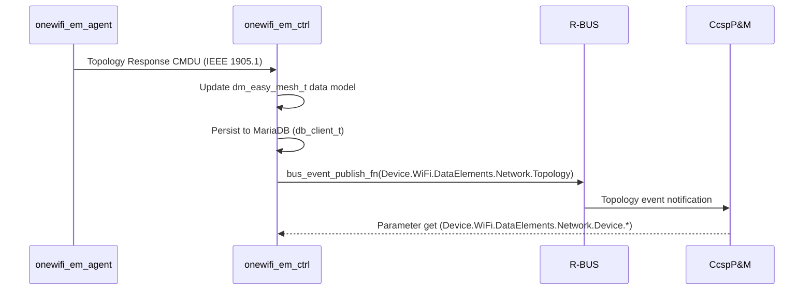
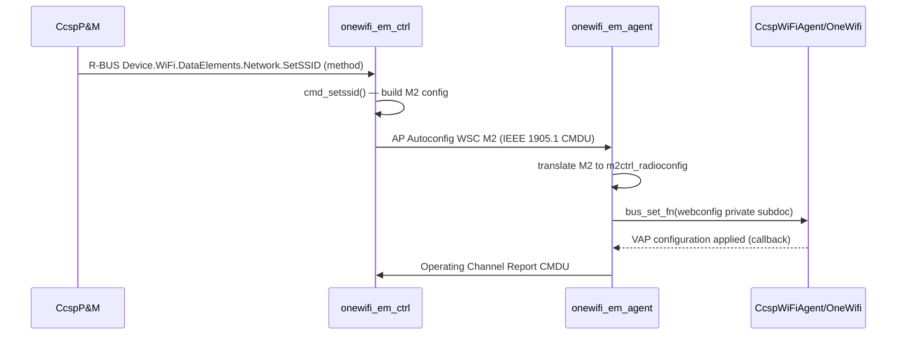

# unified-wifi-mesh

unified-wifi-mesh is the RDK-B component that implements the Wi-Fi EasyMesh (Multi-AP) specification, providing centralized management of a Wi-Fi mesh network across multiple access points. The component delivers two co-deployable daemons — `onewifi_em_ctrl` (the EasyMesh controller) and `onewifi_em_agent` (the EasyMesh agent) — that together orchestrate topology discovery, radio configuration, channel management, client steering, and secure device onboarding across all nodes in a mesh network. Communication between the controller and agent nodes is carried over IEEE 1905.1 CMDU frames, with the AL-SAP (`libalsap`) library bridging to a separate `ieee1905` daemon for frame relay. The component integrates with OneWifi via R-BUS and exposes a TR-181-compliant northbound interface over R-BUS.

At the device level, unified-wifi-mesh drives the automated provisioning of backhaul and fronthaul SSIDs across EasyMesh agents, reports network topology and radio metrics to higher-layer management systems, and executes policy-controlled client steering. At the module level, the component decomposes into a shared EM engine (`src/em`), platform-specific agent and controller adaptors, an EasyConnect (DPP) provisioning sub-library, a command orchestration framework, a data model manager, and a MariaDB persistence layer.



**Key Features & Responsibilities**:

- **EasyMesh Controller (`onewifi_em_ctrl`)**: Manages the full Multi-AP network: drives topology discovery via IEEE 1905.1 CMDU messages, distributes radio and BSS configuration to agents, executes channel selection, collects AP and STA link metrics, and implements MAP policy configuration
- **EasyMesh Agent (`onewifi_em_agent`)**: Runs on each access point node; handles all agent-side IEEE 1905.1 flows including autoconfiguration, capability reporting, channel preference/selection, client association tracking, BTM-based steering, and beacon/scan reports
- **DPP / EasyConnect Onboarding**: Implements Wi-Fi EasyMesh DPP bootstrapping and provisioning flows (`ec_configurator`, `ec_enrollee`, `ec_manager`), including GAS and WFA action-frame exchange, AES-SIV encryption, and 1905-layer securing under the `ENABLE_COLOCATED_1905_SECURE` path
- **AL-SAP Integration (`libalsap`)**: IEEE 1905.1 Abstract Layer Service Access Point library that offloads raw CMDU frame relay to a co-running `ieee1905` daemon over Unix domain sockets
- **TR-181 Data Model Interface**: Controller exposes a TR-181 Wi-Fi EasyMesh data model (`src/ctrl/tr_181`) over R-BUS, enabling data-model-driven configuration and topology queries via `Network.Device.*` objects
- **Network Optimiser (`onewifi_em_network_optimser`)**: Standalone optimisation process that consumes topology and metrics data to drive channel, band, and steering decisions via R-BUS/HE-BUS
- **Data Model & Persistence**: Shared `dm_easy_mesh_t` hierarchy covering network, device, radio, BSS, STA, op-class, policy, scan result, CAC, AP-MLD, BSTA-MLD, and TID-to-link objects; controller-side state is persisted to MariaDB for recovery across restarts
- **Command Orchestration Framework**: Type-safe command objects (`em_cmd_*`) submitted to an orchestrator (`em_orch_t`) that serialises and tracks multi-step protocol exchanges across concurrent EM radio threads

## Design


unified-wifi-mesh is structured around a shared codebase that is compiled into both the controller and agent binaries. The shared modules include the EM engine (`src/em`), command orchestration framework (`src/cmd`), data model layer (`src/dm`), base orchestrator (`src/orch/em_orch.cpp`), utility and crypto libraries (`src/utils`, `src/util_crypto`), and the AL-SAP integration (`src/al-sap`). Each binary then registers only its role-specific handlers, command implementations, and orchestration logic through thin adaptor layers (`src/ctrl`, `src/agent`). This split ensures that common IEEE 1905.1 state-machine logic, CMDU message construction/parsing, and DPP cryptography are not duplicated while still permitting the two processes to run with entirely independent lifecycles and address spaces.
The EM engine runs a select-based event loop over raw Ethernet sockets (one per AL or radio interface) alongside a dedicated input-listener thread that subscribes to HE-BUS and R-BUS events from OneWifi. Incoming IEEE 1905.1 frames are demultiplexed by message type in `em_mgr_t::find_em_for_msg_type()` and dispatched to the correct per-radio `em_t` instance. Bus events arriving from OneWifi are translated into typed `em_bus_event_t` structures and pushed into a shared queue processed by the main event loop. This two-thread model (network-listener + input-listener) decouples protocol frame handling from OneWifi configuration updates.

The northbound interface is served over two transports depending on deployment: on RDK-B the controller registers TR-181 objects and responds to `bus_get_fn` / `bus_set_fn` calls over R-BUS; on non-RDK builds a CLI process connects over a TCP/SSL socket for interactive management. The southbound interface toward radio hardware is fully abstracted through OneWifi's HE-BUS and R-BUS webconfig protocol — the EM agent does not call Wi-Fi HAL APIs directly; instead it reads and writes webconfig subdocs (`private`, `radio`, `mesh_sta`, etc.) that OneWifi translates into HAL calls.

The AL-SAP transport layer is conditionally compiled under `AL_SAP`. When enabled, the controller and agent obtain their AL-layer MAC address from the `ieee1905` daemon rather than from the webconfig DML data, and all IEEE 1905.1 CMDU frames are sent and received through the AL-SAP Unix-socket pair (`/tmp/al_em_ctrl_data_socket`, `/tmp/al_em_ctrl_control_socket` for the controller; `/tmp/al_data_socket`, `/tmp/al_control_socket` for the agent). When AL-SAP is not compiled in, the component sends frames directly over raw Ethernet sockets.

Data persistence for the controller is provided by MariaDB. The `db_client_t` class manages all database connections. On non-RDK builds the MariaDB C client header is included as `<mysql/mysql.h>`; on RDK builds it is `<mariadb/mysql.h>`. No syscfg or PSM (Persistent Storage Manager) persistence is used; all persistent topology state lives in MariaDB.

A Component diagram showing the component's internal structure and dependencies is given below:



### Prerequisites and Dependencies

**RDK-B Platform and Integration Requirements:**

- **Build Dependencies**: C++17 compiler, `libcjson`, `libuuid`, `libssl`, `libcrypto` (OpenSSL), `libmariadb` / MariaDB C client, `libpthread`, `libdl`, `libwebconfig`, `libalsap` (when `WITH_SAP=1`); on non-RDK platforms additionally `libstdc++fs` when building with older GCC/libstdc++ toolchains that require explicit linking for `std::filesystem` (for example, GCC < 9)
- **Companion Repositories**: `OneWifi` (webconfig subdoc protocol, HE-BUS and R-BUS, platform bus abstraction at `OneWifi/source/platform/`), `halinterface` (Wi-Fi HAL headers at `halinterface/include`)
- **Systemd / Init Services**: `em_ctrl` (non-RDK init, START=95), `em_agent` (non-RDK init, started manually after 30 s delay), `ieee1905_agent` (prerequisite when AL-SAP is enabled)
- **Hardware Requirements**: At least one Wi-Fi radio capable of IEEE 802.11 management frame injection and reception for DPP/EasyConnect action-frame exchange
- **R-Bus**: The agent opens HE-BUS and R-BUS under service name `EasyMesh_service_agent` and subscribes to OneWifi events (`WIFI_WEBCONFIG_DOC_DATA_NORTH` for configuration updates, `WIFI_WEBCONFIG_GET_ASSOC` for station association, `Device.WiFi.EM.STALinkMetricsReport` for link metrics, `WIFI_EM_CHANNEL_SCAN_REPORT` for scan results, `Device.WiFi.EM.BeaconReport`, `Device.WiFi.EM.AssociationStatus`, `Device.WiFi.EC.BSSInfo` for DPP channel list, `Device.WiFi.EM.APMetricsReport`, `WIFI_QUALITY_LINKREPORT`, and `Device.WiFi.CSABeaconFrameRecieved` for channel switch announcements). The controller opens R-BUS under service name `tr_181_service`, registers TR-181 data model getters/setters under `Device.WiFi.DataElements.Network.*` namespace, and subscribes to `DEVICE_WIFI_DATAELEMENTS_NETWORK_NODE_CFG_POLICY` for policy configuration updates. Both components use HE-BUS and R-BUS for OneWifi integration; the controller additionally uses R-BUS for TR-181 northbound interface on RDK platforms
- **Configuration Files**: `/nvram/EasymeshCfg.json` (agent AL-MAC address and colocated-mode flag); `/nvram/Reset.json` (controller factory reset configuration); `/nvram/test_cert.crt` and `/nvram/test_cert.key` (TLS certificate and key for CLI-to-controller SSL socket communication on non-RDK builds); DPP bootstrapping key material stored under `/nvram/` (`DPPURI.pem` for bootstrap URI, `DPPURI.txt` for bootstrap URI text, `C-sign-key.pem` for C-sign key, `net-access-key.pem` for network access key, `ppk.pem` for pre-shared key, `connector.txt` for DPP connector)
- **Startup Order**: `ieee1905` daemon must be running before agent/controller start when `WITH_SAP=1`; MariaDB must be initialised before the controller starts (on OpenWRT via `setup_mysql_db.sh` called by init script; on RDK-B the controller automatically invokes `/usr/ccsp/EasyMesh/setup_mysql_db_post.sh` when it detects an empty database at runtime); network interfaces must be up before the agent binds raw Ethernet sockets

<br>

**Threading Model:**

unified-wifi-mesh uses a multi-threaded architecture separating the IEEE 1905.1 frame I/O loop from the HE-BUS and R-BUS input listener and the per-radio state machines.

- **Threading Architecture**: Multi-threaded — one main manager thread, one dedicated input-listener thread, and one thread per `em_t` radio/AL node
- **Main Manager Thread** (`em_mgr_t::nodes_listener`): Runs a `select()` loop over raw Ethernet sockets (one per AL-interface `em_t`). Receives and demultiplexes IEEE 1905.1 CMDU frames, dispatches them to the correct `em_t` queue via `proto_process()`, and drives the 250 ms orchestration timeout tick
- **Input Listener Thread** (`em_mgr_t::mgr_input_listen` → `input_listener()`): Opened with an explicit 8 MB stack (`pthread_attr_setstacksize`). Opens the HE-BUS and R-BUS handles, fetches the initial webconfig DML data, subscribes to OneWifi bus events (`WIFI_WEBCONFIG_DOC_DATA_NORTH`, `WIFI_WEBCONFIG_GET_ASSOC`, `Device.WiFi.EM.STALinkMetricsReport`, channel scan, beacon report, etc.) and pushes incoming events into the shared `em_event_t` queue via `io_process()`
- **Per-radio / AL-node Threads** (`em_t`): One thread per radio interface or AL interface. Each thread processes its own `em_event_t` queue, runs the per-node IEEE 1905.1 state machine (`em_sm_t`), and calls the appropriate message-construction functions
- **Synchronization**: `pthread_mutex_t m_mutex` in `em_mgr_t` guards the `m_em_map` hash map during node creation and deletion; condition variables and mutexes in `em_cmd_exec_t` synchronise command completion; atomic operations are not used explicitly — all shared state passes through the event queues

### Component State Flow

**Initialization to Active State (Gateway with Colocated Agent and Controller)**



**Remote Agent State Machine (Non-Colocated Extender)**



**Extender Onboarding Flow (Star and Daisy Topologies)**

```mermaid
stateDiagram-v2
    [*] --> GatewayReady: Gateway powered on
    
    state GatewayReady {
        [*] --> CtrlInit: Controller starts
        CtrlInit --> CtrlListening: Register TR-181<br/>Open IEEE 1905.1 sockets
        CtrlListening --> ColocAgentJoin: Colocated agent starts
        ColocAgentJoin --> GatewayActive: Autoconfig M1/M2<br/>Topology synchronized
    }
    
    GatewayActive --> ExtenderBootstrap: Extender powers on
    
    state ExtenderBootstrap {
        [*] --> ExtPowerOn: Extender startup
        ExtPowerOn --> ExtAgentInit: Read EasymeshCfg.json<br/>Colocated=false
        ExtAgentInit --> ExtDPPCheck: Initialize agent<br/>Connect to OneWifi
        ExtDPPCheck --> ExtDPPOnboard: DPP enabled?
        ExtDPPCheck --> ExtWSCOnboard: DPP disabled
    }
    
    state ExtDPPOnboard {
        [*] --> GenerateURI: Generate DPP bootstrap URI
        GenerateURI --> AnnouncePresence: Send Autoconfig Search (extended)<br/>with DPP Chirp hash
        AnnouncePresence --> WaitDPPCCE: Wait for DPP CCE Indication
        WaitDPPCCE --> DPPAuth: Receive DPP CCE Indication<br/>Start DPP authentication
        DPPAuth --> DPPConfig: DPP Auth Request/Response/Confirm
        DPPConfig --> DPPProvision: DPP Config Request (GAS)<br/>Receive connector + C-sign-key
        DPPProvision --> DPPComplete: Store credentials to /nvram/
    }
    
    state ExtWSCOnboard {
        [*] --> SendSearch: Send Autoconfig Search<br/>(multicast)
        SendSearch --> WaitResp: Wait for Autoconfig Response
        WaitResp --> SendM1: Receive Autoconfig Response<br/>Send WSC M1
        SendM1 --> WaitM2: Wait for WSC M2
        WaitM2 --> ParseM2: Receive WSC M2<br/>Extract credentials
        ParseM2 --> WSCComplete: Translate to m2ctrl_radioconfig
    }
    
    ExtDPPOnboard --> BackhaulAssoc
    ExtWSCOnboard --> BackhaulAssoc
    
    state BackhaulAssoc {
        [*] --> PushConfig: Push webconfig to OneWifi
        PushConfig --> CreateBSTA: Create backhaul STA VAP
        CreateBSTA --> ScanParent: Scan for parent AP
        ScanParent --> AssocParent: Associate to parent BSSID
        AssocParent --> Get4WayHS: WPA2/WPA3 4-way handshake
        Get4WayHS --> BSTAUp: Backhaul STA connected
    }
    
    BackhaulAssoc --> TopoSync
    
    state TopoSync {
        [*] --> SendTopoDisc: Send Topology Discovery
        SendTopoDisc --> RecvTopoResp: Receive Topology Response
        RecvTopoResp --> SendTopoNotif: Send Topology Notification
        SendTopoNotif --> RecvTopoQuery: Receive Topology Query
        RecvTopoQuery --> SendTopoResp: Send Topology Response<br/>(Device Info, Operational BSS)
        SendTopoResp --> TopoSynced: Topology synchronized
    }
    
    TopoSync --> CapabilityExchange
    
    state CapabilityExchange {
        [*] --> RecvAPCapQuery: Receive AP Capability Query
        RecvAPCapQuery --> SendAPCapRpt: Send AP Capability Report<br/>(Radio caps, HT/VHT/HE/WiFi6/7)
        SendAPCapRpt --> RecvChanPrefQuery: Receive Channel Preference Query
        RecvChanPrefQuery --> SendChanPrefRpt: Send Channel Preference Report
        SendChanPrefRpt --> RecvChanSelReq: Receive Channel Selection Request
        RecvChanSelReq --> ApplyChan: Apply operating channel
        ApplyChan --> SendChanRpt: Send Operating Channel Report
        SendChanRpt --> CapComplete: Capabilities exchanged
    }
    
    CapabilityExchange --> ExtenderActive
    
    state ExtenderActive {
        [*] --> Operational: Extender fully onboarded
        Operational --> ServingClients: Serve fronthaul clients
        ServingClients --> Operational
        Operational --> ReportMetrics: Report AP/STA metrics
        ReportMetrics --> Operational
        Operational --> ExecuteSteering: Execute client steering
        ExecuteSteering --> Operational
        Operational --> ScanChannels: Perform channel scans
        ScanChannels --> Operational
        Operational --> OnboardClients: DPP onboard new clients
        OnboardClients --> Operational
    }
    
    ExtenderActive --> DaisyExtender: Additional extender powers on
    
    state DaisyExtender {
        [*] --> Daisy2Boot: Daisy extender startup
        Daisy2Boot --> Daisy2Scan: Scan for parent
        Daisy2Scan --> Daisy2ChooseParent: Select parent (Ext1 or GW)
        note right of Daisy2ChooseParent
            Star topology: Associate to Gateway
            Daisy topology: Associate to Extender1
            Decision based on signal strength,
            backhaul throughput, hop count
        end note
        Daisy2ChooseParent --> Daisy2Onboard: Repeat onboarding flow
        Daisy2Onboard --> Daisy2Active: Daisy extender active
    }
    
    DaisyExtender --> MeshActive
    
    state MeshActive {
        [*] --> MultiHop: Multi-hop mesh active
        MultiHop --> ForwardCMDU: Controller communicates with<br/>all agents via 1905.1 relay
        ForwardCMDU --> MultiHop
        MultiHop --> ReOptimize: Periodic re-optimization
        ReOptimize --> MultiHop
        MultiHop --> HandleFailure: Handle backhaul link failure
        HandleFailure --> Reassociate: Re-associate to alternate parent
        Reassociate --> MultiHop
    }
    
    MeshActive --> [*]: Mesh network fully deployed
```



**Network Topologies: Star vs. Daisy**

The EasyMesh network supports two primary multi-hop topologies:

- **Star Topology**: All extenders (remote agents) associate their backhaul STAs directly to the gateway (controller + colocated agent). Single-hop backhaul provides maximum throughput and lowest latency but limits coverage range.

  ```
  Gateway (Controller + Colocated Agent)
       |
       +--- Extender 1 (backhaul STA → gateway backhaul BSS)
       |
       +--- Extender 2 (backhaul STA → gateway backhaul BSS)
       |
       +--- Extender 3 (backhaul STA → gateway backhaul BSS)
  ```

- **Daisy Topology** (Multi-Hop): Extenders can associate their backhaul STAs to either the gateway or to another extender's backhaul BSS, creating a chain (daisy) of wireless hops. Extends coverage beyond gateway range with reduced backhaul throughput and increased latency. Controller coordinates all agents via IEEE 1905.1 CMDU relay.

  ```
  Gateway (Controller + Colocated Agent)
       |
       +--- Extender 1 (backhaul STA → gateway backhaul BSS)
                |
                +--- Extender 2 (backhaul STA → Ext1 backhaul BSS)
                         |
                         +--- Extender 3 (backhaul STA → Ext2 backhaul BSS)
  ```

**Topology Selection and Parent Choice:**

Remote agent scans for available backhaul BSSs advertised by the gateway and existing extenders. Parent selection algorithm (vendor-specific) considers:

1. **Signal Strength (RSSI)**: Prefer parent with strongest signal
2. **Backhaul Throughput**: Estimate available bandwidth based on parent's backhaul link quality and hop count
3. **Hop Count**: Prefer parents with fewer hops to controller
4. **Load Balancing**: Distribute extenders across multiple parent candidates
5. **Steering History**: Apply hysteresis to prevent re-association loops

The agent reports its selected parent in the Backhaul STA Radio Capabilities TLV (containing `bsta_addr` and `ruid`) and updates the topology via Topology Notification CMDU whenever the backhaul STA re-associates to a different parent.

**Agent State Machine Processing**

The agent state machine is implemented in `em_configuration_t::process_agent_state()` and processes states through distinct handlers:

| Agent State | Handler Function | Trigger Condition | Next State Transition |
|-------------|-----------------|-------------------|----------------------|
| `em_state_agent_unconfigured` | `handle_state_config_none()` | Device initialization complete | → `em_state_agent_autoconfig_rsp_pending` after sending Autoconfig Search |
| `em_state_agent_autoconfig_rsp_pending` | `handle_state_autoconfig_rsp_pending()` | Waiting for controller discovery | → `em_state_agent_wsc_m2_pending` upon receiving Autoconfig Response |
| `em_state_agent_wsc_m2_pending` | `handle_state_wsc_m2_pending()` | WSC M1 sent, waiting for credentials | → `em_state_agent_owconfig_pending` upon receiving M2 |
| `em_state_agent_owconfig_pending` | `handle_state_owconfig_pending()` | M2 credentials parsed, pushing to OneWifi | → `em_state_agent_onewifi_bssconfig_ind` when OneWifi callback received |
| `em_state_agent_onewifi_bssconfig_ind` | `handle_state_onewifi_bssconfig_ind()` | BSS configuration applied by OneWifi | → `em_state_agent_topo_synchronized` after sending Topology Response |
| `em_state_agent_topo_synchronized` | — | Topology synchronized with controller | Remains in state until capability query received |
| `em_state_agent_ap_cap_report` | `em_capability_t::process_agent_state()` | AP capability query received | → `em_state_agent_channel_pref_query` after sending capability report |
| `em_state_agent_channel_pref_query` | `em_channel_t::process_agent_state()` | Channel preference query received | → `em_state_agent_channel_selection_pending` after sending preference report |
| `em_state_agent_channel_selection_pending` | `em_channel_t::process_agent_state()` | Channel selection request received | → `em_state_agent_channel_report_pending` after applying channel change |
| `em_state_agent_channel_report_pending` | `em_channel_t::process_agent_state()` | Channel change applied | → `em_state_agent_configured` after sending operating channel report |
| `em_state_agent_configured` | — | Fully configured and operational | Transitions to transient states for specific operations |
| `em_state_agent_autoconfig_renew_pending` | `handle_state_autoconfig_renew()` | Autoconfig Renew received from controller | → `em_state_agent_wsc_m2_pending` to restart M1/M2 exchange |
| `em_state_agent_sta_link_metrics_pending` | `em_metrics_t::process_agent_state()` | STA link metrics query received | → `em_state_agent_configured` after sending metrics response |
| `em_state_agent_steer_btm_res_pending` | `em_steering_t::process_agent_state()` | Client steering request received | → `em_state_agent_configured` after BTM response sent |
| `em_state_agent_beacon_report_pending` | — | Beacon metrics query received | → `em_state_agent_configured` after beacon report sent |
| `em_state_agent_channel_scan_result_pending` | `em_channel_t::process_agent_state()` | Channel scan request received | → `em_state_agent_configured` after scan report sent |

The state machine enforces strict ordering: an agent must complete the configuration sequence (`unconfigured` → `autoconfig_rsp_pending` → `wsc_m2_pending` → `owconfig_pending` → `onewifi_bssconfig_ind` → `topo_synchronized` → `ap_cap_report` → `channel_pref_query` → `channel_selection_pending` → `channel_report_pending` → `configured`) before it can handle runtime requests (metrics, steering, scans). Transient states (e.g., `sta_link_metrics_pending`) are entered from `configured` and always return to `configured` upon completion.

**Key State Machine Behaviors:**

- **Autoconfig Search Retry**: If `em_state_agent_autoconfig_rsp_pending` times out without receiving Autoconfig Response, agent re-sends Autoconfig Search CMDU (multicast) at regular intervals.
- **M2 Translation**: In `em_state_agent_wsc_m2_pending`, agent parses WSC M2 message and extracts `noofbssconfig` BSS entries (SSID, passphrase, auth type, haul type), translates into `m2ctrl_radioconfig`, and pushes to OneWifi via `refresh_onewifi_subdoc()`.
- **Topology Synchronization**: Upon entering `em_state_agent_topo_synchronized`, the agent constructs a Topology Response CMDU containing Device Info TLV, Supported Service TLV, Operational BSS TLV, Profile TLV (Profile 3), BSS Configuration Report TLV, Backhaul STA Radio Capabilities TLV (if present), AP MLD Configuration TLV, Backhaul STA MLD Configuration TLV (if present), Associated STA MLD Configuration Report TLVs, TID-to-Link Mapping Policy TLV, and Vendor Operational BSS TLV.
- **DPP Bootstrapping Integration**: If the agent is non-colocated (`Colocated_mode = false` in `/nvram/EasymeshCfg.json`) and DPP is enabled, `try_start_dpp_onboarding()` is called after device initialization. The agent generates DPP bootstrapping URI (`ec_util::get_dpp_boot_data()`), includes the hash in the DPP Chirp TLV of the Autoconfig Search (extended) CMDU, and transitions to DPP authentication upon receiving a DPP CCE Indication from the controller.
- **Backhaul STA Association**: For non-colocated agents (extenders), backhaul STA VAP is created after applying M2 configuration. STA scans for parent BSSID (gateway or upstream extender), performs WPA2/WPA3 4-way handshake, establishes backhaul link, then sends Topology Response.
- **Channel Change Handling**: When the controller sends a Channel Selection Request, the agent transitions to `em_state_agent_channel_select_configuration_pending`, applies the new operating channel via OneWifi (`bus_set_fn` with radio subdoc), waits for channel change completion, then sends Operating Channel Report CMDU with new op class and channel. If backhaul STA is on the same radio, channel change may cause temporary backhaul disruption and re-association.

**Runtime State Changes and Context Switching**

During normal operation the component processes HE-BUS and R-BUS events from OneWifi and CMDU frames from the ieee1905 network concurrently.

**State Change Triggers:**

- Arrival of `WIFI_WEBCONFIG_DOC_DATA_NORTH` (private/radio/mesh_sta subdoc) triggers VAP or radio reconfiguration command orchestration in the agent
- Receipt of IEEE 1905.1 `em_msg_type_autoconf_renew` causes the agent to restart the M1/M2 handshake for the affected radio band
- Controller receives AP Metrics Report or STA Link Metrics Response and dispatches steering evaluation through `em_steering_t`
- `em_msg_type_channel_sel_req` arrival causes the agent to update the operating class state in the data model and forward the channel change to OneWifi via `bus_set_fn`
- DPP CCE Indication from the controller triggers the agent `ec_enrollee_t` to begin DPP presence announcement / authentication flows
- MariaDB disconnect detected by the controller triggers reconnect logic before the next topology commit

**Context Switching Scenarios:**

- **AL MAC change (AL-SAP enabled)**: When `AL_SAP` is defined the agent overwrites the AL MAC address obtained from the DML webconfig with the MAC reported by the `ieee1905` daemon (`g_al_mac_sap`) in `dm_easy_mesh_agent_t::analyze_dev_init()`
- **Colocated vs. non-colocated mode**: Read from `EasymeshCfg.json` at agent startup. In colocated mode DPP onboarding is suppressed; in non-colocated mode `try_start_dpp_onboarding()` is called after successful `dev_init`
- **ieee1905 daemon restart**: AL-SAP Unix socket connection re-establishes on the next frame-send attempt via AL-SAP library error handling

### Call Flow

**Initialization Call Flow:**



**IEEE 1905.1 Autoconfig / BSS Provisioning Call Flow:**



**DPP / EasyConnect Onboarding Call Flow:**



## TR-181 Data Models

The controller implements the WFA Data Elements specification (schema `src/ctrl/tr_181/wfa_data_model/Data_Elements_JSON_Schema_v3.0.json`) exposed over R-BUS via `tr_181_t` registered under the `Device.WiFi.DataElements.*` path hierarchy. The agent interacts with OneWifi's TR-181 bus paths for radio, VAP, and STA data.

### Supported TR-181 Objects

| Object Group     | R-BUS Path Prefix                                                           | Registered Handlers                                                                        | Source       |
| ---------------- | -------------------------------------------------------------------------- | ------------------------------------------------------------------------------------------ | ------------ |
| Network          | `Device.WiFi.DataElements.Network.*`                                       | `network_get`, `ssid_tget`, `ssid_get`                                                     | `tr_181.cpp` |
| Device           | `Device.WiFi.DataElements.Network.Device.*`                                | `device_tget`, `device_get`                                                                | `tr_181.cpp` |
| Radio            | `Device.WiFi.DataElements.Network.Device.Radio.*`                          | `radio_tget`, `radio_get`, `rcaps_get`                                                     | `tr_181.cpp` |
| Wi-Fi 6 AP Caps  | `Device.WiFi.DataElements.Network.Device.Radio.Capabilities.WiFi6APCaps.*` | `wf6ap_tget`, `wf6ap_get`                                                                  | `tr_181.cpp` |
| Wi-Fi 7 AP Caps  | `Device.WiFi.DataElements.Network.Device.Radio.Capabilities.WiFi7APCaps.*` | `wf7ap_tget`, `wf7ap_get`                                                                  | `tr_181.cpp` |
| Current Op Class | `Device.WiFi.DataElements.Network.Device.Radio.CurrentOperatingClasses.*`  | `curops_tget`, `curops_get`                                                                | `tr_181.cpp` |
| BSS              | `Device.WiFi.DataElements.Network.Device.Radio.BSS.*`                      | `bss_tget`, `bss_get`                                                                      | `tr_181.cpp` |
| STA              | `Device.WiFi.DataElements.Network.Device.Radio.BSS.STA.*`                  | `sta_tget`, `sta_get`                                                                      | `tr_181.cpp` |
| AP MLD           | `Device.WiFi.DataElements.Network.Device.APMLD.*`                          | `apmld_tget`, `apmld_get`, `apmldcfg_get`, `affap_tget`, `affap_get`                       | `tr_181.cpp` |
| STA MLD          | `Device.WiFi.DataElements.Network.Device.STAMLD.*`                         | `stamld_tget`, `stamld_get`, `stamldcfg_get`, `affsta_tget`, `affsta_get`, `wifi7caps_get` | `tr_181.cpp` |
| BSTA MLD         | `Device.WiFi.DataElements.Network.Device.BSTAMLD.*`                        | `bstamld_get`, `bstacfg_get`                                                               | `tr_181.cpp` |

### Methods and Events Registered on R-BUS

| Path                                                   | Type           | Direction       | Purpose                                           | Source                              |
| ------------------------------------------------------ | -------------- | --------------- | ------------------------------------------------- | ----------------------------------- |
| `Device.WiFi.DataElements.Network.ControllerID`        | Property       | Read            | Controller AL MAC address                         | `inc/tr_181.h`                      |
| `Device.WiFi.DataElements.Network.ColocatedAgentID`    | Property       | Read            | Colocated agent AL MAC address                    | `inc/tr_181.h`                      |
| `Device.WiFi.DataElements.Network.SetSSID`             | Method         | RPC             | Apply SSID/passphrase/security config to agent(s) | `inc/tr_181.h`, `tr_181_method.cpp` |
| `Device.WiFi.DataElements.Network.Topology`            | Event / Method | Publish         | Notifies R-BUS subscribers on topology change      | `inc/tr_181.h`, `em_ctrl.cpp`       |
| `Device.WiFi.DataElements.Network.NodeSynchronize`     | Method         | Get/Set         | Node config synchronization trigger               | `inc/tr_181.h`, `tr_181.cpp`        |
| `Device.WiFi.DataElements.Network.NodeConfigurePolicy` | Event / Method | Pub + Subscribe | MAP policy distribution to agent nodes            | `inc/tr_181.h`, `em_ctrl.cpp`       |
| `Device.WiFi.DataElements.Network.NodeLinkStatsAlarm`  | Event          | Publish         | Link quality alarm notification                   | `inc/tr_181.h`, `em_ctrl.cpp`       |

### Agent-Side Bus Subscriptions (OneWifi / HE-BUS / R-BUS)

| Bus Path                                              | Direction  | Purpose                                                      | Source         |
| ----------------------------------------------------- | ---------- | ------------------------------------------------------------ | -------------- |
| `WIFI_WEBCONFIG_INIT_DML_DATA`                        | Get (pull) | Initial DML fetch at startup                                 | `em_agent.cpp` |
| `WIFI_WEBCONFIG_DOC_DATA_NORTH`                       | Subscribe  | VAP/radio/mesh_sta subdoc change callbacks                   | `em_agent.cpp` |
| `WIFI_WEBCONFIG_GET_ASSOC`                            | Subscribe  | STA association/disassociation events                        | `em_agent.cpp` |
| `Device.WiFi.EM.STALinkMetricsReport`                 | Subscribe  | STA link metrics data from OneWifi                           | `em_agent.cpp` |
| `WIFI_EM_CHANNEL_SCAN_REPORT`                         | Subscribe  | Channel scan results                                         | `em_agent.cpp` |
| `Device.WiFi.EM.BeaconReport`                         | Subscribe  | 802.11k beacon measurement reports                           | `em_agent.cpp` |
| `Device.WiFi.EM.AssociationStatus`                    | Subscribe  | STA association status for DPP enrollee                      | `em_agent.cpp` |
| `Device.WiFi.EC.BSSInfo`                              | Subscribe  | BSS info for DPP channel list (Reconfiguration Announcement) | `em_agent.cpp` |
| `Device.WiFi.EM.APMetricsReport`                      | Subscribe  | AP metrics reports from OneWifi                              | `em_agent.cpp` |
| `WIFI_QUALITY_LINKREPORT`                             | Subscribe  | Link quality reports                                         | `em_agent.cpp` |
| `Device.WiFi.CSABeaconFrameRecieved`                  | Subscribe  | CSA beacon frames received                                   | `em_agent.cpp` |
| `Device.WiFi.AccessPoint.{i}.RawFrame.Mgmt.Action.Rx` | Subscribe  | Management action frames received (per backhaul BSS)         | `em_agent.cpp` |
| `Device.WiFi.AccessPoint.{i}.RawFrame.Mgmt.Action.Tx` | Set        | Transmit action frames (DPP, BTM, GAS)                       | `em_agent.cpp` |
| `WIFI_EM_CHANNEL_SCAN_REQUEST`                        | Set        | Trigger channel scan                                         | `em_agent.cpp` |
| `WIFI_SET_DISCONN_STEADY_STATE`                       | Set        | Set disconnected steady state for DPP                        | `em_agent.cpp` |
| `WIFI_SET_DISCONN_SCAN_NONE_STATE`                    | Set        | Set disconnected scan-none state                             | `em_agent.cpp` |

## Internal Modules

unified-wifi-mesh decomposes into the following modules. Most modules are shared and compiled into both binaries; only the controller adaptor, TR-181 interface, database layer, agent adaptor, and simulator are role-specific. The orchestration module (`src/orch`) includes a shared base (`em_orch.cpp`) with role-specific extensions (`em_orch_ctrl.cpp`, `em_orch_agent.cpp`).

| Module                 | Binary     | Description                                                                                                                                     | Key Files                                                                                                                                                                                                                                                                             |
| ---------------------- | ---------- | ----------------------------------------------------------------------------------------------------------------------------------------------- | ------------------------------------------------------------------------------------------------------------------------------------------------------------------------------------------------------------------------------------------------------------------------------------- |
| **EM Engine**          | Both       | Core IEEE 1905.1 state machine: per-radio/AL `em_t` threads, `select()` event loop, CMDU dispatch, 250 ms orchestration tick                    | `src/em/em.cpp`, `em_mgr.cpp`, `em_msg.cpp`, `em_sm.cpp`, `em_net_node.cpp`, `em_onewifi.cpp`                                                                                                                                                                                         |
| **Discovery**          | Both       | IEEE 1905.1 Topology Discovery CMDU construction and handling                                                                                   | `src/em/disc/em_discovery.cpp`                                                                                                                                                                                                                                                        |
| **Channel Management** | Both       | Channel preference query, channel selection request/response, operating channel report, CAC                                                     | `src/em/channel/em_channel.cpp`                                                                                                                                                                                                                                                       |
| **Capability**         | Both       | AP capability and client capability CMDU flows                                                                                                  | `src/em/capability/em_capability.cpp`                                                                                                                                                                                                                                                 |
| **Metrics**            | Both       | AP metrics, STA link metrics, link stats report and request flows                                                                               | `src/em/metrics/em_metrics.cpp`                                                                                                                                                                                                                                                       |
| **Steering**           | Both       | Client steering via BSS Transition Management (BTM)                                                                                             | `src/em/steering/em_steering.cpp`                                                                                                                                                                                                                                                     |
| **Policy Config**      | Both       | MAP policy configuration request/response                                                                                                       | `src/em/policy_cfg/em_policy_cfg.cpp`                                                                                                                                                                                                                                                 |
| **Configuration**      | Both       | AP Autoconfig M1/M2/WSC exchange, DPP CCE Indication flow                                                                                       | `src/em/config/em_configuration.cpp`                                                                                                                                                                                                                                                  |
| **EM Crypto**          | Both       | WPA3 / PSK key derivation for configuration security                                                                                            | `src/em/crypto/em_crypto.cpp`                                                                                                                                                                                                                                                         |
| **EasyConnect / DPP**  | Both       | DPP state machine, GAS frame handling, WFA action frame processing, AES-SIV / HKDF / ECDH crypto, 1905-layer securing                           | `src/em/prov/easyconnect/ec_manager.cpp`, `ec_configurator.cpp`, `ec_ctrl_configurator.cpp`, `ec_enrollee.cpp`, `ec_pa_configurator.cpp`, `ec_util.cpp`, `ec_crypto.cpp`, `ec_1905_encrypt_layer.cpp`                                                                                 |
| **Provisioning**       | Both       | DPP CCE Indication creation, DPP onboarding coordination                                                                                        | `src/em/prov/em_provisioning.cpp`                                                                                                                                                                                                                                                     |
| **Controller Adaptor** | Controller | Controller event dispatch, topology management, network synchronization, MariaDB topology commit                                                | `src/ctrl/em_ctrl.cpp`, `em_cmd_ctrl.cpp`, `em_network_topo.cpp`, `em_dev_test_ctrl.cpp`, `dm_easy_mesh_ctrl.cpp`                                                                                                                                                                     |
| **TR-181 Interface**   | Controller | WFA Data Elements TR-181 object and method registration on R-BUS; getter/setter handlers                                                         | `src/ctrl/tr_181/wfa_data_model/tr_181.cpp`, `tr_181_method.cpp`, `tr_181_helper.cpp`                                                                                                                                                                                                 |
| **Database Layer**     | Controller | MariaDB persistence for controller topology and configuration state; SQL query abstraction                                                      | `src/db/db_client.cpp`, `db_column.cpp`, `db_easy_mesh.cpp`                                                                                                                                                                                                                           |
| **Agent Adaptor**      | Agent      | Agent event dispatch, webconfig subdoc decode/encode, bus callback handlers                                                                     | `src/agent/em_agent.cpp`, `dm_easy_mesh_agent.cpp`, `em_cmd_agent.cpp`                                                                                                                                                                                                                |
| **Agent Simulator**    | Agent      | Test simulator for channel scan results and radio events (enabled with `SCAN_RESULT_TEST`)                                                      | `src/agent/em_simulator.cpp`                                                                                                                                                                                                                                                           |
| **Data Model**         | Both       | Shared `dm_easy_mesh_t` hierarchy: network, device, radio, BSS, STA, op-class, policy, scan result, CAC, AP-MLD, BSTA-MLD, STA-MLD, TID-to-link | `src/dm/dm_easy_mesh.cpp`, `dm_device.cpp`, `dm_radio.cpp`, `dm_bss.cpp`, `dm_sta.cpp`, `dm_network.cpp`, `dm_op_class.cpp`, `dm_policy.cpp`, `dm_scan_result.cpp`, `dm_cac_comp.cpp`, `dm_ap_mld.cpp`, `dm_bsta_mld.cpp`, `dm_assoc_sta_mld.cpp`, `dm_tid_to_link.cpp`, `dm_dpp.cpp` |
| **Command Framework**  | Both       | Type-safe command objects submitted to orchestrator for serialised multi-step protocol exchanges                                                | `src/cmd/em_cmd.cpp`, `em_cmd_dev_init.cpp`, `em_cmd_cfg_renew.cpp`, `em_cmd_ap_cap.cpp`, `em_cmd_channel_*.cpp`, `em_cmd_sta_*.cpp`, `em_cmd_topo_sync.cpp`, ...                                                                                                                     |
| **Orchestration**      | Both       | Orchestrator tracks in-progress commands, handles timeouts and command cloning for multi-radio flows                                            | `src/orch/em_orch.cpp`, `em_orch_ctrl.cpp`, `em_orch_agent.cpp`                                                                                                                                                                                                                       |
| **AL-SAP Library**     | Both       | IEEE 1905.1 AL-SAP: Unix-socket based CMDU frame relay to/from `ieee1905` daemon                                                                | `src/al-sap/al_service_access_point.cpp`, `al_service_data_unit.cpp`, `al_service_utils.cpp`                                                                                                                                                                                          |
| **AES-SIV Crypto**     | Both       | AES-SIV authenticated encryption for DPP and 1905-layer securing                                                                                | `src/util_crypto/aes_siv.c`                                                                                                                                                                                                                                                           |
| **Utility Libraries**  | Both       | Common utility functions and timer management                                                                                                   | `src/utils/util.cpp`, `timer.cpp`                                                                                                                                                                                                                                                     |
| **Network Optimiser**  | Standalone | TR-181 Data Elements integration testing and network optimization                                                                               | `src/network_optimiser/test_tr181.cpp`                                                                                                                                                                                                                                                |
| **RDK-B CLI**          | Standalone | RDK-B specific CLI interface for EasyMesh management                                                                                            | `src/rdkb-cli/`                                                                                                                                                                                                                                                                       |

## Component Interactions

### Interaction Matrix

| Target Component             | Interaction Purpose                                                                                                                            | Key APIs / Paths                                                                                                                                                                                                    |
| ---------------------------- | ---------------------------------------------------------------------------------------------------------------------------------------------- | ------------------------------------------------------------------------------------------------------------------------------------------------------------------------------------------------------------------- |
| **CcspWiFiAgent/OneWifi**    | Radio and VAP config via webconfig subdocs; STA association events; AP metrics, beacon, link metrics, channel scan reports; action frame Tx/Rx | `WIFI_WEBCONFIG_INIT_DML_DATA`, `WIFI_WEBCONFIG_DOC_DATA_NORTH`, `WIFI_WEBCONFIG_GET_ASSOC`, `Device.WiFi.EM.*`, `Device.WiFi.EC.*`, `Device.WiFi.CSABeaconFrameRecieved`, `Device.WiFi.AccessPoint.{i}.RawFrame.*` |
| **ieee1905 daemon**          | IEEE 1905.1 CMDU frame relay over AL-SAP Unix sockets (when `WITH_SAP=1`)                                                                      | `/tmp/al_em_ctrl_data_socket`, `/tmp/al_em_ctrl_control_socket` (controller); `/tmp/al_data_socket`, `/tmp/al_control_socket` (agent)                                                                               |
| **R-BUS (TR-181 northbound)** | WFA Data Elements TR-181 parameter and method access; topology event publishing                                                                | `Device.WiFi.DataElements.Network.*`, `bus_event_publish_fn`, `bus_open`, `bus_data_get_fn`                                                                                                                         |
| **CcspP&M (Provisioning & Management)**                | Consumes TR-181 `Device.WiFi.DataElements.*` objects exposed by the controller over R-BUS for parameter management                              | R-BUS `Device.WiFi.DataElements.*`                                                                                                                                                                                   |
| **MariaDB**                  | Controller topology and configuration persistence across restarts                                                                              | MariaDB C client API (`mysql.h`), `db_client_t::execute_query()`                                                                                                                                                    |

### Events Published by unified-wifi-mesh

| Event              | R-BUS Path                                              | Trigger Condition                                          | Subscriber                            |
| ------------------ | ------------------------------------------------------ | ---------------------------------------------------------- | ------------------------------------- |
| Topology Change    | `Device.WiFi.DataElements.Network.Topology`            | Topology discovery updates (device add/remove, BSS change) | CcspP&M, network management systems |
| Node Synchronize   | `Device.WiFi.DataElements.Network.NodeSynchronize`     | Node configuration synchronization requested               | R-BUS subscribers                      |
| Node Config Policy | `Device.WiFi.DataElements.Network.NodeConfigurePolicy` | MAP policy update to distribute to agents                  | Agent nodes via R-BUS                  |
| Link Stats Alarm   | `Device.WiFi.DataElements.Network.NodeLinkStatsAlarm`  | Link quality threshold crossed                             | Monitoring / analytics services       |

### IPC Flow Patterns

**Topology Update Flow:**



**VAP Configuration Push Flow:**



## Implementation Details

### Key Implementation Logic

- **CMDU Frame Handling**: Raw Ethernet socket (ETH_P_1905, `0x893a`) per radio/AL interface. `em_mgr_t::find_em_for_msg_type()` dispatches each inbound CMDU to the correct `em_t` instance by message type, destination MAC, radio ID, BSS ID, or frequency band. Unrecognised message types are logged and discarded.
- **Bus / webconfig Integration**: The agent decodes OneWifi webconfig subdocs using `webconfig_easymesh_decode()` from the `libwebconfig` library. Subdoc types `private`, `radio`, `mesh_sta`, `Vap_5G`, `Vap_2.4G`, `Vap_6G`, `radio_5G`, `radio_6G`, `radio_2.4G`, and `mesh backhaul sta` are handled in `onewifi_cb()` in `em_agent.cpp`. The component uses both HE-BUS and R-BUS for communication with OneWifi.
- **Command Orchestration**: Commands (`em_cmd_t` subclasses) are cloned across all matching radio nodes via `clone_for_next()` and tracked in `em_orch_t`. The orchestrator retries timed-out commands at the 250 ms tick. In-progress check (`is_cmd_type_in_progress()`) prevents duplicate submissions.
- **DPP Bootstrapping**: On non-colocated startup, `try_start_dpp_onboarding()` reads `EasymeshCfg.json`, derives the enrollee MAC from the backhaul BSS, generates or reuses DPP bootstrapping key material (`ec_util::get_dpp_boot_data()`), and starts the enrollee state machine. DPP key files (`DPPURI.pem`, `C-sign-key.pem`, `net-access-key.pem`, `ppk.pem`, `connector.txt`) are stored under `/nvram/` as defined in `inc/ec_base.h`.
- **AL MAC Resolution**: When `AL_SAP=1`, the AL MAC address (`g_al_mac_sap`) returned by the `ieee1905` daemon at connection time overrides the AL MAC decoded from the OneWifi DML data. This is applied in `dm_easy_mesh_agent_t::analyze_dev_init()`.
- **MariaDB Persistence**: The controller uses `db_client_t` to persist all topology data. On RDK-B, the controller automatically seeds an empty database by invoking `/usr/ccsp/EasyMesh/setup_mysql_db_post.sh` at runtime when `load_tables()` detects no existing tables. No PSM or syscfg persistence is used by this component.

### Key Configuration Files

| Configuration File                    | Location                          | Purpose                                                                                                                      |
| ------------------------------------- | --------------------------------- | ---------------------------------------------------------------------------------------------------------------------------- |
| `EasymeshCfg.json`                    | `EM_CFG_FILE` (runtime path)      | Agent AL MAC address and colocated mode flag; auto-created with default values if absent when `--interface` flag is provided |
| `test_cert.crt`                       | `/nvram/test_cert.crt`            | TLS certificate for controller CLI/SSL connections                                                                           |
| `test_cert.key`                       | `/nvram/test_cert.key`            | TLS private key for controller CLI/SSL connections                                                                           |
| `Reset.json`                          | `/nvram/Reset.json`               | Controller reset configuration                                                                                               |
| `DPPURI.pem`                          | `/nvram/DPPURI.pem`               | DPP bootstrapping URI public key                                                                                             |
| `C-sign-key.pem`                      | `/nvram/C-sign-key.pem`           | DPP Configurator signing key                                                                                                 |
| `net-access-key.pem`                  | `/nvram/net-access-key.pem`       | DPP network access key                                                                                                       |
| `ppk.pem`                             | `/nvram/ppk.pem`                  | DPP protocol private key                                                                                                     |
| `connector.txt`                       | `/nvram/connector.txt`            | DPP Connector (signed network access credential)                                                                             |
| `Data_Elements_JSON_Schema_v3.0.json` | `src/ctrl/tr_181/wfa_data_model/` | WFA Data Elements JSON schema v3.0 used for TR-181 object definition                                                         |
