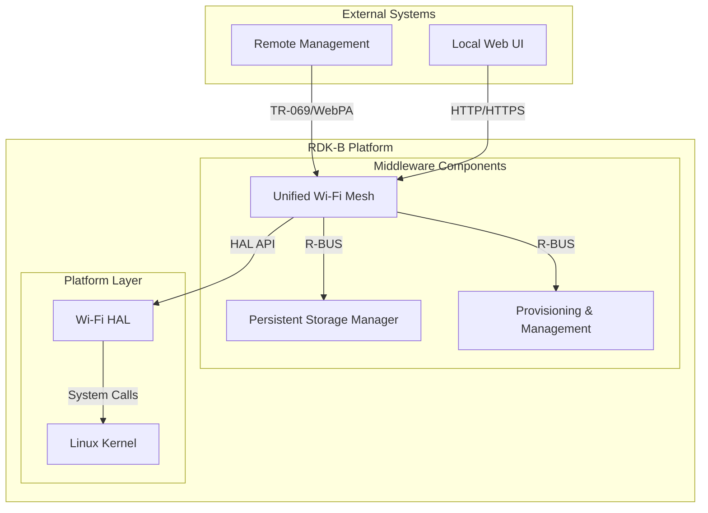
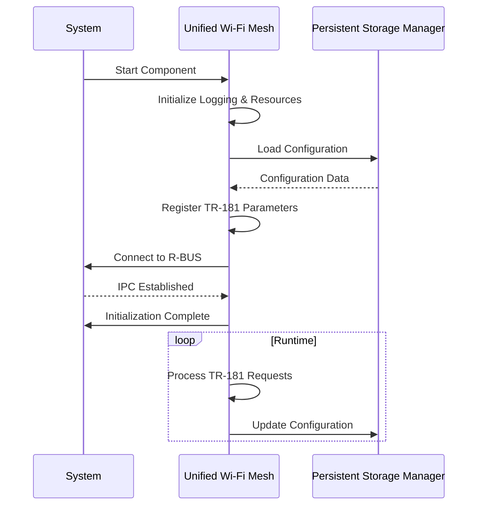
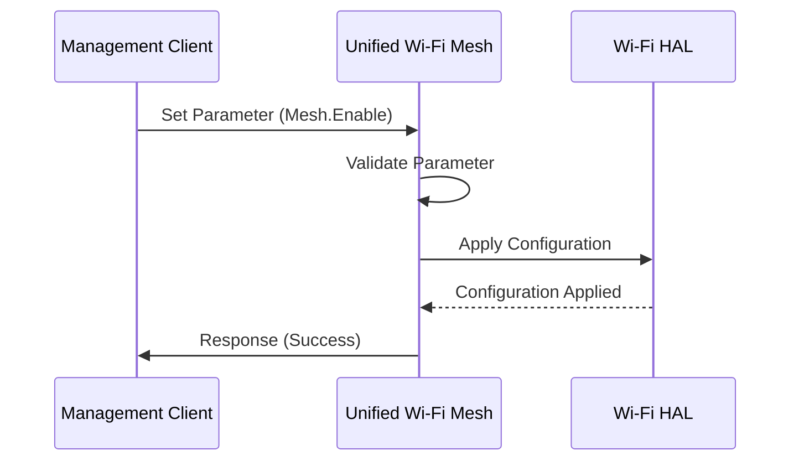
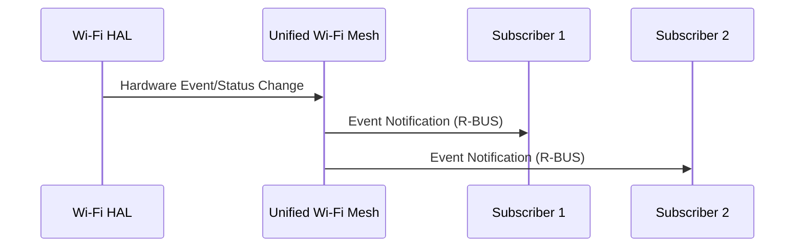

# Unified Wi-Fi Mesh Documentation

## Overview

The Unified Wi-Fi Mesh component is a RDK-B middleware module that facilitates seamless Wi-Fi mesh networking capabilities. It ensures efficient communication, device management, and network optimization within the RDK-B platform.

## Key Features & Responsibilities

- **Wi-Fi Mesh Networking**: Provides robust support for mesh networking, enabling seamless connectivity across multiple access points.
- **Device Management**: Manages device connections, configurations, and status updates within the mesh network.
- **Network Optimization**: Implements algorithms for channel selection, load balancing, and interference mitigation.
- **Integration with RDK-B Components**: Coordinates with other middleware components for configuration management and data synchronization.

## Design

### System Context Diagram

### Threading Model

The Unified Wi-Fi Mesh component employs a multi-threaded architecture to ensure efficient operation and responsiveness. Key threading mechanisms include:

- **Main Thread**: Handles initialization, configuration loading, and main event loop.
- **Worker Threads**:
  - **DPP Presence Announcement Thread**: Sends DPP Presence Announcement frames periodically until a DPP Authentication Frame is received.
  - **Reconfiguration Announcement Thread**: Sends Reconfiguration Announcement frames until a Reconfiguration Authentication Request frame is received.
  - **Timer Thread**: Manages periodic tasks such as state transitions and timeout handling.
- **Synchronization Mechanisms**: Utilizes `std::atomic` for thread-safe operations and mutexes for protecting shared resources.

### Component State Flow

**Initialization to Active State**

The Unified Wi-Fi Mesh component follows a structured initialization sequence to ensure proper dependency resolution and secure operation. The lifecycle includes the following states:

### Detailed Integration Requirements

The Unified Wi-Fi Mesh component has specific integration requirements to ensure seamless operation within the RDK-B platform:

- **RDK-B Components**: Requires integration with Persistent Storage Manager (PSM), Provisioning & Management (P&M), and other middleware components.
- **HAL Dependencies**: Utilizes Wi-Fi HAL APIs for managing network interfaces and configurations.
- **Systemd Services**: Must initialize after `CcspCrSsp.service` and `CcspPsmSsp.service` are active.
- **Message Bus**: Registers with R-BUS under the `com.cisco.spvtg.ccsp.unifiedwifimesh` namespace for inter-component communication.
- **Configuration Files**: Relies on `/usr/ccsp/unifiedwifimesh/` for runtime configurations and `/tmp/unifiedwifimesh/` for temporary state files.
- **Startup Order**: Initializes after network interfaces are active and Persistent Storage Manager services are running.

## TR-181 Data Models

The Unified Wi-Fi Mesh component implements vendor-specific TR-181 parameters under the `Device.X_RDKCENTRAL-COM` namespace, providing comprehensive management interfaces for mesh networking features.

### Supported TR-181 Parameters

| Parameter Path                        | Data Type | Access | Default Value | Description                                            |
| ------------------------------------- | --------- | ------ | ------------- | ------------------------------------------------------ |
| `Device.X_RDKCENTRAL-COM.Mesh.Enable` | boolean   | R/W    | `false`       | Enables or disables the mesh networking functionality. |
| `Device.X_RDKCENTRAL-COM.Mesh.Status` | string    | R      | `"Disabled"`  | Indicates the current status of the mesh network.      |

## Internal Modules

The Unified Wi-Fi Mesh component consists of several specialized modules that handle different aspects of mesh networking functionality. Each module operates independently while sharing common infrastructure for configuration management and inter-component communication.

| Module/Class | Description                                         | Key Files                              |
| ------------ | --------------------------------------------------- | -------------------------------------- |
| MeshManager  | Core module for managing mesh network operations.   | `mesh_manager.cpp`, `mesh_manager.h`   |
| MeshAgent    | Handles communication with mesh agents and devices. | `mesh_agent.cpp`, `mesh_agent.h`       |
| ConfigModule | Manages configuration loading and persistence.      | `config_module.cpp`, `config_module.h` |

## Component Interactions

The Unified Wi-Fi Mesh component interacts extensively with other RDK-B middleware components and system-level services. It serves as a bridge between high-level mesh networking policies and low-level hardware operations.

### Interaction Matrix

| Target Component/Layer     | Interaction Purpose                 | Key APIs/Endpoints                                   |
| -------------------------- | ----------------------------------- | ---------------------------------------------------- |
| Persistent Storage Manager | Configuration storage and retrieval | `PSM_Set_Record_Value2()`, `PSM_Get_Record_Value2()` |
| Provisioning & Management  | Device provisioning and management  | R-BUS method calls                                   |
| Wi-Fi HAL                  | Network interface management        | HAL API calls                                        |

### IPC Flow Patterns

**Primary IPC Flow - TR-181 Parameter Operation:**

**Event Notification Flow:**

## Conclusion

The Unified Wi-Fi Mesh component is a cornerstone of the RDK-B middleware, providing essential services for mesh networking, device management, and network optimization. Its robust threading model, structured lifecycle, and well-defined integration requirements ensure reliability and scalability. By adhering to the outlined design principles and operational guidelines, the Unified Wi-Fi Mesh component facilitates seamless connectivity and enhanced user experiences.
