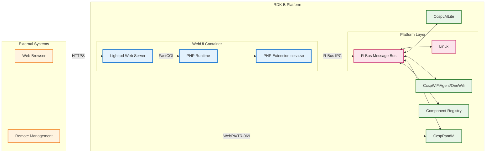
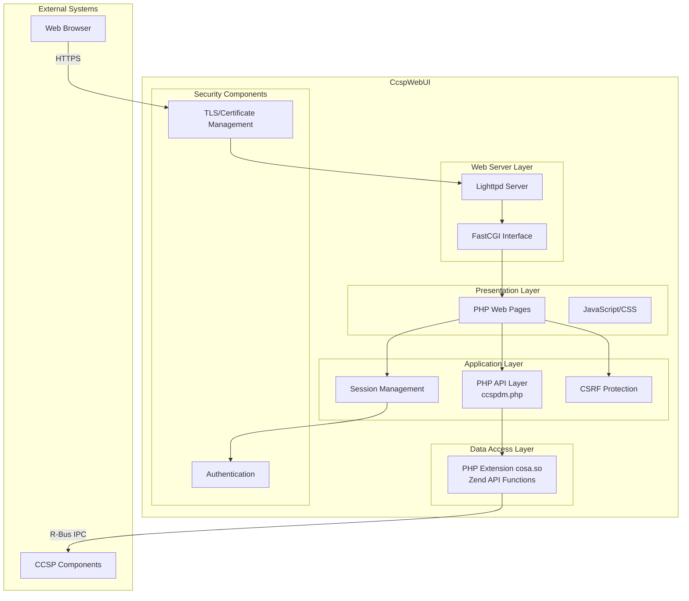
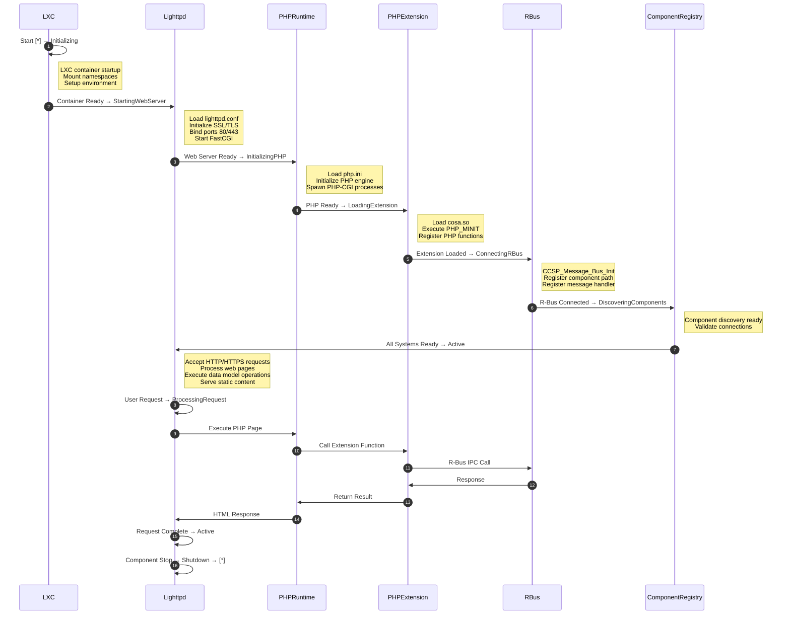
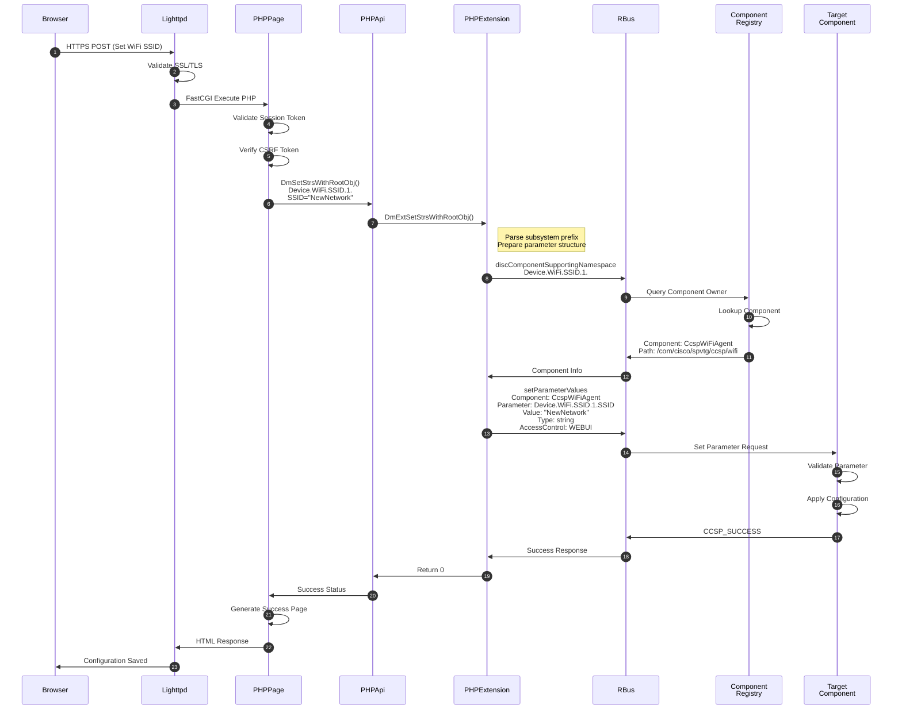
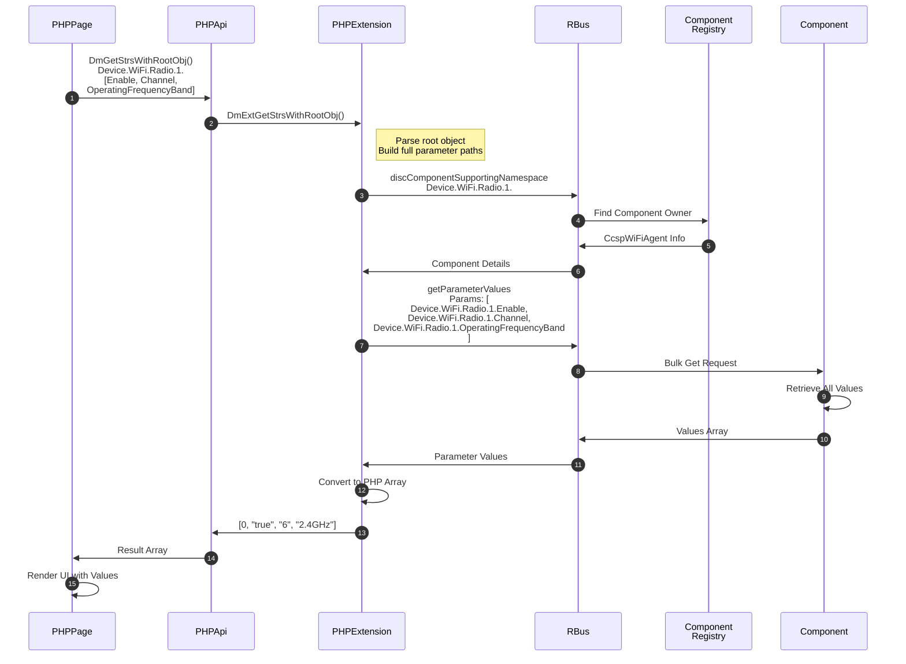
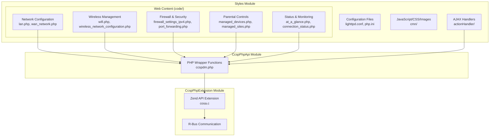
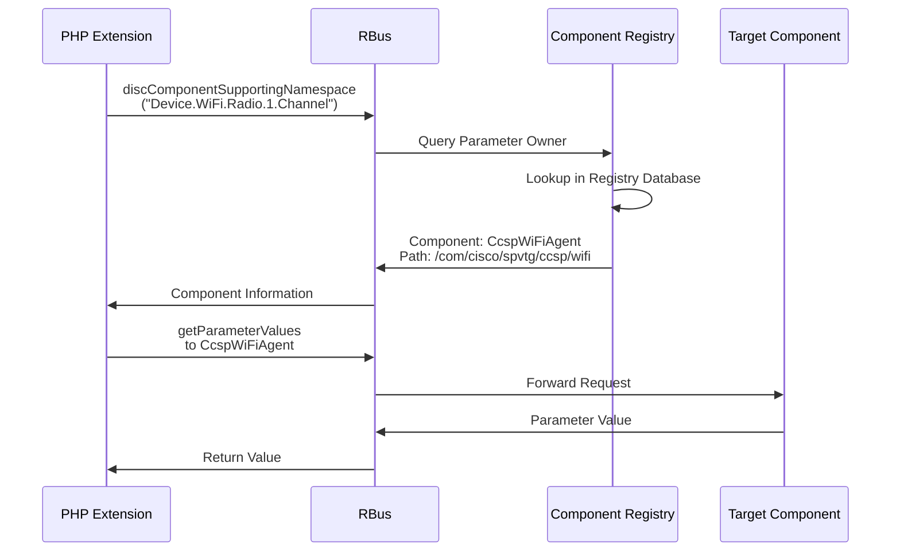
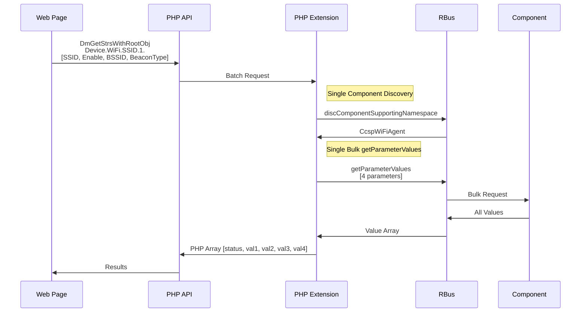
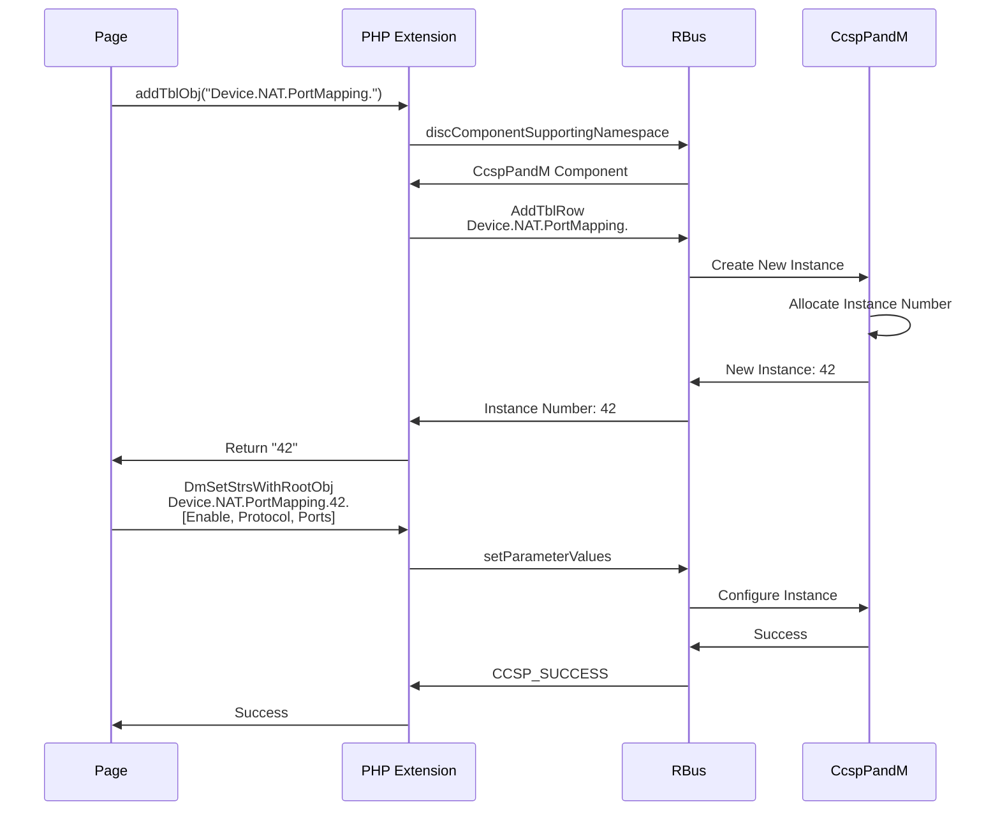

# CcspWebUI Documentation

Ccsp WebUI is the web-based graphical user interface component for RDK-B gateways. The WebUI translates user interactions into CCSP data model operations through a PHP extension that communicates with the CCSP message bus via r-bus IPC. The component consists of three integrated layers: a C-based PHP extension providing direct access to the CCSP message bus, PHP wrapper APIs abstracting data model operations, and presentation layer code implementing the user interface using HTML, CSS, JavaScript, and PHP scripts. The Lighttpd web server hosts the interface, accessible through any web browser on the local network.



**Key Features & Responsibilities**: 

- **Web-Based Configuration Interface**: Browser-based access to gateway configuration parameters including network settings, wireless configuration, firewall rules, port forwarding, parental controls, and device management through HTML pages served via Lighttpd web server
- **PHP Extension Bridge to CCSP**: C-based PHP extension using Zend API bridges PHP web pages to the CCSP message bus, enabling direct data model parameter access through native r-bus IPC calls
- **Multi-Component Data Model Access**: Coordinates with Component Registry to dynamically discover and communicate with CCSP components supporting requested data model parameters across CcspPandM, CcspWiFiAgent, CcspLMLite, and other middleware components
- **Session Management and Security**: Authentication mechanisms, session management, CSRF protection, and HTTPS communication with certificate-based encryption
- **Real-Time Status Monitoring**: Live monitoring for connected devices, network statistics, bandwidth usage, wireless client information, and gateway operational status by querying CCSP data model parameters


## Design

CcspWebUI follows a three-tier architecture separating presentation logic, application processing, and data access into distinct layers.

The presentation layer consists of HTML pages with embedded JavaScript and CSS. The application layer contains PHP business logic that processes user requests, validates inputs, and orchestrates data model operations through wrapper APIs. The data access layer implements a C-based PHP extension using Zend API that provides native functions callable from PHP to interact with the CCSP message bus via r-bus IPC. Web content cannot directly access system resources; all data model operations are mediated through controlled API boundaries enforcing access control policies.

The PHP extension registers with the CCSP message bus using the component name "ccsp.phpextension" and establishes a persistent r-bus connection during PHP runtime initialization. When web pages request data model parameters, PHP code invokes extension functions which query the Component Registry to discover which CCSP component owns the requested parameters, then establishes r-bus communication with that component to execute getParameterValues or setParameterValues operations. The extension handles all r-bus marshaling, error handling, and data type conversions, presenting a simplified interface to PHP code through standardized array-based parameter structures.

**IPC Mechanisms Integration**: CcspWebUI integrates R-Bus IPC through the PHP extension (cosa.so) which bridges web pages and CCSP components. The extension implements r-bus communication using CCSP Message Bus APIs (CCSP_Message_Bus_Init, CCSP_Message_Bus_Register_Path) to establish connection during PHP runtime initialization. All data model operations utilize CcspBaseIf APIs including CcspBaseIf_discComponentSupportingNamespace for component discovery, CcspBaseIf_getParameterValues and CcspBaseIf_setParameterValues for parameter access, CcspBaseIf_AddTblRow and CcspBaseIf_DeleteTblRow for table operations, and CcspBaseIf_GetNextLevelInstances for retrieving instance numbers. PHP wrapper functions in ccspdm.php abstract r-bus complexity from web developers, enabling parameter operations using PHP array structures while the extension handles message marshaling, component discovery, and error propagation.

**Data Persistence and Storage Management**: CcspWebUI does not implement its own data persistence mechanism for configuration parameters. The component operates as a presentation and interaction layer that reads and writes configuration data through CCSP data model parameters owned by other components (CcspPandM, CcspWiFiAgent, CcspLMLite). Source code analysis confirms no syscfg API calls (syscfg_get, syscfg_set, syscfg_commit) or PSM API usage within the WebUI codebase. Session data is stored temporarily in `/tmp/sessions/` using PHP's built-in session management for user authentication state. HTTPS certificates are managed externally and stored in `/nvram/certs/` directory, with certificate updates handled by system scripts (`/lib/rdk/check-webui-update.sh`). The webgui.sh startup script validates certificate availability but does not persist any component-specific configuration. All gateway configuration changes made through the web interface are persisted by the respective owning CCSP components (e.g., WiFi settings persisted by CcspWiFiAgent, NAT rules by CcspPandM) according to their individual persistence strategies.

The component operates in an LXC container named "webui" based on the lxc-lighttpd template. Security mechanisms include user authentication, session management, CSRF protection, and HTTPS encryption using TLS with certificates stored in `/nvram/certs/`.



### Prerequisites and Dependencies

**Documentation Verification Checklist:**

- [x] **Persistence mechanisms**: No syscfg API calls (syscfg_get/set/commit) or PSM usage in WebUI source code (source/CcspPhpExtension/cosa.c, source/CcspPhpApi/ccspdm.php). Session data stored temporarily in /tmp/sessions, certificates in /nvram/certs managed externally.
- [x] **IPC mechanisms**: R-bus method registrations in cosa.c using CCSP_Message_Bus_Init, CCSP_Message_Bus_Register_Path, and CcspBaseIf_* functions for all data model operations.
- [x] **HAL APIs**: No direct HAL API calls in WebUI component - accesses HAL functionality indirectly through backend CCSP components (CcspWiFiAgent, CcspPandM) via r-bus.
- [x] **Event subscriptions**: No event subscription mechanisms - operates on request-response model through HTTP/HTTPS and synchronous r-bus calls.
- [x] **Configuration files**: lighttpd.conf, php.ini, and webgui.sh read during startup (source/Styles/xb3/config/). No component-specific XML configuration.

**Build-Time Flags and Configuration:**

| Configure Option | Distro Feature | Build Flag | Purpose | Default |
|------------------|----------------|------------|---------|---------|
| `--enable-cosa` | N/A | `HAVE_COSA=1` | Enables CCSP data model access extension for PHP variants | Required for PHP variants |
| `--with-ccsp-platform=bcm` | N/A | N/A | Specifies target platform as Broadcom | Set in BCI variants |
| `--with-ccsp-arch=arm` | N/A | N/A | Specifies target architecture as ARM | Set in recipes |
| N/A | safec | `-DSAFEC_DUMMY_API` (if absent) | Controls safe C library usage | Enabled when safec present |
| N/A | safec | `PKG_CONFIG --cflags libsafec` (if present) | Includes safe C headers | Applied when safec enabled |
| N/A | safec | `-lsafec-3.5.1` (dunfell) | Links safe C library version  | Version varies by distro |
| N/A | safec | `-lsafec` (kirkstone) | Links safe C library | Version varies by distro |

<br>

**RDK-B Platform and Integration Requirements:**

* **RDK-B Components**: `CcspCommonLibrary`, `CcspPandM`, `CcspWiFiAgent/OneWifi`, `CcspLMLite`, `Component Registry`
* **Build Dependencies**: `php`, `ccsp-webui-csrf`, `chrpath-replacement-native`, `safec` (conditional)
* **Runtime Dependencies**: `lighttpd`, `PHP FastCGI`, `r-bus daemon`
* **Systemd Services**: r-bus daemon and Component Registry must be active before WebUI starts
* **Message Bus**: R-Bus registration under `ccsp.phpextension` namespace for inter-component communication
* **Configuration Files**: `lighttpd.conf` for web server configuration, `php.ini` for PHP runtime settings, located in `source/Styles/xb3/config/`
* **Startup Order**: Initialize after r-bus daemon, Component Registry, and backend CCSP components are running
* **LXC Container**: Deploys in container named "webui" using lxc-lighttpd template with log path `/rdklogs/logs`

<br>

**Threading Model:**

CcspWebUI implements a multi-process architecture using Lighttpd web server with FastCGI for PHP processing.

- **Architecture**: Multi-process with Lighttpd master process spawning worker processes and PHP-CGI processes
- **Main Process**: Lighttpd master handles HTTP/HTTPS connections, SSL/TLS termination, and request routing
- **Worker Processes**: 
  - **Lighttpd Workers**: Handle incoming web requests and static content serving
  - **PHP-CGI Processes**: Execute PHP scripts via FastCGI interface, each process handles multiple sequential requests
- **Synchronization**: PHP extension uses mutex locks for shared data structures during r-bus communication
- **Request Handling**: Each HTTP request is processed by a dedicated PHP-CGI process with PHP extension loaded per process

### Component State Flow

**Initialization to Active State**

CcspWebUI follows a structured initialization sequence: container initialization, web server configuration loading, PHP extension initialization, and r-bus connection establishment.



**Runtime State Changes**

During normal operation, CcspWebUI responds to various events affecting its operational context:

**State Change Triggers:**

- Certificate updates requiring HTTPS reconfiguration and web server reload
- PHP-CGI process crashes triggering automatic respawn by FastCGI manager
- R-Bus connection loss requiring reconnection and component re-registration
- Configuration parameter changes requiring PHP extension reinitialization
- Backend component restarts requiring re-discovery through Component Registry

### Call Flow

**User Configuration Change Operation**



**Multi-Parameter Retrieval Operation**



## Internal Modules

**Location**: `source/`

CcspWebUI is organized into three distinct modules corresponding to each architectural layer:

**CcspPhpExtension** (`source/CcspPhpExtension/`)
- **Primary File**: `cosa.c`
- **Build Output**: `cosa.so` (PHP extension library)
- **Responsibility**: Core PHP extension implementing r-bus bridge functions using Zend API
- **Key Functions**: getStr, setStr, getInstanceIds, addTblObj, delTblObj, DmExtGetStrsWithRootObj, DmExtSetStrsWithRootObj, DmExtGetInstanceIds
- **Dependencies**: ccsp-common-library, dbus-1, openssl, safec (conditional)

**CcspPhpApi** (`source/CcspPhpApi/`)
- **Primary File**: `ccspdm.php`
- **Responsibility**: PHP wrapper API layer abstracting extension functions for web page developers
- **Key Functions**: DmGetStrsWithRootObj, DmSetStrsWithRootObj, DmGetInstanceIds, DmAddObj, DmDelObj
- **Dependencies**: Requires cosa.so PHP extension loaded

**Styles** (`source/Styles/xb3/`)
- **Subdirectories**: `code/`, `jst/`, `config/`
- **Responsibility**: Web content including PHP pages, configuration files, JavaScript, CSS, and images
- **Key PHP Pages**: lan.php, wifi.php, firewall_settings_ipv4.php, port_forwarding.php, managed_devices.php, hardware.php, software.php
- **Configuration Files**: lighttpd.conf, php.ini, webgui.sh
- **Dependencies**: CcspPhpApi layer



## Component Interactions

### Interaction Matrix

| Component | Interaction Type | Protocol | Purpose | Frequency |
|-----------|-----------------|----------|---------|-----------|
| Component Registry | Query | R-Bus IPC | Discover component ownership for data model parameters | Per parameter access |
| CcspPandM | Get/Set Parameters | R-Bus IPC | Access Device.NAT, Device.X_CISCO_COM parameters | On-demand |
| CcspWiFiAgent/OneWifi | Get/Set Parameters | R-Bus IPC | Access Device.WiFi parameters for wireless configuration | On-demand |
| CcspLMLite | Get Parameters | R-Bus IPC | Access Device.Hosts parameters for connected devices | On-demand |
| CcspCR | Registration | R-Bus IPC | Register component on message bus | Startup |
| PSM | N/A | N/A | No direct interaction (via other components) | N/A |
| Lighttpd | FastCGI | Unix Socket | PHP script execution and content serving | Per HTTP request |

### IPC Flow Patterns

**Component Discovery Pattern**



**Bulk Parameter Operations**



**Table Object Management**



## Implementation Details

### Key Implementation Logic

**PHP Extension Initialization** (`cosa.c`)

```c
// PHP_MINIT_FUNCTION - Module initialization
PHP_MINIT_FUNCTION(cosa)
{
    ZEND_INIT_MODULE_GLOBALS(cosa, php_cosa_init_globals, NULL);
    
    // Initialize message bus connection path
    if ( gPcSim )
        sprintf(dst_pathname_cr, CCSP_DBUS_INTERFACE_CR);
    else
        sprintf(dst_pathname_cr, "eRT." CCSP_DBUS_INTERFACE_CR);
    
    return SUCCESS;
}

// PHP_RINIT_FUNCTION - Per-request initialization
PHP_RINIT_FUNCTION(cosa)
{
    if (!bus_handle) {
        // Establish r-bus connection
        iReturnStatus = CCSP_Message_Bus_Init(
            COMPONENT_NAME,  // "ccsp.phpextension"
            CONF_FILENAME,   // "/tmp/ccsp_msg.cfg"
            &bus_handle, 0, 0);
        
        // Register message handler path
        CCSP_Message_Bus_Register_Path(
            bus_handle, msg_path, path_message_func, 0);
    }
    return SUCCESS;
}
```

**Component Discovery** (`cosa.c: UiDbusClientGetDestComponent`)

```c
int UiDbusClientGetDestComponent(char* pObjName, char** ppDestComponentName, 
                                  char** ppDestPath, char* pSystemPrefix)
{
    ret = CcspBaseIf_discComponentSupportingNamespace(
        bus_handle,
        dst_pathname_cr,     // Component Registry path
        pObjName,            // Parameter name
        pSystemPrefix,       // "eRT." or "eMG."
        &ppComponents,       // Output: component info
        &size);
    
    if ( ret == CCSP_SUCCESS ) {
        *ppDestComponentName = ppComponents[0]->componentName;
        *ppDestPath = ppComponents[0]->dbusPath;
        return 0;
    }
    return ret;
}
```

**Subsystem Prefix Handling** (`cosa.c: CheckAndSetSubsystemPrefix`)

```c
void CheckAndSetSubsystemPrefix(char** ppDotStr, char* pSubSystemPrefix)
{
    if (!strncmp(*ppDotStr, "eRT.", 4)) {
        strncpy_s(pSubSystemPrefix, MAX_SUBSYSTEMPREFIX, "eRT.", 4);
        *ppDotStr += 4;  // Skip prefix
    }
    else if (!strncmp(*ppDotStr, "eMG.", 4)) {
        strncpy_s(pSubSystemPrefix, MAX_SUBSYSTEMPREFIX, "eMG.", 4);
        *ppDotStr += 4;
    }
}
```

**Parameter Get Operation** (`cosa.c: PHP_FUNCTION(getStr)`)

```c
PHP_FUNCTION(getStr)
{
    char* dotstr = NULL;
    char* ppDestComponentName = NULL;
    char* ppDestPath = NULL;
    parameterValStruct_t** parameterVal = NULL;
    
    // Parse PHP function arguments
    zend_parse_parameters(ZEND_NUM_ARGS() TSRMLS_CC, "s", &dotstr, &flen);
    
    // Handle subsystem prefix
    CheckAndSetSubsystemPrefix(&dotstr, subSystemPrefix);
    
    // Discover owning component
    UiDbusClientGetDestComponent(dotstr, &ppDestComponentName, 
                                  &ppDestPath, subSystemPrefix);
    
    // Execute getParameterValues via r-bus
    iReturn = CcspBaseIf_getParameterValues(
        bus_handle,
        ppDestComponentName,
        ppDestPath,
        &dotstr,
        1,  // Single parameter
        &size,
        &parameterVal);
    
    // Return value to PHP
    RETURN_STRING(parameterVal[0]->parameterValue);
}
```

**Parameter Set Operation** (`cosa.c: PHP_FUNCTION(setStr)`)

```c
PHP_FUNCTION(setStr)
{
    parameterValStruct_t param[1];
    
    // Parse arguments: parameter name, value, type, commit flag
    zend_parse_parameters(ZEND_NUM_ARGS() TSRMLS_CC, "ssib", 
                          &dotstr, &value, &type, &commit);
    
    // Discover component
    UiDbusClientGetDestComponent(dotstr, &ppDestComponentName, 
                                  &ppDestPath, subSystemPrefix);
    
    // Prepare parameter structure
    param[0].parameterName = dotstr;
    param[0].parameterValue = value;
    param[0].type = type;  // ccsp_string, ccsp_int, etc.
    
    // Execute setParameterValues with WEBUI access control
    iReturn = CcspBaseIf_setParameterValues(
        bus_handle,
        ppDestComponentName,
        ppDestPath,
        0,  // sessionId
        DSLH_MPA_ACCESS_CONTROL_WEBUI,  // Access control flag
        param,
        1,  // Single parameter
        commit,
        &pFaultParamName);
    
    RETURN_LONG(iReturn);
}
```

**Bulk Parameter Operations** (`cosa.c: PHP_FUNCTION(DmExtGetStrsWithRootObj)`)

```c
PHP_FUNCTION(DmExtGetStrsWithRootObj)
{
    char* rootObjName;
    zval* paramNameArray;
    
    // Parse root object and parameter array
    zend_parse_parameters(ZEND_NUM_ARGS() TSRMLS_CC, "sa", 
                          &rootObjName, &paramNameArray);
    
    // Single component discovery for root object
    UiDbusClientGetDestComponent(rootObjName, &ppDestComponentName, 
                                  &ppDestPath, subSystemPrefix);
    
    // Build full parameter paths by prepending root object
    for (i = 0; i < paramCount; i++) {
        sprintf(fullParamName[i], "%s%s", rootObjName, paramName[i]);
    }
    
    // Single bulk getParameterValues call
    iReturn = CcspBaseIf_getParameterValues(
        bus_handle,
        ppDestComponentName,
        ppDestPath,
        fullParamNames,
        paramCount,
        &size,
        &parameterVal);
    
    // Convert to PHP array
    array_init(return_value);
    add_index_long(return_value, 0, iReturn);  // Status code
    for (i = 0; i < size; i++) {
        add_next_index_string(return_value, parameterVal[i]->parameterValue);
    }
}
```

### Key Configuration Files

**Lighttpd Web Server Configuration** (`source/Styles/xb3/config/lighttpd.conf`)

```
server.document-root = "/fss/gw/usr/www/"
server.port = 80

# SSL/TLS Configuration
ssl.engine = "enable"
ssl.pemfile = "/nvram/certs/myrouter.io.cert.pem"
ssl.ca-file = "/nvram/certs/ca-chain.cert.pem"

# FastCGI for PHP
fastcgi.server = ( ".php" => 
  ((
    "socket" => "/tmp/php-fastcgi.socket",
    "bin-path" => "/usr/bin/php-cgi",
    "max-procs" => 2,
    "bin-environment" => (
      "PHP_FCGI_CHILDREN" => "4",
      "PHP_FCGI_MAX_REQUESTS" => "1000"
    )
  ))
)

# Modules
server.modules = (
  "mod_rewrite",
  "mod_redirect",
  "mod_access",
  "mod_accesslog",
  "mod_auth",
  "mod_fastcgi"
)
```

**PHP Runtime Configuration** (`source/Styles/xb3/config/php.ini`)

```ini
# Extension Loading
extension=cosa.so
extension_dir=/fss/gw/usr/ccsp/

# Resource Limits
max_execution_time = 300
memory_limit = 128M
post_max_size = 8M
upload_max_filesize = 8M

# Error Handling
error_reporting = E_ALL & ~E_DEPRECATED
display_errors = Off
log_errors = On
error_log = /var/tmp/logs/php_errors.log

# Session Management
session.save_handler = files
session.save_path = /tmp/sessions
session.cookie_httponly = 1
session.cookie_secure = 1

# Security
expose_php = Off
allow_url_fopen = Off
disable_functions = exec,passthru,shell_exec,system
```

**WebUI Startup Script** (`source/Styles/xb3/config/webgui.sh`)

```bash
#!/bin/sh

# Check certificate availability
if [ ! -f /nvram/certs/myrouter.io.cert.pem ]; then
    # Invoke certificate update logic
    /lib/rdk/check-webui-update.sh
fi

# Configure environment
setenv.add-environment = ( "WAN0_IS_DUMMY" => "$WAN0_IS_DUMMY" )

# Start Lighttpd web server
/usr/sbin/lighttpd -f /etc/lighttpd.conf
```

**Component XML Configuration**

WebUI does not use XML configuration files. Configuration managed through:
- `lighttpd.conf` for web server settings
- `php.ini` for PHP runtime configuration
- `/tmp/ccsp_msg.cfg` for r-bus message bus configuration (generated by CCSP framework)
