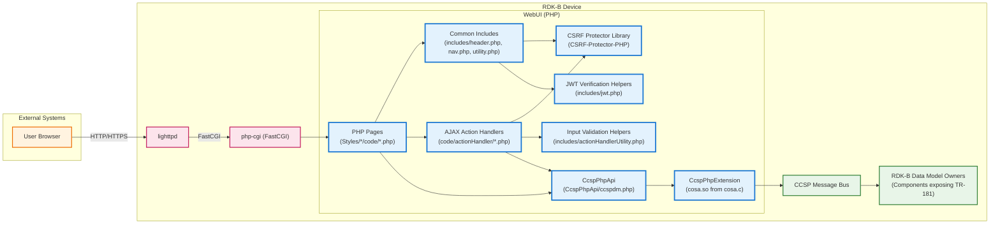
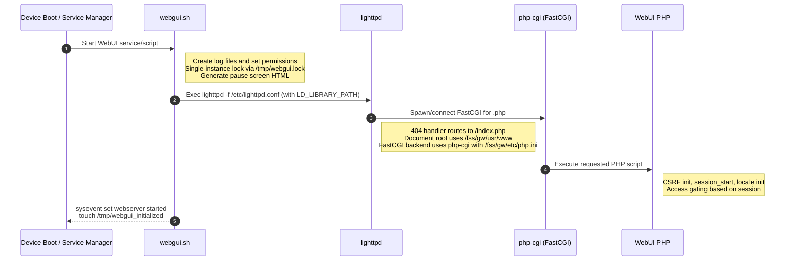
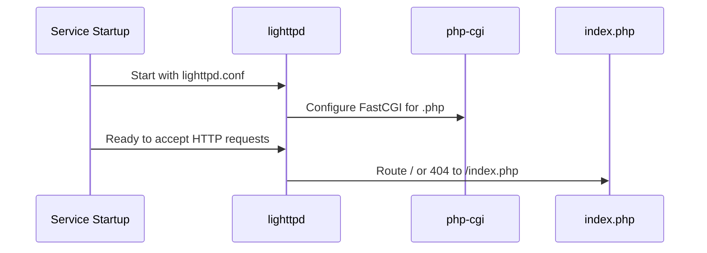
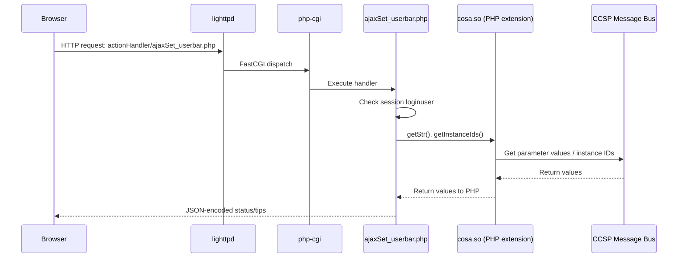
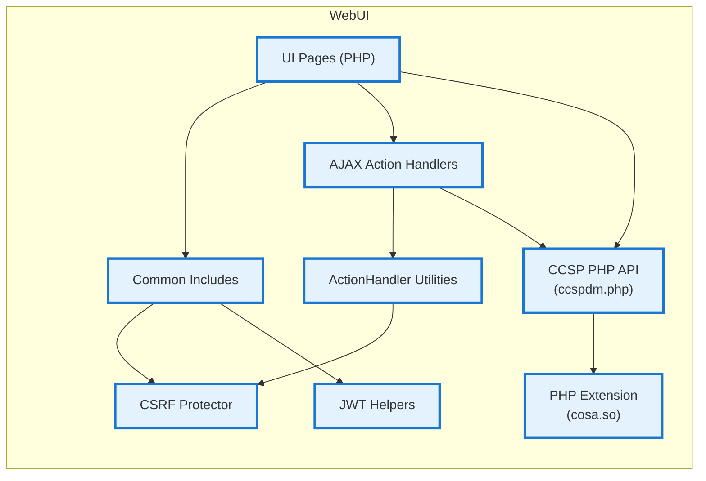
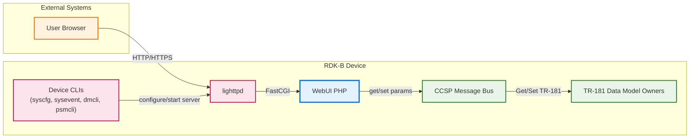
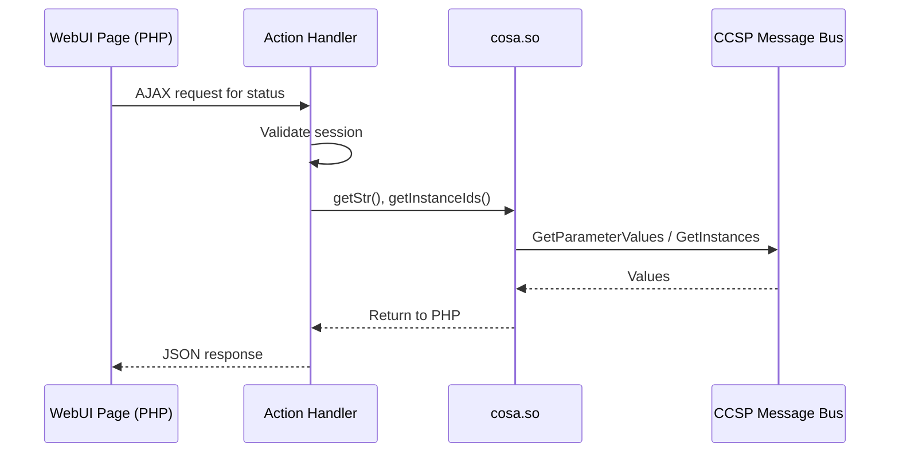

# WebUI Documentation

WebUI is an RDK-B component that provides a device-local, browser-based management portal implemented primarily in PHP and served by `lighttpd` via FastCGI (`php-cgi`). It includes multiple major areas: a PHP C extension that exposes CCSP message bus data-model operations to PHP, a PHP API wrapper around that extension, and the UI implementation itself (pages, templates, JavaScript, CSS, and localization resources) organized under style/theme directories.

Within this repository, WebUI functionality is implemented across several top-level source folders. The CCSP data model integration is provided by the PHP extension under `source/CcspPhpExtension/` (implemented in `cosa.c`) and the PHP wrapper functions under `source/CcspPhpApi/` (for example, `ccspdm.php`). The server-rendered UI pages, common includes, JavaScript/CSS assets, and device-side webserver configuration scripts are organized under `source/Styles/` (with device/theme-specific subtrees such as `xb3/` and `xb6/`).

```mermaid
graph LR
    subgraph "External Systems"
        Browser["User Browser"]
    end

    subgraph "RDK-B Device"
        Lighttpd["lighttpd"]
        PhpCgi["php-cgi (FastCGI)"]
        Pages["WebUI PHP Pages<br>(Styles/*/code)"]

        subgraph "WebUI Data Model Access Layer"
            PhpApi["CcspPhpApi<br>(ccspdm.php)"]
            PhpExt["CcspPhpExtension<br>(cosa.so)"]
        end

        CCSPBus["CCSP Message Bus"]
        DataModelOwners["RDK-B Components exposing TR-181 Data Model"]
    end

    %% External connections
    Browser -->|HTTP/HTTPS| Lighttpd

    %% Web server to PHP runtime
    Lighttpd -->|FastCGI .php| PhpCgi
    PhpCgi --> Pages

    %% Data model access
    Pages -->|PHP calls| PhpApi
    PhpApi -->|Extension API| PhpExt
    PhpExt -->|CCSP message bus| CCSPBus
    CCSPBus -->|Get/Set TR-181| DataModelOwners

    classDef external fill:#fff3e0,stroke:#ef6c00,stroke-width:2px;
    classDef webui fill:#e3f2fd,stroke:#1976d2,stroke-width:3px;
    classDef rdkbComponent fill:#e8f5e8,stroke:#2e7d32,stroke-width:2px;
    classDef system fill:#fce4ec,stroke:#c2185b,stroke-width:2px;

    class Browser external;
    class Pages,PhpApi,PhpExt webui;
    class CCSPBus,DataModelOwners rdkbComponent;
    class Lighttpd,PhpCgi system;
```

**Key Features & Responsibilities**:

- **Local Web Management UI served by lighttpd**: The UI is composed of PHP pages (for example, `source/Styles/xb3/code/*.php`) designed to be served by `lighttpd` with a 404 handler redirecting to `index.php`, enabling a browser-based management portal.
- **CCSP data-model access from PHP via a C extension**: The PHP extension implemented in `source/CcspPhpExtension/cosa.c` exposes functions such as `DmExtGetStrsWithRootObj`, `DmExtSetStrsWithRootObj`, and `DmExtGetInstanceIds`, allowing PHP code to interact with CCSP/TR-181 parameters over the CCSP message bus.
- **PHP wrapper API over the extension**: `source/CcspPhpApi/ccspdm.php` provides PHP helper functions (`DmGetStrsWithRootObj`, `DmSetStrsWithRootObj`, `DmGetInstanceIds`, `DmAddObj`, `DmDelObj`) that call the underlying extension methods, encouraging UI code to use a consistent API layer.
- **Session, locale, and role-based access gating**: Common includes (for example, `source/Styles/xb3/code/includes/header.php`) start sessions, set locale based on `LANG`, enforce authentication via session variables (including a JWT flag path), and deny access to specific page groups depending on the logged-in user type.
- **Built-in request-hardening utilities**: Action handlers share validation utilities in `source/Styles/xb3/code/includes/actionHandlerUtility.php`, including strict input validation helpers (MAC, IP, port, URL patterns) and SSID naming constraints.
- **CSRF protection initialization**: Common includes and action handler utilities initialize a CSRF protection library via `csrfprotector_rdkb::init()` using `source/Styles/xb3/code/CSRF-Protector-PHP/libs/csrf/csrfprotector_rdkb.php` and its configuration under `source/Styles/xb3/code/CSRF-Protector-PHP/libs/config.php`.

## Design

WebUI follows a server-rendered PHP architecture where page rendering and most workflow logic live in PHP, while JavaScript is used for client-side form handling and AJAX requests to `actionHandler` endpoints. A shared header include (`includes/header.php`) bootstraps core concerns such as session management, locale initialization, CSRF library initialization, and access checks; a shared navigation include (`includes/nav.php`) computes menu visibility based on device state and partner identifiers; and shared utilities (`includes/utility.php`, `includes/actionHandlerUtility.php`) centralize data-model access helpers and validation logic.

For data access and configuration, the UI relies on CCSP/TR-181 parameter operations exposed into PHP. In the header, WebUI uses `DmExtGetStrsWithRootObj()` to retrieve multiple parameter values in a single call. Across the UI and handlers, `getStr()` and related functions (published from the `cosa.so` extension) are used to fetch device state and apply configuration changes. This design tightly couples the UI to the CCSP data model rather than a separate REST layer.

Northbound interaction is HTTP/HTTPS traffic from a browser to `lighttpd`. Southbound interaction is the PHP extension's communication to the CCSP message bus (and thereby to the underlying RDK-B components that own the TR-181 parameters). The webserver layer uses the `lighttpd` configuration and startup script under `source/Styles/xb3/config/`, where `lighttpd` is configured to route PHP through FastCGI and to use `/index.php` as the 404 handler.

### Operational Execution Model

Within this repository, the application does not implement its own threading primitives at the PHP layer. Instead, concurrency and isolation are shaped by the web server and the PHP runtime integration.

`source/Styles/xb3/config/lighttpd.conf` configures PHP execution via `mod_fastcgi` using a FastCGI backend that can spawn multiple `php-cgi` processes. Specifically, the `fastcgi.server` entry for `".php"` configures `max-procs` to `"2"` and a `bin-path` of `"/fss/gw/bin/php-cgi -c /fss/gw/etc/php.ini"` with host `0.0.0.0` and port `1026`. Multiple PHP processes may execute requests concurrently, with per-request PHP state isolated at the process level except for shared external resources (for example, the CCSP message bus).

At the extension layer, `source/CcspPhpExtension/cosa.c` shows that the CCSP message bus handle is stored in a global `bus_handle` and is initialized lazily in `PHP_RINIT_FUNCTION(cosa)` when `bus_handle` is `NULL`. Within a given `php-cgi` process, the first request that uses the extension causes `CCSP_Message_Bus_Init(...)` and `CCSP_Message_Bus_Register_Path(...)` to be called, after which subsequent requests in the same process reuse the initialized bus handle.

A component diagram showing the WebUI’s internal structure and dependencies is given below:

### Prerequisites and Dependencies

**Build and Source Layout Prerequisites:**

This repository contains a PHP extension under `source/CcspPhpExtension/` (for example, `cosa.c` and `config.m4`), a PHP wrapper API under `source/CcspPhpApi/` (for example, `ccspdm.php`), and UI/page assets plus device-side configuration under `source/Styles/` (for example, `source/Styles/xb3/config/lighttpd.conf`, `source/Styles/xb3/config/php.ini`, and `source/Styles/xb3/config/webgui.sh`).

**Web Server Configuration:**

The `lighttpd` configuration at `source/Styles/xb3/config/lighttpd.conf` includes:
- `server.document-root = "/fss/gw" + "/usr/www/"`
- `server.error-handler-404 = "/index.php"`
- FastCGI mapping for `.php` with `php-cgi` launched using `-c /fss/gw/etc/php.ini` and port `1026`.

**PHP Configuration and Extension Loading:**

`source/Styles/xb3/config/php.ini` configures the PHP runtime to load the CCSP PHP extension by setting `extension_dir = "/fss/gw/usr/ccsp"` and `extension=cosa.so`. It also contains hardening-related settings such as `disable_functions = phpinfo`, `display_errors = Off`, `log_errors = On`, `allow_url_fopen = Off`, and `allow_url_include = Off`.

**PHP Extension Build Dependencies:**

`source/CcspPhpExtension/config.m4` shows the extension build checks for:
- `libccsp_common.so` in `$CCSP_COMMON_LIB`
- include paths under `$CCSP_DEP_HEADER`, `$CCSP_COMMON_SRC`, and `$CCSP_COMMON_BOARD_INC`
- libraries `crypto`, `ssl`, and `ccsp_common`.

Because these are referenced in the build configuration, they represent build-time requirements for compiling the PHP extension in environments where the CCSP common libraries and headers are available.

**Runtime Startup Script:**

`source/Styles/xb3/config/webgui.sh` is a device-side script that prepares runtime state and starts `lighttpd -f /etc/lighttpd.conf` with `LD_LIBRARY_PATH` including `/fss/gw/usr/ccsp`, implying runtime dependency on the extension and CCSP libraries being present at that path. The script also interacts with device utilities such as `syscfg`, `psmcli`, `sysevent`, and `dmcli` to read and set device state used for captive portal and other flows.

**Localization resources:**

`source/Styles/xb3/code/includes/header.php` uses gettext functions (`bindtextdomain`, `textdomain`) with `bindtextdomain($domain, 'locales')`, and the repository contains localization directories under `source/locales/`.

**Threading Model**

The repository does not provide an application-level threading model inside the PHP pages themselves. Operational concurrency is instead determined by the `lighttpd` + FastCGI configuration and by how the `php-cgi` processes load and use the CCSP PHP extension.

At the service-start boundary, `source/Styles/xb3/config/webgui.sh` implements a single-instance guard using a lock file (`/tmp/webgui.lock`) and a retry loop. This script-level locking ensures that only one orchestrator instance is responsible for starting `lighttpd` and generating configuration artifacts at a time; it does not serialize HTTP requests once the web server is running.

At the CCSP/PHP-extension boundary, `source/CcspPhpExtension/cosa.c` shows that the extension keeps a per-process global `bus_handle` and initializes it in `PHP_RINIT_FUNCTION(cosa)` when it is not yet set. This means CCSP message bus initialization and path registration happen once per `php-cgi` process (the first time a request triggers `RINIT` with `bus_handle == NULL`), and subsequent requests handled by the same process reuse the existing `bus_handle`. The extension calls `CCSP_Message_Bus_Exit(bus_handle)` in `PHP_MSHUTDOWN_FUNCTION(cosa)` when the process is shutting down.

No additional request-queueing, background workers, or explicit multi-threaded PHP execution exists beyond the FastCGI process model described above.

### Component State Flow

**Initialization to Active State**

Based on `webgui.sh` and the `lighttpd` configuration, WebUI's lifecycle follows a device/service startup path that prepares runtime state and starts `lighttpd`, after which requests are served and routed to PHP pages and handlers.

`source/Styles/xb3/config/webgui.sh` shows several runtime preparation and gating steps before starting `lighttpd`, including creating and permissioning log files (for example `/rdklogs/logs/lighttpderror.log` and `/rdklogs/logs/webui.log`), ensuring only one instance runs at a time via `/tmp/webgui.lock`, killing any existing `lighttpd` process, and generating the pause-screen HTML via `/etc/pauseBlockGenerateHtml.sh` after copying common assets to `/tmp/pcontrol`.

Once started, the script exports `LD_LIBRARY_PATH=/fss/gw/usr/ccsp:$LD_LIBRARY_PATH` when launching `lighttpd`, which is consistent with the WebUI runtime requirement that the CCSP PHP extension (`cosa.so`) and its dependent shared libraries are found under `/fss/gw/usr/ccsp`.

**Per-Request Bootstrapping and State Initialization**

A typical page request initializes request context through shared includes, especially `source/Styles/xb3/code/includes/header.php`.

That header performs the following steps in order, all within the request’s PHP execution:

First, it includes the CSRF protector wrapper and calls `csrfprotector_rdkb::init()`.

Next, it calls `session_start()` and sets locale based on `getenv("LANG")`. If the session language is not set or differs from the current locale, it updates `LC_MESSAGES` and `LC_TIME` and configures gettext domains with `bindtextdomain($domain, 'locales')`, `bind_textdomain_codeset($domain, 'UTF-8')`, and `textdomain($domain)`, storing the selected locale in `$_SESSION['language']`.

It then enforces access gating. If `$_SESSION["loginuser"]` is not set, it checks `$_SESSION["JWT_VALID"]` and, when that flag is not present or not `true`, it returns a JavaScript alert and redirects to `home_loggedout.php` before exiting.

After access gating, it computes and stores key “mode” session state from TR-181 parameters using `DmExtGetStrsWithRootObj` and `getStr`:

It reads `Device.X_CISCO_COM_DeviceControl.LanManagementEntry.1.LanMode` and normalizes it to either `bridge-static` or `router` (defaulting to `router` when it is neither of those values), storing the result in `$_SESSION["lanMode"]`.

It reads `Device.X_CISCO_COM_DeviceControl.PowerSavingModeStatus` and normalizes it to `Enabled` or `Disabled` (defaulting to `Disabled` otherwise), storing the result in `$_SESSION["psmMode"]`.

It also reads branding and identification parameters such as `Device.DeviceInfo.X_RDKCENTRAL-COM_Syndication.RDKB_UIBranding.LocalUI.MSOLogoTitle`, `Device.DeviceInfo.X_RDKCENTRAL-COM_Syndication.RDKB_UIBranding.LocalUI.MSOLogo`, `Device.DeviceInfo.X_RDKCENTRAL-COM_Syndication.PartnerId`, and `Device.DeviceInfo.ModelName`, and defines `PREPAID` when the model name is `TG1682P`.

**Runtime State Changes and Feature Visibility**

The navigation module (`source/Styles/xb3/code/includes/nav.php`) uses both request/session state and live TR-181 values to decide which menu items are visible. It reads `PartnerId` and `ModelName` via `getStr`, and it uses `$_SESSION["lanMode"]` and `$_SESSION["loginuser"]` to hide groups of “Advanced” and “Parental Control” pages in bridge mode and to change the menu for `admin` versus `mso` users.

Action handlers also rely on session state to compute status. For example, `source/Styles/xb3/code/actionHandler/ajaxSet_userbar.php` uses `$_SESSION["lanMode"]` and `$_SESSION["psmMode"]` to influence computed connectivity status, and it persists derived status values back into the session (for example, `$_SESSION['sta_inet']`, `$_SESSION['sta_wifi']`, `$_SESSION['sta_moca']`, `$_SESSION['sta_fire']`).

Request processing both consumes and updates `$_SESSION` state, with additional device-state read-through via CCSP/TR-181 on each request as needed.

### Call Flow

**Initialization Call Flow**

**Request Processing Call Flow**

The userbar status handler `source/Styles/xb3/code/actionHandler/ajaxSet_userbar.php` validates session state and retrieves device parameters via `getStr()` and `getInstanceIds()`.

## Internal Modules

WebUI’s repository structure provides clear module boundaries aligned to source folders and common include points.

| Module/Class | Description | Key Files |
|-------------|------------|-----------|
| UI Pages | Server-rendered PHP pages representing the management portal screens. Pages typically include shared header/nav/footer and call data-model functions to render current state. | `source/Styles/xb3/code/*.php`, `source/Styles/xb6/code/*.php` |
| Common Includes | Shared bootstrapping and UI infrastructure, including session initialization, locale, access control gates, and menu generation. | `source/Styles/xb3/code/includes/header.php`, `source/Styles/xb3/code/includes/nav.php`, `source/Styles/xb3/code/includes/utility.php` |
| Action Handlers | AJAX endpoints that validate input and apply configuration changes or return data for dynamic UI elements. | `source/Styles/xb3/code/actionHandler/*.php` |
| Action Handler Utilities | Shared input-validation utilities and helper functions used by action handlers; includes CSRF initialization. | `source/Styles/xb3/code/includes/actionHandlerUtility.php` |
| CSRF Protection Library | CSRF protection wrapper and configuration used by includes and handlers, initialized via `csrfprotector_rdkb::init()`. | `source/Styles/xb3/code/CSRF-Protector-PHP/libs/csrf/csrfprotector_rdkb.php`, `source/Styles/xb3/code/CSRF-Protector-PHP/libs/config.php` |
| JWT Verification Helpers | JWT verification utilities used by authentication/session flows (for example, referenced by `check.php`). | `source/Styles/xb3/code/includes/jwt.php` |
| CCSP PHP API Wrapper | Higher-level PHP API functions that delegate to extension functions for get/set/add/delete of objects/parameters. | `source/CcspPhpApi/ccspdm.php` |
| CCSP PHP Extension | C-based PHP extension exposing CCSP data-model operations to PHP. | `source/CcspPhpExtension/cosa.c`, `source/CcspPhpExtension/config.m4` |
| Server Configuration / Startup | Device-side webserver configuration and startup logic for `lighttpd` and PHP. | `source/Styles/xb3/config/lighttpd.conf`, `source/Styles/xb3/config/php.ini`, `source/Styles/xb3/config/webgui.sh` |

## Component Interactions

WebUI interacts with several classes of "external" dependencies, but most interactions are device-local. The implementation shows heavy use of CCSP data-model access via the PHP extension (for example, `getStr`, `getInstanceIds`, and `DmExtGetStrsWithRootObj`) and device-side scripts that invoke platform CLIs (`dmcli`, `psmcli`, `syscfg`, `sysevent`) to manage system state during startup or captive portal enablement.

### Interaction Matrix

| Target Component/Layer | Interaction Purpose | Key APIs/Endpoints |
|------------------------|-------------------|------------------|
| **Web Server Layer** | Serve PHP pages and route requests to FastCGI. | `source/Styles/xb3/config/lighttpd.conf` (`fastcgi.server` for `.php`, `server.error-handler-404 = "/index.php"`) |
| **PHP runtime configuration** | Configure PHP runtime behavior and load the CCSP PHP extension. | `source/Styles/xb3/config/php.ini` (`extension_dir`, `extension=cosa.so`) |
| **CCSP Data Model (via message bus)** | Read and write TR-181 parameters and table instances used by pages and handlers. | Extension functions published in `source/CcspPhpExtension/cosa.c` (for example, `DmExtGetStrsWithRootObj`, `DmExtSetStrsWithRootObj`, `DmExtGetInstanceIds`) and PHP wrapper in `source/CcspPhpApi/ccspdm.php` (`DmGetStrsWithRootObj`, `DmSetStrsWithRootObj`, `DmGetInstanceIds`) |
| **Session/auth and access gating** | Enforce login requirements and page access restrictions by role and device mode. | `source/Styles/xb3/code/includes/header.php`, `source/Styles/xb3/code/check.php` |
| **CSRF protection** | Initialize CSRF protection for UI pages and action handlers. | `csrfprotector_rdkb::init()` in `source/Styles/xb3/code/includes/header.php` and `source/Styles/xb3/code/includes/actionHandlerUtility.php`; config in `source/Styles/xb3/code/CSRF-Protector-PHP/libs/config.php` |
| **Device startup orchestration** | Prepare runtime state, logs, optional captive portal logic, and start `lighttpd`. | `source/Styles/xb3/config/webgui.sh` (starts `lighttpd -f /etc/lighttpd.conf`) |

**Events Published by WebUI:**

WebUI does not contain an explicit RBus event publication module. The principal mechanism for cross-component interaction is CCSP data-model access (get/set) rather than explicit event publishing from WebUI.

### IPC Flow Patterns

**Primary IPC Flow - Read/Compute Status for UI Elements:**

**Event Notification Flow:**

No explicit event-notification subsystem exists for WebUI. Dynamic updates are handled by browser-initiated AJAX calls to `actionHandler` endpoints, which then query state via CCSP data-model operations.

## Implementation Details

### Major HAL APIs Integration

No direct HAL API calls exist within the PHP code. Hardware and subsystem interactions are mediated through the CCSP data model (via the PHP extension) and through device-side command-line tools invoked by startup scripts (for example, `dmcli`, `syscfg`, `sysevent`, `psmcli`) rather than through linking to HAL libraries inside the WebUI application code.

### Key Implementation Logic

WebUI’s core logic is primarily organized around these patterns:

- **Session and access enforcement in shared includes**: `source/Styles/xb3/code/includes/header.php` starts a session, sets locale using `LANG`, performs access checks, and denies access if the session does not indicate a logged-in user or valid JWT session state. It also normalizes and stores device mode flags such as `lanMode` and `psmMode` into session variables after reading them via `DmExtGetStrsWithRootObj`.
- **Dynamic navigation based on device state and partner identity**: `source/Styles/xb3/code/includes/nav.php` reads partner and model identity (`PartnerId`, `ModelName`) and session mode (`lanMode`) to build the menu and conditionally hide pages in bridge mode or for specific user roles.
- **Input validation for action handlers**: `source/Styles/xb3/code/includes/actionHandlerUtility.php` provides validation helpers for printable character constraints, MAC and IP validation, port ranges, URL patterns (including IPv6 forms), and SSID naming constraints. These utilities are used by action handlers before applying changes.
- **Status computation and JSON serialization**: `source/Styles/xb3/code/actionHandler/ajaxSet_userbar.php` shows a typical handler approach: read multiple TR-181 parameters via `getStr()`, compute status values, store derived values in the session, and return JSON encoded output using `json_encode` and HTML escaping.

### Key Configuration Files

| Configuration File | Purpose | Override Mechanisms |
|--------------------|---------|--------------------|
| `source/Styles/xb3/config/lighttpd.conf` | `lighttpd` configuration including document root, modules, 404 handler, and FastCGI mapping for PHP. | Started by `webgui.sh` as `lighttpd -f /etc/lighttpd.conf`; integration is responsible for placing an appropriate `lighttpd.conf` at `/etc/lighttpd.conf`. |
| `source/Styles/xb3/config/php.ini` | PHP runtime configuration used by `php-cgi`, including loading `cosa.so` from `/fss/gw/usr/ccsp`. | Referenced by `lighttpd.conf` FastCGI `bin-path` as `php-cgi -c /fss/gw/etc/php.ini`. |
| `source/Styles/xb3/config/webgui.sh` | Startup/orchestration script that prepares logs/state and launches `lighttpd`, including captive portal related logic and environment setup. | Invoked by device integration/service manager; behavior changes based on device properties and flags read via CLI tools. |
| `source/Styles/xb3/code/CSRF-Protector-PHP/libs/config.php` | CSRF protector configuration options (token and logging related settings). | Used by the CSRF protector library; loaded when initialized by PHP includes. |

### Detailed Integration Requirements

This repository includes several explicit runtime expectations expressed as hard-coded paths and invoked utilities. The list below captures those requirements without implying how a given platform must package them beyond matching these expectations.

At the web server layer, `source/Styles/xb3/config/lighttpd.conf` sets `server.document-root` to `"/fss/gw" + "/usr/www/"` and sets `server.error-handler-404` to `"/index.php"`. It configures `mod_fastcgi` to run `php-cgi` using `"/fss/gw/bin/php-cgi -c /fss/gw/etc/php.ini"` and listens on port `1026`, with `max-procs` set to `"2"`. Deployments that use this configuration therefore need those filesystem paths (or compatible equivalents) to exist, and they need `php-cgi` to be accessible at the configured location.

At the WebUI startup/orchestration layer, `source/Styles/xb3/config/webgui.sh` starts `lighttpd` using `lighttpd -f /etc/lighttpd.conf`. It also exports `LD_LIBRARY_PATH=/fss/gw/usr/ccsp:$LD_LIBRARY_PATH` when launching `lighttpd`. This is consistent with `source/Styles/xb3/config/php.ini` using `extension_dir="/fss/gw/usr/ccsp"` and loading `extension=cosa.so`. As a result, an integration that follows these scripts/configs must ensure that `cosa.so` is installed in that extension directory and that the shared libraries it depends on are resolvable (as implied by the `LD_LIBRARY_PATH` usage).

The startup script also assumes the presence of specific runtime directories and log locations. It creates and changes ownership for log files under `/rdklogs/logs/` (for example `lighttpderror.log` and `webui.log`), and it touches `/tmp/webgui_initialized` after starting `lighttpd`. It uses `/tmp/webgui.lock` as a single-instance lock file and uses `/tmp/.webui/` for certificate handling when HTTPS support is enabled for non-emulator box types.

The script also depends on device-side utilities and scripts, including `syscfg`, `psmcli`, `sysevent`, `dmcli`, `dibbler-server`, and `/etc/pauseBlockGenerateHtml.sh`. It also sources `/lib/rdk/t2Shared_api.sh`, `/etc/device.properties`, and `/etc/utopia/service.d/log_capture_path.sh` (and, for non-HUB4 box types, `/fss/gw/etc/utopia/service.d/log_env_var.sh`). Where present, it calls `/lib/rdk/check-webui-update.sh`.

At the PHP page/bootstrap layer, `source/Styles/xb3/code/includes/header.php` and `source/Styles/xb3/code/includes/actionHandlerUtility.php` both include and initialize the CSRF protector wrapper `../CSRF-Protector-PHP/libs/csrf/csrfprotector_rdkb.php` by calling `csrfprotector_rdkb::init()`. Integrations need to ensure those library files are present at the expected relative paths within the deployed document root.

At the CCSP extension layer, `source/CcspPhpExtension/cosa.c` shows that the extension initializes the CCSP message bus in `PHP_RINIT_FUNCTION(cosa)` via `CCSP_Message_Bus_Init(COMPONENT_NAME, CONF_FILENAME, &bus_handle, 0, 0)` and registers a D-Bus path via `CCSP_Message_Bus_Register_Path(bus_handle, msg_path, path_message_func, 0)`. A message-bus configuration file (or equivalent) is required by the extension's initialization call.

No standalone REST service layer exists for integration. All request-time device interactions occur through TR-181/CCSP parameter access (via `getStr`, `setStr`, `DmExtGetStrsWithRootObj`, and related calls) and, at startup time, through the local platform CLIs invoked by `webgui.sh`.
