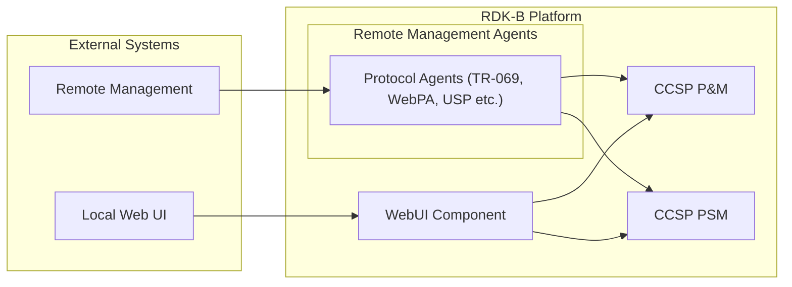
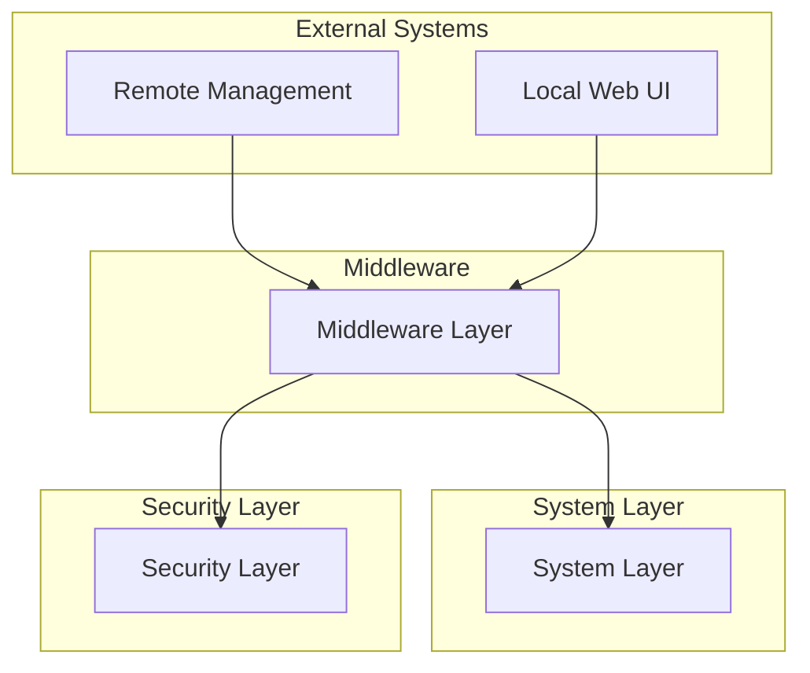

# WebUI Documentation

WebUI is the RDK-B component responsible for providing a user-friendly interface for managing and configuring the gateway. This component serves as the primary interface for end-users to interact with the gateway's features and settings. The WebUI component integrates with other RDK-B components to provide a seamless user experience for managing network configurations, parental controls, and device monitoring.

## Overview

The WebUI component is built using PHP and includes a set of APIs and extensions to interact with the RDK-B data model. It provides a web-based interface for users to configure and monitor their network settings.

### Key Features

- User-friendly interface for managing gateway settings.
- Integration with RDK-B data model for real-time configuration and monitoring.
- Support for multiple languages and localization.
- Secure access through authentication mechanisms.
- Extensible architecture for adding new features and functionalities.

## Architecture

## Prerequisites and Dependencies

The WebUI component has the following build-time flags, macros, and distro features:

| Configure Option                | Distro Feature       | Build Flag  | Purpose                              | Default |
| ------------------------------- | -------------------- | ----------- | ------------------------------------ | ------- |
| `--enable-cosa`                 | `systemd`            | `HAVE_COSA` | Enable Cosa Extension support        | `yes`   |
| `--enable-journalctl`           | `systemd`            | N/A         | Enable journalctl logging            | `true`  |
| `ONEWIFI_CAC_APP_SUPPORT`       | `safec`              | N/A         | Enable CAC application support       | `true`  |
| `ONEWIFI_DML_SUPPORT`           | `safec`              | N/A         | Enable DML support in Makefile       | `true`  |
| `ONEWIFI_CSI_APP_SUPPORT`       | `safec`              | N/A         | Enable CSI application support       | `true`  |
| `ONEWIFI_MOTION_APP_SUPPORT`    | `safec`              | N/A         | Enable motion application support    | `true`  |
| `ONEWIFI_HARVESTER_APP_SUPPORT` | `safec`              | N/A         | Enable harvester application support | `true`  |
| `ONEWIFI_ANALYTICS_APP_SUPPORT` | `safec`              | N/A         | Enable analytics application support | `true`  |
| `ONEWIFI_LEVL_APP_SUPPORT`      | `safec`              | N/A         | Enable LEVL application support      | `true`  |
| `ONEWIFI_WHIX_APP_SUPPORT`      | `offchannel_scan_5g` | N/A         | Enable WHIX application support      | `true`  |
| `ONEWIFI_BLASTER_APP_SUPPORT`   | `Memwrap_Tool`       | N/A         | Enable Blaster application support   | `true`  |

## Design

WebUI follows a modular, event-driven architecture designed to provide a seamless user experience for managing and configuring the gateway. The design emphasizes scalability, real-time responsiveness, and data consistency while maintaining minimal system resource utilization. The architecture separates ownership between user interface rendering, data model management, and external communications through well-defined interfaces and protocols.

The component operates as a central interface for user interactions, collecting data from multiple sources including RBus messaging, PHP APIs, and system-level networking calls. The design implements intelligent caching and synchronization strategies to maintain accurate configuration state information while minimizing system load. Event-driven updates ensure real-time responsiveness to user actions while batch processing optimizes data transmission and reduces system load.

The northbound interface provides TR-181 compliant access through RBus messaging, enabling seamless integration with other RDK-B components and external management systems. The southbound interface abstracts network interface interactions through HAL APIs and system-level networking calls. Data persistence is achieved through integration with the Persistent Storage Manager (PSM) ensuring configuration information survives system reboots.

### External Systems and Middleware

The above diagram provides a simplified view of the WebUI architecture, showing the interaction between external systems, middleware, system layer, and security layer.

### Key Features & Responsibilities

- **User Interface Rendering**: Provides a responsive and user-friendly interface for managing gateway settings.
- **Data Model Integration**: Interacts with the RDK-B data model for real-time configuration and monitoring.
- **Localization Support**: Supports multiple languages for a global user base.
- **Secure Access**: Implements robust authentication mechanisms to ensure secure access.
- **Extensibility**: Designed to accommodate new features and functionalities with minimal changes to the core architecture.

### Prerequisites and Dependencies

**Build-Time Flags and Configuration:**

| Configure Option                | DISTRO Feature       | Build Flag  | Purpose                              | Default |
| ------------------------------- | -------------------- | ----------- | ------------------------------------ | ------- |
| `--enable-cosa`                 | `systemd`            | `HAVE_COSA` | Enable Cosa Extension support        | `yes`   |
| `--enable-journalctl`           | `systemd`            | N/A         | Enable journalctl logging            | `true`  |
| `ONEWIFI_CAC_APP_SUPPORT`       | `safec`              | N/A         | Enable CAC application support       | `true`  |
| `ONEWIFI_DML_SUPPORT`           | `safec`              | N/A         | Enable DML support in Makefile       | `true`  |
| `ONEWIFI_CSI_APP_SUPPORT`       | `safec`              | N/A         | Enable CSI application support       | `true`  |
| `ONEWIFI_MOTION_APP_SUPPORT`    | `safec`              | N/A         | Enable motion application support    | `true`  |
| `ONEWIFI_HARVESTER_APP_SUPPORT` | `safec`              | N/A         | Enable harvester application support | `true`  |
| `ONEWIFI_ANALYTICS_APP_SUPPORT` | `safec`              | N/A         | Enable analytics application support | `true`  |
| `ONEWIFI_LEVL_APP_SUPPORT`      | `safec`              | N/A         | Enable LEVL application support      | `true`  |
| `ONEWIFI_WHIX_APP_SUPPORT`      | `offchannel_scan_5g` | N/A         | Enable WHIX application support      | `true`  |
| `ONEWIFI_BLASTER_APP_SUPPORT`   | `Memwrap_Tool`       | N/A         | Enable Blaster application support   | `true`  |
