# WebUI Documentation

WebUI is an RDK-B component providing a device-local, browser-based management portal using JST (JavaScript Server Templates) executed by the Duktape JavaScript engine and served by `lighttpd`. Major areas include: server-side template pages rendered through Duktape with embedded `<?% ... ?>` code blocks, CCSP/TR-181 data-model access functions exposed to the template engine, AJAX action handlers for dynamic configuration, and the UI implementation (pages, templates, client-side JavaScript, CSS, and localization resources).

WebUI functionality is implemented as `.jst` files organized across several directories. The top-level directory contains UI page templates (for example, `at_a_glance.jst`, `wifi.jst`, `firewall_settings_ipv4.jst`). Shared bootstrapping, layout, and utility logic resides under `includes/` (for example, `header.jst`, `nav.jst`, `utility.jst`, `actionHandlerUtility.jst`). AJAX endpoints for configuration changes and data retrieval are under `actionHandler/` (for example, `ajaxSet_userbar.jst`, `ajaxSet_firewall_config.jst`). Static assets including CSS, JavaScript libraries, images, and syndication/branding resources are under `cmn/`. Localization files under `locale/` and language-specific includes (`includes/eng.jst`, `includes/fre.jst`) provide translations.

```mermaid
graph LR
    subgraph "External Systems"
        Browser["User Browser"]
    end

    subgraph "RDK-B Device"
        Lighttpd["lighttpd"]
        Duktape["Duktape JS Engine"]
        Pages["WebUI JST Pages<br>(*.jst)"]

        subgraph "WebUI Data Model Access Layer"
            DmFuncs["Data Model Functions<br>(getStr, setStr, DmExtGetStrsWithRootObj)"]
        end

        CCSPBus["CCSP Message Bus"]
        DataModelOwners["RDK-B Components exposing TR-181 Data Model"]
    end

    %% External connections
    Browser -->|HTTP/HTTPS| Lighttpd

    %% Web server to template engine
    Lighttpd -->|Route .jst| Duktape
    Duktape --> Pages

    %% Data model access
    Pages -->|JS calls| DmFuncs
    DmFuncs -->|CCSP message bus| CCSPBus
    CCSPBus -->|Get/Set TR-181| DataModelOwners

    classDef external fill:#fff3e0,stroke:#ef6c00,strokeWidth:2px
    classDef webui fill:#e3f2fd,stroke:#1976d2,strokeWidth:3px
    classDef rdkbComponent fill:#e8f5e8,stroke:#2e7d32,strokeWidth:2px
    classDef system fill:#fce4ec,stroke:#c2185b,strokeWidth:2px

    class Browser external
    class Pages,DmFuncs webui
    class CCSPBus,DataModelOwners rdkbComponent
    class Lighttpd,Duktape system
```

**Key Features & Responsibilities**:

- **Local Web Management UI served by lighttpd**: The UI is composed of JST pages (for example, `at_a_glance.jst`, `wifi.jst`, `firewall_settings_ipv4.jst`) served by `lighttpd` with routing to `index.jst`, enabling a browser-based management portal. Pages use `<?% ... %>` template blocks for server-side logic.
- **CCSP data-model access from JST via Duktape**: The Duktape engine exposes functions such as `getStr()`, `setStr()`, `DmExtGetStrsWithRootObj()`, `KeyExtGet()`, and `getInstanceIds()`, allowing JST templates to interact with CCSP/TR-181 parameters over the CCSP message bus.
- **Session, locale, and role-based access gating**: The shared header include (`includes/header.jst`) starts sessions, sets locale based on `LANG` environment variable, enforces authentication via session variables (including a JWT flag path for MSO users), and denies access to specific page groups depending on the logged-in user type (`admin` vs `mso`).
- **Built-in request-hardening utilities**: Action handlers share validation utilities in `includes/actionHandlerUtility.jst`, including strict input validation helpers for MAC addresses, IP addresses (IPv4 and IPv6), port ranges, URL patterns, time ranges, day validation, and SSID naming constraints.
- **CSRF protection**: The CSRF protection library (`csrfprotector.jst`) generates and validates tokens stored in `$_SESSION['Csrf_token']`, with token injection into POST requests via the `csrfp_token` field. All action handlers initialize CSRF protection via `csrfProtector.init()`.
- **Localization via jQuery i18n**: Client-side localization uses the jQuery i18n plugin with translation files under `locale/` (including `global.js`, `it.json`, and language-specific `.jst` includes), supporting English, French, Italian, and English GB variants.

## Design

WebUI follows a server-rendered JST (JavaScript Server Template) architecture where page rendering and most workflow logic live in Duktape-executed JavaScript templates, while client-side JavaScript (jQuery) handles forms and AJAX requests to `actionHandler` endpoints. The shared header include (`includes/header.jst`) bootstraps core concerns such as session management, locale initialization, CSRF library initialization, RFC feature flag detection, bridge-mode detection, and access checks; the shared navigation include (`includes/nav.jst`) computes menu visibility based on device state, partner identifiers, and user roles; and shared utilities (`includes/utility.jst`, `includes/actionHandlerUtility.jst`) centralize data-model access helpers and validation logic.

For data access and configuration, the UI relies on CCSP/TR-181 parameter operations exposed into the Duktape runtime. In the header, WebUI uses `DmExtGetStrsWithRootObj()` and `KeyExtGet()` to retrieve multiple parameter values in a single call. Across the UI and handlers, `getStr()` and `setStr()` fetch device state and apply configuration changes. This design tightly couples the UI to the CCSP data model rather than a separate REST layer.

Northbound interaction is HTTP/HTTPS traffic from a browser to `lighttpd`. Southbound interaction is the Duktape engine's communication to the CCSP message bus (and thereby to the underlying RDK-B components that own the TR-181 parameters).

### Operational Execution Model (Request Concurrency)

The application does not implement its own threading primitives at the JST/Duktape layer. Concurrency and isolation are shaped by the web server and the Duktape runtime integration.

`lighttpd` routes `.jst` files to the Duktape JavaScript engine for server-side execution. Each request is processed by the Duktape engine with per-request state isolated at the execution level except for shared external resources (the CCSP message bus and session storage).

At the template engine layer, data-model functions such as `getStr()`, `setStr()`, and `DmExtGetStrsWithRootObj()` are exposed as global functions within the Duktape runtime. The CCSP message bus handle is initialized and reused across requests, with parameter operations executed synchronously within the request lifecycle.

Component diagram showing WebUI's internal structure and dependencies:

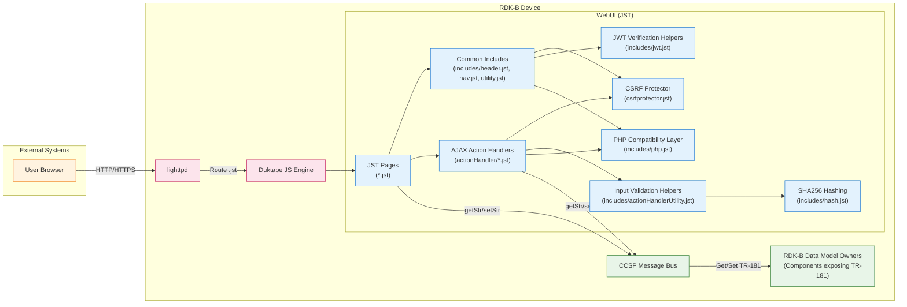

### Prerequisites and Dependencies

**Runtime prerequisites:**

This repository contains JST templates executed by the Duktape JavaScript engine. The server-side execution requires `lighttpd` configured to route `.jst` files to the Duktape runtime, which in turn requires access to the CCSP message bus for TR-181 parameter operations.

**Web server configuration (lighttpd):**

`lighttpd` must be configured with:
- A document root pointing to the directory containing the JST files.
- A handler/module for `.jst` files that dispatches them to the Duktape JavaScript engine.
- An error handler routing to `index.jst` as the entry point.

**Data model access dependencies:**

The Duktape runtime must expose the following global functions for CCSP/TR-181 data-model access:
- `getStr(path)` — Retrieve a single TR-181 parameter value.
- `setStr(path, value, commit)` — Set a TR-181 parameter with optional commit.
- `DmExtGetStrsWithRootObj(root, params)` — Batch retrieval of multiple parameters under a common root.
- `KeyExtGet(root, mapping)` — Get parameters with key-based mapping.
- `getInstanceIds(path)` — Retrieve table instance identifiers.

**Client-side library dependencies:**

Client-side JavaScript libraries in `cmn/js/lib/`:
- `jquery-3.7.1.js` — jQuery core library.
- `jquery.validate.js` — Form validation plugin.
- `jquery.radioswitch.js` — Radio button toggle widget.
- `junit.alerts.js` — Alert/confirmation dialog library.
- `bootstrap-waitingfor.js` — Progress/loading indicator.

**Localization resources:**

Localization uses the client-side jQuery i18n plugin. Files under `locale/` include `CLDRPluralRuleParser.js`, `jquery.i18n.*.js` modules, `global.js`, and translation JSON files (for example, `it.json`). Server-side locale detection reads `getenv("LANG")` and stores it in `$_SESSION['language']`.

**PHP compatibility layer:**

`includes/php.jst` provides a JavaScript reimplementation of common PHP functions (`array_push`, `array_pop`, `isset`, `empty`, `htmlspecialchars`, string manipulation functions, etc.), enabling the JST templates to use PHP-like syntax patterns familiar to developers migrating from the PHP-based WebUI.

### Component State Flow

**Initialization to Active State**

WebUI's lifecycle begins when `lighttpd` starts and begins routing requests to the Duktape engine. When a user accesses the device, requests are served starting from `index.jst` (login page) and routed through the authentication flow.

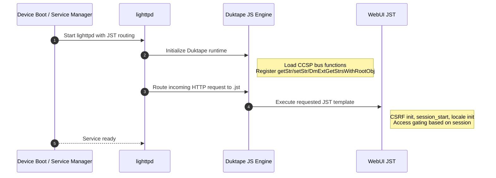

**Per-request bootstrapping and state initialization (includes/header.jst)**

The header include performs the following steps in order, all within the request's Duktape execution:

First, it includes the CSRF protector and calls `csrfProtector.init()`.

Next, it calls `session_start()` and sets locale based on `getenv("LANG")`. If the session language is not yet set, it configures localization and stores the selected locale in `$_SESSION['language']`.

It then enforces access gating. If `$_SESSION["loginuser"]` is not set, it checks `$_SESSION["JWT_VALID"]` and, when that flag is not present or not `true`, it returns a redirect to `home_loggedout.jst` before exiting.

After access gating, it reads and stores key mode and state session variables from TR-181 parameters:

- `Device.X_CISCO_COM_DeviceControl.LanManagementEntry.1.LanMode` — normalized to `bridge-static` or `router` (default), stored in `$_SESSION["lanMode"]`.
- `Device.X_CISCO_COM_DeviceControl.PowerSavingModeStatus` — normalized to `Enabled` or `Disabled` (default), stored in `$_SESSION["psmMode"]`.
- Branding parameters: `PartnerId`, `MSOLogoTitle`, `MSOLogo`, `ModelName` — stored for use by navigation and page rendering.
- RFC feature flags: `SecureWebUI.Enable`, `WebUI.Enable`, `hwHealthTest.Enable`, `CaptivePortalForNoCableRF.Enable`, and others — read to control feature availability.

**Runtime state changes and feature visibility (includes/nav.jst and action handlers)**

The navigation module (`includes/nav.jst`) uses both request/session state and live TR-181 values to decide which menu items are visible. It reads `PartnerId` and `ModelName` via `getStr()`, and it uses `$_SESSION["lanMode"]` and `$_SESSION["loginuser"]` to hide groups of pages in bridge mode and to change the menu for `admin` versus `mso` users. Partner-specific logic (for example, "sky-", "cox") controls visibility of certain features like MoCA, voice, and advanced options.

Action handlers also rely on session state to compute status. For example, `actionHandler/ajaxSet_userbar.jst` uses `$_SESSION["lanMode"]` and `$_SESSION["psmMode"]` to influence computed connectivity status, and it persists derived status values back into the session (for example, `$_SESSION['sta_inet']`, `$_SESSION['sta_wifi']`, `$_SESSION['sta_moca']`, `$_SESSION['sta_fire']`, `$_SESSION['sta_batt']`).

### Call Flow

**Initialization Call Flow**

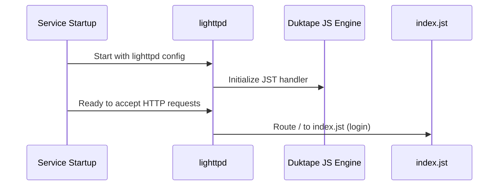

**Authentication Call Flow**

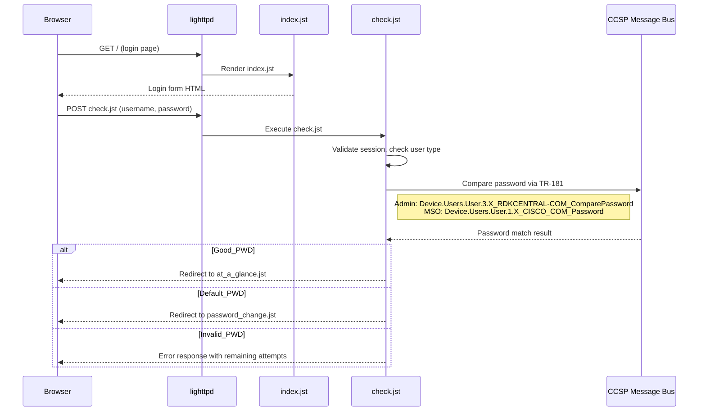

**Request Processing Call Flow (example: AJAX userbar status)**

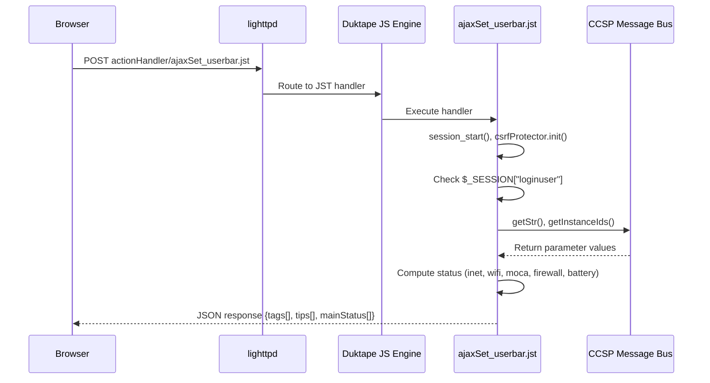

**Captive Portal Call Flow**

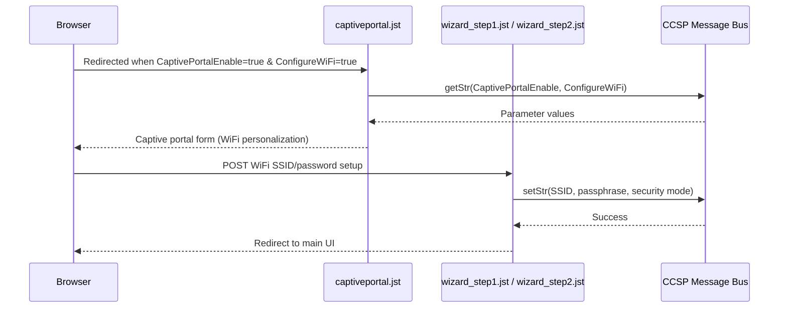

## Internal Modules

WebUI's repository structure provides clear module boundaries aligned to directories and common include points.

| Module | Description | Key Files |
|--------|------------|-----------|
| UI Pages | Server-rendered JST pages representing the management portal screens. Pages include shared header/nav/footer and call data-model functions to render current state. | `*.jst` (top-level): `at_a_glance.jst`, `wifi.jst`, `lan.jst`, `firewall_settings_ipv4.jst`, `connected_devices_computers.jst`, etc. |
| Common Includes | Shared bootstrapping and UI infrastructure, including session initialization, locale, access control gates, menu generation, and layout rendering. | `includes/header.jst`, `includes/nav.jst`, `includes/footer.jst`, `includes/utility.jst`, `includes/userbar.jst` |
| Action Handlers | AJAX endpoints that validate input and apply configuration changes or return data for dynamic UI elements. Accept POST with JSON `configInfo` + `csrfp_token`, return JSON responses. | `actionHandler/ajaxSet_*.jst`, `actionHandler/ajax_*.jst` |
| Action Handler Utilities | Shared input-validation utilities and helper functions used by action handlers; includes CSRF initialization. | `includes/actionHandlerUtility.jst`, `includes/actionHandlerUtility_captiveportal.jst` |
| CSRF Protection | Token generation, validation, and output buffering for CSRF protection on all POST requests. Configurable token length and cookie settings. | `csrfprotector.jst` |
| JWT Verification | OAuth/JWT token verification for MSO user authentication, including certificate-based signature validation with cached keys. | `includes/jwt.jst` |
| PHP Compatibility Layer | JavaScript reimplementation of common PHP functions (`array_*`, `isset`, `empty`, `htmlspecialchars`, string functions), enabling PHP-like syntax in JST templates. | `includes/php.jst` |
| Hash Utilities | SHA256 hashing and ASCII-to-hex conversion functions for password processing. | `includes/hash.jst` |
| Localization | Client-side jQuery i18n plugin and server-side locale includes for multi-language support. | `locale/global.js`, `locale/jquery.i18n.*.js`, `locale/it.json`, `includes/eng.jst`, `includes/fre.jst` |
| Client-Side Assets | Static CSS, JavaScript libraries, images, and syndication/branding resources. | `cmn/css/`, `cmn/js/`, `cmn/img/`, `cmn/syndication/` |

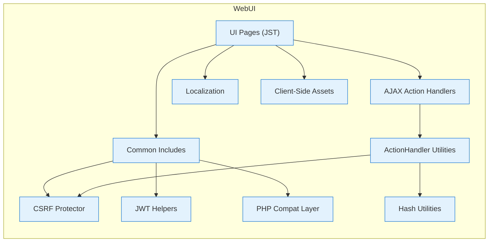

### UI Pages Inventory

The following table catalogs all top-level JST pages, grouped by functional area:

| Category | Page | Purpose |
|----------|------|---------|
| **Login & Setup** | `index.jst` | Login page (entry point) |
| | `home_loggedout.jst` | Logged-out landing page |
| | `check.jst` | Authentication handler |
| | `password_change.jst` | Admin password change |
| | `user_password_change.jst` | User password change |
| | `captiveportal.jst` | Captive portal WiFi personalization |
| | `wizard_step1.jst`, `wizard_step2.jst` | Initial setup wizard |
| **Dashboard** | `at_a_glance.jst` | Main dashboard / at-a-glance view |
| | `at_saving.jst` | Energy saving mode status |
| **Connection** | `connection_status.jst` | Connection status overview |
| | `network_setup.jst` | Network configuration |
| | `local_ip_configuration.jst` | LAN IP settings |
| | `wan_network.jst` | WAN network configuration |
| **WiFi** | `wifi.jst` | WiFi overview |
| | `wireless_network_configuration.jst` | WiFi network settings |
| | `wireless_network_configuration_edit.jst` | Edit WiFi network |
| | `wireless_network_configuration_wps.jst` | WPS configuration |
| | `wifi_spectrum_analyzer.jst` | WiFi spectrum analysis |
| **Firewall** | `firewall_settings_ipv4.jst` | IPv4 firewall settings |
| | `firewall_settings_ipv6.jst` | IPv6 firewall settings |
| **Device Info** | `software.jst` | Software/firmware information |
| | `hardware.jst` | Hardware status and info |
| | `battery.jst` | Battery status (MTA devices) |
| | `lan.jst` | LAN hardware/interface status |
| **Connected Devices** | `connected_devices_computers.jst` | Connected devices list |
| | `connected_devices_computers_add.jst` | Add device manually |
| **Parental Control** | `managed_sites.jst` | Managed sites list |
| | `managed_sites_add_keyword.jst`, `managed_sites_add_site.jst` | Add blocked keyword/site |
| | `managed_services.jst` | Managed services list |
| | `managed_services_add.jst`, `managed_services_edit.jst` | Add/edit managed service |
| | `managed_devices.jst` | Managed devices (allowed/blocked) |
| | `managed_devices_add_computer_allowed.jst`, `managed_devices_add_computer_blocked.jst` | Add allowed/blocked device |
| | `managed_devices_edit_allowed.jst`, `managed_devices_edit_blocked.jst` | Edit allowed/blocked device |
| | `parental_reports.jst`, `parental_reports_download.jst` | Parental control reports |
| **Advanced** | `port_forwarding.jst`, `port_forwarding_add.jst`, `port_forwarding_edit.jst` | Port forwarding rules |
| | `hs_port_forwarding.jst`, `hs_port_forwarding_add.jst`, `hs_port_forwarding_edit.jst` | Home security port forwarding |
| | `port_triggering.jst`, `port_triggering_add.jst`, `port_triggering_edit.jst` | Port triggering rules |
| | `remote_management.jst` | Remote management settings |
| | `dmz.jst` | DMZ configuration |
| | `routing.jst` | Static routing |
| | `dynamic_dns.jst`, `dynamic_dns_add.jst`, `dynamic_dns_edit.jst` | Dynamic DNS |
| | `device_discovery.jst` | UPnP/Zero Config/MAP settings |
| **Voice/MTA** | `mta_Line_Status.jst` | MTA line status |
| | `mta_Line_Diagnostics.jst` | MTA line diagnostics |
| | `mta_sip_packet_log.jst` | SIP packet log viewer |
| | `voice_quality_metrics.jst` | Voice quality metrics |
| | `voip_hidden.jst` | VoIP hidden/debug page |
| | `Voip_Debug_GlobalParameter.jst`, `Voip_Debug_ServiceProvider.jst` | VoIP debug pages |
| | `Voip_SipBasic_GlobalParamaters.jst`, `Voip_SipBasic_ServiceProvider.jst` | SIP basic config |
| | `Voip_SipAdvanced_ServiceProvider.jst` | SIP advanced config |
| **MoCA** | `moca.jst` | MoCA interface settings |
| | `moca_diagnostics.jst` | MoCA diagnostics |
| **QoS** | `qos.jst` | Quality of Service settings |
| **DPoE** | `DPoE.jst` | Distributed Power over Ethernet |
| **Diagnostics** | `network_diagnostic_tools.jst` | Ping, traceroute, DNS tools |
| | `troubleshooting_logs.jst`, `troubleshooting_logs_download.jst` | System logs |
| | `DSXlog.jst` | DSX log viewer |
| | `callsignallog.jst` | Call signal log viewer |
| **System** | `restore_reboot.jst` | Factory restore and reboot |
| | `no_rf_signal.jst` | No cable RF signal error page |
| | `trigger_spectrum_download.jst` | Spectrum analyzer file download |
| **Error** | `status-500.html` | HTTP 500 error page |

### Action Handlers Inventory

| Handler | Purpose |
|---------|---------|
| `ajaxSet_userbar.jst` | Status bar updates (Internet, WiFi, MoCA, firewall, battery) |
| `ajaxSet_index_userbar.jst` | Index page status bar variant |
| `ajaxSet_firewall_config.jst` | IPv4 firewall configuration changes |
| `ajaxSet_firewall_config_v6.jst` | IPv6 firewall configuration changes |
| `ajaxSet_wireless_network_configuration.jst` | WiFi network settings (SSID, password, security) |
| `ajaxSet_wireless_network_configuration_edit.jst` | Edit existing WiFi network |
| `ajaxSet_wireless_network_configuration_redirection.jst` | WiFi configuration with redirect |
| `ajaxSet_wireless_network_configuration_redirection_onewifi.jst` | OneWifi variant of WiFi redirect |
| `ajaxSet_wps_config.jst` | WPS configuration |
| `ajaxSet_wps_config_onewifi.jst` | OneWifi WPS variant |
| `ajaxSet_wizard_step1.jst`, `ajaxSet_wizard_step2.jst` | Setup wizard steps |
| `ajaxSet_wizard_step2_onewifi.jst` | OneWifi wizard step 2 |
| `ajaxSet_DMZ_configuration.jst` | DMZ enable/disable and IP config |
| `ajaxSet_IP_configuration.jst` | LAN IP configuration |
| `ajaxSet_wan_network.jst` | WAN network settings |
| `ajaxSet_hardware_lan.jst` | LAN hardware settings |
| `ajaxSet_moca_config.jst` | MoCA interface configuration |
| `ajaxSet_qos.jst` | QoS settings |
| `ajaxSet_Battery.jst` | Battery status retrieval |
| `ajaxSet_Reset_Restore.jst` | Factory reset and restore |
| `ajaxSet_RIP_configuration.jst` | Routing (RIP) configuration |
| `ajaxSet_UPnP_configuration.jst` | UPnP settings |
| `ajaxSet_trust_computer.jst` | Trust computer for managed devices |
| `ajaxSet_trust_computer_service.jst` | Trust computer for managed services |
| `ajaxSet_add_device.jst` | Add connected device |
| `ajaxSet_addDevice_blockedList.jst` | Add device to block list |
| `ajaxSet_add_blockedSite.jst` | Add blocked site |
| `ajaxSet_edit_blockedSite.jst` | Edit blocked site |
| `ajaxSet_remove_blockedSite.jst` | Remove blocked site |
| `ajaxSet_enable_manageSite.jst` | Enable/disable manage sites |
| `ajaxSet_checkRFSignal.jst` | Check cable RF signal status |
| `ajaxSet_Debug_GlobalParameter.jst` | VoIP debug global parameters |
| `ajaxSet_SIPBasic_GlobalParameter.jst` | SIP basic global parameters |
| `ajaxSet_SIPBasic_ServiceProvider.jst` | SIP basic service provider |
| `ajaxSet_SIPAdvanced_ServiceProvider.jst` | SIP advanced service provider |
| `ajaxSet_voip_debug.jst` | VoIP debug settings |
| `ajaxSet_voip_hidden.jst` | VoIP hidden page settings |
| `ajaxSet_mta_Line_Diagnostics.jst` | MTA line diagnostics |
| `ajaxSet_mta_sip_packet_log.jst` | MTA SIP packet log |
| `ajax_at_a_glance.jst` | Dashboard data retrieval |
| `ajax_at_saving.jst` | Energy saving mode data |
| `ajax_ddns.jst` | Dynamic DNS data |
| `ajax_hs_port_forwarding.jst` | Home security port forwarding data |
| `ajax_managed_devices.jst` | Managed devices data |
| `ajax_managed_services.jst` | Managed services data |
| `ajax_moca_diagnostics.jst` | MoCA diagnostics data |
| `ajax_network_diagnostic_tools.jst` | Diagnostic tools results |
| `ajax_parental_reports.jst` | Parental control reports data |
| `ajax_port_forwarding.jst` | Port forwarding data |
| `ajax_port_triggering.jst` | Port triggering data |
| `ajax_remote_management.jst` | Remote management data |
| `ajax_troubleshooting_logs.jst` | Troubleshooting logs retrieval |
| `ajax_wifi_spectrum_analyser.jst` | WiFi spectrum analyzer data |

## Component Interactions

WebUI interacts with several classes of dependencies, all device-local. CCSP data-model access via Duktape-exposed functions (`getStr`, `setStr`, `DmExtGetStrsWithRootObj`, `KeyExtGet`, `getInstanceIds`) handles all device state and configuration operations.

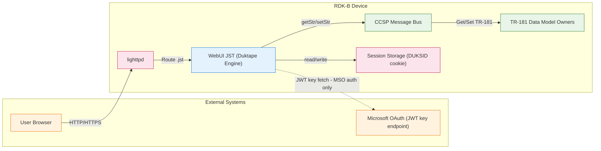

### Interaction Matrix

| Target Component/Layer | Interaction Purpose | Key APIs/Functions |
|------------------------|--------------------|--------------------|
| **Web Server Layer** | Serve JST pages and route requests to Duktape engine. | `lighttpd` routing `.jst` files to Duktape, error handler routing to `index.jst` |
| **CCSP Data Model (via message bus)** | Read and write TR-181 parameters and table instances used by pages and handlers. | `getStr(path)`, `setStr(path, value, commit)`, `DmExtGetStrsWithRootObj(root, params)`, `KeyExtGet(root, mapping)`, `getInstanceIds(path)` |
| **Session Storage** | Maintain user authentication state, device mode flags, and request context across requests. | `session_start()`, `$_SESSION["loginuser"]`, `$_SESSION["lanMode"]`, `$_SESSION["psmMode"]`, `$_SESSION["Csrf_token"]`, `$_SESSION["timeout"]`, cookie: `DUKSID` |
| **CSRF Protection** | Initialize CSRF protection for UI pages and action handlers, validate tokens on POST. | `csrfProtector.init()` in `includes/header.jst` and `includes/actionHandlerUtility.jst`; config in `csrfprotector.jst` |
| **JWT/OAuth Provider** | Verify MSO user tokens against Microsoft Azure AD for MSO authentication. | `includes/jwt.jst`: `openssl_verify_with_cert()`, key cache at `/tmp/.jwt/keys` (4-hour TTL), tenant ID `906aefe9-76a7-4f65-b82d-5ec20775d5aa` |
| **Localization System** | Provide multi-language UI strings. | jQuery i18n plugin (`locale/*.js`), `$.i18n()` calls, `includes/eng.jst`, `includes/fre.jst` |

**Events Published by WebUI:**

This repository does not contain an explicit RBus event publication module for WebUI itself. The principal mechanism for cross-component interaction is CCSP data-model access (get/set) rather than explicit event publishing. The WebUI does log actionable events using `webui_event_*` tags to `/rdklogs/logs/webui.log`.

### IPC Flow Patterns

**Primary IPC Flow — Read/compute status for UI elements (userbar example):**

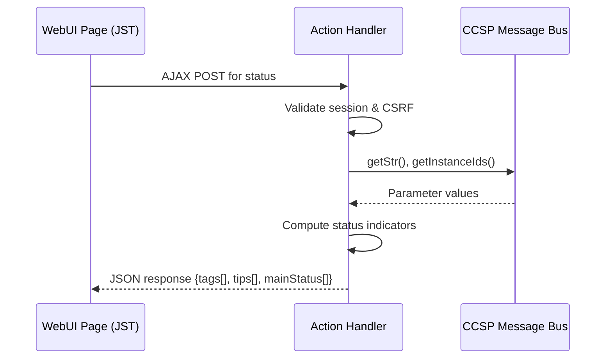

**Configuration Write Flow — Apply settings (firewall example):**

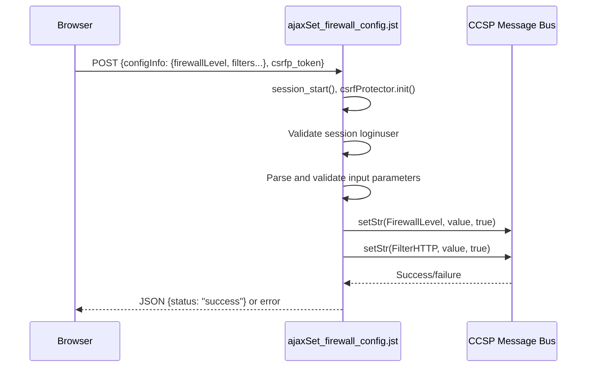

**Event Notification Flow:**

No explicit event-notification subsystem exists for WebUI. Dynamic updates use browser-initiated AJAX polling to `actionHandler` endpoints, which then query state via CCSP data-model operations. The userbar (`includes/userbar.jst`) implements periodic AJAX polling to update status indicators.

## Implementation Details

### Major HAL APIs Integration

No direct HAL API calls exist in the JST code. Hardware and subsystem interactions are mediated through the CCSP data model (via the Duktape-exposed functions `getStr`, `setStr`, `DmExtGetStrsWithRootObj`, etc.) rather than through linking to HAL libraries.

### Key Implementation Logic

WebUI's core logic is organized around these patterns:

- **Session and access enforcement in shared includes**: `includes/header.jst` starts a session, sets locale using `LANG`, performs access checks, and denies access if the session does not indicate a logged-in user or valid JWT session state. It also normalizes and stores device mode flags such as `lanMode` and `psmMode` into session variables after reading them via `DmExtGetStrsWithRootObj`.

- **Two-tier authentication**: `check.jst` implements two authentication methods:
  1. **POTD (Password on Terminal Device)** — Compares entered password against TR-181 parameters: `Device.Users.User.3.X_RDKCENTRAL-COM_ComparePassword` for admin users and `Device.Users.User.1.X_CISCO_COM_Password` for MSO users.
  2. **OAuth/JWT** — For MSO users, validates JWT tokens against Microsoft Azure AD with certificate-based signature verification and cached keys at `/tmp/.jwt/keys`.

- **Password lockout mechanism**: Failed login attempts are tracked via `Device.Users.User.*.NumOfFailedAttempts`. When `Device.UserInterface.PasswordLockoutEnable` is true, the system locks accounts after the configured number of attempts (`PasswordLockoutAttempts`) for a configurable duration (`PasswordLockoutTime` in milliseconds).

- **Dynamic navigation based on device state and partner identity**: `includes/nav.jst` reads partner and model identity (`PartnerId`, `ModelName`) and session mode (`lanMode`) to build the menu. Bridge mode disables router features (firewall, parental control, port forwarding, DMZ, routing, local IP). Partner-specific logic (for example, "sky-", "cox") controls visibility of voice, MoCA, and advanced features.

- **Input validation for action handlers**: `includes/actionHandlerUtility.jst` provides validation helpers including:
  - `validIPAddr($ip)` — IPv4 and IPv6 address validation.
  - `validMAC($mac)` — MAC address format check (with even first-byte requirement).
  - `validPort($port)` — Port range validation (1–65535).
  - `validTime($start, $end)` — Time range validation (HH:MM, only :00/:15/:30/:45).
  - `validDays($day)` — Day string validation.
  - `valid_ssid_name($ssid)` — SSID validation (1–32 ASCII, no reserved prefixes like XFI, XHS-, XH-).
  - `is_allowed_string($name)` — Character blacklist rejecting `< > & " ' |`.
  - `validURL($url)` — URL format validation.

- **Status computation and JSON serialization**: Action handlers like `actionHandler/ajaxSet_userbar.jst` read multiple TR-181 parameters via `getStr()`, compute status values (Internet connectivity, WiFi, MoCA, firewall level, battery), store derived values in the session, and return JSON-encoded output. Response pattern: `{status, tags[], tips[], mainStatus[]}`.

- **Power Saving Mode handling**: When `Device.X_CISCO_COM_DeviceControl.PowerSavingModeStatus` is `Enabled`, WiFi and MoCA features become unavailable and the UI displays appropriate messages.

- **Bridge Mode handling**: When `Device.X_CISCO_COM_DeviceControl.LanManagementEntry.1.LanMode` is `bridge-static`, router-specific features are hidden including local IP configuration, firewall, parental control, port forwarding/triggering, routing, DMZ, WiFi spectrum analyzer, and MoCA diagnostics.

- **Captive Portal flow**: `captiveportal.jst` activates when both `Device.DeviceInfo.X_RDKCENTRAL-COM_CaptivePortalEnable` and `Device.DeviceInfo.X_RDKCENTRAL-COM_ConfigureWiFi` are true, redirecting LAN users to WiFi personalization (SSID/password setup) through the wizard steps.

- **No RF Signal handling**: `no_rf_signal.jst` implements exponential backoff polling (`setTimeout` with `Math.pow(2, cnt)`) when cable RF signal is not detected, with English/French localization and branding customization.

- **File download handling**: `trigger_spectrum_download.jst` implements chunked file reading (1MB buffers) with proper HTTP headers for file attachment delivery and cleanup of temporary files after download.

- **Client-side page initialization**: All pages use a common initialization pattern via `gateway.page.init("Page Title", "nav-element-id")` from `cmn/js/gateway.js`, which sets up left navigation state, active menu highlighting, and page title.

### Key Configuration Parameters

| Parameter Path | Purpose | Used In |
|---------------|---------|---------|
| `Device.X_CISCO_COM_DeviceControl.LanManagementEntry.1.LanMode` | Bridge vs router mode | `includes/header.jst`, `includes/nav.jst` |
| `Device.X_CISCO_COM_DeviceControl.PowerSavingModeStatus` | Power saving mode | `includes/header.jst`, action handlers |
| `Device.DeviceInfo.X_RDKCENTRAL-COM_Syndication.PartnerId` | Partner/branding identity | `includes/nav.jst`, branding logic |
| `Device.DeviceInfo.ModelName` | Device model | Feature detection, special model handling |
| `Device.DeviceInfo.X_RDKCENTRAL-COM_CaptivePortalEnable` | Captive portal enabled | `captiveportal.jst`, `includes/header.jst` |
| `Device.DeviceInfo.X_RDKCENTRAL-COM_ConfigureWiFi` | WiFi setup required | `captiveportal.jst` |
| `Device.DeviceInfo.X_RDKCENTRAL-COM_RFC.Feature.SecureWebUI.Enable` | Secure WebUI flag | `includes/header.jst` |
| `Device.DeviceInfo.X_RDKCENTRAL-COM_RFC.Feature.WebUI.Enable` | WebUI feature flag | `includes/header.jst` |
| `Device.DeviceInfo.X_RDKCENTRAL-COM_RFC.Feature.OAUTH.AuthMode` | OAuth auth mode | `check.jst`, MSO login |
| `Device.UserInterface.PasswordLockoutEnable` | Password lockout enabled | `check.jst` |
| `Device.UserInterface.PasswordLockoutAttempts` | Max failed attempts | `check.jst` |
| `Device.UserInterface.PasswordLockoutTime` | Lockout duration (ms) | `check.jst` |

### TR-181 Data Model Parameters Reference

TR-181 parameters referenced across the WebUI codebase:

**Device Information:**
- `Device.DeviceInfo.ModelName`
- `Device.DeviceInfo.SoftwareVersion`
- `Device.DeviceInfo.X_RDKCENTRAL-COM_Syndication.PartnerId`
- `Device.DeviceInfo.X_RDKCENTRAL-COM_Syndication.RDKB_UIBranding.LocalUI.MSOLogoTitle`
- `Device.DeviceInfo.X_RDKCENTRAL-COM_Syndication.RDKB_UIBranding.LocalUI.MSOLogo`
- `Device.DeviceInfo.X_RDKCENTRAL-COM_Syndication.RDKB_UIBranding.LocalUI.HomeNetworkControl`
- `Device.DeviceInfo.X_RDKCENTRAL-COM_Syndication.RDKB_UIBranding.DefaultLanguage`
- `Device.DeviceInfo.X_RDKCENTRAL-COM_Syndication.RDKB_UIBranding.Connection.MSOmenu`
- `Device.DeviceInfo.X_RDKCENTRAL-COM_Syndication.RDKB_UIBranding.WiFiPersonalization.*`
- `Device.DeviceInfo.X_RDKCENTRAL-COM_Syndication.RDKB_UIBranding.Footer.*`
- `Device.DeviceInfo.X_RDKCENTRAL-COM_ConfigureWiFi`
- `Device.DeviceInfo.X_RDKCENTRAL-COM_CaptivePortalEnable`
- `Device.DeviceInfo.X_RDKCENTRAL-COM_CloudUIEnable`
- `Device.DeviceInfo.X_RDKCENTRAL-COM_CableRfSignalStatus`
- `Device.DeviceInfo.X_COMCAST-COM_WAN_IP`
- `Device.DeviceInfo.X_COMCAST-COM_WAN_IPv6`
- `Device.DeviceInfo.X_COMCAST-COM_CM_IP`

**RFC Feature Flags:**
- `Device.DeviceInfo.X_RDKCENTRAL-COM_RFC.Feature.SecureWebUI.Enable`
- `Device.DeviceInfo.X_RDKCENTRAL-COM_RFC.Feature.SecureWebUI.LocalFqdn`
- `Device.DeviceInfo.X_RDKCENTRAL-COM_RFC.Feature.WebUI.Enable`
- `Device.DeviceInfo.X_RDKCENTRAL-COM_RFC.Feature.WebUIRemoteMgtOption.Enable`
- `Device.DeviceInfo.X_RDKCENTRAL-COM_RFC.Feature.CaptivePortalForNoCableRF.Enable`
- `Device.DeviceInfo.X_RDKCENTRAL-COM_RFC.Feature.OAUTH.AuthMode`
- `Device.DeviceInfo.X_RDKCENTRAL-COM_RFC.Feature.OAUTH.ServerUrl`
- `Device.DeviceInfo.X_RDKCENTRAL-COM_RFC.Feature.hwHealthTest.Enable`

**Device Control:**
- `Device.X_CISCO_COM_DeviceControl.LanManagementEntry.1.LanIPAddress`
- `Device.X_CISCO_COM_DeviceControl.LanManagementEntry.1.LanMode`
- `Device.X_CISCO_COM_DeviceControl.LanManagementEntry_ApplySettings`
- `Device.X_CISCO_COM_DeviceControl.PowerSavingModeStatus`
- `Device.X_CISCO_COM_DeviceControl.IGMPSnoopingEnable`

**WiFi:**
- `Device.WiFi.RadioNumberOfEntries`
- `Device.WiFi.Radio.{1,2,3}.Enable`, `.Status`, `.OperatingFrequencyBand`
- `Device.WiFi.Radio.*.X_COMCAST_COM_RadioUpTime`
- `Device.WiFi.SSID.{1,2,17}.SSID`, `.Enable`, `.BSSID`, `.Status`
- `Device.WiFi.SSID.*.X_COMCAST-COM_DefaultSSID`
- `Device.WiFi.AccessPoint.*.Security.X_COMCAST-COM_KeyPassphrase`
- `Device.WiFi.AccessPoint.*.AssociatedDeviceNumberOfEntries`

**Ethernet:**
- `Device.Ethernet.X_RDKCENTRAL-COM_WAN.Enabled`
- `Device.Ethernet.X_RDKCENTRAL-COM_WAN.Port`
- `Device.Ethernet.Interface.*.Status`, `.MACAddress`, `.CurrentBitRate`, `.Upstream`
- `Device.Ethernet.InterfaceNumberOfEntries`

**Hosts:**
- `Device.Hosts.Host.*.IPAddress`, `.HostName`, `.Layer1Interface`, `.Active`
- `Device.Hosts.Host.*.X_CISCO_COM_ConnectedDeviceNumber`

**Firewall:**
- `Device.X_CISCO_COM_Security.Firewall.FirewallLevel`
- `Device.X_CISCO_COM_Security.Firewall.FilterHTTP`, `.FilterHTTPs`
- `Device.X_CISCO_COM_Security.Firewall.FilterAnonymousInternetRequests`
- `Device.X_CISCO_COM_Security.Firewall.FilterMulticast`
- `Device.X_CISCO_COM_Security.Firewall.FilterP2P`
- `Device.X_CISCO_COM_Security.Firewall.FilterIdent`

**Users & Auth:**
- `Device.Users.User.1.X_CISCO_COM_Password` (MSO)
- `Device.Users.User.1.NumOfFailedAttempts`
- `Device.Users.User.3.X_RDKCENTRAL-COM_ComparePassword` (Admin)
- `Device.Users.User.3.NumOfFailedAttempts`
- `Device.UserInterface.X_CISCO_COM_RemoteAccess.HttpEnable`
- `Device.UserInterface.X_CISCO_COM_RemoteAccess.HttpsEnable`
- `Device.UserInterface.PasswordLockoutEnable`
- `Device.UserInterface.PasswordLockoutAttempts`
- `Device.UserInterface.PasswordLockoutTime`

**MoCA:**
- `Device.MoCA.Interface.1.Enable`, `.Status`
- `Device.MoCA.Interface.1.X_CISCO_COM_NumberOfConnectedClients`

**Voice/MTA:**
- `Device.Services.VoiceService.1.VoiceProfile.1.Line.1.*`
- `Device.Services.VoiceService.1.VoiceProfile.1.SIP.*`
- `Device.Services.VoiceService.1.X_RDK-Central_COM_VoiceProcessState`
- `Device.Services.VoiceService.1.X_RDK-Central_COM_VoiceProcessStatus`
- `Device.X_COMCAST_COM_MTA.Battery.Installed`, `.RemainingCharge`, `.ActualCapacity`
- `Device.X_COMCAST_COM_MTA.Dect.Enable`, `.Dect.HandsetsNumberOfEntries`

**WAN:**
- `Device.X_RDK_WanManager.Version`
- `Device.X_RDK_WanManager.CPEInterface.*`
- `Device.X_RDK-Central_COM_WanAgent.IPV4WanConnectionState`
- `Device.X_RDK-Central_COM_WanAgent.IPV6WanConnectionState`

**Multi-LAN:**
- `Device.X_CISCO_COM_MultiLAN.PrimaryLANBridge`
- `Device.X_CISCO_COM_MultiLAN.PrimaryLANBridgeHSPorts`
- `Device.X_CISCO_COM_MultiLAN.HomeSecurityBridge`
- `Device.X_CISCO_COM_MultiLAN.HomeSecurityBridgePorts`

**Time:**
- `Device.Time.UTC_Enable`
- `Device.Time.TimeOffset`

### Security Measures

| Measure | Implementation |
|---------|----------------|
| **CSRF Protection** | `csrfProtector` token validation on all POST requests via `csrfp_token` field; 10-character tokens with session storage |
| **Session Hijacking Prevention** | IP address validation (`$_SERVER['REMOTE_ADDR']` consistency), `DUKSID` cookie with `httponly` flag |
| **Password Security** | SHA256 hashing (`includes/hash.jst`), ASCII-to-hex conversion, length and complexity validation |
| **XSS Prevention** | `htmlspecialchars()` output encoding via `includes/php.jst` |
| **Input Validation** | Comprehensive validation functions in `includes/actionHandlerUtility.jst` for all data model writes |
| **Authentication** | Two-tier: POTD via CCSP backend + OAuth/JWT for MSO users |
| **Authorization** | User type checks (`admin` vs `mso`), interface validation (LAN-only for admin) |
| **Password Lockout** | Configurable attempts threshold + timeout duration via TR-181 parameters |
| **Default Password Detection** | Automatic redirect to `password_change.jst` when `Default_PWD` status returned |
| **Security Headers** | `X-Robots-tag: noindex,nofollow` to prevent search engine indexing |
| **Character Blacklist** | `is_allowed_string()` rejects dangerous characters: `< > & " ' |` |
| **SSID Restrictions** | `valid_ssid_name()` blocks reserved prefixes (XFI, XHS-, XH-) |
| **Actionable Logging** | `webui_event_*` tags logged to `/rdklogs/logs/webui.log` |

### Client-Side Assets Structure

**CSS (`cmn/css/`):**

| File | Purpose |
|------|---------|
| `common.css` / `common-min.css` | Main application stylesheet |
| `global.css` | Theme/global styles |
| `styles.css` | Additional styles |
| `highContrast.css` | Accessibility high-contrast mode |
| `ie6.css` / `ie6-min.css` | Internet Explorer 6 compatibility |
| `ie7.css` / `ie7-min.css` | Internet Explorer 7 compatibility |
| `print.css` | Print media styles |
| `cp.css` | Captive portal styles |
| `no_rf.css` | No RF signal page styles |
| `pause-block.css` | Pause/block screen styles |
| `comcastPaginator.css` | Pagination component styles |
| `lib/jquery.radioswitch.css` | Radio button toggle widget styles |

**JavaScript (`cmn/js/`):**

| File | Purpose |
|------|---------|
| `gateway.js` | Global namespace, left navigation setup (`gateway.page.init()`), menu state management |
| `utilityFunctions.js` | IP conversion utilities (`ip4StrToBin`), timeout management |
| `comcastPaginator.js` | Pagination component |
| `lib/jquery-3.7.1.js` | jQuery core library |
| `lib/jquery.validate.js` | Form validation plugin |
| `lib/jquery.radioswitch.js` | Radio button toggle widget |
| `lib/junit.alerts.js` | Alert/confirmation dialog library |
| `lib/bootstrap-waitingfor.js` | Progress/loading indicator |

**Images (`cmn/img/`):**

Icons and assets for navigation (`arrows_nav.png`, `house.png`), status indicators (`check.png`, `fail.png`, `success.png`, `success_lg.png`), battery indicator (`icn_battery.png`), power indicator (`icn_on_off.png`), UI elements (`bg.jpg`, `btn_bg.png`, `gradient.png`), and loading animations (`loading.gif`, `progress.gif`).

**Syndication (`cmn/syndication/`):**

Partner branding resources including device pause screen assets (`device_pause_screen/`) and partner logos (`img/`).

### Localization System

| Component | Implementation |
|-----------|----------------|
| **Framework** | jQuery i18n plugin (`locale/jquery.i18n.*.js`) |
| **Core Setup** | `locale/global.js` — Translation initialization |
| **Plural Rules** | `locale/CLDRPluralRuleParser.js` |
| **Translation Files** | `locale/it.json` (Italian), language-specific JSON files |
| **Server-Side Includes** | `includes/eng.jst` (English), `includes/fre.jst` (French) |
| **Language Detection** | `getenv("LANG")` → `$_SESSION['language']` |
| **UI Translation** | `$.i18n('key')` for client-side string lookup |
| **Supported Locales** | English (en), French (fre), Italian (it), English GB (en_GB) |
| **Fallback Mechanism** | `locale/jquery.i18n.fallbacks.js` handles missing translations |

