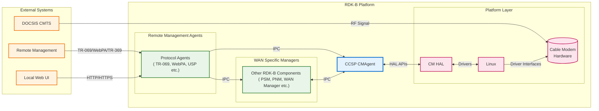
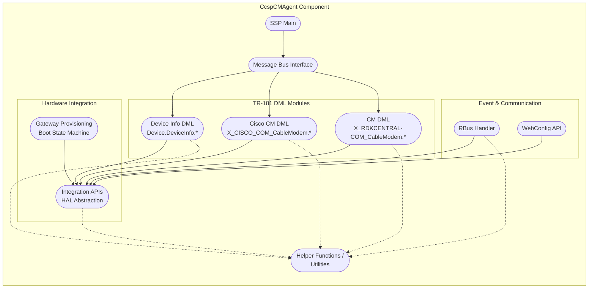
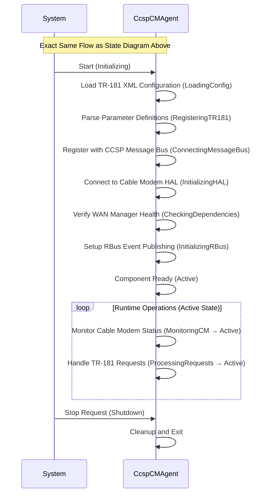
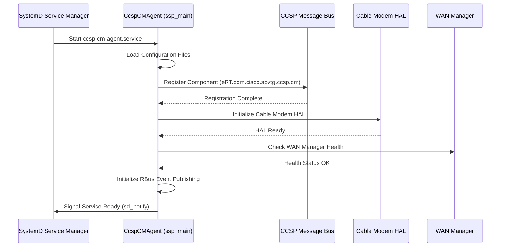
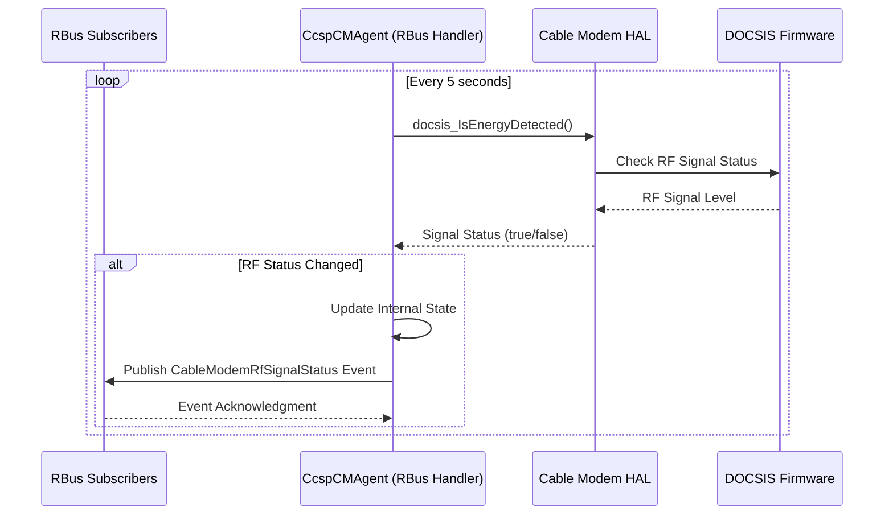
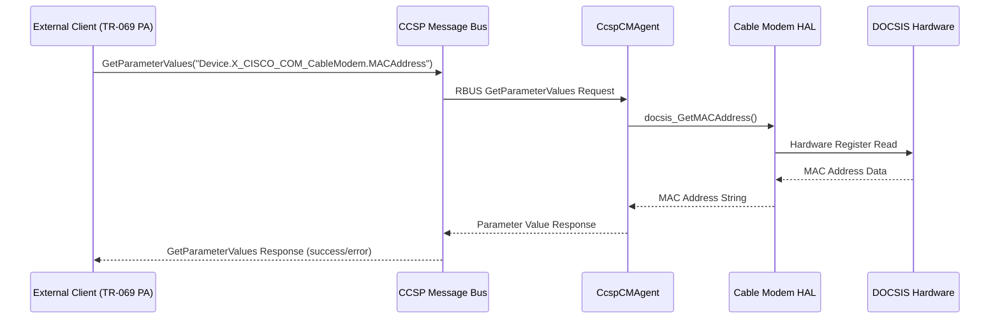
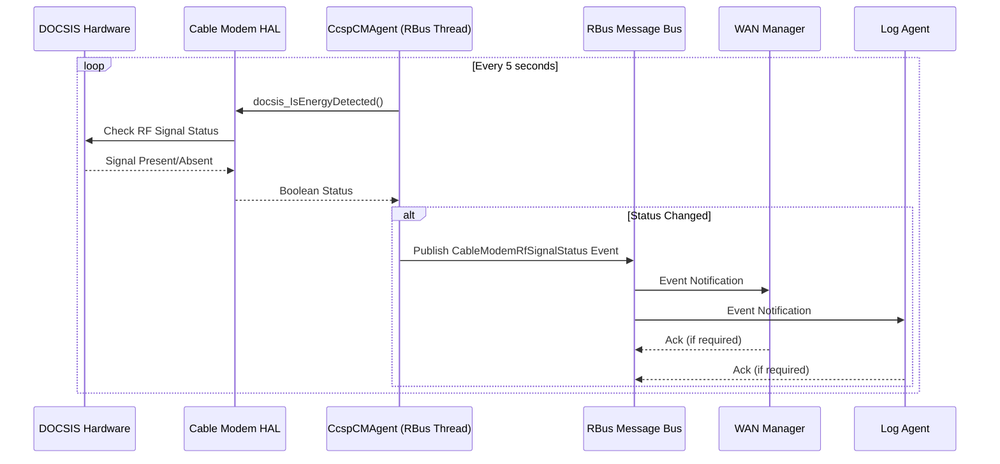

# CcspCMAgent Documentation

CcspCMAgent (CCSP Cable Modem Agent) is the RDK-B middleware component that provides comprehensive cable modem management and TR-181 data model implementation for DOCSIS-based gateway devices. This component serves as the primary interface between the RDK-B middleware stack and the underlying cable modem hardware, enabling remote management, monitoring, and configuration of cable modem functionality through standardized TR-181 parameters.

The component operates as a bridge between higher-level RDK-B management services and the cable modem Hardware Abstraction Layer (HAL), providing real-time status monitoring, configuration management, and event notification capabilities. It integrates seamlessly with the WAN Manager for connectivity coordination and supports both traditional message bus communication and modern RBus event-driven architecture for optimal performance and scalability.



**Key Features & Responsibilities**: 

- **DOCSIS Cable Modem Management**: Provides complete lifecycle management of cable modem operations including registration, authentication, and network access control through BPI (Baseline Privacy Interface) state management
- **TR-181 Data Model Implementation**: Implements comprehensive TR-181 parameter support for Device.DeviceInfo, X_CISCO_COM_CableModem, and X_RDKCENTRAL-COM_CableModem objects with full BBF compliance
- **Real-time Status Monitoring**: Continuously monitors cable modem RF signal status, DOCSIS link state, and network connectivity with event-driven notifications via RBus
- **WAN Integration Services**: Coordinates with WAN Manager for interface provisioning, providing cable modem interface abstraction and boot-time WAN configuration
- **Hardware Abstraction**: Interfaces with multiple HAL layers including CM, DHCP, Ethernet switch, MoCA, and platform-specific HALs for comprehensive hardware control
- **Remote Management Support**: Enables remote configuration management, firmware download orchestration, and telemetry data collection for service provider operations
- **Event-Driven Architecture**: Publishes real-time cable modem events including RF signal changes, link status updates, and registration state transitions via RBus messaging

## Design

The CcspCMAgent follows a layered architecture design that separates concerns between TR-181 data model management, cable modem hardware abstraction, and inter-component communication. The component is built around a service-oriented architecture where the main SSP (Service Support Platform) layer handles component lifecycle and message bus registration, while specialized middle-layer modules manage TR-181 parameter operations and hardware interaction.

The design emphasizes real-time responsiveness through event-driven programming patterns, utilizing both traditional CCSP message bus communication for backward compatibility and modern RBus event publishing for high-performance status monitoring. This dual-communication approach ensures seamless integration with legacy RDK-B components while providing enhanced capabilities for newer services requiring real-time cable modem status updates.

The component's modular design supports extensive customization through compile-time configuration options and runtime parameter tuning, enabling adaptation to various cable modem hardware platforms and service provider requirements. Integration with the WAN Manager is achieved through well-defined IPC mechanisms that coordinate cable modem interface provisioning during boot sequences and handle dynamic configuration changes during runtime operations.

Data persistence is managed through the PSM (Persistent Storage Manager) integration for configuration parameters and syscfg for operational settings, ensuring configuration state survives across system reboots. The component also implements comprehensive error handling and recovery mechanisms, including automatic retry logic for hardware communication failures and graceful degradation when dependent services are unavailable.



### Prerequisites and Dependencies

**Build-Time Flags and Configuration:**

| Configure Option | DISTRO Feature | Build Flag | Purpose | Default |
|------------------|----------------|------------|---------|---------|
| `--enable-wanmgr` | N/A | `ENABLE_RDK_WANMANAGER` | Enable WAN Manager integration and coordination features | Disabled |
| `--enable-wanfailover` | N/A | `FEATURE_WAN_FAIL_OVER` | Enable WAN failover detection and handling capabilities | Disabled |
| `--enable-core_net_lib_feature_support` | N/A | `CORE_NET_LIB_FEATURE_SUPPORT` | Enable advanced networking library support | Disabled |

**RDK-B Platform and Integration Requirements (MUST):**


- **RDK-B Components**: PSM (Persistent Storage Manager), CR (Component Registrar), WAN Manager for interface coordination, CCSP Message Bus for inter-component communication
- **HAL Dependencies**: Cable Modem HAL, DHCP Client HAL, Ethernet Switch HAL, Platform HAL
- **Systemd Services**: ccsp-cm-agent.service must start after network-online.target and before wanmanager.service
- **Message Bus**: CCSP Message Bus registration with component name "eRT.com.cisco.spvtg.ccsp.cm"
- **TR-181 Data Model**: Device.DeviceInfo.* parameter support from Platform Agent, X_CISCO_COM_CableModem.* namespace reservation
- **Configuration Files**: CcspCM.cfg, CcspCMDM.cfg, TR181-CM.XML for parameter definitions, /nvram/syscfg.db for persistent configuration
- **Startup Order**: Must initialize after PSM and Message Bus but before WAN Manager and dependent networking components
- **Resource Constraints**: Minimum 8MB RAM allocation, persistent storage access for configuration and logs

<br>

**Threading Model:**

CcspCMAgent implements a hybrid threading model that combines single-threaded CCSP message bus operations with multi-threaded RBus event handling for optimal performance and resource utilization.

- **Threading Architecture**: Multi-threaded with dedicated worker threads for specific operations
- **Main Thread**: Handles CCSP message bus operations, TR-181 parameter get/set operations, component lifecycle management, and synchronous HAL interactions
- **Worker Threads**:
    - **RBus Event Thread**: Manages RBus connection, publishes cable modem status events, handles subscriber notifications with 1-second polling interval
    - **HAL Monitor Thread**: Continuously monitors cable modem RF signal status and DOCSIS link state with configurable polling intervals
- **Synchronization**: Uses pthread mutexes for shared data structures, RBus internal synchronization for event publishing, and CCSP-provided synchronization primitives for message bus operations

### Component State Flow

**Initialization to Active State**

The CcspCMAgent component follows a structured initialization sequence that ensures proper dependency resolution and hardware readiness before transitioning to active operational state. The component implements comprehensive error handling during initialization with retry mechanisms for hardware communication failures.



**Runtime State Changes and Context Switching**

During runtime operations, CcspCMAgent manages multiple operational contexts including DOCSIS registration states, RF signal monitoring, and WAN interface coordination. The component implements state-aware processing to ensure consistent behavior across different cable modem operational states.

**State Change Triggers:**

- DOCSIS link status changes trigger immediate event publication and WAN Manager notification
- RF signal level variations beyond threshold values initiate diagnostic data collection and telemetry reporting  
- Remote configuration updates trigger parameter validation and atomic configuration commits
- Cable modem registration state changes coordinate with WAN Manager for interface provisioning

**Context Switching Scenarios:**

- Boot-time provisioning mode switches to operational monitoring after successful DOCSIS registration
- Firmware download mode temporarily suspends normal operations and enables download progress monitoring
- Factory reset mode clears all persistent configuration and reinitializes with default values

### Call Flow

**Initialization Call Flow:**



**Cable Modem Status Monitoring Call Flow:**



## TR‑181 Data Models

### Supported TR-181 Parameters

CcspCMAgent implements comprehensive TR-181 data model support following BBF specification guidelines with both standard Device.DeviceInfo parameters and vendor-specific extensions for cable modem functionality. The component provides full compliance with TR-181 Issue 2 Amendment 15 specifications while supporting custom extensions for advanced cable modem operations.

### Object Hierarchy

```
Device.
├── DeviceInfo.
│   ├── SerialNumber (string, R)
│   ├── ModelName (string, R)  
│   ├── Description (string, R)
│   ├── ProductClass (string, R)
│   ├── ManufacturerOUI (string, R)
│   └── HardwareVersion (string, R)
└── X_CISCO_COM_CableModem.
    ├── TelephonyDHCPStatus (string, R)
    ├── TelephonyTftpStatus (string, R)
    ├── TelephonyRegistrationStatus (string, R)
    ├── DOCSISDHCPAttempts (unsignedInt, R)
    ├── DOCSISTftpAttempts (unsignedInt, R)
    ├── MaxCpeAllowed (unsignedInt, R)
    ├── DOCSISConfigFileName (string, R)
    ├── ToDStatus (string, R)
    ├── UpstreamServiceFlowParams (string, R)
    ├── DownstreamServiceFlowParams (string, R)
    ├── DOCSISDownstreamDataRate (string, R)
    ├── DOCSISUpstreamDataRate (string, R)
    ├── MACAddress (string, R)
    ├── BPIState (boolean, R)
    ├── NetworkAccess (boolean, R)
    ├── UpgradeServerIP (string, R)
    ├── Market (string, R)
    ├── MDDIPOverride (string, R)
    ├── IPAddress (string, R)
    ├── BootFileName (string, R)
    ├── SubnetMask (string, R)
    ├── Gateway (string, R)
    └── X_RDKCENTRAL-COM_CableModem.
        ├── X_RDKCENTRAL-COM_FirmwareDownloadStatus (string, R/W)
        ├── X_RDKCENTRAL-COM_FirmwareDownloadProtocol (string, R/W)
        ├── X_RDKCENTRAL-COM_FirmwareDownloadURL (string, R/W)
        ├── X_RDKCENTRAL-COM_FirmwareToDownload (string, R/W)
        ├── X_RDKCENTRAL-COM_FirmwareDownloadNow (boolean, R/W)
        ├── X_RDKCENTRAL-COM_CableRfSignalStatus (boolean, R)
        └── DsOfdmChan.{i}.
            ├── ChannelId (unsignedInt, R)
            ├── CenterFrequency (unsignedInt, R)
            ├── SubcarrierSpacing (unsignedInt, R)
            ├── CyclicPrefix (string, R)
            ├── RollOffPeriod (string, R)
            ├── PlcTotalCodewords (unsignedLong, R)
            ├── PlcUnreliableCodewords (unsignedLong, R)
            └── NcpTotalFields (unsignedLong, R)
```

### Parameter Definitions

**Core Device Information Parameters:**

| Parameter Path | Data Type | Access | Default Value | Description | BBF Compliance |
|----------------|-----------|--------|---------------|-------------|----------------|
| `Device.DeviceInfo.SerialNumber` | string | R | `""` | Unique serial number assigned by the manufacturer for device identification and service provisioning | TR-181 Issue 2 |
| `Device.DeviceInfo.ModelName` | string | R | `""` | Model name of the device as assigned by the manufacturer, used for device capability identification | TR-181 Issue 2 |
| `Device.DeviceInfo.Description` | string | R | `""` | Textual description of the device including manufacturer, model, and basic capability information | TR-181 Issue 2 |
| `Device.DeviceInfo.ProductClass` | string | R | `""` | Product class identifier that categorizes the device type and expected feature set for management purposes | TR-181 Issue 2 |
| `Device.DeviceInfo.ManufacturerOUI` | string | R | `""` | Organizationally Unique Identifier (OUI) of the device manufacturer as assigned by IEEE registration authority | TR-181 Issue 2 |
| `Device.DeviceInfo.HardwareVersion` | string | R | `""` | Hardware version string assigned by manufacturer, typically indicating PCB revision and component specifications | TR-181 Issue 2 |

**Cable Modem Core Parameters:**

| Parameter Path | Data Type | Access | Default Value | Description | BBF Compliance |
|----------------|-----------|--------|---------------|-------------|----------------|
| `Device.X_CISCO_COM_CableModem.TelephonyDHCPStatus` | string | R | `""` | Current DHCP status for telephony services including states: NotStarted, InProgress, Complete, Failed, Renewing | Custom Extension |
| `Device.X_CISCO_COM_CableModem.TelephonyTftpStatus` | string | R | `""` | TFTP provisioning status for telephony configuration with enumerated values: NotStarted, InProgress, Complete, Failed | Custom Extension |
| `Device.X_CISCO_COM_CableModem.DOCSISDHCPAttempts` | unsignedInt | R | `0` | Total number of DHCP attempts made by cable modem during current boot cycle for IP address acquisition | Custom Extension |
| `Device.X_CISCO_COM_CableModem.DOCSISTftpAttempts` | unsignedInt | R | `0` | Number of TFTP configuration file download attempts during cable modem registration process | Custom Extension |
| `Device.X_CISCO_COM_CableModem.BPIState` | boolean | R | `false` | Baseline Privacy Interface (BPI) encryption state indicating whether data encryption is active on cable modem interface | Custom Extension |
| `Device.X_CISCO_COM_CableModem.NetworkAccess` | boolean | R | `false` | Network access permission status controlled by CMTS authorization policies and service flow configurations | Custom Extension |
| `Device.X_CISCO_COM_CableModem.MACAddress` | string | R | `""` | Hardware MAC address of cable modem interface used for DOCSIS registration and network identification | Custom Extension |

**RDK Central Extensions:**

| Parameter Path | Data Type | Access | Default Value | Description | BBF Compliance |
|----------------|-----------|--------|---------------|-------------|----------------|
| `Device.X_CISCO_COM_CableModem.X_RDKCENTRAL-COM_FirmwareDownloadStatus` | string | R/W | `"Not Started"` | Current firmware download status with values: Not Started, In Progress, Complete, Failed, Cancelled | Custom Extension |
| `Device.X_CISCO_COM_CableModem.X_RDKCENTRAL-COM_FirmwareDownloadURL` | string | R/W | `""` | URL for firmware image download supporting HTTP, HTTPS, and TFTP protocols with authentication support | Custom Extension |
| `Device.X_CISCO_COM_CableModem.X_RDKCENTRAL-COM_FirmwareDownloadNow` | boolean | R/W | `false` | Trigger parameter to initiate immediate firmware download when set to true, automatically resets to false | Custom Extension |
| `Device.X_CISCO_COM_CableModem.X_RDKCENTRAL-COM_CableRfSignalStatus` | boolean | R | `false` | Real-time RF signal detection status indicating presence of cable modem RF carrier signal for diagnostics | Custom Extension |

### Parameter Registration and Access

- **Implemented Parameters**: CcspCMAgent implements 45+ TR‑181 parameters across Device.DeviceInfo, X_CISCO_COM_CableModem, and X_RDKCENTRAL-COM_CableModem namespaces with complete validation and constraint enforcement
- **Parameter Registration**: Parameters are registered through CCSP Message Bus using component name "eRT.com.cisco.spvtg.ccsp.cm" with automatic namespace collision detection and resolution
- **Access Mechanism**: External components access parameters via CCSP Message Bus GetParameterValues/SetParameterValues operations with full transaction support and atomic commit capabilities
- **Validation Rules**: String parameters enforce maximum length constraints, numeric parameters validate range boundaries, and boolean parameters ensure proper true/false value conversion

## Internal Modules

CcspCMAgent is organized into specialized modules that handle distinct aspects of cable modem management and TR-181 data model implementation. Each module encapsulates specific functionality while maintaining clean interfaces for inter-module communication and external component integration.

| Module/Class | Description | Key Files |
|-------------|------------|-----------|
| **SSP Main** | Primary service support platform module handling component lifecycle, CCSP message bus registration, systemd service management, and dependency health monitoring | `ssp_main.c`, `ssp_global.h`, `ssp_internal.h` |
| **Message Bus Interface** | CCSP message bus communication handler managing parameter get/set operations, component registration, and inter-component messaging protocols | `ssp_messagebus_interface.c`, `ssp_messagebus_interface.h` |
| **Device Info DML** | Device.DeviceInfo TR-181 parameter implementation providing read-only device identification parameters including serial number, model, and manufacturer information | `cosa_device_info_dml.c`, `cosa_device_info_dml.h`, `cosa_device_info_internal.c` |
| **Cisco CableModem DML** | X_CISCO_COM_CableModem TR-181 object implementation handling DOCSIS-specific parameters, telephony status, and service flow management | `cosa_x_cisco_com_cablemodem_dml.c`, `cosa_x_cisco_com_cablemodem_dml.h`, `cosa_x_cisco_com_cablemodem_internal.c` |
| **RDK Central CableModem DML** | X_RDKCENTRAL-COM_CableModem TR-181 extensions for firmware management, RF signal monitoring, and advanced diagnostic capabilities | `cosa_x_rdkcentral_com_cablemodem_dml.c`, `cosa_x_rdkcentral_com_cablemodem_dml.h`, `cosa_x_rdkcentral_com_cablemodem_internal.c` |
| **RBus Handler** | Modern event-driven messaging system for real-time cable modem status publishing, subscriber management, and high-performance event distribution | `cosa_rbus_handler_apis.c`, `cosa_rbus_handler_apis.h` |
| **Integration APIs** | Hardware abstraction layer interface providing unified access to cable modem HAL, DHCP client HAL, and other hardware-specific operations | `cosa_x_cisco_com_cablemodem_apis.c`, `cosa_x_rdkcentral_com_cablemodem_apis.c` |
| **Helper Functions** | Utility module providing common operations including string manipulation, parameter validation, memory management, and logging facilities | `cmagent_helpers.c`, `cmagent_helpers.h` |
| **Gateway Provisioning** | Cable modem provisioning state machine managing boot-time registration, WAN interface coordination, and service provider configuration workflows | `gw_prov_sm.c`, `gw_prov_sm.h`, `gw_prov_abstraction.h` |

## Component Interactions

CcspCMAgent maintains extensive interactions with RDK-B middleware components, HAL layers, and external systems to provide comprehensive cable modem management functionality. The component serves as a critical integration point between higher-level management services and underlying hardware capabilities.

### Interaction Matrix

| Target Component/Layer | Interaction Purpose | IPC Mechanism | Message Format | Communication Pattern | Key APIs/Endpoints |
|------------------------|-------------------|---------------|----------------|---------------------|------------------|
| **RDK-B Middleware Components** |
| WAN Manager | Interface status reporting, boot-time WAN configuration coordination | CCSP Message Bus | CCSP Parameter XML | Synchronous Request-Response | `GetParameterValues`, `SetParameterValues`, `GetHealth` |
| Persistent Storage Manager | Configuration parameter persistence, factory reset coordination | CCSP Message Bus | CCSP Parameter XML | Synchronous Request-Response | `PSM_Get_Record_Value`, `PSM_Set_Record_Value` |
| Log Agent | Cable modem telemetry data, RF signal diagnostics, DOCSIS event logging | RBus | JSON Event Objects | Asynchronous Publish-Subscribe | `Device.LogAgent.X_RDKCENTRAL-COM_CM_LogLevel` |
| TR-069 Protocol Agent | Device identification parameters, cable modem status information | CCSP Message Bus | CCSP Parameter XML | Synchronous Request-Response | `Device.DeviceInfo.*`, `Device.X_CISCO_COM_CableModem.*` |
| **System & HAL Layers** |
| Cable Modem HAL | DOCSIS registration control, RF signal monitoring, MAC address retrieval | Direct Function Calls | C Structures | Synchronous Function Calls | `docsis_IsEnergyDetected()`, `docsis_GetCMStatus()`, `docsis_GetMACAddress()` |
| DHCP Client HAL | IP address configuration, DHCP lease management, gateway configuration | Direct Function Calls | C Structures | Synchronous Function Calls | `dhcpv4c_get_ert_lease()`, `dhcpv4c_get_ert_config_attempts()` |
| Ethernet Switch HAL | LAN port configuration, bridge interface management | Direct Function Calls | C Structures | Synchronous Function Calls | `GWP_GetEthWanLinkStatus()`, `GWP_SetEthWanLinkStatus()` |
| Platform HAL | System information, hardware identification, factory reset operations | Direct Function Calls | C Structures | Synchronous Function Calls | `platform_hal_GetSerialNumber()`, `platform_hal_GetModelName()` |
| **External Systems** |
| DOCSIS Network (CMTS) | Cable modem registration, service flow provisioning, network access authorization | DOCSIS Protocol | DOCSIS MAC Messages | Bi-directional Protocol | DOCSIS MAC Management Messages |

**Events Published by CcspCMAgent:**

| Event Name | Event Topic/Path | Trigger Condition | Subscriber Components |
|-------------|------------------|-------------------|------------------------|
| DocsisLinkStatus | `Device.X_CISCO_COM_CableModem.DocsisLinkStatus` | DOCSIS link up/down state change | WAN Manager, Log Agent |
| CableModemRfSignalStatus | `Device.X_CISCO_COM_CableModem.X_RDKCENTRAL-COM_CableRfSignalStatus` | RF signal detection change | WAN Manager, Diagnostic Agents |
| FirmwareDownloadStatus | `Device.X_CISCO_COM_CableModem.X_RDKCENTRAL-COM_FirmwareDownloadStatus` | Firmware download progress/completion | System Manager, Log Agent |


**Events Consumed by CcspCMAgent:**

| Event Source | Event Topic/Path | Purpose | Handler Function |
|---------------|------------------|----------|------------------|
| WAN Manager | `Device.X_RDK_WanManager.CPEInterface.{i}.Wan.Status` | React to WAN interface status changes | `HandleWanStatusChange()` |
| System Manager | `Device.DeviceInfo.X_RDKCENTRAL-COM_xOpsDeviceMgmt.RPC.RebootDevice` | Handle system reboot requests | `HandleSystemReboot()` |


### IPC Flow Patterns

**Primary IPC Flow - TR-181 Parameter Access:**



**Event Notification Flow:**



## Implementation Details

### Major HAL APIs Integration

CcspCMAgent integrates with multiple HAL interfaces to provide comprehensive cable modem hardware abstraction and control. The component implements robust error handling and retry mechanisms for all HAL interactions to ensure reliable operation under various hardware conditions.

**Core HAL APIs:**

| HAL API | Purpose | Implementation File |
|----------|----------|--------------------|
| `docsis_IsEnergyDetected` | Monitor cable modem RF signal presence for connectivity diagnostics | `cosa_x_cisco_com_cablemodem_apis.c` |
| `docsis_GetCMStatus` | Retrieve comprehensive cable modem operational status | `cosa_x_cisco_com_cablemodem_apis.c` |
| `docsis_GetMACAddress` | Get cable modem hardware MAC address for identification | `cosa_x_cisco_com_cablemodem_apis.c` |
| `dhcpv4c_get_ert_lease` | Retrieve current DHCP lease information for erouter interface | `cosa_x_cisco_com_cablemodem_apis.c` |
| `platform_hal_GetSerialNumber` | Get device serial number from platform hardware | `cosa_device_info_apis.c` |
| `platform_hal_GetModelName` | Retrieve device model name from platform configuration | `cosa_device_info_apis.c` |
| `GWP_GetEthWanLinkStatus` | Check Ethernet WAN link status for connectivity validation | `cosa_x_cisco_com_cablemodem_apis.c` |


### Key Implementation Logic

- **Cable Modem State Machine**: Core state management logic in `gw_prov_sm.c` handles DOCSIS registration phases including initial scanning, ranging, DHCP discovery, TFTP configuration download, and operational state transitions with comprehensive error recovery mechanisms

- **RF Signal Monitoring Engine**: Real-time RF signal detection logic in `cosa_rbus_handler_apis.c` implements continuous monitoring with configurable polling intervals, threshold-based event triggering, and automatic subscriber notification for signal presence changes. Configurable polling interval (default 5 seconds) with adaptive frequency based on signal stability. Event debouncing to prevent spurious notifications during signal fluctuations. Integration with diagnostic data collection for signal quality analysis.

- **Event Processing Architecture**: Asynchronous event handling system supporting both CCSP message bus and RBus protocols for maximum compatibility and performance. Multi-threaded event processing with dedicated RBus worker thread. Event queue management with priority-based processing and overflow protection. Subscriber lifecycle management with automatic cleanup and reconnection handling.

- **Error Handling Strategy**: Comprehensive error detection and recovery mechanisms throughout all hardware interaction layers. HAL operation retry logic with exponential backoff for transient failures. Component health monitoring with automatic restart coordination via systemd. Graceful degradation modes when dependent services are unavailable.

- **Logging & Debugging**: Multi-level logging system with component-specific categories and runtime verbosity control. CCSP trace integration for standardized RDK-B logging infrastructure. RBus event logging for real-time debugging of cable modem state changes. Performance metrics collection for HAL operation timing and success rates.

### Key Configuration Files

| Configuration File | Purpose | Override Mechanisms |
|--------------------|---------|---------------------|
| `/etc/ccsp/cm.cfg` | Main component configuration | Environment variables, compile-time defines |
| `/etc/ccsp/TR181-CM.XML` | TR‑181 parameter definitions | Not user-configurable |
| `/tmp/ccsp_msg.cfg` | CCSP message bus configuration | Component restart required |