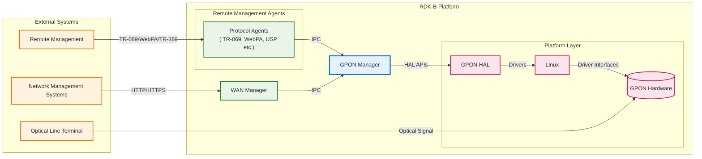
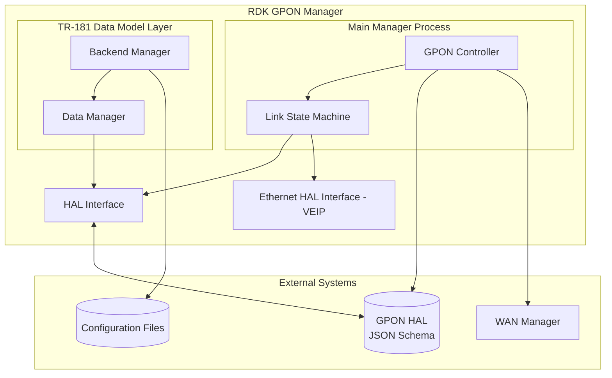
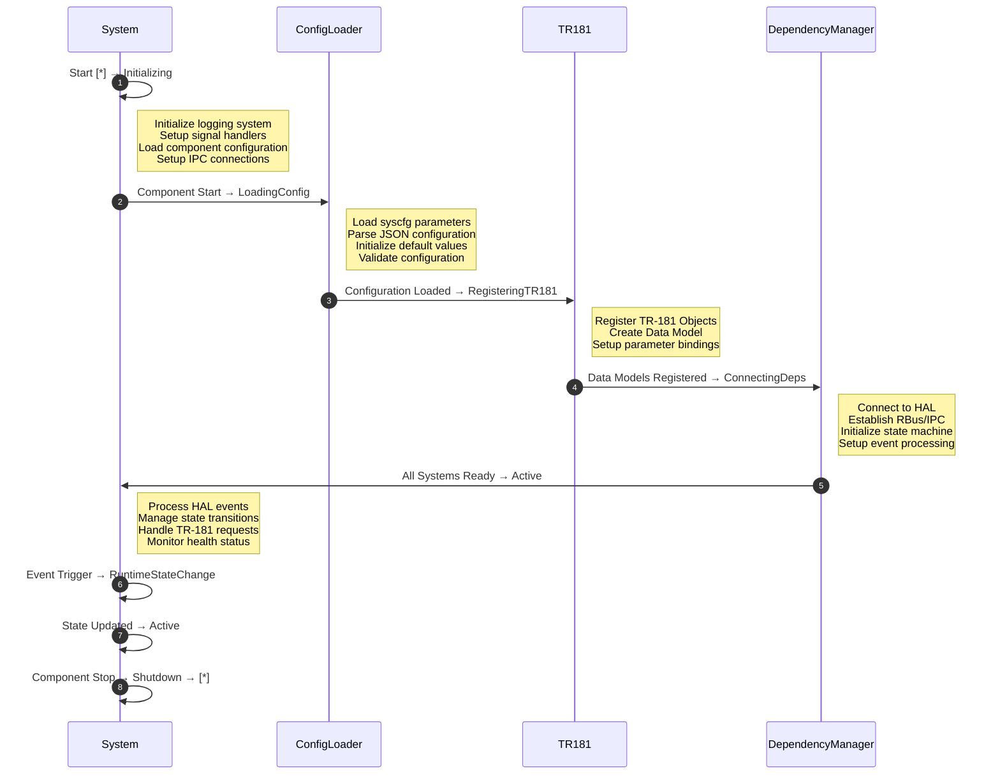
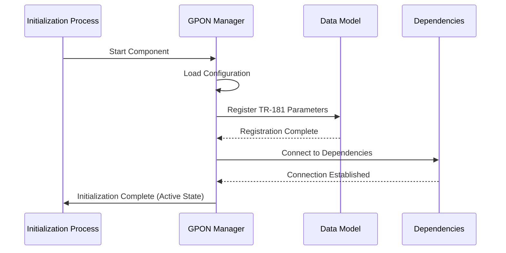
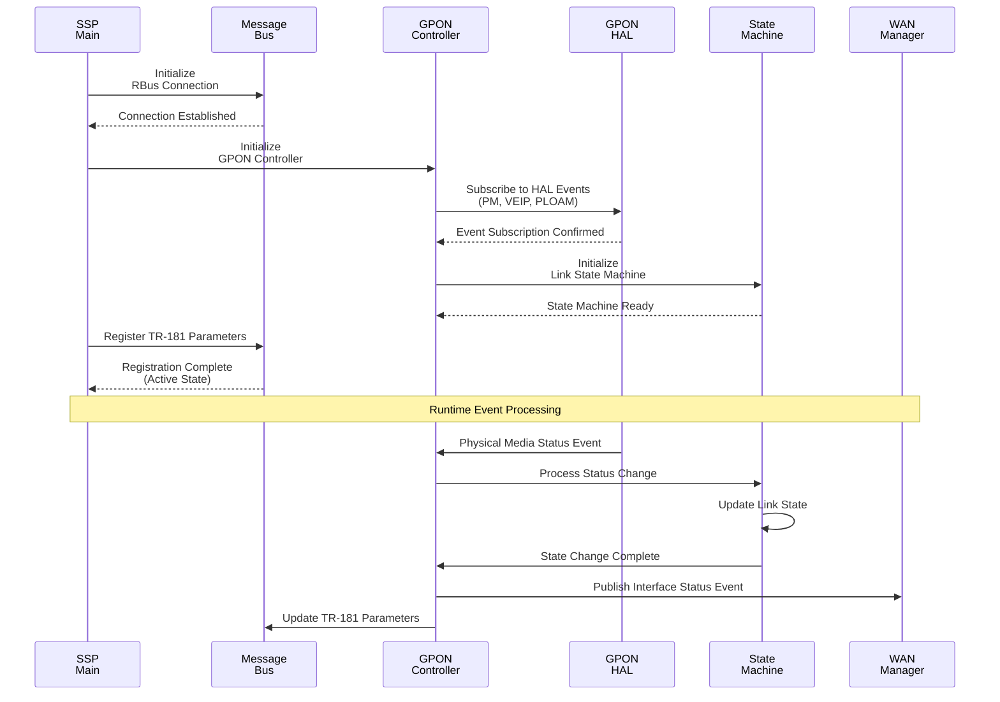
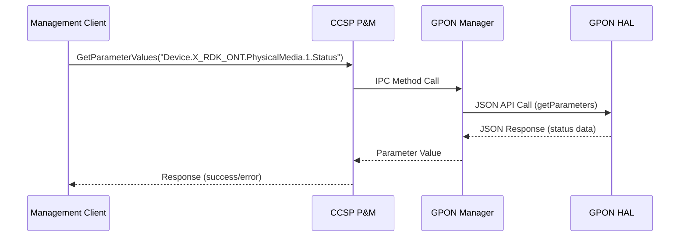
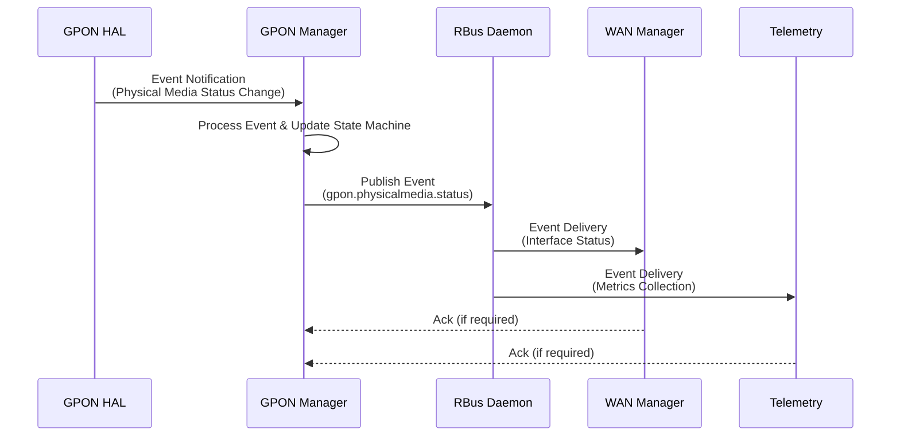

# GPON Manager Documentation

GPON Manager is the RDK-B component that manages GPON WAN functionality on fiber-optic broadband devices. It acts as the interface between the rest of the RDK-B software stack and the underlying GPON HAL, handling ONT operations, physical media monitoring, and virtual Ethernet interface point (VEIP) management. GPON Manager supports fiber-optic broadband deployment by providing configuration, monitoring, and state management capabilities. It maintains visibility into GPON link status, optical power levels, and media characteristics to support stable network performance. As a device-level service, GPON Manager ensures reliable fiber connectivity through optical signal monitoring, interface state management, and telemetry reporting for network operations.

At the module level, the GPON Manager implements a sophisticated state machine architecture that responds to hardware events, manages configuration persistence, and provides standardized TR-181 data model interfaces for integration with other RDK-B components and external management systems.




**Key Features & Responsibilities**: 

- **GPON Physical Media Management**: Monitors and manages physical media characteristics including optical power levels, signal quality, module information, and connection status for GPON interfaces
- **Link State Machine Management**: Implements sophisticated state management for GPON link status transitions, handling up/down states, dormant conditions, and error recovery scenarios
- **VEIP Interface Management**: Manages Virtual Ethernet Interface Point (VEIP) configurations, administrative states, and operational status for ethernet bridging over GPON
- **HAL Event Processing**: Subscribes to and processes hardware abstraction layer events including physical media status changes, alarm conditions, and PLOAM (Physical Layer Operations, Administration and Maintenance) registration states
- **TR-181 Data Model Implementation**: Provides comprehensive TR-181 parameter support for GPON ONT management with BBF-compliant object hierarchy and parameter validation


## Design

GPON Manager is architected around an event-driven design that integrates HAL interactions with standardized TR-181 data model management. The main design principle centers on responsive state management, where hardware events from the GPON chipset trigger well-defined state transitions that propagate through the system to update interface configurations, publish status changes to dependent components, and maintain persistent configuration state. This reactive architecture ensures minimal latency between hardware state changes and system response, critical for maintaining reliable fiber-optic connectivity.

The design strategically separates concerns through a layered architecture where the hardware abstraction interactions are isolated in dedicated modules, TR-181 data model operations are centralized in specialized data management components, and inter-process communication is handled through dedicated message bus interfaces. The north-bound integration with other RDK-B components utilizes RBus messaging for real-time event publication and TR-181 parameter access, ensuring both immediate notification capabilities and standardized parameter management. The south-bound integration with the GPON HAL leverages JSON-based API calls with schema validation, providing type-safe hardware interactions and enabling comprehensive error handling and recovery mechanisms.

The IPC architecture is designed around RBus messaging patterns, where RBus handles both high-frequency event publication for real-time status updates to components like WAN Manager and structured TR-181 parameter access required by management interfaces and configuration systems. Data persistence is achieved through a hybrid approach combining in-memory state management for operational data with file-based configuration storage for persistent settings, ensuring both performance optimization and reliable state recovery across system restarts.




### Prerequisites and Dependencies

**Build-Time DISTRO Features and Flags:** 

| DISTRO Feature | Purpose | Impact | Recipe Usage |
|----------------|---------|---------|--------------|
| `WanManagerUnificationEnable` | WAN Manager unification mode | Changes configuration files and HAL schema selection | `ISRDKB_WAN_UNIFICATION_ENABLED = true/false` |
| `rdkb_wan_manager` | Enhanced WAN Manager features | Adds `FEATURE_RDKB_WAN_MANAGER` compile flag | Optional WAN Manager integration |


**Configuration Files (Runtime Selection):**

| Configuration File | Selection Logic | Key Parameters | Purpose |
|--------------------|-----------------|----------------|---------|
| `gpon_manager_conf.json` | Used when WAN unification is disabled | `hal_schema_path`, `server_port` | Standard GPON Manager configuration |
| `gpon_manager_wan_unify_conf.json` | Used when `WanManagerUnificationEnable` DISTRO feature is enabled | `hal_schema_path`, `server_port` | WAN unification mode configuration |

**HAL Schema Files (Runtime Selection):**

| Schema File | Selection Logic | Purpose |
|-------------|-----------------|---------|
| `gpon_hal_schema.json` | Used when WAN unification is disabled | Standard GPON HAL API schema |
| `gpon_wan_unify_hal_schema.json` | Used when `WanManagerUnificationEnable` is enabled | Unified WAN GPON HAL API schema |

**RDK-B Platform and Integration Requirements:** 

* **RDK-B Components**: WAN Manager (interface coordination), CCSP P&M (TR-181 data model support), RBus Daemon (message bus framework), GPON HAL implementation
* **HAL Dependencies**: GPON HAL, Ethernet HAL for backhaul detection, Optical Module HAL for transceiver status monitoring
* **Systemd Services**: `rbus.service`, `ccsp-p-and-m.service` must be active before `gpon-manager.service` initialization
* **Hardware Requirements**: GPON-capable ONT chipset, SFP/BoB optical module cage, optical transceiver module compatible with the target hardware platform
* **Message Bus**: RBus registration under `gpon.*` namespace for real-time event publishing and telemetry reporting
* **TR-181 Data Model**: `Device.X_RDK_ONT.*` parameter tree support, including parameter validation and synchronization mechanisms
* **Configuration Files**: Persistent configuration maintained through `syscfg.db` and related GPON Manager configuration files
* **Startup Order**: HAL Initialization → GPON Manager → WAN Manager → Network Interface Activation sequence

**Dependent Components:** 

- WAN Manager depends on GPON Manager for interface status events and link state notifications
- CCSP P&M relies on GPON Manager for TR-181 Device.X_RDK_ONT.* parameter values and validation
- Network configuration scripts depend on VEIP state changes published via RBus messaging

<br>

**Threading Model:** 

The GPON Manager implements a single-threaded event-driven architecture optimized for deterministic response to hardware events and minimal resource consumption. The main application thread handles all core functionality including HAL event processing, state machine transitions, TR-181 parameter operations, and message bus communications through a centralized event loop mechanism.

- **Threading Architecture**: Single-threaded with event-driven processing loop for optimal performance and simplified synchronization
- **Main Thread**: Handles HAL event subscription/processing, state machine management, TR-181 operations, RBus messaging, and configuration persistence
- **Synchronization**: Mutex-protected data structures for shared GPON data objects, atomic operations for state transitions, event queue serialization
- **Event Processing**: Asynchronous event handling with priority queuing for critical HAL events, deferred processing for non-critical operations

### Component State Flow

**Initialization to Active State**

The GPON Manager follows a structured initialization sequence that ensures all dependencies are properly established before entering active operation. The component progresses through distinct initialization phases including system service startup, message bus registration, HAL connection establishment, configuration loading, and TR-181 parameter registration. Each phase includes comprehensive error handling and rollback mechanisms to ensure system stability.



**Runtime State Changes and Context Switching**

During normal operation, the GPON Manager responds to various hardware and software events that trigger state changes in the link state machine and interface management subsystems. These state changes are driven by optical signal quality variations, administrative commands, configuration updates, and hardware fault conditions.

**State Change Triggers:**

- Physical media status changes (optical power loss, signal degradation, module insertion/removal)
- Administrative state modifications via TR-181 parameter updates or management interface commands
- VEIP operational state transitions based on ethernet bridging status and lower layer availability
- PLOAM registration state changes affecting ONT authentication and service provisioning

**Context Switching Scenarios:**

- Link state transitions between Up/Down/Dormant states based on optical signal quality and registration status
- VEIP administrative state changes triggering interface enable/disable operations and WAN Manager notifications
- Configuration reload operations requiring temporary suspension of event processing and state machine reset
- Error recovery scenarios involving HAL reconnection, state machine reinitialization, and service restoration

### Call Flow

**Initialization Call Flow:**



**Request Processing Call Flow:**



## TR‑181 Data Models

### Supported TR-181 Parameters

GPON Manager implements comprehensive TR-181 parameter support following BBF TR-181 Issue 2 specification guidelines with custom RDK extensions for GPON-specific functionality. The implementation provides full CRUD operations for configuration parameters and read-only access to operational status and telemetry data.

### Object Hierarchy

```
Device.
└── X_RDK_ONT.
    ├── PhysicalMedia.{i}.
    │   ├── Cage (string, R)
    │   ├── ModuleVendor (string, R)
    │   ├── ModuleName (string, R)
    │   ├── ModuleVersion (string, R)
    │   ├── ModuleFirmwareVersion (string, R)
    │   ├── PonMode (string, R)
    │   ├── Connector (string, R)
    │   ├── NominalBitRateDownstream (uint32, R)
    │   ├── NominalBitRateUpstream (uint32, R)
    │   ├── Enable (boolean, R/W)
    │   ├── Status (string, R)
    │   ├── RedundancyState (string, R)
    │   ├── Alias (string, R/W)
    │   ├── LastChange (uint32, R)
    │   ├── LowerLayers (string, R/W)
    │   ├── Upstream (boolean, R)
    │   ├── RxPower.
    │   │   ├── SignalLevel (int, R)
    │   │   ├── SignalLevelLowerThreshold (int, R/W)
    │   │   └── SignalLevelUpperThreshold (int, R/W)
    │   ├── TxPower.
    │   │   ├── SignalLevel (int, R)
    │   │   ├── SignalLevelLowerThreshold (int, R/W)
    │   │   └── SignalLevelUpperThreshold (int, R/W)
    │   ├── Voltage.
    │   │   └── VoltageLevel (int, R)
    │   └── Bias.
    │       └── BiasLevel (uint32, R)
    └── VEIP.{i}.
        ├── Enable (boolean, R/W)
        ├── Status (string, R)
        ├── Alias (string, R/W)
        └── EthernetInterface (string, R/W)
```

### Parameter Definitions

**Core Parameters:**

| Parameter Path | Data Type | Access | Default Value | Description | BBF Compliance |
|----------------|-----------|--------|---------------|-------------|----------------|
| `Device.X_RDK_ONT.PhysicalMedia.{i}.Enable` | boolean | R/W | `true` | Enables or disables the physical media interface. When false, the interface is administratively disabled and will not establish optical link. | Custom Extension |
| `Device.X_RDK_ONT.PhysicalMedia.{i}.Status` | string | R | `"Down"` | Current operational status of the physical media. Enumerated values: Up, Down, Unknown, Dormant, NotPresent, LowerLayerDown, Error | TR-181 Issue 2 |
| `Device.X_RDK_ONT.PhysicalMedia.{i}.Cage` | string | R | `"SFP"` | Type of optical module cage. Enumerated values: BoB(0), SFP(1) indicating Board-on-Board or Small Form-factor Pluggable configuration | Custom Extension |
| `Device.X_RDK_ONT.PhysicalMedia.{i}.PonMode` | string | R | `"GPON"` | PON technology mode. Enumerated values: GPON(0), XG-PON(1), NG-PON2(2), XGS-PON2(3) | Custom Extension |
| `Device.X_RDK_ONT.PhysicalMedia.{i}.RxPower.SignalLevel` | int | R | `0` | Received optical power level in dBm multiplied by 10000 for precision. Negative values indicate power below 0 dBm | Custom Extension |
| `Device.X_RDK_ONT.PhysicalMedia.{i}.TxPower.SignalLevel` | int | R | `0` | Transmitted optical power level in dBm multiplied by 10000 for precision | Custom Extension |
| `Device.X_RDK_ONT.VEIP.{i}.Enable` | boolean | R/W | `false` | Administrative state of the Virtual Ethernet Interface Point. Controls ethernet bridging functionality | Custom Extension |
| `Device.X_RDK_ONT.VEIP.{i}.Status` | string | R | `"Down"` | Operational status of VEIP interface. Values: Up, Down, Error, Unknown | Custom Extension |

### Parameter Registration and Access

- **Implemented Parameters**: All Device.X_RDK_ONT.* parameters including PhysicalMedia table entries, VEIP configurations, optical power telemetry, and administrative controls
- **Parameter Registration**:  Parameters are registered during component initialization through RBus data model provider interface and structured TR-181 access by management interfaces
- **Access Mechanism**: External components access parameters through standard CCSP P&M interfaces using IPC method calls with automatic parameter validation and type conversion
- **Validation Rules**: Administrative parameters undergo range checking, enumeration validation, and dependency verification before application to hardware

## Internal Modules

The GPON Manager is structured around modules that handle distinct aspects of GPON functionality, from hardware abstraction to data model management. Each module is designed with clear responsibilities and well-defined interfaces to ensure maintainability and extensibility.

| Module/Class | Description | Key Files |
|-------------|------------|-----------|
| **GPON Controller** | Central orchestration module responsible for HAL event subscription, state machine coordination, and inter-component communication. Manages the primary event processing loop and coordinates responses to hardware state changes. | `gponmgr_controller.c`, `gponmgr_controller.h` |
| **Link State Machine** | Implements the core state machine logic for GPON link management, handling transitions between Up, Down, Dormant, and Error states based on hardware conditions and administrative commands. | `gponmgr_link_state_machine.c`, `gponmgr_link_state_machine.h` |
| **SSP Main** | Service Startup Process main module providing component initialization, signal handling, and integration with RDK-B service management infrastructure. | `ssp_main.c`, `ssp_global.h`, `ssp_internal.h` |
| **Message Bus Interface** | Abstraction layer for RBus communications, providing unified interfaces for event publication, parameter registration, and inter-process messaging. | `ssp_messagebus_interface.c`, `ssp_messagebus_interface.h` |
| **DML Backend Manager** | TR-181 Data Model Layer backend management providing the foundation for parameter operations, data validation, and persistence mechanisms. | `gponmgr_dml_backendmgr.c`, `gponmgr_dml_backendmgr.h` |
| **DML Data Manager** | Central data structure management for all GPON operational and configuration data, including thread-safe access patterns and memory management. | `gponmgr_dml_data.c`, `gponmgr_dml_data.h` |
| **DML HAL Interface** | Hardware Abstraction Layer communication module providing JSON-based API calls, schema validation, and error handling for hardware interactions. | `gponmgr_dml_hal.c`, `gponmgr_dml_hal.h` |
| **DML Ethernet Interface** | VEIP (Virtual Ethernet Interface Point) management module handling ethernet interface configuration, state tracking, and WAN Manager integration. | `gponmgr_dml_eth_iface.c`, `gponmgr_dml_eth_iface.h` |


## Component Interactions

The GPON Manager maintains extensive interactions with both RDK-B middleware components and external systems through well-defined communication patterns. These interactions enable comprehensive fiber-optic network management while maintaining loose coupling with dependent systems.

### Interaction Matrix

| Target Component/Layer | Interaction Purpose | Key APIs/Endpoints |
|------------------------|---------------------|--------------------|
| **RDK-B Middleware Components** |
| WAN Manager | Interface status synchronization and link state notifications | `Device.X_RDK_Ethernet.Interface.Status`, `gpon.interface.status` |
| CCSP P&M | TR-181 parameter management and data model operations | `GetParameterValues()`, `SetParameterValues()`, `GetParameterNames()` |
| RBus Daemon | Real-time event publication and component discovery | `rbus_open()`, `rbusEvent_Publish()`, `rbusMethod_InvokeAsync()` |
| **System & HAL Layers** |
| GPON HAL | Hardware control and status monitoring | `gpon_getParameters()`, `gpon_setParameters()`, `gpon_subscribeEvent()` |
| System Events | Real-time system state communication | `sysevent_set()`, `sysevent_get()`, event subscriptions |
| Configuration Storage | Persistent configuration and state management | `/etc/rdk/gpon_manager_conf.json`, `/etc/rdk/schemas/` |


**Events Published by GPON Manager:**

| Event Name | Event Topic/Path | Trigger Condition | Subscriber Components |
|-------------|------------------|-------------------|-----------------------|
| PhysicalMediaStatusChange | `gpon.physicalmedia.status` | Physical media link state transitions (Up/Down/Error) | WAN Manager, Telemetry |
| OpticalPowerAlarm | `gpon.opticalalarm` | RX/TX power threshold violations | Network Management, Telemetry |
| VEIPStateChange | `gpon.veip.state` | VEIP administrative or operational state changes | WAN Manager, Interface Manager |
| PloamRegistrationState | `gpon.ploam.registration` | ONT registration state with OLT changes | Network Management, Telemetry |


**Events Consumed by GPON Manager:**

| Event Source | Event Topic/Path | Purpose | Expected Payload | Handler Function |
|---------------|------------------|----------|------------------|------------------|
| GPON HAL | `gpon.hal.physicalmedia.status` | React to hardware-level physical media state changes |  | `eventcb_PhysicalMediaStatus()` |
| GPON HAL | `gpon.hal.veip.adminstate` | Handle VEIP administrative state changes from hardware |  | `eventcb_VeipAdministrativeState()` |
| System Configuration | `system.config.reload` | Reload component configuration from persistent storage |  | `config_reload_handler()` |

### IPC Flow Patterns

**Primary IPC Flow - Parameter Access:**



**Event Notification Flow:**



## Implementation Details

### Major HAL APIs Integration

The GPON Manager integrates with the hardware abstraction layer through a comprehensive JSON-based API that provides type-safe communication and schema validation. The HAL interface follows a standardized pattern for parameter operations, event subscriptions, and hardware control.

**Core HAL APIs:**

| HAL API | Purpose | Implementation File |
|----------|----------|---------------------|
| `gpon_getParameters` | Retrieve hardware parameter values including optical power, module information, and status data | `gponmgr_dml_hal.c` |
| `gpon_setParameters` | Configure hardware parameters such as power thresholds and administrative states | `gponmgr_dml_hal.c` |
| `gpon_subscribeEvent` | Subscribe to hardware event notifications for real-time status monitoring | `gponmgr_controller.c` |
| `gpon_getSchema` | Retrieve HAL schema definitions for parameter validation and API discovery | `gponmgr_dml_hal.c` |
| `gpon_publishEvent` | Receive asynchronous event notifications from hardware layer | `gponmgr_controller.c` |

### Key Implementation Logic

- **State Machine Engine**: The core state machine implementation resides in `gponmgr_link_state_machine.c` and provides deterministic state transitions for GPON link management. The engine processes hardware events, administrative commands, and timeout conditions to maintain accurate interface state representation. State transition logic includes comprehensive error handling, recovery mechanisms, and event logging for operational visibility.

- **Event Processing**: Hardware events are processed through a centralized event handling mechanism in `gponmgr_controller.c` that subscribes to HAL notifications for physical media status, VEIP state changes, and PLOAM registration events. The event processing includes priority-based queuing, event correlation, and automatic retry mechanisms for failed operations.

- **Error Handling Strategy**: Error detection and recovery mechanisms are implemented throughout the component with graduated response levels including automatic retry for transient failures, state machine reset for persistent errors, and component restart for critical failures. Error conditions are logged with appropriate severity levels and propagated to dependent components through status parameter updates.

- **Logging & Debugging**: The component implements comprehensive logging using RDK-B standard logging facilities with configurable verbosity levels for different subsystems. Debug capabilities include HAL communication tracing, state machine transition logging, and event flow monitoring with specialized debug hooks for troubleshooting optical connectivity issues.

### Key Configuration Files

| Configuration File | Purpose | Override Mechanisms |
|--------------------|---------|---------------------|
| `gpon_manager_conf.json` | Main component configuration | Environment variables, command line |
| `gpon_hal_schema.json` | HAL API schema validation | HAL vendor updates |
| `RdkGponManager.xml` | TR-181 data model definitions | Compile-time configuration |
| `gpon_manager_wan_unify_conf.json` | WAN unification configuration | Build flags, runtime detection |