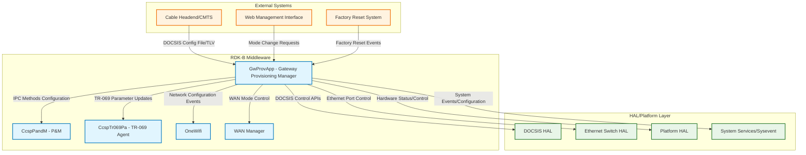
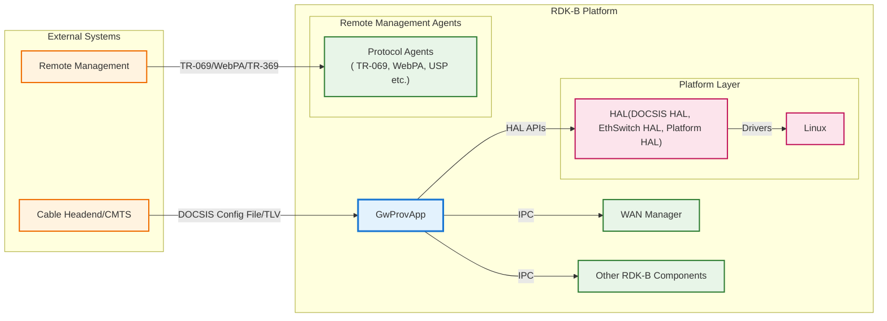
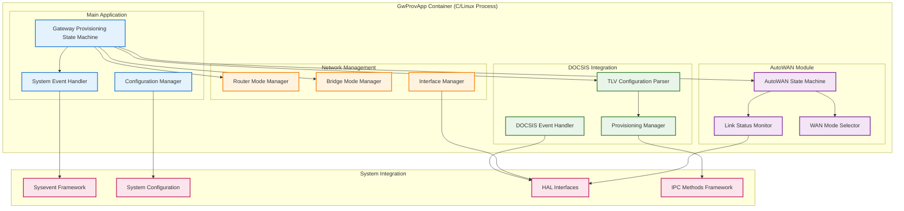
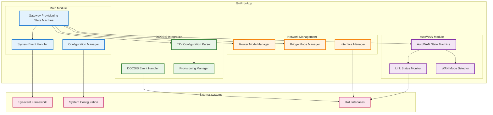
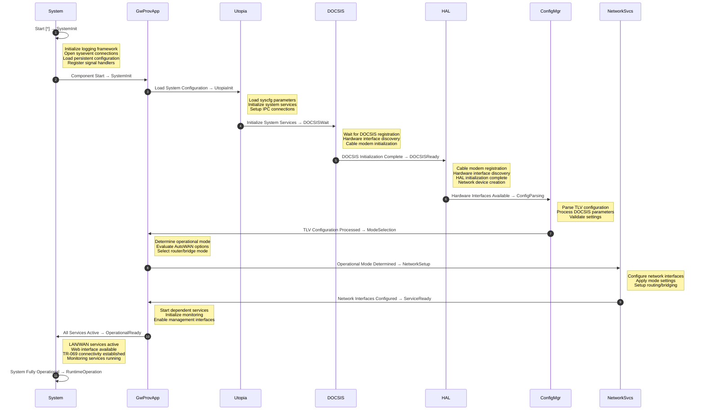
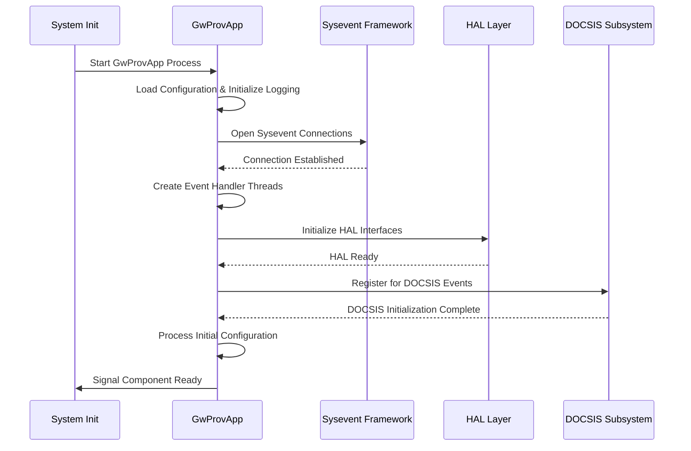
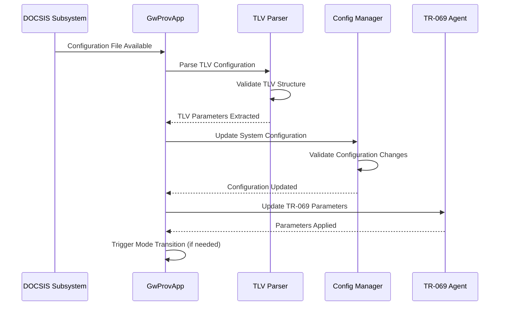
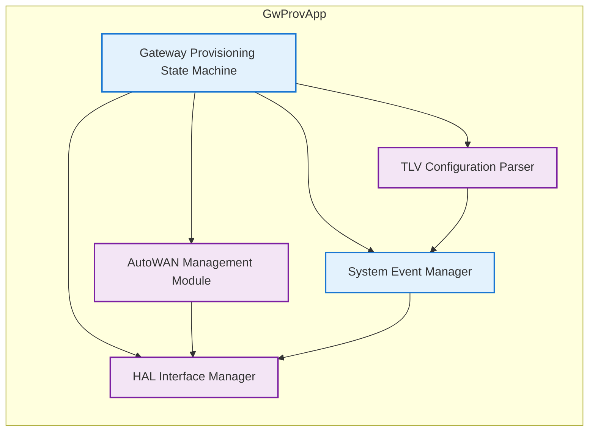
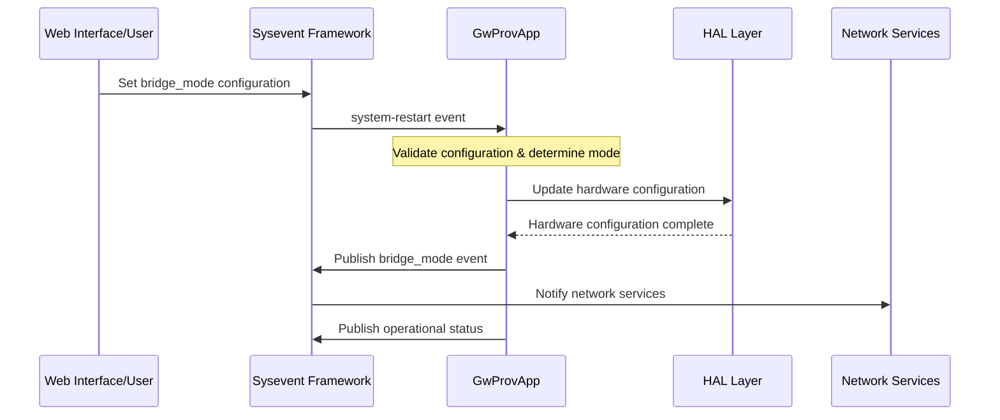
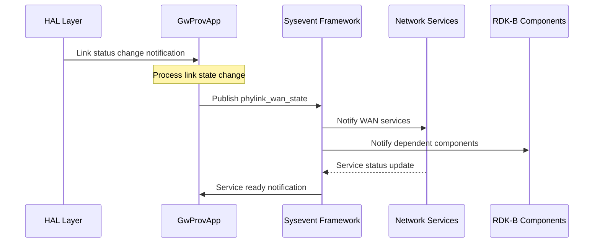

# GwProvApp Documentation

The Gateway Provisioning Application (GwProvApp) is the RDK-B middleware component responsible for managing gateway device initialization, mode configuration, and provisioning state machine operations. It orchestrates the transition between different operational modes (router/bridge) based on configuration file parsing, system events, and provisioning requirements. GwProvApp serves as the central coordinator for device startup sequence, handling DOCSIS initialization, WAN connectivity management, and system configuration establishment. GwProvApp provides essential services to the RDK-B ecosystem by managing device provisioning workflows, coordinating with DOCSIS subsystems for cable modem functionality, and maintaining operational state transitions. At the device level, it ensures proper initialization sequence coordination, enables dynamic WAN mode switching between DOCSIS and Ethernet WAN (AutoWAN), and provides configuration management through TLV parsing and system configuration integration.

At the module level, GwProvApp implements a sophisticated state machine that handles provisioning events, manages eRouter operational modes, coordinates with HAL layers for hardware abstraction, and integrates with sysevent framework for inter-process communication across the RDK-B middleware stack. 

**old diagram**

  

**new diagram**

**Key Features & Responsibilities**: 

- **Gateway Provisioning State Machine**: Orchestrates device initialization sequence from DOCSIS registration through operational readiness, managing transitions between unprovisioned, provisioning, and fully operational states
- **Router/Bridge Mode Management**: Dynamically switches between router mode (IPv4/IPv6/dual-stack) and bridge modes (primary/global bridge) based on configuration files, user preferences, and operational requirements
- **AutoWAN Technology Selection**: Automatically detects and configures optimal WAN connectivity method between DOCSIS cable modem and Ethernet WAN interfaces based on link availability and configuration policies
- **DOCSIS Configuration File Processing**: Parses and processes DOCSIS configuration files containing TLV (Type-Length-Value) encoded parameters for TR-069, eRouter modes, and operational parameters
- **System Event Coordination**: Integrates with sysevent framework to coordinate startup sequences, network interface management, and inter-component communication across the RDK-B middleware stack
- **Hardware Abstraction Integration**: Interfaces with multiple HAL layers including DOCSIS, Ethernet switch, platform HAL for hardware control and status monitoring

## Design

GwProvApp follows a sophisticated event-driven state machine architecture designed to handle the complex initialization and operational mode management requirements of RDK-B gateway devices. The design emphasizes reliability, configurability, and seamless integration with both legacy DOCSIS infrastructure and modern Ethernet WAN deployments. The component implements a multi-threaded architecture with dedicated event handling threads, configuration processing modules, and hardware interface management layers.

The core design philosophy centers around maintaining system stability during mode transitions while providing flexibility for different deployment scenarios. The state machine handles asynchronous events from multiple sources including DOCSIS subsystem notifications, network interface status changes, user configuration updates, and external provisioning triggers. This design ensures that the gateway can adapt to changing network conditions and configuration requirements without requiring system restarts in most scenarios.

The north-bound interfaces integrate seamlessly with RDK-B middleware components through IPC methods (RBus), providing configuration updates, operational status, and event notifications. South-bound integration leverages HAL APIs for hardware control, syscfg for persistent configuration management, and sysevent for real-time system coordination. The design incorporates robust error handling, recovery mechanisms, and comprehensive logging to support field deployment requirements and troubleshooting scenarios.

**old diagram**

**new diagram**

### Prerequisites and Dependencies

**DISTRO_FEATURES-based Build Flags:**

| DISTRO_FEATURES Flag | Compile-time Macros | Purpose | Default State | Impact on Build |
|----------------------|-------------------|---------|---------------|-----------------|
| `dslite` | `-DDSLITE_FEATURE_SUPPORT` | Enable DS-Lite (Dual-Stack Lite) IPv6 transition technology support | Disabled | Adds IPv6/IPv4 tunneling capabilities |

 

**RDK-B Platform and Integration Requirements:**

- **Build Dependencies**: ccsp-common-library, hal-cm, hal-dhcpv4c, hal-ethsw, hal-moca, hal-platform, hal-wifi, utopia, telemetry, safec (optional)
- **RDK-B Components**: CcspCommonLibrary for base CCSP functionality, Utopia for system service coordination, sysevent daemon for inter-process communication
- **HAL Dependencies**: Cable Modem HAL (hal-cm), Ethernet Switch HAL (hal-ethsw), Platform HAL (hal-platform), DHCP v4 Client HAL, required for hardware abstraction
- **Systemd Services**: sysevent service must be active, syscfg service for configuration persistence, platform-specific initialization services
- **IPC Methods**: Sysevent framework registration, RBus framework integration for middleware communication
- **Configuration Files**: /nvram/syscfg.db for persistent configuration, /etc/utopia/ scripts for system integration, TLV configuration file support
- **Startup Order**: Must initialize after sysevent, syscfg, and basic HAL services, before dependent middleware components like CcspPandM

 

**Threading Model**

GwProvApp implements a multi-threaded architecture optimized for event-driven operations and concurrent hardware interface management. The component uses dedicated threads for different operational aspects to ensure responsive system behavior and proper event handling isolation.

- **Threading Architecture**: Multi-threaded with event-driven main loop and specialized worker threads for different functional domains
- **Main Thread**: Handles primary state machine operations, configuration processing, and coordinated initialization sequence management
- **Worker Threads**:
  - **Sysevent Thread**: Dedicated thread for sysevent notification handling and system event coordination
  - **AutoWAN Thread**: Monitors WAN interface status and handles automatic WAN mode selection logic
  - **Link State Thread**: Platform-specific thread for physical link status monitoring (Raspberry Pi/embedded platforms)
- **Synchronization**: Uses pthread mutexes for shared state protection, sysevent framework for inter-process coordination, atomic operations for status flags

### Component State Flow

**Initialization to Active State**

GwProvApp follows a carefully orchestrated initialization sequence that coordinates with multiple system components and hardware interfaces. The component progresses through distinct phases from system startup through operational readiness, with each phase having specific prerequisites and validation checkpoints.

**Runtime State Changes and Context Switching**

GwProvApp handles dynamic operational mode changes and configuration updates during normal operation without requiring full system restart. The component supports seamless transitions between router and bridge modes, WAN technology switching, and configuration parameter updates.

**State Change Triggers:**

- DOCSIS configuration file updates triggering TLV re-parsing and potential mode changes affecting eRouter operational parameters
- User-initiated mode changes through web interface or TR-069 management causing bridge/router mode transitions
- AutoWAN events from link status changes requiring WAN technology switching between DOCSIS and Ethernet interfaces  
- System restart events from configuration management triggering controlled service restart without full device reboot
- Network interface status changes necessitating service coordination and dependent component notification

**Context Switching Scenarios:**

- Router to Bridge mode transition involving eRouter disable, interface reconfiguration, and service coordination with dependent middleware
- AutoWAN failover switching between DOCSIS cable modem and Ethernet WAN based on link availability and configuration priorities
- IPv4/IPv6 operational mode changes based on ISP provisioning and configuration requirements affecting routing and firewall rules
- Factory reset scenarios requiring configuration restoration, mode validation, and coordinated service restart across middleware stack

### Call Flow

**Initialization Call Flow:**

**Configuration File Processing Call Flow:**

## Internal Modules

GwProvApp is organized into functionally distinct modules that handle specific aspects of gateway provisioning and operational management. Each module encapsulates related functionality while providing clear interfaces for integration with other components.

| Module/Class | Description | Key Files |
|-------------|------------|-----------|
| **Gateway Provisioning State Machine** | Core state machine managing device initialization, mode transitions, and operational state coordination | `gw_prov_sm.c`, `gw_prov_sm.h` |
| **AutoWAN Management** | Automatic WAN technology selection between DOCSIS and Ethernet interfaces based on availability and configuration | `autowan.c`, `autowan.h` |
| **TLV Configuration Parser** | Processes DOCSIS configuration files containing Type-Length-Value encoded parameters for system configuration | TLV parsing functions in `gw_prov_sm.c` |
| **System Event Integration** | Handles sysevent framework integration for inter-process communication and system coordination | Event handling functions in `gw_prov_sm.c` |
| **HAL Interface Management** | Abstracts hardware interface control for DOCSIS, Ethernet switching, and platform-specific operations | HAL API calls throughout source files |

## Component Interactions

GwProvApp serves as a central coordination point within the RDK-B middleware stack, interfacing with multiple components across different architectural layers. The component handles both north-bound integration with middleware services and south-bound integration with hardware abstraction and system services.

### Interaction Matrix

| Target Component/Layer | Interaction Purpose | Key APIs/Endpoints |
|------------------------|-------------------|------------------|
| **RDK-B Middleware Components** |
| CcspTr069Pa | TR-069 parameter configuration from TLV parsing results | `dmcli eRT setvalues Device.ManagementServer.*` |
| CcspPandM | Device operational status and configuration notifications | `Device.X_CISCO_COM_DeviceControl.*` parameters |
| OneWifi | Network readiness and operational mode notifications | `lan-status`, `bridge-status`, `network-ready` |
| WAN Manager | WAN interface selection and operational mode coordination | `wan-start`, `wan-stop`, `wan-status` events |
| **System & HAL Layers** |
| Sysevent Framework | Inter-process communication and system coordination | `sysevent_set()`, `sysevent_get()`, `sysevent_setnotification()` |
| System Configuration | Persistent configuration management and storage | `syscfg_get()`, `syscfg_set()`, `syscfg_commit()` |
| DOCSIS HAL | Cable modem control and status monitoring | `eSafeDevice_*()`, `getDocsisDbFactoryMode()` |
| Ethernet Switch HAL | Port control and link status management | `CcspHalEthSwGetPortStatus()`, `CcspHalEthSwSetPortCfg()` |
| **External Systems** |
| Cable Headend/CMTS | DOCSIS configuration file delivery and provisioning | Configuration file parsing via DOCSIS subsystem |

**Events Published by GwProvApp:**

| Event Name | Event Topic/Path | Trigger Condition | Subscriber Components |
|-------------|------------------|-------------------|-----------------------|
| `gw_prov-status` | `gw_prov-status` | Component initialization complete | System monitoring, dependent services |
| `docsis-initialized` | `docsis-initialized` | DOCSIS subsystem ready | Network services, middleware components |
| `bridge_mode` | `bridge_mode` | Operational mode change | Network stack, firewall, routing services |
| `erouter_mode-updated` | `erouter_mode-updated` | eRouter mode change completed | TR-069 agent, network services |
| `phylink_wan_state` | `phylink_wan_state` | WAN physical link status change | WAN services, monitoring systems |

**Events Consumed by GwProvApp:**

| Event Source | Event Topic/Path | Purpose | Handler Function |
|---------------|------------------|----------|------------------|
| System | `erouter_mode` | eRouter operational mode change | `GWP_UpdateERouterMode()` |
| Network Stack | `ipv4-status`, `ipv6-status` | IP connectivity status updates | `GWP_ProcessIpv4Up/Down()`, `GWP_ProcessIpv6Up/Down()` |
| System Management | `system-restart` | Configuration change requiring restart | `GWP_ProcessUtopiaRestart()` |
| Network Services | `lan-status`, `wan-status`, `bridge-status` | Network service status updates | Event processing in sysevent thread |
| IPv6 Stack | `ipv6_prefix`, `tr_erouter0_dhcpv6_client_v6addr` | IPv6 configuration updates | IPv6 configuration handlers |

### IPC Flow Patterns

**Primary IPC Flow - Mode Change Processing:**

**Event Notification Flow - Network Status Updates:**

## Implementation Details

### Major HAL APIs Integration

GwProvApp integrates with multiple HAL interfaces to provide hardware abstraction and platform-specific functionality. The component leverages these APIs for cable modem control, Ethernet switching, and platform-specific operations.

**Core HAL APIs:**

| HAL API | Purpose | Parameters | Return Values | Implementation File |
|---------|---------|------------|---------------|-------------------|
| `eSafeDevice_Initialize()` | Initialize DOCSIS eSafe device with MAC address | `macaddr_t *macAddr` | void | `gw_prov_sm.c` |
| `eSafeDevice_SetProvisioningStatusProgress()` | Update provisioning state in DOCSIS database | `esafeProvStatusProgressExtIf_e status` | void | `gw_prov_sm.c` |
| `eSafeDevice_SetErouterOperationMode()` | Configure eRouter operational mode | `esafeErouterOperModeExtIf_e mode` | void | `gw_prov_sm.c` |
| `CcspHalEthSwGetPortStatus()` | Get Ethernet port link status | `port, *status, *linkRate, *duplexMode` | `CCSP_HAL_ETHSW_LINK_STATUS` | `autowan.c` |
| `getNetworkDeviceMacAddress()` | Retrieve device MAC address for interface configuration | `macaddr_t *macAddr` | void | `gw_prov_sm.c` |
| `parseTlv()` | Parse DOCSIS TLV configuration data | `unsigned char *buffer, unsigned int length` | `TlvParsingStatusExtIf_e` | `gw_prov_sm.c` |

### Key Implementation Logic

- **Gateway Provisioning State Machine Engine**: Core state management implemented through event-driven callbacks and state transition functions with comprehensive error handling and recovery mechanisms. Main state machine logic in `gw_prov_sm_main()` function with initialization sequence coordination. State transition handlers in callback functions like `GWP_act_DocsisInited_callback()`, `GWP_act_ProvEntry_callback()`.
  
- **AutoWAN Decision Engine**: Intelligent WAN technology selection based on link availability, configuration priorities, and operational requirements. AutoWAN main logic in `AutoWAN_main()` function with thread-based monitoring. Link status monitoring through `CheckEthWanLinkStatus()` and `CheckWanConnection()` functions. WAN mode selection algorithms in `TryAltWan()` and `ManageWanModes()` functions.

- **TLV Configuration Processing**: DOCSIS configuration file parsing with validation, parameter extraction, and system configuration updates. TLV parsing initiated in `GWP_act_DocsisCfgfile_callback()` with comprehensive error handling. Configuration parameter extraction through `GW_Tr069PaSubTLVParse()` callback function. TR-069 parameter updates handled in dedicated `GWP_UpdateTr069CfgThread()` thread.

- **System Event Coordination**: Multi-threaded event handling with dedicated threads for different event categories and comprehensive synchronization. Primary event handling in `GWP_sysevent_threadfunc()` with event registration and processing. Event type classification through `Get_GwpThreadType()` function mapping events to handlers. Thread synchronization using pthread mechanisms and sysevent framework coordination. 

- **Error Handling Strategy**: Comprehensive error detection, logging, and recovery mechanisms for hardware failures, configuration errors, and system resource issues. Hardware error handling with automatic retry mechanisms and fallback configurations. Configuration validation with default value restoration and corruption detection. System resource monitoring with graceful degradation and error reporting through telemetry.

- **Logging & Debugging**: Multi-level logging with RDK Logger integration, telemetry event generation, and debug configuration support. Conditional logging through `GWPROV_PRINT` macro with RDK Logger integration when available. Telemetry event generation using `t2_event_d()` for operational metrics and error conditions. Debug configuration support through `/etc/debug.ini` file parsing and runtime log level control.

### Key Configuration Files

GwProvApp relies on several configuration files and persistent storage mechanisms for operational parameters, system configuration, and runtime state management.

| Configuration File | Purpose | Override Mechanisms |
|--------------------|---------|--------------------|
| `/nvram/TLVData.bin` | Processed TLV configuration data from DOCSIS config file | DOCSIS configuration file updates, headend provisioning |