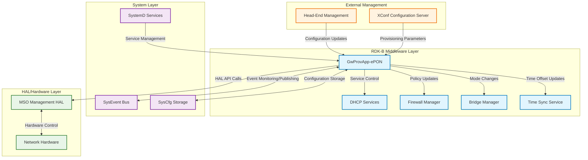
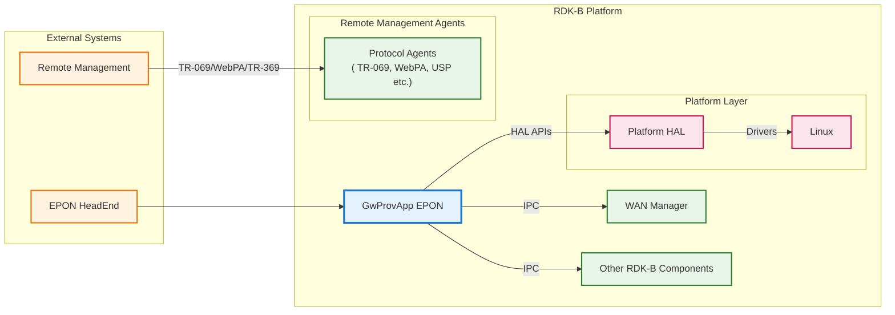
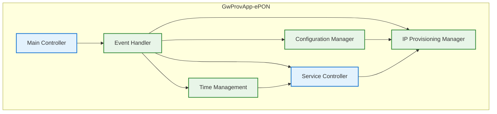
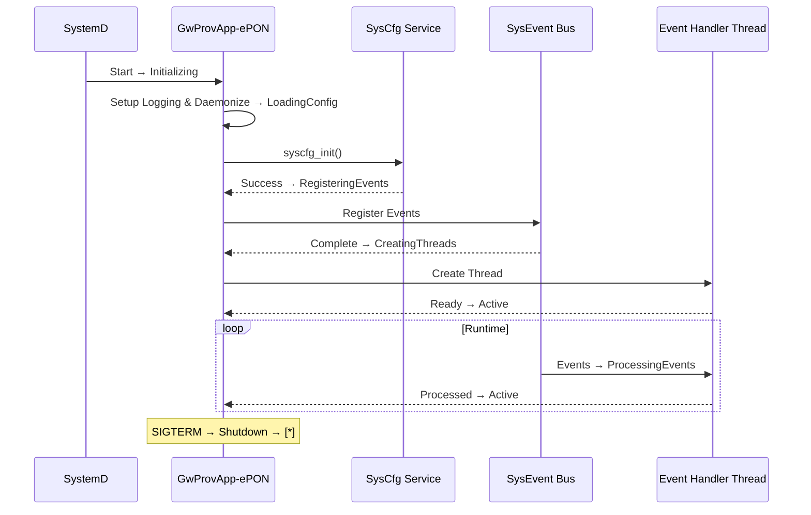
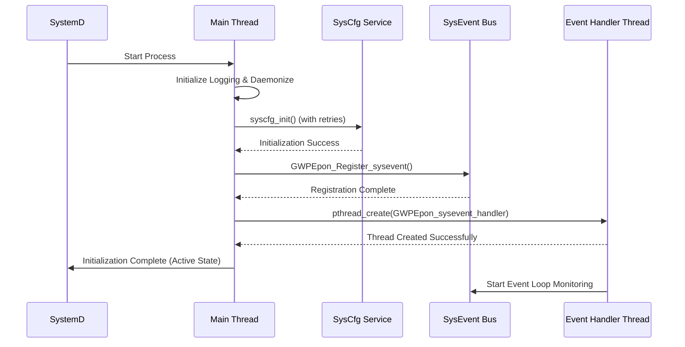
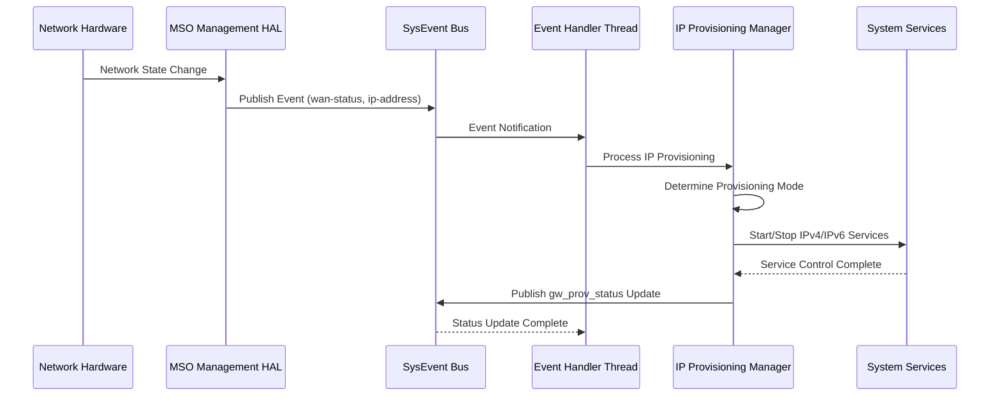
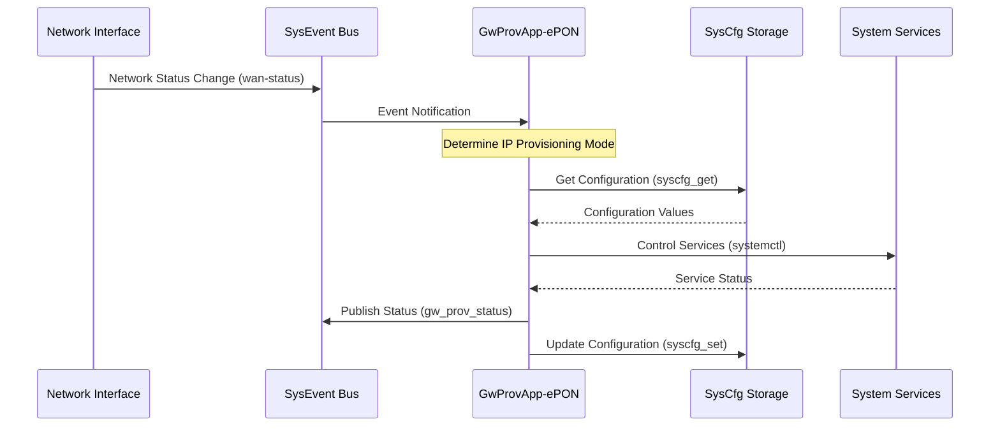
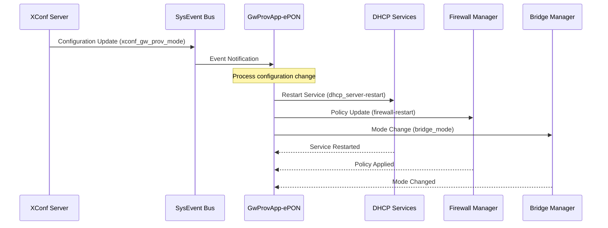

# GwProvApp-ePON Documentation

GwProvApp-ePON is the RDK-B middleware component that manages the provisioning and configuration lifecycle for EPON (Ethernet Passive Optical Network) gateway devices. This component serves as the primary orchestrator for network interface management, IP provisioning, and system service coordination during device initialization and runtime operations.

The component operates as a daemon service that monitors and responds to system events, managing the transition between different IP provisioning modes (IPv4-only, IPv6-only, dual-stack) based on network conditions and configuration requirements. It acts as the central coordinator between the HAL layer, system services, and other RDK-B middleware components to ensure proper gateway functionality.

As a device-level service, GwProvApp-ePON enables seamless network connectivity by managing DHCP services, firewall configurations, bridge mode operations, and time synchronization across the EPON infrastructure. At the module level, it provides event-driven state management, configuration persistence through syscfg, and robust error handling for network provisioning scenarios.

**old diagram**

 

**new diagram**

**Key Features & Responsibilities**: 

- **EPON IP Provisioning Management**: Orchestrates IPv4, IPv6, and dual-stack provisioning modes based on network capabilities and configuration policies
- **System Event Coordination**: Monitors and responds to critical system events including network state changes, service restarts, and configuration updates  
- **Network Service Management**: Controls DHCP server operations, firewall configurations, and bridge mode transitions for optimal network performance
- **HAL Integration**: Interfaces with MSO Management HAL for hardware-specific network operations and status monitoring
- **Configuration Persistence**: Manages gateway configuration storage and retrieval through syscfg for consistent device behavior across reboots
- **Time Synchronization**: Handles timezone and time offset management for IPv4 and IPv6 networks to ensure accurate system time

## Design

The GwProvApp-ePON component follows an event-driven architecture centered around a multi-threaded daemon that monitors system events and coordinates network provisioning activities. The design emphasizes modularity, fault tolerance, and integration with the RDK-B ecosystem. The component operates as a persistent system service that maintains state consistency across various network transitions and configuration changes.

The architecture implements a separation between event handling, state management, and service coordination layers. The main thread handles initialization and lifecycle management while a dedicated event handler thread processes asynchronous system events through the sysevent bus. This design ensures responsive handling of network events without blocking critical system operations, enabling real-time adaptation to changing network conditions.

Northbound interactions with external management systems utilize standardized protocols for configuration retrieval and status reporting. The component interfaces with XConf servers for dynamic configuration updates and provides status information to head-end management systems. Southbound interactions leverage HAL APIs for hardware control and sysevent/syscfg for system integration, ensuring proper abstraction between middleware logic and platform-specific implementations.

The IPC mechanism is built on sysevent for asynchronous event communication and syscfg for persistent configuration storage. This approach provides reliable message delivery for system-wide coordination while maintaining configuration consistency across service restarts. The design supports multiple concurrent operations through thread-safe event handling and atomic configuration updates.

Data persistence is achieved through syscfg integration for configuration parameters and temporary file-based state management for runtime operations. The component maintains operational state in memory while persisting critical configuration data to survive system reboots and service restarts, ensuring consistent gateway behavior across all operational scenarios.

### Prerequisites and Dependencies

**RDK-B Platform and Integration Requirements:** 

- **RDK-B Components**: sysevent daemon, syscfg service, utopia framework, ccsp-common libraries
- **HAL Dependencies**: MSO Management HAL (libhal_msomgmt) and multiple interface HALs for comprehensive network management
- **Systemd Services**: rg_network.service, securemount.service must be active before startup
- **Message Bus**: SysEvent bus registration for network event monitoring and service coordination
- **Configuration Files**: /etc/debug.ini for RDK logging, /nvram/syscfg.db for persistent storage, XConf configuration scripts
- **Startup Order**: Must start after network service and secure mount, before dependent network services

**Threading Model**

GwProvApp-ePON implements a dual-threaded model optimized for responsive event handling and reliable service management. The main thread handles initialization, daemon lifecycle, and synchronous operations while a dedicated event handler thread manages asynchronous system events.

- **Threading Architecture**: Multi-threaded with main thread and dedicated event handler thread
- **Main Thread**: Handles initialization, syscfg setup, daemon management, and process lifecycle control
- **Worker Threads**:
  - **SysEvent Handler Thread (GWPEponsysevent)**: Processes asynchronous system events, manages event subscriptions, and coordinates state transitions
- **Synchronization**: Thread-safe event handling using sysevent library synchronization primitives and atomic configuration operations

### Component State Flow

**Initialization to Active State**

The GwProvApp-ePON component follows a structured initialization sequence ensuring all dependencies are available before entering active service mode. The process includes configuration validation, event registration, and thread creation with comprehensive error handling and retry mechanisms.

**Runtime State Changes and Context Switching**

During runtime operation, the component responds to various system events that trigger provisioning mode changes, service coordination, and configuration updates. These state changes maintain network connectivity and service availability.

**State Change Triggers:**

- Network interface status changes (link up/down, IP address assignment/release)
- XConf configuration updates requiring provisioning mode adjustments
- Bridge mode enable/disable operations affecting network topology
- Service restart requests from other RDK-B components or system administrators
- Hardware events from MSO Management HAL indicating network hardware state changes

**Context Switching Scenarios:**

- IPv4-only to dual-stack provisioning when IPv6 capabilities are detected
- Router mode to bridge mode transitions for network topology changes
- Service coordination during firewall policy updates or DHCP server restarts
- Time zone updates requiring synchronization across IPv4 and IPv6 networks

### Call Flow

**Initialization Call Flow:**

**IP Provisioning Event Processing Call Flow:**

## Internal Modules

The GwProvApp-ePON component is organized into several functional modules that handle specific aspects of gateway provisioning and network management. Each module operates within the single-process daemon architecture while maintaining clear separation of concerns for maintainability and testability.

| Module/Class | Description | Key Files |
|-------------|------------|-----------|
| **Main Controller** | Handles process initialization, daemon management, and lifecycle control including PID file management and signal handling | `gw_prov_epon_sm.c` (main function, daemonize, checkIfAlreadyRunning) |
| **Event Handler** | Manages sysevent subscriptions and processes asynchronous system events through dedicated thread with event routing logic | `gw_prov_epon_sm.c` (GWPEpon_sysevent_handler, notifySysEvents) |
| **IP Provisioning Manager** | Coordinates IPv4, IPv6, and dual-stack provisioning modes including service start/stop and status management | `gw_prov_epon_sm.c` (GWPEpon_ProcessIPProvisioning, GWPEpon_StartIPv4Service, GWPEpon_StartIPv6Service) |
| **Service Controller** | Controls system services including DHCP, firewall, bridge mode, and network interface management | `gw_prov_epon_sm.c` (GWPEpon_ProcessDHCPStart, GWPEpon_ProcessBridgeMode*, GWPEpon_ProcessFirewallRestart) |
| **Configuration Manager** | Handles syscfg-based configuration storage and retrieval with XConf integration for remote updates | `gw_prov_epon_sm.c` (GWPEpon_SyseventSetStr, GWPEpon_SyseventSetInt, XConf processing functions) |
| **Time Management** | Manages timezone and time offset synchronization for IPv4 and IPv6 networks with HAL integration | `gw_prov_epon_sm.c` (GWPEpon_ProcessIpv4Timeoffset, GWPEpon_ProcessIpv6Timeoffset, GWPEpon_SetWanTimeoffset) |

## Component Interactions

GwProvApp-ePON serves as a central coordinator in the RDK-B middleware ecosystem, managing interactions with system services, HAL components, and external management systems through well-defined interfaces and protocols.

### Interaction Matrix

| Target Component/Layer | Interaction Purpose | Key APIs/Endpoints |
|------------------------|-------------------|------------------|
| **RDK-B Middleware Components** |
| DHCP Server Services | Service lifecycle control and configuration updates | `systemctl restart udhcp.service`, `systemctl restart dhcpv6s.service` |
| Firewall Manager | Policy updates and service restarts during mode changes | `firewall-restart` event topic |
| Bridge Manager | Network topology mode changes and interface control | `bridge_mode` event topic |
| Connection Tracking | Connection state management and security policy updates | `/usr/ccsp/ins_conntrack.sh` |
| **System & HAL Layers** |
| MSO Management HAL | Hardware network interface control and status monitoring | `mso_mgmt_hal_*()` functions |
| SysEvent Bus | System-wide event communication and coordination | `sysevent_get()`, `sysevent_set()`, `sysevent_setnotification()` |
| SysCfg Service | Persistent configuration storage and retrieval | `syscfg_get()`, `syscfg_set()`, `syscfg_commit()` |
| SystemD Services | Process lifecycle and dependency management | Service dependencies, ExecStart/Stop directives |

**Events Published by GwProvApp-ePON:**

| Event Name | Event Topic/Path | Trigger Condition | Subscriber Components |
|------------|-----------------|-------------------|---------------------|
| Gateway Provisioning Status | `gw_prov_status` | IP provisioning mode changes, service state updates | Network monitoring services, telemetry collectors |
| Gateway Provisioning Status String | `gw_prov_status_str` | Human-readable status updates | UI components, diagnostic tools |
| DHCP Server Restart | `dhcp_server-restart` | IP provisioning changes requiring DHCP reconfiguration | DHCP server services, network configuration |
| Service Coordination Events | Various service-specific topics | Service lifecycle and configuration changes | Dependent RDK-B services |

**Events Consumed by GwProvApp-ePON:**

| Event Source | Event Topic/Path | Purpose | Handler Function |
|-------------|-----------------|---------|------------------|
| Network Services | `wan-status`, `ipv4-status`, `ipv6-status` | Monitor network interface state changes | `GWPEpon_sysevent_handler()` |
| XConf Services | `xconf_gw_prov_mode`, `xconf_router_ip_mode` | Process remote configuration updates | `GWPEpon_ProcessXconfGwProvMode()` |
| System Services | `bridge_mode`, `firewall-restart`, `gre-restart` | Coordinate system service changes | Service-specific handler functions |
| Time Services | `ipv4-timeoffset`, `ipv6-timeoffset`, `ipv4_timezone` | Synchronize time configuration across networks | `GWPEpon_ProcessIpv*Timeoffset()` |
| Interface Management | `eth_enabled`, `moca_enabled`, `wl_enabled` | Handle physical interface state changes | Interface-specific enable/disable handlers |

### IPC Flow Patterns

**Primary IPC Flow - IP Provisioning Mode Change:**

**Event Notification Flow - Service Coordination:**

## Implementation Details

### Major HAL APIs Integration

GwProvApp-ePON integrates with the MSO Management HAL to provide hardware-level control and monitoring capabilities for EPON network interfaces and system management functions.

**Core HAL APIs:**

| HAL API | Purpose | Implementation File |
|---------|---------|-------------------|
| `mso_mgmt_hal_init()` | Initialize MSO Management HAL interface | `gw_prov_epon_sm.c` |
| `mso_mgmt_hal_get_network_status()` | Retrieve current network interface status | `gw_prov_epon_sm.c` |
| `mso_mgmt_hal_set_provisioning_mode()` | Configure IP provisioning mode in hardware | `gw_prov_epon_sm.c` |
| `mso_mgmt_hal_get_time_offset()` | Get network time offset from hardware | `gw_prov_epon_sm.c` |
| `mso_mgmt_hal_set_time_offset()` | Set network time offset in hardware | `gw_prov_epon_sm.c` |

### Key Implementation Logic

**Event-Driven State Machine**: The core logic is implemented in the `GWPEpon_sysevent_handler()` function which processes system events and coordinates state transitions. Main event processing loop in `gw_prov_epon_sm.c` (sysevent handler thread function) provides continuous monitoring capabilities, while event routing and handler dispatch logic in `GWPEpon_sysevent_handler()` function ensures proper event processing and coordination.
  
**IP Provisioning Logic**: Manages transitions between IPv4-only, IPv6-only, and dual-stack modes based on network conditions and configuration. Provisioning mode determination in `GWPEpon_ProcessIPProvisioning()` function analyzes network capabilities and requirements, service coordination logic in IPv4/IPv6 start/stop functions orchestrates service management, and status bit manipulation for provisioning state tracking maintains accurate system state representation.

**Service Coordination Engine**: Orchestrates system service lifecycle and configuration updates during provisioning changes. DHCP service management through systemctl command execution provides reliable service control, firewall policy coordination via event notifications ensures security policy updates, and bridge mode management with network topology awareness maintains proper network connectivity.

**Error Handling Strategy**: Implements comprehensive error detection, logging, and recovery mechanisms for robust operation. SysCfg initialization with retry logic and maximum retry limits ensures reliable configuration access, thread creation error handling with detailed error reporting provides visibility into resource issues, HAL API error code mapping and appropriate response actions ensure graceful failure handling, and service failure detection and automatic recovery attempts maintain system availability.

**Configuration Management**: Handles persistent configuration storage and runtime parameter management. SysCfg-based persistent storage for gateway configuration parameters ensures configuration persistence, runtime state management through sysevent key-value pairs provides efficient inter-component communication, and XConf integration for remote configuration updates and policy changes enables dynamic configuration management.

**Logging & Debugging**: Provides comprehensive logging and debugging capabilities for troubleshooting and monitoring. RDK logging integration through CCSP trace macros with configurable log levels enables detailed system analysis, function entry/exit tracing for detailed call flow analysis provides execution visibility, event processing logging with parameter and state information captures operational details, and error condition logging with context and recovery information facilitates problem diagnosis.