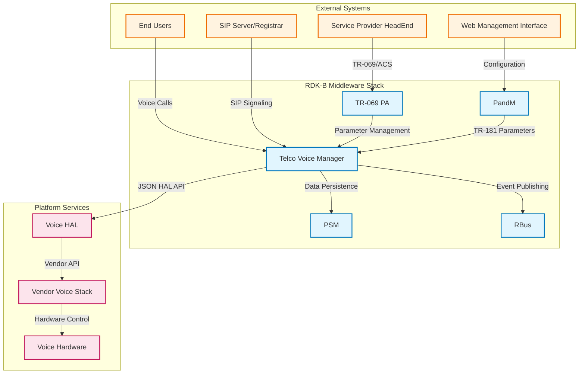
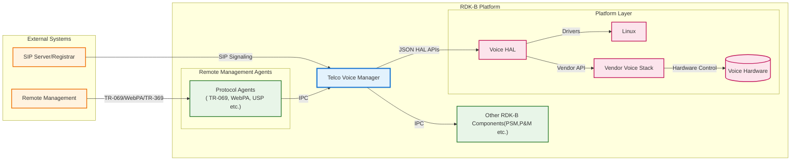
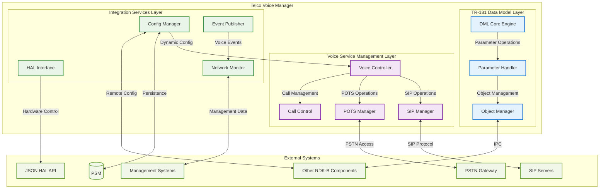
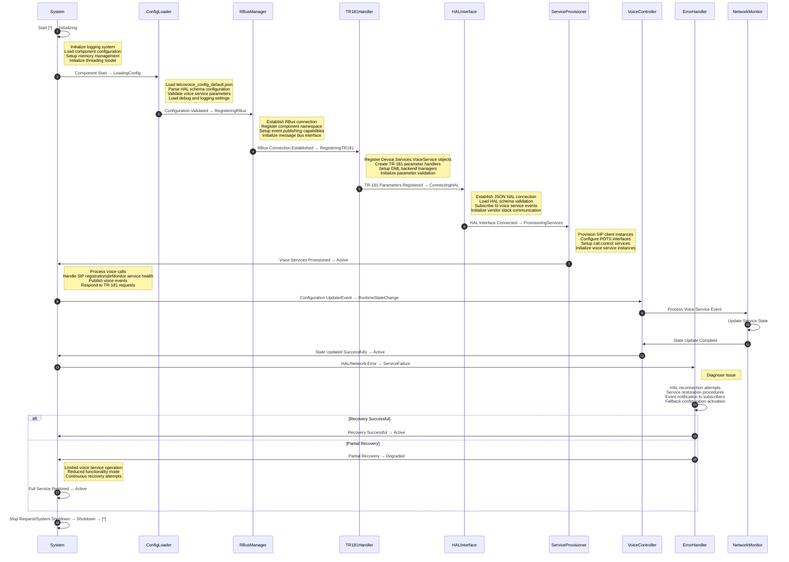
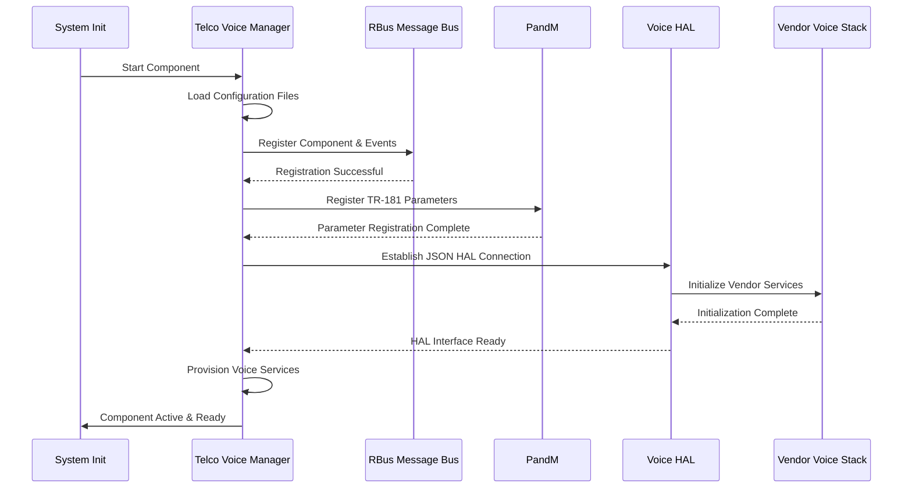
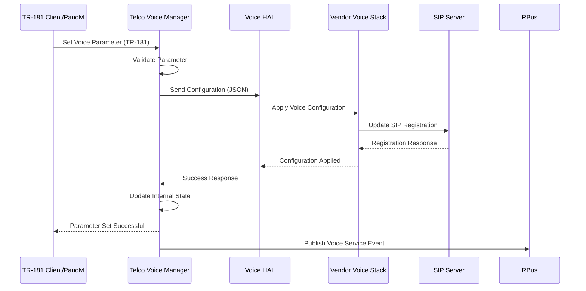
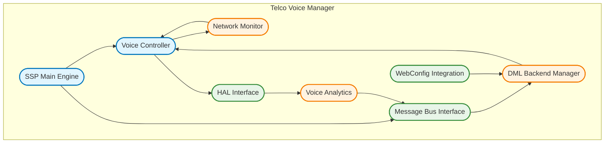
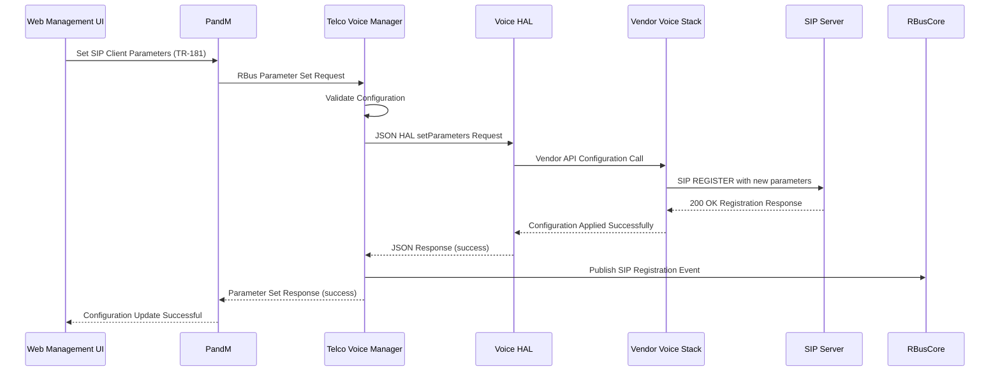
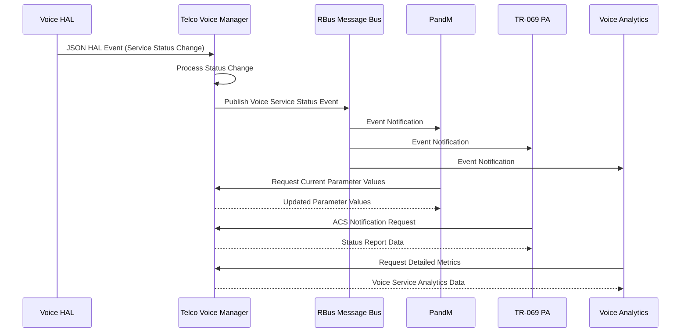

```mermaid
graph TD
    subgraph ContainerBoundary ["Telco Voice Manager Process (C/systemd)"]
        subgraph TR181Layer ["TR-181 Data Model Layer"]
            DMLCore[DML Core Engine]
            ParamHandler[Parameter Handler]
            ObjectMgr[Object Manager]
        end
        
        subgraph ServiceLayer ["Voice Service Management Layer"]
            VoiceController[Voice Controller]
            SIPMgr[SIP Manager]
            POTSMgr[POTS Manager]
            CallControl[Call Control]
        end
        
        subgraph IntegrationLayer ["Integration Services Layer"]
            HALInterface[HAL Interface]
            ConfigMgr[Config Manager]
            EventPublisher[Event Publisher]
            NetworkMonitor[Network Monitor]
        end
    end

    subgraph RDKBMiddleware ["RDK-B Middleware Components"]
        PandM[PandM]
        TR069[TR-069 PA]
        PSM[PSM]
        RBus[RBus/Message Bus]
        WebConfig[WebConfig Framework]
    end

    subgraph VoiceHAL ["Voice Hardware Abstraction"]
        JSONHALClient[JSON HAL Client]
        VendorHAL[Vendor Voice HAL]
        VoiceHardware[(Voice Hardware)]
    end

    subgraph ExternalSystems ["External Voice Systems"]
        SIPServers[SIP Servers]
        PSTNGateway[PSTN Gateway]
        ManagementSys[Management Systems]
    end

    DMLCore -->|Parameter Operations| ParamHandler
    ParamHandler -->|Object Management| ObjectMgr
    
    VoiceController -->|SIP Operations| SIPMgr
    VoiceController -->|POTS Operations| POTSMgr
    VoiceController -->|Call Management| CallControl
    
    HALInterface -->|Hardware Control| JSONHALClient
    ConfigMgr -->|Dynamic Config| VoiceController
    EventPublisher -->|Voice Events| NetworkMonitor
    
    ObjectMgr <-->|TR-181 Parameters| PandM
    ObjectMgr <-->|ACS Management| TR069
    ConfigMgr <-->|Persistence| PSM
    EventPublisher <-->|Event Publishing| RBus
    ConfigMgr <-->|Remote Config| WebConfig
    
    JSONHALClient <-->|JSON API| VendorHAL
    VendorHAL <-->|Hardware API| VoiceHardware
    
    SIPMgr <-->|SIP Protocol| SIPServers
    POTSMgr <-->|PSTN Access| PSTNGateway
    NetworkMonitor <-->|Management Data| ManagementSys

    classDef tr181 fill:#e3f2fd,stroke:#1976d2,stroke-width:2px;
    classDef service fill:#f3e5f5,stroke:#7b1fa2,stroke-width:2px;
    classDef integration fill:#e8f5e8,stroke:#388e3c,stroke-width:2px;
    classDef middleware fill:#fff3e0,stroke:#f57c00,stroke-width:2px;
    classDef hal fill:#fce4ec,stroke:#c2185b,stroke-width:2px;
    classDef external fill:#f1f8e9,stroke:#689f38,stroke-width:2px;

    class DMLCore,ParamHandler,ObjectMgr tr181;
    class VoiceController,SIPMgr,POTSMgr,CallControl service;
    class HALInterface,ConfigMgr,EventPublisher,NetworkMonitor integration;
    class PandM,TR069,PSM,RBus,WebConfig middleware;
    class JSONHALClient,VendorHAL,VoiceHardware hal;
    class SIPServers,PSTNGateway,ManagementSys external;
```

# Telco Voice Manager Documentation

Telco Voice Manager is the RDK-B middleware component that provides voice service management capabilities for residential and business environments. This component serves as the central orchestrator for voice services, implementing TR-104 (Voice over Internet Protocol) standards and managing the interaction between the RDK-B middleware stack and vendor-specific voice implementations. The component enables service providers to offer advanced telephony features including SIP-based VoIP calling, POTS (Plain Old Telephone Service) support, and voice service provisioning through a standardized TR-181 data model interface.

Telco Voice Manager acts as a bridge between the high-level RDK-B management infrastructure and low-level voice hardware abstraction layers , providing seamless integration of voice services into the broader RDK-B ecosystem. It supports both legacy telephony interfaces and modern IP-based voice communications, enabling operators to deploy unified voice solutions across diverse hardware platforms while maintaining consistent management and configuration interfaces.

**old diagram**



**new diagram**





**Key Features & Responsibilities**: 

- **TR-104 Voice Service Management**: Complete implementation of TR-104 Voice over Internet Protocol data model specifications, providing standardized voice service configuration and monitoring capabilities across diverse hardware platforms
- **SIP Protocol Integration**: Advanced Session Initiation Protocol (SIP) client and server functionality supporting multiple concurrent voice sessions, registration management, and call control features
- **POTS Interface Support**: Legacy Plain Old Telephone Service integration enabling seamless migration from traditional telephony systems while maintaining backward compatibility with existing infrastructure
- **Multi-Line Voice Services**: Support for multiple concurrent voice lines with independent configuration, call handling, and service provisioning capabilities per line instance
- **Voice Quality Management**: Comprehensive voice processing controls including gain adjustment, echo cancellation, noise reduction, and codec management for optimal call quality
- **Event-Driven Architecture**: Real-time event publishing and subscription system for voice service state changes, call events, and system notifications using RBus messaging infrastructure
- **HAL Abstraction Layer**: Vendor-agnostic Hardware Abstraction Layer implementation supporting JSON-based communication protocol for seamless integration with diverse voice hardware platforms

## Design

The Telco Voice Manager follows a layered architectural approach designed to provide maximum flexibility and vendor independence while maintaining robust voice service management capabilities. The design principles center around clear separation of concerns, with distinct layers handling TR-181 data model management, voice service orchestration, and hardware abstraction. This architecture enables the component to support diverse voice implementations while providing consistent management interfaces and maintaining high availability for critical voice services.

The component's design emphasizes event-driven communication patterns, utilizing RBus for inter-component messaging and JSON-based HAL interfaces for hardware abstraction. The modular architecture allows for independent scaling of different voice service functions, while maintaining tight integration with the broader RDK-B middleware ecosystem. The design incorporates comprehensive error handling, state management, and recovery mechanisms to ensure continuous voice service availability even during system transitions or hardware failures.

The northbound interfaces integrate seamlessly with RDK-B management components including PandM for TR-181 parameter management, TR-069 PA for remote configuration, and PSM for persistent data storage. The southbound interfaces abstract vendor-specific voice implementations through a standardized JSON HAL API, enabling consistent voice service management across different hardware platforms and vendor solutions. The design also incorporates WebConfig integration for dynamic configuration management and telemetry collection for proactive service monitoring.

<br>

**old diagram**


<br>

**new diagram**





### Prerequisites and Dependencies

**Build-Time Flags and Configuration:**

| Configure Option | DISTRO Feature | Build Flag | Purpose | Default |
|------------------|----------------|------------|---------|---------|
| N/A | `rdkb_voice_manager_dmltr104_v2` | `FEATURE_RDKB_VOICE_DM_TR104_V2` | Enable TR-104 v2 data model implementation with enhanced voice features | Disabled |
| N/A | `telco_voice_feature_enable_persist` | `TELCO_VOICE_FEATURE_ENABLE_PERSIST` | Enable persistent voice service configuration across reboots | Disabled |

**Data Model Configuration:**

| Configuration | V1 Setting | V2 Setting | Purpose |
|---------------|------------|------------|---------|
| Data Model XML | `RdkTelcoVoiceManager_v1.xml` | `RdkTelcoVoiceManager_v2.xml` | TR-181 parameter definitions |
| HAL Schema | `telcovoice_hal_schema_v1.json` | `telcovoice_hal_schema_v2.json` | HAL API validation schema |
| Default Config | `telcovoice_config_default.json` | `telcovoice_config_default_v2.json` | Default voice service settings |
| Telemetry Schema | `VoiceDiagnostics.avsc` | `VoiceDiagnostics_V2.avsc` | Avro telemetry data format |

**RDK-B Platform and Integration Requirements:** 

- **Build Dependencies**: meta-rdk-broadband layer, ccsp-common-library, hal-generic-voice, rbus, webconfig-framework, and systemd development packages
- **RDK-B Components**: PandM (Parameter and Management), PSM (Persistent Storage Manager), TR-069 PA, RBus Message Bus, and WebConfig Framework must be active and operational
- **HAL Dependencies**: Voice HAL interface version 2.0+ implementing JSON-based communication protocol with vendor-specific voice stack integration
- **Systemd Services**: ccsp-psm.service, ccsp-pandm.service, rbus.service must be running before telcovoice-manager.service initialization
- **Message Bus**: RBus registration for voice service events and TR-181 parameter notifications with reserved namespace "Device.Services.VoiceService"
- **TR-181 Data Model**: TR-104 Voice service object model support from PandM with read/write access to Device.Services.VoiceService.* parameters
- **Configuration Files**: /opt/voice_config.json, /etc/telcovoice_manager_conf.json, and vendor-specific HAL configuration files must be present
- **Startup Order**: PSM → RBus → PandM → Voice HAL → Telco Voice Manager initialization sequence must be maintained

<br>

**Threading Model** 

The Telco Voice Manager implements a multi-threaded architecture optimized for real-time voice service management and concurrent operation handling. The threading model is designed to ensure low-latency voice processing while maintaining responsive parameter management and event handling capabilities.

- **Threading Architecture**: Multi-threaded with dedicated thread pools for voice processing, event handling, and HAL communication
- **Main Thread**: Handles component initialization, RBus registration, TR-181 parameter operations, and coordinates overall voice service management lifecycle
- **Worker Threads**:
  - **Voice Controller Thread**: Manages voice service state transitions, call control operations, and coordinates SIP/POTS service management
  - **HAL Communication Thread**: Dedicated thread for JSON HAL API communication ensuring non-blocking hardware operations and event processing
  - **Network Monitor Thread**: Monitors network connectivity, SIP registration status, and handles network-related voice service events
  - **Event Publisher Thread**: Processes and publishes voice service events to RBus subscribers with guaranteed delivery and proper sequencing
  - **Configuration Thread**: Handles WebConfig updates, parameter validation, and dynamic configuration changes without service interruption
- **Synchronization**: Uses pthread mutexes for shared data protection, condition variables for thread coordination, and lock-free queues for high-frequency event processing

### Component State Flow

**Initialization to Active State**

The Telco Voice Manager follows a structured initialization sequence designed to ensure all dependencies are properly established before voice services become operational. The initialization process includes configuration loading, HAL interface establishment, RBus registration, and voice service provisioning based on stored configuration parameters.



**Runtime State Changes and Context Switching**

The component handles various runtime state changes based on network conditions, voice service requirements, and system events. State transitions are triggered by external events such as network connectivity changes, voice service configuration updates, or hardware status changes.

**State Change Triggers:**

- Network connectivity changes triggering SIP re-registration and service availability updates
- Voice service configuration updates requiring service restart or parameter validation
- HAL interface errors necessitating reconnection attempts and service degradation handling
- Voice quality degradation events triggering codec adjustment or call routing changes
- Emergency call requirements overriding normal call processing and resource allocation

**Context Switching Scenarios:**

- Switching between IPv4 and IPv6 voice service operation based on network availability and configuration
- Transitioning from normal operation to emergency-only mode during system maintenance or failures
- Changing voice service profiles dynamically based on time-of-day restrictions or user preferences
- Failover to backup SIP servers or alternative voice routing during primary service outages

### Call Flow

**Initialization Call Flow:**



**Voice Service Request Processing Call Flow:**



## TR‑181 Data Models

### Supported TR-181 Parameters

The Telco Voice Manager implements comprehensive TR-104 Voice over Internet Protocol data model support following BBF (Broadband Forum) specifications. The implementation provides full compliance with TR-181 Issue 2 Amendment 15 voice service requirements, including custom RDK extensions for enhanced functionality and operator-specific features.

### Object Hierarchy

```
Device.
└── Services.
    └── VoiceService.{i}.
        ├── Enable (boolean, R/W)
        ├── Status (string, R)
        ├── Alias (string, R/W)
        ├── X_RDK_BoundIfName (string, R/W)
        ├── X_RDK_IpAddressFamily (string, R/W)
        ├── X_RDK_Debug.
        │   ├── CCTKTraceGroup (string, R/W)
        │   ├── CCTKTraceLevel (string, R/W)
        │   └── ModuleLogLevels (string, R/W)
        ├── POTS.
        │   ├── Region (string, R/W)
        │   └── FXS.{i}.
        │       ├── Enable (boolean, R/W)
        │       ├── Alias (string, R/W)
        │       ├── Name (string, R/W)
        │       └── VoiceProcessing.
        │           ├── ReceiveGain (int, R/W)
        │           └── TransmitGain (int, R/W)
        ├── SIP.
        │   ├── Client.{i}.
        │   │   ├── Enable (boolean, R/W)
        │   │   ├── Status (string, R)
        │   │   ├── Alias (string, R/W)
        │   │   ├── AuthUserName (string, R/W)
        │   │   ├── AuthPassword (string, R/W)
        │   │   ├── RegisterURI (string, R/W)
        │   │   └── MaxSessions (unsignedInt, R/W)
        │   └── Network.{i}.
        │       ├── Enable (boolean, R/W)
        │       ├── Status (string, R)
        │       ├── Alias (string, R/W)
        │       ├── OutboundProxy (string, R/W)
        │       ├── ProxyServer (string, R/W)
        │       ├── RegistrarServer (string, R/W)
        │       └── DSCPMark (unsignedInt, R/W)
        └── CallControl.
            └── Line.{i}.
                ├── Enable (boolean, R/W)
                ├── Status (string, R)
                ├── Alias (string, R/W)
                ├── DirectoryNumber (string, R/W)
                └── SIP (string, R/W)
```

### Parameter Definitions

**Core Parameters:**

| Parameter Path | Data Type | Access | Default Value | Description | BBF Compliance |
|----------------|-----------|--------|---------------|-------------|----------------|
| `Device.Services.VoiceService.{i}.Enable` | boolean | R/W | `false` | Enable or disable the voice service instance. When false, the voice service is completely disabled and no voice calls can be processed. When true, the service is enabled according to its configuration. | TR-181 Issue 2 |
| `Device.Services.VoiceService.{i}.Status` | string | R | `"Disabled"` | Current operational status of the voice service. Enumerated values: "Disabled" (service not operational), "Enabled" (service operational and ready), "Error" (service has encountered a critical error). | TR-181 Issue 2 |
| `Device.Services.VoiceService.{i}.Alias` | string | R/W | `"cpe-voiceservice-1"` | Human-readable name for the voice service instance. Used for identification purposes in management interfaces and logging. Maximum length 64 characters. | TR-181 Issue 2 |
| `Device.Services.VoiceService.{i}.POTS.Region` | string | R/W | `"US"` | Geographic region setting for POTS interface behavior including ring patterns, dial tones, and regulatory compliance. Valid values include country codes like "US", "UK", "DE", "FR". | TR-181 Issue 2 |
| `Device.Services.VoiceService.{i}.SIP.Client.{i}.Enable` | boolean | R/W | `false` | Enable or disable individual SIP client instances for voice service registration and call processing. | TR-181 Issue 2 |
| `Device.Services.VoiceService.{i}.SIP.Client.{i}.AuthUserName` | string | R/W | `""` | SIP authentication username for client registration with SIP registrar server. Used for SIP REGISTER and INVITE authentication. | TR-181 Issue 2 |
| `Device.Services.VoiceService.{i}.SIP.Network.{i}.ProxyServer` | string | R/W | `""` | Primary SIP proxy server hostname or IP address for outbound call routing and SIP message forwarding. | TR-181 Issue 2 |
| `Device.Services.VoiceService.{i}.SIP.Network.{i}.DSCPMark` | unsignedInt | R/W | `26` | Differentiated Services Code Point marking for SIP signaling traffic QoS classification. Range 0-63, default 26 for expedited forwarding. | TR-181 Issue 2 |


### Parameter Registration and Access

- **Implemented Parameters**: The component implements over 200 TR-181 parameters covering complete voice service functionality including SIP client management, POTS interface control, call control features, and voice quality management
- **Parameter Registration**: All TR-181 parameters are registered with PandM during component initialization using RBus-based parameter registration API with proper namespace allocation and access control
- **Access Mechanism**: External components access voice service parameters through PandM's TR-181 interface using standard get/set operations, with the component receiving parameter requests via RBus messaging
- **Validation Rules**: Comprehensive parameter validation including range checking for numeric values, enumeration validation for string parameters, and cross-parameter dependency validation for consistent voice service configuration

## Internal Modules

The Telco Voice Manager is architected as a collection of specialized modules, each responsible for specific aspects of voice service management. The modular design enables clear separation of concerns while maintaining tight integration between voice service functions and external system interfaces.

| Module/Class | Description | Key Files |
|-------------|------------|-----------|
| **Voice Controller** | Core orchestration module managing overall voice service lifecycle, state transitions, and coordination between SIP and POTS services. Handles voice service enable/disable operations and maintains service health monitoring. | `telcovoicemgr_controller.c`, `telcovoicemgr_controller.h` |
| **SSP Main Engine** | Service Specific Platform main engine responsible for component initialization, RBus registration, signal handling, and overall process lifecycle management. Implements systemd integration and component shutdown procedures. | `telcovoicemgr_ssp_main.c`, `telcovoicemgr_ssp_global.h` |
| **Message Bus Interface** | RBus integration module handling TR-181 parameter registration, event publishing, and inter-component communication. Manages voice service event notifications and parameter change propagation. | `telcovoicemgr_ssp_messagebus_interface.c`, `telcovoicemgr_ssp_messagebus_interface.h` |
| **Network Monitor** | Network connectivity monitoring module tracking interface status, IP address changes, and network availability for voice services. Triggers SIP re-registration and service adaptation based on network conditions. | `telcovoicemgr_nw_monitor.c`, `telcovoicemgr_nw_monitor.h` |
| **DML Backend Manager** | Data Model Layer backend management module implementing TR-181 parameter handlers, object instance management, and parameter validation logic. Bridges TR-181 operations with internal voice service management. | `telcovoicemgr_dml_backendmgr.c`, `telcovoicemgr_dml_backendmgr.h` |
| **HAL Interface** | Hardware Abstraction Layer interface module implementing JSON-based communication with vendor voice stacks. Handles HAL API calls, event subscription, and hardware status monitoring. | `telcovoicemgr_dml_hal.c`, `telcovoicemgr_dml_hal.h` |
| **WebConfig Integration** | WebPA/WebConfig framework integration module supporting dynamic configuration updates, bulk parameter operations, and remote provisioning capabilities from service provider systems. | `telcovoicemgr_webconfig.c`, `telcovoicemgr_webconfig.h` |
| **Voice Analytics** | Telemetry and analytics module collecting voice service metrics, call quality data, and usage statistics for reporting to backend systems and proactive service management. | `voice_report.c`, `voice_report.h` |

<br>

**old diagram to delete**



## Component Interactions

The Telco Voice Manager maintains extensive interactions with both RDK-B middleware components and external voice service systems, utilizing multiple communication protocols and message formats to ensure comprehensive voice service management and seamless integration within the broader RDK-B ecosystem.

### Interaction Matrix

| Target Component/Layer | Interaction Purpose | Key APIs/Endpoints |
|------------------------|--------------------|--------------------|
| **RDK-B Middleware Components** |
| PandM | TR-181 parameter management, voice service configuration and status reporting | `Device.Services.VoiceService.*` parameters, voice service events |
| TR-069 PA | Remote configuration management, ACS-initiated parameter operations, firmware management | `CCSP_DM_GetParameterValues`, `CCSP_DM_SetParameterValues`, notification callbacks |
| PSM | Persistent configuration storage, voice service settings persistence, factory reset handling | `PSM_Get_Record_Value`, `PSM_Set_Record_Value`, namespace: `dmsb.voice.*` |
| WebConfig Framework | Dynamic configuration updates, bulk parameter operations, remote provisioning | WebConfig subdoc registration, `voice` subdocument processing |
| RBus Message Bus | Event publishing, inter-component notifications, parameter change events | Event topics: `Device.Services.VoiceService.StatusChange`, `VoiceCallEvents` |
| **System & HAL Layers** |
| Voice HAL | Hardware control, voice service configuration, call processing, event subscription | `getParameters`, `setParameters`, `subscribeEvent`, HAL schema validation |
| Platform Services | System integration, network interface monitoring, systemd service management | `/proc/net/route`, systemd service control, network interface events |
| **External Systems** |
| SIP Servers/Registrars | SIP registration, call signaling, session management, presence services | `REGISTER`, `INVITE`, `BYE`, `OPTIONS`, authentication challenges |


**Events Published by Telco Voice Manager:**

| Event Name | Event Topic/Path | Trigger Condition | Subscriber Components |
|-------------|------------------|-------------------|------------------------|
| VoiceServiceStatusChange | `Device.Services.VoiceService.StatusChange` | Voice service enable/disable, initialization complete, error conditions | PandM, TR-069 PA, WebConfig Framework, diagnostic components |
| SIPRegistrationEvent | `Device.Services.VoiceService.SIP.RegistrationEvent` | SIP client registration success/failure, periodic re-registration | Network management, service monitoring, analytics components |
| VoiceCallEvent | `Device.Services.VoiceService.CallEvent` | Call initiation, termination, state changes, call quality events | Billing systems, analytics, call detail record processors |
| HALConnectionEvent | `Device.Services.VoiceService.HALStatus` | HAL interface connection/disconnection, hardware errors | System health monitoring, maintenance systems |


**Events Consumed by Telco Voice Manager:**

| Event Source | Event Topic/Path | Purpose | Handler Function |
|---------------|------------------|----------|------------------|
| Network Monitor | `Device.Network.Interface.StatusChange` | React to network connectivity changes affecting voice services | `NetworkStatusEventHandler()` |
| WebConfig Framework | `Device.WebConfig.voice.ConfigUpdate` | Process dynamic voice service configuration updates | `WebConfigUpdateHandler()` |
| PSM | `Device.PSM.ParameterChange` | Handle persistent storage updates for voice configuration | `PSMParameterChangeHandler()` |


### IPC Flow Patterns

**Primary IPC Flow - SIP Client Configuration Update:**



**Event Notification Flow - Voice Service State Change:**



## Implementation Details

### Major HAL APIs Integration

The Telco Voice Manager integrates with the Voice Hardware Abstraction Layer through a comprehensive JSON-based API that provides vendor-agnostic access to voice hardware capabilities. The HAL integration supports both synchronous parameter operations and asynchronous event subscription for real-time voice service management.

**Core HAL APIs:**

| HAL API | Purpose | Parameters | Return Values | Implementation File |
|---------|---------|------------|---------------|-------------------|
| `getParameters` | Retrieve voice service configuration and status parameters from vendor voice stack | JSON array of parameter names, schema version, timeout specifications | JSON response with parameter values, types, and status codes | `telcovoicemgr_dml_hal.c` |
| `setParameters` | Configure voice service parameters including SIP settings, POTS configuration, and call control options | JSON array of parameter name/value/type objects with validation requirements | Success/failure status, validation errors, applied parameter confirmation | `telcovoicemgr_dml_hal.c` |
| `subscribeEvent` | Subscribe to real-time voice service events including call state changes, registration events, and hardware status | Event topic names, subscription types (onChange, periodic), timeout configurations | Subscription confirmation, event delivery method, error conditions | `telcovoicemgr_controller.c` |
| `getSchema` | Retrieve HAL schema definition for parameter validation and capability discovery | Schema version request, supported feature queries | JSON schema document, supported parameter list, capability matrix | `telcovoicemgr_dml_hal.c` |
| `deleteObject` | Remove dynamic voice service objects such as SIP clients or call control lines | Object instance identifiers, deletion scope, dependency validation | Deletion status, affected parameter list, cleanup confirmation | `telcovoicemgr_dml_backendmgr.c` |

### Key Implementation Logic

- **State Machine Engine**: The core voice service state management is implemented in `telcovoicemgr_controller.c` with comprehensive state transition logic handling initialization, active service operation, error recovery, and graceful shutdown procedures. State machine implementation includes voice service lifecycle management from disabled to active states, SIP registration state tracking, and POTS interface status management. State transition handlers in `telcovoicemgr_dml_backendmgr.c` coordinate parameter validation, HAL communication, and event publishing during state changes.
  
- **Event Processing**: Hardware and network events are processed through an asynchronous event handling system that maps voice hardware events to appropriate state changes and external notifications. Event subscription management maintains active subscriptions to HAL events, network interface changes, and configuration updates. Event correlation logic links related voice service events and prevents duplicate notifications during rapid state transitions. Asynchronous event processing ensures real-time responsiveness while maintaining system stability during high-frequency event scenarios.

- **Error Handling Strategy**: Comprehensive error detection and recovery mechanisms are implemented throughout the voice service management lifecycle with automatic recovery procedures and graceful degradation capabilities. HAL communication errors trigger automatic reconnection attempts with exponential backoff algorithms to prevent system overload. Configuration validation errors provide detailed error reporting with parameter-specific validation failure information. Timeout handling and retry logic ensure robust operation during network instability or vendor stack temporary failures.

- **Logging & Debugging**: Multi-level logging system with configurable verbosity levels and component-specific debug categories enables comprehensive troubleshooting and system monitoring. Voice service event logging includes call detail records, SIP message tracing, and hardware interaction logging. Debug trace categories allow selective logging of SIP protocol messages, HAL API interactions, and internal state transitions. Debug hooks for troubleshooting connectivity issues include network diagnostic information and SIP registration analysis tools.

### Key Configuration Files

| Configuration File | Purpose | Override Mechanisms |
|--------------------|---------|-------------------|
| `telcovoice_config_default_v2.json` | Default voice service configuration template with SIP and POTS settings | WebConfig updates, TR-069 provisioning |
| `telcovoice_manager_conf.json` | Component-specific configuration including HAL connection settings and logging | Environment variables, runtime parameter updates |
| `RdkTelcoVoiceManager_v2.xml` | TR-181 data model definitions and parameter metadata | Build-time configuration, DISTRO feature flags |
| `telcovoice_hal_schema_v2.json` | HAL API schema definition for parameter validation and capability discovery | Vendor-specific schema extensions, HAL version updates |