# VLAN Manager Documentation

VLAN Manager component provides comprehensive VLAN (Virtual LAN) management capabilities for RDK-B devices. This component serves as the central orchestrator for Ethernet link management and VLAN termination services, enabling advanced network segmentation, QoS prioritization, and traffic isolation in residential gateway and set-top box deployments. VLAN Manager integrates seamlessly with the RDK-B middleware stack, providing standardized TR-181 data model interfaces for VLAN configuration and monitoring. It abstracts hardware-specific VLAN operations through a well-defined HAL interface, enabling platform-agnostic VLAN management across different silicon vendors and hardware platforms. The component plays a vital role in supporting advanced networking features such as multi-service delivery, subscriber isolation, and bandwidth management.

VLAN Manager enables service providers to implement sophisticated network architectures including triple-play services (voice, video, data), IoT device segmentation, and guest network isolation. The component ensures that VLAN operations are performed atomically and consistently, maintaining network integrity while providing real-time status monitoring and telemetry capabilities.

<br>

**old diagram to delete**

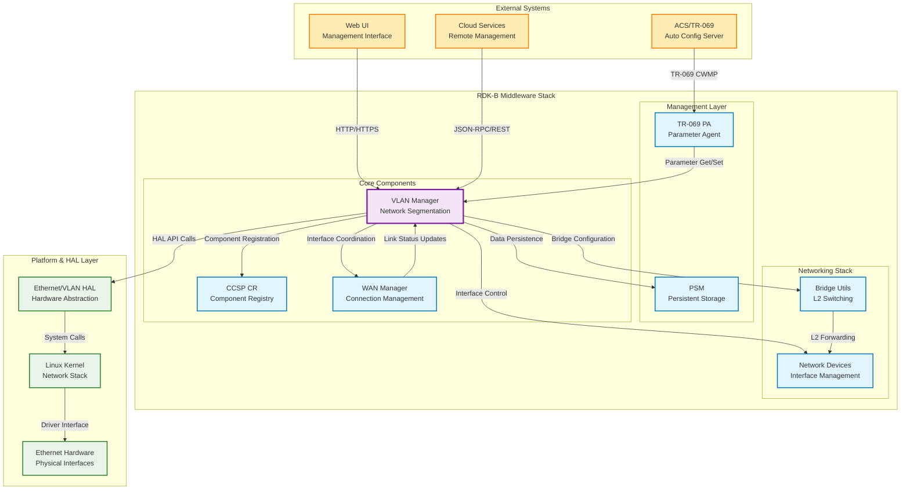
<br>

**new diagram**


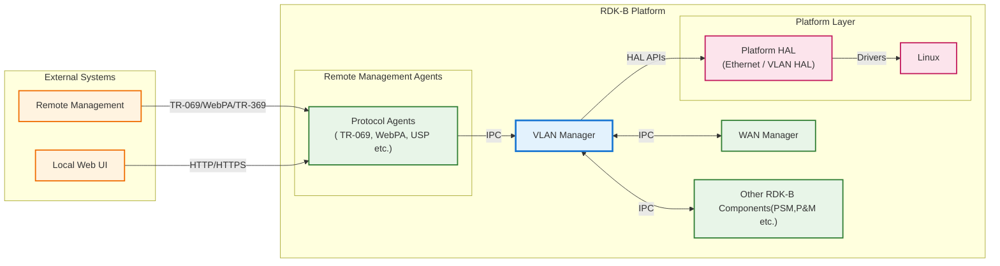

**Key Features & Responsibilities**: 

- **VLAN Interface Management**: Creates, configures, and manages virtual VLAN interfaces on top of physical Ethernet ports, enabling network segmentation and traffic isolation for multi-service delivery
- **TR-181 Data Model Implementation**: Provides complete TR-181 Device.X_RDK_Ethernet.Link and Device.X_RDK_Ethernet.VLANTermination object support with parameter validation and persistence
- **Hardware Abstraction**: Integrates with platform-specific Ethernet/VLAN HAL to perform low-level VLAN tagging, untagging, and filtering operations across different silicon vendors
- **Dynamic Configuration Management**: Supports runtime VLAN creation, modification, and deletion with atomic transaction processing to ensure network consistency
- **QoS and Priority Marking**: Implements IEEE 802.1p priority tagging and DSCP marking for traffic prioritization and quality of service management
- **Status Monitoring and Telemetry**: Provides real-time VLAN interface status monitoring, link state detection, and telemetry event generation for network troubleshooting
- **Inter-Component Integration**: Coordinates with WAN Manager, Bridge Utils, and other RDK-B networking components for seamless multi-service network delivery


## Design

The VLAN Manager follows a layered architectural design that cleanly separates concerns between data model management, business logic processing, and hardware abstraction. The component implements the Command Query Responsibility Segregation (CQRS) pattern where TR-181 parameter operations are handled through separate read and write paths, ensuring data consistency and enabling efficient caching mechanisms. The design emphasizes modularity and extensibility, allowing for easy integration of new VLAN features and hardware platforms.

The component's architecture centers around a message bus integration pattern using CCSP (Common Component Software Platform) infrastructure for inter-component communication. This enables loose coupling with other RDK-B middleware components while maintaining high performance through optimized IPC mechanisms. The design incorporates robust error handling, transaction management, and rollback capabilities to ensure that VLAN configuration changes are applied atomically, preventing network disruptions during configuration updates.

The north-bound interface design provides standardized TR-181 data model access through CCSP message bus, enabling integration with TR-069 Auto Configuration Servers, Web UI management interfaces, and cloud-based management systems. The south-bound interface abstracts hardware-specific VLAN operations through a JSON-RPC HAL interface, supporting both synchronous configuration operations and asynchronous event notifications. This design ensures platform portability while maintaining optimal performance for real-time networking operations.

Data persistence is managed through integration with the PSM (Persistent Storage Manager) component, ensuring that VLAN configurations survive device reboots and power cycles. The component implements a write-through caching strategy where configuration changes are immediately persisted to non-volatile storage while maintaining in-memory copies for fast access during normal operations.

<br>

**old diagram to delete**

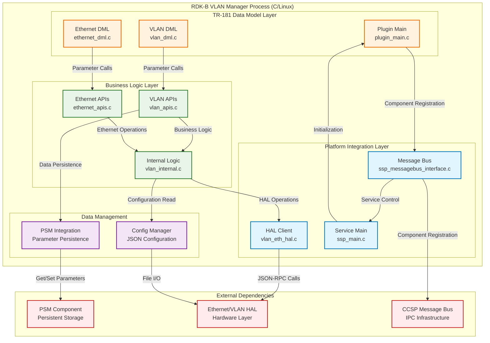

<br>

**new diagram**

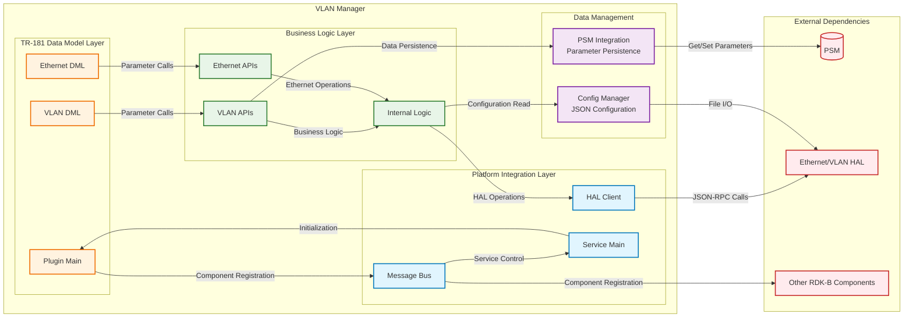

### Prerequisites and Dependencies

**RDK-B Platform and Integration Requirements:**

- **RDK-B Components**: CCSP Common Library, PSM (Persistent Storage Manager), CCSP Message Bus, Component Registry
- **HAL Dependencies**: Ethernet HAL interface (ethlinkvlanterm_hal_schema.json v0.0.1+), JSON-RPC HAL client library
- **Systemd Services**: ccsp-msg-bus.service, ccsp-psm.service must be active before vlan-manager.service starts
- **Message Bus**: CCSP message bus registration with namespace "eRT.com.cisco.spvtg.ccsp.vlanmanager"
- **TR-181 Data Model**: Device.X_RDK_Ethernet.Link.{i} and Device.X_RDK_Ethernet.VLANTermination.{i} object support
- **Configuration Files**: /etc/rdk/conf/vlan_manager_conf.json, /etc/rdk/schemas/ethlinkvlanterm_hal_schema.json
- **Startup Order**: Message Bus → PSM → HAL initialization → VLAN Manager component registration

<br>

**Threading Model:** 

The VLAN Manager implements a single-threaded event-driven architecture optimized for deterministic network configuration operations. The component operates within a single main thread that processes CCSP message bus events, TR-181 parameter operations, and HAL responses sequentially to avoid race conditions and ensure atomic VLAN configuration changes.

- **Threading Architecture**: Single-threaded with event loop processing
- **Main Thread**: Handles CCSP message bus events, TR-181 parameter get/set operations, HAL JSON-RPC communication, PSM persistence operations, and configuration file management
  - **Event Processing**: Uses CCSP message bus event loop for asynchronous handling of parameter requests, component lifecycle events, and inter-component notifications
  - **Synchronization**: No explicit synchronization required due to single-threaded design; HAL operations use synchronous JSON-RPC calls with timeout handling
- **Blocking Operations**: HAL calls may block briefly during hardware operations; timeout mechanisms prevent indefinite blocking

### Component State Flow

**Initialization to Active State**

The VLAN Manager follows a structured initialization sequence that ensures all dependencies are satisfied before becoming operational. The component progresses through distinct states, validating system prerequisites and establishing communication channels with dependent services.

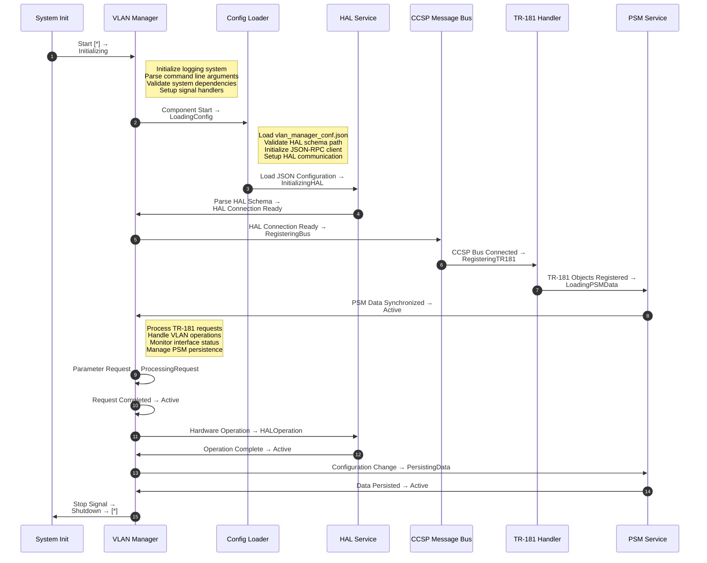

**Runtime State Changes and Context Switching**

During normal operation, the VLAN Manager responds to various triggers that cause operational context changes while maintaining service availability.

**State Change Triggers:**

- TR-181 parameter set operations trigger validation → commit → persist sequence
- HAL hardware events cause interface status updates and telemetry generation
- PSM synchronization requests trigger data consistency validation
- Component restart requests initiate graceful shutdown → reinitialization cycle

**Context Switching Scenarios:**

- Configuration mode switching between read-only status queries and write operations
- HAL communication context switching between JSON-RPC requests and asynchronous event handling
- Error recovery context switching from normal operation to diagnostic mode with enhanced logging

### Call Flow

**Initialization Call Flow:**

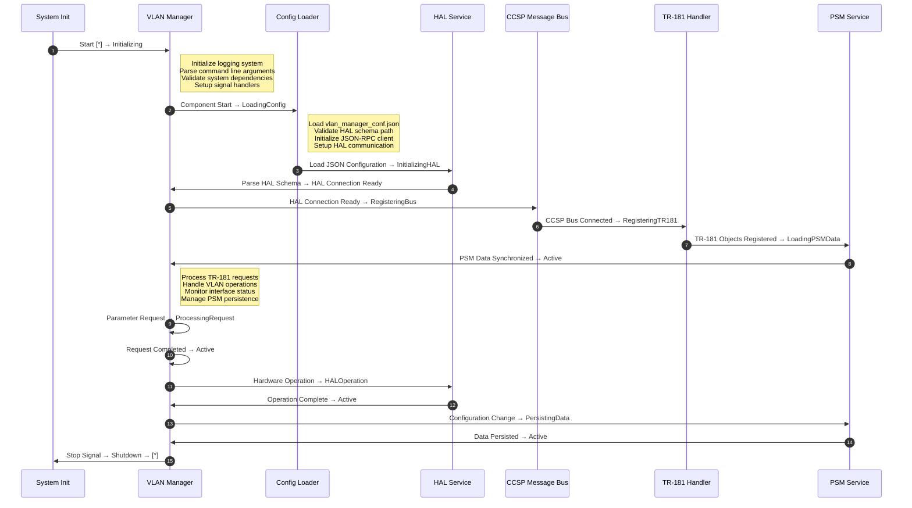

**VLAN Configuration Call Flow:**

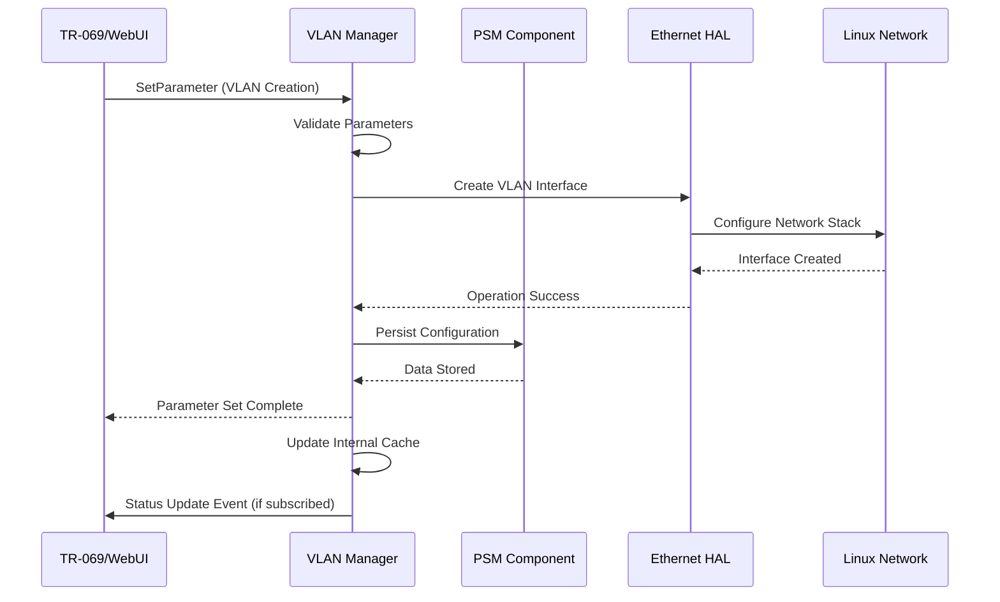

## TR‑181 Data Models

### Supported TR-181 Parameters

The VLAN Manager implements custom RDK extensions to the TR-181 data model, providing comprehensive Ethernet link management and VLAN termination capabilities. These parameters follow BBF specification patterns while extending functionality for advanced RDK-B networking requirements.

### Object Hierarchy

```
Device.
└── X_RDK_Ethernet.
    ├── Link.{i}.
    │   ├── Enable (boolean, R/W)
    │   ├── Status (string, R)
    │   ├── Alias (string, R/W)
    │   ├── Name (string, R/W)
    │   ├── LowerLayers (string, R/W)
    │   ├── X_RDK_BaseInterface (string, R/W)
    │   ├── MACAddress (string, R)
    │   ├── MACAddrOffSet (unsignedInt, R)
    │   ├── PriorityTagging (boolean, R/W)
    │   ├── X_RDK_Refresh (boolean, R/W)
    │   └── X_RDK_Marking.{i}.
    │       ├── SKBPort (unsignedInt, R)
    │       └── EthernetPriorityMark (int, R/W)
    └── VLANTermination.{i}.
        ├── Enable (boolean, R/W)
        ├── Status (string, R)
        ├── Alias (string, R/W)
        ├── Name (string, R/W)
        ├── LastChange (unsignedInt, R)
        ├── LowerLayers (string, R/W)
        ├── VLANID (int, R/W)
        ├── TPID (unsignedInt, R/W)
        └── X_RDK_BaseInterface (string, R/W)
```

### Parameter Definitions

**Core Ethernet Link Parameters:**

| Parameter Path | Data Type | Access | Default Value | Description | BBF Compliance |
|----------------|-----------|--------|---------------|-------------|----------------|
| `Device.X_RDK_Ethernet.Link.{i}.Enable` | boolean | R/W | `true` | Enables or disables the Ethernet link interface. When disabled, the interface is administratively down and no traffic is forwarded. Setting to false triggers interface shutdown procedures. | Custom Extension |
| `Device.X_RDK_Ethernet.Link.{i}.Status` | string | R | `"Down"` | Current operational status of the Ethernet link. Valid values: Up, Down, Unknown, Dormant, NotPresent, LowerLayerDown, Error. Status reflects both administrative and physical layer state. | TR-181 Issue 2 |
| `Device.X_RDK_Ethernet.Link.{i}.Alias` | string | R/W | `""` | User-defined alias for the Ethernet link instance. Maximum 64 characters. Used for human-readable identification in management interfaces. Must be unique within the Link table. | TR-181 Issue 2 |
| `Device.X_RDK_Ethernet.Link.{i}.Name` | string | R/W | `""` | System name of the Ethernet interface. Typically corresponds to Linux network interface name (e.g., eth0, erouter0). Maximum 64 characters. | TR-181 Issue 2 |
| `Device.X_RDK_Ethernet.Link.{i}.X_RDK_BaseInterface` | string | R/W | `""` | Base physical interface name that this logical interface is built upon. Used for mapping logical interfaces to physical hardware ports. | Custom Extension |
| `Device.X_RDK_Ethernet.Link.{i}.PriorityTagging` | boolean | R/W | `false` | Enables IEEE 802.1p priority tagging on untagged frames. When true, adds VLAN header with priority information but VLAN ID 0 for traffic prioritization without VLAN segmentation. | Custom Extension |

**VLAN Termination Parameters:**

| Parameter Path | Data Type | Access | Default Value | Description | BBF Compliance |
|----------------|-----------|--------|---------------|-------------|----------------|
| `Device.X_RDK_Ethernet.VLANTermination.{i}.Enable` | boolean | R/W | `false` | Enables or disables the VLAN termination instance. When enabled, creates VLAN interface and applies hardware VLAN filtering. Atomic operation with rollback on failure. | Custom Extension |
| `Device.X_RDK_Ethernet.VLANTermination.{i}.Status` | string | R | `"Down"` | Current operational status of VLAN termination. Reflects both VLAN interface state and underlying physical interface status. Error state indicates configuration or hardware failures. | TR-181 Issue 2 |
| `Device.X_RDK_Ethernet.VLANTermination.{i}.VLANID` | int | R/W | `-1` | IEEE 802.1Q VLAN identifier (1-4094). Value -1 indicates unassigned. VLAN ID 0 reserved for priority tagging. Must be unique per base interface. | Custom Extension |
| `Device.X_RDK_Ethernet.VLANTermination.{i}.TPID` | unsignedInt | R/W | `33024` | Tag Protocol Identifier in decimal (0x8100 = 33024). Supports standard 802.1Q (0x8100) and 802.1ad (0x88A8) values. Determines VLAN header format and stacking behavior. | Custom Extension |
| `Device.X_RDK_Ethernet.VLANTermination.{i}.LowerLayers` | string | R/W | `""` | Comma-separated list of lower-layer interface paths that this VLAN terminates on. References Device.Ethernet.Interface or Device.X_RDK_Ethernet.Link instances. Maximum 1024 characters. | TR-181 Issue 2 |

**Quality of Service Parameters:**

| Parameter Path | Data Type | Access | Default Value | Description | BBF Compliance |
|----------------|-----------|--------|---------------|-------------|----------------|
| `Device.X_RDK_Ethernet.Link.{i}.X_RDK_Marking.{i}.SKBPort` | unsignedInt | R | `0` | Socket buffer port identifier used for traffic classification and marking. Read-only value assigned by kernel networking stack for QoS processing. | Custom Extension |
| `Device.X_RDK_Ethernet.Link.{i}.X_RDK_Marking.{i}.EthernetPriorityMark` | int | R/W | `-1` | IEEE 802.1p priority value (0-7) applied to outbound frames on this interface. Value -1 disables priority marking. Used for traffic prioritization and QoS enforcement. | Custom Extension |

### Parameter Registration and Access

- **Implemented Parameters**: All TR‑181 parameters are implemented through DML (Data Model Library) functions in `vlan_dml.c` and `ethernet_dml.c` with comprehensive validation and default value handling.
- **Parameter Registration**: Parameters are registered with CCSP Message Bus during component initialization using XML data model definitions in `RdkVlanManager.xml`. Registration includes function pointers for get/set operations and parameter metadata.
- **Access Mechanism**: External components access parameters via CCSP Message Bus using standard TR-181 paths. Internal access uses direct DML function calls for performance optimization.
- **Validation Rules**: Parameter values undergo multi-stage validation including syntax checking, range validation, dependency verification, and hardware capability confirmation before commit operations.


## Internal Modules

The VLAN Manager is architected as a modular component with clearly defined separation of concerns. Each module handles specific aspects of VLAN management, from TR-181 data model implementation to hardware abstraction layer integration.

| Module/Class | Description | Key Files |
|-------------|------------|-----------|
| **TR-181 Data Model Layer** | Implements TR-181 parameter get/set operations, parameter validation, and data model registration. Handles atomic transaction processing for configuration changes. | `vlan_dml.c`, `ethernet_dml.c`, `plugin_main.c` |
| **Business Logic Layer** | Contains core VLAN management logic, interface lifecycle management, and coordination between data model operations and hardware abstraction. | `vlan_apis.c`, `ethernet_apis.c`, `vlan_internal.c` |
| **Hardware Abstraction** | Provides platform-agnostic interface to underlying Ethernet/VLAN hardware through JSON-RPC HAL communication. Handles vendor-specific implementations. | `vlan_eth_hal.c`, HAL schema definitions |
| **System Service Provider** | Manages component lifecycle, CCSP message bus integration, and inter-component communication. Handles service registration and discovery. | `ssp_main.c`, `ssp_messagebus_interface.c` |
| **Persistence Management** | Handles configuration persistence through PSM integration, ensuring VLAN configurations survive device reboots and providing configuration rollback capabilities. | Integrated within APIs modules |

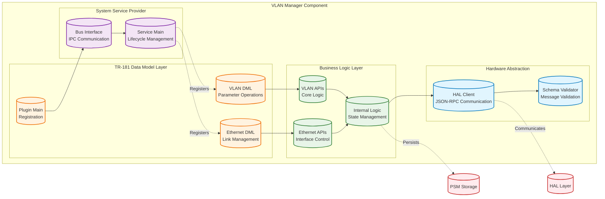

## Component Interactions

The VLAN Manager operates as a central hub in the RDK-B networking ecosystem, coordinating with multiple middleware components, system services, and hardware abstraction layers to provide comprehensive VLAN management capabilities.

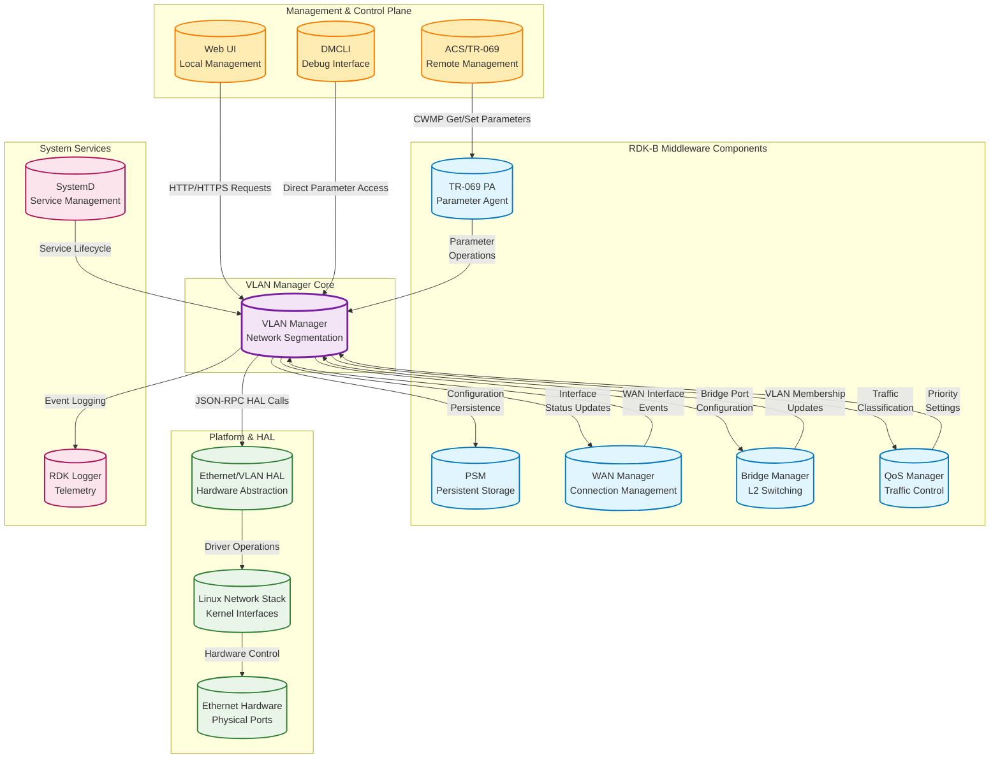

### Interaction Matrix

| Target Component/Layer | Interaction Purpose | Key APIs/Endpoints |
|------------------------|-------------------|------------------|
| **RDK-B Middleware Components** |
| TR-069 Parameter Agent | TR-181 parameter get/set operations, configuration management | `GetParameterValues`, `SetParameterValues`, `GetParameterNames` |
| PSM (Persistent Storage Manager) | VLAN configuration persistence, parameter storage | `PSM_Set_Record_Value2`, `PSM_Get_Record_Value2` |
| WAN Manager | WAN interface VLAN configuration, status synchronization | `Device.X_RDK_WanManager.CPEInterface.{i}.*` |
| Bridge Manager | L2 bridge VLAN membership, port configuration | `Device.X_RDK_BridgingManager.*` events |
| **System & HAL Layers** |
| Ethernet/VLAN HAL | Hardware VLAN operations, interface control | `getParameters`, `setParameters`, `deleteObject` |
| Linux Network Stack | Direct interface operations, status monitoring | `ioctl()`, `netlink_socket()`, `/proc/net/*` |

**Events Published by VLAN Manager:**

| Event Name | Event Topic/Path | Trigger Condition | Subscriber Components |
|------------|-----------------|-----------------|---------------------|
| VLANInterface.Created | `Device.X_RDK_Ethernet.VLANTermination.{i}` | VLAN interface creation complete | WAN Manager, Bridge Manager, QoS Manager |
| VLANInterface.StatusChange | `Device.X_RDK_Ethernet.VLANTermination.{i}.Status` | Interface operational status change | Network monitoring components |
| EthernetLink.StatusChange | `Device.X_RDK_Ethernet.Link.{i}.Status` | Physical link status change | WAN Manager, Bridge Manager |
| Configuration.Committed | `Device.X_RDK_Ethernet` | Configuration transaction commit | Management interfaces, Telemetry |


**Events Consumed by VLAN Manager:**

| Event Source | Event Topic/Path | Purpose | Handler Function |
|-------------|-----------------|---------|------------------|
| WAN Manager | `Device.X_RDK_WanManager.CPEInterface.{i}.Status` | React to WAN interface status changes | `WanInterface_StatusHandler()` |
| HAL Layer | `ethvlanhal.interfaceStatusNotification` | Hardware-level interface events | `HAL_EventHandler()` |
| System | `systemd.service.status` | Service lifecycle management | `SystemD_StatusHandler()` |


### IPC Flow Patterns

**Primary IPC Flow - VLAN Configuration:**

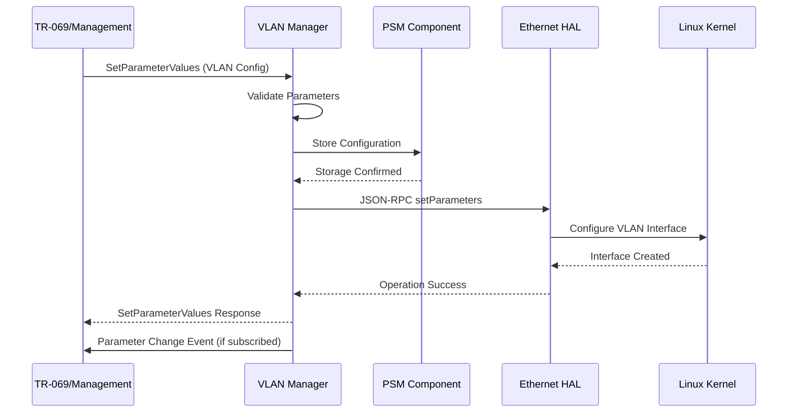

**Event Notification Flow:**

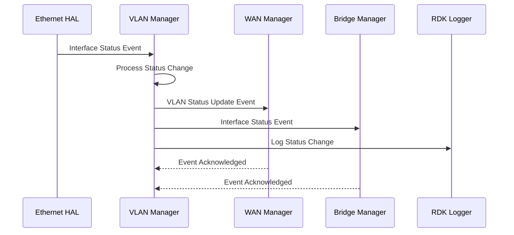

## Implementation Details

### Major HAL APIs Integration

The VLAN Manager integrates with the Ethernet/VLAN Hardware Abstraction Layer through a comprehensive JSON-RPC interface that provides platform-agnostic access to VLAN hardware capabilities across different silicon vendors and hardware platforms.

**Core HAL APIs:**

| HAL API | Purpose | Implementation File |
|---------|---------|-------------------|
| `getParameters` | Retrieve current VLAN interface configuration and status from hardware | `vlan_eth_hal.c` |
| `setParameters` | Configure VLAN interfaces, VLAN IDs, and hardware filtering | `vlan_eth_hal.c` |
| `deleteObject` | Remove VLAN termination instances and cleanup hardware resources | `vlan_eth_hal.c` |
| `getSchema` | Retrieve HAL schema version and supported parameter definitions | `vlan_eth_hal.c` |
| `subscribeEvent` | Register for hardware-level interface status and error notifications | `vlan_eth_hal.c` |


### Key Implementation Logic

- **State Machine Engine**: The core state management logic is implemented in `vlan_internal.c` and `ethernet_internal.c`, handling VLAN interface lifecycle from creation through active operation to deletion. State transitions are managed through atomic operations with rollback capabilities.

  - Initialization state handlers in `vlan_apis.c` manage component startup and dependency validation
  - Runtime state transitions in `vlan_internal.c` handle configuration changes and error recovery  
  - State transition handlers in `vlan_dml.c` coordinate TR-181 parameter changes with internal state updates
  
- **Event Processing**: Hardware events from the HAL layer are processed asynchronously through JSON-RPC callbacks, mapped to internal state changes, and propagated to dependent components through CCSP message bus events.

  - HAL event reception and parsing in `vlan_eth_hal.c` with JSON schema validation
  - Event-to-state mapping logic in `vlan_internal.c` for status determination
  - Asynchronous event processing through CCSP message bus integration
  
- **Error Handling Strategy**: Comprehensive error detection and recovery mechanisms ensure network stability during configuration failures, hardware errors, or component communication issues.

  - Parameter validation with detailed error reporting in DML layer functions
  - HAL communication timeout handling and retry logic in `vlan_eth_hal.c`
  - Timeout handling and retry logic for PSM operations and CCSP message bus communication
  
- **Logging & Debugging**: Multi-level logging system provides detailed visibility into VLAN operations, hardware interactions, and inter-component communication for troubleshooting and performance monitoring.

  - CCSP trace logging with configurable verbosity levels in all modules
  - RDK Logger integration for telemetry and analytics in `vlan_apis.c`
  - Debug hooks for troubleshooting connectivity issues through DMCLI parameter access

### Key Configuration Files

| Configuration File | Purpose | Override Mechanisms |
|--------------------|---------|---------------------|
| `vlan_manager_conf.json` | HAL communication and server configuration | Environment variables, command line |
| `RdkVlanManager.xml` | TR-181 data model definitions and function mappings | Compile-time configuration |
| `ethlinkvlanterm_hal_schema.json` | HAL interface schema validation and API definitions | HAL vendor implementations |