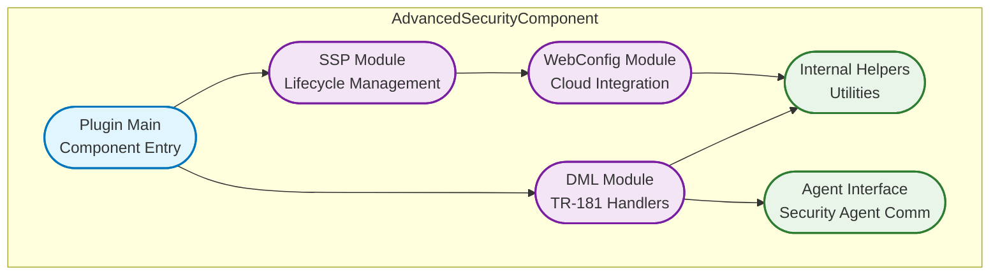

# Advanced Security Component Documentation

The Advanced Security component (CcspAdvSecurity) provides comprehensive network security features for RDK-B devices, implementing device fingerprinting, safe browsing protection, network flow monitoring, and parental controls. This component serves as the middleware interface for advanced security services, integrating with external security agents (CuJo Agent/Rabid) to deliver real-time threat detection and network protection capabilities.

The component operates as a critical security layer in the RDK-B middleware stack, providing TR-181 parameter management for various security features while coordinating with underlying security agents for actual threat detection and mitigation. It enables device identification, malicious website blocking, network traffic analysis, and advanced parental control functionalities through a unified management interface.

At the module level, the Advanced Security component implements a plugin-based architecture with separate modules for Device Fingerprinting (network device identification and classification), Safe Browsing (malicious URL detection and blocking), Softflowd (network flow monitoring), and Advanced Parental Control (content filtering and access control). The component also provides WebConfig integration for remote configuration management and RFC (Remote Feature Control) support for enabling/disabling security features dynamically.


**Key Features & Responsibilities**: 

- **Device Fingerprinting**: Provides network device identification and classification capabilities by analyzing network traffic patterns, enabling automatic device discovery and categorization for security policy enforcement
- **Safe Browsing Protection**: Implements malicious website detection and blocking functionality through integration with security threat databases and real-time URL reputation services
- **Network Flow Monitoring (Softflowd)**: Enables network traffic analysis and flow monitoring capabilities for detecting suspicious network behavior and generating security telemetry data
- **Advanced Parental Controls**: Delivers content filtering and access control features allowing parents to manage and restrict network access for specific devices or users based on time, content categories, or specific websites
- **RFC Feature Management**: Provides Remote Feature Control capabilities for dynamically enabling/disabling security features through centralized configuration management without requiring device restarts
- **WebConfig Integration**: Supports remote configuration management through WebConfig framework, enabling cloud-based security policy updates and configuration synchronization
- **TR-181 Data Model Interface**: Implements comprehensive TR-181 parameter support for security feature management, providing standardized access to security configuration and status information
- **Security Agent Integration**: Coordinates with external security agents (CuJo Agent/Rabid) for actual threat detection, policy enforcement, and security event generation


## Design

The Advanced Security component follows a layered modular design that separates policy management from enforcement mechanisms. The core design principle centers around providing a standardized TR-181 interface for security feature configuration while delegating actual security processing to specialized external agents. This separation allows for flexible deployment of different security backends while maintaining consistent management interfaces across various RDK-B device types.

The component implements a plugin-based architecture where each security feature (Device Fingerprinting, Safe Browsing, Softflowd, Parental Controls) is handled by dedicated modules with well-defined interfaces. The design ensures loose coupling between components while providing centralized configuration management and event coordination. The architecture supports both synchronous parameter operations (get/set) and asynchronous event-driven processing for real-time security responses.

North-bound interactions are handled through RBus/DBUS messaging for integration with other RDK-B components, WebConfig framework for cloud-based configuration management, and direct TR-181 parameter access for management systems. South-bound interactions utilize IPC mechanisms (sockets, shared memory) for communication with security agents, system calls for kernel module management, and file-based configuration for persistent settings.

IPC mechanisms are designed based on platform capabilities, with RBus being the preferred method for component-to-component communication on newer platforms, while maintaining DBUS compatibility for legacy systems. The design includes fail-safe mechanisms ensuring that security features degrade gracefully when agents are unavailable, and configuration changes are validated before commitment to prevent system instability.

Data persistence is achieved through a combination of syscfg for persistent configuration storage, temporary files for runtime state management, and WebConfig framework for cloud-synchronized settings. The component manages configuration versioning and provides rollback capabilities for failed configuration updates.




### Prerequisites and Dependencies

**Build-Time Flags and Configuration:**

| Configure Option | DISTRO Feature | Build Flag | Purpose | Default |
|------------------|----------------|------------|---------|---------|  
| `--enable-unitTestDockerSupport` | N/A | `UNIT_TEST_DOCKER_SUPPORT` | Enable Docker support for unit testing | Disabled |
| `--with-ccsp-arch=arm` | N/A | ARM architecture support | Configure for ARM-based platforms | Required |
| N/A | `safec` | `SAFEC_DUMMY_API` (when disabled) | Safe C library integration for secure string operations | Enabled |
| N/A | `rdk-b` | Core RDK-B platform support | Essential RDK-B middleware integration | Required |
| N/A | `advanced-security` | Advanced security features | Enable advanced security component | Required |
| N/A | `cujo-agent` | CuJo security agent support | Enable CuJo/Rabid agent integration | Required |
| N/A | `kirkstone` | `python3native` vs `pythonnative` | Python version selection for build tools | python3native (newer), pythonnative (legacy) |

<br>

**RDK-B Platform and Integration Requirements**

- **RDK-B Components**: PSM (Parameter Storage Manager), Component Registrar (CR), WebConfig Framework, Device Manager, System Info component
- **HAL Dependencies**: Platform HAL for network interface management, minimum version supporting netfilter integration
- **Systemd Services**: CcspCrSsp.service, CcspPsmSsp.service must be active before advanced security starts; network.target dependency for network availability
- **Hardware Requirements**: Minimum 256MB RAM for agent operation, netfilter kernel support, network interface access capabilities
- **Message Bus**: RBus registration for "eRT.com.cisco.spvtg.ccsp.advsecurity" namespace (newer platforms) or DBUS com.cisco.spvtg.ccsp.advsecurity (legacy platforms)
- **TR-181 Data Model**: Device.DeviceInfo.X_RDKCENTRAL-COM_DeviceFingerPrint.* and Device.DeviceInfo.X_RDKCENTRAL-COM_AdvancedSecurity.* parameter support
- **Configuration Files**: /usr/ccsp/advsecurity/TR181-AdvSecurity.xml data model definition, /etc/cujo-agent configuration directory
- **Startup Order**: Must initialize after PSM, CR, and WebConfig components; starts CuJo Agent/Rabid after component initialization

**Threading Model:** 

The Advanced Security component implements a lightweight multi-threaded architecture with event-driven processing for security feature management and agent coordination. Unlike components with extensive threading models, Advanced Security focuses on minimal threading while maintaining responsive parameter operations and agent communication.

| Thread & Function | Purpose | Cycle/Timeout | Synchronization |
|-------------------|---------|----------------|-----------------|  
| **Main Thread**<br>`main()` / `ssp_main()` | Component initialization, TR-181 parameter processing, daemon lifecycle management | Event-driven message loop, signal handling, component registration, configuration loading | pthread signals for termination, SSP lifecycle callbacks |
| **Logger Thread**<br>`advsec_logger_th()` | Device fingerprinting logging and periodic system monitoring | Configurable logging period (default 1440 minutes), health monitoring cycles | `logMutex` mutex, `logCond` condition variable for timeout control |
| **Sysevent Handler Thread**<br>`advsec_sysevent_handler_th()` | System event processing and bridge mode detection | Continuous event listening, 2-second polling intervals, event-driven responses | Event-based synchronization, sysevent file descriptor monitoring |
| **WebConfig Processing**<br>Integrated in main thread | Cloud configuration updates and synchronization | WebConfig framework callbacks, asynchronous processing | WebConfig framework internal synchronization |

### Component State Flow

**Initialization to Active State**

The Advanced Security component follows a structured initialization sequence ensuring proper dependency resolution and secure agent startup. The component validates system prerequisites, loads configuration from persistent storage, establishes IPC connections, and coordinates security agent lifecycle management before transitioning to active operational state.


**Runtime State Changes and Context Switching**

The component supports dynamic feature activation/deactivation based on RFC (Remote Feature Control) settings and user configuration changes. State transitions occur when security features are enabled/disabled, when the security agent requires restart due to configuration changes, or when the system enters/exits bridge mode.

**State Change Triggers:**

- RFC parameter changes requiring agent reconfiguration (triggers agent restart with new settings)
- Bridge mode activation/deactivation (disables/enables security features as network topology changes)
- Security agent crashes or becomes unresponsive (triggers automatic restart procedures)
- WebConfig updates from cloud services (triggers validation and application of new security policies)
- Memory pressure conditions (triggers agent hibernation to preserve system resources)

**Context Switching Scenarios:**

- **Bridge Mode Context**: Component disables all security features when device operates in bridge mode, preserving configuration for later restoration
- **Agent Recovery Context**: When security agent fails, component maintains TR-181 parameter access while attempting agent restart in background
- **Configuration Update Context**: During WebConfig updates, component validates new configuration before committing changes and restarting affected services

### Call Flow

**Initialization Call Flow:**


**Request Processing Call Flow:**

The most critical flow involves TR-181 parameter operations that trigger security feature configuration changes and agent interactions.


## TR‑181 Data Models

### Supported TR-181 Parameters

The Advanced Security component implements vendor-specific TR-181 parameters under the Device.DeviceInfo.X_RDKCENTRAL-COM namespace, providing comprehensive management interfaces for advanced security features. The implementation follows BBF TR-181 specification guidelines for parameter structure, access controls, and data validation while extending functionality for RDK-B specific security requirements.

### Object Hierarchy

```
Device.
└── DeviceInfo.
    ├── X_RDKCENTRAL-COM_DeviceFingerPrint.
    │   ├── Enable (boolean, R/W)
    │   ├── LoggingPeriod (unsignedInt, R/W)
    │   ├── EndpointURL (string, R/W)
    │   └── LogLevel (unsignedInt, R/W)
    ├── X_RDKCENTRAL-COM_AdvancedSecurity.
    │   ├── Data (string, W)
    │   ├── SafeBrowsing.
    │   │   ├── Enable (boolean, R/W)
    │   │   ├── ConfigVersion (unsignedInt, R/W)
    │   │   ├── RouterIP (string, R)
    │   │   ├── DNSServerIP (string, R)
    │   │   ├── Blockpage (string, R)
    │   │   ├── Warnpage (string, R)
    │   │   ├── Cacheurl (string, R)
    │   │   └── OtmDedupFqdn (string, R)
    │   ├── Softflowd.
    │   │   └── Enable (boolean, R/W)
    │   └── RabidFramework.
    │       ├── MacCacheSize (unsignedInt, R/W)
    │       └── DnsCacheSize (unsignedInt, R/W)
    └── X_RDKCENTRAL-COM_RFC.
        ├── Feature.
        │   ├── AdvancedParentalControl.
        │   │   └── Enable (boolean, R/W)
        │   ├── PrivacyProtection.
        │   │   └── Enable (boolean, R/W)
        │   ├── DeviceFingerPrintICMPv6.
        │   │   └── Enable (boolean, R/W)
        │   ├── WSDiscoveryAnalysis.
        │   │   └── Enable (boolean, R/W)
        │   ├── AdvancedSecurityOTM.
        │   │   └── Enable (boolean, R/W)
        │   ├── AdvancedSecurityUserSpace.
        │   │   └── Enable (boolean, R/W)
        │   ├── AdvancedSecurityCujoTracer.
        │   │   └── Enable (boolean, R/W)
        │   ├── AdvancedSecurityCujoTelemetry.
        │   │   └── Enable (boolean, R/W)
        │   ├── AdvancedSecurityWiFiDataCollection.
        │   │   └── Enable (boolean, R/W)
        │   ├── AdvancedSecurityLevl.
        │   │   └── Enable (boolean, R/W)
        │   ├── AdvancedSecurityAgent.
        │   │   └── Enable (boolean, R/W)
        │   └── AdvancedSecuritySafeBrowsing.
               └── Enable (boolean, R/W)
```

### Parameter Definitions

**Core Parameters:**

| Parameter Path | Data Type | Access | Default Value | Description | BBF Compliance |
|----------------|-----------|--------|---------------|-------------|----------------|
| `Device.DeviceInfo.X_RDKCENTRAL-COM_DeviceFingerPrint.Enable` | boolean | R/W | `false` | Enables or disables device fingerprinting functionality. When enabled, the system analyzes network traffic patterns to identify and classify connected devices automatically. Valid values: true (enabled), false (disabled). | TR-181 Issue 2 |
| `Device.DeviceInfo.X_RDKCENTRAL-COM_DeviceFingerPrint.LoggingPeriod` | unsignedInt | R/W | `1440` | Specifies the logging period in minutes for device fingerprinting data collection. Range: 60-2880 minutes (1-48 hours). Controls frequency of fingerprinting data uploads to cloud services. | TR-181 Issue 2 |
| `Device.DeviceInfo.X_RDKCENTRAL-COM_DeviceFingerPrint.EndpointURL` | string | R/W | `""` | Defines the endpoint URL for device fingerprinting data uploads. Must be a valid HTTPS URL. Used for sending collected device classification data to cloud analytics services. | TR-181 Issue 2 |
| `Device.DeviceInfo.X_RDKCENTRAL-COM_DeviceFingerPrint.LogLevel` | unsignedInt | R/W | `3` | Controls logging verbosity for device fingerprinting module. Valid values: 1 (Error), 2 (Warning), 3 (Info), 4 (Verbose). Higher values produce more detailed logging output. | TR-181 Issue 2 |
| `Device.DeviceInfo.X_RDKCENTRAL-COM_AdvancedSecurity.SafeBrowsing.Enable` | boolean | R/W | `false` | Enables or disables safe browsing protection. When enabled, system blocks access to malicious websites and provides warning pages for suspicious content. Requires active security agent. | TR-181 Issue 2 |
| `Device.DeviceInfo.X_RDKCENTRAL-COM_AdvancedSecurity.Softflowd.Enable` | boolean | R/W | `false` | Enables or disables network flow monitoring via softflowd daemon. When enabled, collects network flow statistics for security analysis and anomaly detection. | TR-181 Issue 2 |
| `Device.DeviceInfo.X_RDKCENTRAL-COM_RFC.Feature.AdvancedParentalControl.Enable` | boolean | R/W | `false` | RFC parameter controlling advanced parental control features. When enabled, allows content filtering and access restrictions based on device, time, and content category policies. | Custom Extension |

## Internal Modules

The Advanced Security component consists of several specialized modules that handle different aspects of security functionality. Each module operates independently while sharing common infrastructure for configuration management and agent communication. The DML (Data Model Library) modules handle TR-181 parameter operations, while the SSP (Service Support Provider) module manages component lifecycle and IPC communications.

| Module/Class | Description | Key Files |
|-------------|------------|-----------|
| AdvSecurityDml | Core TR-181 parameter handling and security feature management. Implements all DML functions for device fingerprinting, safe browsing, and parental controls. Handles parameter validation, persistence, and agent coordination. | `cosa_adv_security_dml.c`, `cosa_adv_security_dml.h` |
| AdvSecuritySsp | Service Support Provider for component lifecycle management. Handles process initialization, RBus/DBUS registration, message bus interface, and component shutdown procedures. | `ssp_main.c`, `ssp_messagebus_interface.c`, `ssp_global.h` |
| WebConfigModule | WebConfig framework integration for cloud-based configuration management. Handles remote configuration updates, version management, and configuration validation for security features. | `cosa_adv_security_webconfig.c`, `cosa_adv_security_webconfig.h` |
| InternalHelpers | Utility functions for security operations including parameter validation, URL checking, security agent communication, and system state management. | `cosa_adv_security_internal.c`, `cosa_adv_security_internal.h`, `advsecurity_helpers.c` |
| PluginMain | Plugin initialization and function registration interface. Registers all DML callback functions with the COSA framework and manages plugin lifecycle. | `plugin_main.c`, `plugin_main.h` |
| AgentInterface | Interface module for communication with external security agents (CuJo Agent/Rabid). Handles command sending, status monitoring, and agent lifecycle management. | `cujoagent_dcl_api.c`, `cujoagent_dcl_api.h` |

## Component Interactions

The Advanced Security component maintains extensive interactions with both RDK-B middleware components and system-level services. It serves as a bridge between high-level security policy management and low-level security enforcement, coordinating with external security agents while providing standardized TR-181 interfaces for management systems.

### Interaction Matrix

| Target Component/Layer | Interaction Purpose | Key APIs/Endpoints |
|------------------------|-------------------|------------------|
| **RDK-B Middleware Components** |
| PSM (Parameter Storage Manager) | Persistent parameter storage and retrieval, configuration backup/restore | `PSM_Set_Record_Value2()`, `PSM_Get_Record_Value2()` |
| Component Registrar (CR) | Component registration, namespace reservation, capability announcement | `CcspBaseIf_registerCapabilities()`, `CcspBaseIf_unregisterComponent()` |
| WebConfig Framework | Remote configuration management, cloud policy updates | `webconfig_subdoc_register()`, `webconfig_apply_config()` |
| Device Manager | Device information queries, TR-069 parameter forwarding | RBus method calls: `Device.DeviceInfo.*` |
| **System & HAL Layers** |
| CuJo Agent/Rabid Agent | Security enforcement, threat detection, policy application | IPC sockets: `/tmp/cujo-agent.sock`, agent control commands |
| syscfg Configuration | Persistent configuration storage and system settings | `syscfg_get()`, `syscfg_set()`, `syscfg_commit()` |
| systemd Services | Service lifecycle management, dependency control | `systemctl start/stop/restart CcspAdvSecurity` |

**Events Published by Advanced Security Component:**

| Event Name | Event Topic/Path | Trigger Condition | Subscriber Components |
|------------|-----------------|-------------------|---------------------|
| Security Feature Status | `Device.DeviceInfo.X_RDKCENTRAL-COM_AdvancedSecurity` | Feature enable/disable state changes | WebUI, Device Manager, Telemetry |
| Agent Status Update | `eRT.com.cisco.spvtg.ccsp.advsecurity.agent.status` | Security agent startup/shutdown, health status changes | System Monitor, Telemetry Agent |
| Configuration Change | `eRT.com.cisco.spvtg.ccsp.advsecurity.config` | TR-181 parameter modifications, RFC feature toggles | PSM, Configuration Management |
| Security Event | `eRT.com.cisco.spvtg.ccsp.advsecurity.security` | Threat detection, policy violations | Logging, Telemetry, Notification Service |

### IPC Flow Patterns

**Primary IPC Flow - TR-181 Parameter Operation:**


**Event Notification Flow:**


## Implementation Details

### Major HAL APIs Integration

The Advanced Security component primarily operates at the middleware layer and does not directly integrate with traditional HAL APIs. Instead, it relies on system-level interfaces and external security agents for hardware interaction. The component uses standard Linux system calls and library functions for network interface management and configuration access.

**Core System APIs:**

| System API | Purpose | Implementation File |
|---------|---------|-------------------|
| `syscfg_get/syscfg_set` | Configuration parameter persistence and retrieval | `cosa_adv_security_dml.c` |
| `socket()` family | IPC communication with security agents | `cosa_adv_security_internal.c` |
| `pthread_*` | Multi-threading support for concurrent operations | `ssp_main.c` |

### Key Implementation Logic

- **State Machine Engine**: The component implements a feature-based state machine where each security feature (Device Fingerprinting, Safe Browsing, Softflowd, Parental Controls) maintains independent state transitions based on configuration changes and agent status.
     - Main implementation in `cosa_adv_security_dml.c` where DML handlers manage feature state transitions
     - State transition handlers in `cosa_adv_security_internal.c` for coordinating between multiple security features
  
- **Event Processing**: Hardware events are processed through the security agent interface, which monitors network traffic and system events to detect security threats and policy violations.
     - Security agent communication through IPC sockets for real-time event processing
     - Event queue management using pthread condition variables for asynchronous processing
     - Asynchronous event processing through dedicated worker threads for non-blocking operation

- **Error Handling Strategy**: Comprehensive error handling ensures system stability even when security agents fail or become unresponsive.
     - Agent failure detection through periodic health checks and IPC timeout mechanisms
     - Recovery mechanisms include automatic agent restart and graceful feature degradation
     - Timeout handling and retry logic with exponential backoff for agent communication failures

- **Logging & Debugging**: Multi-level logging system provides detailed information for troubleshooting security feature issues.
     - Security feature state transition logging with configurable verbosity levels
     - Agent communication tracing for debugging IPC interaction issues
     - Debug hooks for runtime troubleshooting including memory usage monitoring and performance metrics

### Key Configuration Files

| Configuration File | Purpose | Override Mechanisms |
|--------------------|---------|--------------------|
| `/usr/ccsp/advsecurity/TR181-AdvSecurity.xml` | TR-181 data model definition and parameter registration | Version-controlled through build system, no runtime override |
| `/etc/cujo-agent/config` | Security agent configuration directory | Environment variables, syscfg overrides |
| `/tmp/advsec_*` | Runtime state files for feature status | Managed by component logic, cleared on restart |
| `/etc/systemd/system/CcspAdvSecurity.service` | systemd service definition | systemd override files in `/etc/systemd/system/CcspAdvSecurity.service.d/` |