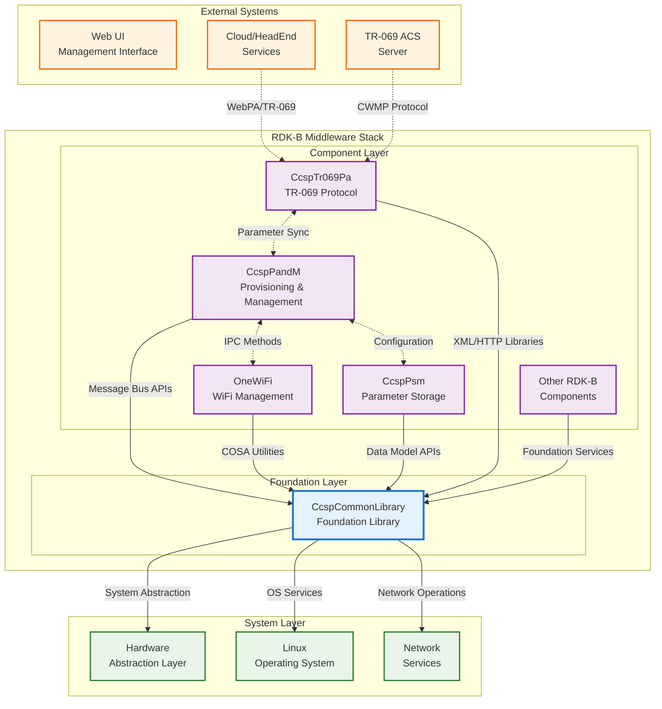
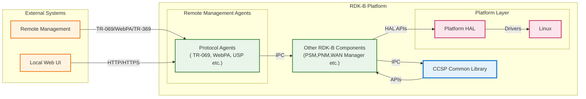
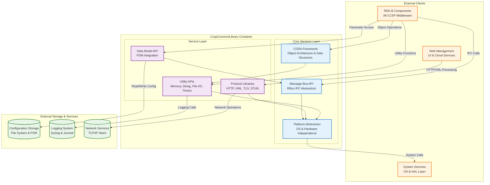
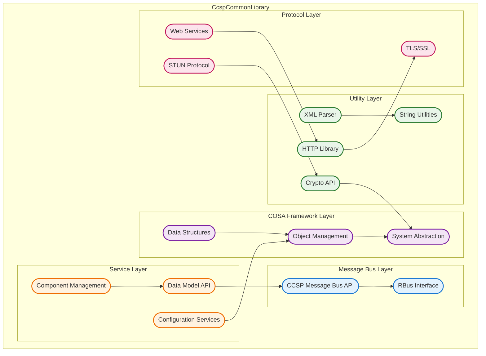
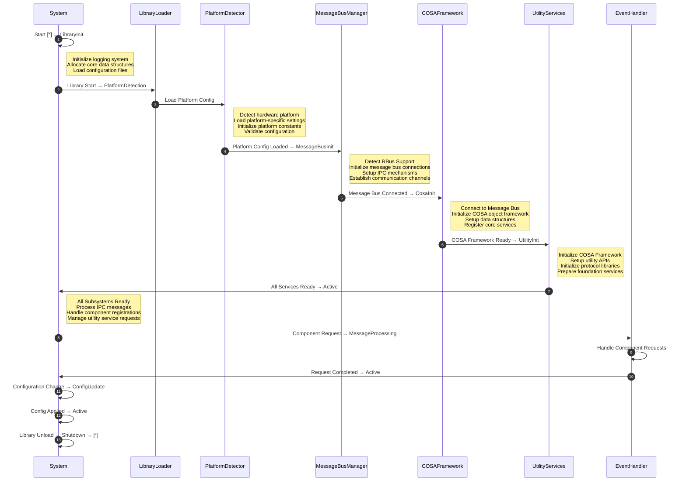
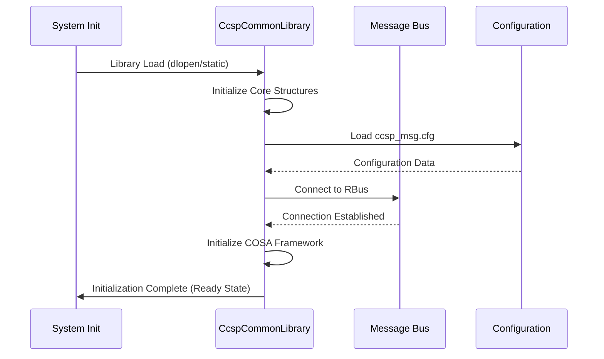
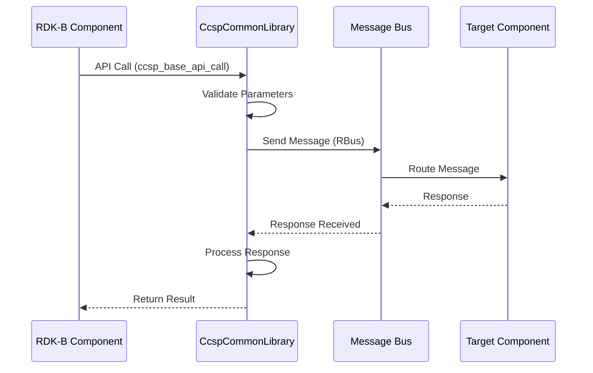
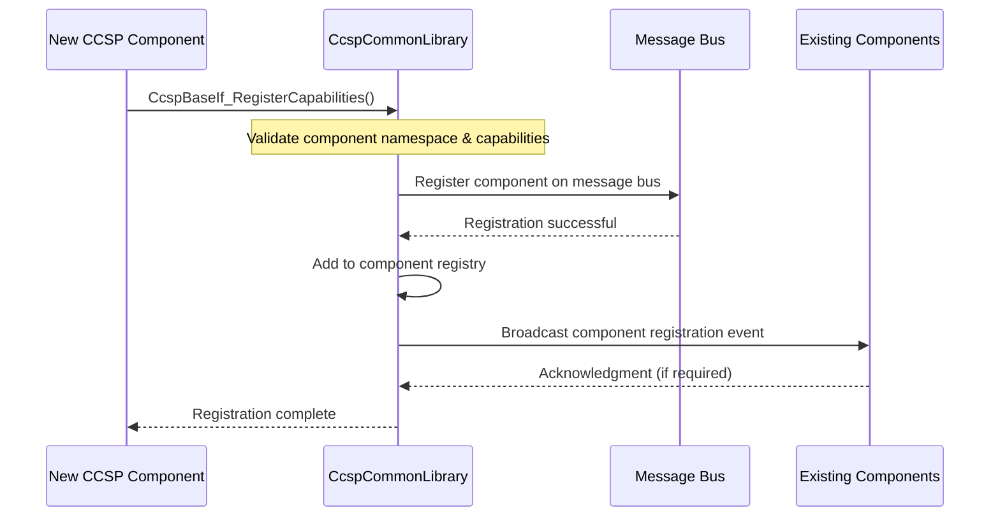
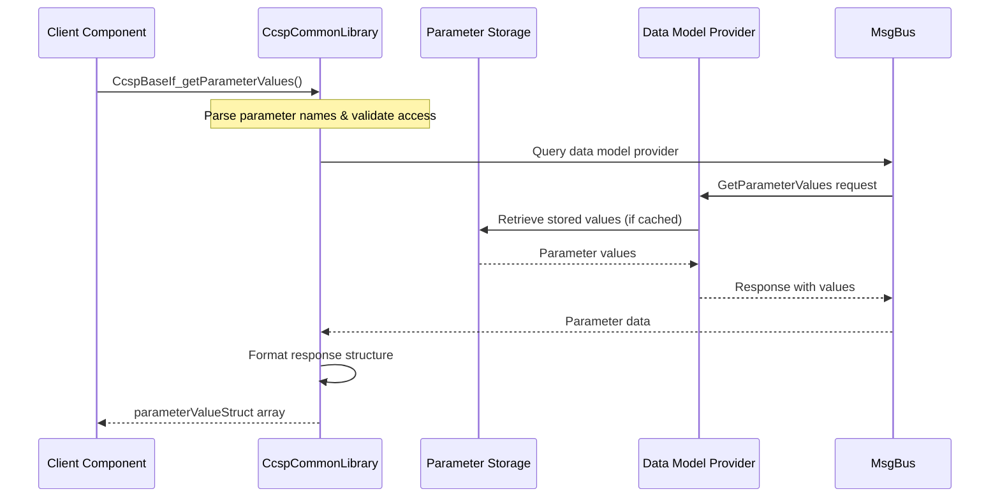

# CcspCommonLibrary Documentation

CcspCommonLibrary serves as the foundational middleware library for the Common Component Software Platform (CCSP) architecture in RDK-B. This comprehensive library provides essential infrastructure services that enable all RDK-B components to communicate, share data, and integrate within the broader RDK-B ecosystem. The library acts as the cornerstone that standardizes component interactions through message bus abstractions, data model APIs, and utility functions.

At its core, CcspCommonLibrary provides three critical service layers. First, it establishes the communication backbone through CCSP message bus APIs that enable seamless inter-component communication via RBus protocol. Second, it offers a rich collection of COSA (Component Object Software Architecture) utilities that provide standardized interfaces for system interactions, data structures, and protocol handling. Third, it delivers comprehensive utility APIs for XML parsing, HTTP processing, cryptographic operations, and network protocol implementations that form the building blocks for higher-level RDK-B services.

The component's architecture ensures that all RDK-B middleware components have access to consistent, reliable foundational services while maintaining platform independence and supporting modern RBus communication patterns.

**New**

**Key Features & Responsibilities**: 

- **Message Bus Abstraction**: Provides unified APIs for RBus communication protocol, enabling seamless inter-component messaging and event notifications across the RDK-B middleware stack
- **COSA Framework**: Delivers comprehensive Component Object Software Architecture utilities including data structures, object management, and standardized interfaces for system interactions
- **Data Model APIs**: Offers robust APIs for parameter management, configuration storage, and data model operations that support standardized data models
- **Protocol Libraries**: Includes extensive protocol implementations for HTTP, XML parsing, TLS/SSL, STUN, and network communication protocols essential for RDK-B operations
- **Utility Services**: Provides foundational utility functions for memory management, string operations, file I/O, timer services, and cryptographic operations
- **Platform Abstraction**: Ensures platform independence through abstracted interfaces that hide underlying OS and hardware differences from higher-level components

## Design

CcspCommonLibrary's design philosophy centers on providing a stable, well-defined foundational layer that enables all RDK-B components to operate cohesively within the CCSP architecture. The design follows a layered approach where lower-level system abstractions are built upon to create higher-level services, ensuring both modularity and reusability. The library's architecture supports modern RBus communication patterns.

The design addresses the complex requirements of a distributed middleware system by providing unified interfaces that abstract the underlying communication mechanisms. The CCSP message bus APIs serve as the primary communication backbone, offering both synchronous request-response patterns and asynchronous event notification mechanisms. This dual-mode communication support ensures that components can efficiently handle both immediate operations and long-term monitoring scenarios.

The COSA framework within the library provides object-oriented abstractions that enable consistent data handling and system interactions across all RDK-B components. These abstractions include standardized data structures, memory management patterns, and interface definitions that promote code reuse and maintainability. The framework's design supports both stateful and stateless component interactions, allowing for flexible deployment scenarios.

Integration with north-bound interfaces is achieved through well-defined APIs that support multiple data model standards, enabling consistent device management interfaces. The library provides XML parsing capabilities, HTTP protocol support, and JSON handling that facilitate integration with web-based management interfaces and cloud services.

South-bound integration with HAL layers and system services is handled through platform abstraction interfaces that isolate RDK-B components from underlying hardware and OS differences. The library provides standardized system service APIs for file operations, network management, timer services, and process management that ensure consistent behavior across different hardware platforms.

The IPC mechanism design supports modern RBus protocols with built-in error handling, timeout management, and connection recovery mechanisms that ensure reliable communication in production environments.

**New**

### Prerequisites and Dependencies

**RDK-B Platform and Integration Requirements (MUST):** 

- **Core DISTRO Features**: DISTRO_FEATURES += "rdk-b", "ccsp-common", "systemd" for proper service integration
- **Build Dependencies**: ccsp-common-library (self-contained), openssl, rbus, trower-base64, safec (optional)
- **RDK-B Components**: Foundation library for all CCSP components - no other RDK-B components can function without this library
- **HAL Dependencies**: Platform-specific HAL interfaces for system abstraction, minimum HAL API version 2.0
- **Systemd Services**: RBus broker service when using RBus protocol
- **Message Bus**: RBus broker for RBus-enabled components
- **Configuration Files**: `/tmp/ccsp_msg.cfg` for message bus, `/usr/ccsp/` directory structure for components
- **Startup Order**: Must initialize before any CCSP component, depends on system services and network interfaces
- **Resource Constraints**: 8-16MB memory footprint, low CPU overhead for message bus operations

**Threading Model**

CcspCommonLibrary implements a hybrid threading model that supports both single-threaded and multi-threaded usage patterns depending on the specific API being used. The library is designed to be thread-safe for concurrent access while providing efficient single-threaded operation paths for components that don't require concurrency.

- **Threading Architecture**: Multi-threaded with thread-safe APIs and optional single-threaded optimization paths
- **Main Thread**: Message bus event loop processing, component registration, and configuration management
- **Worker Threads**: 
  - **Message Bus Handler Thread**: Processes incoming RBus messages and dispatches to appropriate handlers
  - **Timer Service Thread**: Manages timer callbacks and scheduled operations for utility APIs
  - **Network I/O Thread**: Handles asynchronous network operations for HTTP and protocol libraries
- **Synchronization**: Mutex-based synchronization for shared data structures, lock-free queues for message passing, read-write locks for configuration data

### Component State Flow

**Initialization to Active State**

CcspCommonLibrary follows a well-defined initialization sequence that ensures all subsystems are properly configured before any RDK-B components can utilize its services. The initialization process includes platform detection, message bus setup, and configuration loading.

**Runtime State Changes and Context Switching**

The library maintains several runtime states that can change based on system conditions and component interactions. These state changes are designed to maintain service availability even during system stress conditions.

**State Change Triggers:**

- **Message Bus Reconnection**: Automatic reconnection when RBus broker restarts or becomes unavailable
- **Configuration Reload**: Dynamic configuration updates without requiring component restarts
- **Protocol Migration**: Seamless transition between RBus protocols based on system capability detection

**Context Switching Scenarios:**

- **Performance Mode**: Switch to optimized single-threaded mode for resource-constrained environments
- **Debug Mode**: Enhanced logging and monitoring when system debugging is enabled

### Call Flow

**Initialization Call Flow:**

**Request Processing Call Flow:**

## Internal Modules

CcspCommonLibrary is organized into several specialized modules, each providing distinct functionality to support the overall CCSP architecture. The CCSP module handles core message bus operations and component registration, while the COSA module provides object-oriented abstractions and utilities. Additional modules focus on specific protocol implementations and platform abstraction services.

| Module/Class | Description | Key Files |
|-------------|------------|-----------|
| **CCSP Message Bus** | Core communication infrastructure providing RBus abstraction APIs for inter-component messaging | `ccsp_base_api.h`, `ccsp_message_bus.h`, `rbus_message_bus.h` |
| **COSA Framework** | Component Object Software Architecture providing data structures, object management, and system abstractions | `ansc_platform.h`, `ansc_wrapper_api.h`, `ansc_*.h` |
| **Data Model API** | PSM integration, and configuration services for standardized device management | `ccsp_dm_api.h`, `ccsp_psm_helper.h` |
| **Utility APIs** | Foundation services including XML parsing, HTTP processing, string utilities, memory management, and crypto services | `util_api/http/`, `util_api/ansc/`, `util_api/tls/` |
| **Protocol Libraries** | Network protocol implementations for STUN, TLS/SSL, and other communication protocols | `util_api/stun/`, `util_api/tls/`, `util_api/web/` |
| **Component Management** | CCSP component lifecycle management, namespace resolution, and alias management services | `CCSP_NamespaceMgr/`, `CCSP_AliasMgr/` |

## Component Interactions

CcspCommonLibrary serves as the central communication hub for all RDK-B middleware components, providing standardized interfaces for message passing, data model operations, and utility services. The library's interaction patterns support CCSP architectures using modern RBus protocols.

### Interaction Matrix

| Target Component/Layer | Interaction Purpose | Key APIs/Endpoints |
|------------------------|--------------------|--------------------|
| **RDK-B Middleware Components** |
| All CCSP Components | Foundation library services, message bus access | `ccsp_base_api_*()`, `COSA_*()` functions |
| Message Bus Clients | Inter-component communication, event notifications | `CcspBaseIf_*()`, RBus method calls |
| Configuration Clients | Parameter management, persistent storage | `PSM_Get_Record_Value()`, `PSM_Set_Record_Value()` |
| **System & Platform Layers** |
| HAL Interfaces | Hardware abstraction, platform services | Platform-specific HAL APIs |
| Linux OS Services | System resources, file I/O, networking | `open()`, `socket()`, `timer_create()` |
| RBus Broker | Modern CCSP component communication | `rbus_open()`, `rbus_method_*()` |
| **External Systems** |
| Configuration Storage | Persistent parameter storage, device configuration | Configuration file parsers |
| Logging System | System logging, debugging, audit trails | `syslog()`, `journal` APIs |

**Events Published by CcspCommonLibrary:**

| Event Name | Event Topic/Path | Trigger Condition | Subscriber Components |
|-------------|------------------|-------------------|------------------------|
| Component Registration | `Component.Registration` | New CCSP component registers with system | All registered CCSP components |
| Message Bus Status | `MessageBus.Status` | RBus connection state changes | System monitoring components |
| Configuration Change | `Config.ParameterChanged` | System configuration parameter updated | Dependent components |

**Events Consumed by CcspCommonLibrary:**

| Event Source | Event Topic/Path | Purpose | Handler Function |
|---------------|------------------|----------|------------------|
| System Services | `System.ServiceStart` | React to system service lifecycle changes | `HandleSystemServiceEvent()` |
| Configuration Manager | `Config.Reload` | Reload configuration when files change | `HandleConfigReload()` |

### IPC Flow Patterns

**Primary IPC Flow - Component Registration:**

**Data Model Operation Flow:**

## Implementation Details

### Major HAL APIs Integration

CcspCommonLibrary integrates with platform-specific HAL interfaces to provide hardware abstraction services to RDK-B components. The library uses a standardized HAL abstraction layer that allows components to interact with hardware without direct platform dependencies.

**Core HAL APIs:**

| HAL API | Purpose | Implementation File |
|----------|----------|--------------------|
| `platform_hal_GetDeviceProperties()` | Retrieve device hardware information and capabilities | `source/cosa/custom/platform_hal.c` |
| `platform_hal_GetSystemTime()` | Get current system time from hardware RTC | `source/cosa/custom/platform_hal.c` |
| `platform_hal_SetLED()` | Control device LED indicators for status display | `source/cosa/custom/platform_hal.c` |

### Key Implementation Logic

- **Message Bus Engine**: The core message bus implementation supports RBus protocols through a unified API abstraction. Main implementation in `source/util_api/ccsp_msg_bus/ccsp_base_api.c`. Protocol-specific handlers in `source/util_api/ccsp_msg_bus/ccsp_message_bus.c`.
  
- **COSA Object Framework**: Provides object-oriented programming abstractions in C for consistent data handling. Base object implementation in `source/cosa/package/system/components/SysRepositoryDriver/`. Object container management in `source/cosa/utilities/AnscObjectArray/`.
  
- **Configuration Management**: Handles persistent parameter storage and configuration file processing. PSM integration in `source/util_api/ccsp_dm_api/ccsp_psm_helper.c`. Configuration parsing in various utility modules under `source/util_api/`.

- **Error Handling Strategy**: Comprehensive error detection and recovery mechanisms for reliable operation. RBus connection recovery and automatic reconnection. Memory leak prevention through proper resource cleanup. Component crash recovery through message bus monitoring.

- **Threading and Synchronization**: Thread-safe operation with optimized single-threaded paths. Main event loop in message bus API implementation. Worker thread management for asynchronous operations. Mutex-based synchronization for shared data structures.

- **Logging & Debugging**: Multi-level logging system with runtime configuration support. Syslog integration for system-wide logging consistency. Component-specific log categories and verbosity levels. Debug hooks for message bus transaction tracing. Memory usage monitoring and leak detection tools.

### Key Configuration Files

| Configuration File | Purpose | Override Mechanisms |
|--------------------|---------|---------------------|
| `config/ccsp_msg.cfg` | Message bus connection configuration | Environment variable `CCSP_MSG_BUS_CFG` |
| `config/basic.conf` | Basic CCSP component configuration | Command line arguments |
| `source/ccsp/include/ccsp_custom.h` | Compile-time configuration constants | Build-time preprocessor definitions |