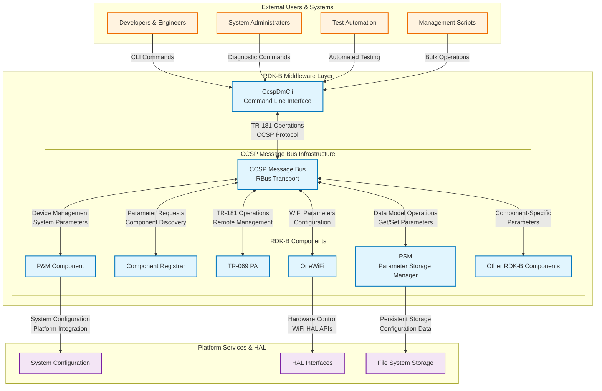
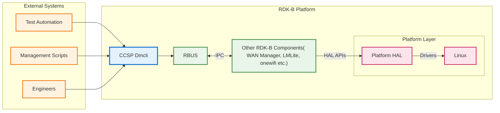
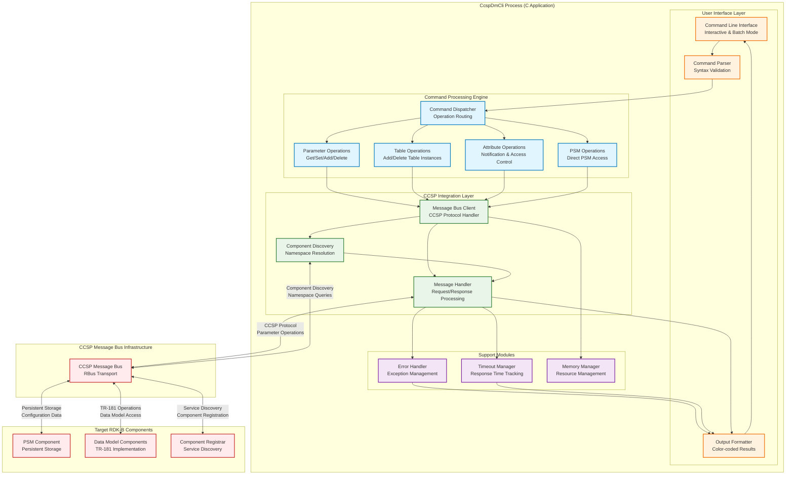
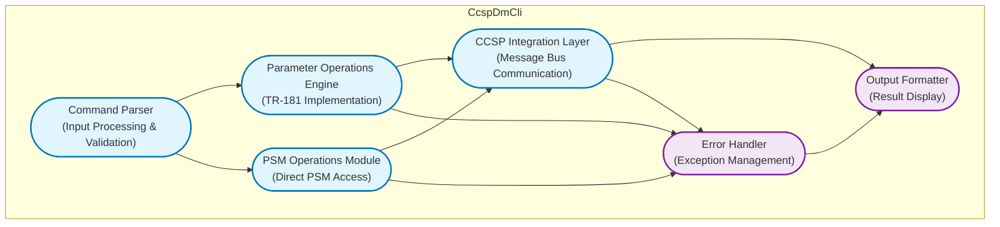
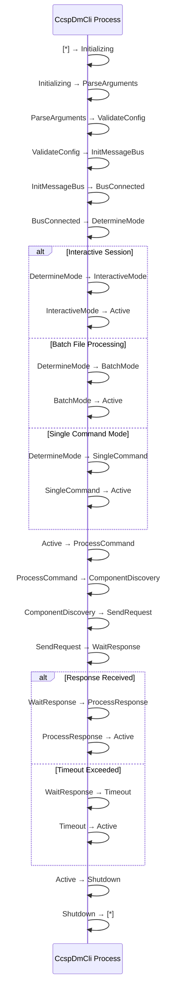
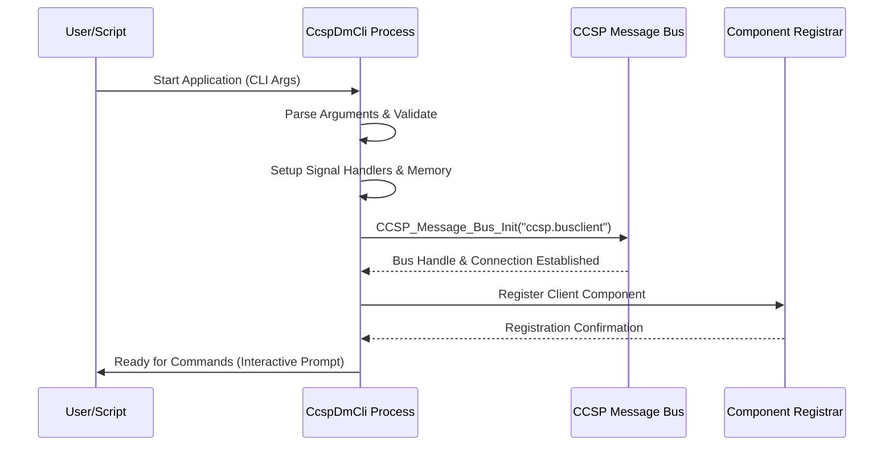
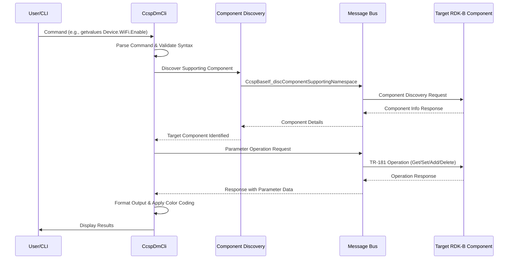
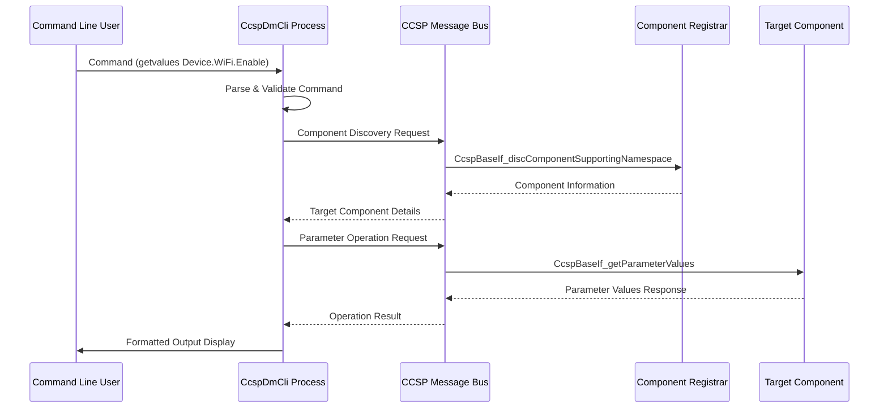
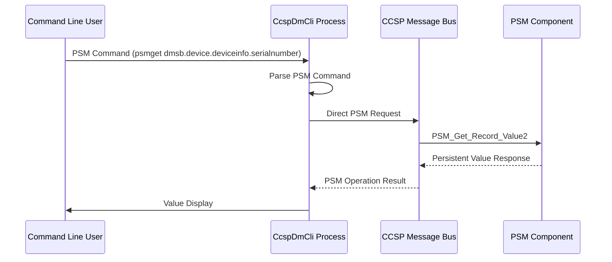

# CcspDmCli Documentation

CcspDmCli (CCSP Data Model Command Line Interface) is a diagnostic and testing tool within the RDK-B middleware stack that provides direct command-line access to the CCSP (Common Component Software Platform) message bus system. This component serves as a bridge between administrators/engineers, and the TR-181 data model implementation - enabling real-time inspection, modification, and testing of device parameters without requiring full management interface interactions.

CcspDmCli operates as a lightweight client application that connects to the CCSP message bus infrastructure, allowing users to perform data model operations including parameter retrieval, modification, table management, and attribute manipulation. It serves both as a diagnostic tool for system administrators troubleshooting device configurations and as a development utility for engineers implementing and testing TR-181 parameter support across RDK-B components.

The component provides essential services to the RDK-B ecosystem by offering direct access to the data model layer, enabling rapid prototyping of management interfaces, supporting automated testing frameworks, and providing runtime debugging capabilities for TR-181 parameter implementations. It acts as a versatile interface that bridges the gap between low-level component implementations and high-level management operations.



**new**





**Key Features & Responsibilities**: 

- **TR-181 Data Model Access**: Provides comprehensive command-line interface for TR-181 parameter operations including get, set, add table, delete table, and attribute management across all RDK-B components
- **CCSP Message Bus Integration**: Acts as a native CCSP message bus client with full support for component discovery, namespace resolution, and cross-component communication protocols
- **Real-time Diagnostic Operations**: Enables live system diagnostics through direct parameter inspection, component health monitoring, and runtime configuration validation
- **PSM Integration**: Offers dedicated commands for direct interaction with the Parameter Storage Manager for persistent configuration data access and manipulation
- **Performance Measurement Tools**: Includes built-in response time measurement capabilities for performance testing and latency analysis of TR-181 operations
- **Multi-Subsystem Support**: Provides subsystem-aware operations supporting eRT, eMG, eEP subsystem prefixes for multi-component RDK-B deployments
- **Development and Testing Support**: Serves as essential tooling for component development, integration testing, and debugging of TR-181 parameter implementations

## Design

CcspDmCli follows a client-server architectural pattern where it operates as a lightweight CCSP message bus client that interfaces with the distributed RDK-B component ecosystem. The design prioritizes simplicity, reliability, and comprehensive coverage of TR-181 data model operations while maintaining minimal system resource usage. The component architecture ensures clean separation between user interface handling, message bus communication, and command processing logic.

The core design principle centers around providing transparent access to the CCSP message bus infrastructure through an intuitive command-line interface. CcspDmCli abstracts the complexity of CCSP protocol interactions, component discovery mechanisms, and namespace resolution while preserving full access to the underlying TR-181 data model functionality. The design emphasizes robustness through comprehensive error handling, timeout management, and graceful degradation in distributed system scenarios.

The interaction design with northbound interfaces (users and scripts) utilizes a command-driven approach with standardized syntax patterns that mirror TR-181 parameter structures. Southbound interactions with the CCSP message bus leverage the standard CCSP protocol stack including component registration, namespace discovery, and parameter operation routing. The design integrates seamlessly with PSM for persistent data operations and supports both synchronous request-response patterns and asynchronous event handling for comprehensive system integration.

IPC mechanisms are implemented through the standard CCSP message bus infrastructure, utilizing RBus transport layers depending on platform configuration. The design accommodates both protocols through abstraction layers that maintain consistent API behavior regardless of underlying transport implementation. Message serialization follows CCSP protocol standards with support for all TR-181 data types and complex parameter structures.

Data persistence and storage management are handled through dedicated PSM integration commands that provide direct access to the Parameter Storage Manager without requiring intermediate component interactions. The design supports both volatile runtime parameter operations and persistent configuration storage operations, with clear command syntax distinctions between ephemeral and persistent data operations.


**new**





### Prerequisites and Dependencies

**RDK-B Platform and Integration Requirements (MUST):**

- **Core DISTRO Features**: DISTRO_FEATURES += "rdk-b", "ccsp" (CCSP message bus infrastructure)
- **Build Dependencies**: ccsp-common-library, telemetry, autotools-native, pythonnative (for data model generation)
- **RDK-B Components**: CCSP Message Bus infrastructure (RBus), Component Registrar (CR), PSM (Parameter Storage Manager) component
- **HAL Dependencies**: Not directly dependent on HAL interfaces (operates at middleware layer)
- **Systemd Services**: rbus.service (depending on message bus implementation) must be active before component initialization
- **Message Bus**: CCSP message bus client registration with namespace "ccsp.busclient", requires message bus configuration file access
- **TR-181 Data Model**: Requires active RDK-B components implementing TR-181 data model interfaces for meaningful operations
- **Configuration Files**: Message bus configuration file (typically /etc/ccsp_msg.cfg or equivalent), component discovery configuration
- **Startup Order**: Message bus infrastructure → Component Registrar → PSM → Target RDK-B components → CcspDmCli

**Threading Model**

CcspDmCli implements a single-threaded architecture optimized for command-line tool usage patterns and message bus interaction reliability. The single-threaded design eliminates complex synchronization requirements while ensuring predictable command execution order and consistent error handling behavior.

- **Threading Architecture**: Single-threaded with synchronous operation model
- **Main Thread**: Handles all user interface interactions, command parsing, message bus communication, and result formatting in sequential order
- **Synchronization**: Not applicable due to single-threaded design; operations are inherently thread-safe through sequential execution
- **Event Handling**: Synchronous request-response pattern with timeout-based completion detection for all CCSP message bus operations

### Component State Flow

**Initialization to Active State**

CcspDmCli follows a straightforward initialization sequence focused on establishing message bus connectivity and preparing for command processing. The initialization process emphasizes early validation of system prerequisites and graceful error handling for missing dependencies.



**Runtime State Changes and Context Switching**

CcspDmCli operates in a stateless command processing model where each command execution represents a complete request-response cycle with target RDK-B components. The component maintains minimal state information between commands to ensure predictable behavior and simplified error recovery.

**State Change Triggers:**

- Command execution completion triggers return to active command prompt state
- Message bus communication errors trigger error handling and recovery procedures with automatic return to active state
- Batch file processing completion triggers transition from batch mode to termination state
- Signal interruption (SIGINT) triggers graceful shutdown sequence with proper message bus disconnection

**Context Switching Scenarios:**

- Interactive mode to batch mode switching through file input redirection maintains consistent command processing behavior
- Subsystem prefix switching through "setsub" command changes component discovery context for subsequent operations
- PSM operation mode switching provides direct PSM access bypassing standard component discovery mechanisms

### Call Flow

**Initialization Call Flow:**



**Request Processing Call Flow:**



## TR‑181 Data Models

### Supported TR-181 Parameters

CcspDmCli does not implement or define TR-181 parameters directly but serves as a universal client interface for accessing TR-181 parameters implemented by other RDK-B components. The component provides comprehensive access to the entire TR-181 data model namespace through its command interface, supporting all parameter types and operations defined in the BBF TR-181 specification.

### Object Hierarchy

CcspDmCli provides access to the complete TR-181 object hierarchy as implemented by target RDK-B components:

```
Device.
├── DeviceInfo. (via P&M Component)
│   ├── SoftwareVersion (string, R)
│   ├── HardwareVersion (string, R)
│   └── SerialNumber (string, R)
├── WiFi. (via OneWiFi)
│   ├── RadioNumberOfEntries (int, R)
│   ├── SSIDNumberOfEntries (int, R)
│   ├── Radio.{i}.
│   │   ├── Enable (boolean, R/W)
│   │   ├── Status (string, R)
│   │   └── Channel (int, R/W)
│   └── SSID.{i}.
│       ├── Enable (boolean, R/W)
│       ├── SSID (string, R/W)
│       └── Status (string, R)
├── Ethernet. (via P&M Component)
│   └── Interface.{i}.
│       ├── Enable (boolean, R/W)
│       ├── Status (string, R)
│       └── Name (string, R)
└── [All other Device.* objects as implemented by respective components]
```

### Parameter Definitions

**CcspDmCli Command Interface Parameters:**

CcspDmCli does not define TR-181 parameters but provides command-line access to all parameters implemented by RDK-B components. The supported operations include:

| Command | Purpose | Syntax | TR-181 Operation |
|---------|---------|--------|------------------|
| `getvalues` | Retrieve parameter values | `getvalues <pathname> [pathname...]` | TR-181 Get Parameter Values |
| `setvalues` | Set parameter values | `setvalues <pathname> <type> <value> [pathname type value...] [commit]` | TR-181 Set Parameter Values |
| `getnames` | Get parameter names | `getnames <pathname> [nextlevel]` | TR-181 Get Parameter Names |
| `addtable` | Add table instance | `addtable <pathname>` | TR-181 Add Object |
| `deltable` | Delete table instance | `deltable <pathname>` | TR-181 Delete Object |
| `getattributes` | Get parameter attributes | `getattributes <pathname> [pathname...]` | TR-181 Get Parameter Attributes |
| `setattributes` | Set parameter attributes | `setattributes <pathname> <notify> <accesslist> [pathname notify accesslist...]` | TR-181 Set Parameter Attributes |

**Custom Extensions:**

- **PSM Direct Access**: CcspDmCli provides custom commands (psmget, psmset, psmdel) for direct PSM interaction bypassing standard TR-181 component routing
- **Performance Measurement**: Built-in response time measurement (sgetvalues) provides performance testing capabilities not available in standard TR-181 operations
- **Batch Processing**: File-based batch command execution enables automated TR-181 testing and bulk operations
- **Subsystem Support**: Multi-subsystem awareness (eRT, eMG, eEP) provides deployment-specific component discovery and parameter access

### Parameter Registration and Access

- **Implemented Parameters**: CcspDmCli accesses parameters implemented by target RDK-B components; it does not implement TR-181 parameters directly
- **Parameter Registration**: Utilizes CCSP component discovery mechanism to identify components supporting specific TR-181 namespaces before operation execution  
- **Access Mechanism**: Leverages CCSP message bus protocol for all TR-181 operations with automatic component routing and response handling
- **Validation Rules**: Performs basic syntax validation for command structure; parameter value validation is delegated to target components implementing the actual TR-181 parameters

## Internal Modules

CcspDmCli is structured as a monolithic command-line application with functionally organized code sections rather than discrete modules. The main implementation provides comprehensive TR-181 operation support through well-defined functional areas within the single source file.

| Module/Class | Description | Key Files |
|-------------|------------|-----------|
| Command Parser | Processes user input, validates command syntax, and prepares parameter structures for CCSP operations. Handles both interactive and batch file input processing. | `ccsp_message_bus_client_tool.c` (lines 2192-2400) |
| CCSP Integration Layer | Manages message bus connectivity, component discovery, and CCSP protocol communication. Implements request-response handling and timeout management. | `ccsp_message_bus_client_tool.c` (lines 572-700) |
| Parameter Operations Engine | Implements core TR-181 operations including getvalues, setvalues, getnames, addtable, deltable with comprehensive error handling and result formatting. | `ccsp_message_bus_client_tool.c` (lines 1000-1700) |
| PSM Operations Module | Provides direct PSM access commands (psmget, psmset, psmdel) for persistent configuration management bypassing standard component routing. | `ccsp_message_bus_client_tool.c` (lines 1800-2000) |
| Output Formatter | Handles result formatting, color-coded output generation, and performance metrics display for enhanced user experience. | `ccsp_message_bus_client_tool.c` (lines 200-400) |
| Error Handler | Manages comprehensive error detection, logging, signal handling, and graceful degradation for robust operation in distributed environments. | `ccsp_message_bus_client_tool.c` (lines 350-450) |


## Component Interactions

CcspDmCli operates as a CCSP message bus client that interfaces with the complete RDK-B middleware ecosystem through standardized TR-181 operations and component discovery mechanisms. The interactions encompass both direct component communication for parameter operations and infrastructure service utilization for system integration.

### Interaction Matrix

| Target Component/Layer | Interaction Purpose | Key APIs/Endpoints |
|------------------------|--------------------|--------------------|
| **RDK-B Middleware Components** |
| Component Registrar (CR) | Component discovery and namespace resolution for TR-181 parameter routing | `CcspBaseIf_discComponentSupportingNamespace`, `CcspBaseIf_discNamespaceComponents` |
| PSM Component | Direct persistent parameter storage access bypassing standard component routing | `PSM_Get_Record_Value2`, `PSM_Set_Record_Value2`, `PSM_Del_Record` |
| P&M Component | Device management parameters, system information, and platform configuration | `CcspBaseIf_getParameterValues`, `CcspBaseIf_setParameterValues` |
| OneWiFi | Wireless network configuration, radio management, and SSID operations | `CcspBaseIf_getParameterValues`, `CcspBaseIf_setParameterValues`, `CcspBaseIf_AddTblRow` |
| **System & Platform Layers** |
| File System | Batch command file processing and configuration file access | `fopen()`, `fgets()`, `fclose()` |
| CCSP Message Bus Infrastructure | Core message bus connectivity and protocol transport | `CCSP_Message_Bus_Init`, `CCSP_Message_Bus_Send_Msg` |
| **External Systems** |
| Test Automation Frameworks | Automated testing support and validation operations | CLI command execution with text output parsing |
| Management Scripts | Bulk operations and administrative task automation | CLI command execution with exit codes and text output |


**Events Published by CcspDmCli:**

CcspDmCli operates as a client-only component and does not publish events to the CCSP message bus system. All interactions follow request-response patterns initiated by user commands.

**Events Consumed by CcspDmCli:**

| Event Source | Event Topic/Path | Purpose | Handler Function |
|---------------|------------------|----------|------------------|
| System Signals | SIGINT, SIGSEGV, SIGILL | Graceful shutdown and error handling | `signal_interrupt()`, `ccsp_exception_handler()` |
| CCSP Message Bus | Component Registration Events | Monitor target component availability | Internal message bus event handling |


### IPC Flow Patterns

**Primary IPC Flow - TR-181 Parameter Operations:**



**PSM Direct Access Flow:**



## Implementation Details

### Major HAL APIs Integration

CcspDmCli operates at the CCSP middleware layer and does not directly integrate with HAL APIs. The component serves as a client interface to other RDK-B components that implement HAL integration. All hardware interactions are mediated through TR-181 parameter operations routed to appropriate data model components.

### Key Implementation Logic

- **Command Processing Engine**: Implements comprehensive command parsing with support for all TR-181 operation types including parameter validation, syntax checking, and multi-parameter operations. Core logic resides in the main processing loop handling interactive, batch, and single-command modes within `ccsp_message_bus_client_tool.c`.

- **CCSP Message Bus Integration**: Manages complete CCSP protocol lifecycle including bus initialization, component discovery, namespace resolution, message serialization/deserialization, and connection management. Implementation includes timeout handling, error recovery, and multi-subsystem support.

- **Component Discovery Mechanism**: Implements dynamic component discovery using `CcspBaseIf_discComponentSupportingNamespace` for parameter namespace resolution and automatic routing to appropriate RDK-B components based on TR-181 parameter paths.

- **Error Handling Strategy**: Comprehensive error management covering CCSP protocol errors, component unavailability, parameter validation failures, timeout conditions, and system signal handling with graceful degradation and user-friendly error reporting.

- **Performance Measurement System**: Built-in response time tracking using high-resolution timers for performance analysis of TR-181 operations including minimum, maximum, average, and total response time calculations with statistical analysis support.

- **Logging & Debugging**: Integrated debugging support with color-coded output formatting, verbose operation modes, step-by-step execution tracking, and comprehensive error reporting for troubleshooting CCSP communication issues and component interaction problems.

### Command Line Configuration

- **Subsystem Prefix**: Configurable via first command line argument (eRT, eMG, eEP, simu) determining component discovery scope and namespace routing
- **Message Bus Config**: Optional second argument specifying alternative message bus configuration file path for testing and development scenarios  
- **Operation Mode**: Interactive mode (default), batch file processing, or single command execution determined by argument structure and input source
- **Timeout Configuration**: Hardcoded 1-second default timeout with configurable extensions for slow component responses and testing scenarios