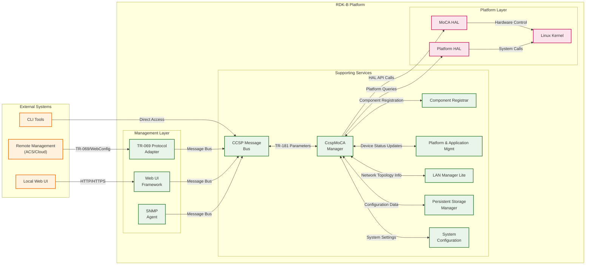
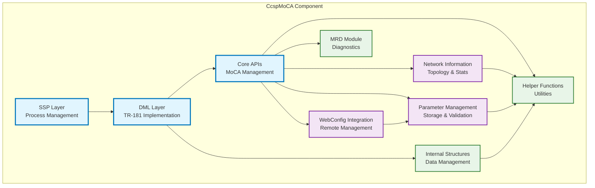
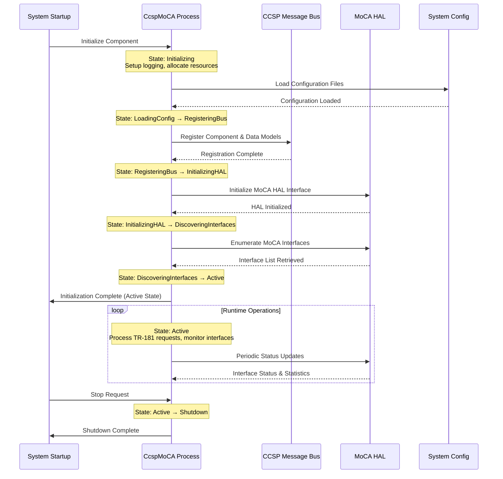
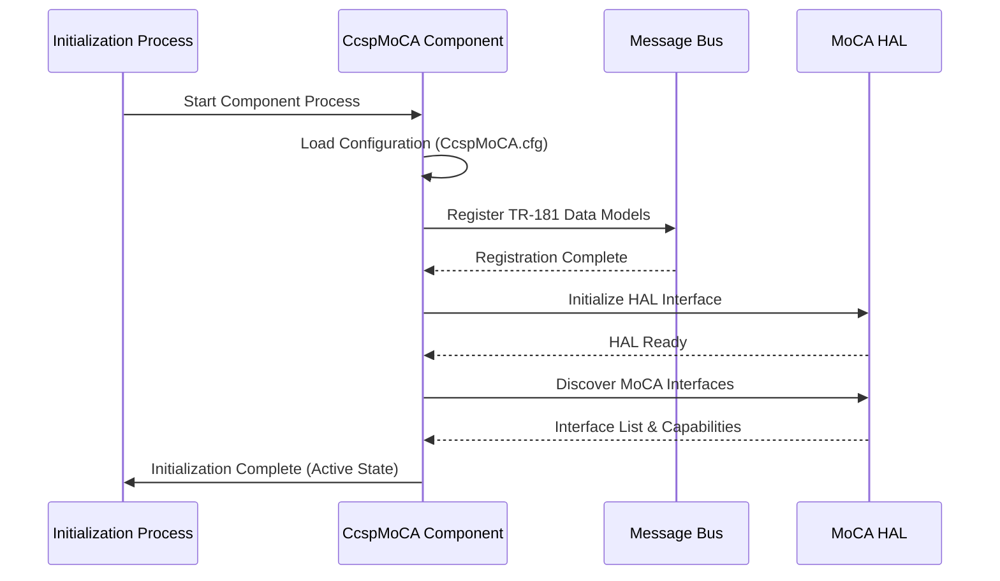
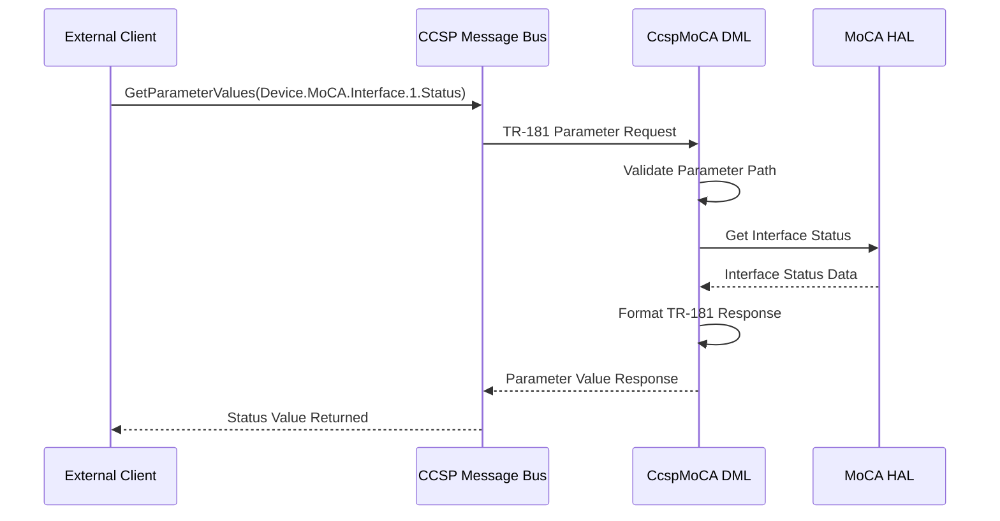
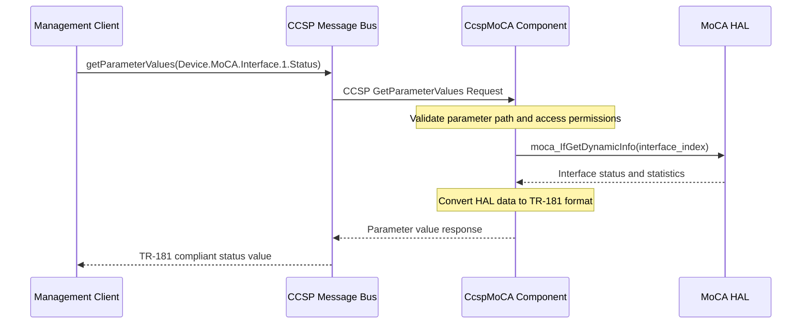
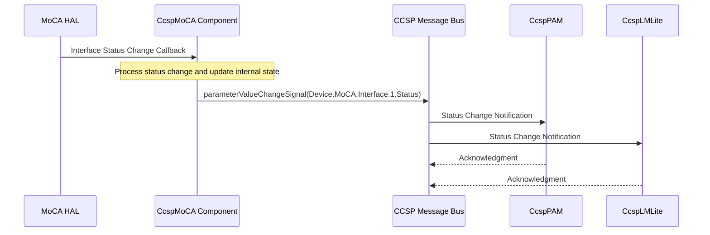

# CcspMoCA Documentation

CcspMoCA (Common Component Software Platform - Multimedia over Coax Alliance) is a critical RDK-B middleware component that provides comprehensive management and control of MoCA (Multimedia over Coax Alliance) interfaces in cable modems and set-top boxes. This component serves as the primary interface between the RDK-B system and MoCA hardware, enabling high-speed data transmission over existing coaxial cable infrastructure. It implements TR-181 data model specifications for MoCA interfaces, handles configuration management, performance monitoring, and provides real-time status reporting for MoCA network operations.

The component operates as a bridge between upper-layer applications and the underlying MoCA HAL (Hardware Abstraction Layer), abstracting hardware-specific implementations while providing standardized TR-181 compliant interfaces. It manages multiple MoCA interfaces simultaneously, handles network topology discovery, maintains connection statistics, and provides comprehensive error handling and recovery mechanisms. CcspMoCA also integrates with the broader RDK-B ecosystem through message bus communications, supports WebConfig for remote configuration management, and provides telemetry data for network performance analysis.



**Key Features & Responsibilities**: 

- **MoCA Interface Management**: Comprehensive control and monitoring of MoCA network interfaces including enable/disable operations, status monitoring, and configuration parameter management
- **TR-181 Data Model Implementation**: Full implementation of BBF TR-181 MoCA data model specifications providing standardized parameter access and management capabilities
- **Network Performance Monitoring**: Real-time collection and reporting of MoCA network statistics including bit rates, packet counts, error rates, and signal quality metrics
- **Multi-Interface Support**: Simultaneous management of multiple MoCA interfaces with independent configuration and status tracking for each interface
- **Hardware Abstraction Integration**: Seamless integration with MoCA HAL layer for hardware-agnostic operations across different chipset implementations
- **WebConfig Integration**: Support for remote configuration management through WebConfig framework enabling centralized device management
- **Message Bus Communication**: Integration with RDK-B message bus infrastructure for inter-component communication and event notification
- **Reset and Recovery Management**: Automated reset capabilities and recovery mechanisms for MoCA interfaces during error conditions
- **Security and Access Control**: Implementation of proper access controls and validation for configuration changes and parameter access

## Design

The CcspMoCA component is architected as a multi-layered middleware service that follows the standard RDK-B component design patterns. The design emphasizes modularity, maintainability, and scalability while providing robust MoCA network management capabilities. The component operates as a separate process within the RDK-B system, communicating with other components through the message bus infrastructure and providing TR-181 compliant data model interfaces.

The core design principle revolves around separation of concerns, where the component is divided into distinct functional layers: the Service Support Platform (SSP) layer handles process lifecycle and message bus integration, the DML (Data Model Layer) implements TR-181 parameter management, the API layer provides hardware abstraction, and the internal modules handle specific MoCA functionalities. This layered approach ensures that changes in one layer do not impact others, facilitating easier maintenance and feature additions.

The northbound interface design provides standardized TR-181 parameter access through the message bus, allowing other RDK-B components, management systems, and web interfaces to interact with MoCA functionality through well-defined APIs. The component supports both synchronous parameter get/set operations and asynchronous event notifications, ensuring real-time responsiveness while maintaining system stability.

The southbound interface integrates with the MoCA HAL layer, which abstracts the underlying hardware implementation details. This design enables the component to work across different MoCA chipset implementations without requiring code changes, as long as the HAL interface contract is maintained. The HAL integration includes proper error handling, timeout management, and retry mechanisms to ensure robust operation even in challenging network conditions.

Data persistence and storage management is handled through integration with the system configuration framework (syscfg) and temporary file management for runtime state information. The component maintains both persistent configuration data that survives reboots and volatile runtime data that reflects current network state. Configuration changes are properly validated, committed atomically, and can be rolled back if necessary, ensuring system stability during configuration updates.



### Prerequisites and Dependencies

**Build-Time Flags and Configuration:**

| Configure Option | DISTRO Feature | Build Flag | Purpose | Default |
|------------------|----------------|------------|---------|---------|
| `--enable-notify` | N/A | `ENABLE_SD_NOTIFY` | Enable systemd notification support for service management | Auto-detected |
| `--enable-unitTestDockerSupport` | N/A | `UNIT_TEST_DOCKER_SUPPORT` | Enable Docker-based unit testing framework | Disabled |

**RDK-B Platform and Integration Requirements (MUST):**

- **RDK-B Components**: CCSP Common Library, CCSP CR (Component Registrar), Message Bus Infrastructure, System Configuration (syscfg)
- **HAL Dependencies**: MoCA HAL interface (`moca_hal.h`) with minimum HAL version supporting interface enumeration and statistics
- **Systemd Services**: `CcspCrSsp.service` (Component Registrar) must be active before this component starts
- **Message Bus**: CCSP message bus registration for `com.cisco.spvtg.ccsp.moca` namespace
- **TR-181 Data Model**: Device.MoCA object hierarchy support from data model registry
- **Configuration Files**: `/usr/ccsp/moca/CcspMoCA.cfg`, `/usr/ccsp/moca/CcspMoCADM.cfg`, `/usr/ccsp/moca/TR181-MoCA.XML`
- **Startup Order**: Component Registrar → Message Bus → System Configuration → CcspMoCA

**Threading Model** 

CcspMoCA implements a single-threaded, event-driven architecture that processes all operations through a main event loop. The component operates as a single process with no background worker threads, ensuring simplicity and avoiding threading-related complexity.

**Threading Architecture Details:**

- **Primary Design**: Single-threaded main loop that handles all component operations sequentially
- **Main Thread Responsibilities**: Message bus communication, TR-181 parameter operations, HAL interface calls, configuration management, component lifecycle management, and all event processing
- **Event Processing**: All operations are processed synchronously through the main message loop, ensuring predictable execution order and eliminating race conditions
- **Blocking Operation Handling**: HAL calls and other potentially blocking operations are executed directly in the main thread with appropriate timeout handling
- **Simplicity**: The single-threaded design eliminates the need for synchronization mechanisms, mutexes, or inter-thread communication
- **State Management**: All component state is maintained in the main thread context, providing consistent and atomic state updates

### Component State Flow

**Initialization to Active State**

The CcspMoCA component follows a structured initialization sequence that ensures all dependencies are properly established before entering active operational state. The component progresses through distinct phases, each with specific responsibilities and validation checkpoints to ensure system stability.



**Runtime State Changes and Context Switching**

During normal operation, CcspMoCA handles various runtime state changes triggered by network events, configuration updates, and hardware state changes. The component maintains context awareness for each MoCA interface independently while coordinating global operations.

**State Change Triggers:**

- MoCA interface enable/disable operations trigger interface state transitions and HAL reconfiguration
- Network topology changes detected through HAL notifications cause interface status updates and statistics refresh
- Configuration parameter changes via TR-181 operations trigger validation, HAL updates, and persistent storage updates
- Hardware error conditions initiate recovery procedures including interface reset and re-initialization

**Context Switching Scenarios:**

- Interface configuration updates switch between validation mode and commit mode with rollback capability
- WebConfig updates trigger bulk configuration mode with atomic apply operations
- Error recovery scenarios switch to diagnostic mode with enhanced logging and recovery attempts
- Performance monitoring switches between normal polling intervals and high-frequency monitoring during troubleshooting

### Call Flow

**Initialization Call Flow:**



**Request Processing Call Flow:**



## TR‑181 Data Models

### Supported TR-181 Parameters

The CcspMoCA component implements comprehensive TR-181 data model support for MoCA interface management, following BBF TR-181 Issue 2 specifications with additional RDK-specific extensions. The implementation provides full parameter hierarchy support including interface-specific objects, statistics collection, and custom operational parameters.

### Object Hierarchy

```
Device.
└── MoCA.
    ├── InterfaceNumberOfEntries (unsignedInt, R)
    ├── X_CISCO_COM_ProvisioningFilename (string, R/W)
    ├── X_CISCO_COM_ProvisioningServerAddress (string, R/W)
    ├── X_CISCO_COM_ProvisioningServerAddressType (uint32, R/W)
    ├── MocaResetCount (unsignedInt, R)
    ├── X_RDKCENTRAL-COM_MoCAHost_Sync (boolean, R/W)
    ├── Data (string, R/W)
    ├── X_RDKCENTRAL-COM_ForceEnable (boolean, R/W)
    ├── X_RDKCENTRAL-COM_xOpsDeviceMgmt.
    │   └── Reset (boolean, R/W)
    └── Interface.{i}.
        ├── Enable (boolean, R/W)
        ├── Status (string, R)
        ├── Alias (string, R/W)
        ├── Name (string, R)
        ├── LastChange (unsignedInt, R)
        ├── LowerLayers (string, R/W)
        ├── Upstream (boolean, R)
        ├── MACAddress (string, R)
        ├── FirmwareVersion (string, R)
        ├── MaxBitRate (unsignedInt, R)
        ├── MaxIngressBW (unsignedInt, R)
        ├── MaxEgressBW (unsignedInt, R)
        ├── HighestVersion (string, R)
        ├── CurrentVersion (string, R)
        ├── NetworkCoordinator (unsignedInt, R)
        ├── NodeID (unsignedInt, R)
        ├── MaxNodes (boolean, R)
        ├── PreferredNC (boolean, R/W)
        ├── BackupNC (unsignedInt, R)
        ├── PrivacyEnabledSetting (boolean, R/W)
        ├── PrivacyEnabled (boolean, R)
        ├── FreqCapabilityMask (unsignedInt, R)
        ├── FreqCurrentMaskSetting (unsignedInt, R/W)
        ├── FreqCurrentMask (unsignedInt, R)
        ├── CurrentOperFreq (unsignedInt, R)
        ├── LastOperFreq (unsignedInt, R)
        ├── KeyPassphrase (string, R/W)
        ├── TxPowerLimit (int, R/W)
        ├── PowerCntlPhyTarget (unsignedInt, R/W)
        ├── BeaconPowerLimit (unsignedInt, R/W)
        ├── NetworkTabooMask (unsignedInt, R/W)
        ├── NetworkTabooStart (unsignedInt, R/W)
        ├── NetworkTabooEnd (unsignedInt, R/W)
        ├── NodeTabooMask (unsignedInt, R/W)
        ├── NodeTabooStart (unsignedInt, R/W)
        ├── NodeTabooEnd (unsignedInt, R/W)
        ├── TxBcastRate (unsignedInt, R)
        ├── TxBcastPowerReduction (unsignedInt, R/W)
        ├── QAM256Capable (boolean, R)
        ├── PacketAggregationCapability (unsignedInt, R)
        └── AssociatedDevice.{i}.
            ├── MACAddress (string, R)
            ├── NodeID (unsignedInt, R)
            ├── PreferredNC (boolean, R)
            ├── HighestVersion (string, R)
            ├── PHYTxRate (unsignedInt, R)
            ├── PHYRxRate (unsignedInt, R)
            ├── TxPowerControlReduction (unsignedInt, R)
            ├── RxPowerLevel (int, R)
            ├── TxBcastRate (unsignedInt, R)
            ├── RxBcastPowerLevel (int, R)
            ├── TxPackets (unsignedInt, R)
            ├── RxPackets (unsignedInt, R)
            ├── RxErroredAndMissedPackets (unsignedInt, R)
            ├── QAM256Capable (boolean, R)
            ├── PacketAggregationCapability (unsignedInt, R)
            ├── RxSNR (unsignedInt, R)
            ├── Active (boolean, R)
            ├── RxBcastRate (unsignedInt, R)
            └── NumberOfClients (unsignedInt, R)
```

### Parameter Definitions

**Core Parameters:**

| Parameter Path | Data Type | Access | Default Value | Description | BBF Compliance |
|----------------|-----------|--------|---------------|-------------|----------------|
| `Device.MoCA.InterfaceNumberOfEntries` | unsignedInt | R | `0` | Number of entries in the MoCA Interface table. Automatically updated when interfaces are discovered or removed | TR-181 Issue 2 |
| `Device.MoCA.Interface.{i}.Enable` | boolean | R/W | `false` | Enables or disables the MoCA interface. When false, the interface is completely shut down | TR-181 Issue 2 |
| `Device.MoCA.Interface.{i}.Status` | string | R | `"Down"` | Current operational status of the interface. Enumerated values: Up, Down, Unknown, Dormant, NotPresent, LowerLayerDown, Error | TR-181 Issue 2 |
| `Device.MoCA.Interface.{i}.Name` | string | R | `""` | Human readable name of the interface. Typically set by the system based on hardware discovery | TR-181 Issue 2 |
| `Device.MoCA.Interface.{i}.MACAddress` | string | R | `""` | MAC address of the MoCA interface in colon-separated hexadecimal notation (e.g., 00:11:22:33:44:55) | TR-181 Issue 2 |
| `Device.MoCA.Interface.{i}.MaxBitRate` | unsignedInt | R | `0` | Maximum PHY bit rate supported by this interface in Mbps. Hardware capability dependent | TR-181 Issue 2 |
| `Device.MoCA.Interface.{i}.NodeID` | unsignedInt | R | `0` | Node ID of this MoCA interface within the MoCA network. Range 0-15, assigned by Network Coordinator | TR-181 Issue 2 |
| `Device.MoCA.Interface.{i}.NetworkCoordinator` | unsignedInt | R | `0` | Node ID of the current Network Coordinator. 0-15, or 255 if no NC is active | TR-181 Issue 2 |
| `Device.MoCA.Interface.{i}.PreferredNC` | boolean | R/W | `false` | Indicates whether this node should be preferred as Network Coordinator during network formation | TR-181 Issue 2 |
| `Device.MoCA.Interface.{i}.KeyPassphrase` | string | R/W | `""` | Security key passphrase for MoCA network encryption. Must be 12-17 characters for MoCA 1.x, or hex string for MoCA 2.x | TR-181 Issue 2 |
| `Device.MoCA.MocaResetCount` | unsignedInt | R | `0` | Number of times MoCA interfaces have been reset since system startup. Useful for troubleshooting | Custom |
| `Device.MoCA.X_RDKCENTRAL-COM_MoCAHost_Sync` | boolean | R/W | `false` | Enables synchronization of MoCA host information with backend management systems | Custom |

### Parameter Registration and Access

- **Implemented Parameters**: Full Device.MoCA object hierarchy including Interface table with up to 128 interface instances and comprehensive statistics parameters for network monitoring
- **Parameter Registration**: All parameters are registered with the CCSP message bus during component initialization using the TR181-MoCA.XML data model definition file
- **Access Mechanism**: Parameters are accessed through standard CCSP message bus protocol using GetParameterValues/SetParameterValues operations with proper authentication and authorization
- **Validation Rules**: All writable parameters include comprehensive validation including range checks, format validation, dependency validation, and hardware capability verification before applying changes

## Internal Modules

The CcspMoCA component is organized into several specialized modules, each responsible for specific aspects of MoCA interface management and TR-181 data model implementation. This modular design ensures clear separation of concerns and facilitates maintenance and feature additions.

| Module/Class | Description | Key Files |
|-------------|------------|-----------|
| **SSP (Service Support Platform)** | Main process container providing message bus integration, component lifecycle management, and system-level configuration handling | `ssp_main.c`, `ssp_messagebus_interface.c`, `ssp_global.h` |
| **DML (Data Model Layer)** | TR-181 parameter implementation layer handling get/set operations, parameter validation, and data model registration | `cosa_moca_dml.c`, `cosa_moca_dml.h` |
| **Core APIs** | Primary MoCA functionality implementation including HAL interface management, configuration control, and status monitoring | `cosa_moca_apis.c`, `cosa_moca_apis.h` |
| **Network Information** | MoCA network topology management, associated device tracking, and network statistics collection | `cosa_moca_network_info.c`, `cosa_moca_network_info.h` |
| **WebConfig Integration** | Remote configuration management through WebConfig framework including bulk parameter updates and configuration validation | `cosa_moca_webconfig_api.c`, `cosa_moca_webconfig_api.h` |
| **Parameter Management** | Advanced parameter handling including persistent storage, default value management, and parameter dependency resolution | `cosa_moca_param.c`, `cosa_moca_param.h` |
| **Helper Functions** | Utility functions for data conversion, string manipulation, logging, and common operations shared across modules | `cosa_moca_helpers.c`, `cosa_moca_helpers.h` |
| **Internal Data Structures** | Core data structure definitions, object management, and internal state tracking for MoCA interfaces and associated devices | `cosa_moca_internal.c`, `cosa_moca_internal.h` |
| **MRD (MoCA Remote Diagnostics)** | Optional diagnostic and troubleshooting utilities for MoCA network analysis and performance monitoring | `mrd.c` |

## Component Interactions

CcspMoCA integrates extensively with the RDK-B ecosystem through multiple communication channels, providing MoCA management services to various system components while consuming services from platform infrastructure. The component operates as both a service provider exposing TR-181 interfaces and a service consumer utilizing HAL, configuration, and messaging services.

### Interaction Matrix

| Target Component/Layer | Interaction Purpose | Key APIs/Endpoints |
|------------------------|-------------------|------------------|
| **RDK-B Middleware Components** |
| Component Registrar (CcspCR) | Component registration, capability advertisement, health monitoring | `registerCapabilities()`, `checkHealth()`, `systemReadySignal` |
| Platform & Application Mgmt (CcspPAM) | Device state coordination, system-wide configuration management | `Device.DeviceInfo` parameters, system status events |
| LAN Management Lite (CcspLMLite) | Network topology reporting, device discovery integration | Network device events, `Device.Hosts` parameter updates |
| TR-069 Protocol Adapter | Remote management parameter exposure, ACS communication | TR-181 parameter synchronization, fault notifications |
| **System & HAL Layers** |
| MoCA HAL | Hardware control, interface management, statistics collection | `moca_GetIfConfig()`, `moca_SetIfConfig()`, `moca_GetStats()`, `moca_IfGetDynamicInfo()` |
| System Configuration | Persistent parameter storage, configuration file management | `syscfg_get()`, `syscfg_set()`, `syscfg_commit()` |
| WebConfig Framework | Bulk configuration updates, remote configuration management | `webconfig_register()`, configuration blob processing |
| Message Bus Infrastructure | Inter-component communication, parameter operations | `CcspBaseIf_getParameterValues()`, `CcspBaseIf_setParameterValues()` |

**Events Published by CcspMoCA:**

| Event Name | Event Topic/Path | Trigger Condition | Subscriber Components |
|------------|-----------------|-------------------|---------------------|
| Interface Status Change | `Device.MoCA.Interface.{i}.Status` | MoCA interface up/down state transitions | CcspPAM, CcspLMLite, TR-069 PA |
| Network Topology Change | `Device.MoCA.Interface.{i}.AssociatedDevice` | Device join/leave MoCA network | CcspLMLite, Network Management |
| Configuration Update | `parameterValueChangeSignal` | TR-181 parameter modifications | All subscribed management components |
| Error Conditions | `Device.MoCA.Interface.{i}.LastError` | Hardware errors, configuration failures | System monitoring, TR-069 PA |

### IPC Flow Patterns

**Primary IPC Flow - TR-181 Parameter Access:**



**Event Notification Flow:**



## Implementation Details

### Major HAL APIs Integration

CcspMoCA integrates with the standardized MoCA HAL interface to provide hardware-agnostic MoCA management capabilities. The HAL abstraction enables the component to work across different MoCA chipset implementations while maintaining consistent functionality and performance.

**Core HAL APIs:**

| HAL API | Purpose | Implementation File |
|---------|---------|-------------------|
| `moca_GetIfConfig()` | Retrieve interface configuration parameters including enable state, network settings, and operational parameters | `cosa_moca_apis.c` |
| `moca_SetIfConfig()` | Configure interface parameters such as enable/disable, network passphrase, power settings, and frequency masks | `cosa_moca_apis.c` |
| `moca_IfGetDynamicInfo()` | Get real-time interface status including link state, node ID, network coordinator, and performance metrics | `cosa_moca_apis.c` |
| `moca_IfGetStaticInfo()` | Retrieve static interface information such as MAC address, firmware version, and hardware capabilities | `cosa_moca_apis.c` |
| `moca_GetNumAssociatedDevices()` | Get count of devices associated with the MoCA network for interface enumeration | `cosa_moca_network_info.c` |
| `moca_IfGetExtCounter()` | Collect detailed interface statistics including packet counts, error rates, and performance counters | `cosa_moca_network_info.c` |
| `moca_GetMocaResetCount()` | Retrieve hardware reset count for troubleshooting and reliability monitoring | `cosa_moca_apis.c` |
| `moca_FreqMaskToValue()` | Convert frequency mask values to human-readable frequency ranges for configuration display | `cosa_moca_helpers.c` |

### Key Implementation Logic

- **State Machine Engine**: The core state management is implemented through a centralized state tracking system that maintains interface states, configuration validity, and operation modes across the component lifecycle
     - Main state machine logic in `cosa_moca_internal.c` manages interface objects, associated device tracking, and configuration state transitions
     - State transition handlers in `cosa_moca_dml.c` process TR-181 parameter changes and coordinate HAL operations with internal state updates
  
- **Event Processing**: Hardware events and configuration changes are processed through a unified event handling system that ensures proper sequencing and state consistency
     - Hardware interrupt handling through HAL callback mechanisms for real-time status updates
     - Event queue management using message bus infrastructure for inter-component coordination
     - Synchronous event processing with proper error handling and retry mechanisms for network topology changes
  
- **Error Handling Strategy**: Comprehensive error detection, classification, and recovery mechanisms ensure system stability during various failure scenarios
     - HAL error code mapping in `cosa_moca_helpers.c` translates hardware-specific errors to standardized TR-181 error conditions
     - Recovery mechanisms for failed operations include automatic retry logic, interface reset procedures, and graceful degradation modes
     - Timeout handling and retry logic with exponential backoff for HAL operations and network communications
  
- **Logging & Debugging**: Multi-level logging system provides comprehensive troubleshooting capabilities with configurable verbosity and targeted diagnostic information
     - Interface state transition logging with detailed parameter change tracking
     - HAL API call tracing including input parameters, return values, and execution timing
     - Debug hooks for network topology analysis, performance monitoring, and configuration validation

### Key Configuration Files

| Configuration File | Purpose | Override Mechanisms |
|--------------------|---------|--------------------|
| `CcspMoCA.cfg` | Component registration and message bus configuration including component ID, namespace, and data model mappings | Environment variables, command line parameters |
| `CcspMoCADM.cfg` | Data model configuration specifying TR-181 parameter mappings and validation rules | Factory configuration overlay files |
| `TR181-MoCA.XML` | Complete TR-181 object hierarchy definition with parameter specifications, access controls, and function mappings | N/A (compiled into component) |
| `/tmp/moca_initialized_bootup` | Runtime state file indicating successful component initialization and interface discovery completion | Automatic creation/deletion based on component lifecycle |
