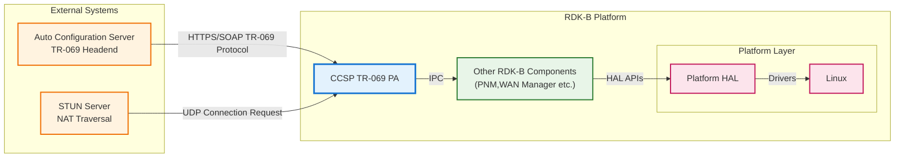
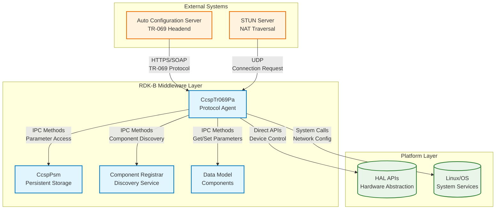
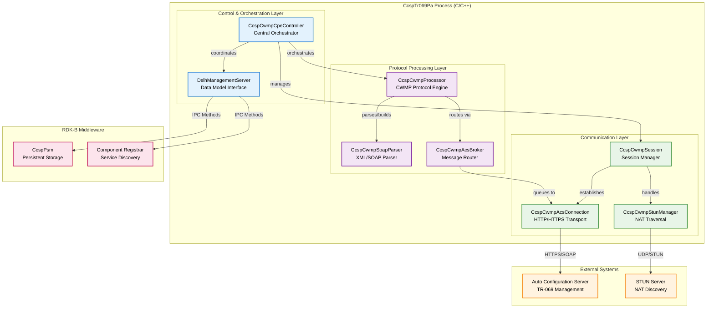
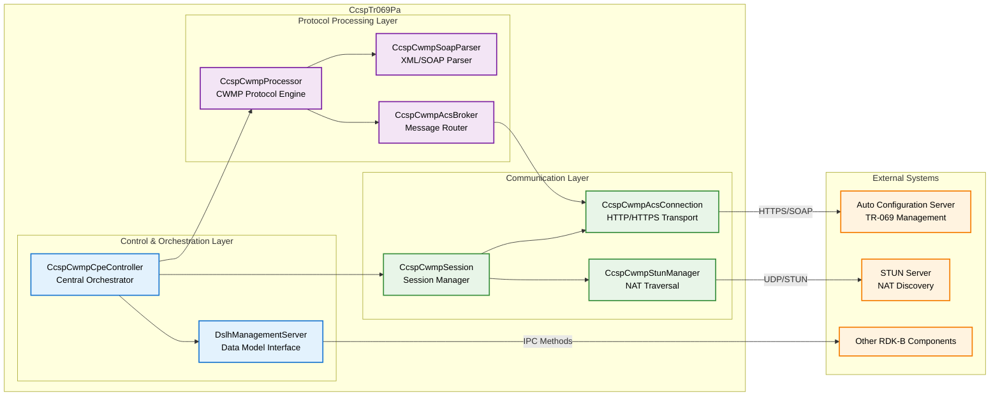
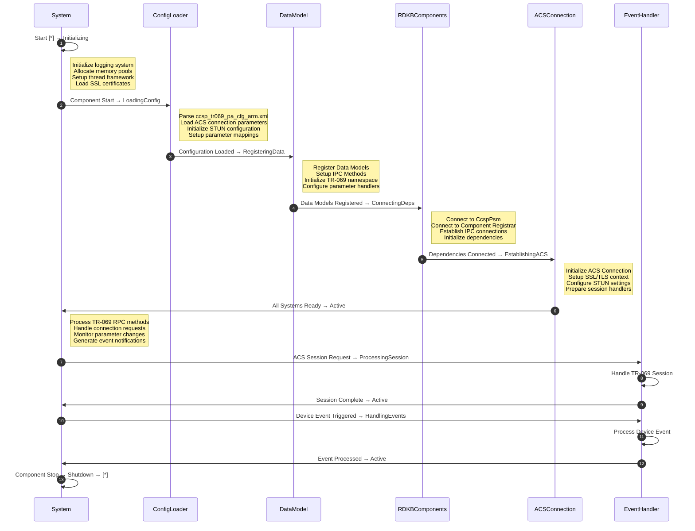
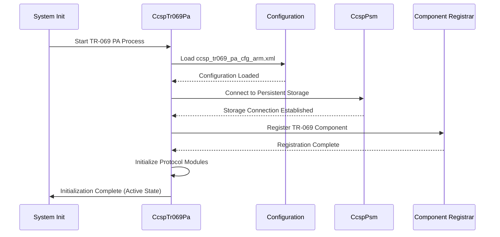
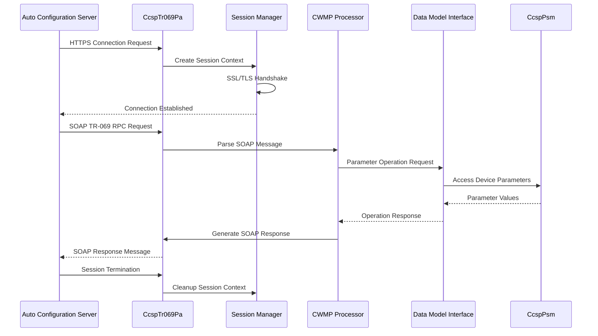
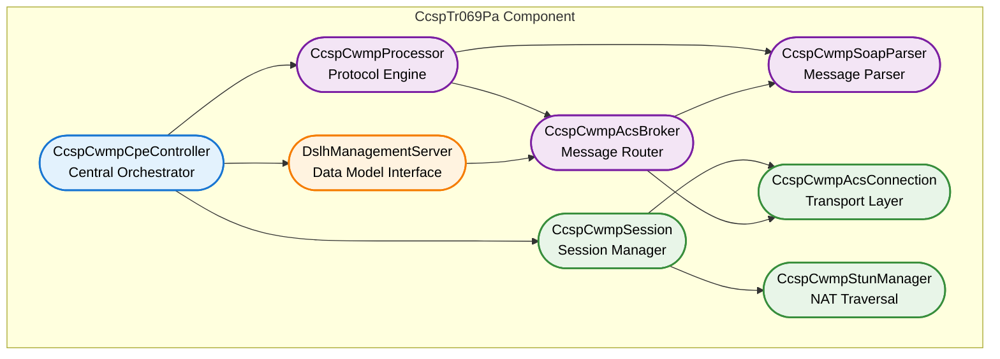
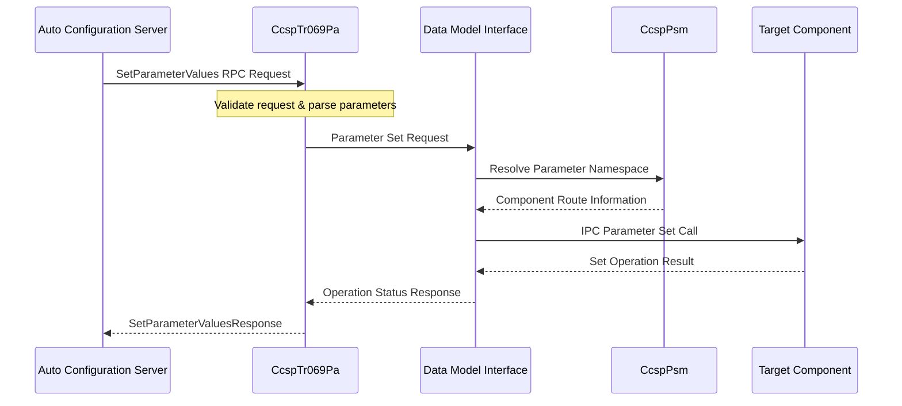
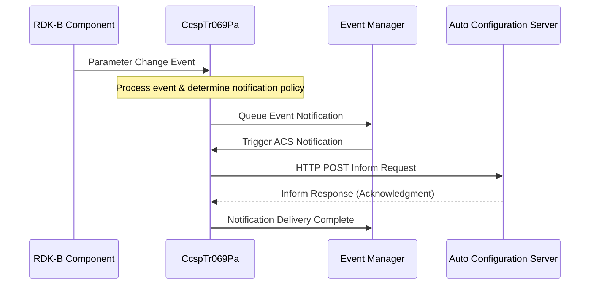

# CcspTr069Pa Documentation

CcspTr069Pa is the component in RDK-B middleware that implements the TR-069/CWMP (CPE WAN Management Protocol) specification. This component serves as the primary interface between RDK-B devices and Auto Configuration Servers (ACS) for remote device management and configuration. The TR-069 PA enables service providers to remotely monitor, configure, and manage customer premises equipment (CPE) devices through standardized protocols. CcspTr069Pa provides device lifecycle management capabilities including automatic device provisioning, firmware updates, configuration management, performance monitoring, and diagnostic operations. It acts as the bridge between the cloud-based management systems and the local device infrastructure, translating between TR-069 SOAP messages and internal RDK-B component communications.

The component integrates deeply with the RDK-B ecosystem by interfacing with other middleware components through IPC methods, accessing device parameters via data model interfaces, and coordinating with platform services for system-level operations. This enables centralized management of distributed RDK-B devices while maintaining local autonomy and real-time responsiveness.

**old to delete**

**Key Features & Responsibilities**: 

- **TR-069 Protocol Implementation**: Complete CWMP protocol stack supporting all mandatory and optional TR-069 methods including GetParameterValues, SetParameterValues, AddObject, DeleteObject, Download, Upload, Reboot, and FactoryReset
- **ACS Communication Management**: Secure HTTPS/TLS communication with Auto Configuration Servers including session management, authentication, and connection request handling via HTTP digest authentication and SSL/TLS certificates
- **Device Parameter Management**: Real-time synchronization between TR-069 data model and RDK-B component parameters through IPC methods, supporting hierarchical parameter namespaces and bulk operations
- **Connection Request Handling**: STUN-based NAT traversal and TCP connection request processing to enable ACS-initiated sessions even behind NATs and firewalls
- **Firmware Download Management**: Secure firmware image download, verification, and installation coordination with RDK-B update mechanisms including rollback capabilities and integrity checking
- **Event Notification System**: Automatic event generation and delivery to ACS for device state changes, alarms, and periodic statistics reporting with configurable notification policies
- **Session State Management**: Robust session lifecycle management with retry logic, timeout handling, and graceful error recovery for reliable ACS communications
- **Security & Authentication**: Certificate-based authentication, SSL/TLS encryption, and secure credential management for ACS communications with support for client certificates and CA validation

## Design

The CcspTr069Pa component follows a modular, event-driven architecture designed to handle asynchronous TR-069 communications while maintaining tight integration with the RDK-B middleware ecosystem. The design emphasizes reliability, security, and performance for remote device management operations across large-scale deployments.

The architecture is built around a central event processing engine that coordinates between multiple specialized modules, each responsible for specific aspects of the TR-069 protocol implementation. This modular approach enables efficient handling of concurrent ACS sessions, parallel parameter operations, and complex workflow orchestration while maintaining clear separation of concerns. Inter-component communication within CcspTr069Pa follows a message-passing architecture where modules communicate through well-defined interfaces and event notifications.

The northbound interface integrates with ACS systems through standard TR-069 SOAP over HTTPS, implementing the complete CWMP specification including all required RPC methods and event notifications. The southbound interface communicates with other RDK-B components using IPC methods, providing parameter access, component discovery, and event propagation throughout the middleware stack.

Data persistence and state management are handled through integration with CcspPsm (Persistent Storage Manager) for configuration data and session state, ensuring that device management operations can survive system restarts and maintain consistency across reboots. The design also incorporates comprehensive error handling and recovery mechanisms to ensure robust operation in challenging network conditions.

A Component diagram showing the component's internal structure and dependencies is given below:

**old to delete**

### Prerequisites and Dependencies

**Build-Time Flags and Configuration:**

| Configure Option | DISTRO Feature | Build Flag | Purpose | Default |
|------------------|----------------|------------|---------|---------|
| OpenSSL Support | `openssl` | `_ANSC_USE_OPENSSL_` | Enable OpenSSL-based SSL/TLS support for ACS communications | Enabled |
| IPv6 Support | N/A | `_ANSC_IPV6_COMPATIBLE_` | Enable IPv6 protocol support for TR-069 communications | Platform dependent |

**RDK-B Platform and Integration Requirements (MUST):**

- **Core DISTRO Features**: DISTRO_FEATURES += "rdk-b", "ccsp", "tr069", "openssl"
- **RDK-B Components**: CcspPsm (Persistent Storage Manager), Component Registrar (CR), CcspCommonLibrary for base utilities and IPC framework
- **HAL Dependencies**: Multiple HAL interfaces for comprehensive device management - WiFi HAL, MoCA HAL, Ethernet HAL, Platform HAL, VLAN HAL
- **Systemd Services**: CcspCr.service (Component Registrar) and CcspPsm.service must be active before TR-069 PA initialization
- **Message Bus**: IPC methods registration for TR-069 parameter namespace, component discovery and parameter access interfaces
- **Configuration Files**: ccsp_tr069_pa_cfg_arm.xml (main configuration), ccsp_tr069_pa_certificate_cfg_arm.xml (SSL certificates), ccsp_tr069_pa_mapper_arm.xml (parameter mapping), sdm_arm.xml (supported data model), custom_mapper.xml (vendor extensions)
- **Startup Order**: Component Registrar → CcspPsm → CcspTr069Pa - TR-069 PA requires parameter storage and component discovery services
- **Resource Constraints**: Minimum 8MB memory for TR-069 sessions, 4MB persistent storage for configuration, network bandwidth for ACS communications

**Threading Model**

CcspTr069Pa implements a multi-threaded architecture optimized for handling concurrent TR-069 operations while maintaining responsive ACS communications and efficient parameter processing.

- **Threading Architecture**: Multi-threaded with dedicated worker threads for different operational aspects
- **Main Thread**: Event loop processing, component initialization, IPC method registration, and coordination between worker threads
- **Worker Threads**:
  - **ACS Communication Thread**: Handles HTTP/HTTPS communication with ACS, SSL/TLS handshake, and connection management
  - **SOAP Processing Thread**: XML parsing, SOAP message construction/deconstruction, and TR-069 RPC method processing
  - **Parameter Operation Thread**: Bulk parameter get/set operations, data model traversal, and component parameter synchronization
  - **Event Notification Thread**: Event queue processing, notification delivery to ACS, and retry logic for failed deliveries
  - **STUN Handler Thread**: UDP-based STUN communication for NAT traversal and connection request processing
- **Synchronization**: Mutex-based synchronization for shared data structures, condition variables for thread coordination, lock-free queues for high-frequency message passing between threads

### Component State Flow

**Initialization to Active State**

The CcspTr069Pa component follows a structured initialization sequence that establishes all necessary connections and services before entering the active operational state. The initialization process includes configuration loading, component registration, ACS connectivity establishment, and event system activation.

**Runtime State Changes and Context Switching**

During normal operation, the TR-069 PA undergoes several state transitions based on ACS interactions, device events, and system conditions. These state changes are managed by the CcspCwmpCpeController module which orchestrates the overall component behavior.

**State Change Triggers:**

- **ACS-Initiated Sessions**: Connection requests from ACS trigger session establishment and protocol processing state
- **Device Parameter Changes**: Local parameter modifications trigger event notification generation and ACS communication
- **Periodic Inform Events**: Timer-based events cause automatic session initiation with ACS for status reporting
- **Firmware Update Events**: Download requests from ACS trigger specialized firmware management state with progress tracking
- **Network Connectivity Changes**: Network state changes affect ACS connectivity and trigger connection re-establishment
- **Certificate Expiration**: SSL certificate validation failures trigger certificate renewal and re-authentication sequences

**Context Switching Scenarios:**

- **Session Context Switching**: Multiple TR-069 sessions handled through context preservation and restoration mechanisms
- **Protocol Version Negotiation**: Dynamic switching between TR-069 protocol versions based on ACS capabilities
- **Transport Layer Switching**: Fallback from HTTPS to HTTP for ACS communication when SSL/TLS fails
- **Parameter Operation Context**: Bulk parameter operations maintain context across multiple IPC calls to RDK-B components

### Call Flow

**Initialization Call Flow:**

**TR-069 Session Processing Call Flow:**

## Internal Modules

The CcspTr069Pa component is architected with eight specialized modules, each handling specific aspects of the TR-069 protocol implementation and device management functionality. These modules work together to provide comprehensive remote management capabilities while maintaining clear separation of concerns and efficient inter-module communication.

| Module/Class | Description | Key Files |
|-------------|------------|-----------|
| **CcspCwmpCpeController** | Central orchestration module managing overall TR-069 operations, session lifecycle, and coordination between all other modules. Handles component initialization, state management, and high-level protocol flow control. | `ccsp_cwmp_cpeco_base.c`, `ccsp_cwmp_cpeco_states.c`, `ccsp_cwmp_cpeco_control.c` |
| **CcspCwmpProcessor** | Core TR-069 protocol engine implementing all CWMP RPC methods, parameter operations, and protocol-specific business logic. Processes GetParameterValues, SetParameterValues, AddObject, DeleteObject, and other TR-069 methods. | `ccsp_cwmp_proco_base.c`, `ccsp_cwmp_proco_process.c`, `ccsp_cwmp_proco_management.c` |
| **CcspCwmpSession** | HTTP/HTTPS session management module handling ACS communication sessions, SSL/TLS operations, authentication, and connection lifecycle management. Manages session state and communication reliability. | `ccsp_cwmp_sesso_base.c`, `ccsp_cwmp_sesso_control.c`, `ccsp_cwmp_sesso_management.c` |
| **CcspCwmpAcsConnection** | Low-level HTTP/HTTPS transport layer providing network communication primitives, socket management, and protocol-level communication with Auto Configuration Servers. | `ccsp_cwmp_acsco_base.c`, `ccsp_cwmp_acsco_process.c`, `ccsp_cwmp_acsco_httpbspif.c` |
| **CcspCwmpAcsBroker** | Message routing and coordination module managing communication between different protocol layers and handling request queuing, message dispatching, and inter-module coordination. | `ccsp_cwmp_acsbo_base.c`, `ccsp_cwmp_acsbo_operation.c`, `ccsp_cwmp_acsbo_msoif.c` |
| **CcspCwmpSoapParser** | SOAP message processing module handling XML parsing, SOAP envelope construction/deconstruction, and TR-069 message format serialization/deserialization for all protocol communications. | `ccsp_cwmp_soappo_base.c`, `ccsp_cwmp_soappo_build.c`, `ccsp_cwmp_soappo_interface.c` |
| **CcspCwmpStunManager** | STUN protocol implementation for NAT traversal and connection request handling, enabling ACS-initiated connections through firewalls and Network Address Translation devices. | `ccsp_cwmp_stunmo_base.c` |
| **DslhManagementServer** | TR-069 data model abstraction layer providing parameter mapping between TR-069 namespace and RDK-B component parameters, handling data model traversal and parameter access coordination. | `ccsp_management_server.c`, `ccsp_management_server_api.c`, `ccsp_supported_data_model.c` |

**to delete**

## Component Interactions

The CcspTr069Pa component serves as a critical bridge between external management systems and the RDK-B middleware ecosystem. It maintains extensive interactions with multiple layers of the system architecture, from cloud-based Auto Configuration Servers down to hardware abstraction layers, while coordinating with peer RDK-B components for comprehensive device management.

### Interaction Matrix

| Target Component/Layer | Interaction Purpose | Key APIs/Endpoints |
|------------------------|--------------------|------------------|
| **RDK-B Middleware Components** |
| CcspPsm | Configuration persistence, parameter storage, device state management | `setParameterValues()`, `getParameterValues()` |
| Component Registrar | Component discovery, namespace resolution, parameter routing | `discoverComponents()`, `registerNamespace()` |
| OneWiFi | WiFi configuration management, access point control, wireless monitoring | `setWiFiParameter()`, `WiFi.` namespace |
| CcspPandM | Device provisioning coordination, lifecycle management, factory reset operations | `Device.DeviceInfo.` parameters |
| CcspWebUI | Local management interface coordination, parameter synchronization | Web UI parameter updates |
| **System & Platform Layers** |
| Network Stack | HTTP/HTTPS communication, SSL/TLS operations, socket management | `curl_easy_perform()`, OpenSSL APIs |
| File System | Configuration file access, certificate storage, logging operations | `/nvram/`, `/etc/ssl/certs/` |
| System Logging | Event logging, debug information, audit trails | `syslog()`, RDK Logger APIs |
| **External Systems** |
| Auto Configuration Server | Remote device management, configuration updates, firmware downloads | `POST /ACS`, TR-069 RPC Methods |
| STUN Server | NAT traversal for connection requests, network discovery | STUN Binding Requests |
| PKI/Certificate Authority | SSL certificate validation, client authentication | Certificate Validation APIs |

**Events Published by CcspTr069Pa:**

| Event Name | Event Topic/Path | Trigger Condition | Subscriber Components |
|------------|-----------------|-------------------|----------------------|
| ParameterValueChange | `Device.TR069.ParameterChange` | Parameter value modified via TR-069 | CcspWebUI, affected parameter owners |
| FirmwareDownloadComplete | `Device.TR069.FirmwareDownload` | Firmware download operation completed | Firmware Update Manager, CcspPandM |
| ConnectionRequestReceived | `Device.TR069.ConnectionRequest` | ACS initiated connection request | Management components, logging services |
| SessionEstablished | `Device.TR069.SessionStart` | TR-069 session successfully established with ACS | CcspWebUI, monitoring components |

**Events Consumed by CcspTr069Pa:**

| Event Source | Event Topic/Path | Purpose | Handler Function |
|-------------|-----------------|---------|------------------|
| CcspPsm | `Device.Parameter.ValueChange` | Detect local parameter changes for ACS notification | `parameterChangeNotificationHandler()` |
| OneWiFi | `Device.WiFi.StatusChange` | Monitor WiFi status for TR-069 reporting | `wifiStatusChangeHandler()` |
| System Events | `Device.Reboot.Initiated` | Handle system reboot for graceful ACS session termination | `systemRebootHandler()` |

### IPC Flow Patterns

**Primary IPC Flow - Parameter Get/Set Operations:**

**Event Notification Flow:**

## Implementation Details

### Major HAL APIs Integration

CcspTr069Pa operates primarily at the middleware layer and does not directly integrate with Hardware Abstraction Layer (HAL) APIs. Instead, it accesses device functionality through the RDK-B parameter interface system, where other components provide abstraction over HAL operations. However, it does utilize system-level APIs for network operations and certificate management.

**Core System APIs:**

| System API | Purpose | Implementation File |
|------------|---------|-------------------|
| `curl_easy_perform()` | HTTP/HTTPS communication with ACS | `ccsp_cwmp_acsco_*.c` |
| `SSL_connect()` | Establish secure TLS connection | `ccsp_cwmp_acsco_*.c` |
| `pthread_create()` | Create worker threads for concurrent operations | `ccsp_cwmp_*_base.c` |
| `socket()` | Create network sockets for STUN and HTTP | `ccsp_cwmp_stunmo_*.c` |

### Key Implementation Logic

- **State Machine Engine**: The core state machine implementation resides in the CcspCwmpCpeController module, providing centralized coordination of TR-069 protocol states and session management. Main implementation in `ccsp_cwmp_cpeco_states.c` - Central state transition logic, session lifecycle management, and protocol state coordination. State transition handlers in `ccsp_cwmp_cpeco_control.c` - Event-driven state changes, error handling, and recovery mechanisms.
  
- **Event Processing**: Hardware and system events are processed through the data model interface and converted to TR-069 notifications for ACS delivery. Parameter change detection through IPC method callbacks from RDK-B components. Event queue management with prioritization and retry logic for reliable delivery. Asynchronous event processing to maintain system responsiveness during ACS communications

- **Error Handling Strategy**: Comprehensive error detection, logging, and recovery mechanisms ensure robust operation across network failures and system anomalies. SSL/TLS error handling with fallback mechanisms and certificate validation. Network timeout and retry logic with exponential backoff for ACS communication. Session recovery and state preservation across temporary network disconnections. Parameter operation error mapping between RDK-B components and TR-069 fault codes.

- **Logging & Debugging**: Multi-level logging system provides detailed visibility into TR-069 operations for troubleshooting and monitoring. TR-069 session logging with full SOAP message tracing (configurable for production). SSL/TLS handshake and certificate validation detailed logging. Parameter operation tracing with component interaction visibility. Debug hooks for real-time TR-069 state inspection and diagnostic operations.

### Key Configuration Files

| Configuration File | Purpose | Override Mechanisms |
|--------------------|---------|---------------------|
| `ccsp_tr069_pa_cfg_arm.xml` | Main TR-069 configuration including ACS URL, connection parameters, SSL certificates, and protocol settings | Environment variables, factory reset restoration, ACS-pushed configuration updates |
| `ccsp_tr069_pa_certificate_cfg_arm.xml` | SSL/TLS certificate configuration for ACS authentication and secure communications | Certificate provisioning systems, manual certificate installation |
| `ccsp_tr069_pa_mapper_arm.xml` | Parameter namespace mapping between TR-069 data model and RDK-B component parameters | Custom parameter mapping files, vendor-specific parameter extensions |
| `sdm_arm.xml` | Supported Data Model definition specifying which TR-069 parameters are supported by this device | Device capability profiles, feature-specific data model subsets |
| `custom_mapper.xml` | Vendor-specific parameter mappings and custom TR-069 extensions | Vendor customization packages, device-specific parameter mappings |
