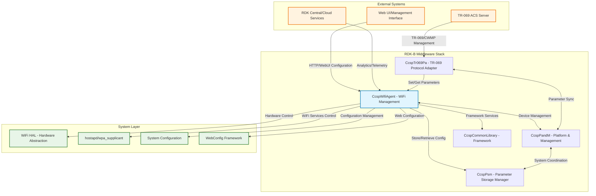
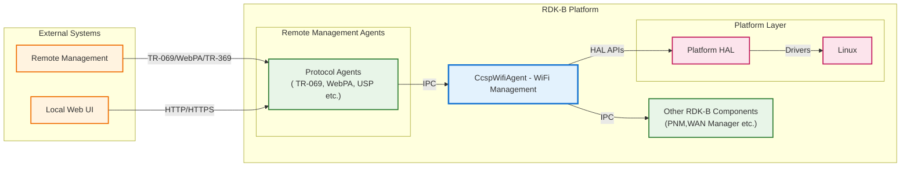
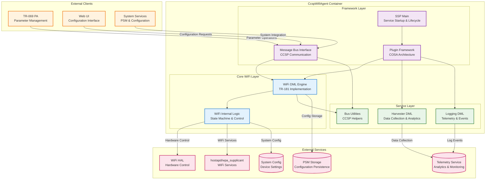
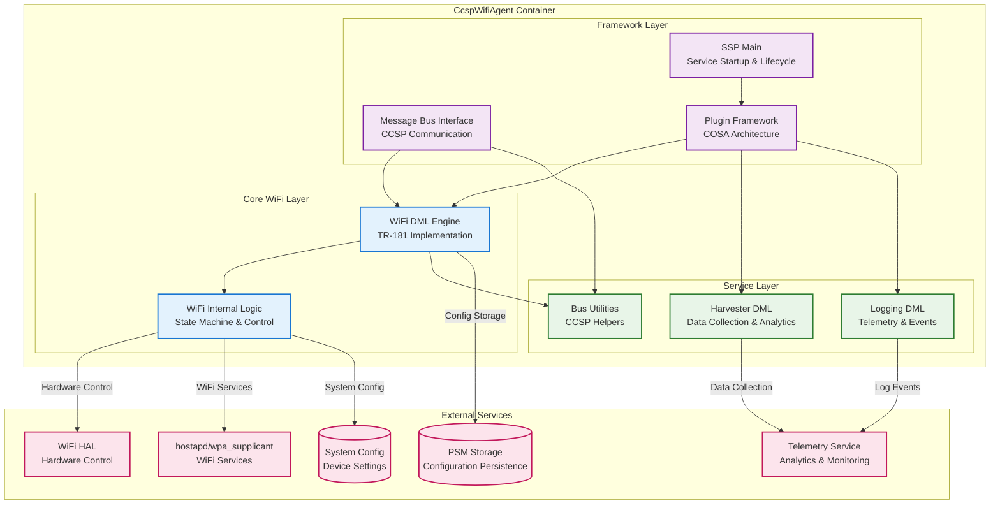
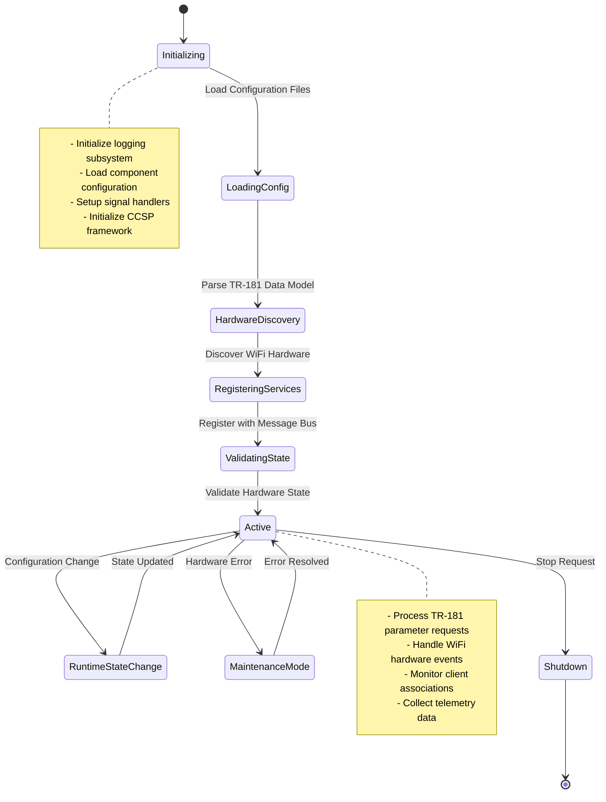
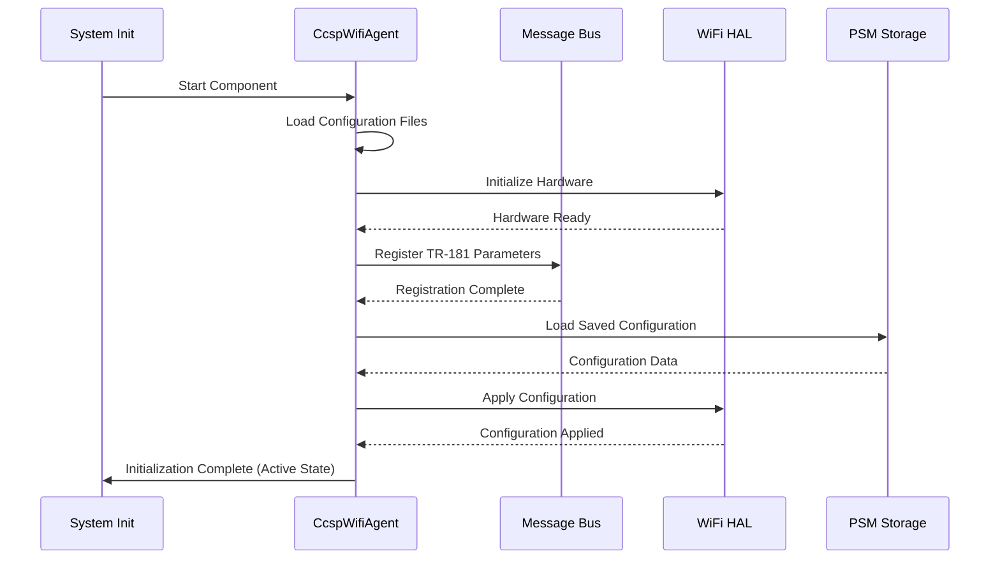
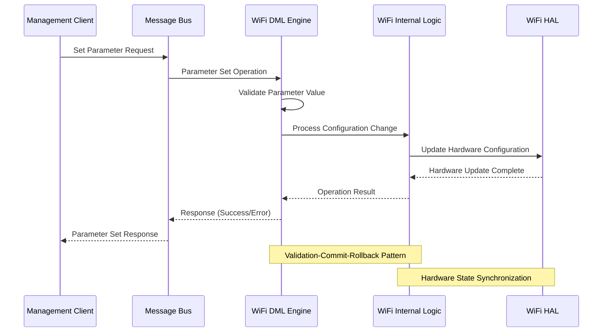
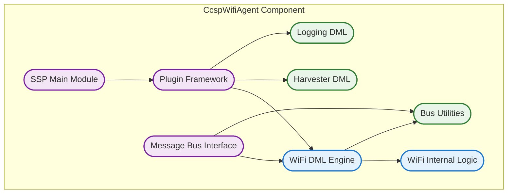
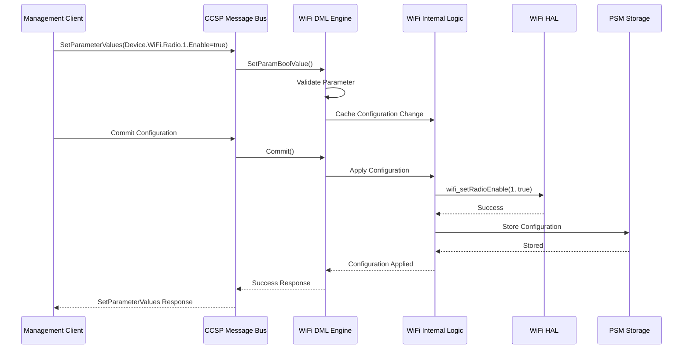
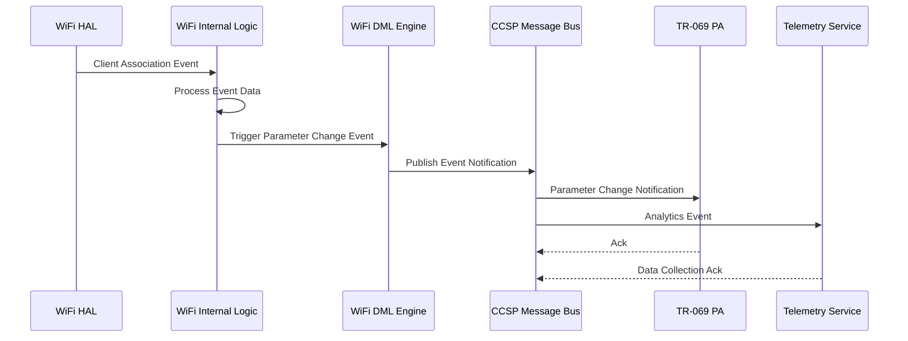

# CcspWifiAgent Documentation

CcspWifiAgent is a WiFi management component in the RDK-B middleware stack that implements the TR-181 Device.WiFi data model and provides complete wireless network configuration, control, and monitoring capabilities. This component serves as the central hub for all WiFi-related operations in RDK-B devices, managing radio interfaces, access points, security configurations, and client associations while providing standardized interfaces for remote management and local device control. CcspWifiAgent abstracts WiFi hardware complexities through the WiFi HAL and provides a standardized TR-181 compliant interface for WiFi parameter management. It enables multi-band radio management, access point configuration, security protocol handling, bandwidth steering, and client device monitoring.

At the system level, CcspWifiAgent provides essential WiFi services to the RDK-B ecosystem by managing wireless infrastructure, enforcing security policies, optimizing network performance through band steering and load balancing, and collecting analytics data for network optimization. The component handles both operational management (real-time control and monitoring) and configuration management (persistent settings and policy enforcement) to deliver enterprise-grade WiFi capabilities in consumer and commercial devices.

**old-to delete**







**Key Features & Responsibilities**: 

- **TR-181 WiFi Data Model Implementation**: Complete implementation of BBF TR-181 Device.WiFi object hierarchy including Radio, SSID, AccessPoint, and associated parameter management with full CRUD operations and validation
- **Multi-Band Radio Management**: Comprehensive control of 2.4GHz, 5GHz, and 6GHz radio interfaces including channel selection, power management, bandwidth configuration, and 802.11 protocol standard management
- **Access Point Configuration**: Full access point lifecycle management including SSID broadcasting, security protocol configuration (WPA2/WPA3/Enterprise), guest network isolation, and MAC filtering capabilities
- **Security Protocol Management**: Implementation of modern WiFi security standards including WPA3, WPA2-Enterprise, certificate-based authentication, and Dynamic WEP key management with secure credential storage
- **Band Steering and Load Balancing**: Intelligent client steering between frequency bands and access points to optimize network performance and distribute client load across available radio resources
- **Client Device Monitoring**: Real-time tracking of connected devices including association/disassociation events, signal strength monitoring, bandwidth utilization, and client capability detection
- **Persistent Configuration Management**: Integration with CCSP PSM for secure storage and retrieval of WiFi configurations with atomic transaction support and configuration rollback capabilities

## Design

CcspWifiAgent is architected as a service-oriented component following the CCSP framework design principles. The component implements a layered architecture that separates concerns between protocol handling, business logic, hardware abstraction, and data persistence. The design emphasizes modularity, extensibility, and standards compliance while providing robust error handling and transaction support for critical WiFi operations.

The core design philosophy centers around the TR-181 data model as the primary interface contract, ensuring that all WiFi functionality is exposed through standardized parameters and objects. This approach enables interoperability with any TR-181 compliant management system while providing a consistent API for local and remote configuration management. The component implements the CCSP data model layer (DML) pattern where each TR-181 object is mapped to specific handler functions that validate, process, and commit parameter changes atomically.

The design incorporates a robust state machine architecture for managing WiFi radio and access point lifecycle operations. State transitions are carefully managed to ensure consistency between configuration changes and hardware states, with comprehensive error recovery mechanisms to handle hardware failures or invalid configurations. The component maintains separation between configuration state (what should be) and operational state (what is) to support both planned configurations and real-time monitoring.

IPC mechanisms are designed around the RBus/CCSP message bus architecture, providing standardized interfaces for inter-component communication. The component registers as both a parameter provider (for TR-181 WiFi objects) and a parameter consumer (for dependencies like system configuration and network settings). Event notifications are published for significant state changes, enabling other components to react to WiFi events without tight coupling.

Data persistence strategy leverages the CCSP PSM (Persistent Storage Manager) for secure configuration storage with support for configuration versioning and rollback operations. The component implements a write-through cache strategy where configuration changes are immediately persisted to prevent data loss during power failures or system crashes. Critical operational data is maintained in memory for performance while being periodically synchronized to persistent storage.

**old - to delete**







### Prerequisites and Dependencies

**RDK-B Platform and Integration Requirements:**

- **Build Dependencies**: meta-rdk-broadband layer, ccsp-common-library recipe, wifi-hal-headers, libxml2, libpthread, and systemd development packages
- **RDK-B Components**: CcspCommonLibrary (framework), CcspPsm (configuration storage), CcspCr (component registry), and message bus infrastructure must be operational
- **HAL Dependencies**: WiFi HAL implementation (wifi_hal.h) with minimum version 3.0 supporting multi-band operations, WPA3, and advanced monitoring capabilities
- **Systemd Services**: rdk-logger.service, and ccsp-msg-bus.service must be active before CcspWifiAgent initialization
- **Message Bus**: RBus/CCSP message bus registration with reserved namespace "eRT.com.cisco.spvtg.ccsp.wifi" and parameter access permissions
- **TR-181 Data Model**: Device.WiFi object hierarchy support from CCSP framework with DML registration and parameter validation infrastructure
- **Configuration Files**: TR181-WiFi-USGv2.XML data model definition, CcspWifi.cfg component configuration, and schema files in /etc/ccsp/
- **Startup Order**: System configuration services, HAL initialization, CCSP message bus, and PSM component must initialize before WiFi agent startup


**Threading Model**

CcspWifiAgent implements a hybrid threading architecture combining event-driven main thread processing with dedicated worker threads for specific high-latency operations. The design balances responsiveness for parameter operations with efficient handling of hardware interactions and background monitoring tasks.

- **Threading Architecture**: Multi-threaded with dedicated threads for specific subsystems and background operations
- **Main Thread**: Handles CCSP message bus operations, TR-181 parameter processing, and component lifecycle management with event-driven processing model
- **Worker Threads**:
  - **Band Steering Thread**: Monitors client associations and implements intelligent band steering algorithms with configurable evaluation intervals
  - **WiFi Monitoring Thread**: Periodic collection of radio statistics, client metrics, and hardware status monitoring with telemetry data aggregation
  - **Configuration Sync Thread**: Handles background synchronization of configuration changes to persistent storage and hardware state validation
  - **Event Processing Thread**: Manages asynchronous WiFi hardware events, client association/disassociation notifications, and state change propagation
- **Synchronization**: Thread-safe parameter access using mutex locks, read-write locks for configuration data, and atomic operations for status flags and counters

### Component State Flow

**Initialization to Active State**

CcspWifiAgent follows a structured initialization sequence that ensures all dependencies are satisfied and the component reaches operational state before accepting configuration requests. The initialization process includes hardware discovery, configuration loading, service registration, and health validation.



**Runtime State Changes and Context Switching**

The component handles multiple operational contexts including normal operation, configuration updates, hardware resets, and error recovery scenarios. State transitions are managed through a centralized state machine that ensures consistency across all operational modes.

**State Change Triggers:**

- **Configuration Updates**: TR-181 parameter changes trigger validation, hardware updates, and state synchronization processes
- **Hardware Events**: Radio state changes, client associations/disassociations, and hardware failures initiate corresponding state transitions
- **Administrative Actions**: Manual radio resets, factory resets, and maintenance mode activation through management interfaces
- **Error Conditions**: Hardware communication failures, configuration validation errors, and resource exhaustion trigger error recovery procedures

**Context Switching Scenarios:**

- **Radio Reset Operations**: Component temporarily suspends normal operations during radio hardware resets and configuration application
- **Firmware Update Mode**: Transitions to limited functionality mode during WiFi firmware updates with graceful service degradation
- **Emergency Recovery**: Automatic fallback to safe configuration mode when critical errors are detected with simplified operational parameters

### Call Flow

**Initialization Call Flow:**



**TR-181 Parameter Operation Call Flow:**



## TR‑181 Data Models

### Supported TR-181 Parameters

CcspWifiAgent implements comprehensive support for the BBF TR-181 Device.WiFi object hierarchy, providing complete wireless network management capabilities through standardized parameter interfaces. The implementation follows TR-181 Issue 2 specifications with RDK-B specific extensions for enhanced functionality and vendor-specific features.

### Object Hierarchy

```
Device.
└── WiFi.
    ├── RadioNumberOfEntries (ulong, R)
    ├── SSIDNumberOfEntries (ulong, R)
    ├── AccessPointNumberOfEntries (ulong, R)
    ├── Radio.{i}.
    │   ├── Enable (boolean, R/W)
    │   ├── Status (string, R)
    │   ├── Name (string, R)
    │   ├── Channel (ulong, R/W)
    │   ├── OperatingFrequencyBand (string, R/W)
    │   ├── TransmitPower (ulong, R/W)
    │   └── Stats.
    │       ├── BytesSent (ulong, R)
    │       └── BytesReceived (ulong, R)
    ├── SSID.{i}.
    │   ├── Enable (boolean, R/W)
    │   ├── Status (string, R)
    │   ├── Name (string, R/W)
    │   ├── SSID (string, R/W)
    │   └── Stats.
    │       ├── BytesSent (ulong, R)
    │       └── BytesReceived (ulong, R)
    ├── AccessPoint.{i}.
    │   ├── Enable (boolean, R/W)
    │   ├── Status (string, R)
    │   ├── Security.
    │   │   ├── ModeEnabled (string, R/W)
    │   │   ├── KeyPassphrase (string, W)
    │   │   └── PreSharedKey (string, W)
    │   ├── AssociatedDeviceNumberOfEntries (ulong, R)
    │   └── AssociatedDevice.{i}.
    │       ├── MACAddress (string, R)
    │       ├── SignalStrength (int, R)
    │       └── LastDataTransmitRate (ulong, R)
    └── X_RDKCENTRAL-COM_Syndication.
        └── WiFiRegion.
            └── Code (string, R/W)
```

### Parameter Definitions

**Core Parameters:**

| Parameter Path | Data Type | Access | Default Value | Description | BBF Compliance |
|----------------|-----------|--------|---------------|-------------|----------------|
| `Device.WiFi.RadioNumberOfEntries` | ulong | R | `2` | Number of WiFi radio interfaces available on the device. Read-only parameter automatically updated based on hardware discovery | TR-181 Issue 2 |
| `Device.WiFi.SSIDNumberOfEntries` | ulong | R | `16` | Total number of SSID instances supported across all radios. Calculated based on hardware capabilities and platform limitations | TR-181 Issue 2 |
| `Device.WiFi.AccessPointNumberOfEntries` | ulong | R | `16` | Total number of access point instances available for configuration. Corresponds to maximum concurrent WiFi networks supported | TR-181 Issue 2 |
| `Device.WiFi.Radio.{i}.Enable` | boolean | R/W | `true` | Enable or disable the radio interface. When disabled, all associated SSIDs and access points are automatically disabled | TR-181 Issue 2 |
| `Device.WiFi.Radio.{i}.Status` | string | R | `"Up"` | Current operational status of the radio: Up, Down, Unknown, Dormant, NotPresent, LowerLayerDown, Error | TR-181 Issue 2 |
| `Device.WiFi.Radio.{i}.Channel` | ulong | R/W | `6` | Current operating channel number. Auto-selection supported with value 0. Valid range depends on regulatory domain and frequency band | TR-181 Issue 2 |
| `Device.WiFi.SSID.{i}.Enable` | boolean | R/W | `false` | Enable or disable the SSID broadcast. When enabled, the network becomes visible and accessible based on security configuration | TR-181 Issue 2 |
| `Device.WiFi.SSID.{i}.SSID` | string[32] | R/W | `""` | Service Set Identifier (network name) broadcast by the access point. Maximum 32 characters with UTF-8 encoding support | TR-181 Issue 2 |
| `Device.WiFi.AccessPoint.{i}.Security.ModeEnabled` | string | R/W | `"WPA2-Personal"` | Security mode: None, WEP-64, WEP-128, WPA-Personal, WPA2-Personal, WPA-WPA2-Personal, WPA2-Enterprise, WPA3-Personal, WPA3-Enterprise | TR-181 Issue 2 |

### Parameter Registration and Access

- **Implemented Parameters**: CcspWifiAgent implements over 200 TR-181 parameters covering complete WiFi functionality including radio management, SSID configuration, security settings, statistics collection, and advanced features like band steering and client monitoring.
- **Parameter Registration**: Parameters are registered with the CCSP message bus during component initialization using the TR181-WiFi-USGv2.XML data model definition. Each parameter is mapped to specific getter/setter functions with validation and commit/rollback support.
- **Access Mechanism**: Other RDK-B components access WiFi parameters via RBus/CCSP message bus using standardized GetParameterValues and SetParameterValues operations. Event notifications are published for significant parameter changes.
- **Validation Rules**: All parameter modifications undergo validation including range checking, dependency validation, and hardware capability verification. Invalid configurations are rejected with appropriate error codes and detailed error messages.

## Internal Modules

CcspWifiAgent is structured as a modular component with distinct functional modules responsible for specific aspects of WiFi management. Each module is designed with clear interfaces and responsibilities, enabling maintainability and extensibility while ensuring proper separation of concerns.

| Module/Class | Description | Key Files |
|-------------|------------|-----------|
| **SSP Main Module** | Service Startup Provider handling component initialization, signal management, and main event loop execution with CCSP framework integration | `ssp_main.c`, `ssp_global.h`, `ssp_internal.h` |
| **WiFi DML Engine** | TR-181 Data Model Layer implementation providing parameter access, validation, and hardware abstraction for all Device.WiFi objects | `cosa_wifi_dml.c`, `cosa_wifi_dml.h` |
| **WiFi Internal Logic** | Core WiFi management logic including state machines, configuration management, and hardware interaction coordination | `cosa_wifi_internal.c`, `cosa_wifi_internal.h` |
| **Message Bus Interface** | CCSP message bus communication handling parameter registration, event publishing, and inter-component communication protocols | `ssp_messagebus_interface.c`, `ssp_messagebus_interface.h` |
| **Plugin Framework** | COSA plugin architecture implementation providing dynamic module loading, DML registration, and component lifecycle management | `plugin_main.c`, `plugin_main_apis.c` |
| **Harvester DML** | Data collection and analytics module managing WiFi statistics, client metrics, and performance monitoring with telemetry integration | `cosa_harvester_dml.c`, `cosa_harvester_internal.h` |
| **Logging DML** | Comprehensive logging and telemetry management providing structured logging, event tracking, and diagnostic information collection | `cosa_logging_dml.c`, `cosa_logging_internal.c` |
| **Bus Utilities** | CCSP framework utility functions providing common bus operations, parameter handling helpers, and error management functions | `cosa_apis_busutil.c`, `cosa_apis_util.c` |



## Component Interactions

CcspWifiAgent serves as a central hub in the RDK-B ecosystem, interacting with multiple components, services, and system layers to provide comprehensive WiFi management capabilities. The component's interaction pattern follows the CCSP framework principles with standardized interfaces and event-driven communication.

### Interaction Matrix

| Target Component/Layer | Interaction Purpose | Key APIs/Endpoints |
|------------------------|-------------------|------------------|
| **RDK-B Middleware Components** |
| CcspTr069Pa | Remote management parameter access and TR-069 protocol support | `GetParameterValues`, `SetParameterValues`, `Device.WiFi.*` |
| CcspPsm | Persistent configuration storage and retrieval for WiFi settings | `PSM_Set_Record_Value2`, `PSM_Get_Record_Value2` |
| CcspPandM | Device management integration and system-level configuration | `Device.WiFi.X_*`, System status events |
| CcspCommonLibrary | CCSP framework services and utility functions | `CcspBaseIf_*`, `AnscAllocateMemory`, `AnscFreeMemory` |
| **System & HAL Layers** |
| WiFi HAL | Low-level WiFi hardware control and status monitoring | `wifi_getRadioEnable()`, `wifi_setSSIDName()`, `wifi_getApAssociatedDevices()` |
| System Configuration | Device-level configuration management and syscfg integration | `syscfg_get()`, `syscfg_set()`, `/opt/secure/wifi/` |
| hostapd/wpa_supplicant | WiFi authentication services and access point management | `/tmp/hostapd.conf`, `/var/run/hostapd/` |


**Events Published by CcspWifiAgent:**

| Event Name | Event Topic/Path | Trigger Condition | Subscriber Components |
|------------|-----------------|------------------|---------------------|
| WiFi_Radio_Status_Changed | `Device.WiFi.Radio.{i}.Status` | Radio enable/disable or hardware state change | CcspTr069Pa, Management interfaces, Telemetry |
| WiFi_Client_Associated | `Device.WiFi.AccessPoint.{i}.AssociatedDevice` | New client device association | Network monitoring, Analytics, Client management |
| WiFi_Config_Changed | `Device.WiFi.*` parameter changes | Configuration parameter modifications | PSM storage, Management interfaces, Audit logging |
| WiFi_Security_Event | `X_RDKCENTRAL-COM_WiFi_Security` | Security-related events (authentication failures, intrusion attempts) | Security monitoring, Telemetry, Log aggregation |


**Events Consumed by CcspWifiAgent:**

| Event Source | Event Topic/Path | Purpose | Handler Function |
|-------------|-----------------|---------|-----------------|
| System Configuration | `Device.X_CISCO_COM_DeviceControl.FactoryReset` | Respond to factory reset operations | `WiFi_HandleFactoryReset()` |
| Network Manager | `Device.IP.Interface.{i}.Status` | React to network interface status changes | `WiFi_HandleNetworkChange()` |
| Time Service | `Device.Time.Status` | Synchronize WiFi operations with system time | `WiFi_HandleTimeSync()` |


### IPC Flow Patterns

**Primary IPC Flow - Parameter Configuration:**



**Event Notification Flow:**



## Implementation Details

### Major HAL APIs Integration

CcspWifiAgent integrates extensively with the WiFi Hardware Abstraction Layer (HAL) to provide standardized hardware control while abstracting platform-specific implementations. The HAL integration covers radio management, access point control, security configuration, and client monitoring.

**Core HAL APIs:**

| HAL API | Purpose | Implementation File |
|---------|---------|-------------------|
| `wifi_getRadioEnable` | Get radio interface enable status | `cosa_wifi_dml.c` |
| `wifi_setRadioEnable` | Enable or disable radio interface | `cosa_wifi_dml.c` |
| `wifi_getSSIDName` | Retrieve SSID name for access point | `cosa_wifi_dml.c` |
| `wifi_setSSIDName` | Configure SSID name for access point | `cosa_wifi_dml.c` |
| `wifi_getApSecurityModeEnabled` | Get current security mode configuration | `cosa_wifi_dml.c` |
| `wifi_setApSecurityModeEnabled` | Configure security mode (WPA2/WPA3/etc) | `cosa_wifi_dml.c` |
| `wifi_getApAssociatedDevices` | Get list of connected client devices | `cosa_wifi_dml.c` |
| `wifi_getRadioChannel` | Get current operating channel | `cosa_wifi_dml.c` |
| `wifi_setRadioChannel` | Set radio operating channel | `cosa_wifi_dml.c` |
| `wifi_pushBridgeInfo` | Apply bridge configuration changes | `cosa_wifi_internal.c` |


### Key Implementation Logic

- **WiFi State Machine Engine**: Core state management logic implemented in `cosa_wifi_internal.c` managing radio lifecycle, access point states, and client association tracking. State transition validation ensuring hardware and configuration consistency. Error recovery mechanisms for hardware communication failures. Atomic configuration updates with rollback support for failed operations. State transition handlers managing radio enable/disable sequences and access point lifecycle.

- **TR-181 Parameter Processing**: Comprehensive parameter validation and processing engine in `cosa_wifi_dml.c`. Multi-stage validation including syntax checking, range validation, and dependency verification. Commit/rollback transaction support for atomic configuration changes. Hardware capability validation ensuring parameters match device capabilities. Asynchronous parameter processing for long-running hardware operations.

- **Error Handling Strategy**: Robust error detection and recovery mechanisms throughout the component. Hardware communication error detection with automatic retry logic. Configuration validation errors with detailed error reporting and suggested corrections. Timeout handling for hardware operations with progressive retry intervals. Graceful degradation for non-critical failures maintaining essential functionality.

- **Client Monitoring and Analytics**: Real-time client device tracking and performance monitoring. Continuous monitoring of client associations, signal strength, and data usage. Band steering algorithm implementation for optimal client distribution. Telemetry data collection and aggregation for network analytics. Event-driven client state tracking with efficient data structures.

- **Logging & Debugging**: Comprehensive logging infrastructure with configurable verbosity levels. Structured logging with component identification and correlation IDs. Debug trace support for hardware interactions and state transitions. Performance monitoring with timing measurements for critical operations. Debug hooks for troubleshooting WiFi connectivity and configuration issues.

### Key Configuration Files

| Configuration File | Purpose | Override Mechanisms |
|--------------------|---------|---------------------|
| `TR181-WiFi-USGv2.XML` | TR-181 data model definition and DML mapping | Compile-time customization |
| `CcspWifi.cfg` | Component configuration and CCSP registration | Environment variables |
| `ccspwifiagent.service` | Systemd service definition | Systemd override files |
| `/tmp/hostapd.conf` | Dynamic hostapd configuration | Direct file modification |
